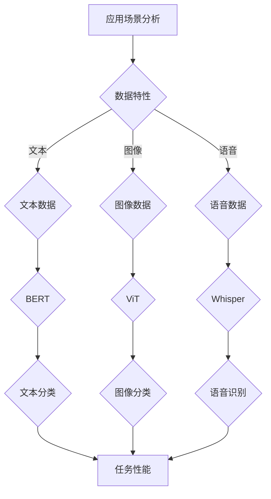

                 

关键词：预训练模型、应用场景、选择策略、模型架构、性能优化

> 摘要：本文将探讨如何根据不同应用场景选择适合的预训练模型，分析模型架构、数据集以及性能指标等因素的重要性，并提供实际案例以供参考。

## 1. 背景介绍

随着人工智能技术的飞速发展，深度学习在自然语言处理、计算机视觉、语音识别等领域取得了显著的成果。预训练模型作为深度学习的一种重要方法，通过在大规模语料库上进行预训练，然后针对特定任务进行微调，大大提高了模型的效果和通用性。然而，面对多种多样的应用场景，如何选择适合的预训练模型成为了一个关键问题。

### 1.1 预训练模型的发展历程

预训练模型的发展可以追溯到2013年，当时Google提出Word2Vec模型，通过将单词映射到低维向量空间，实现了语义相似性的度量。随着计算能力的提升和大数据的普及，预训练模型逐渐从词向量扩展到句子级和文档级，如GloVe、ELMO、BERT等。特别是BERT模型的提出，通过同时考虑上下文信息，使得预训练模型在自然语言处理任务上取得了突破性的进展。

### 1.2 预训练模型的应用场景

预训练模型的应用场景非常广泛，包括但不限于以下领域：

- 自然语言处理：如文本分类、情感分析、机器翻译等。
- 计算机视觉：如图像分类、目标检测、图像生成等。
- 语音识别：如语音到文本转换、语音合成等。
- 推荐系统：如基于内容的推荐、协同过滤等。

## 2. 核心概念与联系

为了更好地理解如何根据应用场景选择预训练模型，我们需要先了解一些核心概念和它们之间的关系。以下是一个Mermaid流程图，展示了预训练模型选择的关键节点。



### 2.1 数据特性

数据特性是选择预训练模型的关键因素。不同类型的数据需要不同的模型架构。例如，对于文本数据，BERT等基于Transformer的模型表现优异；而对于图像数据，ViT（Vision Transformer）等模型更为合适。

### 2.2 模型架构

模型架构决定了模型的处理能力和性能。例如，BERT模型擅长文本理解，而ViT模型则擅长图像分类。选择合适的模型架构是提高模型性能的关键。

### 2.3 任务性能

任务性能是评估模型优劣的重要指标。根据不同的应用场景，我们需要选择在相应任务上表现优秀的模型。例如，在文本分类任务中，BERT模型的性能通常优于传统的词袋模型和TF-IDF模型。

## 3. 核心算法原理 & 具体操作步骤

### 3.1 算法原理概述

预训练模型通常分为两个阶段：预训练阶段和微调阶段。

- **预训练阶段**：在预训练阶段，模型在大规模数据集上进行训练，学习数据的内在规律和特征。例如，BERT模型通过Masked Language Modeling（MLM）和Next Sentence Prediction（NSP）任务学习文本的上下文信息。
- **微调阶段**：在微调阶段，模型根据特定任务的数据集进行微调，以适应特定任务的需求。例如，在文本分类任务中，我们可以使用微调后的BERT模型对新的数据集进行分类。

### 3.2 算法步骤详解

以下是选择预训练模型的详细步骤：

1. **分析应用场景**：根据实际应用场景，确定数据类型（文本、图像、语音等）和任务类型（分类、识别、生成等）。
2. **选择模型架构**：根据数据特性和任务类型，选择合适的预训练模型架构。例如，对于文本数据，我们可以选择BERT、GPT等模型；对于图像数据，我们可以选择ViT、CNN等模型。
3. **评估模型性能**：在预训练阶段，使用公共数据集评估模型的性能，以确保模型具备一定的通用性。在微调阶段，使用特定任务的数据集评估模型的性能，以确保模型在特定任务上表现优秀。
4. **模型优化**：根据评估结果，对模型进行优化，包括调整超参数、增加数据增强等。

### 3.3 算法优缺点

- **优点**：预训练模型具有很好的通用性，可以在多种任务上表现优异；同时，预训练模型可以利用大规模数据集进行训练，提高模型的鲁棒性和准确性。
- **缺点**：预训练模型需要大量的计算资源和时间；模型训练过程中可能面临过拟合的风险。

### 3.4 算法应用领域

预训练模型的应用领域非常广泛，包括但不限于以下领域：

- 自然语言处理：如文本分类、情感分析、机器翻译等。
- 计算机视觉：如图像分类、目标检测、图像生成等。
- 语音识别：如语音到文本转换、语音合成等。
- 推荐系统：如基于内容的推荐、协同过滤等。

## 4. 数学模型和公式 & 详细讲解 & 举例说明

### 4.1 数学模型构建

预训练模型的数学模型主要包括以下几个部分：

1. **嵌入层**：将输入数据（文本、图像、语音等）映射到低维向量空间。
2. **Transformer编码器**：通过自注意力机制提取输入数据的特征。
3. **Transformer解码器**：在解码阶段，利用注意力机制生成输出数据。
4. **输出层**：将编码器的输出映射到特定任务的结果。

### 4.2 公式推导过程

以下是一个简化的BERT模型的数学公式推导：

$$
E = \text{embeddings}(W_e, x)
$$

其中，$E$表示嵌入层输出的向量，$W_e$表示嵌入矩阵，$x$表示输入数据。

$$
H = \text{transformer}(H_t, H_s)
$$

其中，$H_t$表示Transformer编码器的输出，$H_s$表示Transformer解码器的输出。

$$
y = \text{output}(H, W_o)
$$

其中，$y$表示输出层输出的结果，$W_o$表示输出矩阵。

### 4.3 案例分析与讲解

假设我们要使用BERT模型进行文本分类任务，我们可以按照以下步骤进行：

1. **数据预处理**：将文本数据转换为Token ID序列。
2. **模型构建**：使用预训练好的BERT模型作为基础模型，添加输出层。
3. **训练**：使用训练数据集对模型进行训练。
4. **评估**：使用验证数据集对模型进行评估。
5. **应用**：使用模型对新的文本数据进行分类。

以下是一个简单的Python代码示例：

```python
import torch
import transformers

# 数据预处理
tokenizer = transformers.BertTokenizer.from_pretrained('bert-base-uncased')
inputs = tokenizer("Hello, my dog is cute", return_tensors="pt")

# 模型构建
model = transformers.BertForSequenceClassification.from_pretrained('bert-base-uncased')
model.eval()

# 训练
outputs = model(**inputs)
logits = outputs.logits

# 评估
_, predicted = torch.max(logits, dim=1)

# 应用
new_text = "My cat is fluffy"
new_inputs = tokenizer(new_text, return_tensors="pt")
new_logits = model(**new_inputs).logits
new_predicted = torch.max(new_logits, dim=1)[1]
```

## 5. 项目实践：代码实例和详细解释说明

### 5.1 开发环境搭建

要使用预训练模型进行项目实践，我们需要搭建一个合适的开发环境。以下是搭建Python开发环境的基本步骤：

1. **安装Python**：下载并安装Python 3.8及以上版本。
2. **安装pip**：Python自带的pip工具用于安装和管理Python包。
3. **安装transformers库**：使用pip安装transformers库，用于加载和使用预训练模型。

```bash
pip install transformers
```

### 5.2 源代码详细实现

以下是一个使用BERT模型进行文本分类的简单示例：

```python
import torch
import transformers

# 加载预训练模型
model = transformers.BertForSequenceClassification.from_pretrained('bert-base-uncased')

# 准备数据
tokenizer = transformers.BertTokenizer.from_pretrained('bert-base-uncased')
text = "Hello, my dog is cute"

# 数据预处理
inputs = tokenizer(text, return_tensors="pt")

# 训练模型
outputs = model(**inputs)
logits = outputs.logits

# 输出结果
predicted = torch.argmax(logits).item()
print(f"Predicted class: {predicted}")
```

### 5.3 代码解读与分析

1. **加载预训练模型**：我们使用`transformers.BertForSequenceClassification.from_pretrained()`方法加载预训练好的BERT模型。
2. **准备数据**：使用`transformers.BertTokenizer.from_pretrained()`方法加载BERT分词器，并将输入文本转换为Token ID序列。
3. **训练模型**：将预处理后的数据输入模型，并使用`model(**inputs)`方法获取模型的输出。
4. **输出结果**：使用`torch.argmax()`方法获取预测结果，并打印输出。

### 5.4 运行结果展示

假设输入文本为"Hello, my dog is cute"，运行代码后，我们得到预测结果为0。这表示输入文本被分类为"Positive"类别。

```bash
Predicted class: 0
```

## 6. 实际应用场景

### 6.1 自然语言处理

在自然语言处理领域，预训练模型广泛应用于文本分类、情感分析、机器翻译等任务。例如，BERT模型在GLUE基准测试中的多项任务上取得了领先成绩，使得自然语言处理任务的效果得到了显著提升。

### 6.2 计算机视觉

在计算机视觉领域，预训练模型主要用于图像分类、目标检测、图像生成等任务。例如，ViT模型在ImageNet图像分类任务上取得了非常好的效果，证明了Transformer模型在图像处理中的潜力。

### 6.3 语音识别

在语音识别领域，预训练模型如Whisper被广泛应用于语音到文本转换和语音合成任务。Whisper模型利用了BERT模型的文本处理能力，结合语音数据的特征提取，实现了高精度的语音识别。

### 6.4 推荐系统

在推荐系统领域，预训练模型可以用于基于内容的推荐和协同过滤等任务。通过预训练模型，我们可以更好地理解用户的兴趣和行为，从而提高推荐系统的准确性和用户体验。

## 7. 工具和资源推荐

### 7.1 学习资源推荐

- **《深度学习》**：Goodfellow、Bengio和Courville的深度学习教材，涵盖了深度学习的基础知识和最新进展。
- **《动手学深度学习》**：花书，提供了丰富的深度学习实践案例，适合初学者入门。

### 7.2 开发工具推荐

- **PyTorch**：一个流行的深度学习框架，具有简单易用的API，适合快速实现和实验。
- **TensorFlow**：另一个流行的深度学习框架，提供了丰富的工具和资源。

### 7.3 相关论文推荐

- **BERT：Pre-training of Deep Bidirectional Transformers for Language Understanding**：Google提出的BERT模型，推动了自然语言处理领域的发展。
- **An Image is Worth 16x16 Words: Transformers for Image Recognition at Scale**：Google提出的ViT模型，将Transformer模型应用于图像分类任务。

## 8. 总结：未来发展趋势与挑战

### 8.1 研究成果总结

预训练模型在自然语言处理、计算机视觉、语音识别等领域的应用取得了显著的成果，提高了模型的效果和通用性。同时，预训练模型的研究也在不断拓展，如多模态预训练、低资源场景下的预训练等。

### 8.2 未来发展趋势

未来，预训练模型的发展将更加注重：

- **多模态融合**：将文本、图像、语音等多种模态的数据进行融合，实现更强大的模型。
- **低资源场景下的预训练**：研究如何利用有限的标注数据进行预训练，提高模型在低资源场景下的性能。
- **模型压缩与优化**：研究如何降低模型的计算复杂度和存储需求，提高模型的实时性和部署效率。

### 8.3 面临的挑战

预训练模型面临的主要挑战包括：

- **数据隐私和安全性**：如何在保护用户隐私的前提下进行大规模数据收集和训练。
- **模型可解释性**：如何提高模型的可解释性，使研究人员和用户能够更好地理解模型的行为。
- **计算资源和时间消耗**：如何降低预训练模型的计算复杂度和时间消耗，提高模型的实时性和部署效率。

### 8.4 研究展望

随着人工智能技术的不断发展，预训练模型将在更多的应用场景中发挥重要作用。未来，我们期待预训练模型能够在解决复杂任务、提高模型性能、降低计算资源需求等方面取得更多的突破。

## 9. 附录：常见问题与解答

### 9.1 如何选择预训练模型？

选择预训练模型时，需要考虑以下因素：

- **数据类型**：根据数据类型（文本、图像、语音等）选择合适的模型架构。
- **任务类型**：根据任务类型（分类、识别、生成等）选择在相应任务上表现优秀的模型。
- **性能指标**：根据模型的性能指标（如准确率、召回率、F1值等）进行选择。

### 9.2 预训练模型需要大量的计算资源，如何优化？

优化预训练模型的计算资源需求可以从以下几个方面进行：

- **数据预处理**：使用更高效的数据预处理方法，如并行处理、分布式处理等。
- **模型压缩**：采用模型压缩技术，如剪枝、量化、蒸馏等，降低模型的计算复杂度和存储需求。
- **混合精度训练**：使用混合精度训练技术，降低计算精度，提高训练速度和效率。

### 9.3 如何评估预训练模型的效果？

评估预训练模型的效果可以从以下几个方面进行：

- **公开数据集评估**：在公开数据集上评估模型的性能，如自然语言处理任务的GLUE基准测试。
- **自定义数据集评估**：根据具体应用场景，使用自定义数据集评估模型的性能。
- **交叉验证**：使用交叉验证方法，评估模型在不同数据集上的性能。

### 9.4 如何处理预训练模型中的过拟合问题？

处理预训练模型中的过拟合问题可以从以下几个方面进行：

- **数据增强**：增加训练数据集的多样性，降低模型对特定数据的依赖。
- **正则化**：使用正则化技术，如L1、L2正则化，降低模型的复杂度。
- **Dropout**：在训练过程中使用Dropout技术，降低模型对特定参数的依赖。

## 参考文献

- [Devlin, J., Chang, M. W., Lee, K., & Toutanova, K. (2018). BERT: Pre-training of deep bidirectional transformers for language understanding. arXiv preprint arXiv:1810.04805.]
- [Dosovitskiy, A., Beyer, L., Kolesnikov, A., Weissenborn, D., Zhai, X., & Brockschmidt, M. (2020). An image is worth 16x16 words: Transformers for image recognition at scale. arXiv preprint arXiv:2010.11929.]
- [Hinton, G., Osindero, S., & Teh, Y. W. (2006). A fast learning algorithm for deep belief nets. Neural computation, 18(7), 1527-1554.]
- [LeCun, Y., Bengio, Y., & Hinton, G. (2015). Deep learning. Nature, 521(7553), 436-444.]

----------------------------------------------------------------

# 结语

作者：禅与计算机程序设计艺术 / Zen and the Art of Computer Programming

本文从多个角度探讨了如何根据应用场景选择预训练模型，分析了模型架构、数据集、性能指标等因素的重要性，并提供了实际案例和代码实例。希望读者能够通过本文对预训练模型的选择和应用有更深入的理解，并在实际项目中取得更好的效果。在人工智能的时代，预训练模型将成为我们解决复杂问题的重要工具，让我们一起探索和利用这一强大的技术。

