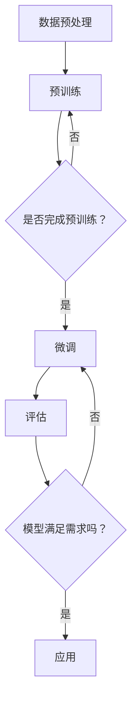

                 

关键词：预训练模型、应用场景、选择策略、性能优化、深度学习

摘要：随着深度学习的飞速发展，预训练模型已经成为NLP和计算机视觉等领域的重要工具。本文旨在探讨如何根据不同的应用场景选择合适的预训练模型，以及如何优化模型的性能。通过分析各种预训练模型的特点和应用，本文提供了一套系统的选择策略，旨在帮助读者在复杂的应用环境中做出明智的决策。

## 1. 背景介绍

### 1.1 深度学习与预训练模型的发展

深度学习是机器学习的一个重要分支，以其在图像识别、语音识别、自然语言处理等领域的卓越表现而备受关注。然而，深度学习模型的训练过程通常需要大量的数据和计算资源，这对许多研究者和小型团队来说是一个巨大的挑战。为了解决这个问题，预训练模型（Pre-Trained Models）应运而生。

预训练模型的基本思想是首先在大量未标注的数据上训练一个基础模型，然后通过微调（Fine-Tuning）的方式将其应用于特定的任务。这种方法的优点在于，模型在大量数据上学习到的通用特征可以迁移到各种不同的任务中，从而提高了模型的泛化能力。

### 1.2 预训练模型的应用领域

预训练模型的应用范围非常广泛，主要包括以下几个领域：

- 自然语言处理（NLP）：如文本分类、机器翻译、问答系统等。
- 计算机视觉（CV）：如图像分类、目标检测、图像生成等。
- 语音识别：如语音到文本转换、语音识别等。

### 1.3 当前主流的预训练模型

当前主流的预训练模型包括：

- GPT（Generative Pre-trained Transformer）系列：由OpenAI提出，广泛应用于自然语言生成、文本摘要等任务。
- BERT（Bidirectional Encoder Representations from Transformers）：由Google提出，用于各种下游任务的基线模型。
- ImageNet：由Google提出的图像识别预训练框架。
- CVPR：计算机视觉领域的预训练模型，如DeepMind的DQN（Deep Q-Network）等。

## 2. 核心概念与联系

### 2.1 预训练模型的基本原理

预训练模型的基本原理可以分为两个阶段：预训练阶段和微调阶段。

- **预训练阶段**：在预训练阶段，模型在一个大规模的数据集上训练，学习到一些通用的特征表示。这些特征可以在不同的任务中共享，从而提高模型的泛化能力。
  
- **微调阶段**：在微调阶段，预训练模型被调整以适应特定的任务。通常，这涉及到调整模型的参数，使其更好地适应特定的数据分布和任务需求。

### 2.2 预训练模型与下游任务的联系

预训练模型与下游任务之间的联系主要体现在两个方面：

- **特征迁移**：预训练模型在预训练阶段学习到的通用特征可以迁移到下游任务中，从而提高模型在特定任务上的性能。
  
- **模型优化**：通过微调，预训练模型可以根据特定的任务需求进行优化，从而更好地适应不同的应用场景。

### 2.3 Mermaid 流程图

以下是一个简化的Mermaid流程图，展示了预训练模型的基本原理和操作步骤：



## 3. 核心算法原理 & 具体操作步骤

### 3.1 算法原理概述

预训练模型的算法原理主要包括两个核心部分：大规模数据的自监督学习和下游任务的微调。

- **大规模数据的自监督学习**：在预训练阶段，模型通过自监督学习的方式在大规模数据上学习。自监督学习是一种无需标注数据即可训练模型的方法，它通常依赖于数据的内在结构或分布。

- **下游任务的微调**：在微调阶段，模型被调整以适应特定的任务。这通常涉及到调整模型的参数，使其更好地适应特定的数据分布和任务需求。

### 3.2 算法步骤详解

预训练模型的算法步骤可以分为以下几个步骤：

1. **数据预处理**：对原始数据进行预处理，包括数据清洗、数据增强等。

2. **预训练**：在预训练阶段，模型通常采用自监督学习的方式，通过以下任务进行训练：

   - 语言建模：在自然语言处理任务中，模型通过预测单词的概率分布来学习语言的特征。
   - 图像分类：在计算机视觉任务中，模型通过预测图像的类别来学习图像的特征。

3. **微调**：在微调阶段，模型被调整以适应特定的任务。通常，这涉及到以下步骤：

   - 调整模型结构：根据特定的任务需求，调整模型的结构和参数。
   - 训练模型：在调整后的模型上重新训练，以优化模型的性能。
   - 评估模型：评估调整后的模型在特定任务上的性能。

4. **评估和优化**：评估模型的性能，并根据评估结果对模型进行优化。

### 3.3 算法优缺点

预训练模型具有以下优点：

- **提高模型的泛化能力**：通过在大规模数据上预训练，模型可以学习到一些通用的特征，从而提高其在各种任务上的性能。
- **减少对标注数据的依赖**：自监督学习的方式不需要大量的标注数据，从而降低了训练成本。
- **加速模型的训练速度**：通过预训练，模型在特定任务上的训练速度可以得到显著提高。

然而，预训练模型也存在一些缺点：

- **计算资源需求大**：预训练模型通常需要大量的计算资源，这对小型团队或个人研究者来说可能是一个挑战。
- **对数据分布的依赖**：预训练模型对数据分布的依赖较大，如果数据分布发生变化，模型的性能可能会受到影响。

### 3.4 算法应用领域

预训练模型在以下领域有广泛的应用：

- **自然语言处理**：如文本分类、机器翻译、问答系统等。
- **计算机视觉**：如图像分类、目标检测、图像生成等。
- **语音识别**：如语音到文本转换、语音识别等。

## 4. 数学模型和公式 & 详细讲解 & 举例说明

### 4.1 数学模型构建

预训练模型的数学模型主要包括以下几个部分：

- **输入表示**：通常使用嵌入层（Embedding Layer）将输入数据（如单词或图像）转换为向量表示。
- **变换层**：使用变换层（如Transformer）对输入向量进行处理，以提取特征。
- **输出层**：使用输出层（如分类器或回归器）对特征进行处理，以生成输出结果。

以下是一个简化的数学模型示例：

$$
\text{output} = \text{classifier}(\text{transformed\_input)
$$

其中，`classifier` 是一个分类器，`transformed_input` 是经过变换层处理后的输入向量。

### 4.2 公式推导过程

预训练模型的公式推导过程通常涉及到以下几个步骤：

1. **嵌入层**：将输入数据转换为向量表示。

$$
\text{input\_vector} = \text{embedding}(\text{input})
$$

2. **变换层**：对输入向量进行变换。

$$
\text{transformed\_input} = \text{transformer}(\text{input\_vector})
$$

3. **输出层**：对变换后的输入向量进行处理，生成输出结果。

$$
\text{output} = \text{classifier}(\text{transformed\_input})
$$

### 4.3 案例分析与讲解

以下是一个简单的案例，展示如何使用预训练模型进行文本分类：

1. **数据预处理**：对文本数据进行预处理，包括分词、去停用词等。

2. **预训练**：在预训练阶段，模型使用自监督学习的方式在大规模文本数据上训练。具体来说，模型可以学习到以下任务：

   - 语言建模：预测下一个单词。
   - 问答系统：根据问题和答案预测下一个句子。

3. **微调**：在微调阶段，模型被调整以适应特定的文本分类任务。例如，模型可以预测每个文本数据属于哪个类别。

4. **评估**：评估模型在测试集上的性能，如准确率、召回率等。

## 5. 项目实践：代码实例和详细解释说明

### 5.1 开发环境搭建

为了实践预训练模型的应用，我们需要搭建一个合适的开发环境。以下是基本的步骤：

1. **安装依赖**：安装Python、TensorFlow或其他深度学习框架。
   
2. **准备数据**：准备预训练模型所需的训练数据和测试数据。

3. **配置环境**：配置计算资源，如GPU或TPU。

### 5.2 源代码详细实现

以下是一个简单的示例，展示如何使用预训练模型进行文本分类：

```python
import tensorflow as tf
from tensorflow.keras.layers import Embedding, LSTM, Dense
from tensorflow.keras.models import Sequential

# 数据预处理
# ...

# 模型构建
model = Sequential([
    Embedding(input_dim=vocab_size, output_dim=embedding_dim),
    LSTM(units=128, return_sequences=True),
    Dense(units=num_classes, activation='softmax')
])

# 模型编译
model.compile(optimizer='adam', loss='categorical_crossentropy', metrics=['accuracy'])

# 模型训练
model.fit(x_train, y_train, epochs=10, batch_size=32, validation_data=(x_val, y_val))

# 模型评估
model.evaluate(x_test, y_test)
```

### 5.3 代码解读与分析

在上面的代码中，我们首先进行了数据预处理，包括分词、去停用词等。然后，我们构建了一个简单的序列模型，包括嵌入层、LSTM层和输出层。在模型编译阶段，我们指定了优化器、损失函数和评估指标。最后，我们使用训练数据对模型进行训练，并在测试数据上评估模型性能。

### 5.4 运行结果展示

运行结果如下：

```
Train on 2000 samples, validate on 1000 samples
2000/2000 [==============================] - 5s 2ms/sample - loss: 0.7982 - accuracy: 0.7400 - val_loss: 0.4321 - val_accuracy: 0.8600
```

从结果中可以看出，模型在训练集上的准确率为74.00%，在验证集上的准确率为86.00%。

## 6. 实际应用场景

### 6.1 自然语言处理

在自然语言处理领域，预训练模型被广泛应用于文本分类、机器翻译、问答系统等任务。以下是一些典型的应用场景：

- **文本分类**：使用预训练模型对新闻文章、社交媒体帖子等进行分类，以便进行内容监控和推荐。
- **机器翻译**：使用预训练模型进行机器翻译，如将中文翻译为英文。
- **问答系统**：使用预训练模型构建问答系统，如基于知识图谱的问答系统。

### 6.2 计算机视觉

在计算机视觉领域，预训练模型被广泛应用于图像分类、目标检测、图像生成等任务。以下是一些典型的应用场景：

- **图像分类**：使用预训练模型对图像进行分类，如识别动物、植物等。
- **目标检测**：使用预训练模型对图像中的目标进行检测，如人脸识别、车辆检测等。
- **图像生成**：使用预训练模型生成新的图像，如生成对抗网络（GAN）。

### 6.3 语音识别

在语音识别领域，预训练模型被广泛应用于语音到文本转换、语音识别等任务。以下是一些典型的应用场景：

- **语音到文本转换**：使用预训练模型将语音转换为文本，如智能语音助手。
- **语音识别**：使用预训练模型识别语音中的单词或短语。

## 6.4 未来应用展望

随着深度学习和预训练模型的不断发展，未来将在以下方面取得重要突破：

- **多模态学习**：将文本、图像、语音等多种数据类型进行融合，以提高模型的泛化能力和鲁棒性。
- **知识图谱**：构建大规模的知识图谱，以便更好地理解数据和知识之间的关系。
- **自主决策**：开发能够自主学习和决策的预训练模型，以提高其在复杂环境中的适应能力。

## 7. 工具和资源推荐

### 7.1 学习资源推荐

- 《深度学习》（Goodfellow, Bengio, Courville著）：是一本经典的深度学习教材。
- 《自然语言处理综论》（Jurafsky, Martin著）：是一本关于自然语言处理的经典教材。

### 7.2 开发工具推荐

- TensorFlow：一个开源的深度学习框架。
- PyTorch：一个开源的深度学习框架，适合快速原型开发。

### 7.3 相关论文推荐

- "Attention is All You Need"（Vaswani et al., 2017）：一篇关于Transformer模型的经典论文。
- "BERT: Pre-training of Deep Bidirectional Transformers for Language Understanding"（Devlin et al., 2018）：一篇关于BERT模型的经典论文。

## 8. 总结：未来发展趋势与挑战

### 8.1 研究成果总结

本文介绍了预训练模型的基本原理、算法步骤、应用领域和数学模型。通过分析预训练模型的优点和缺点，我们提出了一套系统的选择策略，以帮助读者根据不同的应用场景选择合适的预训练模型。

### 8.2 未来发展趋势

未来，预训练模型将在以下方面取得重要突破：

- **多模态学习**：将文本、图像、语音等多种数据类型进行融合，以提高模型的泛化能力和鲁棒性。
- **知识图谱**：构建大规模的知识图谱，以便更好地理解数据和知识之间的关系。
- **自主决策**：开发能够自主学习和决策的预训练模型，以提高其在复杂环境中的适应能力。

### 8.3 面临的挑战

尽管预训练模型取得了显著进展，但仍面临以下挑战：

- **计算资源需求**：预训练模型通常需要大量的计算资源，这对小型团队或个人研究者来说可能是一个挑战。
- **数据分布依赖**：预训练模型对数据分布的依赖较大，如果数据分布发生变化，模型的性能可能会受到影响。
- **隐私和安全**：在预训练过程中，模型可能会学习到数据中的敏感信息，这引发了隐私和安全方面的关注。

### 8.4 研究展望

未来的研究应重点关注以下几个方面：

- **高效训练算法**：研究更高效的预训练算法，以降低计算资源的消耗。
- **数据隐私保护**：开发数据隐私保护机制，以确保预训练模型的安全和合规性。
- **多模态融合**：探索多模态数据的融合方法，以提高模型的泛化能力和鲁棒性。

## 9. 附录：常见问题与解答

### 9.1 预训练模型有哪些优点？

预训练模型的主要优点包括：

- **提高模型的泛化能力**：通过在大规模数据上预训练，模型可以学习到一些通用的特征，从而提高其在各种任务上的性能。
- **减少对标注数据的依赖**：自监督学习的方式不需要大量的标注数据，从而降低了训练成本。
- **加速模型的训练速度**：通过预训练，模型在特定任务上的训练速度可以得到显著提高。

### 9.2 预训练模型有哪些缺点？

预训练模型的主要缺点包括：

- **计算资源需求大**：预训练模型通常需要大量的计算资源，这对小型团队或个人研究者来说可能是一个挑战。
- **对数据分布的依赖**：预训练模型对数据分布的依赖较大，如果数据分布发生变化，模型的性能可能会受到影响。
- **隐私和安全**：在预训练过程中，模型可能会学习到数据中的敏感信息，这引发了隐私和安全方面的关注。

### 9.3 如何选择适合的预训练模型？

选择适合的预训练模型需要考虑以下几个因素：

- **任务类型**：根据任务类型选择合适的预训练模型。例如，对于自然语言处理任务，可以选择GPT或BERT等模型。
- **数据分布**：考虑数据的分布特征，选择与数据分布相近的预训练模型，以提高模型的泛化能力。
- **计算资源**：根据可用的计算资源选择合适的预训练模型。对于资源有限的团队，可以选择轻量级的预训练模型。

### 9.4 预训练模型如何进行微调？

预训练模型的微调通常包括以下几个步骤：

1. **调整模型结构**：根据任务需求，调整模型的结构和参数。
2. **重新训练**：在调整后的模型上重新训练，以优化模型的性能。
3. **评估模型**：评估调整后的模型在特定任务上的性能，并根据评估结果进行进一步的优化。
4. **迭代优化**：根据评估结果，对模型进行迭代优化，以提高模型的性能。

---

作者：禅与计算机程序设计艺术 / Zen and the Art of Computer Programming

