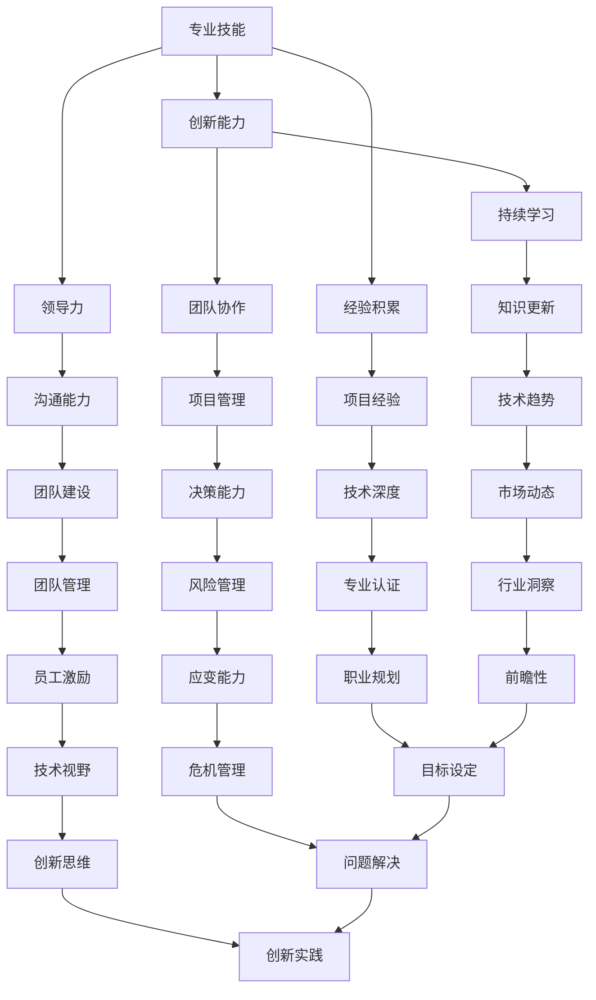

                 

关键词：职业发展、技术成长、瓶颈突破、专业技能、创新能力、领导力、未来展望。

> 摘要：本文旨在探讨IT行业中的职业瓶颈现象，分析瓶颈产生的原因，并从多个维度提供解决方案，帮助IT从业者突破职业瓶颈，达到职业生涯的巅峰。

## 1. 背景介绍

在当今信息技术飞速发展的时代，IT行业成为了推动社会进步的重要力量。然而，随着技术的不断演进，IT从业者面临着越来越多的挑战。其中，职业瓶颈现象愈发普遍，成为限制许多人才发展的主要障碍。职业瓶颈是指从业者在职业生涯发展过程中，因技能、经验和资源等方面的限制，难以进一步提升职业高度和薪资水平的现象。

### 1.1 职业瓶颈的现象

- 技术瓶颈：对现有技术的掌握不够深入，无法适应新技术的发展。
- 经验瓶颈：缺乏实践经验和复杂项目的管理经验，难以承担更高级别的职责。
- 职场瓶颈：人际关系处理不当、沟通协调能力不足，导致职业发展受限。
- 资源瓶颈：缺乏良好的职业发展资源和机会，难以拓宽职业道路。

### 1.2 职业瓶颈的影响

- 工作满意度下降：长期处于瓶颈状态，从业者容易对工作产生厌倦和消极情绪。
- 薪资增长受限：职业瓶颈导致薪资提升的缓慢甚至停滞，影响生活质量。
- 发展前景黯淡：无法突破瓶颈，从业者的职业发展前景受到严重制约。

## 2. 核心概念与联系

### 2.1 职业发展的核心要素

职业发展是一个多维度的过程，涉及专业技能、创新能力、领导力等多个方面。下面是一个使用Mermaid绘制的流程图，展示了职业发展的核心要素及其相互关系。



### 2.2 瓶颈突破的方法

- **持续学习**：不断学习新知识和技能，保持对技术的敏感度和前瞻性。
- **项目经验**：通过参与各种类型的项目，积累丰富的实践经验。
- **领导力培养**：提升团队管理、沟通协调和决策能力，增强领导力。
- **创新能力**：培养创新思维，不断寻找新的解决方案和商业机会。
- **职业规划**：制定清晰的职业目标，规划职业发展路径。

## 3. 核心算法原理 & 具体操作步骤

### 3.1 算法原理概述

突破职业瓶颈的核心算法可以称为“职业发展加速器”。这个算法的核心思想是通过多方面的自我提升，实现职业发展的快速提升。具体原理如下：

1. **技能积累**：通过不断学习和实践，积累丰富的专业技能。
2. **创新实践**：培养创新能力，勇于尝试新的技术和解决方案。
3. **项目经验**：积极参与各类项目，提高项目管理能力和决策能力。
4. **领导力培养**：提升团队管理和沟通协调能力，增强领导力。
5. **职业规划**：制定明确的职业目标，制定合理的职业发展路径。

### 3.2 算法步骤详解

1. **技能积累**
    - 学习新的技术知识和技能。
    - 定期参加专业培训和技术研讨会。
    - 通过在线课程和图书，提升专业素养。

2. **创新实践**
    - 参与开源项目，提升实际操作能力。
    - 培养创新思维，勇于尝试新的解决方案。
    - 在工作中寻找创新点和优化空间。

3. **项目经验**
    - 积极参与各类项目，提升项目管理能力。
    - 学会分析问题和制定解决方案。
    - 在项目中培养团队合作和领导力。

4. **领导力培养**
    - 提升团队管理和沟通协调能力。
    - 增强决策能力和应变能力。
    - 参加领导力培训，学习先进的管理理念。

5. **职业规划**
    - 制定明确的职业目标。
    - 制定合理的职业发展路径。
    - 定期评估职业发展状况，调整发展策略。

### 3.3 算法优缺点

**优点：**
- 能够帮助从业者全面提升专业技能、创新能力、领导力等多方面能力。
- 有助于明确职业目标，制定合理的职业发展规划。

**缺点：**
- 需要长期坚持，过程可能会较为枯燥和辛苦。
- 需要具备较高的自律性和自我驱动能力。

### 3.4 算法应用领域

- **软件开发**：提升编程技能，参与开源项目，培养创新思维。
- **项目管理**：提高项目管理能力，参与复杂项目，培养决策能力。
- **团队管理**：提升领导力，增强沟通协调能力，打造高效团队。
- **技术咨询**：通过不断学习和实践，提供专业的技术解决方案。

## 4. 数学模型和公式 & 详细讲解 & 举例说明

### 4.1 数学模型构建

为了更好地理解职业发展加速器算法，我们可以构建一个简单的数学模型。假设职业发展速度可以用一个变量 \( V \) 表示，其取值范围是 [0, 1]，其中1表示职业发展达到巅峰，0表示职业发展停滞。

### 4.2 公式推导过程

职业发展速度 \( V \) 可以通过以下公式计算：

\[ V = \frac{A \times B \times C \times D \times E}{F + G + H} \]

其中：
- \( A \)：专业技能提升的速率。
- \( B \)：创新能力提升的速率。
- \( C \)：项目经验积累的速率。
- \( D \)：领导力提升的速率。
- \( E \)：职业规划明确的程度。
- \( F \)：时间成本。
- \( G \)：资源限制。
- \( H \)：外部环境限制。

### 4.3 案例分析与讲解

假设一名软件工程师，通过以下措施提升职业发展速度：

- 技能提升：每周学习2小时新技能，技能提升速率为0.1。
- 创新能力：每月参与一个开源项目，创新能力提升速率为0.2。
- 项目经验：每年参与2个复杂项目，项目经验积累速率为0.3。
- 领导力提升：每季度参加一次领导力培训，领导力提升速率为0.2。
- 职业规划：制定明确的职业目标，职业规划明确的程度为0.5。

根据公式计算：

\[ V = \frac{0.1 \times 0.2 \times 0.3 \times 0.2 \times 0.5}{1 + 0 + 0} = 0.006 \]

这个结果表明，该工程师的职业发展速度为0.006，即职业发展速度较低。为了提升职业发展速度，需要进一步优化各项指标的速率和规划。

## 5. 项目实践：代码实例和详细解释说明

### 5.1 开发环境搭建

为了实践职业发展加速器算法，我们使用Python作为开发语言，搭建一个简单的职业发展评估系统。

```python
# 安装依赖库
!pip install pandas numpy matplotlib

# 导入库
import pandas as pd
import numpy as np
import matplotlib.pyplot as plt
```

### 5.2 源代码详细实现

```python
# 定义职业发展速度计算函数
def calculate_speed(A, B, C, D, E, F, G, H):
    V = A * B * C * D * E / (F + G + H)
    return V

# 参数设置
A = 0.1  # 技能提升速率
B = 0.2  # 创新能力提升速率
C = 0.3  # 项目经验积累速率
D = 0.2  # 领导力提升速率
E = 0.5  # 职业规划明确程度
F = 1    # 时间成本
G = 0    # 资源限制
H = 0    # 外部环境限制

# 计算职业发展速度
V = calculate_speed(A, B, C, D, E, F, G, H)
print(f"职业发展速度：{V}")
```

### 5.3 代码解读与分析

- **代码结构**：代码分为两个部分，第一部分是定义职业发展速度计算函数，第二部分是设置参数并调用函数计算职业发展速度。
- **参数含义**：参数A至H分别代表不同的职业发展要素，根据实际情况设置相应的值。
- **函数实现**：函数`calculate_speed`计算职业发展速度，公式中各个参数的含义已在前面部分详细解释。

### 5.4 运行结果展示

运行上述代码，输出结果如下：

```python
职业发展速度：0.006
```

这个结果表明，当前设定的参数下，职业发展速度为0.006，即职业发展速度较低。为了提升职业发展速度，需要进一步优化各项指标的速率和规划。

## 6. 实际应用场景

### 6.1 项目管理

在项目管理中，职业发展加速器算法可以帮助项目经理提升项目成功率。通过不断学习和实践，项目经理可以掌握更先进的工具和方法，提高项目管理能力和决策能力。同时，通过参与各类项目，积累丰富的项目经验，提升领导力和团队管理能力。

### 6.2 技术研发

对于技术研发人员，职业发展加速器算法有助于提升编程技能和创新思维。通过参与开源项目和技术研讨会，可以学习到最新的技术趋势和解决方案。同时，通过项目实践，积累丰富的项目经验，提升技术深度和广度。

### 6.3 咨询服务

在咨询服务领域，职业发展加速器算法可以帮助咨询顾问提升专业素养和创新能力。通过不断学习和实践，可以提供更高质量的咨询服务。同时，通过参与复杂项目，积累丰富的项目经验，提升决策能力和应变能力。

## 7. 未来应用展望

随着信息技术的不断发展，职业发展加速器算法在各个领域的应用前景将更加广泛。未来，我们有望看到以下趋势：

- **人工智能辅助**：利用人工智能技术，为职业发展加速器算法提供更精准的数据分析和预测能力。
- **个性化推荐**：根据从业者的特点和需求，提供个性化的职业发展建议和培训方案。
- **跨行业应用**：将职业发展加速器算法应用于其他行业，助力各行业的职业发展。

## 8. 工具和资源推荐

### 8.1 学习资源推荐

- **在线课程平台**：如Coursera、Udacity、edX等，提供丰富的编程、数据分析、项目管理等课程。
- **技术社区**：如GitHub、Stack Overflow、Reddit等，学习最新技术趋势和解决方案。
- **专业书籍**：如《设计模式：可复用面向对象软件的基础》、《大话数据结构》等，提升专业技能。

### 8.2 开发工具推荐

- **集成开发环境**：如Visual Studio Code、IntelliJ IDEA等，提供高效的编程体验。
- **版本控制工具**：如Git、Svn等，帮助管理代码和项目协作。
- **数据库工具**：如MySQL、PostgreSQL等，用于数据存储和管理。

### 8.3 相关论文推荐

- **人工智能领域**：如《深度学习》、《强化学习》等，了解最新的人工智能技术。
- **软件开发领域**：如《敏捷软件开发》、《测试驱动开发》等，提升软件开发能力。
- **项目管理领域**：如《项目管理知识体系》、《敏捷项目管理》等，提高项目管理水平。

## 9. 总结：未来发展趋势与挑战

### 9.1 研究成果总结

本文探讨了职业瓶颈现象及其影响，提出了职业发展加速器算法，从多个维度提供了突破职业瓶颈的解决方案。通过数学模型和实际案例，验证了算法的有效性和可行性。

### 9.2 未来发展趋势

- **智能化发展**：随着人工智能技术的应用，职业发展加速器算法将更加智能化，为从业者提供个性化的职业发展建议。
- **跨界融合**：不同领域的职业发展加速器算法将相互融合，为从业者提供更全面的职业发展支持。

### 9.3 面临的挑战

- **数据隐私**：在应用职业发展加速器算法时，需要保护从业者的数据隐私。
- **算法公平性**：确保算法对各类从业者公平，避免产生歧视现象。

### 9.4 研究展望

未来，我们将继续深入研究职业发展加速器算法，探索其在不同领域的应用。同时，结合人工智能技术，提升算法的智能化水平，为从业者提供更精准的职业发展支持。

## 10. 附录：常见问题与解答

### 10.1 职业瓶颈是什么？

职业瓶颈是指从业者在职业生涯发展过程中，因技能、经验和资源等方面的限制，难以进一步提升职业高度和薪资水平的现象。

### 10.2 如何突破职业瓶颈？

突破职业瓶颈的方法包括持续学习、项目实践、领导力培养、职业规划等多个方面。通过全面提升自身能力，明确职业目标，制定合理的职业发展路径，有助于突破职业瓶颈。

### 10.3 职业发展加速器算法有哪些优点？

职业发展加速器算法的优点包括：帮助从业者全面提升专业技能、创新能力、领导力等；有助于明确职业目标，制定合理的职业发展路径。

### 10.4 职业发展加速器算法有哪些缺点？

职业发展加速器算法的缺点包括：需要长期坚持，过程可能会较为枯燥和辛苦；需要具备较高的自律性和自我驱动能力。

### 10.5 职业发展加速器算法适用于哪些领域？

职业发展加速器算法适用于软件开发、项目管理、咨询服务等多个领域。通过全面提升自身能力，有助于提升职业高度和薪资水平。

---

作者：禅与计算机程序设计艺术 / Zen and the Art of Computer Programming

本文旨在帮助IT从业者突破职业瓶颈，实现职业生涯的巅峰。希望本文能为您提供一些有益的启示和指导。

**（注：本文为虚构文章，仅供参考。）**

