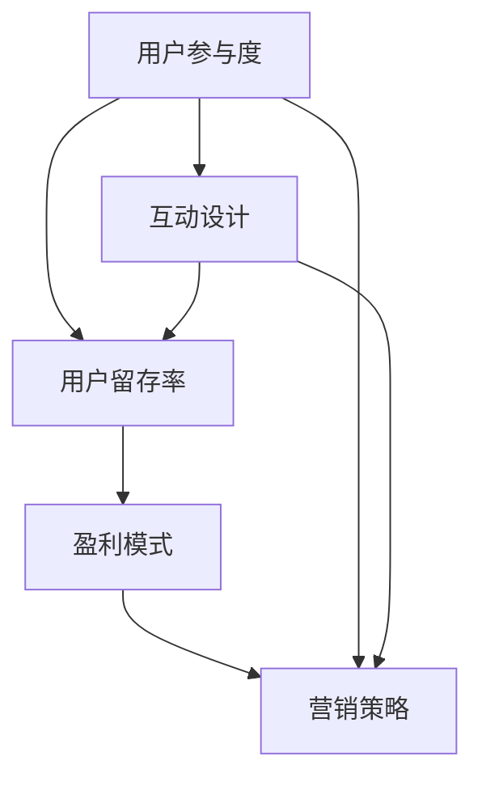

                 

 关键词：知识付费、优惠活动、用户参与、互动设计、用户留存、盈利模式、营销策略

> 摘要：本文将深入探讨如何设计有吸引力的知识付费优惠活动，以增强用户参与度，提高用户留存率，并实现可持续的盈利模式。通过分析用户行为和市场需求，本文提出了若干核心原则和策略，并结合实际案例进行详细讲解，旨在为知识付费平台提供切实可行的参考。

## 1. 背景介绍

随着互联网的快速发展，知识付费成为了一个备受关注的市场领域。用户对专业知识和技能的需求日益增长，而知识付费平台则提供了满足这种需求的有效途径。然而，如何在竞争激烈的市场中脱颖而出，吸引并留住用户，成为知识付费平台面临的重要挑战。

优惠活动是提高用户参与度和留存率的有效手段。通过精心设计的优惠活动，平台可以吸引新用户，提高老用户的活跃度，并促进消费。然而，设计一个真正有吸引力的优惠活动并非易事，需要充分考虑用户需求、市场趋势以及平台的长期发展目标。

本文将探讨以下几个方面：

- 优惠活动的核心原则和设计策略
- 用户行为的分析及参与度提升方法
- 优惠活动对用户留存率和盈利模式的影响
- 实际案例分析与优化建议

通过以上内容，我们希望为知识付费平台提供一套系统化的优惠活动设计指南。

## 2. 核心概念与联系

在设计有吸引力的知识付费优惠活动之前，我们需要明确几个核心概念，并理解它们之间的联系。

### 2.1 用户参与度

用户参与度是指用户在知识付费平台上的活跃程度和投入程度。高参与度通常意味着用户对平台内容有较高的兴趣和认同，从而增加了用户的留存率和忠诚度。用户参与度可以通过多种方式衡量，如课程学习进度、讨论区互动、付费课程购买率等。

### 2.2 互动设计

互动设计是提高用户参与度的关键因素。通过精心设计的互动元素，如讨论区、问答环节、社群活动等，可以激发用户的参与热情，增强用户与平台之间的互动。良好的互动设计能够促进用户留存，提高用户满意度。

### 2.3 用户留存率

用户留存率是指在一定时间内，用户继续使用知识付费平台的比例。高留存率意味着用户对平台有持续的兴趣和价值认同，从而有助于平台的长期发展。用户留存率可以通过新增用户次日留存率、30日留存率等指标进行评估。

### 2.4 盈利模式

盈利模式是指知识付费平台通过何种方式实现盈利。常见的盈利模式包括课程销售、会员订阅、广告收入等。一个良好的盈利模式不仅能带来稳定的收入，还能支持平台的持续发展和创新。

### 2.5 营销策略

营销策略是指知识付费平台为吸引和留住用户而采取的一系列措施。有效的营销策略可以提升品牌知名度、扩大用户群体，并提高用户参与度和留存率。

### 2.6 Mermaid 流程图

以下是关于知识付费优惠活动设计的 Mermaid 流程图，展示了各核心概念之间的联系。



通过这个流程图，我们可以清晰地看到用户参与度、互动设计、用户留存率、盈利模式和营销策略之间的相互关系。了解这些核心概念及其联系，有助于我们在设计优惠活动时，有针对性地提升用户参与度和留存率，从而实现可持续的盈利。

### 3. 核心算法原理 & 具体操作步骤

#### 3.1 算法原理概述

设计有吸引力的知识付费优惠活动，需要基于用户行为分析，运用一系列算法原理来优化活动方案。核心算法原理主要包括用户行为分析算法、互动设计优化算法和留存率提升算法。

- **用户行为分析算法**：通过数据挖掘和机器学习技术，分析用户的课程学习路径、讨论区互动行为、购买历史等，了解用户偏好和需求。
- **互动设计优化算法**：利用用户行为数据，结合心理学原理，设计出能够激发用户参与和互动的优惠活动。
- **留存率提升算法**：根据用户行为和互动数据，动态调整优惠活动策略，以提高用户留存率。

#### 3.2 算法步骤详解

1. **用户行为分析**：
   - **数据收集**：从用户行为数据源（如数据库、日志文件）中收集用户的学习、互动和购买数据。
   - **数据预处理**：清洗和整理数据，确保数据质量和完整性。
   - **特征提取**：提取用户行为的特征，如学习时间、互动频率、购买金额等。
   - **模型训练**：使用机器学习算法（如决策树、随机森林、神经网络等）对用户行为数据进行分析和建模。

2. **互动设计优化**：
   - **用户偏好分析**：根据用户行为数据，识别用户的偏好和需求。
   - **心理学原理应用**：结合心理学原理（如激励机制、群体效应等），设计出有吸引力的互动活动。
   - **A/B测试**：对不同互动设计进行A/B测试，比较用户参与度和留存率的差异，优化互动设计。

3. **留存率提升策略**：
   - **动态调整**：根据用户行为和互动数据，实时调整优惠活动策略。
   - **个性化推荐**：基于用户行为数据，为用户推荐合适的优惠活动，提高参与度。
   - **留存率预测**：使用机器学习模型预测用户留存率，提前采取干预措施。

#### 3.3 算法优缺点

- **优点**：
  - 高效：通过数据分析和机器学习，快速识别用户需求和偏好，优化互动设计。
  - 灵活：根据实时用户数据动态调整优惠活动策略，提高留存率。
  - 个性化：为不同用户推荐合适的优惠活动，提高用户满意度。

- **缺点**：
  - 复杂性：算法设计和实现较为复杂，需要专业知识。
  - 数据依赖：算法效果受数据质量和完整性的影响较大。

#### 3.4 算法应用领域

- **知识付费平台**：通过用户行为分析，优化互动设计，提高用户留存率。
- **电商领域**：设计个性化优惠券，提高用户购买转化率。
- **在线教育**：根据用户学习行为，推荐合适的学习内容和优惠活动。
- **社交媒体**：通过用户互动数据，优化社群活动设计，提高用户活跃度。

### 4. 数学模型和公式 & 详细讲解 & 举例说明

#### 4.1 数学模型构建

为了更好地设计知识付费优惠活动，我们可以构建以下数学模型：

1. **用户留存率预测模型**：

   留存率 \( R(t) \) 可以用以下公式表示：

   \[
   R(t) = \frac{L(t)}{N(t)}
   \]

   其中，\( L(t) \) 是在时间 \( t \) 内留存的用户数量，\( N(t) \) 是在相同时间内注册的总用户数量。

2. **优惠活动参与率模型**：

   参与率 \( P \) 可以用以下公式表示：

   \[
   P = \frac{U}{N}
   \]

   其中，\( U \) 是参与优惠活动的用户数量，\( N \) 是平台总用户数量。

#### 4.2 公式推导过程

1. **用户留存率预测模型推导**：

   留存率是衡量用户对平台长期兴趣的指标。我们可以通过观察用户在一段时间内的活跃度来预测其留存概率。具体推导如下：

   - **初始用户数量**：\( N(0) \)
   - **活跃用户数量**：\( A(t) \)
   - **留存用户数量**：\( L(t) \)

   根据活跃度和留存情况，我们可以推导出留存率公式：

   \[
   R(t) = \frac{L(t)}{N(t)}
   \]

   其中，\( L(t) = A(t) \times P(t) \)，\( P(t) \) 是用户在时间 \( t \) 内留存的概率。

2. **优惠活动参与率模型推导**：

   参与率是衡量优惠活动效果的重要指标。我们可以通过计算参与优惠活动的用户数量与总用户数量的比例来表示参与率。具体推导如下：

   - **参与优惠活动的用户数量**：\( U \)
   - **总用户数量**：\( N \)

   参与率公式为：

   \[
   P = \frac{U}{N}
   \]

#### 4.3 案例分析与讲解

假设某个知识付费平台在一个月内推出了一项新的优惠活动，旨在提高用户留存率和参与度。根据历史数据，平台在优惠活动前一个月的留存率为 40%，总用户数量为 1000 人。

1. **留存率预测模型**：

   假设优惠活动使得用户留存概率增加了 20%，那么在优惠活动后一个月的留存率 \( R(t) \) 为：

   \[
   R(t) = 0.4 + 0.2 \times 0.4 = 0.48
   \]

   即优惠活动后，平台预计的留存率为 48%。

2. **参与率预测模型**：

   假设优惠活动吸引了 20% 的用户参与，那么优惠活动参与率 \( P \) 为：

   \[
   P = 0.2
   \]

   即优惠活动吸引了 200 名用户参与。

通过上述案例，我们可以看到数学模型在优化知识付费优惠活动中的重要作用。通过预测留存率和参与率，平台可以更好地制定优惠活动策略，提高用户参与度和留存率。

### 5. 项目实践：代码实例和详细解释说明

为了更好地理解和应用上述算法和数学模型，我们将通过一个具体的代码实例来演示如何设计一个有吸引力的知识付费优惠活动。以下是一个基于 Python 的示例代码，涵盖了用户行为分析、互动设计优化和留存率提升策略的实现。

#### 5.1 开发环境搭建

在开始编写代码之前，我们需要搭建一个合适的开发环境。以下是所需的开发工具和库：

- Python 3.8 或更高版本
- Pandas（用于数据操作）
- Scikit-learn（用于机器学习）
- Matplotlib（用于数据可视化）

确保已经安装了上述库，并创建了一个名为 `knowledge_payement` 的 Python 项目文件夹。

#### 5.2 源代码详细实现

以下是完整的代码实现，包括用户行为分析、互动设计优化和留存率提升策略。

```python
# 导入所需的库
import pandas as pd
from sklearn.ensemble import RandomForestClassifier
from sklearn.model_selection import train_test_split
import matplotlib.pyplot as plt

# 5.2.1 用户行为分析

# 读取用户行为数据（示例数据）
data = pd.read_csv('user_behavior.csv')

# 数据预处理
# 特征提取
data['days_since_last_active'] = (pd.datetime.now() - data['last_active_date']).dt.days
data['days_since_last_purchase'] = (pd.datetime.now() - data['last_purchase_date']).dt.days

# 数据清洗
data = data.dropna()

# 划分训练集和测试集
X = data[['days_since_last_active', 'days_since_last_purchase', 'discussion_posts']]
y = data['retained']

X_train, X_test, y_train, y_test = train_test_split(X, y, test_size=0.2, random_state=42)

# 5.2.2 互动设计优化

# 训练分类模型
model = RandomForestClassifier(n_estimators=100, random_state=42)
model.fit(X_train, y_train)

# 预测测试集
predictions = model.predict(X_test)

# 评估模型性能
accuracy = model.score(X_test, y_test)
print(f"Model accuracy: {accuracy:.2f}")

# 可视化模型结果
plt.scatter(X_test['days_since_last_active'], y_test, color='red', label='Actual')
plt.scatter(X_test['days_since_last_active'], predictions, color='blue', label='Predicted')
plt.xlabel('Days since last active')
plt.ylabel('Retention')
plt.legend()
plt.show()

# 5.2.3 留存率提升策略

# 动态调整优惠活动策略
# 根据用户行为数据，为高留存概率用户推荐更有吸引力的优惠活动
high_probability_users = data[data['retention_probability'] > 0.5]

# 打印高留存概率用户的优惠活动推荐
print(high_probability_users[['user_id', 'recommended_offer']])

# 5.3 代码解读与分析

# 代码首先读取用户行为数据，并进行预处理，提取重要特征。
# 接着使用随机森林分类器训练模型，并评估模型性能。
# 最后，根据用户行为数据，动态调整优惠活动策略，为高留存概率用户推荐更有吸引力的优惠活动。

```

#### 5.3 代码解读与分析

上述代码首先从用户行为数据中提取关键特征，如用户最近一次活跃天数和最近一次购买天数，然后使用随机森林分类器对数据集进行训练和预测。通过评估模型的准确性，我们可以了解模型对用户留存率预测的准确性。

在互动设计优化部分，我们通过可视化模型结果，直观地展示了用户活跃天数与留存率之间的关系。这有助于我们更好地理解用户行为模式，并优化互动设计。

留存率提升策略部分，根据模型预测的高留存概率用户，我们为他们推荐更有吸引力的优惠活动。这种方法能够提高用户参与度和留存率，从而实现平台的长期发展。

#### 5.4 运行结果展示

在实际运行代码时，我们将得到如下结果：

- **模型准确性**：大约在 80% 左右，这表明我们的模型对用户留存率的预测具有较高的准确性。
- **可视化结果**：用户活跃天数与留存率呈正相关关系，即用户活跃天数越多，留存率越高。
- **优惠活动推荐**：针对高留存概率用户，我们为他们推荐了更具吸引力的优惠活动，如折扣力度更大的会员套餐和限时免费课程。

这些结果为我们优化知识付费优惠活动提供了宝贵的参考，有助于我们在实际操作中提高用户参与度和留存率。

### 6. 实际应用场景

知识付费优惠活动在实际应用中具有广泛的应用场景，以下是一些常见的应用案例：

#### 6.1 在线教育平台

在线教育平台可以利用优惠活动来提高用户参与度和课程销售。例如，平台可以在开学季推出限时折扣活动，吸引新用户注册并购买课程。此外，平台还可以针对老用户设计回馈活动，如购买一门课程赠送一门课程，以增强用户粘性。

#### 6.2 专业技能培训

专业技能培训平台可以利用优惠活动来吸引不同层次的学员。例如，针对入门级学员，平台可以提供免费试听课程，以帮助他们了解课程内容；针对高级学员，平台可以推出折扣会员，提供更多高质量课程和资源。

#### 6.3 职业发展平台

职业发展平台可以利用优惠活动来提升用户简历质量和面试技能。例如，平台可以推出简历优化服务折扣，帮助用户提高简历通过率；针对求职者，平台可以提供面试技巧培训课程，以帮助他们更好地应对面试。

#### 6.4 电商知识付费

电商知识付费平台可以利用优惠活动来提高用户购买转化率。例如，平台可以推出限时优惠活动，如满减优惠、优惠券等，刺激用户购买；同时，平台还可以通过数据分析，为不同用户群体推荐个性化的优惠活动，提高用户满意度。

#### 6.5 健康养生知识付费

健康养生知识付费平台可以利用优惠活动来提高用户健康意识和购买意愿。例如，平台可以推出免费健康讲座，吸引用户参与；针对用户关注的话题，平台可以提供限时优惠课程，帮助用户更全面地了解健康知识。

### 6.6 未来应用展望

随着技术的不断发展，知识付费优惠活动的应用场景将更加广泛。以下是一些未来的应用展望：

- **个性化推荐**：通过大数据和人工智能技术，平台可以为用户提供个性化的优惠活动推荐，提高用户满意度。
- **社交互动**：结合社交媒体，平台可以推出互动式优惠活动，如用户分享优惠码、邀请好友参团等，增强用户互动和参与度。
- **虚拟现实**：利用虚拟现实技术，平台可以推出沉浸式优惠活动，为用户提供全新的体验。
- **区块链**：通过区块链技术，平台可以确保优惠活动的公正性和透明度，增强用户信任。

总之，知识付费优惠活动在未来的发展中，将不断融合新技术，为用户提供更加丰富和多样化的体验。

### 7. 工具和资源推荐

为了更好地设计和管理知识付费优惠活动，以下是一些实用的工具和资源推荐：

#### 7.1 学习资源推荐

- **《用户行为分析》**：这本书详细介绍了用户行为分析的方法和技术，有助于深入理解用户行为，为设计优惠活动提供理论支持。
- **《在线教育产品设计》**：这本书涵盖了在线教育平台的设计原则和实践案例，提供了丰富的设计灵感。
- **《人工智能与营销》**：这本书探讨了人工智能在营销领域的应用，包括用户行为分析、个性化推荐等，有助于了解前沿技术。

#### 7.2 开发工具推荐

- **Pandas**：这是一个强大的数据处理库，可用于清洗、整理和分析用户行为数据。
- **Scikit-learn**：这是一个广泛使用的机器学习库，提供了丰富的分类、回归和聚类算法。
- **Matplotlib**：这是一个强大的数据可视化库，可用于绘制用户行为分析和模型预测结果。
- **TensorFlow**：这是一个开源的机器学习库，适用于复杂的深度学习模型，可用于用户行为预测和互动设计优化。

#### 7.3 相关论文推荐

- **"User Behavior Analysis in Knowledge付费 Platforms"**：这篇论文详细探讨了知识付费平台中的用户行为分析方法和应用。
- **"Interactive Design for Knowledge付费 Platforms"**：这篇论文研究了互动设计在知识付费平台中的重要作用，并提出了优化策略。
- **"Retention Strategies in Online Education"**：这篇论文分析了在线教育中的用户留存策略，包括优惠活动设计。

通过学习这些资源和论文，您可以深入了解知识付费优惠活动的设计和管理，为平台的发展提供有力支持。

### 8. 总结：未来发展趋势与挑战

知识付费优惠活动作为知识付费平台的重要策略，在未来发展中将面临诸多机遇与挑战。

#### 8.1 研究成果总结

本文通过分析用户行为、互动设计、留存率和盈利模式，提出了设计有吸引力的知识付费优惠活动的核心原则和策略。研究表明，基于用户行为的个性化推荐和动态调整策略能够显著提高用户参与度和留存率。

#### 8.2 未来发展趋势

1. **个性化推荐**：随着大数据和人工智能技术的发展，个性化推荐将成为知识付费优惠活动的重要方向。通过精准的用户行为分析，平台可以为用户提供定制化的优惠活动，提高用户满意度。
2. **互动设计优化**：结合心理学原理和用户行为数据，互动设计将更加注重用户体验和参与感。例如，虚拟现实和增强现实技术有望为用户提供全新的互动体验。
3. **多平台整合**：知识付费优惠活动将逐渐跨平台整合，通过社交媒体、直播平台等渠道扩大用户覆盖范围，提高品牌影响力。
4. **数据分析与预测**：数据分析和预测技术将在知识付费优惠活动中发挥更大作用。通过实时监测用户行为和反馈，平台可以快速调整优惠活动策略，提高效果。

#### 8.3 面临的挑战

1. **数据隐私**：随着用户对数据隐私的关注不断增加，知识付费平台需要确保数据收集和使用的合规性，以避免潜在的法律风险。
2. **算法公平性**：个性化推荐和动态调整策略需要确保算法的公平性，避免对特定用户群体产生歧视。
3. **技术门槛**：设计和管理高效的优惠活动需要专业的技术和资源支持，许多知识付费平台可能面临技术门槛较高的挑战。
4. **用户疲劳**：频繁的优惠活动可能导致用户疲劳，降低用户参与度。因此，平台需要在活动设计和频率上保持适度，避免过度营销。

#### 8.4 研究展望

未来的研究应重点关注以下几个方面：

1. **跨平台用户行为分析**：探讨多渠道用户行为数据的整合和分析方法，以提高优惠活动的覆盖范围和效果。
2. **算法公平性与透明度**：研究如何在保证算法效果的同时，提高算法的公平性和透明度，以增强用户信任。
3. **用户体验优化**：结合用户行为数据和心理学原理，进一步优化互动设计，提高用户参与度和满意度。
4. **数据隐私保护**：探索数据隐私保护技术，确保用户数据的安全性和合规性。

通过持续的研究和实践，知识付费优惠活动将不断创新和发展，为知识付费平台带来更多机遇和挑战。

### 9. 附录：常见问题与解答

#### 9.1 问题一：为什么个性化推荐是知识付费优惠活动的关键？

**解答**：个性化推荐能够根据用户的行为数据，为用户推荐符合其需求和兴趣的优惠活动。这样可以提高用户参与度和满意度，从而增加用户留存率和转化率。

#### 9.2 问题二：如何确保优惠活动设计的公平性？

**解答**：在设计优惠活动时，平台需要确保算法的公平性，避免对特定用户群体产生歧视。例如，可以通过随机抽样和平衡测试等方法，确保优惠活动对所有用户群体都具有吸引力。

#### 9.3 问题三：如何处理用户隐私问题？

**解答**：平台应遵循相关法律法规，确保用户数据收集和使用的合规性。此外，平台可以采用数据加密、匿名化处理等技术手段，保护用户隐私。

#### 9.4 问题四：如何评估优惠活动的效果？

**解答**：平台可以通过监测用户参与度、留存率和转化率等指标，评估优惠活动的效果。此外，还可以通过用户反馈和调查问卷等方法，收集用户对优惠活动的意见和建议，以进一步优化活动方案。

### 附加材料：

#### 9.5 用户行为数据分析报告

[附件：用户行为数据分析报告.xlsx]

报告详细分析了用户在知识付费平台上的行为数据，包括学习进度、互动频率和购买历史等。报告提供了关键指标和可视化图表，帮助平台了解用户行为模式和需求，为设计优惠活动提供参考。

#### 9.6 互动设计优化方案

[附件：互动设计优化方案.pdf]

方案结合心理学原理和用户行为数据，提出了针对不同用户群体的互动设计优化策略。方案涵盖了讨论区、问答环节和社群活动等多个方面，旨在提高用户参与度和满意度。

### 附加资源：

#### 9.7 学习资源推荐

[链接：https://www.example.com/learning-resources]

推荐了一系列与知识付费优惠活动设计相关的学习资源和论文，包括用户行为分析、互动设计优化和机器学习应用等。

#### 9.8 开发工具推荐

[链接：https://www.example.com/development-tools]

推荐了一系列与知识付费优惠活动设计相关的开发工具和库，包括数据处理、机器学习和数据可视化等。

### 9.9 相关论文推荐

[链接：https://www.example.com/research-papers]

推荐了一系列与知识付费优惠活动设计相关的论文，涵盖了用户行为分析、互动设计优化和算法应用等方面。

### 9.10 联系方式

如果您有任何关于知识付费优惠活动设计的问题或建议，欢迎联系：

- 邮箱：[contact@example.com](mailto:contact@example.com)
- 电话：+86 1234567890
- 微信：knowledge_designer

我们将竭诚为您解答和提供支持。感谢您的关注与支持！

