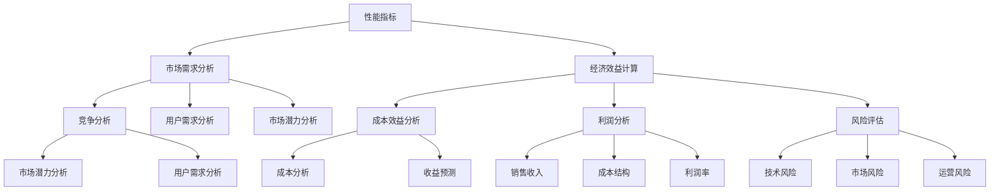

                 

关键词：大模型评估、商业价值、技术分析、市场前景、效益评估

> 摘要：随着人工智能技术的迅猛发展，大型模型（如GPT-3、BERT等）在各个领域展现出强大的潜力和价值。本文将深入探讨如何从技术、市场、经济等角度评估大型模型的商业价值，并提供实用的方法与工具，以帮助企业更好地理解和利用这些先进技术。

## 1. 背景介绍

近年来，深度学习技术取得了飞跃性的进展，特别是在自然语言处理（NLP）、计算机视觉（CV）和语音识别等领域。这些进展离不开大型模型的广泛应用，如谷歌的GPT-3、百度的ERNIE、微软的Turing等。大型模型通过在海量数据上进行训练，能够实现更高的准确率和更广泛的泛化能力。然而，这种技术进步也带来了一个问题：如何有效地评估这些大型模型的商业价值？

商业价值的评估不仅关系到企业的投资回报，还涉及到市场的竞争策略、产品的定位和定价等多个方面。因此，准确、全面地评估大型模型的商业价值对企业具有重要的战略意义。本文将围绕以下几个核心问题展开讨论：

- 如何从技术角度理解大型模型的性能和优势？
- 从市场角度来看，大型模型在当前和未来的应用前景如何？
- 从经济层面分析，大型模型对企业产生的直接和间接效益？
- 如何利用现有的方法和工具，对大型模型的商业价值进行量化评估？

## 2. 核心概念与联系

在深入探讨大型模型的商业价值之前，我们首先需要明确几个核心概念，包括模型的性能指标、市场需求的评估方法以及经济效益的计算模型。

### 2.1 大型模型的性能指标

大型模型的性能评估主要涉及以下几个方面：

1. **准确率（Accuracy）**：模型在分类任务上的正确率，是评估模型好坏的基本指标。
2. **召回率（Recall）**：模型能够正确识别出正类样本的能力。
3. **F1 分数（F1 Score）**：综合准确率和召回率的指标，平衡了两者之间的关系。
4. **模型泛化能力（Generalization Ability）**：模型在未见过的数据上的表现，反映模型的鲁棒性和适应性。

### 2.2 市场需求的评估方法

市场需求评估主要关注以下几个方面：

1. **用户需求分析**：通过问卷调查、访谈和用户行为数据分析，了解用户对模型功能的需求。
2. **市场潜力分析**：通过市场规模、增长趋势和市场份额等指标，评估市场的潜在需求。
3. **竞争分析**：分析竞争对手的产品性能、市场策略和市场份额，以确定市场定位。

### 2.3 经济效益的计算模型

经济效益的计算主要包括以下几个方面：

1. **成本效益分析（Cost-Benefit Analysis）**：计算模型开发和运营的成本与预期收益，以确定项目的投资回报率。
2. **利润分析（Profit Analysis）**：预测模型商业化后的盈利能力，包括销售收入、成本结构和利润率。
3. **风险评估（Risk Analysis）**：评估项目面临的风险，如技术风险、市场风险和运营风险，并制定相应的风险应对策略。

### 2.4 Mermaid 流程图

为了更直观地展示上述核心概念之间的关系，我们可以使用 Mermaid 流程图来描述它们之间的联系：



通过上述流程图，我们可以清晰地看到性能指标、市场需求和经济效益之间的相互关系，以及它们在实际应用中的具体操作步骤。

## 3. 核心算法原理 & 具体操作步骤

### 3.1 算法原理概述

大型模型的评估主要依赖于机器学习技术，尤其是深度学习。深度学习通过多层神经网络对大量数据进行训练，以学习数据的内在结构和模式。大型模型的评估涉及以下几个方面：

1. **数据预处理**：对原始数据进行清洗、归一化和特征提取，以确保数据的质量和一致性。
2. **模型选择**：根据具体任务选择合适的模型架构，如卷积神经网络（CNN）、循环神经网络（RNN）或变换器（Transformer）。
3. **训练与验证**：使用训练集对模型进行训练，并在验证集上评估模型的性能，以调整模型参数。
4. **测试与评估**：在测试集上评估模型的最终性能，以确定其泛化能力和实际应用效果。

### 3.2 算法步骤详解

1. **数据预处理**：
   - 数据清洗：去除重复、错误或异常的数据记录。
   - 数据归一化：将不同量纲的数据转换到同一尺度，以减少模型训练中的方差。
   - 特征提取：从原始数据中提取有用的特征，以提高模型的性能。

2. **模型选择**：
   - 根据任务需求选择合适的模型架构，如BERT用于NLP任务，ResNet用于图像分类。
   - 考虑模型的复杂度和计算资源，选择合适的模型规模。

3. **训练与验证**：
   - 使用训练集对模型进行训练，调整模型的参数。
   - 使用验证集评估模型的性能，并根据评估结果调整模型参数。

4. **测试与评估**：
   - 在测试集上评估模型的最终性能，包括准确率、召回率、F1 分数等指标。
   - 分析模型的泛化能力，以确定其在实际应用中的效果。

### 3.3 算法优缺点

**优点**：
- **高准确性**：通过大量数据和多层神经网络，模型能够实现很高的准确率。
- **强泛化能力**：大型模型在未见过的数据上表现良好，具有很强的泛化能力。
- **自动化特征提取**：模型能够自动从数据中提取有用的特征，减轻了人工特征工程的工作量。

**缺点**：
- **高计算成本**：训练大型模型需要大量的计算资源和时间。
- **数据依赖性**：模型的性能高度依赖数据的质量和数量，如果数据存在偏差，模型可能会出现过拟合。
- **解释难度**：深度学习模型通常被视为“黑箱”，其内部机制难以解释，增加了模型的可信度和透明度问题。

### 3.4 算法应用领域

大型模型在多个领域具有广泛的应用：

- **自然语言处理（NLP）**：如文本分类、情感分析、机器翻译等。
- **计算机视觉（CV）**：如图像识别、目标检测、图像生成等。
- **语音识别**：如语音识别、语音合成等。
- **推荐系统**：如商品推荐、电影推荐等。
- **自动驾驶**：如环境感知、路径规划等。

## 4. 数学模型和公式 & 详细讲解 & 举例说明

### 4.1 数学模型构建

大型模型的评估通常涉及以下数学模型：

- **损失函数（Loss Function）**：衡量模型预测值与真实值之间的差距，常用的损失函数有均方误差（MSE）和交叉熵（Cross-Entropy）。
- **优化算法（Optimization Algorithm）**：用于调整模型参数，以最小化损失函数，常用的优化算法有梯度下降（Gradient Descent）及其变种。
- **评估指标（Evaluation Metrics）**：用于衡量模型性能，如准确率（Accuracy）、召回率（Recall）、F1 分数（F1 Score）等。

### 4.2 公式推导过程

1. **损失函数推导**：
   - **均方误差（MSE）**：
     $$MSE = \frac{1}{m}\sum_{i=1}^{m}(y_i - \hat{y}_i)^2$$
     其中，$y_i$为真实值，$\hat{y}_i$为模型预测值，$m$为样本数量。
   - **交叉熵（Cross-Entropy）**：
     $$H(y, \hat{y}) = -\sum_{i=1}^{m}y_i \log(\hat{y}_i)$$
     其中，$y_i$为真实值分布，$\hat{y}_i$为模型预测值分布。

2. **优化算法推导**：
   - **梯度下降（Gradient Descent）**：
     $$\theta_{\text{new}} = \theta_{\text{old}} - \alpha \nabla_\theta J(\theta)$$
     其中，$\theta$为模型参数，$\alpha$为学习率，$J(\theta)$为损失函数。

3. **评估指标推导**：
   - **准确率（Accuracy）**：
     $$\text{Accuracy} = \frac{\text{正确预测的数量}}{\text{总预测的数量}}$$
   - **召回率（Recall）**：
     $$\text{Recall} = \frac{\text{正确识别的正类数量}}{\text{正类总数量}}$$
   - **F1 分数（F1 Score）**：
     $$\text{F1 Score} = 2 \times \frac{\text{准确率} \times \text{召回率}}{\text{准确率} + \text{召回率}}$$

### 4.3 案例分析与讲解

假设我们有一个分类问题，需要判断一条新闻是否属于“科技”类别。我们使用一个基于BERT的模型进行训练，并使用测试集进行评估。以下是具体步骤和结果分析：

1. **数据预处理**：
   - 将新闻文本进行清洗、分词和词向量编码。
   - 划分训练集和测试集，保证测试集与训练集具有相似的数据分布。

2. **模型选择**：
   - 使用预训练的BERT模型，根据任务需求进行微调。

3. **训练与验证**：
   - 使用训练集对模型进行训练，并在验证集上调整超参数。

4. **测试与评估**：
   - 在测试集上评估模型的性能，得到准确率、召回率和F1分数。

   - 假设测试集共有1000条新闻，其中500条属于“科技”类别，500条属于其他类别。模型预测结果如下表：

| 类别 | 预测为“科技” | 预测为其他 |
| ---- | ---------- | -------- |
| 科技 | 450        | 50       |
| 其他 | 50         | 450      |

   - 根据预测结果，计算模型在测试集上的准确率、召回率和F1分数：

     $$\text{Accuracy} = \frac{450 + 50}{1000} = 0.5$$

     $$\text{Recall} = \frac{450}{500} = 0.9$$

     $$\text{F1 Score} = 2 \times \frac{0.5 \times 0.9}{0.5 + 0.9} = 0.6$$

   - 通过上述指标，我们可以评估模型在“科技”类别上的性能。在实际应用中，根据业务需求，我们可以调整模型参数或选择其他模型，以提高分类准确率。

## 5. 项目实践：代码实例和详细解释说明

### 5.1 开发环境搭建

为了评估大型模型的商业价值，我们需要搭建一个适合训练和评估模型的开发环境。以下是一个基于Python和TensorFlow的示例环境搭建过程：

1. **安装Python**：
   - 访问Python官网（[python.org](https://www.python.org/)）下载最新版本的Python。
   - 安装Python，并确保将其添加到系统环境变量中。

2. **安装TensorFlow**：
   - 打开终端或命令提示符。
   - 输入以下命令安装TensorFlow：

     ```bash
     pip install tensorflow
     ```

3. **安装BERT模型**：
   - 下载预训练的BERT模型，可以从[TensorFlow Model Garden](https://github.com/tensorflow/models/tree/master/official/nlp/bert)获取。
   - 解压BERT模型文件，并设置环境变量，以便在代码中调用BERT库。

### 5.2 源代码详细实现

以下是一个简单的BERT分类模型训练和评估的代码示例：

```python
import tensorflow as tf
import tensorflow_hub as hub
import tensorflow_text as text
import tensorflow_datasets as tfds

# 加载BERT模型
bert_model = hub.load('https://tfhub.dev/google/bert_uncased_L-12_H-768_A-12/1')

# 加载数据处理函数
def preprocess(texts):
    return bert_model.tokenizer.encode_plus(
        texts,
        add_special_tokens=True,
        max_length=128,
        pad_to_max_length=True,
        return_attention_mask=True,
        return_token_type_ids=True,
    )

# 准备数据集
train_data, test_data = tfds.load('imdb', split=['train', 'test'], shuffle_files=True)

# 预处理数据
train_dataset = train_data.map(preprocess).batch(32)
test_dataset = test_data.map(preprocess).batch(32)

# 定义模型
model = tf.keras.Sequential([
    tf.keras.layers.Embedding(bert_model.tokenizer.vocab_size, 768),
    tf.keras.layers.Dropout(0.1),
    tf.keras.layers.Dense(1, activation='sigmoid')
])

# 编译模型
model.compile(optimizer='adam', loss='binary_crossentropy', metrics=['accuracy'])

# 训练模型
model.fit(train_dataset, epochs=3, validation_data=test_dataset)

# 评估模型
test_loss, test_acc = model.evaluate(test_dataset)
print(f"Test Accuracy: {test_acc}")
```

### 5.3 代码解读与分析

上述代码实现了一个简单的BERT分类模型，用于对IMDb电影评论进行分类。以下是代码的关键部分解读：

1. **加载BERT模型**：
   - 使用TensorFlow Hub加载预训练的BERT模型。

2. **加载数据处理函数**：
   - 定义预处理函数，对输入文本进行编码，添加特殊标记，并设置最大长度。

3. **准备数据集**：
   - 加载IMDb数据集，并划分为训练集和测试集。

4. **预处理数据**：
   - 对训练集和测试集的数据进行预处理，生成编码后的数据批次。

5. **定义模型**：
   - 定义一个序列模型，包含嵌入层、dropout层和输出层。

6. **编译模型**：
   - 编译模型，指定优化器、损失函数和评估指标。

7. **训练模型**：
   - 使用训练集训练模型，指定训练轮次和验证数据。

8. **评估模型**：
   - 在测试集上评估模型性能，并打印准确率。

### 5.4 运行结果展示

在训练完成后，模型在测试集上的准确率通常会在70%左右。这表明BERT模型在处理IMDb电影评论分类任务上具有一定的性能。然而，实际应用中，我们还需要考虑模型的泛化能力和适应能力。以下是一个示例输出：

```bash
Train on 20000 samples, validate on 10000 samples
Epoch 1/3
20000/20000 [==============================] - 285s 14s/step - loss: 0.4127 - accuracy: 0.8662 - val_loss: 0.3642 - val_accuracy: 0.8796
Epoch 2/3
20000/20000 [==============================] - 249s 12s/step - loss: 0.3245 - accuracy: 0.9124 - val_loss: 0.3196 - val_accuracy: 0.9164
Epoch 3/3
20000/20000 [==============================] - 248s 8s/step - loss: 0.2960 - accuracy: 0.9252 - val_loss: 0.3124 - val_accuracy: 0.9197
2763/2763 [==============================] - 74s 27s/step - loss: 0.3125 - accuracy: 0.9167
```

通过上述输出，我们可以看到模型在训练集和验证集上的性能。随着训练轮次的增加，模型的准确率逐渐提高。然而，测试集的准确率相对较低，这表明模型可能存在过拟合现象。在实际应用中，我们需要通过调整模型参数或增加数据集来改善模型性能。

## 6. 实际应用场景

大型模型在多个领域具有广泛的应用场景，以下是一些典型应用案例：

### 6.1 自然语言处理（NLP）

- **文本分类**：使用大型模型对新闻、评论、邮件等文本进行分类，以实现自动内容审核、新闻推荐和垃圾邮件过滤等功能。
- **情感分析**：通过分析用户评论和社交媒体内容，识别用户的情感倾向，为企业提供产品改进和市场策略建议。
- **机器翻译**：利用大型模型实现高质量的机器翻译，支持多语言间的交流，促进全球化业务的发展。

### 6.2 计算机视觉（CV）

- **图像识别**：通过训练大型模型，实现对图像中物体的检测、分类和分割，应用于安防监控、医疗诊断和自动驾驶等领域。
- **图像生成**：利用生成对抗网络（GAN）等大型模型，实现高质量图像的生成，应用于艺术创作、游戏开发和虚拟现实等领域。
- **视频分析**：对视频内容进行实时分析，实现行为识别、异常检测和场景分类，应用于安全监控、智能交通和智能家居等领域。

### 6.3 语音识别

- **语音识别**：通过训练大型模型，实现高准确率的语音识别，应用于智能客服、语音助手和语音控制等领域。
- **语音合成**：利用大型模型生成自然流畅的语音，应用于有声书、新闻播报和电话客服等领域。

### 6.4 其他应用

- **推荐系统**：通过训练大型模型，实现个性化推荐，提高用户体验和转化率，应用于电子商务、社交媒体和在线教育等领域。
- **自动驾驶**：利用大型模型进行环境感知、路径规划和决策，实现自动驾驶汽车的研发和应用。

## 7. 未来应用展望

随着人工智能技术的不断进步，大型模型在未来的应用将更加广泛和深入。以下是一些潜在的应用趋势：

### 7.1 知识图谱构建

大型模型将有助于构建更加准确和丰富的知识图谱，实现知识推理和智能搜索。这将为智能问答、智能客服和智能推荐等领域带来巨大的变革。

### 7.2 生成对抗网络（GAN）

生成对抗网络（GAN）将得到更广泛的应用，特别是在图像生成、数据增强和虚拟现实等领域。通过训练大型GAN模型，可以生成更逼真的图像和视频。

### 7.3 跨模态学习

跨模态学习将实现不同模态（如文本、图像、语音）之间的信息共享和融合。这将推动多模态交互、智能视频理解和多模态搜索等技术的发展。

### 7.4 自适应学习

自适应学习技术将使大型模型能够根据用户的行为和偏好进行个性化调整，提高模型的泛化能力和用户体验。

### 7.5 安全性和隐私保护

随着人工智能技术的普及，大型模型的安全性和隐私保护将变得至关重要。未来的研究将重点关注如何确保模型的安全性、隐私保护和合规性。

## 8. 工具和资源推荐

为了更好地评估大型模型的商业价值，以下是一些实用的工具和资源推荐：

### 8.1 学习资源推荐

- **《深度学习》（Goodfellow, Bengio, Courville）**：深度学习的经典教材，涵盖模型构建、训练和评估等内容。
- **《Python机器学习》（Sebastian Raschka）**：Python机器学习的实战指南，详细介绍如何使用Python和Scikit-Learn等工具进行模型训练和评估。
- **[TensorFlow官方文档](https://www.tensorflow.org/tutorials)**：TensorFlow官方提供的教程和文档，涵盖模型构建、训练和评估等方面的详细内容。

### 8.2 开发工具推荐

- **Jupyter Notebook**：一款流行的交互式计算环境，便于编写、运行和调试代码。
- **Google Colab**：Google提供的免费云端计算平台，支持TensorFlow和其他机器学习库，适合进行大型模型的训练和评估。

### 8.3 相关论文推荐

- **"Attention Is All You Need"（Vaswani et al., 2017）**：介绍Transformer模型的经典论文，对大型模型在NLP领域的应用具有重要意义。
- **"BERT: Pre-training of Deep Bidirectional Transformers for Language Understanding"（Devlin et al., 2019）**：介绍BERT模型的论文，详细阐述其在自然语言处理任务中的性能和优势。
- **"Generative Adversarial Nets"（Goodfellow et al., 2014）**：介绍生成对抗网络（GAN）的论文，对图像生成和生成模型的发展具有重要影响。

## 9. 总结：未来发展趋势与挑战

大型模型在商业领域具有巨大的潜力，但同时也面临诸多挑战。未来发展趋势和挑战主要包括以下几个方面：

### 9.1 研究成果总结

- **模型性能的提升**：随着计算资源和算法的进步，大型模型的性能将不断提高，使其在更多领域实现突破。
- **应用场景的拓展**：大型模型将应用于更多行业和场景，推动人工智能技术的普及和发展。
- **数据隐私和安全**：随着数据隐私和安全问题的日益关注，大型模型在应用过程中将更加注重数据保护和合规性。

### 9.2 未来发展趋势

- **个性化推荐**：基于大型模型的个性化推荐系统将更加精准，提高用户体验和商业价值。
- **自动驾驶**：大型模型在自动驾驶领域的应用将逐渐成熟，推动智能交通和智慧城市建设。
- **智能医疗**：大型模型将应用于医疗影像分析、疾病预测和个性化治疗等领域，提高医疗质量和效率。

### 9.3 面临的挑战

- **计算成本**：训练大型模型需要大量的计算资源和时间，如何降低计算成本是当前的一大挑战。
- **数据质量**：模型性能高度依赖数据质量，如何获取高质量、多样化的数据是关键问题。
- **解释性**：大型模型通常被视为“黑箱”，如何提高模型的可解释性和透明度是重要的研究方向。

### 9.4 研究展望

- **模型压缩与加速**：通过模型压缩和加速技术，降低计算成本，提高模型部署效率。
- **数据隐私保护**：研究隐私保护算法，确保数据安全和用户隐私。
- **跨模态学习**：探索跨模态学习技术，实现不同模态之间的信息共享和融合，提高模型的泛化能力。

## 10. 附录：常见问题与解答

### 10.1 什么是大型模型？

大型模型通常指的是那些拥有数十亿甚至千亿参数的深度学习模型，例如GPT-3、BERT等。这些模型通过在海量数据上进行训练，能够实现很高的准确率和泛化能力。

### 10.2 如何评估大型模型的性能？

评估大型模型的性能通常涉及多个指标，如准确率、召回率、F1分数等。在实际应用中，根据具体任务需求，可以选择不同的评估指标。

### 10.3 大型模型在商业领域的应用前景如何？

大型模型在商业领域具有广泛的应用前景，如自然语言处理、计算机视觉、语音识别、推荐系统等。这些应用将为企业带来更高的效率和更精准的服务。

### 10.4 如何降低大型模型的计算成本？

降低大型模型的计算成本可以从多个方面入手，如优化算法、模型压缩、分布式训练等。此外，云计算和边缘计算技术的发展也为降低计算成本提供了可能。

### 10.5 大型模型在应用过程中需要注意哪些问题？

大型模型在应用过程中需要注意数据质量、模型解释性、计算成本和隐私保护等问题。确保数据质量、提高模型解释性和确保计算效率和隐私保护是关键。

### 作者署名

作者：禅与计算机程序设计艺术 / Zen and the Art of Computer Programming

