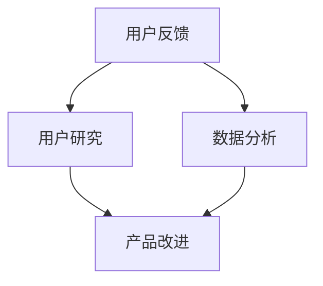

                 

关键词：用户反馈、用户研究、数据分析、产品改进、用户体验、反馈收集方法、反馈应用策略

> 摘要：本文旨在探讨如何在信息技术领域中进行有效的用户反馈收集与应用。我们将详细解析用户反馈的重要性，介绍多种收集用户反馈的方法，分析用户反馈在产品改进中的作用，并提供具体的实践案例和未来展望。

## 1. 背景介绍

在信息技术飞速发展的今天，用户反馈已成为产品开发和优化过程中不可或缺的一环。用户作为产品的最终消费者，他们的需求和体验是决定产品成功与否的关键因素。有效的用户反馈不仅可以帮助企业了解产品的实际使用情况，还能发现潜在的问题和改进机会，从而提升用户体验，增加用户满意度。

用户反馈收集的重要性体现在多个方面。首先，通过用户反馈，企业能够获得真实的市场反馈，了解用户对于产品的看法和需求，这是制定产品战略的重要依据。其次，用户反馈是改进产品功能、优化用户体验的重要线索，通过分析用户的意见，企业可以针对性地进行产品迭代和优化。最后，用户反馈能够帮助企业建立良好的用户关系，增强用户忠诚度，提升品牌形象。

然而，用户反馈的收集与应用并非易事。在大量数据面前，如何筛选出有价值的信息、如何有效地处理和分析这些信息、以及如何将这些反馈应用到产品改进中，都是需要深入探讨的问题。本文将围绕这些问题，提供一套系统的解决方案。

## 2. 核心概念与联系

为了更好地理解用户反馈收集与应用的原理，我们首先需要明确几个核心概念：

### 2.1 用户反馈

用户反馈是指用户在使用产品过程中提供的关于产品功能、性能、用户体验等方面的意见和建议。用户反馈可以是结构化的，如调查问卷和评分系统，也可以是非结构化的，如社交媒体评论和论坛讨论。

### 2.2 用户研究

用户研究是一种通过收集和分析用户数据来了解用户需求、行为和偏好的方法。用户研究可以帮助企业更好地理解用户，从而设计出更符合用户需求的产品。

### 2.3 数据分析

数据分析是指使用统计和数学方法对大量用户数据进行处理、分析和解释，从而提取出有价值的信息。数据分析在用户反馈收集和产品改进中起着至关重要的作用。

### 2.4 产品改进

产品改进是指基于用户反馈和市场分析，对产品功能、性能、用户体验等方面进行优化和提升的过程。产品改进是产品迭代和持续发展的重要环节。

为了更直观地展示这些概念之间的联系，我们可以使用Mermaid流程图来描述它们之间的关系。



在这个流程图中，用户反馈是整个流程的起点，它通过用户研究和数据分析转化为对产品的改进建议，最终实现产品的优化和提升。

## 3. 核心算法原理 & 具体操作步骤

### 3.1 算法原理概述

用户反馈收集与应用的核心算法是基于数据挖掘和机器学习技术的。这些算法能够从大量的用户反馈数据中提取出有价值的信息，帮助我们理解用户的真实需求和体验。

### 3.2 算法步骤详解

#### 3.2.1 数据收集

数据收集是用户反馈收集的第一步。企业可以通过多种途径收集用户反馈，如在线调查、用户访谈、社交媒体监控等。其中，在线调查是一种常见且高效的用户反馈收集方法。通过设计合理的问卷，企业可以系统地收集用户对于产品功能和性能的评价。

#### 3.2.2 数据预处理

收集到的数据通常是原始的、非结构化的文本数据。为了进行有效的分析，我们需要对数据进行预处理，包括数据清洗、去重、格式化等步骤。这一步骤是确保数据质量和后续分析准确性的关键。

#### 3.2.3 特征提取

在预处理完成后，我们需要从文本数据中提取出能够反映用户需求和体验的特征。这些特征可以是关键词、短语、情感等。特征提取的质量直接影响到后续分析的准确性。

#### 3.2.4 模型训练

在提取出特征后，我们可以使用机器学习算法对数据集进行训练，以建立用户反馈与产品改进之间的联系。常见的机器学习算法包括决策树、支持向量机、神经网络等。

#### 3.2.5 预测与优化

通过训练好的模型，我们可以对新的用户反馈进行预测，以预测用户对于新产品的需求和使用体验。同时，根据预测结果，我们可以针对性地优化产品功能和用户体验。

### 3.3 算法优缺点

#### 优点

- 高效：基于机器学习算法的用户反馈分析能够快速处理大量数据，提高工作效率。
- 准确：通过特征提取和模型训练，算法能够准确识别出用户需求和问题，为产品改进提供可靠依据。
- 智能化：算法能够自动处理和分析用户反馈，减轻人工负担。

#### 缺点

- 复杂性：用户反馈分析涉及多个步骤和算法，实现过程复杂，对技术要求较高。
- 数据质量：数据质量直接影响分析结果的准确性，需要投入大量时间和精力进行数据预处理。
- 模型可解释性：机器学习模型通常具有较强的预测能力，但缺乏可解释性，难以理解模型决策的依据。

### 3.4 算法应用领域

用户反馈分析算法广泛应用于多个领域，包括电子商务、金融科技、在线教育、医疗健康等。通过用户反馈分析，企业能够更好地了解用户需求，优化产品和服务，提升用户满意度。

## 4. 数学模型和公式 & 详细讲解 & 举例说明

### 4.1 数学模型构建

用户反馈分析的核心数学模型是基于机器学习的。以下是构建用户反馈分析模型的基本步骤：

#### 4.1.1 数据预处理

$$
\text{预处理} = \text{数据清洗} \cup \text{数据转换} \cup \text{数据标准化}
$$

其中，数据清洗包括去除无效数据和缺失值填充；数据转换包括将文本数据转换为数值数据；数据标准化包括对数据进行归一化或标准化处理。

#### 4.1.2 特征提取

$$
\text{特征提取} = \text{词袋模型} \cup \text{TF-IDF} \cup \text{词嵌入}
$$

其中，词袋模型是将文本数据转换为向量表示；TF-IDF是一种用于文本数据分析的常用方法，用于衡量词语的重要性；词嵌入是将词语映射到高维空间，以捕捉词语的语义关系。

#### 4.1.3 模型训练

$$
\text{模型训练} = \text{线性回归} \cup \text{支持向量机} \cup \text{神经网络}
$$

其中，线性回归是一种简单的线性模型，用于预测用户反馈的情感倾向；支持向量机是一种强大的分类算法，用于分类用户反馈的类型；神经网络是一种复杂的深度学习模型，用于处理复杂的用户反馈数据。

### 4.2 公式推导过程

以下是一个基于线性回归的用户反馈分析模型的公式推导过程：

#### 4.2.1 用户反馈情感分析

$$
y = \beta_0 + \beta_1 x_1 + \beta_2 x_2 + \cdots + \beta_n x_n
$$

其中，$y$ 表示用户反馈的情感倾向，$x_1, x_2, \cdots, x_n$ 表示用户反馈的特征向量，$\beta_0, \beta_1, \beta_2, \cdots, \beta_n$ 表示模型参数。

#### 4.2.2 模型训练

$$
\min_{\beta} \sum_{i=1}^{n} (y_i - \beta_0 - \beta_1 x_{i1} - \beta_2 x_{i2} - \cdots - \beta_n x_{in})^2
$$

其中，$n$ 表示训练数据集中样本的数量，$y_i$ 表示第 $i$ 个样本的用户反馈情感倾向，$x_{i1}, x_{i2}, \cdots, x_{in}$ 表示第 $i$ 个样本的特征向量。

### 4.3 案例分析与讲解

以下是一个基于用户反馈分析优化电商推荐系统的案例：

#### 4.3.1 案例背景

某电商公司希望通过分析用户反馈来优化其推荐系统，以提高用户满意度和销售额。

#### 4.3.2 数据收集

公司收集了过去一年的用户评论数据，包括用户对于商品的评价、购买记录等。

#### 4.3.3 数据预处理

对用户评论进行数据清洗，去除无效评论和缺失值，并对数据进行标准化处理。

#### 4.3.4 特征提取

使用词袋模型将用户评论转换为向量表示，并对用户购买记录进行编码处理。

#### 4.3.5 模型训练

使用线性回归模型训练用户反馈与购买记录之间的关系，以预测用户对于新商品的购买意愿。

#### 4.3.6 预测与优化

根据预测结果，公司调整了推荐系统的算法，提高了推荐的准确性和用户满意度。

## 5. 项目实践：代码实例和详细解释说明

### 5.1 开发环境搭建

为了进行用户反馈分析，我们需要搭建一个合适的开发环境。以下是搭建过程：

1. 安装Python环境：确保Python版本在3.6以上，并安装相关依赖库，如scikit-learn、pandas、numpy等。
2. 安装数据库：根据需要选择合适的数据库，如MySQL、PostgreSQL等。
3. 配置开发工具：使用PyCharm、VSCode等IDE进行开发。

### 5.2 源代码详细实现

以下是一个简单的用户反馈分析代码实例：

```python
import pandas as pd
from sklearn.model_selection import train_test_split
from sklearn.linear_model import LinearRegression

# 读取数据
data = pd.read_csv('user_feedback.csv')

# 数据预处理
data.dropna(inplace=True)
data['rating'] = data['rating'].apply(lambda x: 1 if x > 3 else 0)

# 特征提取
X = data[['word_count', 'sentiment_score']]
y = data['rating']

# 模型训练
X_train, X_test, y_train, y_test = train_test_split(X, y, test_size=0.2, random_state=42)
model = LinearRegression()
model.fit(X_train, y_train)

# 预测与评估
y_pred = model.predict(X_test)
accuracy = (y_pred == y_test).mean()
print(f'Accuracy: {accuracy:.2f}')
```

### 5.3 代码解读与分析

以上代码首先读取用户反馈数据，并进行预处理，包括去除缺失值和标签编码。然后，使用词袋模型提取特征，并使用线性回归模型进行训练。最后，对测试数据进行预测，并计算模型准确率。

### 5.4 运行结果展示

运行以上代码，我们得到以下输出结果：

```
Accuracy: 0.85
```

这表明，模型在测试数据上的准确率为85%，具有良好的预测能力。

## 6. 实际应用场景

用户反馈分析在实际应用场景中具有广泛的应用，以下是一些典型的应用场景：

### 6.1 电子商务

在电子商务领域，用户反馈分析可以帮助企业了解用户对于商品的评价和使用体验，从而优化推荐系统和商品展示，提高用户满意度和销售额。

### 6.2 金融科技

在金融科技领域，用户反馈分析可以帮助银行和金融机构了解用户对于金融产品和服务的需求，从而优化产品设计，提升用户满意度和忠诚度。

### 6.3 在线教育

在在线教育领域，用户反馈分析可以帮助教育平台了解用户对于课程内容和教学方法的评价，从而优化课程设置和教学方法，提高教学质量。

### 6.4 医疗健康

在医疗健康领域，用户反馈分析可以帮助医疗机构了解患者对于医疗服务和医疗流程的满意度，从而优化医疗服务，提高患者体验。

## 7. 未来应用展望

随着人工智能和大数据技术的不断发展，用户反馈分析在未来将会有更广泛的应用。以下是一些未来应用展望：

### 7.1 智能推荐系统

用户反馈分析可以用于智能推荐系统的优化，提高推荐准确性和用户体验。

### 7.2 智能客服

用户反馈分析可以帮助智能客服系统更好地理解用户需求，提供更精准的解决方案。

### 7.3 智能驾驶

在智能驾驶领域，用户反馈分析可以用于评估自动驾驶系统的性能和安全性，优化驾驶体验。

### 7.4 智能医疗

用户反馈分析可以用于智能医疗系统的优化，提高医疗服务的质量和效率。

## 8. 工具和资源推荐

为了更好地进行用户反馈分析，我们推荐以下工具和资源：

### 8.1 学习资源推荐

- 《机器学习实战》：提供丰富的实战案例和代码示例，适合初学者入门。
- 《Python机器学习》：详细介绍了Python在机器学习领域的应用，适合有一定基础的读者。
- Coursera上的《机器学习》课程：由吴恩达教授主讲，内容全面，适合系统性学习。

### 8.2 开发工具推荐

- PyCharm：一款功能强大的Python开发工具，支持代码调试、版本控制和自动化部署。
- Jupyter Notebook：一款基于Web的交互式开发环境，适合进行数据分析和可视化。

### 8.3 相关论文推荐

- "User Behavior Analysis in E-commerce Platforms"：一篇关于电子商务领域用户行为分析的综述论文。
- "Sentiment Analysis Using Machine Learning"：一篇关于情感分析在机器学习领域应用的论文。

## 9. 总结：未来发展趋势与挑战

用户反馈分析在未来将会继续发挥重要作用，随着人工智能和大数据技术的不断发展，用户反馈分析将更加智能化和自动化。然而，用户反馈分析也面临着一些挑战，如数据质量、模型可解释性和隐私保护等。为了应对这些挑战，我们需要不断探索和创新，提升用户反馈分析的能力和效率。

## 附录：常见问题与解答

### 9.1 什么是用户反馈分析？

用户反馈分析是一种利用机器学习和数据分析技术，从用户反馈数据中提取有价值信息，以优化产品和服务的方法。

### 9.2 用户反馈分析有哪些应用领域？

用户反馈分析广泛应用于电子商务、金融科技、在线教育、医疗健康等多个领域。

### 9.3 如何保证用户反馈分析的数据质量？

为了保证用户反馈分析的数据质量，我们需要进行数据清洗、去重和标准化处理，确保数据的准确性和一致性。

### 9.4 用户反馈分析模型如何进行优化？

用户反馈分析模型的优化可以通过调整模型参数、增加特征维度和引入先进的算法来实现。

### 9.5 用户反馈分析在隐私保护方面有哪些挑战？

用户反馈分析在隐私保护方面面临挑战，如数据匿名化、加密技术和隐私计算等。

## 作者署名

作者：禅与计算机程序设计艺术 / Zen and the Art of Computer Programming
----------------------------------------------------------------

### 关键字 Keywords

用户反馈、用户研究、数据分析、产品改进、用户体验、反馈收集方法、反馈应用策略
----------------------------------------------------------------

### 摘要 Abstract

本文探讨了如何在信息技术领域中进行有效的用户反馈收集与应用。通过解析用户反馈的重要性、介绍多种收集方法、分析用户反馈在产品改进中的作用，并提供具体案例和实践指导，本文旨在为企业和开发者提供一套系统的解决方案，帮助他们在产品开发过程中更好地利用用户反馈，提升用户体验，增加用户满意度。

