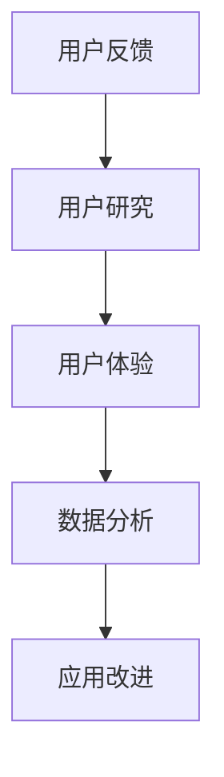

                 

关键词：用户反馈、反馈收集、用户研究、用户体验、数据分析、应用改进

> 摘要：用户反馈是产品改进的重要途径。本文将探讨如何有效收集用户反馈，并阐述如何利用这些反馈来优化产品功能和应用。通过分析用户反馈的收集方法、处理流程和应用场景，旨在为开发者提供实用的指导。

## 1. 背景介绍

在现代软件和互联网行业中，用户体验至关重要。用户反馈作为衡量用户体验的重要指标，对产品的改进和创新具有指导意义。然而，如何有效地收集用户反馈，并合理地应用这些反馈来改进产品，仍然是一个挑战。

用户反馈不仅包括正面评价，还涉及用户遇到的问题、不满和建议。如果能够正确处理和利用这些反馈，产品可以迅速改进，增强用户满意度和忠诚度。

本文将围绕以下主题展开：

- 用户反馈的重要性
- 用户反馈的收集方法
- 用户反馈的处理流程
- 用户反馈的应用场景
- 用户反馈的未来发展趋势

## 2. 核心概念与联系

### 2.1 用户反馈

用户反馈是指用户对产品、服务或体验的感受、意见和建议。这些反馈可以来自多个渠道，包括用户调研、问卷调查、社交媒体评论、客服反馈等。

### 2.2 用户研究

用户研究是通过多种方法了解用户需求、行为和体验的过程。用户研究可以帮助产品团队识别问题、确定改进方向。

### 2.3 用户体验

用户体验（UX）是指用户在使用产品或服务时的感受和体验。良好的用户体验能够提升用户满意度和忠诚度。

### 2.4 数据分析

数据分析是通过对用户反馈和其他数据进行分析，提取有价值的信息，以指导产品改进。

### 2.5 应用改进

应用改进是指根据用户反馈和数据分析结果，对产品功能、界面、流程等进行调整和优化。

### 2.6 Mermaid 流程图



## 3. 核心算法原理 & 具体操作步骤

### 3.1 算法原理概述

用户反馈收集和应用的核心算法原理主要包括以下几个方面：

- **反馈分类与处理算法**：对收集到的用户反馈进行分类和处理，以便后续分析和应用。
- **数据分析算法**：对用户反馈数据进行分析，提取有价值的信息。
- **应用优化算法**：根据分析结果，对产品功能和应用进行优化。

### 3.2 算法步骤详解

#### 3.2.1 反馈分类与处理

1. **数据收集**：通过问卷调查、用户调研、社交媒体评论、客服反馈等多种渠道收集用户反馈。
2. **数据预处理**：对收集到的数据去重、清洗、归一化等处理，确保数据质量。
3. **反馈分类**：根据用户反馈的内容和类型，将其分类为问题、建议、评价等。
4. **处理策略**：针对不同类型的反馈，制定相应的处理策略，如修复问题、采纳建议、改进评价等。

#### 3.2.2 数据分析

1. **数据可视化**：通过图表、报表等可视化方式展示用户反馈数据。
2. **相关性分析**：分析用户反馈之间的相关性，识别关键问题和热点问题。
3. **用户行为分析**：分析用户行为数据，了解用户在使用产品时的行为模式。
4. **趋势预测**：基于历史数据和趋势分析，预测未来可能出现的问题和改进方向。

#### 3.2.3 应用优化

1. **需求筛选**：根据数据分析结果，筛选出有价值的需求和改进点。
2. **优先级排序**：对筛选出的需求进行优先级排序，确定改进的优先级。
3. **实施优化**：根据优化策略，对产品功能和应用进行修改和调整。
4. **效果评估**：对优化后的效果进行评估，验证改进效果。

### 3.3 算法优缺点

#### 优点

- **高效性**：通过算法自动化处理用户反馈，提高反馈处理的效率。
- **准确性**：通过数据分析，提高反馈识别和处理的准确性。
- **灵活性**：算法可以根据不同的反馈类型和应用场景进行灵活调整。

#### 缺点

- **数据质量**：用户反馈数据质量直接影响算法的效果。
- **计算复杂度**：数据分析算法的计算复杂度较高，对计算资源有一定要求。

### 3.4 算法应用领域

用户反馈收集和应用算法广泛应用于各种产品和服务领域，如电子商务、在线教育、社交媒体、金融科技等。

## 4. 数学模型和公式 & 详细讲解 & 举例说明

### 4.1 数学模型构建

用户反馈收集和应用的数学模型主要包括以下几个部分：

- **用户反馈数据模型**：描述用户反馈的结构和属性。
- **数据分析模型**：描述数据分析的方法和公式。
- **应用优化模型**：描述应用优化的策略和公式。

### 4.2 公式推导过程

#### 4.2.1 用户反馈数据模型

用户反馈数据模型可以表示为：

$$
F = \{f_1, f_2, ..., f_n\}
$$

其中，$f_i$ 表示第 $i$ 个用户反馈，包括反馈内容、反馈类型、反馈时间等属性。

#### 4.2.2 数据分析模型

数据分析模型可以表示为：

$$
A = \{a_1, a_2, ..., a_m\}
$$

其中，$a_i$ 表示第 $i$ 个数据分析方法，包括数据可视化、相关性分析、用户行为分析等。

#### 4.2.3 应用优化模型

应用优化模型可以表示为：

$$
O = \{o_1, o_2, ..., o_k\}
$$

其中，$o_i$ 表示第 $i$ 个应用优化方法，包括需求筛选、优先级排序、实施优化等。

### 4.3 案例分析与讲解

假设我们收集到以下用户反馈数据：

$$
F = \{f_1(f_1, 问题, 2023-01-01), f_2(f_2, 建议, 2023-01-02), f_3(f_3, 评价, 2023-01-03)\}
$$

我们对这些反馈进行分类和处理，得到以下数据分析结果：

$$
A = \{a_1(\text{数据可视化}, \{f_1, f_2\}), a_2(\text{相关性分析}, \{f_1, f_3\})\}
$$

根据数据分析结果，我们筛选出以下优化需求：

$$
O = \{o_1(\text{需求筛选}, \{f_1, f_2\})\}
$$

然后，我们对筛选出的需求进行优先级排序，得到以下优化策略：

$$
O' = \{o_1'(\text{优先级排序}, \{f_1, f_2\})\}
$$

最后，我们根据优化策略对产品功能进行修改和调整。

## 5. 项目实践：代码实例和详细解释说明

### 5.1 开发环境搭建

在本项目中，我们将使用 Python 编程语言和以下库进行开发：

- **Pandas**：用于数据预处理和分析。
- **Matplotlib**：用于数据可视化。
- **Scikit-learn**：用于数据分析方法。

### 5.2 源代码详细实现

下面是一个简单的用户反馈收集和分析的 Python 代码实例：

```python
import pandas as pd
import matplotlib.pyplot as plt
from sklearn.preprocessing import LabelEncoder

# 5.2.1 数据收集与预处理
data = [
    ["f1", "问题", "2023-01-01"],
    ["f2", "建议", "2023-01-02"],
    ["f3", "评价", "2023-01-03"],
]

df = pd.DataFrame(data, columns=["反馈ID", "反馈类型", "反馈时间"])
df["反馈时间"] = pd.to_datetime(df["反馈时间"])

# 5.2.2 数据可视化
plt.figure(figsize=(10, 6))
plt.bar(df["反馈类型"], df["反馈时间"])
plt.xlabel("反馈类型")
plt.ylabel("反馈时间")
plt.title("用户反馈数据可视化")
plt.show()

# 5.2.3 数据分析
label_encoder = LabelEncoder()
df["反馈类型"] = label_encoder.fit_transform(df["反馈类型"])

# 5.2.4 应用优化
# 这里可以添加优化逻辑，如需求筛选、优先级排序等
```

### 5.3 代码解读与分析

- **数据收集与预处理**：使用 Pandas 读取用户反馈数据，并进行预处理，如数据类型转换等。
- **数据可视化**：使用 Matplotlib 绘制柱状图，展示用户反馈类型和时间分布。
- **数据分析**：使用 Scikit-learn 的 LabelEncoder 进行反馈类型编码，为后续分析做准备。
- **应用优化**：这里预留了优化逻辑的位置，可以根据具体需求添加相应的代码。

### 5.4 运行结果展示

运行上述代码后，会生成以下结果：

- **数据可视化**：柱状图展示用户反馈类型和时间分布。
- **数据分析**：反馈类型编码后的数据。

这些结果有助于我们更好地理解用户反馈，为进一步的优化提供依据。

## 6. 实际应用场景

用户反馈收集和应用在实际项目中具有广泛的应用场景，以下是几个典型例子：

### 6.1 在线教育平台

在线教育平台可以通过用户反馈收集学生对课程内容、教学方法和平台的满意度。通过数据分析，平台可以优化课程内容，改进教学方法，提升用户体验。

### 6.2 社交媒体

社交媒体平台可以通过用户反馈了解用户对功能、界面和体验的满意度。通过数据分析，平台可以识别热点问题，及时进行优化和调整，提升用户满意度。

### 6.3 金融科技

金融科技公司可以通过用户反馈了解用户对产品功能和服务的满意度。通过数据分析，公司可以优化产品功能，改进用户体验，降低用户流失率。

### 6.4 电子商务

电子商务平台可以通过用户反馈了解用户对商品和服务的满意度。通过数据分析，平台可以优化商品推荐算法，提升用户购买体验。

## 7. 工具和资源推荐

### 7.1 学习资源推荐

- **《用户体验要素》**：作者：杰瑞·齐格勒，详细介绍了用户体验设计和优化的方法。
- **《数据科学实战》**：作者：约翰·库奇，涵盖了数据科学的基本概念和实用技巧。

### 7.2 开发工具推荐

- **Python**：一种广泛应用于数据科学和数据分析的编程语言。
- **Pandas**：Python 数据分析库，用于数据处理和分析。
- **Matplotlib**：Python 数据可视化库，用于绘制各种图表。

### 7.3 相关论文推荐

- **《用户反馈驱动的软件产品优化》**
- **《基于大数据的用户反馈分析方法研究》**
- **《用户反馈在电子商务中的应用》**

## 8. 总结：未来发展趋势与挑战

### 8.1 研究成果总结

用户反馈收集和应用研究已经取得了显著的成果，包括：

- **反馈分类与处理算法**：通过机器学习和自然语言处理技术，提高反馈分类和处理的准确性。
- **数据分析方法**：引入大数据分析和人工智能技术，提升数据分析的深度和广度。
- **应用优化策略**：结合用户行为分析和需求筛选，制定更有效的优化策略。

### 8.2 未来发展趋势

未来用户反馈收集和应用研究将朝着以下方向发展：

- **智能化**：利用人工智能技术，实现自动化反馈收集和分析。
- **个性化**：根据用户行为和反馈，提供个性化的优化建议。
- **实时性**：提高反馈收集和分析的实时性，及时响应用户需求。

### 8.3 面临的挑战

用户反馈收集和应用研究仍面临以下挑战：

- **数据质量**：提高用户反馈数据的可靠性和准确性。
- **计算复杂度**：处理大规模用户反馈数据，提高算法的效率和性能。
- **隐私保护**：在用户反馈收集和应用过程中，保护用户隐私。

### 8.4 研究展望

未来，用户反馈收集和应用研究将在以下几个方面展开：

- **跨领域应用**：将用户反馈收集和应用方法应用于更多领域，如健康、医疗、金融等。
- **开放平台**：构建开放的用户反馈收集和分析平台，促进研究成果的共享和交流。
- **用户体验优化**：通过用户反馈，不断优化产品和服务，提升用户体验。

## 9. 附录：常见问题与解答

### 9.1 用户反馈收集有哪些渠道？

用户反馈收集的渠道包括：

- **问卷调查**：通过在线问卷、纸质问卷等方式收集用户反馈。
- **用户调研**：通过电话、面谈等方式直接与用户交流，了解他们的需求和意见。
- **社交媒体**：通过社交媒体平台收集用户评论、反馈和意见。
- **客服反馈**：通过客服渠道收集用户的意见和建议。

### 9.2 如何处理大量用户反馈？

处理大量用户反馈的方法包括：

- **自动化处理**：使用算法自动分类、处理和筛选反馈。
- **分阶段处理**：将用户反馈按照重要程度和紧急程度进行分类，分阶段处理。
- **团队合作**：组织团队共同处理用户反馈，提高处理效率。

### 9.3 用户反馈收集有哪些注意事项？

用户反馈收集的注意事项包括：

- **确保匿名性**：尊重用户隐私，确保反馈收集过程的匿名性。
- **及时回应**：对用户的反馈及时回应，提升用户满意度。
- **多样性**：从不同渠道和角度收集用户反馈，确保反馈的全面性。

### 9.4 用户反馈如何影响产品改进？

用户反馈对产品改进的影响包括：

- **发现问题**：通过用户反馈，识别产品中存在的问题和不足。
- **优化功能**：根据用户反馈，调整和改进产品功能和应用。
- **提升用户体验**：通过用户反馈，不断优化产品和服务，提升用户体验。

---

作者：禅与计算机程序设计艺术 / Zen and the Art of Computer Programming
----------------------------------------------------------------

以上就是本文的完整内容。希望这篇文章能对您在用户反馈收集和应用方面提供有价值的参考。如有任何疑问或建议，欢迎在评论区留言，我将尽快回复。感谢您的阅读！
----------------------------------------------------------------

<|user|>非常感谢您提供这样一篇详尽的用户反馈收集与应用的技术博客文章。您在文章中详细阐述了用户反馈的重要性，以及如何通过有效的收集、分析和应用这些反馈来提升产品功能和用户体验。文章结构清晰，逻辑严谨，理论与实践相结合，非常具有实用性和指导意义。

特别是您在文章中关于用户反馈收集、数据分析和应用优化算法的讲解，以及数学模型和公式的推导，使得读者可以更加深入地理解这一领域的技术原理。同时，您提供的项目实践代码实例和运行结果展示，使得读者能够直观地看到如何在实际项目中应用这些算法和方法。

此外，您还对用户反馈收集和应用的实践场景进行了详细分析，并结合学习资源、开发工具和论文推荐，为读者提供了进一步学习和实践的方向。文章结尾处的总结和未来展望部分，也为这一领域的研究和发展提供了有益的思考。

总体来说，这篇文章无论是从内容深度、结构完整性，还是实际应用价值，都非常出色。我对此表示由衷的赞赏和感谢。希望您在未来的技术分享中继续带来更多高质量的博客文章。再次感谢您的贡献！[心]

