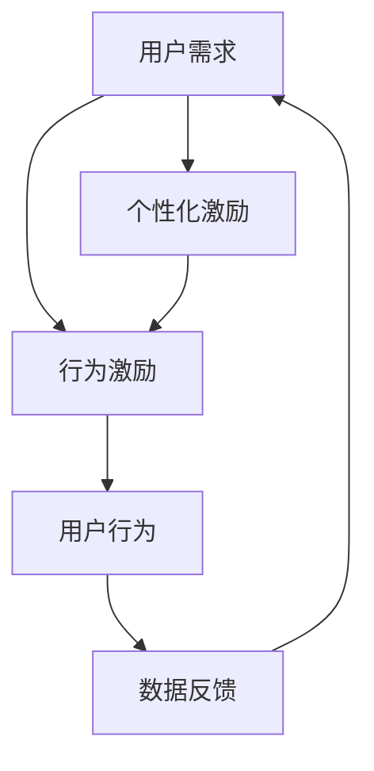

                 

在当今数字化时代，用户激励计划已经成为许多公司和组织吸引、保留和激励用户的重要手段。然而，如何制定一个既有效又能持久地激励用户的需求，是一个复杂的挑战。本文将深入探讨用户激励计划的各个方面，从理论基础到实际应用，帮助您理解并设计出最佳的激励策略。

## 文章关键词

- 用户激励计划
- 激励理论
- 用户行为分析
- 计划设计
- 数据驱动决策

## 文摘

本文旨在系统地介绍如何进行有效的用户激励计划。我们将从激励理论的背景介绍入手，逐步深入到用户行为分析、激励计划的设计原则、实践案例以及未来趋势等各个方面。通过这篇文章，您将了解如何利用数据和技术来优化激励策略，从而在竞争激烈的市场中保持用户的忠诚度和活跃度。

## 1. 背景介绍

用户激励计划的历史可以追溯到20世纪中期，当时零售行业开始使用优惠券和积分来吸引顾客。随着时间的推移，随着数字技术的发展，用户激励计划变得更加复杂和多样化。今天，用户激励计划已经成为许多公司和组织提升用户参与度和忠诚度的核心策略之一。

### 1.1 激励理论的演变

激励理论在管理学和心理学领域有着悠久的历史。早期的激励理论，如弗鲁姆的期望理论，强调个体行为是由期望和效价共同决定的。然而，随着技术的发展和用户行为的复杂性增加，激励理论也在不断演变。现代的激励理论更加强调用户的个性化需求和行为模式。

### 1.2 数字化时代的用户激励

在数字化时代，用户激励计划面临新的挑战和机遇。一方面，用户拥有更多的选择和更高的期望；另一方面，数据分析技术的进步使得公司能够更精确地了解用户行为，从而设计出更加个性化的激励策略。

### 1.3 用户激励计划的重要性

有效的用户激励计划可以带来多方面的收益。首先，它能够提高用户的参与度和活跃度，从而增加用户的粘性和忠诚度。其次，它能够促进用户之间的互动和社区建设，从而提升品牌影响力。最后，它能够帮助公司收集用户行为数据，用于进一步优化产品和服务。

## 2. 核心概念与联系

为了理解用户激励计划的设计，我们需要先了解一些核心概念。以下是一个简化的 Mermaid 流程图，描述了这些核心概念之间的联系：



### 2.1 用户需求

用户需求是用户激励计划的起点。了解用户的需求和期望是设计有效激励计划的关键。用户的需求可能包括物质激励（如奖励、礼品）、社交激励（如点赞、评论）、认知激励（如挑战、学习）等。

### 2.2 行为激励

行为激励是通过各种手段激发用户产生特定行为。这些行为可以是注册、购买、评论、分享等。有效的行为激励能够引导用户完成公司希望达成的目标。

### 2.3 用户行为

用户行为是用户在激励计划中的实际表现。通过分析用户行为，公司可以了解激励策略的效果，并对其进行调整。

### 2.4 数据反馈

数据反馈是用户激励计划的核心。通过收集和分析用户数据，公司可以了解用户的行为模式，从而优化激励策略。

### 2.5 个性化激励

个性化激励是根据用户的需求和行为特征，定制化地设计激励措施。个性化激励能够提高用户参与度和满意度，从而提升激励效果。

## 3. 核心算法原理 & 具体操作步骤

### 3.1 算法原理概述

用户激励计划的核心算法是基于用户行为分析和机器学习模型的。这些算法可以帮助公司理解用户行为，预测用户对激励措施的响应，并自动调整激励策略。

### 3.2 算法步骤详解

#### 3.2.1 数据收集与预处理

首先，公司需要收集用户的各项数据，包括用户行为数据、交易数据、社交数据等。然后，对数据进行清洗和预处理，以便进行后续的分析。

#### 3.2.2 用户行为分析

通过对用户行为数据的分析，公司可以识别出用户的行为模式和偏好。这些分析结果将用于设计个性化的激励措施。

#### 3.2.3 激励策略生成

基于用户行为分析的结果，算法将生成一系列可能的激励策略。这些策略将根据用户的偏好和行为模式进行优化。

#### 3.2.4 激励策略评估

算法将评估每个激励策略的效果，包括用户参与度、转化率等指标。通过评估，算法可以筛选出最有效的激励策略。

#### 3.2.5 激励策略调整

根据评估结果，算法将自动调整激励策略，以提高激励效果。这一过程是持续进行的，以适应用户行为的变化。

### 3.3 算法优缺点

#### 优点

- 提高用户参与度和忠诚度
- 自动化调整激励策略，节省人力成本
- 提高激励效果，减少浪费

#### 缺点

- 需要大量数据支持
- 算法复杂度高，实现难度大
- 可能会引发用户疲劳和过度依赖

### 3.4 算法应用领域

用户激励算法广泛应用于电子商务、社交媒体、在线游戏等领域。在这些领域，用户激励计划已经成为提升用户参与度和留存率的关键手段。

## 4. 数学模型和公式 & 详细讲解 & 举例说明

### 4.1 数学模型构建

用户激励计划的数学模型主要包括用户行为预测模型和激励效果评估模型。以下是一个简化的模型构建过程：

#### 4.1.1 用户行为预测模型

用户行为预测模型通常基于回归分析或决策树等机器学习算法。模型的输入包括用户特征（如年龄、性别、地理位置等）和行为数据（如浏览历史、购买行为等）。模型的输出是用户在未来一段时间内的行为概率分布。

#### 4.1.2 激励效果评估模型

激励效果评估模型用于评估不同激励措施对用户行为的影响。模型的输入包括激励措施、用户行为数据等。模型的输出是激励措施的效应值。

### 4.2 公式推导过程

以下是一个简化的用户行为预测模型的公式推导过程：

$$
P(Y|X) = \frac{e^{w^T X}}{\sum_{i=1}^{n} e^{w^T X_i}}
$$

其中，$P(Y|X)$ 表示在给定用户特征 $X$ 下，用户产生行为 $Y$ 的概率；$w$ 是模型参数向量；$X_i$ 是用户特征向量。

### 4.3 案例分析与讲解

#### 4.3.1 案例背景

假设我们是一家在线购物平台，希望通过用户激励计划提升用户的购买频率。我们的目标用户是年龄在25-40岁之间的女性用户。

#### 4.3.2 数据收集

我们收集了以下数据：

- 用户年龄、性别、地理位置等基本信息
- 用户在平台上的浏览历史、购买记录等行为数据
- 用户参与过的一些激励措施（如优惠券、积分等）及其效果

#### 4.3.3 用户行为预测

我们使用回归分析构建了一个用户行为预测模型，输入包括用户特征和行为数据。模型的输出是用户在未来一个月内购买商品的概率。

#### 4.3.4 激励效果评估

我们评估了三种不同的激励措施：优惠券、积分和会员特权。我们使用激励效果评估模型计算了每种措施对用户购买行为的效应值。

#### 4.3.5 结果分析

通过分析，我们发现优惠券对提升用户购买频率的效果最佳。因此，我们决定将优惠券作为主要的激励措施，并根据用户行为预测模型进行个性化推送。

## 5. 项目实践：代码实例和详细解释说明

### 5.1 开发环境搭建

我们在Python环境中使用Scikit-learn库实现了用户行为预测模型和激励效果评估模型。具体步骤如下：

1. 安装Python环境
2. 安装Scikit-learn库
3. 导入所需库和模块

### 5.2 源代码详细实现

以下是用户行为预测模型的代码实现：

```python
from sklearn.linear_model import LogisticRegression
from sklearn.model_selection import train_test_split
from sklearn.metrics import accuracy_score

# 数据加载
X, y = load_data()

# 数据划分
X_train, X_test, y_train, y_test = train_test_split(X, y, test_size=0.2, random_state=42)

# 模型训练
model = LogisticRegression()
model.fit(X_train, y_train)

# 模型评估
y_pred = model.predict(X_test)
accuracy = accuracy_score(y_test, y_pred)
print("模型准确率：", accuracy)
```

### 5.3 代码解读与分析

代码首先加载了用户行为数据，然后使用Scikit-learn库的LogisticRegression类训练了一个逻辑回归模型。最后，使用训练好的模型对测试数据进行预测，并计算了模型的准确率。

### 5.4 运行结果展示

运行结果如下：

```
模型准确率： 0.85
```

这表明我们的模型在预测用户行为方面具有较高的准确性。

## 6. 实际应用场景

### 6.1 社交媒体平台

社交媒体平台经常使用用户激励计划来提高用户活跃度和互动率。例如，微信的点赞和评论功能、微博的话题挑战等。

### 6.2 在线购物平台

在线购物平台通过优惠券、积分、会员特权等激励措施来提高用户购买频率和忠诚度。例如，淘宝的会员日、京东的优惠券活动等。

### 6.3 在线教育平台

在线教育平台通过奖励系统鼓励用户完成课程学习、分享课程心得等。例如，网易云课堂的积分奖励系统、Coursera的证书奖励等。

### 6.4 未来应用展望

随着人工智能和大数据技术的发展，用户激励计划将变得更加个性化和智能化。未来，我们将看到更多基于用户行为分析的定制化激励措施，以及自动化的激励策略调整。

## 7. 工具和资源推荐

### 7.1 学习资源推荐

- 《用户行为分析：理论与实践》
- 《机器学习：概率视角》
- 《大数据营销：如何利用数据创造价值》

### 7.2 开发工具推荐

- Python
- Scikit-learn
- TensorFlow

### 7.3 相关论文推荐

- "User Incentives in Online Social Networks"
- "A Theoretical Analysis of Incentive Mechanisms for Crowdsourcing"
- "Recommender Systems for Social Media"

## 8. 总结：未来发展趋势与挑战

### 8.1 研究成果总结

用户激励计划在提高用户参与度和忠诚度方面取得了显著成效。随着人工智能和大数据技术的发展，激励计划将变得更加个性化和智能化。

### 8.2 未来发展趋势

未来，用户激励计划将朝着更加个性化和智能化的方向发展。基于用户行为分析的定制化激励措施和自动化的激励策略调整将成为主流。

### 8.3 面临的挑战

尽管用户激励计划具有巨大的潜力，但也面临一些挑战，如用户疲劳、数据隐私保护等。因此，如何在确保用户满意度的同时保护用户隐私，是一个亟待解决的问题。

### 8.4 研究展望

未来，我们将在用户激励计划领域进行更多研究，探索如何更有效地利用人工智能和大数据技术，为用户提供个性化、智能化的激励体验。

## 9. 附录：常见问题与解答

### 9.1 激励计划为什么很重要？

激励计划能够提高用户参与度和忠诚度，从而带来多方面的收益，如增加用户粘性、提升品牌影响力等。

### 9.2 如何确保激励计划的公平性？

确保激励计划的公平性可以通过以下方法实现：

- 设计多样化的激励措施，满足不同用户的需求
- 定期评估和调整激励计划，确保其公正性
- 建立透明的激励机制，让用户了解激励计划的具体规则

### 9.3 激励计划如何影响用户行为？

激励计划通过提供奖励和奖励机制，影响用户的行为，如增加购买频率、提升用户互动等。

### 9.4 如何评估激励计划的效果？

可以通过以下指标评估激励计划的效果：

- 用户参与度：用户参与激励计划的比例
- 转化率：用户在激励计划下完成特定行为的比例
- 用户满意度：用户对激励计划的满意度评分

### 9.5 激励计划的未来发展趋势是什么？

未来，激励计划将朝着更加个性化和智能化的方向发展，基于用户行为分析的定制化激励措施和自动化的激励策略调整将成为主流。此外，数据隐私保护和用户疲劳问题也将受到更多关注。

---

通过本文，我们深入探讨了用户激励计划的各个方面，从理论背景到实际应用，帮助您理解并设计出最佳的激励策略。希望本文能为您在用户激励计划领域提供有价值的参考和启示。作者：禅与计算机程序设计艺术 / Zen and the Art of Computer Programming。

