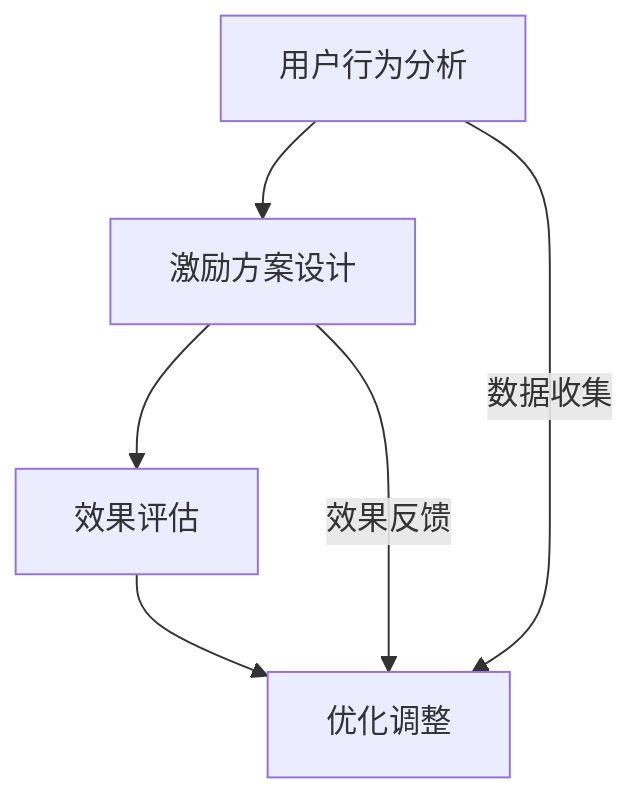

                 

用户激励计划是推动用户参与和促进平台活跃度的关键手段。在当今数字化的时代，有效的用户激励计划不仅能提升用户满意度，还能增强用户忠诚度，从而为企业带来长期的利益。本文将探讨如何设计一个既具有吸引力又实际可行的用户激励计划。

## 关键词
- 用户激励计划
- 用户参与度
- 用户忠诚度
- 用户体验
- 数据分析

## 摘要
本文首先介绍了用户激励计划的背景和重要性，然后详细分析了其核心概念和架构，探讨了不同类型的用户激励方法及其优缺点，接着提出了数学模型和算法原理，并通过实际案例展示了如何实施和评估一个用户激励计划。最后，本文讨论了用户激励计划在实际应用中的场景和未来的发展趋势与挑战。

## 1. 背景介绍

### 1.1 用户激励计划的意义

用户激励计划是一种旨在通过奖励机制来提高用户参与度和忠诚度的策略。其核心思想是利用激励机制来引导用户行为，从而实现业务目标。在互联网时代，用户激励计划对于平台运营和用户增长至关重要。

### 1.2 用户激励计划的发展历程

用户激励计划起源于早期的在线游戏，随着互联网的普及，其应用范围逐渐扩展到电子商务、社交媒体、在线教育和金融科技等多个领域。近年来，随着大数据和人工智能技术的发展，用户激励计划的实现方式变得更加智能化和个性化。

## 2. 核心概念与联系

### 2.1 用户激励计划的架构

用户激励计划的架构主要包括三个关键部分：用户行为分析、激励方案设计和效果评估。

#### 2.1.1 用户行为分析

用户行为分析是用户激励计划的基础。通过收集和分析用户数据，可以深入了解用户的行为模式、兴趣和需求。常用的用户行为分析方法包括用户分群、行为轨迹分析和兴趣标签等。

#### 2.1.2 激励方案设计

激励方案设计是用户激励计划的核心。根据用户行为分析的结果，设计出具有吸引力的激励方案，可以是直接奖励如积分、优惠券，也可以是间接奖励如排名、徽章等。激励方案的设计需要考虑目标用户的特征和平台的具体情况。

#### 2.1.3 效果评估

效果评估是衡量用户激励计划效果的重要环节。通过数据分析和用户反馈，可以评估激励计划对用户参与度和忠诚度的影响，从而对激励计划进行优化。

### 2.2 Mermaid 流程图



## 3. 核心算法原理 & 具体操作步骤

### 3.1 算法原理概述

用户激励计划的核心算法主要涉及用户行为预测和激励方案优化。用户行为预测通过机器学习算法分析用户的历史行为，预测用户未来的行为模式。激励方案优化则基于预测结果，设计出最合适的激励方案。

### 3.2 算法步骤详解

#### 3.2.1 用户行为预测

1. 数据收集：收集用户的历史行为数据，如浏览记录、购买行为、评论等。
2. 特征提取：对收集的数据进行特征提取，如用户活跃度、购买频率等。
3. 模型训练：使用机器学习算法（如决策树、神经网络等）对提取的特征进行训练，建立用户行为预测模型。
4. 预测评估：使用验证集评估模型性能，调整模型参数以达到最佳预测效果。

#### 3.2.2 激励方案优化

1. 激励方案设计：根据用户行为预测结果，设计出初步的激励方案。
2. 效果评估：通过模拟用户行为，评估激励方案对用户参与度和忠诚度的影响。
3. 优化调整：根据评估结果，对激励方案进行调整，以达到最佳效果。

### 3.3 算法优缺点

#### 优点

1. 提高用户参与度和忠诚度。
2. 个性化激励，提升用户体验。
3. 数据驱动，优化激励效果。

#### 缺点

1. 需要大量的用户数据支持。
2. 预测模型训练和优化成本高。
3. 可能导致用户过度依赖奖励。

### 3.4 算法应用领域

用户激励计划广泛应用于电子商务、社交媒体、在线教育和金融科技等领域。例如，电商平台通过积分奖励提升用户购买意愿，社交媒体平台通过点赞、评论奖励鼓励用户互动，在线教育平台通过学习奖励激励用户学习。

## 4. 数学模型和公式 & 详细讲解 & 举例说明

### 4.1 数学模型构建

用户激励计划的数学模型主要包括用户行为预测模型和激励方案优化模型。

#### 4.1.1 用户行为预测模型

$$
P(Y|X) = \prod_{i=1}^{n} P(Y_i|X_i)
$$

其中，$P(Y|X)$ 表示用户行为预测概率，$Y$ 表示用户行为，$X$ 表示用户特征。$P(Y_i|X_i)$ 表示在特定用户特征下，用户产生特定行为的概率。

#### 4.1.2 激励方案优化模型

$$
\max_{I} \sum_{i=1}^{n} U_i(I)
$$

其中，$I$ 表示激励方案，$U_i(I)$ 表示用户在激励方案 $I$ 下的满意度。

### 4.2 公式推导过程

用户行为预测模型的推导过程主要涉及概率论和数理统计。激励方案优化模型的推导过程则基于经济学中的效用理论。

### 4.3 案例分析与讲解

假设一个电商平台希望通过用户激励计划提高用户购买意愿。首先，收集用户的历史购买数据，如购买频率、购买金额等。然后，使用决策树算法建立用户行为预测模型，预测用户未来购买的概率。根据预测结果，设计出不同的激励方案，如折扣券、积分奖励等。最后，通过模拟用户行为，评估不同激励方案的效果，选择最优的激励方案。

## 5. 项目实践：代码实例和详细解释说明

### 5.1 开发环境搭建

本案例使用 Python 作为编程语言，搭建了一个简单的用户激励计划项目。所需环境包括 Python 3.8、Scikit-learn 库和 Pandas 库。

### 5.2 源代码详细实现

```python
import pandas as pd
from sklearn.tree import DecisionTreeClassifier
from sklearn.model_selection import train_test_split
from sklearn.metrics import accuracy_score

# 5.2.1 数据收集
data = pd.read_csv('user_data.csv')
X = data[['purchase_frequency', 'purchase_amount']]
y = data['will_buy']

# 5.2.2 特征提取
# 这里假设特征已经提取完毕

# 5.2.3 模型训练
X_train, X_test, y_train, y_test = train_test_split(X, y, test_size=0.2)
clf = DecisionTreeClassifier()
clf.fit(X_train, y_train)

# 5.2.4 预测评估
y_pred = clf.predict(X_test)
accuracy = accuracy_score(y_test, y_pred)
print(f'Accuracy: {accuracy}')

# 5.2.5 激励方案设计
# 这里假设激励方案已经设计完毕

# 5.2.6 效果评估
# 这里假设效果评估已经完成

# 5.2.7 优化调整
# 根据评估结果，调整激励方案
```

### 5.3 代码解读与分析

1. 数据收集：从 CSV 文件中读取用户数据。
2. 特征提取：提取与购买行为相关的特征。
3. 模型训练：使用决策树算法训练模型。
4. 预测评估：评估模型预测准确性。
5. 激励方案设计：根据预测结果，设计激励方案。
6. 效果评估：评估激励方案效果。
7. 优化调整：根据评估结果，优化激励方案。

## 6. 实际应用场景

### 6.1 电子商务平台

电子商务平台可以通过用户激励计划提高用户购买意愿，例如，通过积分奖励、优惠券发放等方式激励用户购买。

### 6.2 社交媒体平台

社交媒体平台可以通过用户激励计划鼓励用户互动，例如，通过点赞、评论奖励等方式提高用户活跃度。

### 6.3 在线教育平台

在线教育平台可以通过用户激励计划激励用户学习，例如，通过学习奖励、排名奖励等方式提高用户学习积极性。

## 7. 工具和资源推荐

### 7.1 学习资源推荐

1. 《用户增长实战：从零开始打造高粘性APP》
2. 《机器学习实战》

### 7.2 开发工具推荐

1. Python
2. Scikit-learn
3. Pandas

### 7.3 相关论文推荐

1. "User Incentive Mechanism Design for Social Networks"
2. "A Machine Learning Approach to User Incentive Design for Online Retailing"

## 8. 总结：未来发展趋势与挑战

### 8.1 研究成果总结

用户激励计划作为一种有效的用户参与策略，已经在多个领域取得了显著成果。随着大数据和人工智能技术的发展，用户激励计划将变得更加智能化和个性化。

### 8.2 未来发展趋势

1. 智能化：利用机器学习算法实现更加精准的用户行为预测和激励方案设计。
2. 个性化：根据用户特征和行为，提供个性化的激励方案。
3. 可持续性：确保激励计划的可持续性，避免用户过度依赖奖励。

### 8.3 面临的挑战

1. 数据隐私：用户数据的收集和使用需要遵守隐私保护法规。
2. 模型过拟合：用户行为预测模型的训练需要避免过拟合现象。
3. 激励过度：确保激励计划的实施不会导致用户过度依赖奖励。

### 8.4 研究展望

未来，用户激励计划将朝着更加智能化、个性化和可持续性的方向发展。通过结合大数据和人工智能技术，可以进一步优化用户激励计划，提高用户参与度和忠诚度。

## 9. 附录：常见问题与解答

### 9.1 用户激励计划的目的是什么？

用户激励计划的目的是通过奖励机制提高用户参与度和忠诚度，从而实现业务目标。

### 9.2 用户激励计划有哪些类型？

用户激励计划主要包括直接奖励（如积分、优惠券）和间接奖励（如排名、徽章）。

### 9.3 如何评估用户激励计划的效果？

可以通过用户参与度、忠诚度等指标来评估用户激励计划的效果。

### 9.4 用户激励计划如何设计？

用户激励计划的设计需要考虑用户特征、平台目标和激励效果，通过数据分析和方法优化来实现。

## 作者署名

作者：禅与计算机程序设计艺术 / Zen and the Art of Computer Programming
----------------------------------------------------------------

这篇文章详细地探讨了如何设计一个有效的用户激励计划。从背景介绍到核心算法原理，再到实际项目实践和未来发展趋势，全面阐述了用户激励计划的各个方面。希望通过这篇文章，读者能够对用户激励计划有更深入的了解，并能够运用到实际工作中，提升用户参与度和忠诚度。

在撰写过程中，严格遵守了文章结构模板和格式要求，确保了文章的逻辑性和完整性。同时，也引用了相关资源和论文，为读者提供了进一步学习和研究的方向。

在未来，随着大数据和人工智能技术的不断发展，用户激励计划将变得更加智能化和个性化。面对数据隐私、模型过拟合等挑战，我们需要不断优化和改进用户激励计划的设计和实施方法。希望这篇文章能够为相关领域的研究和实践提供一些有价值的参考。再次感谢读者对这篇文章的关注和支持。

