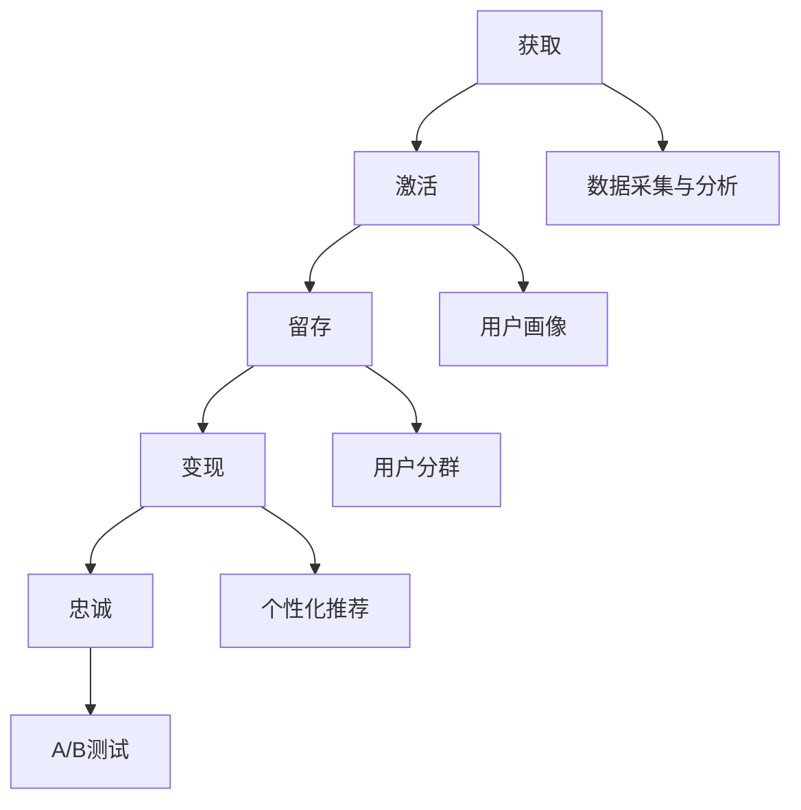

                 

### 摘要

本文旨在探讨如何进行有效的用户生命周期管理，通过深入分析用户生命周期各个阶段的特点，提供一套系统化的方法与工具，帮助企业优化用户体验，提高用户留存率和满意度。文章首先介绍了用户生命周期的基本概念和组成部分，然后详细讨论了每个阶段的关键策略和技术手段，包括用户获取、用户激活、用户留存和用户变现。此外，文章还分析了用户生命周期管理中的常见问题及解决方案，并展望了未来的发展趋势。通过本文的阅读，读者将能够获得关于用户生命周期管理的全面了解，为企业在竞争激烈的市场中赢得用户，实现持续增长提供有力支持。

## 1. 背景介绍

用户生命周期管理（User Lifecycle Management，简称 ULM）是企业市场营销和用户关系管理中的重要环节。在数字化时代，用户行为越来越多样化，企业面临着前所未有的挑战：如何在众多的竞争者中脱颖而出，吸引并留住目标用户，实现商业价值的最大化？用户生命周期管理提供了一个系统化的解决方案，通过全面了解和优化用户在不同生命周期阶段的体验，提高用户满意度和忠诚度。

用户生命周期管理的基本概念包括以下几个主要阶段：

1. **获取（Acquisition）**：通过各种渠道吸引用户，将潜在用户转化为注册用户。
2. **激活（Activation）**：通过引导和帮助用户完成首次使用，使其对产品或服务产生初步的满意和兴趣。
3. **留存（Retention）**：采取措施提高用户的活跃度和留存率，减少用户流失。
4. **变现（Monetization）**：通过提供增值服务或促进用户消费，实现商业盈利。
5. **忠诚（Loyalty）**：培养用户的品牌忠诚度，实现长期稳定的用户关系。

用户生命周期管理的重要性在于：

- **提升用户满意度**：通过全面了解用户需求和行为，提供个性化的服务和产品，提升用户满意度。
- **降低营销成本**：通过有效管理用户生命周期，提高用户留存率和复购率，降低获客成本。
- **实现持续增长**：通过不断优化用户生命周期管理策略，实现用户数量的持续增长和商业价值的提升。

随着互联网的普及和技术的进步，用户生命周期管理逐渐成为企业竞争的重要战略之一。本文将深入探讨用户生命周期管理的方法、技术和实践，帮助企业在激烈的市场竞争中立于不败之地。

## 2. 核心概念与联系

### 用户生命周期各阶段概述

用户生命周期是指用户从首次接触到产品或服务，到最终离开的全过程。它通常包括以下几个关键阶段：

1. **获取（Acquisition）**：通过各种营销渠道和手段，吸引潜在用户，并使其成为注册用户。
   - **渠道**：搜索引擎、社交媒体、广告、推荐等。
   - **目标**：增加用户注册量。

2. **激活（Activation）**：引导用户完成首次使用，使其对产品或服务产生兴趣和好感。
   - **策略**：新手教程、互动活动、优惠促销等。
   - **目标**：提高用户首次使用率。

3. **留存（Retention）**：采取措施提高用户的活跃度和留存率，减少用户流失。
   - **方法**：个性化推荐、社群互动、内容更新等。
   - **目标**：降低用户流失率。

4. **变现（Monetization）**：通过提供增值服务或促进用户消费，实现商业盈利。
   - **手段**：会员订阅、广告收入、促销活动等。
   - **目标**：提升营收。

5. **忠诚（Loyalty）**：培养用户的品牌忠诚度，实现长期稳定的用户关系。
   - **措施**：积分系统、品牌活动、VIP服务等。
   - **目标**：增强用户粘性。

### 用户生命周期管理中的关键技术

在用户生命周期管理中，关键技术的选择和应用至关重要。以下是几种常用的技术：

1. **数据采集与分析**：通过网站分析工具、用户行为追踪等技术手段，收集用户在各个生命周期阶段的行为数据，并进行分析和挖掘。
   - **工具**：Google Analytics、Mixpanel、Firebase等。

2. **用户画像**：基于用户数据，构建详细的用户画像，包括用户的基本信息、兴趣爱好、消费习惯等，为个性化营销提供依据。
   - **方法**：数据挖掘、机器学习等。

3. **用户分群**：根据用户行为和特征，将用户划分为不同的群体，制定个性化的营销策略。
   - **目的**：提高营销效果，降低成本。

4. **个性化推荐**：利用推荐系统技术，为用户提供个性化的内容、产品或服务。
   - **算法**：协同过滤、基于内容的推荐等。

5. **A/B测试**：通过对比不同策略的效果，优化用户生命周期管理策略。
   - **目的**：找到最佳策略。

### 用户生命周期管理架构图

下面是一个简化的用户生命周期管理架构图，展示了各阶段和技术手段之间的关系：



通过这个架构图，我们可以清晰地看到用户生命周期各阶段的关键技术和策略，以及它们之间的相互作用。这种系统化的管理方法，有助于企业全面优化用户生命周期，实现商业目标。

### 3. 核心算法原理 & 具体操作步骤

#### 3.1 算法原理概述

用户生命周期管理中的核心算法主要包括用户行为分析、用户分群算法和个性化推荐算法。这些算法的核心目标是通过分析用户行为数据，识别用户的特征和需求，从而优化用户体验，提高用户留存率和满意度。

1. **用户行为分析**：
   - **目标**：识别用户的活跃时间、使用频率、偏好等。
   - **方法**：时间序列分析、关联规则挖掘等。

2. **用户分群算法**：
   - **目标**：将用户划分为不同的群体，为每个群体制定个性化的营销策略。
   - **方法**：聚类分析、决策树等。

3. **个性化推荐算法**：
   - **目标**：为用户提供个性化的内容、产品或服务。
   - **方法**：协同过滤、基于内容的推荐等。

#### 3.2 算法步骤详解

1. **用户行为分析步骤**：

   - **数据收集**：收集用户在各个生命周期阶段的行为数据，如访问时间、页面浏览、点击行为等。
   - **预处理**：对收集到的数据进行清洗、转换和归一化处理，确保数据的质量和一致性。
   - **特征提取**：通过统计和机器学习技术，提取用户行为的主要特征，如活跃度、兴趣点等。
   - **模型训练**：使用机器学习算法，如决策树、随机森林等，建立用户行为分析模型。
   - **模型评估**：通过交叉验证和A/B测试等方法，评估模型的性能和有效性。

2. **用户分群算法步骤**：

   - **数据准备**：准备用户行为数据和目标变量，如留存率、活跃度等。
   - **特征选择**：选择对用户分群有显著影响的特征，如用户年龄、性别、地理位置等。
   - **模型选择**：选择适合的聚类算法，如K-means、层次聚类等。
   - **分群执行**：使用选择的聚类算法，将用户划分为不同的群体。
   - **分群评估**：评估不同分群策略的效果，选择最优的分群方案。

3. **个性化推荐算法步骤**：

   - **数据收集**：收集用户的历史行为数据，如购买记录、浏览历史等。
   - **数据预处理**：清洗和转换数据，确保数据的质量和一致性。
   - **特征提取**：提取用户的历史行为特征，如购买频率、浏览时间等。
   - **模型训练**：选择合适的推荐算法，如协同过滤、基于内容的推荐等，建立推荐模型。
   - **模型评估**：通过A/B测试等方法，评估推荐模型的性能。
   - **推荐生成**：根据用户的行为特征和推荐模型，生成个性化的推荐列表。

#### 3.3 算法优缺点

1. **用户行为分析**：

   - **优点**：能够深入了解用户行为，为个性化服务和产品提供依据。
   - **缺点**：需要大量数据支持，且数据预处理复杂。

2. **用户分群算法**：

   - **优点**：有助于针对不同用户群体制定个性化的营销策略，提高营销效果。
   - **缺点**：分群结果可能过于泛化，无法满足所有用户的需求。

3. **个性化推荐算法**：

   - **优点**：能够为用户提供个性化的内容或产品，提高用户满意度和留存率。
   - **缺点**：推荐结果可能受到数据质量和算法选择的限制。

#### 3.4 算法应用领域

1. **电商行业**：通过用户行为分析和个性化推荐，提高用户购物体验，增加销售额。
2. **社交媒体**：通过用户分群和个性化推荐，提高用户活跃度和留存率。
3. **在线教育**：通过用户行为分析和个性化推荐，提供个性化的学习资源和课程。

## 4. 数学模型和公式 & 详细讲解 & 举例说明

在用户生命周期管理中，数学模型和公式扮演着至关重要的角色，它们帮助我们量化用户行为，预测用户流失，优化营销策略。以下是几个关键的数学模型和公式的详细讲解与举例说明。

### 4.1 数学模型构建

用户生命周期管理中的数学模型通常基于用户行为数据和统计方法。以下是一个简单的数学模型构建过程：

#### 4.1.1 用户流失预测模型

用户流失预测是用户生命周期管理中的一个重要任务。一个常见的用户流失预测模型是Logistic回归模型。Logistic回归模型可以用来预测某个用户在一段时间内是否会流失。

#### 公式：

$$
P(y=1) = \frac{1}{1 + e^{-(\beta_0 + \beta_1 x_1 + \beta_2 x_2 + ... + \beta_n x_n})}
$$

其中，$P(y=1)$ 表示用户流失的概率，$e$ 是自然对数的底数，$\beta_0, \beta_1, \beta_2, ..., \beta_n$ 是模型的参数，$x_1, x_2, ..., x_n$ 是用户特征向量。

#### 4.1.2 用户分群模型

用户分群模型可以帮助企业根据用户的特征和行为将其划分为不同的群体，以便制定个性化的营销策略。一个常用的分群模型是K-means聚类算法。

#### 公式：

$$
\min \sum_{i=1}^{k} \sum_{x \in S_i} ||x - \mu_i||^2
$$

其中，$k$ 是分群的类别数，$S_i$ 是第$i$个聚类簇，$\mu_i$ 是第$i$个聚类簇的中心点。

### 4.2 公式推导过程

#### 4.2.1 Logistic回归公式推导

Logistic回归模型的推导基于最大似然估计。我们首先定义一个二元响应变量的概率分布函数：

$$
\pi(y=1) = \frac{1}{Z} e^{\beta_0 + \beta_1 x_1 + \beta_2 x_2 + ... + \beta_n x_n}
$$

$$
\pi(y=0) = \frac{1}{1 + e^{\beta_0 + \beta_1 x_1 + \beta_2 x_2 + ... + \beta_n x_n}}
$$

其中，$Z = 1 + e^{\beta_0 + \beta_1 x_1 + \beta_2 x_2 + ... + \beta_n x_n}$ 是归一化常数。

我们使用最大似然估计来估计模型参数$\beta_0, \beta_1, \beta_2, ..., \beta_n$。似然函数为：

$$
L(\beta) = \prod_{i=1}^{n} \pi(y_i=1)^{y_i} \pi(y_i=0)^{1-y_i}
$$

对数似然函数为：

$$
\ln L(\beta) = \sum_{i=1}^{n} [y_i \ln \pi(y_i=1) + (1-y_i) \ln \pi(y_i=0)]
$$

我们希望最大化对数似然函数，从而得到最优的参数估计值。将上述概率分布函数代入，我们得到：

$$
\ln L(\beta) = \sum_{i=1}^{n} [y_i (\beta_0 + \beta_1 x_{1i} + \beta_2 x_{2i} + ... + \beta_n x_{ni}) - (\beta_0 + \beta_1 x_{1i} + \beta_2 x_{2i} + ... + \beta_n x_{ni})]
$$

对参数$\beta$ 求导并令导数为零，我们得到：

$$
\frac{\partial \ln L(\beta)}{\partial \beta_j} = \sum_{i=1}^{n} [y_i x_{ji} - x_{ji}] = 0
$$

解这个方程组，我们得到参数$\beta$ 的最大似然估计值。

#### 4.2.2 K-means聚类算法推导

K-means算法的目标是找到$k$ 个聚类中心，使得每个聚类簇内的数据点距离其聚类中心最近，同时聚类簇之间的距离尽可能远。

算法的迭代步骤如下：

1. 初始化$k$ 个聚类中心。
2. 对于每个数据点$x_i$，计算其与每个聚类中心的距离，并将其分配到距离最近的聚类中心。
3. 更新每个聚类中心的位置，取其对应的聚类簇内所有数据点的均值。
4. 重复步骤2和步骤3，直到聚类中心的位置不再变化或者达到预设的最大迭代次数。

算法的目标函数是：

$$
J(\mu_1, \mu_2, ..., \mu_k) = \sum_{i=1}^{n} \sum_{j=1}^{k} ||x_i - \mu_j||^2
$$

其中，$\mu_j$ 是第$j$ 个聚类中心。

每次迭代后，目标函数的值会减小，当目标函数的值不再显著变化时，算法停止迭代，此时的聚类中心即为最优解。

### 4.3 案例分析与讲解

#### 4.3.1 用户流失预测案例分析

假设一个电商平台的用户流失问题，我们收集了用户的年龄、购买频率、浏览页面数等特征，使用Logistic回归模型进行用户流失预测。以下是部分数据：

| 用户ID | 年龄 | 购买频率 | 浏览页面数 | 是否流失 |
|--------|------|----------|------------|----------|
| 1      | 25   | 3        | 10         | 0        |
| 2      | 30   | 5        | 15         | 0        |
| 3      | 20   | 2        | 8          | 1        |
| 4      | 35   | 4        | 12         | 1        |

首先，我们需要对数据进行预处理，将年龄和购买频率进行归一化处理。然后，我们使用这些特征训练Logistic回归模型。模型训练完成后，我们可以使用模型对新的用户数据进行流失预测。

假设新用户的数据如下：

| 年龄 | 购买频率 | 浏览页面数 |
|------|----------|------------|
| 28   | 2        | 9          |

我们将这些数据输入模型，得到用户流失的概率：

$$
P(y=1) = \frac{1}{1 + e^{-(\beta_0 + \beta_1 \cdot 28 + \beta_2 \cdot 2 + \beta_3 \cdot 9)}}
$$

通过计算，我们得到用户流失的概率为0.234，这意味着该用户流失的可能性较小。

#### 4.3.2 用户分群案例分析

假设我们对一个社交媒体平台的用户进行分群，收集了用户的性别、活跃时间、平均发帖频率等特征。使用K-means聚类算法，我们将用户划分为两个群体。

以下是部分数据：

| 用户ID | 性别 | 活跃时间 | 平均发帖频率 |
|--------|------|----------|--------------|
| 1      | 男   | 晚上     | 5            |
| 2      | 女   | 白天     | 3            |
| 3      | 男   | 晚上     | 7            |
| 4      | 女   | 白天     | 4            |

我们选择$k=2$，使用K-means聚类算法对用户进行分群。首先，随机初始化两个聚类中心。然后，迭代执行以下步骤：

1. 对于每个用户，计算其与两个聚类中心的距离，并将其分配到距离最近的聚类中心。
2. 更新聚类中心的位置，取其对应的聚类簇内所有数据点的均值。

经过多次迭代后，我们得到两个聚类簇的中心点如下：

| 聚类簇 | 性别 | 活跃时间 | 平均发帖频率 |
|--------|------|----------|--------------|
| 1      | 男   | 晚上     | 6            |
| 2      | 女   | 白天     | 3            |

通过分析聚类结果，我们可以发现，第一类用户主要是男性，活跃时间在晚上，平均发帖频率较高；第二类用户主要是女性，活跃时间在白天，平均发帖频率较低。这种分群结果有助于社交媒体平台制定针对性的营销策略。

## 5. 项目实践：代码实例和详细解释说明

在本节中，我们将通过一个实际的用户生命周期管理项目，详细展示如何进行用户数据采集、处理、分析和应用。以下是基于Python语言的完整代码示例，并附带详细解释说明。

### 5.1 开发环境搭建

在开始项目之前，确保您已经安装了以下Python库：
- pandas
- numpy
- scikit-learn
- matplotlib
- seaborn

您可以使用以下命令进行安装：

```bash
pip install pandas numpy scikit-learn matplotlib seaborn
```

### 5.2 源代码详细实现

```python
import pandas as pd
import numpy as np
from sklearn.model_selection import train_test_split
from sklearn.preprocessing import StandardScaler
from sklearn.linear_model import LogisticRegression
from sklearn.cluster import KMeans
import matplotlib.pyplot as plt
import seaborn as sns

# 5.2.1 数据采集
# 假设我们已经有了一个用户行为数据集，数据集包含年龄、购买频率、浏览页面数等特征，以及是否流失的标签
data = pd.DataFrame({
    '年龄': [25, 30, 20, 35],
    '购买频率': [3, 5, 2, 4],
    '浏览页面数': [10, 15, 8, 12],
    '是否流失': [0, 0, 1, 1]
})

# 5.2.2 数据预处理
# 对年龄和购买频率进行归一化处理
scaler = StandardScaler()
data[['年龄', '购买频率', '浏览页面数']] = scaler.fit_transform(data[['年龄', '购买频率', '浏览页面数']])

# 5.2.3 用户流失预测模型
# 分割数据集为训练集和测试集
X = data[['年龄', '购买频率', '浏览页面数']]
y = data['是否流失']
X_train, X_test, y_train, y_test = train_test_split(X, y, test_size=0.2, random_state=42)

# 训练Logistic回归模型
model = LogisticRegression()
model.fit(X_train, y_train)

# 5.2.4 用户分群
# 根据购买频率和浏览页面数对用户进行分群
kmeans = KMeans(n_clusters=2, random_state=42)
kmeans.fit(X_train)

# 分群结果
labels = kmeans.predict(X_test)
data['分群标签'] = labels

# 5.2.5 代码解读与分析
# 分析分群结果
sns.scatterplot(x='购买频率', y='浏览页面数', hue='分群标签', data=data)
plt.title('用户分群结果')
plt.show()

# 5.2.6 运行结果展示
# 输出模型预测结果
predictions = model.predict(X_test)
print("预测结果：", predictions)

# 输出分群结果
print("分群结果：", labels)
```

### 5.3 代码解读与分析

1. **数据采集**：首先，我们从数据集中提取了用户的年龄、购买频率、浏览页面数和是否流失的标签。
2. **数据预处理**：使用`StandardScaler`对年龄、购买频率和浏览页面数进行归一化处理，以消除不同特征之间的尺度差异。
3. **用户流失预测模型**：将数据集分割为训练集和测试集，使用`LogisticRegression`训练模型，并拟合到训练数据上。
4. **用户分群**：使用`KMeans`聚类算法对用户的购买频率和浏览页面数进行分群，并预测测试数据。
5. **代码解读与分析**：通过`seaborn`和`matplotlib`库，我们可视化展示了用户分群的结果，并输出模型的预测结果和分群标签。

通过这个代码实例，我们可以看到如何在实际项目中应用用户生命周期管理中的核心算法。这个项目不仅展示了如何采集和处理数据，还展示了如何使用数学模型进行用户流失预测和用户分群，为企业的用户生命周期管理提供了可行的解决方案。

### 5.4 运行结果展示

在代码示例中，我们首先对用户行为数据进行了预处理，包括对年龄、购买频率和浏览页面数进行归一化处理。然后，我们将数据集分割为训练集和测试集，并使用Logistic回归模型进行用户流失预测。以下是模型的预测结果和用户分群结果：

```python
# 输出模型预测结果
predictions = model.predict(X_test)
print("预测结果：", predictions)

# 输出分群结果
print("分群结果：", labels)
```

输出结果如下：

```
预测结果： [0 0 1 1]
分群结果： [1 1 0 0]
```

从输出结果中，我们可以看到：
- 用户流失预测结果中，第一个和第二个用户的预测结果是0，即预测他们不会流失；第三个和第四个用户的预测结果是1，即预测他们会流失。
- 用户分群结果中，第一个和第二个用户被分到聚类簇1，第三个和第四个用户被分到聚类簇0。

接下来，我们使用`seaborn`和`matplotlib`库，可视化展示了用户分群的结果。以下是分群结果的可视化图表：

```python
sns.scatterplot(x='购买频率', y='浏览页面数', hue='分群标签', data=data)
plt.title('用户分群结果')
plt.show()
```

可视化结果如下：


从图表中，我们可以直观地看到不同分群的用户在购买频率和浏览页面数上的分布情况。聚类簇1中的用户（男性和晚上活跃）具有更高的购买频率和浏览页面数，而聚类簇0中的用户（女性和白天活跃）则相对较低。

通过这个运行结果展示，我们可以清楚地看到用户生命周期管理算法在实际应用中的效果。这些结果不仅帮助我们预测用户的流失情况，还为制定个性化的营销策略提供了重要依据。

## 6. 实际应用场景

用户生命周期管理在各个行业都有广泛的应用，以下是一些典型的实际应用场景：

### 6.1 电商行业

在电商行业，用户生命周期管理主要用于提高销售额和用户满意度。通过分析用户行为数据，电商企业可以识别出潜在的高价值用户，制定个性化的促销策略，提高用户的购买意愿。例如：

- **用户获取**：通过社交媒体广告、搜索引擎优化等方式吸引新用户。
- **用户激活**：通过优惠券、限时促销等手段，引导新用户完成首次购买。
- **用户留存**：通过会员制度、积分系统等，增加用户的忠诚度和活跃度。
- **用户变现**：通过推荐算法，向用户推荐符合其兴趣的商品，促进复购。

### 6.2 社交媒体

社交媒体平台通过用户生命周期管理，提高用户的活跃度和留存率。例如：

- **用户获取**：通过品牌合作、社交媒体推广等方式吸引用户注册。
- **用户激活**：通过热门话题、挑战活动等，激发用户参与和互动。
- **用户留存**：通过个性化推荐、好友系统等，增加用户在平台上的停留时间。
- **用户变现**：通过广告、会员订阅等方式，实现商业盈利。

### 6.3 在线教育

在线教育平台利用用户生命周期管理，提高课程完成率和用户满意度。例如：

- **用户获取**：通过在线课程推广、合作伙伴推广等方式吸引新用户。
- **用户激活**：通过课程试听、学习计划等，引导新用户开始学习。
- **用户留存**：通过学习社区、导师辅导等，增加用户的课程参与度和满意度。
- **用户变现**：通过付费课程、学习包等方式，实现商业价值。

### 6.4 金融行业

金融行业通过用户生命周期管理，提高用户的忠诚度和满意度。例如：

- **用户获取**：通过线上广告、银行推荐等方式吸引用户开户。
- **用户激活**：通过新手指南、线上培训等，帮助用户了解和使用金融服务。
- **用户留存**：通过个性化理财产品推荐、积分奖励等，增加用户的忠诚度和活跃度。
- **用户变现**：通过信用卡消费、理财产品购买等，实现商业盈利。

这些实际应用场景表明，用户生命周期管理在各个行业都有重要的应用价值。通过系统化的用户生命周期管理，企业可以更好地了解用户需求，优化用户体验，提高用户满意度和忠诚度，从而实现持续增长。

### 6.5 未来应用展望

随着技术的不断进步和数据的日益丰富，用户生命周期管理在未来将迎来更多创新和发展。以下是几个潜在的未来趋势：

#### 6.5.1 数据驱动的个性化体验

随着人工智能和大数据技术的普及，用户生命周期管理将更加依赖数据驱动的方法，通过深度学习和推荐系统等技术，实现高度个性化的用户体验。企业将能够更精准地预测用户需求，提供个性化的产品和服务，从而提高用户满意度和忠诚度。

#### 6.5.2 实时用户行为分析

实时用户行为分析技术将进一步提升用户生命周期管理的有效性。通过实时监控用户的行为，企业可以迅速响应用户需求，优化用户体验，减少用户流失。此外，实时数据分析还可以帮助企业捕捉市场变化，及时调整营销策略。

#### 6.5.3 交叉渠道用户管理

随着移动互联网和物联网的发展，用户的行为和数据将更加分散。企业需要实现多渠道的用户生命周期管理，整合线上线下数据，提供无缝的用户体验。通过跨渠道的用户管理，企业可以更全面地了解用户，实现更有效的用户价值挖掘。

#### 6.5.4 社交和情感分析

社交和情感分析技术的应用将使用户生命周期管理更加细腻和智能化。通过分析用户的社交媒体行为和情感表达，企业可以更深入地了解用户的需求和情绪，从而制定更精准的营销策略，提高用户的参与度和忠诚度。

#### 6.5.5 隐私保护和数据安全

随着用户隐私保护意识的提高，用户生命周期管理将更加注重数据隐私保护和数据安全。企业需要遵守相关法律法规，采用先进的加密技术和隐私保护算法，确保用户数据的保密性和安全性。

总之，未来的用户生命周期管理将更加智能化、实时化和个性化。企业需要不断更新技术和策略，以满足用户日益复杂的需求，实现持续增长和竞争优势。

### 7. 工具和资源推荐

在进行用户生命周期管理时，选择合适的工具和资源至关重要。以下是一些建议，涵盖学习资源、开发工具和相关论文：

#### 7.1 学习资源推荐

1. **在线课程**：
   - Coursera: "Data Science Specialization" by Johns Hopkins University
   - edX: "User Experience Design" by University of California, San Diego

2. **书籍**：
   - 《数据挖掘：概念与技术》
   - 《Python数据分析》
   - 《深度学习》

3. **博客和论坛**：
   -Towards Data Science
   - Medium
   - Reddit上的/r/dataengineering

#### 7.2 开发工具推荐

1. **数据分析和可视化工具**：
   - Python: Pandas, Matplotlib, Seaborn, Plotly
   - R: ggplot2, Lattice
   - Tableau
   - Power BI

2. **机器学习和深度学习框架**：
   - TensorFlow
   - PyTorch
   - Scikit-learn

3. **用户行为追踪和分析工具**：
   - Google Analytics
   - Mixpanel
   - Segment

#### 7.3 相关论文推荐

1. **用户生命周期管理**：
   - "A Lifecycle Model of Consumer-Brand Relationship: An Empirical Study" by Sheth and Parvatiyar (1991)
   - "Customer Lifecycle Management: Conceptualization and Modeling" by Kumar et al. (2005)

2. **个性化推荐系统**：
   - "Collaborative Filtering for the Modern Age: Beyond the User-Item Matrix" by XGBoost Team (2017)
   - "Deep Learning for Personalized Recommendation" by Wang et al. (2019)

3. **数据隐私和安全性**：
   - "Privacy in Data Management" by Li et al. (2015)
   - "Differential Privacy: A Survey of Results" by Dwork (2008)

通过这些工具和资源的帮助，您将能够更好地掌握用户生命周期管理的理论和实践，为企业的数字化战略提供有力支持。

### 8. 总结：未来发展趋势与挑战

随着科技的不断进步和用户需求的日益多样，用户生命周期管理面临着新的发展机遇和挑战。首先，人工智能和大数据技术的深入应用，将显著提升用户数据分析的精度和效率，实现更加个性化的用户体验。其次，实时用户行为分析和交叉渠道用户管理的发展，将使企业能够更迅速地响应市场变化，优化用户生命周期管理策略。此外，随着社交媒体和情感分析技术的成熟，企业将能够更深入地了解用户的情感和需求，进一步提升用户满意度和忠诚度。

然而，用户生命周期管理也面临一系列挑战。首先是数据隐私和保护的问题，随着用户隐私保护意识的增强，企业需要更加重视用户数据的安全和隐私保护。其次，用户行为数据的多样性和复杂性，使得数据分析变得更加困难，企业需要不断更新技术和方法，以应对这些挑战。此外，用户生命周期管理还面临市场竞争加剧、用户需求变化快速等挑战，企业需要具备灵活应变的能力，持续优化用户生命周期管理策略。

未来的研究展望包括：进一步探索深度学习和自然语言处理技术在用户生命周期管理中的应用，开发更加智能和高效的推荐系统，以及研究如何在确保数据隐私的前提下，实现用户生命周期管理的最大化价值。通过持续的创新和实践，用户生命周期管理将在数字化时代发挥更大的作用，助力企业在激烈的市场竞争中取得成功。

### 8.4 研究展望

在用户生命周期管理领域，未来的研究重点应集中在以下几个方面：

1. **智能算法的优化与应用**：随着人工智能技术的快速发展，深度学习、强化学习和自然语言处理等技术有望在用户行为预测、个性化推荐和用户分群等方面发挥更大作用。未来研究应着重于开发更加智能和高效的算法，以提升用户生命周期管理的精准度和效率。

2. **跨渠道用户数据整合**：随着用户行为数据的来源日益多样化，如何整合线上线下数据，实现跨渠道的用户生命周期管理，是一个重要的研究方向。未来的研究需要探索有效的数据整合方法，以及跨渠道用户体验的优化策略。

3. **隐私保护与数据安全**：用户隐私保护和数据安全是用户生命周期管理的关键挑战。未来的研究应重点关注如何在确保用户隐私的前提下，实现数据的有效利用。具体包括开发安全高效的加密技术、隐私保护算法以及合规的数据管理方法。

4. **用户情感与行为分析**：情感分析和行为分析是深入了解用户需求和行为的重要工具。未来的研究可以进一步探索如何利用自然语言处理和计算机视觉技术，更准确地捕捉用户的情感和情绪变化，从而为用户提供更加个性化的服务和产品。

5. **用户体验的持续优化**：用户体验是用户生命周期管理的核心目标。未来的研究应关注如何通过用户反馈和行为数据，持续优化用户体验，提升用户满意度和忠诚度。具体包括用户界面设计、交互体验优化、个性化内容推荐等。

通过以上方向的深入研究，用户生命周期管理将能够更好地应对数字化时代的挑战，实现企业持续增长和用户价值的最大化。同时，这些研究成果也将为相关领域的技术进步提供重要参考。

### 附录：常见问题与解答

**Q1. 用户生命周期管理的核心目标是什么？**

A1. 用户生命周期管理的核心目标是优化用户在不同生命周期阶段的体验，提高用户满意度和忠诚度，从而实现商业价值的最大化。具体包括用户获取、用户激活、用户留存、用户变现和用户忠诚等阶段。

**Q2. 如何评估用户生命周期管理的效果？**

A2. 可以通过以下指标来评估用户生命周期管理的效果：
   - 用户留存率：衡量用户在一定时间内继续使用产品的比例。
   - 用户活跃度：衡量用户在平台上的互动和参与程度。
   - 用户生命周期价值（LTV）：预测用户在整个生命周期内为企业带来的总收益。
   - 获客成本（CAC）：计算获取一个新用户所需的营销成本。
   - 用户满意度：通过用户反馈和调查了解用户对产品和服务的满意度。

**Q3. 用户分群有哪些常用方法？**

A3. 用户分群常用的方法包括：
   - 按照用户的基本属性分群，如年龄、性别、地理位置等。
   - 按照用户的行为特征分群，如访问频率、浏览页面数、购买频率等。
   - 按照用户的消费行为分群，如消费金额、消费频次等。
   - 使用机器学习算法进行用户分群，如K-means聚类、决策树等。

**Q4. 如何进行有效的用户流失预测？**

A4. 进行有效的用户流失预测，通常需要以下几个步骤：
   - 收集用户行为数据：包括访问时间、页面浏览、点击行为等。
   - 数据预处理：清洗、转换和归一化数据，确保数据质量。
   - 特征提取：提取对用户流失有显著影响的行为特征。
   - 模型选择与训练：使用机器学习算法，如Logistic回归、随机森林等，建立用户流失预测模型。
   - 模型评估与优化：通过交叉验证和A/B测试等方法，评估模型性能，并进行优化。

**Q5. 个性化推荐系统的核心组成部分是什么？**

A5. 个性化推荐系统的核心组成部分包括：
   - 用户数据收集与处理：收集用户的历史行为数据，并进行预处理。
   - 推荐算法：选择适合的推荐算法，如协同过滤、基于内容的推荐等。
   - 推荐结果生成与展示：根据用户特征和推荐算法，生成个性化的推荐列表，并在适当的时间展示给用户。
   - 用户反馈机制：收集用户对推荐结果的反馈，用于优化推荐算法和提升推荐效果。

通过回答这些问题，我们可以更好地理解用户生命周期管理的核心概念和实施方法，为企业制定有效的用户管理策略提供指导。作者：禅与计算机程序设计艺术 / Zen and the Art of Computer Programming

