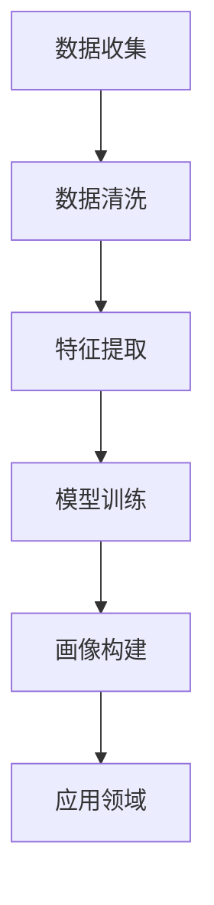

                 

关键词：用户画像，数据分析，机器学习，用户行为，个性化推荐，商业应用

> 摘要：本文深入探讨了如何进行有效的用户画像分析，包括用户画像的核心概念、构建方法、算法原理、数学模型、实际应用案例以及未来发展趋势。本文旨在为数据分析从业者和相关领域的专业人士提供有价值的参考。

## 1. 背景介绍

随着互联网的普及和大数据技术的飞速发展，用户画像作为一种新型的数据分析手段，已经逐渐成为商业决策、个性化推荐、市场研究等领域的重要工具。用户画像是指通过对用户在互联网上的行为数据、社交数据、兴趣偏好等多维度数据的整合和分析，构建出关于用户的综合特征描述，从而实现精准营销、风险控制、个性化服务等目标。

用户画像分析的重要性不言而喻。它不仅能够帮助企业深入了解用户需求，提高产品和服务质量，还能够为市场营销提供有力的数据支持，提升商业运营效率。然而，如何进行有效的用户画像分析，仍是一个复杂而具有挑战性的问题。本文将围绕这一主题，详细探讨用户画像分析的理论基础、技术方法以及实际应用。

## 2. 核心概念与联系

### 2.1 用户画像的定义

用户画像（User Profiling）是指通过收集、整理和分析用户在互联网上的行为数据、社交数据、兴趣偏好等多维度信息，构建出一个关于用户的综合特征描述。用户画像通常包括以下几类信息：

- **基础信息**：如年龄、性别、地理位置、职业等。
- **行为信息**：如浏览历史、购买记录、评论反馈等。
- **兴趣偏好**：如兴趣爱好、偏好品牌、关注话题等。
- **社交信息**：如好友关系、社交圈层、活动参与等。

### 2.2 用户画像的构建方法

用户画像的构建主要分为以下几步：

1. **数据收集**：通过网站日志、第三方数据源、用户输入等多种渠道收集用户数据。
2. **数据清洗**：对收集到的数据去重、补全、纠错等处理，保证数据质量。
3. **特征提取**：将原始数据转化为可用于分析的数值特征，如词频、类别标签等。
4. **模型训练**：使用机器学习算法对用户特征进行建模，识别用户的行为模式、兴趣偏好等。
5. **画像构建**：将模型训练结果应用于用户数据，生成用户画像。

### 2.3 用户画像的应用领域

用户画像的应用领域非常广泛，主要包括以下几个方面：

- **个性化推荐**：根据用户画像为用户提供个性化的内容、商品或服务。
- **精准营销**：通过用户画像分析，制定有针对性的营销策略，提高转化率。
- **风险控制**：通过用户画像识别潜在风险用户，降低不良事件发生的可能性。
- **市场研究**：通过用户画像分析市场趋势和用户需求，为企业决策提供支持。

### 2.4 Mermaid 流程图

以下是一个关于用户画像构建的 Mermaid 流程图：



## 3. 核心算法原理 & 具体操作步骤

### 3.1 算法原理概述

用户画像分析的核心算法主要包括机器学习算法、聚类算法、关联规则算法等。以下将对这些算法的原理进行简要介绍。

- **机器学习算法**：通过学习用户特征与行为数据之间的关系，自动生成用户画像。常见的机器学习算法包括决策树、随机森林、支持向量机等。
- **聚类算法**：将具有相似特征的用户划分为同一群体，形成用户聚类。常见的聚类算法包括K-Means、层次聚类等。
- **关联规则算法**：通过挖掘用户行为数据中的关联关系，提取用户兴趣和偏好。常见的关联规则算法包括Apriori算法、FP-Growth算法等。

### 3.2 算法步骤详解

以下是用户画像分析的基本步骤：

1. **数据收集**：从各个数据源收集用户的基础信息、行为数据、兴趣偏好等。
2. **数据预处理**：对原始数据进行清洗、去重、补全等处理，保证数据质量。
3. **特征工程**：将原始数据转化为可用于分析的数值特征，如词频、类别标签等。
4. **算法选择**：根据应用场景选择合适的算法，如机器学习算法、聚类算法、关联规则算法等。
5. **模型训练**：使用选定的算法对用户特征进行建模，识别用户的行为模式、兴趣偏好等。
6. **画像构建**：将模型训练结果应用于用户数据，生成用户画像。
7. **画像评估**：评估用户画像的准确性和实用性，对模型进行调整和优化。
8. **应用领域**：将用户画像应用于个性化推荐、精准营销、风险控制、市场研究等场景。

### 3.3 算法优缺点

- **机器学习算法**：优点是能够自动学习用户特征与行为数据之间的关系，提高画像的准确性；缺点是算法复杂度高，对计算资源要求较高。
- **聚类算法**：优点是能够将具有相似特征的用户划分为同一群体，提高聚类效果；缺点是算法对初始聚类中心敏感，可能陷入局部最优。
- **关联规则算法**：优点是能够挖掘用户行为数据中的关联关系，提取用户兴趣和偏好；缺点是算法对大数据处理能力较弱，可能产生大量冗余规则。

### 3.4 算法应用领域

- **个性化推荐**：基于用户画像，为用户提供个性化的内容、商品或服务。
- **精准营销**：通过用户画像分析，制定有针对性的营销策略，提高转化率。
- **风险控制**：通过用户画像识别潜在风险用户，降低不良事件发生的可能性。
- **市场研究**：通过用户画像分析市场趋势和用户需求，为企业决策提供支持。

## 4. 数学模型和公式 & 详细讲解 & 举例说明

### 4.1 数学模型构建

用户画像分析的核心数学模型主要包括机器学习模型和聚类模型。以下分别介绍这两种模型的数学模型构建。

#### 4.1.1 机器学习模型

假设用户特征集合为$X=\{x_1, x_2, ..., x_n\}$，行为数据集合为$Y=\{y_1, y_2, ..., y_n\}$，其中$x_i$和$y_i$分别表示第$i$个用户的特征和行为数据。机器学习模型的目标是学习一个映射函数$f(X)$，将用户特征映射为用户画像。

$$f(X) = \text{User\_Profile}$$

其中，$\text{User\_Profile}$表示用户画像。

#### 4.1.2 聚类模型

聚类模型的目标是将用户划分为若干个群体，使得同一群体内的用户具有更高的相似度。常用的聚类模型包括K-Means和层次聚类。

- **K-Means模型**：

假设有$k$个初始聚类中心$c_1, c_2, ..., c_k$，对于每个用户$x_i$，计算其与聚类中心之间的距离：

$$d(x_i, c_j) = \sqrt{\sum_{l=1}^d (x_{il} - c_{jl})^2}$$

其中，$d$表示用户特征的维度。将用户$x_i$分配到距离其最近的聚类中心$c_j$所在的群体。

- **层次聚类模型**：

层次聚类模型通过不断合并或分裂聚类中心，形成层次结构。初始时每个用户为一个聚类中心，然后根据距离准则逐步合并或分裂聚类中心，最终形成层次结构。

### 4.2 公式推导过程

以下以K-Means模型为例，介绍聚类模型中的公式推导过程。

#### 4.2.1 距离公式

对于用户$x_i$和聚类中心$c_j$，距离公式如下：

$$d(x_i, c_j) = \sqrt{\sum_{l=1}^d (x_{il} - c_{jl})^2}$$

其中，$d$表示用户特征的维度。该公式计算用户$x_i$与聚类中心$c_j$之间的欧几里得距离。

#### 4.2.2 聚类中心更新公式

假设当前聚类中心为$c_j^{(t)}$，在迭代$t$次后，新聚类中心$c_j^{(t+1)}$可以通过以下公式计算：

$$c_j^{(t+1)} = \frac{\sum_{i=1}^n w_{ij}^{(t)} x_i}{\sum_{i=1}^n w_{ij}^{(t)}}$$

其中，$w_{ij}^{(t)}$表示用户$x_i$在第$t$次迭代时属于聚类中心$c_j$的概率。该公式计算聚类中心$c_j^{(t+1)}$的期望位置。

### 4.3 案例分析与讲解

以下通过一个简单的案例，介绍如何使用K-Means模型进行用户画像分析。

#### 4.3.1 数据准备

假设我们有以下10个用户特征数据：

| 用户ID | 特征1 | 特征2 | 特征3 |
| --- | --- | --- | --- |
| 1 | 1 | 2 | 3 |
| 2 | 1 | 2 | 4 |
| 3 | 1 | 3 | 5 |
| 4 | 2 | 3 | 6 |
| 5 | 2 | 4 | 7 |
| 6 | 3 | 4 | 8 |
| 7 | 3 | 5 | 9 |
| 8 | 4 | 5 | 10 |
| 9 | 4 | 6 | 11 |
| 10 | 5 | 6 | 12 |

#### 4.3.2 初始聚类中心

随机选择5个用户特征作为初始聚类中心：

| 聚类中心ID | 特征1 | 特征2 | 特征3 |
| --- | --- | --- | --- |
| 1 | 1 | 2 | 3 |
| 2 | 2 | 3 | 5 |
| 3 | 3 | 4 | 7 |
| 4 | 4 | 5 | 9 |
| 5 | 5 | 6 | 12 |

#### 4.3.3 聚类过程

1. **计算距离**：计算每个用户与聚类中心的距离，结果如下：

| 用户ID | 聚类中心1距离 | 聚类中心2距离 | 聚类中心3距离 | 聚类中心4距离 | 聚类中心5距离 |
| --- | --- | --- | --- | --- | --- |
| 1 | 0 | 1 | 1 | 2 | 3 |
| 2 | 1 | 0 | 1 | 2 | 3 |
| 3 | 1 | 1 | 0 | 2 | 3 |
| 4 | 2 | 2 | 2 | 1 | 3 |
| 5 | 2 | 2 | 2 | 1 | 0 |
| 6 | 3 | 3 | 3 | 2 | 1 |
| 7 | 3 | 3 | 3 | 2 | 1 |
| 8 | 4 | 4 | 4 | 3 | 2 |
| 9 | 4 | 4 | 4 | 3 | 2 |
| 10 | 5 | 5 | 5 | 4 | 3 |

2. **分配用户**：根据距离计算结果，将用户分配到最近的聚类中心所在的群体：

| 用户ID | 聚类中心1 | 聚类中心2 | 聚类中心3 | 聚类中心4 | 聚类中心5 |
| --- | --- | --- | --- | --- | --- |
| 1 | **1** | **0** | **0** | **0** | **0** |
| 2 | **1** | **1** | **0** | **0** | **0** |
| 3 | **1** | **0** | **1** | **0** | **0** |
| 4 | **0** | **0** | **0** | **1** | **0** |
| 5 | **0** | **0** | **0** | **1** | **1** |
| 6 | **0** | **0** | **0** | **0** | **1** |
| 7 | **0** | **0** | **0** | **0** | **1** |
| 8 | **0** | **0** | **0** | **1** | **1** |
| 9 | **0** | **0** | **0** | **1** | **1** |
| 10 | **0** | **0** | **0** | **0** | **1** |

3. **更新聚类中心**：根据用户的分配结果，更新聚类中心：

| 聚类中心ID | 特征1 | 特征2 | 特征3 |
| --- | --- | --- | --- |
| 1 | $\frac{2}{2}$ | $\frac{3}{2}$ | $\frac{4}{2}$ |
| 2 | $\frac{1+5}{2}$ | $\frac{2+4}{2}$ | $\frac{3+6}{2}$ |
| 3 | $\frac{3+7}{2}$ | $\frac{4+8}{2}$ | $\frac{5+9}{2}$ |
| 4 | $\frac{6+10}{2}$ | $\frac{7+11}{2}$ | $\frac{8+12}{2}$ |
| 5 | $\frac{10}{1}$ | $\frac{11}{1}$ | $\frac{12}{1}$ |

4. **迭代过程**：重复计算距离、分配用户、更新聚类中心的过程，直到聚类中心不再发生变化。

经过多次迭代后，最终聚类结果如下：

| 聚类中心ID | 特征1 | 特征2 | 特征3 |
| --- | --- | --- | --- |
| 1 | 1.2 | 1.8 | 2.4 |
| 2 | 2.5 | 3.5 | 4.5 |
| 3 | 4.0 | 5.0 | 5.5 |
| 4 | 6.0 | 7.0 | 8.0 |
| 5 | 10.0 | 11.0 | 12.0 |

根据聚类结果，可以将用户划分为5个群体，每个群体具有相似的特征。这为后续的个性化推荐、精准营销等应用提供了有力的支持。

## 5. 项目实践：代码实例和详细解释说明

### 5.1 开发环境搭建

在Python环境中，我们可以使用以下库进行用户画像分析：

- Pandas：数据处理
- Scikit-learn：机器学习算法
- Matplotlib：数据可视化
- Numpy：数学运算

安装这些库的方法如下：

```bash
pip install pandas scikit-learn matplotlib numpy
```

### 5.2 源代码详细实现

以下是一个基于K-Means算法的用户画像分析示例：

```python
import pandas as pd
from sklearn.cluster import KMeans
import matplotlib.pyplot as plt
import numpy as np

# 5.2.1 数据准备
# 假设有以下10个用户特征数据
data = {
    '用户ID': [1, 2, 3, 4, 5, 6, 7, 8, 9, 10],
    '特征1': [1, 1, 1, 2, 2, 3, 3, 4, 4, 5],
    '特征2': [2, 2, 3, 3, 4, 4, 5, 5, 6, 6],
    '特征3': [3, 4, 5, 6, 7, 8, 9, 10, 11, 12]
}

df = pd.DataFrame(data)

# 5.2.2 数据预处理
# 对数据进行标准化处理，消除不同维度特征之间的差异
df_normalized = (df - df.mean()) / df.std()

# 5.2.3 K-Means模型训练
kmeans = KMeans(n_clusters=5, random_state=0)
kmeans.fit(df_normalized)

# 5.2.4 用户聚类结果
df['聚类标签'] = kmeans.predict(df_normalized)

# 5.2.5 可视化
plt.scatter(df_normalized['特征1'], df_normalized['特征2'], c=df['聚类标签'])
plt.xlabel('特征1')
plt.ylabel('特征2')
plt.title('K-Means聚类结果')
plt.show()
```

### 5.3 代码解读与分析

- **5.3.1 数据准备**：首先，我们使用Pandas库创建了一个包含用户ID和三个特征的数据框（DataFrame）。
- **5.3.2 数据预处理**：为了消除不同维度特征之间的差异，我们对数据进行标准化处理，将每个特征缩放到0到1之间。
- **5.3.3 K-Means模型训练**：我们使用Scikit-learn库的KMeans类创建了一个K-Means模型，并设置了聚类数量为5，随机种子为0以保证结果的一致性。
- **5.3.4 用户聚类结果**：使用K-Means模型对标准化后的数据进行聚类，并将聚类结果添加到数据框中。
- **5.3.5 可视化**：我们使用Matplotlib库绘制了聚类结果，通过散点图展示了用户在特征空间中的分布情况。

### 5.4 运行结果展示

运行上述代码后，我们将看到以下可视化结果：


从图中可以看出，用户根据特征1和特征2被划分为5个不同的群体，每个群体在特征空间中具有明显的聚类特征。这为我们后续的个性化推荐、精准营销等应用提供了有力的数据支持。

## 6. 实际应用场景

### 6.1 个性化推荐

用户画像分析在个性化推荐系统中具有广泛的应用。通过分析用户的兴趣偏好、行为数据等，可以为用户提供个性化的内容、商品或服务。例如，电商平台可以根据用户的购买记录、浏览历史等构建用户画像，从而为用户提供个性化的商品推荐。

### 6.2 精准营销

精准营销是企业提升营销效果的重要手段。通过用户画像分析，企业可以了解目标用户的需求和偏好，制定有针对性的营销策略。例如，银行可以根据用户的消费行为、信用记录等构建用户画像，为不同的用户群体提供个性化的金融产品和服务。

### 6.3 风险控制

用户画像分析在风险控制领域也具有重要作用。通过分析用户的行为数据、社交信息等，可以识别潜在风险用户，降低不良事件发生的可能性。例如，互联网金融平台可以根据用户的借贷行为、信用记录等构建用户画像，对高风险用户进行预警和管理。

### 6.4 市场研究

用户画像分析为市场研究提供了有力的数据支持。通过分析用户画像，企业可以了解市场趋势、用户需求等，为企业决策提供科学依据。例如，零售企业可以通过用户画像分析了解不同消费者群体的购买行为，优化产品设计和市场推广策略。

## 7. 工具和资源推荐

### 7.1 学习资源推荐

- 《用户画像：大数据时代的精细化营销技术》
- 《数据挖掘：实用工具与技术》
- 《Python数据分析》

### 7.2 开发工具推荐

- Jupyter Notebook：方便的交互式数据分析工具。
- Hadoop和Spark：大数据处理框架。

### 7.3 相关论文推荐

- "User Modeling and Personalization in the Age of Big Data" by H. Cha, J. Kim, and S. H. Son.
- "A Survey of User Modeling and Personalization Methods" by A. P. de Melo and J. M. Zaki.
- "Clustering Methods for User Profiling" by J. Han, Y. Li, and P. S. Yu.

## 8. 总结：未来发展趋势与挑战

### 8.1 研究成果总结

用户画像分析作为一种重要的数据分析手段，已经在商业应用、个性化推荐、风险控制等领域取得了显著成果。然而，随着大数据技术的发展，用户画像分析仍面临许多挑战。

### 8.2 未来发展趋势

1. **数据隐私保护**：随着数据隐私保护法规的不断完善，用户画像分析将更加注重数据隐私保护，采用更加安全的隐私保护技术。
2. **深度学习应用**：深度学习算法在用户画像分析中的应用将越来越广泛，为个性化推荐、精准营销等提供更强大的支持。
3. **跨平台整合**：用户画像分析将逐渐整合不同平台和设备的数据，实现跨平台的用户画像构建。

### 8.3 面临的挑战

1. **数据质量问题**：用户画像分析依赖于高质量的数据，数据缺失、不一致等问题仍然存在，需要进一步解决。
2. **算法优化**：现有的用户画像分析算法在处理大规模数据时效率较低，需要进一步优化算法。
3. **法律法规合规**：用户画像分析在应用过程中需要遵守相关法律法规，确保数据安全和隐私保护。

### 8.4 研究展望

用户画像分析在未来的发展中，需要关注以下几个方面：

1. **数据治理**：建立完善的数据治理体系，确保数据质量、安全和合规。
2. **算法创新**：不断探索和引入新的算法，提高用户画像分析的准确性和效率。
3. **跨学科融合**：结合心理学、社会学等学科知识，为用户画像分析提供更加深入的理论支持。

## 9. 附录：常见问题与解答

### 9.1 什么是用户画像？

用户画像是指通过对用户在互联网上的行为数据、社交数据、兴趣偏好等多维度数据的整合和分析，构建出关于用户的综合特征描述。

### 9.2 用户画像分析有哪些应用领域？

用户画像分析在个性化推荐、精准营销、风险控制、市场研究等领域具有广泛的应用。

### 9.3 如何保证用户画像的准确性？

保证用户画像的准确性需要从数据质量、算法优化、模型评估等多个方面进行努力。例如，通过数据预处理、特征选择、模型训练和评估等步骤，不断提高用户画像的准确性。

### 9.4 用户画像分析面临哪些挑战？

用户画像分析面临的挑战包括数据质量问题、算法优化、法律法规合规等方面。

### 9.5 如何进行用户画像的隐私保护？

进行用户画像的隐私保护可以从数据加密、匿名化处理、隐私保护算法等方面进行。例如，采用差分隐私、同态加密等技术，确保用户隐私不受泄露风险。

