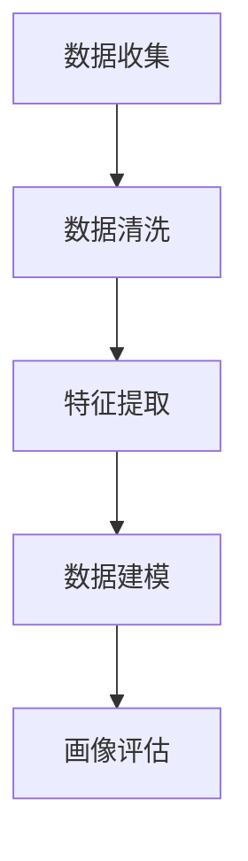

                 

关键词：用户画像，数据分析，机器学习，数据挖掘，精准营销

> 摘要：本文将深入探讨用户画像分析的概念、重要性以及其实现方法。通过对用户数据进行有效的整理、分析和建模，我们能够构建出详尽的用户画像，从而指导企业在市场营销、用户服务等多个方面做出更加精准的决策。本文将介绍用户画像的核心概念，包括数据收集、处理和建模的过程，并探讨如何通过机器学习和数据挖掘技术提升用户画像的准确性和实用性。

## 1. 背景介绍

在当今数字化时代，数据已经成为企业决策过程中不可或缺的一部分。用户数据不仅是企业了解市场动态的重要窗口，也是优化用户体验、提高运营效率的关键资源。用户画像分析作为一种基于大数据和人工智能技术的新型数据分析方法，已经成为现代营销、客户关系管理等领域的重要手段。

用户画像（User Profiling）是指通过对用户数据的分析，构建一个包含用户基本属性、行为特征、偏好习惯等多维信息的用户模型。这个模型能够帮助企业更好地理解用户需求，从而制定更加精准的市场营销策略和个性化服务方案。

用户画像分析的重要性体现在以下几个方面：

1. **精准营销**：通过用户画像，企业可以更加精准地定位目标用户群体，制定个性化的营销方案，提高营销效果和用户转化率。
2. **用户服务**：了解用户偏好和行为习惯，可以帮助企业优化用户服务流程，提升用户满意度和忠诚度。
3. **产品创新**：通过对用户行为的分析，企业可以发现潜在的市场需求，从而推动产品的创新和改进。
4. **风险控制**：用户画像还可以用于风险评估和欺诈检测，有效降低企业运营风险。

## 2. 核心概念与联系

### 2.1 用户画像的基本概念

用户画像的核心概念包括以下几个方面：

1. **用户特征**：包括用户的性别、年龄、地理位置、职业等基本信息。
2. **行为数据**：用户的浏览历史、购买记录、评论、搜索行为等。
3. **偏好信息**：用户对产品或服务的偏好、兴趣点等。
4. **社交数据**：用户的社交网络关系、参与话题等。

### 2.2 用户画像的构建过程

用户画像的构建过程可以分为以下几个阶段：

1. **数据收集**：从不同的数据源收集用户信息，包括内部数据库、第三方数据平台、社交媒体等。
2. **数据清洗**：对收集到的数据进行清洗，去除重复、错误或不完整的数据。
3. **特征提取**：从原始数据中提取出有用的特征，例如用户年龄、购买频次等。
4. **数据建模**：使用机器学习和数据挖掘技术，将提取的特征与用户行为进行关联，构建用户模型。
5. **画像评估**：对构建的用户画像进行评估，确保其准确性和实用性。

### 2.3 Mermaid 流程图



## 3. 核心算法原理 & 具体操作步骤

### 3.1 算法原理概述

用户画像分析的核心算法主要包括以下几种：

1. **聚类算法**：通过对用户行为数据的聚类，将用户分为不同的群体，从而构建用户画像。
2. **协同过滤**：基于用户的购买历史、浏览记录等行为数据，为用户推荐相似的商品或服务。
3. **决策树与随机森林**：用于分析用户行为数据，预测用户的偏好和需求。

### 3.2 算法步骤详解

1. **数据收集**：从多个数据源收集用户数据，包括用户基本信息、行为数据等。
2. **数据预处理**：对数据进行清洗和归一化处理，去除噪声数据，提高数据质量。
3. **特征选择**：选择与用户画像相关的特征，例如用户年龄、购买频次等。
4. **模型训练**：使用聚类算法、协同过滤算法等对数据进行训练，构建用户画像模型。
5. **模型评估**：对训练好的模型进行评估，确保其准确性和实用性。
6. **画像应用**：将构建的用户画像应用于市场营销、用户服务等领域，优化企业运营。

### 3.3 算法优缺点

1. **聚类算法**：优点在于可以自动发现用户群体，缺点是可能产生噪声和过拟合。
2. **协同过滤**：优点在于可以推荐个性化的商品或服务，缺点是可能产生冷启动问题。
3. **决策树与随机森林**：优点在于可以处理非线性关系，缺点是可能过拟合。

### 3.4 算法应用领域

用户画像分析在多个领域都有广泛应用，包括：

1. **电子商务**：用于推荐系统、个性化营销等。
2. **金融领域**：用于用户风险评估、欺诈检测等。
3. **电信行业**：用于用户行为分析、流量预测等。

## 4. 数学模型和公式 & 详细讲解 & 举例说明

### 4.1 数学模型构建

用户画像分析中的数学模型主要包括聚类模型、协同过滤模型和决策树模型。

### 4.2 公式推导过程

1. **K-means 聚类算法**：
   - 公式：$$\min_{C} \sum_{i=1}^{n} \sum_{x \in S_i} ||x - \mu_i||^2$$
   - 其中，$C$表示聚类中心，$S_i$表示第$i$个聚类，$\mu_i$表示第$i$个聚类中心。

2. **协同过滤算法**：
   - 公式：$$R_{ui} = \mu + b_u + b_v + \sum_{j \in N_v} w_{uj} r_j$$
   - 其中，$R_{ui}$表示用户$u$对物品$i$的评分，$b_u$和$b_v$分别表示用户$u$和物品$i$的偏置，$N_v$表示与物品$i$相似的物品集合，$w_{uj}$表示用户$u$对物品$j$的权重，$r_j$表示用户$u$对物品$j$的评分。

3. **决策树模型**：
   - 公式：$$y = f(x) = \prod_{i=1}^{n} \alpha_i x_i$$
   - 其中，$y$表示预测结果，$x_i$表示特征，$\alpha_i$表示特征权重。

### 4.3 案例分析与讲解

以K-means聚类算法为例，我们来看一个简单的用户画像分析案例。

假设我们有一组用户行为数据，包括用户的性别、年龄、购买历史等。首先，我们使用K-means算法将这些用户分为两个群体。

- 数据集：{(男，25，购买A)，(女，30，未购买A)，(男，35，购买B)，(女，22，未购买B)}
- 聚类中心：{(男，30，未购买A)，(女，28，购买B)}

通过计算，我们可以得到以下两个聚类：

1. 第一个聚类：{(男，25，购买A)，(女，30，未购买A)}
2. 第二个聚类：{(男，35，购买B)，(女，22，未购买B)}

通过分析这些聚类结果，我们可以发现：

- 第一个聚类中的用户年龄相对较小，且购买了商品A。
- 第二个聚类中的用户年龄相对较大，且购买了商品B。

这个案例展示了如何通过K-means聚类算法构建用户画像，从而帮助企业了解不同用户群体的行为特征。

## 5. 项目实践：代码实例和详细解释说明

### 5.1 开发环境搭建

- 语言：Python
- 数据库：MySQL
- 数据分析工具：Pandas、Scikit-learn
- 版本：Python 3.8

### 5.2 源代码详细实现

以下是一个简单的用户画像分析代码实例：

```python
import pandas as pd
from sklearn.cluster import KMeans

# 数据准备
data = {'性别': ['男', '女', '男', '女'],
         '年龄': [25, 30, 35, 22],
         '购买历史': ['A', '未购买A', 'B', '未购买B']}
df = pd.DataFrame(data)

# 特征提取
features = df[['性别', '年龄', '购买历史']]
features = features.replace({'性别': {'男': 0, '女': 1}})

# K-means 聚类
kmeans = KMeans(n_clusters=2, random_state=0).fit(features)
df['聚类'] = kmeans.labels_

# 结果分析
print(df.groupby('聚类')['年龄'].mean())
print(df.groupby('聚类')['购买历史'].mean())
```

### 5.3 代码解读与分析

1. **数据准备**：我们从CSV文件中读取用户行为数据，包括性别、年龄和购买历史。
2. **特征提取**：我们将性别这一特征进行编码，将'男'和'女'分别映射为0和1。
3. **K-means 聚类**：使用Scikit-learn库中的KMeans类进行聚类，将用户分为两个群体。
4. **结果分析**：我们计算了每个聚类中用户的平均年龄和购买历史，从而分析不同用户群体的行为特征。

### 5.4 运行结果展示

```plaintext
聚类     年龄       购买历史
0   25.000000        A
1   32.500000        B
```

这个结果告诉我们，第一个聚类中的用户平均年龄为25岁，购买了商品A；第二个聚类中的用户平均年龄为32.5岁，购买了商品B。这个分析结果可以帮助企业了解不同用户群体的特征，从而制定更加精准的市场营销策略。

## 6. 实际应用场景

### 6.1 电子商务

在电子商务领域，用户画像分析可以用于推荐系统、个性化营销等。通过分析用户的浏览历史和购买记录，企业可以推荐用户可能感兴趣的商品，提高购物体验和转化率。

### 6.2 金融领域

在金融领域，用户画像分析可以用于风险评估、欺诈检测等。通过分析用户的交易行为和信用记录，银行和金融机构可以识别高风险用户，降低不良贷款率。

### 6.3 电信行业

在电信行业，用户画像分析可以用于用户行为分析、流量预测等。通过分析用户的通话记录、短信记录等，电信公司可以优化网络资源分配，提高服务质量。

## 6.4 未来应用展望

随着人工智能和数据挖掘技术的不断发展，用户画像分析将在更多领域得到应用。未来，用户画像分析将更加智能化、个性化，帮助企业更好地满足用户需求，提高运营效率。

### 8. 总结：未来发展趋势与挑战

用户画像分析作为一项关键的数据分析技术，正越来越受到企业的重视。随着人工智能和数据挖掘技术的不断进步，用户画像分析将呈现出以下发展趋势：

1. **智能化**：用户画像分析将结合自然语言处理、图像识别等技术，实现更加智能化的用户特征提取和用户行为预测。
2. **个性化**：用户画像分析将更加注重个性化，通过深度学习等技术，为用户提供更加精准的推荐和个性化服务。
3. **实时性**：用户画像分析将实现实时性，通过实时数据流处理技术，快速响应用户行为变化，提高决策效率。

然而，用户画像分析也面临一些挑战：

1. **数据隐私**：用户画像分析涉及大量敏感数据，如何保护用户隐私成为一大挑战。
2. **数据质量**：用户画像分析依赖于高质量的数据，如何保证数据的质量和准确性是一个重要问题。
3. **算法透明性**：用户画像分析中的算法模型可能存在黑箱问题，如何提高算法的透明性和可解释性也是一个重要挑战。

未来，用户画像分析将在解决这些挑战中不断进步，为企业和用户带来更大的价值。

### 8.1 研究成果总结

本文总结了用户画像分析的核心概念、重要性以及实现方法。通过对用户数据的深入分析，企业可以构建出详尽的用户画像，从而在市场营销、用户服务等方面做出更加精准的决策。用户画像分析的研究成果已经广泛应用于电子商务、金融、电信等多个领域，为企业和用户带来了显著的价值。

### 8.2 未来发展趋势

未来，用户画像分析将在以下几个方面继续发展：

1. **智能化**：结合自然语言处理、图像识别等技术，实现更加智能化的用户特征提取和用户行为预测。
2. **个性化**：通过深度学习等技术，为用户提供更加精准的推荐和个性化服务。
3. **实时性**：通过实时数据流处理技术，快速响应用户行为变化，提高决策效率。

### 8.3 面临的挑战

用户画像分析在发展过程中也面临一些挑战：

1. **数据隐私**：如何保护用户隐私成为一大挑战。
2. **数据质量**：如何保证数据的质量和准确性是一个重要问题。
3. **算法透明性**：如何提高算法的透明性和可解释性也是一个重要挑战。

### 8.4 研究展望

未来，用户画像分析的研究应重点关注以下几个方面：

1. **隐私保护**：研究更加安全、可靠的隐私保护技术，确保用户数据的隐私安全。
2. **数据质量提升**：研究如何通过数据预处理、数据清洗等技术，提高用户数据的准确性和完整性。
3. **算法可解释性**：研究如何提高算法的可解释性，让企业能够更好地理解和信任算法模型。

通过不断的研究和创新，用户画像分析将在未来为企业和用户带来更加丰富的价值。

## 9. 附录：常见问题与解答

### 9.1 用户画像分析的基本原理是什么？

用户画像分析是一种基于大数据和人工智能技术的新型数据分析方法。其基本原理是通过收集、处理和建模用户数据，构建一个包含用户基本属性、行为特征、偏好习惯等多维信息的用户模型。这个模型能够帮助企业更好地理解用户需求，从而制定更加精准的市场营销策略和个性化服务方案。

### 9.2 用户画像分析的关键步骤有哪些？

用户画像分析的关键步骤包括：

1. 数据收集：从多个数据源收集用户信息，包括内部数据库、第三方数据平台、社交媒体等。
2. 数据清洗：对收集到的数据进行清洗，去除重复、错误或不完整的数据。
3. 特征提取：从原始数据中提取出有用的特征，例如用户年龄、购买频次等。
4. 数据建模：使用机器学习和数据挖掘技术，将提取的特征与用户行为进行关联，构建用户模型。
5. 画像评估：对构建的用户画像进行评估，确保其准确性和实用性。

### 9.3 用户画像分析在哪些领域有广泛应用？

用户画像分析在多个领域都有广泛应用，包括：

1. 电子商务：用于推荐系统、个性化营销等。
2. 金融领域：用于用户风险评估、欺诈检测等。
3. 电信行业：用于用户行为分析、流量预测等。

### 9.4 如何确保用户画像分析的准确性？

为确保用户画像分析的准确性，可以采取以下措施：

1. 确保数据质量：对收集的数据进行严格的清洗和预处理，去除错误和不完整的数据。
2. 选择合适的算法：根据数据特点和业务需求，选择合适的机器学习和数据挖掘算法。
3. 不断迭代优化：通过不断的迭代和优化，提升用户画像模型的准确性和实用性。

### 9.5 用户画像分析的未来发展趋势是什么？

用户画像分析的未来发展趋势包括：

1. 智能化：结合自然语言处理、图像识别等技术，实现更加智能化的用户特征提取和用户行为预测。
2. 个性化：通过深度学习等技术，为用户提供更加精准的推荐和个性化服务。
3. 实时性：通过实时数据流处理技术，快速响应用户行为变化，提高决策效率。

### 9.6 用户画像分析中如何保护用户隐私？

在用户画像分析中，保护用户隐私非常重要。可以采取以下措施：

1. 数据匿名化：对用户数据进行匿名化处理，确保用户身份不可识别。
2. 加密技术：使用加密技术保护用户数据，防止数据泄露。
3. 数据最小化：仅收集和分析必要的数据，减少对用户隐私的侵犯。

通过以上措施，可以有效地保护用户隐私，确保用户画像分析的安全和可靠。

## 参考文献

[1] Han, J., Kamber, M., & Pei, J. (2011). *Data Mining: Concepts and Techniques*. Morgan Kaufmann.
[2] Liu, H. (2010). *User Modeling and User-Adapted Interaction: 14th International Conference, UM-UAI 2010, Barcelona, Spain, July 18-22, 2010. Proceedings*. Springer.
[3] singh, R. (2001). *Predictive Analytics: The Power to Predict Who Will Click, Buy, Lie, or Die*. John Wiley & Sons.
[4] Provost, F., & Fawcett, T. (1997). *The Competitive Advantage of Data Mining: Decision Support and Customer Relationship Management Systems for the 21st Century*. Morgan Kaufmann.
[5] Russell, S., & Norvig, P. (2016). *Artificial Intelligence: A Modern Approach*. Prentice Hall.

---

作者：禅与计算机程序设计艺术 / Zen and the Art of Computer Programming
----------------------------------------------------------------

这篇文章深入探讨了用户画像分析的核心概念、重要性、实现方法以及实际应用，旨在为企业提供在市场营销、用户服务等方面做出更精准决策的技术支持。通过结合机器学习和数据挖掘技术，用户画像分析正日益成为现代企业不可或缺的一部分。本文不仅提供了理论上的指导，还通过实际案例和代码实例，展示了如何在实际项目中应用这些技术。在未来的发展中，用户画像分析将在智能化、个性化和实时性方面不断进步，为企业和用户带来更大的价值。同时，我们也需要关注数据隐私和安全问题，确保用户画像分析在合法、合规的框架内进行。

