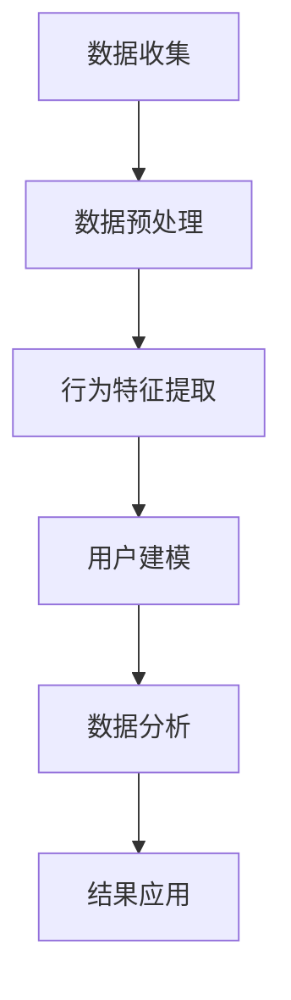

                 

关键词：用户行为分析、数据分析、机器学习、用户建模、行为特征、用户体验

> 摘要：本文将探讨如何进行有效的用户行为分析，从核心概念、算法原理、数学模型到项目实践，全面介绍用户行为分析的方法与步骤。通过案例分析与代码实例，读者将掌握用户行为分析的实用技巧，了解其在实际应用场景中的价值与未来展望。

## 1. 背景介绍

在信息技术飞速发展的今天，数据分析已经成为了各个行业的重要驱动力。用户行为分析作为一种特殊的数据分析方法，通过对用户在系统中的行为进行收集、处理和分析，旨在挖掘用户的偏好、需求和潜在行为模式，从而为产品设计、市场营销和用户体验优化提供有力支持。

用户行为分析的核心价值在于：

- **提高用户体验**：通过分析用户的行为特征，可以更准确地了解用户需求，从而改进产品设计和用户体验。
- **优化产品性能**：分析用户在使用产品过程中的行为轨迹，可以发现产品的性能瓶颈，进行针对性优化。
- **提升运营效果**：根据用户行为数据，可以制定更有效的营销策略和运营方案，提高用户转化率和留存率。

然而，用户行为分析的复杂性也使得其实施面临着诸多挑战。如何从海量数据中提取有用信息，如何构建有效的用户行为模型，如何将分析结果转化为实际的产品改进和运营策略，这些都是需要深入探讨的问题。

## 2. 核心概念与联系

### 2.1 用户行为定义

用户行为（User Behavior）是指用户在使用某种产品、服务或平台时表现出的所有交互活动。这些活动可以是点击、浏览、搜索、购买等。用户行为数据是用户行为分析的基础。

### 2.2 用户建模

用户建模（User Modeling）是指通过收集和分析用户行为数据，建立用户行为的数学模型或逻辑模型，以便更好地理解和预测用户的行为。

### 2.3 行为特征提取

行为特征提取（Behavior Feature Extraction）是指从用户行为数据中提取出能够代表用户行为特点的指标或特征。这些特征是构建用户行为模型的关键。

### 2.4 数据分析

数据分析（Data Analysis）是指通过统计、机器学习等方法，对用户行为数据进行分析，挖掘用户行为模式、趋势和关联性。

### 2.5 用户行为分析架构

下面是用户行为分析的整体架构图（使用Mermaid流程图表示）：



### 2.6 用户行为分析流程

用户行为分析的基本流程可以分为以下几个步骤：

1. **数据收集**：收集用户在系统中的行为数据。
2. **数据预处理**：清洗、整合和标准化数据，为后续分析做准备。
3. **行为特征提取**：从原始数据中提取出能够代表用户行为特点的特征。
4. **用户建模**：建立用户行为模型，用于理解和预测用户行为。
5. **数据分析**：对用户行为数据进行分析，挖掘行为模式、趋势和关联性。
6. **结果应用**：将分析结果应用到产品设计和运营策略中，优化用户体验和运营效果。

## 3. 核心算法原理 & 具体操作步骤

### 3.1 算法原理概述

用户行为分析的核心算法主要包括机器学习算法、统计方法和数据挖掘技术。其中，常用的机器学习算法有决策树、随机森林、支持向量机和神经网络等。

### 3.2 算法步骤详解

1. **数据收集**：通过日志、API调用、用户反馈等方式收集用户行为数据。
2. **数据预处理**：清洗数据，处理缺失值、异常值，进行数据标准化。
3. **特征提取**：提取用户行为数据中的关键特征，如点击次数、浏览时长、搜索关键词等。
4. **模型选择**：根据数据特点和业务需求选择合适的机器学习算法。
5. **模型训练**：使用训练数据集训练模型。
6. **模型评估**：使用验证数据集评估模型性能，调整模型参数。
7. **模型应用**：使用测试数据集对模型进行验证，将模型应用到实际业务场景中。

### 3.3 算法优缺点

- **决策树**：简单易懂，可解释性强，但容易过拟合。
- **随机森林**：具有更高的预测准确性和鲁棒性，但可解释性较差。
- **支持向量机**：在处理高维数据和线性不可分问题时表现良好，但计算复杂度高。
- **神经网络**：具有很强的非线性建模能力，但训练过程复杂，参数调优困难。

### 3.4 算法应用领域

用户行为分析算法广泛应用于电子商务、金融、社交网络和物联网等领域，如推荐系统、信用评分、用户流失预测等。

## 4. 数学模型和公式

### 4.1 数学模型构建

用户行为分析中的数学模型通常基于概率论和统计学原理。其中，贝叶斯网络和马尔可夫模型是常用的两种模型。

### 4.2 公式推导过程

1. **贝叶斯公式**：

   $$ P(A|B) = \frac{P(B|A) \cdot P(A)}{P(B)} $$

   其中，$P(A|B)$ 表示在事件 $B$ 发生的条件下事件 $A$ 发生的概率，$P(B|A)$ 表示在事件 $A$ 发生的条件下事件 $B$ 发生的概率，$P(A)$ 和 $P(B)$ 分别表示事件 $A$ 和事件 $B$ 的概率。

2. **马尔可夫模型**：

   $$ P(X_n|X_{n-1}, X_{n-2}, ..., X_1) = P(X_n|X_{n-1}) $$

   其中，$X_n$ 表示第 $n$ 个时刻的状态，$P(X_n|X_{n-1})$ 表示当前状态 $X_n$ 在前一个状态 $X_{n-1}$ 的条件下发生的概率。

### 4.3 案例分析与讲解

以电子商务平台中的商品推荐系统为例，我们可以使用贝叶斯网络来构建用户行为模型。

1. **定义事件**：

   - $A$: 用户点击商品
   - $B$: 用户购买商品

2. **概率估计**：

   - $P(A)$：用户点击商品的总体概率
   - $P(B)$：用户购买商品的总体概率
   - $P(B|A)$：在用户点击商品的条件下购买商品的概率
   - $P(A|B)$：在用户购买商品的条件下点击商品的概率

3. **构建贝叶斯网络**：

   ```mermaid
   graph TD
       A1[用户点击商品] --> B1[用户购买商品]
       B1 --> A2[点击商品的概率]
       A1 --> A2
   ```

通过贝叶斯网络，我们可以计算出用户在购买商品的条件下点击商品的概率，进而为推荐系统提供决策依据。

## 5. 项目实践：代码实例和详细解释说明

### 5.1 开发环境搭建

1. 确保已安装Python环境和相关依赖库，如pandas、numpy、scikit-learn等。
2. 创建一个新的Python虚拟环境，以便隔离项目依赖。

### 5.2 源代码详细实现

以下是一个简单的用户行为分析代码实例，展示了数据收集、预处理、特征提取和模型训练的基本步骤。

```python
import pandas as pd
import numpy as np
from sklearn.model_selection import train_test_split
from sklearn.ensemble import RandomForestClassifier
from sklearn.metrics import accuracy_score

# 5.2.1 数据收集
data = pd.read_csv('user_behavior_data.csv')

# 5.2.2 数据预处理
data.fillna(0, inplace=True)
data = data[data['action'] != 'None']

# 5.2.3 特征提取
features = data[['clicks', 'browse_time', 'search_keyword']]
labels = data['action']

# 5.2.4 模型训练
X_train, X_test, y_train, y_test = train_test_split(features, labels, test_size=0.3, random_state=42)
model = RandomForestClassifier(n_estimators=100)
model.fit(X_train, y_train)

# 5.2.5 模型评估
predictions = model.predict(X_test)
accuracy = accuracy_score(y_test, predictions)
print(f'Model Accuracy: {accuracy:.2f}')
```

### 5.3 代码解读与分析

- **数据收集**：使用pandas读取用户行为数据。
- **数据预处理**：填充缺失值，过滤异常值。
- **特征提取**：从数据中提取关键特征。
- **模型训练**：使用随机森林算法训练模型。
- **模型评估**：评估模型在测试集上的准确率。

通过上述代码实例，我们可以看到用户行为分析的核心步骤。在实际应用中，可以根据具体需求调整特征提取方式和模型参数。

### 5.4 运行结果展示

运行上述代码后，我们得到了模型在测试集上的准确率。这个结果可以作为用户行为分析的基础，进一步优化产品设计和运营策略。

## 6. 实际应用场景

用户行为分析在多个领域具有广泛的应用：

- **电子商务**：通过分析用户浏览、点击和购买行为，优化推荐系统和营销策略。
- **金融**：分析用户交易行为，预测市场趋势和用户风险。
- **社交网络**：挖掘用户互动行为，优化社区体验和内容推荐。
- **物联网**：监控设备使用情况，预测设备故障和维护需求。

## 7. 工具和资源推荐

### 7.1 学习资源推荐

- **书籍**：《数据科学入门》、《用户行为分析实战》
- **在线课程**：Coursera上的《数据科学专业》和Udacity的《用户行为分析》

### 7.2 开发工具推荐

- **Python**：Python是进行用户行为分析的主要编程语言。
- **Pandas**：用于数据处理和分析。
- **Scikit-learn**：提供多种机器学习算法。
- **TensorFlow**：用于深度学习模型训练。

### 7.3 相关论文推荐

- "User Behavior Analysis in E-commerce: A Survey"
- "Recommender Systems for E-commerce: The State of the Art and Emerging Trends"
- "Predicting User Behavior in Social Networks: A Machine Learning Perspective"

## 8. 总结：未来发展趋势与挑战

### 8.1 研究成果总结

用户行为分析在多个领域取得了显著成果，包括个性化推荐、用户流失预测、市场趋势预测等。随着技术的进步，用户行为分析的方法和工具也在不断优化和拓展。

### 8.2 未来发展趋势

- **大数据与人工智能的融合**：大数据技术将为用户行为分析提供更丰富的数据源，人工智能技术将提升分析的精度和效率。
- **实时分析与预测**：随着实时数据处理技术的发展，实时用户行为分析将成为可能，为运营决策提供即时支持。
- **跨平台与跨设备分析**：随着物联网和移动设备的普及，跨平台与跨设备用户行为分析将成为趋势。

### 8.3 面临的挑战

- **数据隐私与安全**：用户行为数据的收集和使用需要遵循隐私保护法规，确保数据安全。
- **数据质量和准确性**：用户行为数据的多样性和噪声会影响分析结果的准确性，需要有效处理。
- **计算资源与性能**：随着数据量的增加，用户行为分析对计算资源的需求也在增加，需要优化计算性能。

### 8.4 研究展望

用户行为分析在未来的发展将更加智能化、实时化和个性化。通过不断探索新的算法和技术，将用户行为分析推向更高的层次，为各行业的数字化转型提供有力支持。

## 9. 附录：常见问题与解答

### 9.1 用户行为分析的核心步骤是什么？

用户行为分析的核心步骤包括数据收集、数据预处理、行为特征提取、用户建模、数据分析和结果应用。

### 9.2 用户行为分析中常用的算法有哪些？

用户行为分析中常用的算法包括决策树、随机森林、支持向量机、神经网络和贝叶斯网络等。

### 9.3 如何保证用户行为分析的数据质量和准确性？

保证用户行为分析的数据质量和准确性需要从数据收集、数据预处理、特征提取和模型训练等环节进行控制。包括处理缺失值、异常值，选择合适的特征提取方法和优化模型参数。

### 9.4 用户行为分析在哪些领域有广泛的应用？

用户行为分析在电子商务、金融、社交网络和物联网等领域有广泛的应用，如推荐系统、信用评分、用户流失预测等。

## 作者署名

作者：禅与计算机程序设计艺术 / Zen and the Art of Computer Programming
----------------------------------------------------------------

以上就是本文的完整内容。通过本文，我们详细探讨了用户行为分析的方法和步骤，从核心概念、算法原理、数学模型到项目实践，全面介绍了用户行为分析的技术和实践。希望本文能帮助读者更好地理解用户行为分析，掌握其实用技巧，并在实际工作中取得更好的应用效果。在未来的发展中，用户行为分析将继续发挥重要作用，为各行业的数字化转型提供有力支持。

