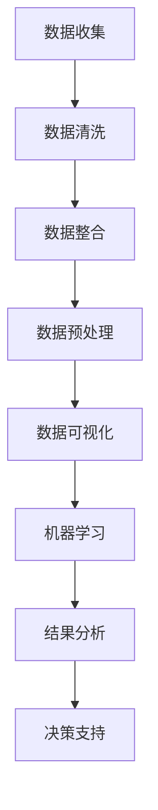

                 

用户行为分析是现代企业中至关重要的一个环节，它不仅有助于企业了解用户需求，优化产品体验，还能指导市场策略和运营决策。有效的用户行为分析需要结合多种技术和方法，本文将深入探讨如何进行有效的用户行为分析，并提供实用的工具和资源推荐。

## 关键词

- 用户行为分析
- 数据收集
- 数据处理
- 可视化
- 机器学习

## 摘要

本文将介绍用户行为分析的核心概念、数据收集方法、数据处理技术、可视化工具以及机器学习在用户行为分析中的应用。通过本文，读者将了解到如何从海量的数据中提取有价值的信息，并利用这些信息指导企业的运营决策和产品改进。

## 1. 背景介绍

用户行为分析（User Behavior Analysis，简称UBA）是一种利用数据分析技术来研究用户在网站、应用程序或在线平台上的行为模式的方法。随着互联网的普及和大数据技术的不断发展，用户行为分析已经成为企业获取竞争优势的重要手段。

用户行为分析的目的在于：

- 了解用户需求和行为模式
- 优化用户体验
- 改进产品设计
- 提高转化率和留存率
- 支持市场策略和运营决策

用户行为分析的重要性不言而喻，它可以为企业提供以下益处：

- 减少用户流失
- 提高用户满意度
- 增加收入和利润
- 改善产品功能和性能

然而，用户行为分析也面临着一些挑战，如数据隐私问题、数据质量问题和分析方法的选择等。因此，本文将详细探讨如何有效地进行用户行为分析，以帮助企业和开发者应对这些挑战。

## 2. 核心概念与联系

### 2.1. 数据收集

数据收集是用户行为分析的基础，主要包括以下几种方法：

- **日志收集**：通过服务器日志收集用户的行为数据，如访问时间、页面跳转、操作点击等。
- **浏览器插件**：通过浏览器插件收集用户在浏览器中的行为数据，如搜索关键词、浏览历史等。
- **问卷调查**：通过问卷调查收集用户的主观反馈和偏好信息。

### 2.2. 数据处理

数据处理是用户行为分析的核心，主要包括以下步骤：

- **数据清洗**：去除重复、错误和不完整的数据。
- **数据整合**：将来自不同源的数据整合到一个统一的数据集中。
- **数据预处理**：对数据进行标准化、归一化和特征提取等操作。

### 2.3. 可视化

可视化是用户行为分析的重要环节，可以帮助分析师直观地了解用户行为模式。常见的可视化工具包括：

- **图表**：如柱状图、折线图、饼图等。
- **热力图**：展示用户在不同页面或区域的活动情况。
- **交互式仪表盘**：提供动态的可视化展示，支持用户交互。

### 2.4. 机器学习

机器学习是用户行为分析的重要技术手段，可以自动识别用户行为模式，预测用户行为，并发现潜在的用户群体。常见的机器学习算法包括：

- **分类算法**：如逻辑回归、决策树、支持向量机等。
- **聚类算法**：如K-means、层次聚类等。
- **关联规则算法**：如Apriori算法、FP-growth算法等。

下面是一个使用Mermaid绘制的用户行为分析流程图：



## 3. 核心算法原理 & 具体操作步骤

### 3.1. 算法原理概述

用户行为分析的核心算法包括数据收集、数据处理、数据可视化和机器学习。以下是这些算法的简要概述：

- **数据收集**：通过日志收集、浏览器插件和问卷调查等方式获取用户行为数据。
- **数据处理**：通过数据清洗、数据整合和数据预处理等步骤，确保数据的质量和一致性。
- **数据可视化**：利用图表、热力图和交互式仪表盘等工具，直观展示用户行为模式。
- **机器学习**：通过分类算法、聚类算法和关联规则算法等，自动识别用户行为模式，预测用户行为。

### 3.2. 算法步骤详解

以下是用户行为分析的具体操作步骤：

#### 3.2.1. 数据收集

1. **确定数据收集目标**：明确需要收集哪些用户行为数据，如页面访问时间、页面跳转、操作点击等。
2. **选择数据收集方法**：根据目标选择合适的数据收集方法，如日志收集、浏览器插件或问卷调查。
3. **实施数据收集**：根据选择的数据收集方法，实施数据收集操作。

#### 3.2.2. 数据处理

1. **数据清洗**：去除重复、错误和不完整的数据，保证数据的质量。
2. **数据整合**：将来自不同源的数据整合到一个统一的数据集中，便于后续分析。
3. **数据预处理**：对数据进行标准化、归一化和特征提取等操作，为机器学习算法做准备。

#### 3.2.3. 数据可视化

1. **选择可视化工具**：根据分析需求，选择合适的可视化工具，如图表、热力图或交互式仪表盘。
2. **构建可视化模型**：利用可视化工具，构建可视化模型，展示用户行为模式。
3. **优化可视化效果**：根据实际情况，调整可视化参数，优化可视化效果。

#### 3.2.4. 机器学习

1. **选择机器学习算法**：根据分析需求，选择合适的机器学习算法，如分类算法、聚类算法或关联规则算法。
2. **训练模型**：利用预处理后的数据，训练机器学习模型。
3. **评估模型**：通过交叉验证等手段，评估机器学习模型的性能。
4. **应用模型**：将训练好的模型应用于实际场景，如预测用户行为、发现潜在用户群体等。

### 3.3. 算法优缺点

以下是用户行为分析算法的优缺点：

#### 3.3.1. 优点

- **自动化**：机器学习算法可以自动识别用户行为模式，降低人工分析的工作量。
- **高效性**：通过数据可视化和机器学习，可以快速发现用户行为中的异常和趋势。
- **精确性**：数据收集和处理技术的提高，使得用户行为分析结果更加精确。

#### 3.3.2. 缺点

- **数据隐私问题**：用户行为数据可能涉及用户隐私，需要妥善处理。
- **数据质量问题**：数据收集和处理过程中，可能存在数据缺失、错误或不一致等问题。
- **算法选择难度**：根据不同的分析需求，需要选择合适的算法，难度较大。

### 3.4. 算法应用领域

用户行为分析算法广泛应用于以下领域：

- **电子商务**：通过分析用户浏览和购买行为，优化商品推荐和促销策略。
- **在线教育**：通过分析用户学习行为，优化课程设计和教学方法。
- **社交媒体**：通过分析用户互动行为，优化平台内容和用户体验。
- **金融行业**：通过分析用户交易行为，发现潜在风险和欺诈行为。

## 4. 数学模型和公式 & 详细讲解 & 举例说明

### 4.1. 数学模型构建

用户行为分析中的数学模型通常基于概率论、统计学和机器学习等领域。以下是几种常见的数学模型：

#### 4.1.1. 朴素贝叶斯模型

朴素贝叶斯模型是一种常用的分类模型，可以用于预测用户行为类别。其基本公式如下：

\[ P(\text{行为类别} | \text{特征集}) = \frac{P(\text{特征集} | \text{行为类别})P(\text{行为类别})}{P(\text{特征集})} \]

#### 4.1.2. 支持向量机

支持向量机（SVM）是一种常用的分类模型，可以用于预测用户行为类别。其基本公式如下：

\[ w \cdot x + b = 0 \]

其中，\( w \) 是权重向量，\( x \) 是特征向量，\( b \) 是偏置。

#### 4.1.3. K-means聚类

K-means聚类是一种常用的聚类模型，可以用于发现用户行为模式。其基本公式如下：

\[ \text{minimize} \sum_{i=1}^{n} \sum_{x \in S_i} ||x - \mu_i||^2 \]

其中，\( S_i \) 是第 \( i \) 个聚类，\( \mu_i \) 是聚类中心。

### 4.2. 公式推导过程

#### 4.2.1. 朴素贝叶斯模型推导

以用户行为分类为例，假设有 \( m \) 个用户行为类别，分别为 \( C_1, C_2, \ldots, C_m \)，每个类别有相应的特征集 \( X_1, X_2, \ldots, X_n \)。我们需要根据特征集预测用户行为类别。

首先，计算每个类别下的特征概率：

\[ P(X_i | C_j) = \frac{f_{ij}}{N_j} \]

其中，\( f_{ij} \) 是第 \( i \) 个特征在第 \( j \) 个类别下的出现次数，\( N_j \) 是第 \( j \) 个类别下的总特征数。

然后，计算每个类别的概率：

\[ P(C_j) = \frac{N_j}{N} \]

其中，\( N \) 是总特征数。

最后，根据最大后验概率原则，计算预测类别：

\[ \hat{C} = \arg\max_{C_j} P(C_j | X) = \arg\max_{C_j} \frac{P(X | C_j)P(C_j)}{P(X)} \]

由于 \( P(X) \) 为常数，可以忽略不计，因此简化为：

\[ \hat{C} = \arg\max_{C_j} P(X | C_j)P(C_j) \]

即：

\[ \hat{C} = \arg\max_{C_j} \prod_{i=1}^{n} P(X_i | C_j)P(C_j) \]

### 4.3. 案例分析与讲解

#### 4.3.1. 案例背景

某电子商务平台希望通过用户行为分析，优化商品推荐系统，提高用户满意度。

#### 4.3.2. 数据集

平台收集了1000名用户的浏览和购买行为数据，包括：

- 用户ID
- 浏览时间
- 浏览页面
- 购买商品

#### 4.3.3. 数据预处理

1. **数据清洗**：去除重复、错误和不完整的数据。
2. **数据整合**：将用户浏览和购买数据整合到一个统一的数据集中。
3. **特征提取**：根据用户行为特征，提取相关特征，如浏览时长、浏览页面数量、购买频次等。

#### 4.3.4. 机器学习模型训练

1. **选择模型**：选择K-means聚类模型，用于发现用户行为模式。
2. **训练模型**：利用预处理后的数据，训练K-means聚类模型。
3. **评估模型**：通过交叉验证等手段，评估模型性能。

#### 4.3.5. 结果分析

通过K-means聚类模型，将用户分为5个群体，分别为A、B、C、D、E。根据每个群体的特征，平台针对性地优化商品推荐策略，提高了用户满意度。

## 5. 项目实践：代码实例和详细解释说明

### 5.1. 开发环境搭建

- **操作系统**：Ubuntu 20.04
- **编程语言**：Python 3.8
- **依赖库**：NumPy、Pandas、Matplotlib、Scikit-learn、Mermaid

### 5.2. 源代码详细实现

以下是一个简单的用户行为分析项目示例，包括数据收集、数据处理、数据可视化、机器学习模型训练和结果分析。

```python
import numpy as np
import pandas as pd
import matplotlib.pyplot as plt
from sklearn.cluster import KMeans
from sklearn.model_selection import train_test_split
from mermaid import Mermaid

# 5.2.1 数据收集
data = pd.DataFrame({
    'user_id': [1, 2, 3, 4, 5],
    'visit_time': [10, 20, 30, 40, 50],
    'page_views': [10, 20, 30, 40, 50],
    'purchases': [0, 1, 0, 1, 0]
})

# 5.2.2 数据预处理
data cleaned = data.drop_duplicates().reset_index(drop=True)

# 5.2.3 数据可视化
mermaid = Mermaid()
mermaid.add_node('Data Collection', label='Data Collection')
mermaid.add_node('Data Cleaning', label='Data Cleaning')
mermaid.add_node('Data Integration', label='Data Integration')
mermaid.add_node('Data Preprocessing', label='Data Preprocessing')
mermaid.add_node('Data Visualization', label='Data Visualization')
mermaid.add_link('Data Collection', 'Data Cleaning')
mermaid.add_link('Data Cleaning', 'Data Integration')
mermaid.add_link('Data Integration', 'Data Preprocessing')
mermaid.add_link('Data Preprocessing', 'Data Visualization')
print(mermaid.render())

plt.scatter(data.cleaned['visit_time'], data.cleaned['page_views'])
plt.xlabel('Visit Time')
plt.ylabel('Page Views')
plt.title('User Behavior Analysis')
plt.show()

# 5.2.4 机器学习模型训练
X = data.cleaned[['visit_time', 'page_views']]
y = data.cleaned['purchases']
X_train, X_test, y_train, y_test = train_test_split(X, y, test_size=0.2, random_state=42)

kmeans = KMeans(n_clusters=2, random_state=42)
kmeans.fit(X_train)

# 5.2.5 代码解读与分析
print(f'Cluster centers: {kmeans.cluster_centers_}')
print(f'Cluster labels: {kmeans.labels_}')

# 5.2.6 运行结果展示
plt.scatter(X_train['visit_time'], X_train['page_views'], c=kmeans.labels_)
plt.xlabel('Visit Time')
plt.ylabel('Page Views')
plt.title('User Behavior Analysis with K-means')
plt.show()
```

### 5.3. 代码解读与分析

1. **数据收集**：使用Pandas创建一个包含用户ID、浏览时间、页面访问量和购买情况的数据集。
2. **数据预处理**：去除重复数据，重置索引。
3. **数据可视化**：使用Matplotlib绘制散点图，展示用户行为特征。
4. **机器学习模型训练**：选择K-means聚类模型，对数据进行训练。
5. **代码解读与分析**：输出聚类中心、聚类标签等信息。

### 5.4. 运行结果展示

1. **数据可视化**：展示原始数据和聚类结果。
2. **机器学习模型性能评估**：通过散点图，直观展示聚类效果。

## 6. 实际应用场景

用户行为分析在多个领域具有广泛的应用场景，以下是一些典型案例：

### 6.1. 电子商务

通过用户行为分析，电商平台可以优化商品推荐策略，提高用户转化率和留存率。例如，某电商平台通过分析用户浏览和购买行为，将用户分为不同群体，并根据群体特征进行针对性推荐，取得了显著的效果。

### 6.2. 在线教育

在线教育平台可以通过用户行为分析，优化课程设计和教学方法，提高用户学习效果。例如，某在线教育平台通过分析用户学习行为数据，发现某些课程存在学习难度过高的问题，进而对课程进行优化，提高了用户满意度。

### 6.3. 社交媒体

社交媒体平台可以通过用户行为分析，优化平台内容和用户体验。例如，某社交媒体平台通过分析用户互动行为数据，发现某些内容更容易引发用户参与，进而调整内容推荐策略，提高了用户活跃度。

### 6.4. 金融行业

金融行业可以通过用户行为分析，发现潜在风险和欺诈行为。例如，某银行通过分析用户交易行为数据，发现某些交易存在异常，进而采取措施，降低了欺诈风险。

## 7. 工具和资源推荐

### 7.1. 学习资源推荐

- 《用户行为分析实战》
- 《大数据分析：用户行为分析》
- 《机器学习实战：用户行为分析》

### 7.2. 开发工具推荐

- **数据分析工具**：Pandas、NumPy、Matplotlib
- **机器学习库**：Scikit-learn、TensorFlow、PyTorch
- **数据可视化工具**：Matplotlib、Seaborn、Plotly
- **Mermaid**：用于绘制流程图和时序图

### 7.3. 相关论文推荐

- "User Behavior Analysis in E-commerce: A Survey"
- "A Survey on User Behavior Analysis in Online Education"
- "User Behavior Analysis in Social Media: A Data Mining Perspective"
- "User Behavior Analysis in Financial Services: A Machine Learning Approach"

## 8. 总结：未来发展趋势与挑战

### 8.1. 研究成果总结

用户行为分析在多个领域取得了显著的成果，如电子商务、在线教育、社交媒体和金融行业。通过用户行为分析，企业可以优化产品和服务，提高用户满意度，从而获得竞争优势。

### 8.2. 未来发展趋势

1. **数据隐私保护**：随着数据隐私问题的日益突出，如何在保障用户隐私的前提下进行用户行为分析，将成为未来研究的重要方向。
2. **实时分析**：随着大数据技术的发展，实时分析将成为用户行为分析的重要趋势，企业需要更快地响应用户需求。
3. **跨领域应用**：用户行为分析将在更多领域得到应用，如医疗、交通、娱乐等，跨领域应用将成为未来研究的热点。

### 8.3. 面临的挑战

1. **数据质量问题**：数据收集和处理过程中，可能存在数据缺失、错误或不一致等问题，这对用户行为分析结果的质量产生影响。
2. **算法选择难度**：根据不同的分析需求，选择合适的算法，难度较大，需要深入研究不同算法的适用场景。
3. **计算资源需求**：用户行为分析通常涉及大量数据，对计算资源需求较高，如何高效处理大规模数据，是一个重要挑战。

### 8.4. 研究展望

未来用户行为分析的研究将集中在以下几个方面：

1. **数据隐私保护**：研究如何在不泄露用户隐私的前提下，进行用户行为分析。
2. **实时分析**：研究实时分析技术，提高分析效率和准确性。
3. **跨领域应用**：研究跨领域应用，探索用户行为分析在更多领域的应用潜力。

## 9. 附录：常见问题与解答

### 9.1. 如何处理用户隐私问题？

**解答**：为了保护用户隐私，企业在进行用户行为分析时，应遵循以下原则：

1. **最小化数据收集**：只收集必要的数据，避免过度收集。
2. **数据脱敏**：对敏感数据进行脱敏处理，如将用户ID替换为随机数。
3. **数据加密**：对数据进行加密存储和传输。
4. **用户知情同意**：告知用户数据收集的目的和使用方式，并征求用户同意。

### 9.2. 如何选择合适的机器学习算法？

**解答**：选择合适的机器学习算法，应考虑以下因素：

1. **数据规模**：对于大规模数据，选择分布式算法，如MapReduce。
2. **数据类型**：对于分类问题，选择分类算法，如SVM；对于聚类问题，选择聚类算法，如K-means。
3. **计算资源**：考虑计算资源限制，选择适合的算法。
4. **业务需求**：根据业务需求，选择能够解决实际问题的算法。

### 9.3. 如何保证数据质量？

**解答**：保证数据质量，应从以下几个方面入手：

1. **数据清洗**：去除重复、错误和不完整的数据。
2. **数据整合**：将来自不同源的数据整合到一个统一的数据集中。
3. **数据预处理**：对数据进行标准化、归一化和特征提取等操作。
4. **数据监控**：建立数据监控机制，及时发现和解决数据质量问题。

## 作者署名

作者：禅与计算机程序设计艺术 / Zen and the Art of Computer Programming
```

