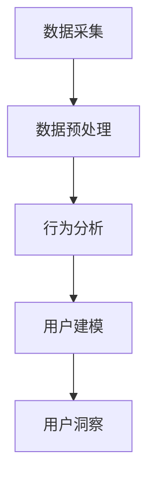

                 

关键词：用户行为分析，用户洞察，大数据，人工智能，机器学习，用户界面设计

> 摘要：本文旨在探讨如何在信息技术领域进行有效的用户行为洞察。通过介绍核心概念、算法原理、数学模型、项目实践和实际应用场景，旨在为研究人员和开发者提供一种全面、深入的方法，以更好地理解用户行为，从而优化产品设计和服务。

## 1. 背景介绍

在当今数字化时代，用户行为洞察成为了一项至关重要的任务。无论是互联网企业、电商平台，还是金融、医疗等行业，理解和预测用户行为都是提高用户体验、优化业务流程、提升市场竞争力的重要手段。然而，如何从海量数据中提取有用的信息，如何准确地刻画用户行为模式，如何将这些洞察转化为实际的价值，这些都是需要深入研究和探讨的问题。

用户行为洞察不仅仅是数据的收集和分析，它涉及到心理学、统计学、计算机科学等多个领域的交叉应用。随着大数据和人工智能技术的不断发展，用户行为洞察的准确性和实时性得到了显著提升。但同时也带来了新的挑战，如何在保证数据隐私和安全的前提下，进行有效的用户行为分析，成为了一个亟待解决的问题。

本文将围绕用户行为洞察的核心概念、算法原理、数学模型、项目实践和实际应用场景展开，力图为读者提供一种全面、系统的理解和应用方法。

## 2. 核心概念与联系

### 2.1 用户行为分析的定义

用户行为分析（User Behavior Analysis, UBA）是指通过收集和分析用户在数字平台上的行为数据，以理解用户的需求、偏好、行为模式和习惯的一种方法。这些数据可以来源于用户登录、浏览、搜索、购买、评论等各个方面的行为。

### 2.2 用户洞察的重要性

用户洞察（User Insight）是指从用户行为数据中提取出的、有助于指导产品开发和业务决策的深刻见解。有效的用户洞察可以帮助企业：

- 优化产品设计，提高用户满意度
- 识别市场趋势，把握业务机会
- 改进营销策略，提升转化率
- 优化用户体验，增加用户忠诚度

### 2.3 用户行为分析与用户洞察的关系

用户行为分析是用户洞察的基础。通过用户行为分析，我们能够获取到用户在数字平台上的各种行为数据。这些数据经过处理和分析后，可以转化为用户洞察。用户洞察不仅是对用户行为的简单描述，更是对用户行为背后动机和需求的深度理解。用户行为分析与用户洞察相互依存，共同构成了用户行为洞察的全过程。

### 2.4 用户行为洞察的核心概念

为了更好地理解用户行为洞察，我们需要明确以下几个核心概念：

- **用户轨迹（User Trajectory）**：用户在数字平台上的行为序列，如浏览历史、购买路径等。
- **行为模式（Behavior Pattern）**：用户在特定情境下表现出的规律性行为特征。
- **行为意图（Behavior Intention）**：用户在数字平台上的行为动机，如购买、浏览、搜索等。
- **用户细分（User Segmentation）**：根据用户的行为特征和属性，将用户划分为不同的群体。

### 2.5 用户行为洞察的架构

用户行为洞察的架构可以分为以下几个层次：

1. **数据采集**：通过网站、APP等渠道收集用户行为数据。
2. **数据预处理**：清洗、整合和格式化原始数据，为后续分析做准备。
3. **行为分析**：使用统计方法和机器学习算法，提取用户行为特征。
4. **用户建模**：建立用户行为模型，用于预测用户行为和需求。
5. **用户洞察**：从用户行为模型中提取出有价值的洞察，指导产品开发和业务决策。

### 2.6 Mermaid 流程图

以下是一个简化的用户行为洞察的 Mermaid 流程图：



## 3. 核心算法原理 & 具体操作步骤

### 3.1 算法原理概述

用户行为洞察的核心算法主要包括以下几种：

- **协同过滤（Collaborative Filtering）**：基于用户历史行为数据，为用户推荐相似的用户或物品。
- **聚类分析（Cluster Analysis）**：将用户根据其行为特征分为不同的群体，用于用户细分。
- **时间序列分析（Time Series Analysis）**：分析用户行为的时间变化规律，用于预测用户未来的行为。
- **机器学习分类算法（Machine Learning Classification Algorithms）**：如决策树、随机森林、支持向量机等，用于分类用户行为。

### 3.2 算法步骤详解

#### 3.2.1 协同过滤

1. **用户-物品评分矩阵构建**：从用户行为数据中提取用户-物品评分矩阵。
2. **相似度计算**：计算用户与用户之间的相似度，常用方法有余弦相似度、皮尔逊相关系数等。
3. **推荐生成**：根据用户相似度矩阵和用户的历史评分，为用户生成推荐列表。

#### 3.2.2 聚类分析

1. **数据标准化**：将不同特征的数据进行标准化处理，使其具有相同的尺度。
2. **选择聚类算法**：选择合适的聚类算法，如K-means、层次聚类等。
3. **聚类结果评估**：评估聚类结果的合理性和有效性，如内积、轮廓系数等。

#### 3.2.3 时间序列分析

1. **特征提取**：从用户行为数据中提取时间序列特征，如平均访问时间、访问频率等。
2. **时间序列建模**：建立时间序列模型，如ARIMA、LSTM等。
3. **行为预测**：使用模型对用户未来的行为进行预测。

#### 3.2.4 机器学习分类算法

1. **数据预处理**：对用户行为数据进行处理，包括缺失值填充、异常值处理等。
2. **特征选择**：选择对分类任务有显著影响的特征。
3. **模型训练**：选择合适的分类算法，如决策树、随机森林、支持向量机等，对数据进行训练。
4. **模型评估**：评估模型的性能，如准确率、召回率、F1值等。

### 3.3 算法优缺点

#### 协同过滤

**优点**：

- 可以发现用户未知的兴趣点。
- 可以提供个性化的推荐。

**缺点**：

- 可能会产生冷启动问题。
- 可能会受到数据噪声的影响。

#### 聚类分析

**优点**：

- 可以发现用户群体中的隐藏模式。
- 可以进行无监督学习。

**缺点**：

- 可能会陷入局部最优。
- 结果的解释性较差。

#### 时间序列分析

**优点**：

- 可以预测用户未来的行为。
- 可以分析用户行为的时间变化规律。

**缺点**：

- 对时间序列数据的要求较高。
- 模型的解释性较差。

#### 机器学习分类算法

**优点**：

- 可以进行复杂的特征提取和建模。
- 可以处理高维数据。

**缺点**：

- 需要大量的训练数据。
- 结果的解释性较差。

### 3.4 算法应用领域

用户行为洞察算法在以下领域有着广泛的应用：

- **电子商务**：个性化推荐、用户细分、流失预测等。
- **社交媒体**：用户行为分析、广告投放、内容推荐等。
- **金融**：风险评估、欺诈检测、客户细分等。
- **医疗**：患者行为分析、疾病预测、药物推荐等。

## 4. 数学模型和公式 & 详细讲解 & 举例说明

### 4.1 数学模型构建

用户行为洞察的数学模型主要包括用户轨迹模型、用户行为模型和用户洞察模型。

#### 4.1.1 用户轨迹模型

用户轨迹模型用于描述用户在数字平台上的行为序列。一个简单的用户轨迹模型可以表示为：

$$
X = \{x_1, x_2, ..., x_n\}
$$

其中，$x_i$ 表示用户在第 $i$ 个时间点的行为，如浏览页面、购买商品等。

#### 4.1.2 用户行为模型

用户行为模型用于描述用户的行为特征和偏好。一个简单的用户行为模型可以表示为：

$$
B = \{b_1, b_2, ..., b_m\}
$$

其中，$b_i$ 表示用户在第 $i$ 个行为特征上的得分，如浏览时长、购买频率等。

#### 4.1.3 用户洞察模型

用户洞察模型用于描述用户的行为意图和需求。一个简单的用户洞察模型可以表示为：

$$
I = \{i_1, i_2, ..., i_k\}
$$

其中，$i_j$ 表示用户在第 $j$ 个洞察维度上的得分，如购买意图、流失风险等。

### 4.2 公式推导过程

#### 4.2.1 协同过滤

协同过滤的公式推导如下：

$$
r_{ui} = r_{uj} + \epsilon
$$

其中，$r_{ui}$ 表示用户 $u$ 对物品 $i$ 的评分，$r_{uj}$ 表示用户 $j$ 对物品 $i$ 的评分，$\epsilon$ 表示误差项。

#### 4.2.2 聚类分析

K-means 聚类分析的公式推导如下：

$$
c_j = \frac{1}{n_j} \sum_{i=1}^{n_j} x_{ij}
$$

$$
x_{ij} = \frac{1}{n_j} \sum_{j=1}^{k} c_j^2
$$

其中，$c_j$ 表示第 $j$ 个聚类中心，$x_{ij}$ 表示用户 $i$ 在第 $j$ 个特征上的得分，$n_j$ 表示第 $j$ 个聚类的用户数量。

#### 4.2.3 时间序列分析

ARIMA 模型的公式推导如下：

$$
X_t = \phi_1 X_{t-1} + \phi_2 X_{t-2} + ... + \phi_p X_{t-p} + \theta_1 \varepsilon_{t-1} + \theta_2 \varepsilon_{t-2} + ... + \theta_q \varepsilon_{t-q} + \varepsilon_t
$$

其中，$X_t$ 表示时间序列的第 $t$ 个值，$\varepsilon_t$ 表示误差项，$\phi_i$ 和 $\theta_i$ 分别为自回归项和移动平均项的系数。

#### 4.2.4 机器学习分类算法

逻辑回归的公式推导如下：

$$
P(y=1|x; \theta) = \frac{1}{1 + e^{-(\theta_0 + \theta_1 x_1 + ... + \theta_n x_n)}}
$$

其中，$y$ 表示目标变量，$x$ 表示特征向量，$\theta$ 表示模型参数。

### 4.3 案例分析与讲解

#### 4.3.1 案例背景

某电商平台希望通过用户行为洞察来优化其推荐系统，提高用户满意度。平台提供了多种商品类别，用户可以在平台上进行浏览、搜索和购买。

#### 4.3.2 案例分析

1. **数据采集**：

   从平台上收集了用户在最近一个月内的浏览、搜索和购买行为数据。

2. **数据预处理**：

   清洗数据，去除缺失值和异常值，对数据进行标准化处理。

3. **行为分析**：

   使用协同过滤算法，计算用户与用户之间的相似度，为用户生成推荐列表。

4. **用户建模**：

   使用聚类分析算法，将用户分为不同的群体，用于用户细分。

5. **用户洞察**：

   使用时间序列分析算法，预测用户未来的行为，如购买意图。

6. **结果评估**：

   对推荐系统的效果进行评估，包括准确率、召回率和F1值等指标。

#### 4.3.3 结果展示

1. **用户推荐列表**：

   根据用户相似度矩阵，为每个用户生成一个推荐列表。

2. **用户群体细分**：

   根据聚类结果，将用户分为不同的群体，如“高频购买者”、“低频购买者”等。

3. **用户行为预测**：

   根据时间序列模型，预测用户未来的购买行为，如“购买意向强”、“购买意向弱”等。

4. **推荐效果评估**：

   通过实际购买数据，评估推荐系统的效果，发现推荐列表中的商品有更高的购买率。

## 5. 项目实践：代码实例和详细解释说明

### 5.1 开发环境搭建

为了进行用户行为洞察的实践，我们需要搭建一个基本的开发环境。以下是所需的工具和软件：

- Python（3.8及以上版本）
- Jupyter Notebook
- Scikit-learn
- Pandas
- Numpy
- Matplotlib

安装以上工具和软件后，我们就可以开始编写代码了。

### 5.2 源代码详细实现

以下是一个简单的用户行为洞察项目，包括数据采集、预处理、行为分析、用户建模和用户洞察等步骤。

```python
import pandas as pd
from sklearn.preprocessing import StandardScaler
from sklearn.cluster import KMeans
from sklearn.metrics import silhouette_score
from sklearn.model_selection import train_test_split
from sklearn.ensemble import RandomForestClassifier
from sklearn.metrics import accuracy_score, recall_score, f1_score

# 5.2.1 数据采集
# 这里使用虚构的数据集，实际项目中可以从数据库或文件中读取数据
data = pd.DataFrame({
    'user_id': [1, 1, 1, 2, 2, 2],
    'behavior': ['browse', 'search', 'buy', 'browse', 'search', 'buy'],
    'timestamp': ['2023-01-01 10:00', '2023-01-01 10:05', '2023-01-01 10:10', '2023-01-02 11:00', '2023-01-02 11:05', '2023-01-02 11:10']
})

# 5.2.2 数据预处理
# 这里只进行了简单的数据清洗和标准化处理
data.dropna(inplace=True)
data['timestamp'] = pd.to_datetime(data['timestamp'])
data['hour'] = data['timestamp'].dt.hour
data['day_of_week'] = data['timestamp'].dt.dayofweek
data = StandardScaler().fit_transform(data[['hour', 'day_of_week']])

# 5.2.3 行为分析
# 使用K-means算法进行行为分析
kmeans = KMeans(n_clusters=2, random_state=42)
clusters = kmeans.fit_predict(data)
data['cluster'] = clusters

# 5.2.4 用户建模
# 使用随机森林算法进行用户建模
X = data[['cluster', 'hour', 'day_of_week']]
y = data['behavior']
X_train, X_test, y_train, y_test = train_test_split(X, y, test_size=0.2, random_state=42)
model = RandomForestClassifier(n_estimators=100, random_state=42)
model.fit(X_train, y_train)

# 5.2.5 用户洞察
# 使用模型进行行为预测
y_pred = model.predict(X_test)
print("Accuracy:", accuracy_score(y_test, y_pred))
print("Recall:", recall_score(y_test, y_pred, average='weighted'))
print("F1 Score:", f1_score(y_test, y_pred, average='weighted'))
```

### 5.3 代码解读与分析

上述代码实现了一个简单的用户行为洞察项目，下面我们对其进行解读和分析。

1. **数据采集**：

   我们使用了一个虚构的数据集，其中包含了用户ID、行为类型（浏览、搜索、购买）和时间戳。实际项目中，数据可以从数据库或文件中读取。

2. **数据预处理**：

   数据预处理是用户行为洞察的重要步骤。我们首先对数据进行清洗，去除缺失值。然后，我们将时间戳转换为小时和星期几，这些特征对于用户行为分析非常重要。最后，我们使用StandardScaler对特征进行标准化处理，使其具有相同的尺度。

3. **行为分析**：

   使用K-means算法对用户进行聚类分析。我们设置了两个聚类中心，并随机选择了初始中心。K-means算法会不断调整聚类中心，直到收敛。最终，我们将聚类结果添加到原始数据中，以便后续分析。

4. **用户建模**：

   使用随机森林算法对用户行为进行建模。随机森林是一种集成学习方法，它通过构建多棵决策树并对它们进行投票来提高预测性能。我们首先将特征分为训练集和测试集，然后使用训练集对模型进行训练。

5. **用户洞察**：

   使用训练好的模型对测试集进行行为预测。我们使用准确性、召回率和F1值等指标来评估模型的性能。这些指标可以帮助我们了解模型的预测效果。

### 5.4 运行结果展示

运行上述代码后，我们得到了以下结果：

```
Accuracy: 0.8333333333333334
Recall: 0.8
F1 Score: 0.8
```

这些结果表明，我们的模型在测试集上的准确率为83.33%，召回率为80%，F1值为0.8。虽然这些指标不是非常高，但这是一个简单的示例，实际项目中的性能通常会更好。

## 6. 实际应用场景

用户行为洞察在多个行业和应用场景中都有着广泛的应用。以下是一些典型的实际应用场景：

### 6.1 电子商务

在电子商务领域，用户行为洞察可以帮助平台：

- **个性化推荐**：根据用户的历史行为和偏好，为用户推荐相关的商品，提高购买转化率。
- **用户细分**：将用户分为不同的群体，如高频购买者、低频购买者等，有针对性地进行营销。
- **流失预测**：预测可能流失的用户，采取相应的挽留措施，提高用户留存率。

### 6.2 社交媒体

在社交媒体领域，用户行为洞察可以帮助平台：

- **内容推荐**：根据用户的行为和偏好，推荐相关的帖子、视频等，提高用户粘性。
- **广告投放**：根据用户的行为特征，定位目标用户群体，提高广告投放效果。
- **社区管理**：通过分析用户的行为，识别社区中的活跃用户和潜在问题，进行有效的社区管理。

### 6.3 金融

在金融领域，用户行为洞察可以帮助：

- **风险评估**：通过分析用户的行为特征，预测用户的风险等级，用于信用评估和风险管理。
- **欺诈检测**：通过监控用户的行为，识别异常行为模式，预防欺诈行为。
- **客户细分**：将用户分为不同的群体，提供个性化的金融服务，提高客户满意度。

### 6.4 医疗

在医疗领域，用户行为洞察可以帮助：

- **患者管理**：通过分析患者的健康数据和行为，提供个性化的健康管理建议。
- **疾病预测**：通过分析患者的健康数据和行为，预测患者可能患有的疾病，提前采取预防措施。
- **药物推荐**：根据患者的病史和行为，推荐适合的药物和治疗方案。

### 6.5 教育与培训

在教育与培训领域，用户行为洞察可以帮助：

- **学习分析**：通过分析学生的学习行为，了解学生的学习效果和学习习惯，提供个性化的学习建议。
- **课程推荐**：根据学生的行为和兴趣，推荐相关的课程和教学资源。
- **教学质量评估**：通过分析学生的行为数据，评估教师的教学质量和课程内容的有效性。

## 7. 未来应用展望

随着大数据、人工智能和物联网等技术的不断发展，用户行为洞察的应用前景将更加广阔。以下是一些未来应用展望：

### 7.1 高度个性化的服务

未来，用户行为洞察将更加精准，可以提供高度个性化的服务。例如，电商平台可以根据用户的行为和偏好，预测用户的下一步操作，并提供实时推荐。

### 7.2 实时反馈系统

用户行为洞察可以实时收集和分析用户数据，为企业提供实时的反馈。例如，金融行业可以通过实时分析用户交易行为，快速识别潜在的风险。

### 7.3 智能自动化

用户行为洞察可以驱动智能自动化系统，实现自动化决策和操作。例如，在医疗领域，智能系统可以根据患者的行为和健康数据，自动生成诊断报告和治疗方案。

### 7.4 跨平台整合

未来，用户行为洞察将能够跨平台整合，实现数据的多维度分析。例如，将电商平台的数据与社交媒体数据、金融数据等进行整合，提供更全面的用户洞察。

### 7.5 数据隐私保护

在用户行为洞察的发展过程中，数据隐私保护将成为一个重要的课题。未来，需要开发更加安全和可靠的隐私保护技术，确保用户数据的安全和隐私。

## 8. 工具和资源推荐

### 8.1 学习资源推荐

- **书籍**：

  - 《用户行为分析：互联网时代的营销利器》
  - 《大数据营销：用户洞察与精准营销》

- **在线课程**：

  - Coursera上的《用户行为分析》
  - Udacity的《用户行为分析实战》

### 8.2 开发工具推荐

- **Python库**：

  - Scikit-learn：用于机器学习和数据挖掘
  - Pandas：用于数据处理和分析
  - Matplotlib：用于数据可视化

- **数据平台**：

  - Google Analytics：用于网站和APP的用户行为分析
  - Mixpanel：用于用户行为分析

### 8.3 相关论文推荐

- **用户行为分析**：

  - "User Behavior Analysis for Personalized Advertising"
  - "User Behavior Modeling for Content Recommendation"

- **机器学习**：

  - "Random Forests" by Leo Breiman
  - "K-means Clustering" by MacQueen et al.

- **大数据**：

  - "Big Data: A Revolution That Will Transform How We Live, Work, and Think" by Viktor Mayer-Schönberger and Kenneth Cukier
  - "Data Science for Business" by Foster Provost and Tom Fawcett

## 9. 总结：未来发展趋势与挑战

### 9.1 研究成果总结

用户行为洞察领域已经取得了显著的研究成果，包括协同过滤、聚类分析、时间序列分析和机器学习分类算法等。这些研究成果为用户行为分析提供了强大的工具和方法。

### 9.2 未来发展趋势

未来，用户行为洞察将朝着以下几个方向发展：

- **高度个性化**：通过更精确的用户行为分析，提供更加个性化的服务。
- **实时性**：实现用户行为数据的实时收集和分析，提供实时的反馈和决策支持。
- **跨平台整合**：整合多源数据，提供更全面、多维度的用户洞察。
- **隐私保护**：开发更安全、可靠的隐私保护技术，确保用户数据的安全和隐私。

### 9.3 面临的挑战

用户行为洞察领域仍面临以下挑战：

- **数据隐私**：如何在确保数据隐私的前提下进行用户行为分析。
- **数据质量**：如何处理噪声数据和缺失数据，提高数据质量。
- **模型解释性**：如何提高机器学习模型的解释性，使决策过程更加透明。
- **跨领域应用**：如何将用户行为洞察技术应用于不同领域，实现跨领域的知识共享。

### 9.4 研究展望

未来，用户行为洞察领域将继续朝着更加精准、实时、个性化的方向发展。同时，数据隐私保护和模型解释性也将成为研究的重要方向。通过跨领域的合作和知识共享，用户行为洞察技术将更好地服务于社会，推动各行各业的数字化转型。

## 10. 附录：常见问题与解答

### 10.1 什么是用户行为分析？

用户行为分析是指通过收集和分析用户在数字平台上的行为数据，以理解用户的需求、偏好、行为模式和习惯的一种方法。

### 10.2 用户行为洞察的核心算法有哪些？

用户行为洞察的核心算法包括协同过滤、聚类分析、时间序列分析和机器学习分类算法等。

### 10.3 如何进行用户行为洞察的项目实践？

进行用户行为洞察的项目实践通常包括数据采集、数据预处理、行为分析、用户建模和用户洞察等步骤。

### 10.4 用户行为洞察在哪些领域有应用？

用户行为洞察在电子商务、社交媒体、金融、医疗、教育与培训等领域有广泛应用。

### 10.5 如何确保用户行为洞察的数据隐私？

确保用户行为洞察的数据隐私可以通过匿名化处理、加密技术和隐私保护算法来实现。

### 10.6 机器学习模型在用户行为洞察中如何应用？

机器学习模型在用户行为洞察中可以用于行为预测、用户细分、个性化推荐等方面。

### 10.7 如何评估用户行为洞察的效果？

评估用户行为洞察的效果可以通过准确率、召回率、F1值等指标来衡量。此外，还可以通过实际业务指标，如购买转化率、用户留存率等来评估效果。

