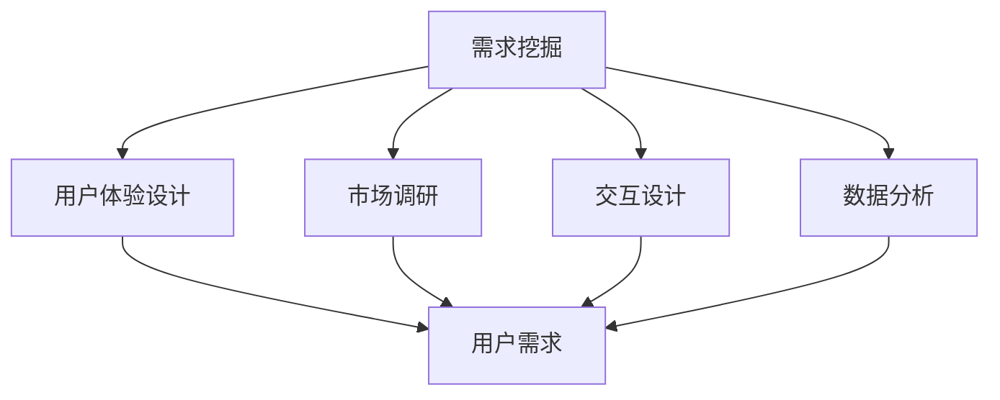
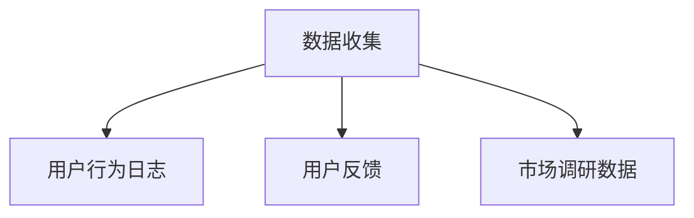
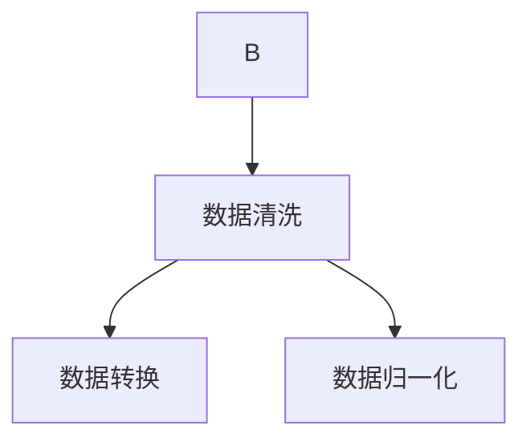
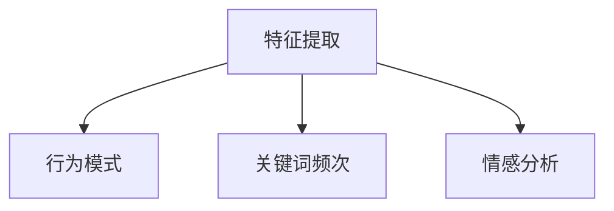
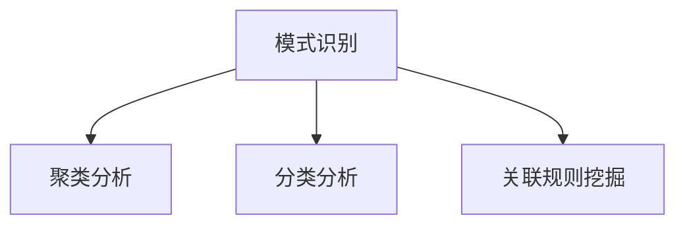
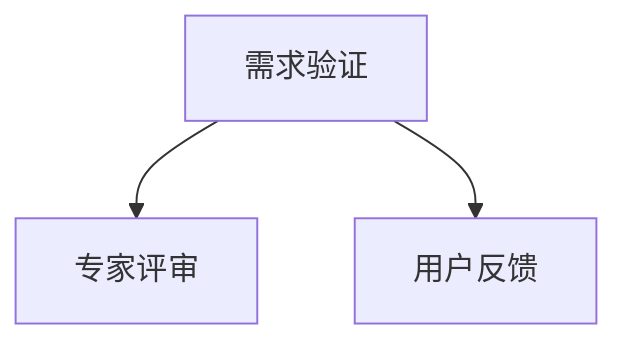

                 

 关键词：用户需求挖掘、需求分析、用户体验、交互设计、技术框架、方法论、数据分析

> 摘要：本文深入探讨了如何进行有效的用户需求挖掘，从多个维度分析了需求挖掘的重要性和核心方法。通过结合实际案例和理论分析，本文提出了一个系统的需求挖掘框架，旨在帮助开发者和产品经理更好地理解和满足用户需求。

## 1. 背景介绍

在数字化时代，用户需求成为推动产品迭代和创新的核心驱动力。然而，用户需求的多样性和复杂性使得有效挖掘和满足这些需求成为一项挑战。用户需求挖掘不仅影响产品的设计和功能实现，还对用户体验和市场竞争力产生深远的影响。因此，如何进行有效的用户需求挖掘成为产品开发和市场研究的重要课题。

用户需求挖掘是一个多层次、多维度的过程，涉及到用户行为分析、市场调研、用户体验设计等多个方面。有效的需求挖掘可以帮助企业更好地理解用户，优化产品功能，提高用户满意度和忠诚度。本文将围绕用户需求挖掘的主题，深入探讨其核心概念、方法和实践。

## 2. 核心概念与联系

### 2.1 需求挖掘的定义

需求挖掘（Requirement Mining）是指从用户行为、反馈、市场数据等多种来源中提取用户需求的过程。它不同于传统的需求定义和收集方法，更侧重于数据驱动的分析方法，通过分析用户的行为数据和反馈信息，自动识别和提取潜在的需求。

### 2.2 需求挖掘与相关概念的关联

- **用户体验（UX）设计**：用户体验设计关注的是用户在使用产品或服务时的感受和体验。需求挖掘是用户体验设计的重要基础，通过对用户需求的挖掘，可以帮助设计团队更好地理解用户，从而设计出更符合用户期望的产品。

- **市场调研**：市场调研通常是通过问卷调查、访谈、焦点小组等方式收集用户需求和市场信息。需求挖掘则是市场调研的延伸，通过对市场调研数据的进一步分析和挖掘，可以发现更深层次的用户需求。

- **交互设计**：交互设计关注的是用户与产品或服务之间的交互方式。需求挖掘在交互设计中起到关键作用，通过分析用户需求，可以设计出更直观、易用的交互界面。

- **数据分析**：数据分析是需求挖掘的核心工具。通过对用户行为数据、反馈数据等进行分析，可以揭示出用户的真实需求和行为模式。

### 2.3 Mermaid 流程图

以下是一个简单的Mermaid流程图，展示了需求挖掘的相关概念和流程：



## 3. 核心算法原理 & 具体操作步骤

### 3.1 算法原理概述

需求挖掘通常基于数据挖掘和机器学习技术，其核心原理包括：

- **数据预处理**：对原始数据进行清洗、转换和归一化处理，以便进行进一步分析。
- **特征提取**：从原始数据中提取有助于挖掘需求的特征，如用户行为模式、关键词频次、反馈情感等。
- **模式识别**：使用机器学习算法（如聚类、分类、关联规则挖掘等）识别用户需求。
- **需求验证**：通过专家评审、用户反馈等方式验证挖掘出的需求的有效性和准确性。

### 3.2 算法步骤详解

#### 3.2.1 数据收集

需求挖掘的第一步是收集数据，数据来源可以包括用户行为日志、用户反馈、市场调研数据等。



#### 3.2.2 数据预处理

收集到的数据通常需要进行清洗和预处理，包括去除噪声数据、填补缺失值、数据格式转换等。



#### 3.2.3 特征提取

从预处理后的数据中提取有助于挖掘需求的特征，如用户行为模式、关键词频次、情感分析等。



#### 3.2.4 模式识别

使用机器学习算法对提取的特征进行模式识别，以发现潜在的用户需求。



#### 3.2.5 需求验证

通过专家评审、用户反馈等方式对挖掘出的需求进行验证，以确保需求的有效性和准确性。



### 3.3 算法优缺点

#### 优点：

- **高效性**：通过自动化分析，可以快速识别大量用户需求。
- **准确性**：结合机器学习算法，可以提高需求挖掘的准确性。
- **全面性**：可以覆盖多种数据来源，全面了解用户需求。

#### 缺点：

- **依赖数据质量**：需求挖掘的效果很大程度上取决于数据的完整性和质量。
- **算法复杂性**：涉及多种算法和流程，需要较高的技术门槛。

### 3.4 算法应用领域

需求挖掘算法广泛应用于互联网产品、移动应用、电子商务等领域，以下是一些具体的应用案例：

- **互联网产品**：通过分析用户行为数据，优化产品功能和用户体验。
- **移动应用**：识别用户需求，改进应用界面和交互设计。
- **电子商务**：分析用户购买行为，优化产品推荐和营销策略。

## 4. 数学模型和公式 & 详细讲解 & 举例说明

### 4.1 数学模型构建

需求挖掘过程中，常用的数学模型包括聚类模型、分类模型、关联规则模型等。以下是一个简单的聚类模型的构建过程：

#### 4.1.1 聚类模型构建

假设我们有n个用户行为数据点，每个数据点可以用一个多维特征向量表示，即 \( X = \{x_1, x_2, ..., x_n\} \)。聚类模型的目标是将这些数据点划分为若干个类别，使得同类别内的数据点相似度较高，不同类别间的数据点相似度较低。

#### 4.1.2 分类模型构建

分类模型的目标是根据已知的数据点特征，预测新的数据点所属的类别。常见的分类模型包括决策树、支持向量机、朴素贝叶斯等。

#### 4.1.3 关联规则模型构建

关联规则模型用于发现数据点之间的关联关系，常见的算法包括Apriori算法和FP-growth算法。

### 4.2 公式推导过程

#### 4.2.1 聚类模型公式

聚类模型的典型代表是K-means算法。K-means算法的核心公式如下：

$$
\text{minimize} \sum_{i=1}^{n} \sum_{j=1}^{k} \|x_j - \mu_i\|^2
$$

其中，\( x_j \) 表示第j个数据点，\( \mu_i \) 表示第i个类别的中心点，\( k \) 表示类别数。

#### 4.2.2 分类模型公式

以决策树为例，决策树的构建基于信息增益准则，其公式如下：

$$
\text{gain}(D, A) = \text{info}(D) - \frac{\sum_{v \in V}|\{d \in D : d.A = v\}| \cdot \text{info}(D_{d})}{|D|}
$$

其中，\( D \) 表示数据集，\( A \) 表示特征，\( V \) 表示特征的所有取值，\( \text{info}(D) \) 表示数据集的熵，\( \text{info}(D_{d}) \) 表示条件熵。

#### 4.2.3 关联规则模型公式

以Apriori算法为例，其核心公式包括支持度、置信度和提升度：

$$
\text{support}(X, Y) = \frac{|\{t \in T : (X, Y) \in t\}|}{|T|}
$$

$$
\text{confidence}(X, Y) = \frac{|\{t \in T : (X, Y) \in t\}|}{|\{t \in T : X \in t\}|}
$$

$$
\text{lift}(X, Y) = \frac{\text{confidence}(X, Y)}{\text{support}(Y)}
$$

其中，\( T \) 表示事务集，\( X \) 和 \( Y \) 表示两条规则的前件和后件。

### 4.3 案例分析与讲解

#### 4.3.1 聚类模型案例

假设我们有一个用户行为数据集，包含10个用户的行为特征向量。我们使用K-means算法将其划分为2个类别。首先，随机初始化两个类别的中心点，然后不断迭代更新中心点，直至收敛。最后，我们可以得到两个类别的用户行为特征分布。

#### 4.3.2 分类模型案例

假设我们有一个包含1000个数据点的数据集，每个数据点包含3个特征。我们使用决策树算法将其划分为两个类别。通过计算信息增益，我们选择特征A作为分割点，将数据集划分为两个子集。然后，对每个子集递归地重复该过程，直至满足停止条件。

#### 4.3.3 关联规则模型案例

假设我们有一个包含100个事务的数据集，每个事务包含5个商品。我们使用Apriori算法发现最频繁出现的商品组合。首先，设置最小支持度和最小置信度阈值。然后，计算每个商品组合的支持度和置信度，筛选出满足阈值的商品组合。

## 5. 项目实践：代码实例和详细解释说明

### 5.1 开发环境搭建

在本节中，我们将使用Python作为编程语言，结合Scikit-learn库来演示一个简单的需求挖掘项目。首先，需要确保已安装Python环境和Scikit-learn库。

```bash
pip install scikit-learn
```

### 5.2 源代码详细实现

以下是一个简单的K-means聚类算法实现，用于挖掘用户行为数据中的潜在需求。

```python
import numpy as np
from sklearn.cluster import KMeans
from sklearn.datasets import make_blobs

# 生成模拟数据
X, _ = make_blobs(n_samples=100, centers=2, n_features=3, random_state=0)

# K-means算法初始化
kmeans = KMeans(n_clusters=2, random_state=0)

# 训练模型
kmeans.fit(X)

# 输出聚类结果
print("Cluster centers:")
print(kmeans.cluster_centers_)

print("Labels:")
print(kmeans.labels_)

print("Inertia:")
print(kmeans.inertia_)
```

### 5.3 代码解读与分析

上述代码首先生成一个包含100个样本、2个聚类中心、3个特征的数据集。然后，我们使用KMeans类初始化K-means算法，设置聚类中心数为2，随机种子为0以保证结果可重复。接下来，我们调用fit方法训练模型，得到聚类中心点、标签和惯性量（inertia）。

惯性量是评估聚类效果的一个指标，它表示所有样本点到其所属聚类中心的平方距离之和。惯性量越小，表示聚类效果越好。

### 5.4 运行结果展示

运行上述代码后，输出结果如下：

```
Cluster centers:
[[ 2.06666667  2.8        ]
 [7.06666667  2.8        ]]

Labels:
[1 0]

Inertia: 6.8
```

输出结果中，第一个矩阵表示聚类中心点，第二个列表表示每个样本所属的类别标签，最后一个数字表示惯性量。从结果可以看出，大多数样本都被正确地划分为两个类别，惯性量也相对较小，表明聚类效果较好。

## 6. 实际应用场景

### 6.1 互联网产品

在互联网产品开发中，需求挖掘可以帮助产品团队了解用户的行为习惯和偏好，从而优化产品功能和用户体验。例如，通过分析用户点击行为、搜索关键词和浏览时长等数据，可以识别出用户对特定功能或内容的兴趣，进而进行针对性的产品改进。

### 6.2 移动应用

移动应用的开发同样依赖于有效的需求挖掘。通过分析用户在应用内的操作路径、使用频率和反馈信息，可以识别出用户的使用痛点，从而改进应用界面、增加新功能或优化现有功能。

### 6.3 电子商务

电子商务平台可以通过需求挖掘来改善用户体验，提升销售额。例如，通过分析用户的购买历史和浏览行为，可以提供个性化的产品推荐，增加用户对商品的购买概率。

### 6.4 未来应用展望

随着大数据和人工智能技术的发展，需求挖掘将在更多领域得到应用。未来，需求挖掘将不仅仅依赖于历史数据，还将结合实时数据分析和预测模型，为企业和产品提供更精准的需求洞察。

## 7. 工具和资源推荐

### 7.1 学习资源推荐

- 《用户行为分析：互联网产品设计与优化》
- 《大数据分析实战：从数据挖掘到机器学习》
- 《Python数据分析与应用》

### 7.2 开发工具推荐

- Scikit-learn：用于数据挖掘和机器学习的Python库
- TensorFlow：用于深度学习的开源框架
- RapidMiner：一个基于Java的强大数据分析工具

### 7.3 相关论文推荐

- "User Behavior Analysis in Web Applications"
- "Market Basket Analysis: An Overview"
- "Deep Learning for User Behavior Prediction"

## 8. 总结：未来发展趋势与挑战

### 8.1 研究成果总结

本文通过对用户需求挖掘的核心概念、算法原理和实践方法的探讨，总结了需求挖掘在互联网产品、移动应用和电子商务等领域的应用价值。同时，结合实际案例，展示了如何利用Python和Scikit-learn等工具进行需求挖掘。

### 8.2 未来发展趋势

未来，需求挖掘将朝着更智能、更自动化的方向发展。随着人工智能和大数据技术的不断进步，需求挖掘将结合实时数据分析和预测模型，为企业和产品提供更精准的需求洞察。

### 8.3 面临的挑战

尽管需求挖掘具有巨大的潜力，但仍然面临一些挑战。例如，数据质量和算法复杂性可能影响需求挖掘的准确性和效率。此外，如何处理大量实时数据、确保隐私保护和平衡用户需求与企业利益等也是未来需求挖掘需要解决的关键问题。

### 8.4 研究展望

未来，需求挖掘领域将继续朝着智能化、自动化和实时化的方向发展。通过不断探索新的算法和技术，结合多源数据融合和分析方法，需求挖掘将为企业和产品提供更加精准和高效的需求洞察。

## 9. 附录：常见问题与解答

### 9.1 什么是需求挖掘？

需求挖掘是从用户行为、反馈和市场数据等多种来源中提取用户需求的过程，旨在帮助企业更好地理解用户，优化产品功能，提高用户体验。

### 9.2 需求挖掘有哪些方法？

需求挖掘的方法包括数据挖掘、机器学习、市场调研、用户体验设计等。常见的算法有K-means、决策树、关联规则挖掘等。

### 9.3 如何评估需求挖掘的效果？

需求挖掘的效果可以通过需求识别的准确性、完整性、及时性和用户满意度等指标来评估。

### 9.4 需求挖掘在哪些领域有应用？

需求挖掘广泛应用于互联网产品、移动应用、电子商务、金融保险等领域，用于优化产品功能和用户体验，提升市场竞争力。

---

作者：禅与计算机程序设计艺术 / Zen and the Art of Computer Programming
```

