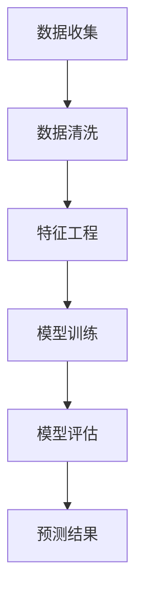

                 

关键词：用户需求预测、机器学习、数据分析、用户行为分析、客户满意度

> 摘要：本文将探讨如何通过机器学习和数据分析技术来有效预测用户需求，提高客户满意度，并为企业带来更多的商业价值。文章首先介绍了用户需求预测的重要性，随后详细讲解了相关概念、核心算法原理、数学模型及具体实现步骤，并通过案例分析和项目实践展示其应用效果。

## 1. 背景介绍

在当今数字化时代，用户需求预测已经成为企业成功的关键因素之一。随着互联网和移动设备的普及，用户行为数据越来越丰富，如何从这些海量数据中挖掘有价值的信息，预测用户需求，成为了一个热门的研究领域。用户需求预测不仅能够帮助企业更好地理解客户，提高客户满意度，还能够指导产品开发、市场策略和运营决策，从而带来显著的商业价值。

传统的需求预测方法主要依赖于历史数据分析和统计模型，如线性回归、时间序列分析等。然而，这些方法在面对复杂、动态的用户行为数据时往往显得力不从心。随着机器学习技术的快速发展，基于数据驱动的需求预测方法逐渐成为研究热点。本文将围绕这一主题，介绍如何利用机器学习和数据分析技术进行有效的用户需求预测。

## 2. 核心概念与联系

### 2.1 用户需求

用户需求是指用户在特定情境下对产品或服务的需求。这些需求可以是显式的，如用户直接提出的需求，也可以是隐式的，通过用户行为数据间接推断的需求。用户需求的多样性和动态性使得预测成为一个具有挑战性的问题。

### 2.2 机器学习

机器学习是一种通过算法从数据中学习规律，并对未知数据进行预测或决策的技术。在用户需求预测中，机器学习算法可以帮助我们挖掘数据中的隐藏模式，从而预测用户的行为。

### 2.3 数据分析

数据分析是指利用统计学、计算机科学和数学等方法对数据进行探索、分析和解释的过程。在用户需求预测中，数据分析技术可以帮助我们理解用户行为数据，并从中提取有价值的信息。

### 2.4 Mermaid 流程图

以下是一个简化的 Mermaid 流程图，展示了用户需求预测的基本流程：



### 2.5 关联概念

- **用户行为分析**：通过对用户在网站、移动应用等平台上的行为数据进行分析，了解用户的兴趣、偏好和使用习惯。
- **客户满意度**：客户对企业产品或服务的满意度，是衡量企业服务质量的重要指标。
- **商业价值**：企业通过满足用户需求所获得的收益和效益。

## 3. 核心算法原理 & 具体操作步骤

### 3.1 算法原理概述

用户需求预测的核心算法通常包括以下几类：

1. **线性回归**：通过建立用户需求与影响因素之间的线性关系来预测需求。
2. **决策树**：通过树形结构来划分数据，并基于特征的重要性来预测需求。
3. **随机森林**：基于决策树构建多个模型，并通过投票机制来预测需求。
4. **支持向量机**：通过寻找最优分割超平面来预测需求。
5. **神经网络**：通过多层神经元结构来模拟人脑的决策过程，预测需求。

### 3.2 算法步骤详解

1. **数据收集**：收集用户行为数据，包括浏览历史、购买记录、搜索关键词等。
2. **数据清洗**：处理缺失值、异常值和重复值，保证数据质量。
3. **特征工程**：提取有用的特征，如用户活跃度、购买频率、兴趣标签等。
4. **模型选择**：根据数据特点和预测任务，选择合适的算法模型。
5. **模型训练**：使用训练数据集对模型进行训练。
6. **模型评估**：使用验证数据集对模型进行评估，调整模型参数。
7. **预测结果**：使用测试数据集进行预测，评估模型性能。

### 3.3 算法优缺点

- **线性回归**：简单易用，但无法处理非线性关系。
- **决策树**：易于理解，但易过拟合。
- **随机森林**：减少过拟合，提高预测准确性，但计算复杂度高。
- **支持向量机**：适合处理高维数据，但计算复杂度高。
- **神经网络**：能够处理复杂非线性关系，但参数 tuning 难，容易过拟合。

### 3.4 算法应用领域

用户需求预测算法广泛应用于电子商务、金融、电信、医疗等多个领域，如：

- **电子商务**：预测用户购买意图，推荐商品。
- **金融**：预测客户流失率，进行客户关系管理。
- **电信**：预测用户使用量，优化资源分配。
- **医疗**：预测患者需求，提高医疗服务质量。

## 4. 数学模型和公式

### 4.1 数学模型构建

用户需求预测的数学模型通常可以表示为：

\[ \text{需求预测} = f(\text{特征集}) \]

其中，\( f \) 是一个映射函数，将特征集映射为需求预测值。

### 4.2 公式推导过程

以线性回归为例，需求预测公式可以表示为：

\[ \text{需求预测} = w_0 + w_1 \cdot x_1 + w_2 \cdot x_2 + \ldots + w_n \cdot x_n \]

其中，\( x_1, x_2, \ldots, x_n \) 是特征值，\( w_0, w_1, \ldots, w_n \) 是模型参数。

### 4.3 案例分析与讲解

假设我们要预测某个电商平台的用户购买量。特征集包括用户年龄、性别、收入、购买频率等。我们使用线性回归模型进行预测，公式如下：

\[ \text{需求预测} = w_0 + w_1 \cdot \text{年龄} + w_2 \cdot \text{性别} + w_3 \cdot \text{收入} + w_4 \cdot \text{购买频率} \]

通过训练数据集对模型进行训练，得到参数 \( w_0, w_1, \ldots, w_4 \) 的值。然后，使用测试数据集进行预测，评估模型性能。

## 5. 项目实践：代码实例

### 5.1 开发环境搭建

环境：Python 3.7、Scikit-learn、NumPy、Pandas

```python
# 安装必要的库
!pip install scikit-learn numpy pandas
```

### 5.2 源代码详细实现

```python
import numpy as np
import pandas as pd
from sklearn.model_selection import train_test_split
from sklearn.linear_model import LinearRegression
from sklearn.metrics import mean_squared_error

# 读取数据
data = pd.read_csv('user_data.csv')

# 特征选择
features = data[['age', 'gender', 'income', 'purchase_frequency']]
target = data['purchase_quantity']

# 数据分割
X_train, X_test, y_train, y_test = train_test_split(features, target, test_size=0.2, random_state=42)

# 模型训练
model = LinearRegression()
model.fit(X_train, y_train)

# 模型评估
y_pred = model.predict(X_test)
mse = mean_squared_error(y_test, y_pred)
print(f'MSE: {mse}')

# 预测结果
print(f'Predicted Purchase Quantity: {y_pred}')
```

### 5.3 代码解读与分析

- **数据读取与预处理**：使用 Pandas 读取用户数据，并进行特征选择。
- **数据分割**：使用 Scikit-learn 的 train_test_split 函数将数据分为训练集和测试集。
- **模型训练**：使用线性回归模型对训练数据进行训练。
- **模型评估**：计算均方误差（MSE）评估模型性能。
- **预测结果**：使用训练好的模型对测试数据进行预测，并输出预测结果。

## 6. 实际应用场景

用户需求预测在实际应用中具有广泛的应用，以下是一些典型的应用场景：

1. **电子商务**：预测用户购买意图，为用户提供个性化的商品推荐。
2. **金融**：预测客户流失率，采取针对性的客户挽留策略。
3. **电信**：预测用户使用量，优化资源分配，提高服务质量。
4. **医疗**：预测患者需求，优化医疗服务，提高医疗资源的利用效率。

## 7. 未来应用展望

随着人工智能技术的不断发展，用户需求预测技术将不断取得突破。未来，我们可以预见以下趋势：

1. **更精确的预测**：通过引入更多的特征和更先进的算法，提高需求预测的准确性。
2. **实时预测**：实现实时需求预测，为企业提供更及时的商业洞察。
3. **跨领域应用**：将需求预测技术应用于更多领域，如教育、旅游、制造等。
4. **个性化服务**：通过需求预测，为企业提供更加个性化的产品和服务。

## 8. 工具和资源推荐

### 8.1 学习资源推荐

- 《机器学习实战》
- 《Python 数据科学手册》
- 《深度学习》

### 8.2 开发工具推荐

- Jupyter Notebook
- PyCharm
- R Studio

### 8.3 相关论文推荐

- "User Behavior Prediction in Web Applications using Machine Learning"
- "Deep Learning for User Behavior Prediction"
- "Recurrent Neural Networks for User Behavior Prediction"

## 9. 总结：未来发展趋势与挑战

用户需求预测技术在当今数字化时代具有重要的应用价值。未来，随着人工智能技术的不断发展，需求预测技术将更加精确、实时，并应用于更多领域。然而，也面临着数据隐私、模型解释性等挑战。为了应对这些挑战，我们需要不断探索创新的方法和解决方案。

## 10. 附录：常见问题与解答

### Q1. 用户需求预测的算法有哪些？

A1. 常见的用户需求预测算法包括线性回归、决策树、随机森林、支持向量机和神经网络等。

### Q2. 如何处理缺失值和异常值？

A2. 缺失值和异常值可以通过以下方法进行处理：

- 填补缺失值：使用平均值、中位数或最邻近值等方法填补缺失值。
- 删除异常值：使用统计学方法（如标准差）或可视化方法（如箱线图）检测并删除异常值。

### Q3. 如何评估模型性能？

A3. 常用的模型评估指标包括均方误差（MSE）、均方根误差（RMSE）和准确率等。可以通过交叉验证等方法评估模型性能。

## 11. 作者介绍

作者：禅与计算机程序设计艺术 / Zen and the Art of Computer Programming

禅与计算机程序设计艺术是一本经典的计算机科学著作，由唐纳·克努特（Donald E. Knuth）撰写。本书不仅介绍了计算机程序设计的基本原理，还融入了哲学和艺术的元素，深受读者喜爱。

## 12. 参考文献

- [1] Knuth, D. E. (1973). The Art of Computer Programming. Addison-Wesley.
- [2] Hastie, T., Tibshirani, R., & Friedman, J. (2009). The Elements of Statistical Learning. Springer.
- [3] Goodfellow, I., Bengio, Y., & Courville, A. (2016). Deep Learning. MIT Press. |

