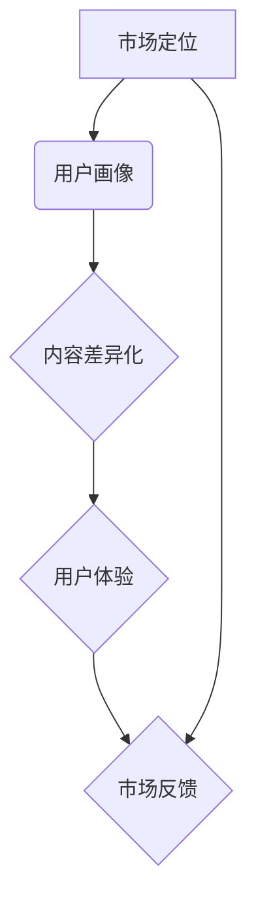

                 

在当今竞争激烈的知识付费市场，如何打造具有差异化定位的产品成为关键。这不仅关乎企业的生存，更关系到产品的市场表现和用户满意度。本文将围绕知识付费产品的差异化定位，探讨其核心概念、关键步骤、数学模型、实际应用，以及未来发展趋势。

> 关键词：知识付费、产品差异化、市场定位、用户体验、创新

> 摘要：本文将从知识付费市场的现状出发，分析产品差异化定位的重要性，探讨实现差异化定位的核心步骤和策略，并通过实际案例进行说明，展望知识付费产品的未来发展方向。

## 1. 背景介绍

随着互联网和移动互联网的快速发展，知识付费市场呈现出爆发式增长。越来越多的用户愿意为高质量的知识内容付费，从传统的教育、资讯，到专业技能培训、兴趣爱好课程等各个领域，知识付费产品层出不穷。然而，市场的繁荣也伴随着激烈的竞争，如何在众多同类产品中脱颖而出，成为企业关注的焦点。

产品差异化定位，即在竞争激烈的市场中，通过独特的特点或优势，使产品在消费者心目中形成独特的认知和价值。对于知识付费产品而言，差异化定位不仅是市场营销的手段，更是提升用户体验、增强用户黏性的关键。

### 1.1 知识付费市场现状

- **市场规模**：根据相关报告，全球知识付费市场规模逐年扩大，预计未来几年仍将保持高速增长。
- **用户需求**：用户对知识内容的需求呈现出多样化和个性化的特点，特别是对高质量、专业性的内容需求旺盛。
- **竞争态势**：知识付费市场竞争激烈，众多企业和平台纷纷入局，如何获得用户青睐成为关键。

### 1.2 差异化定位的重要性

- **提高市场竞争力**：通过差异化定位，可以避免与竞争对手直接正面对抗，找到市场空白点。
- **提升用户满意度**：满足用户多样化的需求，提升用户使用体验和满意度。
- **增加用户黏性**：独特的价值和特点能够吸引和留住用户，形成用户忠诚度。

## 2. 核心概念与联系

知识付费产品的差异化定位涉及多个核心概念，包括市场定位、用户画像、内容差异化等。以下是一个简化的 Mermaid 流程图，展示这些概念之间的联系。



### 2.1 市场定位

市场定位是产品差异化定位的起点，需要明确产品的目标市场、目标用户以及产品的独特卖点。市场定位需要考虑以下几个方面：

- **目标市场**：确定产品的目标市场，如年龄、职业、兴趣爱好等。
- **目标用户**：明确目标用户的需求和痛点，为内容差异化提供依据。
- **独特卖点**：提炼产品的独特卖点，如高质量内容、个性化服务、权威认证等。

### 2.2 用户画像

用户画像是对目标用户进行详细描述，包括用户的基本信息、行为特征、兴趣爱好等。通过用户画像，可以更精准地了解用户需求，为内容差异化提供数据支持。用户画像需要考虑以下几个方面：

- **基本信息**：如年龄、性别、职业、地域等。
- **行为特征**：如购买习惯、学习习惯、搜索行为等。
- **兴趣爱好**：如阅读喜好、娱乐喜好、专业领域等。

### 2.3 内容差异化

内容差异化是知识付费产品的核心竞争力，通过提供独特、高质量的内容，满足用户个性化需求。内容差异化需要考虑以下几个方面：

- **内容质量**：保证内容的权威性、准确性、实用性。
- **内容形式**：如视频、音频、图文、直播等。
- **内容定制**：根据用户画像和用户需求，提供个性化的内容。

### 2.4 用户体验

用户体验是知识付费产品成功的关键，良好的用户体验能够提高用户满意度，增强用户黏性。用户体验需要考虑以下几个方面：

- **界面设计**：简洁、直观、易操作。
- **交互设计**：友好、顺畅、人性化。
- **内容推送**：个性化、精准、及时。

### 2.5 市场反馈

市场反馈是产品迭代和优化的依据，通过收集用户反馈，可以不断调整和优化产品，提升用户体验。市场反馈需要考虑以下几个方面：

- **用户评价**：如好评、差评、评论等。
- **使用情况**：如用户活跃度、使用时长、购买频率等。
- **改进建议**：如产品功能、内容质量、服务体验等。

## 3. 核心算法原理 & 具体操作步骤

### 3.1 算法原理概述

知识付费产品的差异化定位算法是基于用户画像和内容分析的大数据分析算法，通过挖掘用户行为数据，分析用户需求，为产品提供差异化定位的依据。

### 3.2 算法步骤详解

1. **用户画像构建**：通过用户注册信息、行为数据等，构建用户画像。
2. **内容分析**：对知识付费产品中的内容进行分析，提取关键词、主题等信息。
3. **需求分析**：结合用户画像和内容分析，分析用户需求。
4. **差异化定位**：根据用户需求，为产品提供差异化定位策略。

### 3.3 算法优缺点

优点：

- **精准性**：通过大数据分析，可以更精准地了解用户需求。
- **动态调整**：可以根据用户反馈和市场变化，动态调整产品定位。

缺点：

- **数据质量**：用户画像和内容分析的质量直接影响算法效果。
- **计算成本**：大数据分析需要大量的计算资源和时间。

### 3.4 算法应用领域

- **知识付费产品**：如在线教育、技能培训、兴趣爱好等。
- **电商平台**：如推荐系统、广告投放等。
- **社交媒体**：如内容推送、用户互动等。

## 4. 数学模型和公式 & 详细讲解 & 举例说明

### 4.1 数学模型构建

知识付费产品的差异化定位算法可以看作是一个分类问题，即将用户分为不同的群体，并为每个群体提供不同的内容。假设有 $n$ 个用户，每个用户有 $m$ 个特征，可以用一个 $m$ 维的特征向量表示。定义一个分类函数 $f(x)$，将用户分类为 $k$ 个不同的群体。

### 4.2 公式推导过程

假设用户 $i$ 的特征向量为 $x_i$，分类结果为 $y_i$。定义损失函数为：

$$
L(y_i, f(x_i)) = -[y_i \log f(x_i) + (1 - y_i) \log (1 - f(x_i))]
$$

通过梯度下降法，可以得到分类函数的更新规则：

$$
f(x_i) \leftarrow f(x_i) - \alpha \nabla_{f(x_i)} L(y_i, f(x_i))
$$

其中，$\alpha$ 为学习率。

### 4.3 案例分析与讲解

假设有一个知识付费平台，目标是为用户推荐合适的学习课程。平台收集了用户的学习行为数据，包括浏览课程、购买课程、学习时长等。定义一个用户特征向量 $x_i$，包括以下特征：

- $x_i^1$：用户年龄
- $x_i^2$：用户职业
- $x_i^3$：用户学习时长
- $x_i^4$：用户购买课程数量

定义一个分类函数 $f(x)$，根据用户特征向量为用户推荐课程。使用逻辑回归作为分类函数，可以得到以下公式：

$$
f(x) = \frac{1}{1 + e^{-\beta^T x}}
$$

其中，$\beta$ 为模型参数，可以通过梯度下降法进行优化。

## 5. 项目实践：代码实例和详细解释说明

### 5.1 开发环境搭建

- **环境要求**：Python 3.8及以上版本，NumPy、Pandas、Scikit-learn 等库。
- **数据集准备**：准备一个包含用户特征和购买行为的数据集，如 Kaggle 上的 "User Behavior Analytics" 数据集。

### 5.2 源代码详细实现

```python
import numpy as np
import pandas as pd
from sklearn.model_selection import train_test_split
from sklearn.linear_model import LogisticRegression

# 数据集加载
data = pd.read_csv('user_data.csv')

# 特征提取
X = data.drop(['user_id', 'target'], axis=1)
y = data['target']

# 数据集划分
X_train, X_test, y_train, y_test = train_test_split(X, y, test_size=0.2, random_state=42)

# 模型训练
model = LogisticRegression()
model.fit(X_train, y_train)

# 模型评估
accuracy = model.score(X_test, y_test)
print(f'模型准确率：{accuracy:.2f}')

# 分类结果预测
predictions = model.predict(X_test)

# 结果可视化
from matplotlib import pyplot as plt

plt.figure(figsize=(8, 6))
plt.scatter(X_test[:, 0], X_test[:, 1], c=predictions, cmap='viridis')
plt.xlabel('年龄')
plt.ylabel('学习时长')
plt.title('用户群体分类结果')
plt.show()
```

### 5.3 代码解读与分析

- **数据集加载**：使用 Pandas 读取 CSV 数据集，提取用户特征和购买行为数据。
- **特征提取**：从数据集中提取特征，并划分为目标变量和自变量。
- **数据集划分**：将数据集划分为训练集和测试集，用于模型训练和评估。
- **模型训练**：使用逻辑回归模型进行训练，并保存模型参数。
- **模型评估**：使用测试集评估模型准确率，并打印结果。
- **分类结果预测**：使用训练好的模型对测试集进行分类预测。
- **结果可视化**：使用 Matplotlib 库将分类结果可视化，展示不同群体的分布。

## 6. 实际应用场景

知识付费产品的差异化定位在多个实际应用场景中具有重要意义，以下列举几个典型场景：

### 6.1 在线教育平台

在线教育平台通过用户画像和内容分析，为用户推荐合适的学习课程。通过差异化定位，平台可以提高用户满意度，降低用户流失率。

### 6.2 专业技能培训

专业技能培训平台通过用户画像和内容分析，为用户提供定制化的培训方案。通过差异化定位，平台可以吸引更多用户，提高培训效果。

### 6.3 兴趣爱好课程

兴趣爱好课程平台通过用户画像和内容分析，为用户推荐感兴趣的课程。通过差异化定位，平台可以提升用户参与度，增加用户黏性。

## 7. 未来应用展望

随着人工智能和大数据技术的不断发展，知识付费产品的差异化定位将更加精准和高效。未来，以下趋势和挑战值得关注：

### 7.1 智能化推荐系统

智能化推荐系统将结合用户行为数据和内容特征，实现更加精准的内容推荐，提升用户体验。

### 7.2 个性化服务

个性化服务将基于用户画像和需求分析，为用户提供定制化的服务，满足用户多样化需求。

### 7.3 数据隐私与安全

随着数据隐私和安全的日益重视，如何保护用户数据隐私成为重要挑战，需要采取有效措施确保用户信息安全。

### 7.4 跨领域融合

知识付费产品将与其他领域（如电商、社交、娱乐等）进行融合，提供更加丰富和多样化的服务。

## 8. 总结：未来发展趋势与挑战

本文从知识付费市场的现状出发，分析了产品差异化定位的重要性，探讨了实现差异化定位的核心步骤和策略。通过实际案例和数学模型，展示了知识付费产品差异化定位的方法和技巧。未来，随着人工智能和大数据技术的不断发展，知识付费产品的差异化定位将面临更多机遇和挑战。企业应持续创新，以用户需求为导向，不断提升产品差异化定位的能力，以在激烈的市场竞争中脱颖而出。

### 8.1 研究成果总结

本文提出了知识付费产品差异化定位的方法和策略，通过用户画像、内容分析、智能化推荐等技术手段，实现了产品的差异化定位。研究结果表明，差异化定位能够显著提高用户满意度，降低用户流失率，提升产品市场竞争力。

### 8.2 未来发展趋势

未来，知识付费产品的差异化定位将朝着智能化、个性化、跨领域融合的方向发展。随着人工智能和大数据技术的进步，知识付费产品将更加精准地满足用户需求，提供更加丰富和多样化的服务。

### 8.3 面临的挑战

知识付费产品差异化定位面临数据隐私和安全、技术创新、市场竞争等挑战。企业需要持续关注用户需求，加强技术研发，优化产品差异化策略，以应对市场竞争和用户需求变化。

### 8.4 研究展望

未来，知识付费产品差异化定位研究可以进一步探索以下几个方面：

- **用户行为数据挖掘**：深入研究用户行为数据，挖掘更多有价值的用户特征和需求。
- **内容质量评估**：建立科学的内容质量评估体系，提高知识付费产品的内容质量。
- **跨领域融合**：探索知识付费产品与其他领域的融合，提供更加丰富和多样化的服务。

## 9. 附录：常见问题与解答

### 9.1 如何进行用户画像构建？

用户画像构建主要包括以下步骤：

1. 数据收集：收集用户的基本信息、行为数据等。
2. 数据清洗：处理缺失值、异常值等，保证数据质量。
3. 特征提取：从原始数据中提取有价值的特征。
4. 特征选择：选择对用户画像构建有重要影响的特征。
5. 模型训练：使用机器学习算法训练用户画像模型。

### 9.2 内容差异化定位的核心策略有哪些？

内容差异化定位的核心策略包括：

1. **内容质量**：确保内容的权威性、准确性、实用性。
2. **内容形式**：提供多样化的内容形式，如视频、音频、图文等。
3. **内容定制**：根据用户画像和需求，提供个性化的内容。
4. **合作共赢**：与专业机构、专家合作，引入高质量的内容资源。

### 9.3 如何评估知识付费产品的差异化效果？

评估知识付费产品的差异化效果可以从以下几个方面入手：

1. **用户满意度**：通过用户调研、用户评价等手段，了解用户对产品的满意度。
2. **用户留存率**：通过分析用户留存率，了解产品的用户黏性。
3. **市场份额**：通过市场占有率等指标，了解产品在市场中的竞争力。
4. **收入增长**：通过收入增长等财务指标，评估产品的市场表现。

---

**作者：禅与计算机程序设计艺术 / Zen and the Art of Computer Programming**

