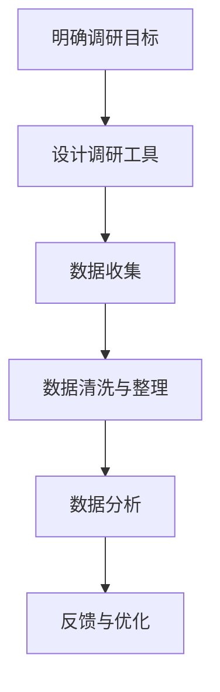

                 

关键词：知识付费、用户调研、用户反馈、数据分析、研究方法、策略优化

> 摘要：本文旨在探讨知识付费领域中的用户调研与反馈机制，通过深入分析相关研究方法、数据收集与分析策略以及具体实施步骤，为行业从业者提供一套系统化的用户调研与反馈方案，以优化知识付费产品和服务，提高用户满意度和市场竞争力。

## 1. 背景介绍

知识付费，即用户为获取专业知识和技能而支付费用的一种商业模式，已成为当今社会的重要趋势。随着互联网技术的迅猛发展，各种在线教育平台、专业培训课程以及知识共享社区层出不穷，知识付费市场也随之蓬勃发展。然而，如何在激烈的市场竞争中脱颖而出，成为用户的首选，成为知识付费从业者面临的一大挑战。

用户调研与反馈在这一过程中起到了至关重要的作用。通过系统化的用户调研，我们可以深入了解用户的需求、偏好和行为习惯，从而为产品和服务的设计提供有力的数据支持。而用户反馈则是了解用户真实体验和满意度的直接途径，有助于发现产品中的问题和不足，进而进行优化和改进。

## 2. 核心概念与联系

### 2.1 研究方法

进行用户调研与反馈，首先需要选择合适的研究方法。常见的研究方法包括问卷调查、深度访谈、用户测试和数据分析等。

- **问卷调查**：通过设计结构化的问卷，收集大量用户的数据，适用于大规模用户群体的调研。
- **深度访谈**：通过与用户进行一对一的深入交流，获取用户详细的需求和反馈，适用于小范围但深入了解的需求。
- **用户测试**：通过实际使用产品或服务，观察用户的行为和反应，以评估产品的用户体验。
- **数据分析**：通过分析用户行为数据，挖掘用户行为模式和趋势，为产品优化提供数据支持。

### 2.2 数据收集与分析策略

数据收集与分析策略是用户调研与反馈的核心。以下是一些关键步骤：

- **明确调研目标**：根据业务需求和产品目标，明确调研的具体目的和指标。
- **设计调研工具**：根据调研目标，设计合适的问卷、访谈大纲或用户测试方案。
- **数据收集**：通过在线平台、邮件邀请或线下活动等方式，收集用户数据。
- **数据清洗与整理**：对收集到的数据进行清洗、整理，确保数据的准确性和完整性。
- **数据分析**：运用统计学方法或数据分析工具，对数据进行深入分析，提取有价值的信息。

### 2.3 Mermaid 流程图

以下是用户调研与反馈的 Mermaid 流程图：



## 3. 核心算法原理 & 具体操作步骤

### 3.1 算法原理概述

用户调研与反馈的核心在于数据的收集与分析。以下是一些常用的数据分析和挖掘算法：

- **描述性统计分析**：用于描述用户数据的整体特征，如平均值、中位数、标准差等。
- **回归分析**：用于分析用户行为与特征之间的关系，预测用户行为。
- **聚类分析**：用于将用户数据划分为不同的群体，以便进行更有针对性的服务。
- **关联规则挖掘**：用于发现用户行为之间的关联性，如“购买A商品的用户通常也会购买B商品”。

### 3.2 算法步骤详解

1. **明确调研目标**：根据业务需求和产品目标，确定调研的具体指标和目标。
2. **设计调研工具**：根据调研目标，设计问卷调查、访谈大纲或用户测试方案。
3. **数据收集**：通过在线平台、邮件邀请或线下活动等方式，收集用户数据。
4. **数据清洗与整理**：对收集到的数据进行清洗、整理，确保数据的准确性和完整性。
5. **数据分析**：运用描述性统计分析、回归分析、聚类分析和关联规则挖掘等方法，对数据进行分析。
6. **反馈与优化**：根据分析结果，制定优化策略，并进行实施和验证。

### 3.3 算法优缺点

- **描述性统计分析**：优点是简单易懂，缺点是无法深入挖掘用户行为模式。
- **回归分析**：优点是能够预测用户行为，缺点是需要大量的数据和复杂的算法。
- **聚类分析**：优点是能够发现用户群体，缺点是聚类结果可能不准确。
- **关联规则挖掘**：优点是能够发现用户行为之间的关联性，缺点是规则可能过于复杂。

### 3.4 算法应用领域

用户调研与反馈算法广泛应用于知识付费、电子商务、在线教育等领域，通过分析用户数据，优化产品和服务，提高用户满意度和市场竞争力。

## 4. 数学模型和公式 & 详细讲解 & 举例说明

### 4.1 数学模型构建

用户调研与反馈中的数学模型主要包括描述性统计分析模型、回归分析模型和聚类分析模型等。

- **描述性统计分析模型**：

$$
\bar{x} = \frac{1}{n}\sum_{i=1}^{n}x_i
$$

- **回归分析模型**：

$$
y = \beta_0 + \beta_1x_1 + \beta_2x_2 + ... + \beta_nx_n
$$

- **聚类分析模型**：

$$
J(D) = \sum_{i=1}^{k}\sum_{j=1}^{n}||d_{ij} - \bar{d}_{ij}||^2
$$

### 4.2 公式推导过程

- **描述性统计分析模型**的推导过程：

$$
\bar{x} = \frac{1}{n}\sum_{i=1}^{n}x_i
$$

通过求和和除以总数，得到平均值。

- **回归分析模型**的推导过程：

$$
y = \beta_0 + \beta_1x_1 + \beta_2x_2 + ... + \beta_nx_n
$$

通过最小二乘法，求得回归系数。

- **聚类分析模型**的推导过程：

$$
J(D) = \sum_{i=1}^{k}\sum_{j=1}^{n}||d_{ij} - \bar{d}_{ij}||^2
$$

通过计算距离平方和，得到聚类指标。

### 4.3 案例分析与讲解

假设我们有一个在线教育平台，想要了解用户对课程的满意度，我们可以使用描述性统计分析模型进行调研。

1. **数据收集**：通过问卷调查，收集用户对课程满意度的评分数据。
2. **数据清洗**：对数据进行筛选和整理，确保数据的质量。
3. **描述性统计分析**：计算平均满意度、标准差等指标。

$$
\bar{满意度} = \frac{1}{n}\sum_{i=1}^{n}满意度_i
$$

通过分析结果，我们发现用户的平均满意度为4.5分，标准差为0.8分。这表明用户对课程的满意度整体较高，但存在一定的波动。

## 5. 项目实践：代码实例和详细解释说明

### 5.1 开发环境搭建

- **工具**：Python、Pandas、NumPy、Matplotlib
- **环境**：Jupyter Notebook

### 5.2 源代码详细实现

```python
import pandas as pd
import numpy as np
import matplotlib.pyplot as plt

# 数据加载
data = pd.read_csv('course_satisfaction.csv')

# 数据清洗
data.dropna(inplace=True)

# 描述性统计分析
satisfaction_mean = data['满意度'].mean()
satisfaction_std = data['满意度'].std()

# 可视化
plt.figure(figsize=(8, 6))
plt.hist(data['满意度'], bins=10, alpha=0.5)
plt.axvline(x=satisfaction_mean, color='r', linestyle='--')
plt.xlabel('满意度')
plt.ylabel('频数')
plt.title('用户满意度分布')
plt.grid(True)
plt.show()

print("平均满意度：", satisfaction_mean)
print("标准差：", satisfaction_std)
```

### 5.3 代码解读与分析

- **数据加载**：使用Pandas读取CSV文件，获取用户满意度数据。
- **数据清洗**：删除缺失值，确保数据质量。
- **描述性统计分析**：计算平均值和标准差。
- **可视化**：使用Matplotlib绘制满意度分布直方图，标注平均值。

通过代码实例，我们可以轻松实现对用户满意度数据的描述性统计分析，为产品和服务优化提供数据支持。

## 6. 实际应用场景

### 6.1 在线教育平台

在线教育平台可以通过用户调研与反馈，了解用户对课程内容、学习体验和平台服务的满意度，从而优化课程设计和平台功能，提高用户满意度和留存率。

### 6.2 专业培训课程

专业培训课程可以通过用户调研与反馈，了解用户对课程内容、授课质量和学习效果的评价，调整课程设置，提高课程质量和用户满意度。

### 6.3 知识共享社区

知识共享社区可以通过用户调研与反馈，了解用户对社区内容、互动体验和功能服务的满意度，优化社区运营策略，提高社区活跃度和用户粘性。

## 7. 未来应用展望

随着人工智能和大数据技术的发展，用户调研与反馈机制将更加智能化和高效化。未来，我们将看到更多基于大数据分析和机器学习的用户调研方法，以及更加个性化和智能化的用户服务体验。

## 8. 工具和资源推荐

### 7.1 学习资源推荐

- 《用户调研与数据分析实战》
- 《Python数据分析》
- 《机器学习实战》

### 7.2 开发工具推荐

- Jupyter Notebook
- Pandas
- Matplotlib
- Scikit-learn

### 7.3 相关论文推荐

- “User Research and Analysis for Knowledge Payment Services”
- “Data-driven Product Optimization in Online Education Platforms”
- “Machine Learning for User Behavior Prediction in Knowledge Payment Markets”

## 9. 总结：未来发展趋势与挑战

### 9.1 研究成果总结

本文通过深入分析用户调研与反馈的方法、策略和应用场景，提出了一套系统化的知识付费用户调研与反馈方案，为行业从业者提供了有益的参考。

### 9.2 未来发展趋势

随着人工智能和大数据技术的发展，用户调研与反馈将更加智能化和高效化，为知识付费行业带来新的机遇和挑战。

### 9.3 面临的挑战

在知识付费领域，用户调研与反馈面临的主要挑战包括数据质量、数据隐私和算法公正性等方面。

### 9.4 研究展望

未来，我们将进一步探索用户调研与反馈在知识付费领域的应用，推动人工智能和大数据技术在用户研究中的深度融合，为知识付费行业的发展提供强有力的支持。

## 10. 附录：常见问题与解答

### 10.1 如何保证数据质量？

- 采用随机抽样方法，确保样本具有代表性。
- 设计简明易懂的问卷，提高用户参与度。
- 数据收集过程中，及时处理缺失值和异常值。

### 10.2 用户调研与反馈的成本如何控制？

- 采用在线调查工具，降低调查成本。
- 集中精力调研核心问题，避免过多冗余问题。
- 利用自动化工具，提高数据收集和处理效率。

### 10.3 如何确保算法公正性？

- 采用透明且公开的算法，确保算法结果公正。
- 定期审查和更新算法，防止偏见和错误。
- 实施用户反馈机制，及时发现和纠正算法问题。

---

作者：禅与计算机程序设计艺术 / Zen and the Art of Computer Programming
```

