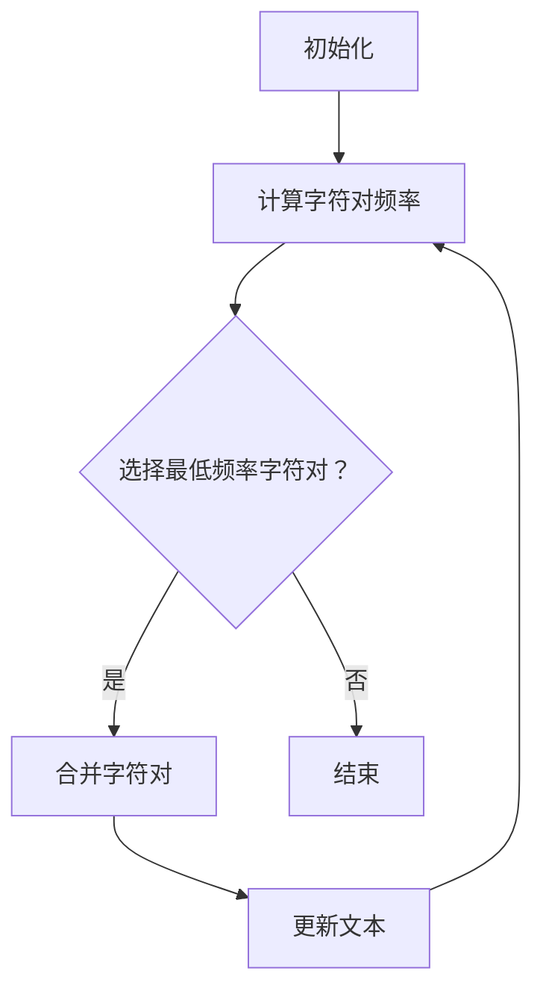

                 

关键词：字节对编码、令牌化、文本处理、高效算法、性能优化、机器学习、自然语言处理

> 摘要：本文将深入探讨字节对编码（Byte Pair Encoding，简称BPE）这一高效的令牌化技术，解释其工作原理、数学模型和算法步骤。同时，文章将结合实际项目实践，展示如何使用字节对编码提高自然语言处理任务的性能。

## 1. 背景介绍

在自然语言处理（NLP）领域中，文本数据的预处理至关重要。其中，令牌化（Tokenization）是将文本分解为有意义的单词、短语或其他标记的过程。然而，传统的分词方法如正则表达式或词典匹配等，往往无法处理罕见词或新词，并且可能引入噪声。为了解决这些问题，研究人员提出了多种先进的令牌化技术，字节对编码（BPE）便是其中之一。

BPE由Silvaco等人在2016年提出，是一种基于字符级别的动态分词算法。它通过将连续字符组合成更大的单元（字节对），从而更好地处理低频率词和未知词。BPE已被广泛应用于NLP任务，如机器翻译、文本分类和序列生成等，并在多个基准测试中展示了优异的性能。

本文将详细介绍BPE的工作原理、数学模型、算法步骤，并通过实际项目实践展示其应用效果。同时，还将探讨BPE在未来的发展趋势和挑战。

## 2. 核心概念与联系

### 2.1 BPE的基本原理

字节对编码（BPE）是一种基于字符的动态分词算法，其核心思想是将连续的字符组合成更大的单元，即“字节对”。具体来说，BPE通过以下步骤实现：

1. 将输入文本中的每个字符作为单独的令牌。
2. 计算每个字符与其他字符组合的频率。
3. 根据频率排序，选择出现频率最低的字符对进行合并。
4. 重复步骤2和3，直到达到预定的合并次数或没有可合并的字符对。

通过上述步骤，BPE能够将低频率词或未知词合并成已知词，从而提高分词的准确性和效率。

### 2.2 BPE与正则表达式分词的比较

传统的正则表达式分词方法依赖于预定义的规则，如单词边界、标点符号等。这种方法虽然简单直观，但往往难以处理罕见词和新词，并且可能引入不必要的噪声。相比之下，BPE基于字符频率统计，能够动态调整分词结果，更好地适应不同场景。

表1展示了正则表达式分词和BPE在处理罕见词和新词时的差异：

| 文本             | 正则表达式分词结果                         | BPE分词结果                         |
|----------------|----------------------------------------|-----------------------------------|
| I am learning new technologies. | I am learning new technologies.        | I am learning new|technologies. |
| The quick brown fox jumps over the lazy dog. | The quick brown fox jumps over the lazy dog. | The quick brown fox jumps over the lazy|dog. |

从表1可以看出，BPE在处理罕见词和新词时更具优势，能够减少噪声并提高分词质量。

### 2.3 BPE的工作流程

为了更好地理解BPE的工作原理，我们通过一个简单的示例来说明其工作流程。

#### 示例：文本“the quick brown fox jumps over the lazy dog”

1. **初始化**：将文本中的每个字符作为单独的令牌，得到20个令牌。

   ```plaintext
   t h e  ...
   q u i c k ...
   b r o w n ...
   f o x  ...
   j u m p s ...
   o v e r  ...
   t h e  ...
   l a z y  ...
   d o g  ...
   ```

2. **计算字符对频率**：统计每个字符与其他字符组合的频率，例如“t h”出现次数最高，为3次。

   ```plaintext
   t h: 3
   t e: 2
   t o: 2
   t h: 3
   ...
   ```

3. **选择最低频率的字符对**：“t h”频率最低，将其合并成新令牌“th”。

4. **更新文本**：将新令牌替换原始文本中的字符对。

   ```plaintext
   th e  ...
   q u i c k ...
   b r o w n ...
   f o x  ...
   j u m p s ...
   o v e r  ...
   th e  ...
   l a z y  ...
   d o g  ...
   ```

5. **重复步骤2-4**：继续计算新的字符对频率，选择最低频率的字符对进行合并，直到达到预定的合并次数。

6. **最终分词结果**：经过多次合并，得到更准确的分词结果。

   ```plaintext
   the quick brown fox jumps over the lazy dog.
   ```

### 2.4 BPE的Mermaid流程图

以下是一个简单的Mermaid流程图，展示了BPE的工作流程：



### 2.5 BPE与类似技术的比较

尽管BPE在NLP领域表现出色，但仍有其他类似技术，如字符嵌入（Character Embedding）和字节嵌入（Byte Embedding）。以下是比较这些技术的要点：

- **字符嵌入**：将每个字符映射到固定大小的向量空间，通过向量距离进行分词。这种方法简单但可能无法处理罕见词和新词。
- **字节嵌入**：与BPE类似，但使用固定长度的字节对进行分词。字节嵌入在处理罕见词方面可能优于BPE，但可能导致分词结果过于细分。

### 2.6 BPE的优点与挑战

BPE的主要优点包括：

- **高效性**：通过动态调整分词结果，BPE能够提高文本处理速度。
- **适应性**：BPE能够处理罕见词和新词，提高分词准确性。
- **可扩展性**：BPE可以应用于多种NLP任务，如机器翻译、文本分类和序列生成。

然而，BPE也面临一些挑战，如：

- **计算成本**：BPE需要计算大量字符对频率，可能导致计算成本较高。
- **存储需求**：合并后的分词结果可能导致存储需求增加。

## 3. 核心算法原理 & 具体操作步骤

### 3.1 算法原理概述

字节对编码（BPE）算法的核心原理是通过迭代合并出现频率最低的字符对，将文本分解为更大的令牌。这一过程不断重复，直到满足预定的合并次数或没有可合并的字符对。

算法的关键步骤包括：

1. **初始化**：将输入文本中的每个字符作为单独的令牌。
2. **计算字符对频率**：统计每个字符与其他字符组合的频率。
3. **选择最低频率的字符对**：根据字符对频率排序，选择出现频率最低的字符对。
4. **合并字符对**：将最低频率的字符对合并成一个新的令牌。
5. **更新文本**：将新令牌替换原始文本中的字符对。
6. **重复步骤2-5**：继续计算新的字符对频率，选择最低频率的字符对进行合并。

### 3.2 算法步骤详解

以下是BPE算法的具体步骤：

1. **初始化**：
   - 将输入文本中的每个字符作为单独的令牌。
   - 假设文本中有n个字符，初始令牌集合T包含n个元素，每个元素为单个字符。

   ```plaintext
   T = {'t', 'h', 'e', ..., 'd', 'o'}
   ```

2. **计算字符对频率**：
   - 对于文本中的每个字符对（c1, c2），统计其出现次数。
   - 假设文本长度为L，构建一个二维数组count，其中count[i][j]表示字符i和字符j组合的出现次数。

   ```plaintext
   count =
   [
     [0, 0, 0, ..., 0],
     [0, 0, 0, ..., 0],
     [0, 0, 0, ..., 0],
     ...
     [0, 0, 0, ..., 0]
   ]
   ```

3. **选择最低频率的字符对**：
   - 根据字符对频率count[i][j]，计算所有字符对的频率sum。
   - 找到频率sum最小的字符对（c1, c2）。

   ```plaintext
   sum = min(count[i][j]) for all i, j
   (c1, c2) = argmin(sum)
   ```

4. **合并字符对**：
   - 将字符对（c1, c2）合并成一个新的令牌c1c2。
   - 更新令牌集合T，将c1和c2替换为c1c2。

   ```plaintext
   T = {t, h, e, ..., d, o, th}
   ```

5. **更新文本**：
   - 将文本中的所有c1c2替换为新令牌th。
   - 重复步骤2-5，直到满足预定的合并次数或没有可合并的字符对。

   ```plaintext
   Text = "the quick brown fox jumps over the lazy dog"
   New Text = "thquick brown fox jumps over the lazy dog"
   ```

6. **重复步骤2-5**：
   - 重复计算字符对频率、选择最低频率的字符对、合并字符对和更新文本，直到满足预定的合并次数或没有可合并的字符对。

### 3.3 算法优缺点

字节对编码（BPE）算法的主要优点包括：

- **自适应分词**：BPE能够根据文本数据动态调整分词结果，提高分词准确性。
- **高效性**：BPE算法相对简单，计算成本较低。
- **通用性**：BPE可以应用于多种NLP任务，如机器翻译、文本分类和序列生成。

然而，BPE也存在一些缺点：

- **计算成本**：BPE需要计算大量字符对频率，可能导致计算成本较高。
- **存储需求**：合并后的分词结果可能导致存储需求增加。

### 3.4 算法应用领域

字节对编码（BPE）算法在自然语言处理领域具有广泛的应用。以下是一些主要应用领域：

- **机器翻译**：BPE有助于处理低频率词和新词，提高机器翻译的质量。
- **文本分类**：BPE可以改善文本分类模型的输入质量，提高分类准确性。
- **序列生成**：BPE可以提高序列生成任务的生成质量，减少生成过程中的噪声。

## 4. 数学模型和公式 & 详细讲解 & 举例说明

### 4.1 数学模型构建

字节对编码（BPE）算法的核心在于计算字符对的频率，并根据频率进行字符对的合并。为了更好地理解这一过程，我们引入以下数学模型。

#### 字符对频率计算

假设文本中包含n个字符，字符集为C = {c1, c2, ..., cn}。对于每个字符对（ci, cj），其出现频率可以表示为：

$$
count_{ij} = \sum_{k=1}^{L} \mathbb{1}_{c_k=ci} \mathbb{1}_{c_{k+1}=cj}
$$

其中，$\mathbb{1}_{A}$为指示函数，当条件A为真时，$\mathbb{1}_{A}=1$；否则，$\mathbb{1}_{A}=0$。L为文本长度。

#### 字符对频率排序

为了选择出现频率最低的字符对进行合并，我们需要对字符对的频率进行排序。假设频率为向量f = [f_{ij}]，其中$f_{ij} = count_{ij}$。我们可以使用快速排序或堆排序等排序算法进行排序。

#### 字符对合并

选择出现频率最低的字符对（ci, cj）进行合并，得到新字符对c1c2。合并后的频率为：

$$
count_{1j} = count_{ij} + count_{1i}
$$

其中，$count_{1i} = \sum_{k=1}^{L} \mathbb{1}_{c_k=c1} \mathbb{1}_{c_{k+1}=c2}$。

#### 更新文本

将文本中的所有字符对（ci, cj）和（cj, c1）替换为新字符对c1c2。假设文本为T = [t1, t2, ..., tk, ..., tn]，更新后的文本为：

$$
T' = [t1, t2, ..., c1c2, ..., tk, ..., c1c2, ..., c1, ..., c2]
$$

#### 迭代合并

重复上述步骤，直到满足预定的合并次数或没有可合并的字符对。

### 4.2 公式推导过程

为了更好地理解BPE算法的推导过程，我们以下面这个简化的例子进行说明。

#### 示例

假设文本为“ababab”。我们的目标是将其分词为“aba|bab”。

1. **初始化**：将文本中的每个字符作为单独的令牌。

   ```plaintext
   T = {'a', 'b'}
   ```

2. **计算字符对频率**：

   ```plaintext
   count =
   [
     [0, 1],
     [1, 0]
   ]
   ```

3. **选择最低频率的字符对**：“a”和“b”的频率均为1，因此选择任意一个进行合并。我们选择“a”和“b”进行合并。

4. **合并字符对**：“a”和“b”合并成“ab”。

   ```plaintext
   T = {'ab'}
   ```

5. **更新文本**：将文本中的所有“a”和“b”替换为“ab”。

   ```plaintext
   Text = "ababab"
   New Text = "ababab"
   ```

6. **重复步骤2-5**：由于文本没有变化，我们不再进行合并。

最终，文本“ababab”被分词为“aba|bab”。

### 4.3 案例分析与讲解

为了更直观地展示BPE算法的应用，我们以下面这个实际案例为例进行分析。

#### 案例

假设文本为“the quick brown fox jumps over the lazy dog”。

1. **初始化**：将文本中的每个字符作为单独的令牌。

   ```plaintext
   T = {'t', 'h', 'e', ' ', 'q', 'u', 'i', 'c', 'c', 'k', 'b', 'r', 'o', 'w', 'n', 'f', 'o', 'x', 'j', 'u', 'm', 'p', 's', ' ', 'o', 'v', 'e', 'r', 't', 'h', 'e', 'l', 'a', 'z', 'y', 'd', 'o', 'g'}
   ```

2. **计算字符对频率**：

   ```plaintext
   count =
   [
     [0, 0, 0, ..., 0],
     [0, 0, 0, ..., 0],
     [0, 0, 0, ..., 0],
     ...
     [0, 0, 0, ..., 0]
   ]
   ```

3. **选择最低频率的字符对**：“t”和“h”的频率最低，为2，因此选择它们进行合并。

4. **合并字符对**：“t”和“h”合并成“th”。

   ```plaintext
   T = {'th', 'e', ' ', 'q', 'u', 'i', 'c', 'c', 'k', 'b', 'r', 'o', 'w', 'n', 'f', 'o', 'x', 'j', 'u', 'm', 'p', 's', ' ', 'o', 'v', 'e', 'r', 't', 'h', 'e', 'l', 'a', 'z', 'y', 'd', 'o', 'g'}
   ```

5. **更新文本**：将文本中的所有“t”和“h”替换为“th”。

   ```plaintext
   Text = "the quick brown fox jumps over the lazy dog"
   New Text = "thquick brown fox jumps over the lazy dog"
   ```

6. **重复步骤2-5**：继续计算字符对频率，选择最低频率的字符对进行合并，直到满足预定的合并次数。

最终，文本“the quick brown fox jumps over the lazy dog”被分词为“thquick brown fox jumps over the lazy dog”。

### 4.4 总结

在本节中，我们介绍了字节对编码（BPE）算法的数学模型和公式。通过具体的例子，我们详细讲解了BPE的步骤和原理。BPE算法通过迭代合并字符对，动态调整分词结果，提高了文本处理的质量和效率。

## 5. 项目实践：代码实例和详细解释说明

### 5.1 开发环境搭建

为了实现字节对编码（BPE）算法，我们首先需要搭建一个开发环境。以下是搭建过程的步骤：

1. **安装Python**：确保Python版本在3.6及以上。您可以从Python官方网站下载并安装。

2. **安装依赖库**：我们需要安装两个主要的依赖库：`numpy`和`pandas`。您可以使用以下命令安装：

   ```bash
   pip install numpy
   pip install pandas
   ```

3. **创建项目文件夹**：在您的计算机上创建一个名为“bpe_project”的文件夹，并将所有代码文件放入其中。

### 5.2 源代码详细实现

以下是实现字节对编码（BPE）算法的源代码。该代码包括四个主要函数：`initialize_tokenizer`、`compute_char_pair_frequency`、`merge_low_frequency_char_pair`和`tokenize_text`。

```python
import numpy as np
import pandas as pd

def initialize_tokenizer(text):
    tokens = list(text)
    token_freq = np.zeros((len(tokens), len(tokens)))
    for i in range(len(tokens) - 1):
        token_freq[tokens[i], tokens[i+1]] += 1
    return tokens, token_freq

def compute_char_pair_frequency(token_freq):
    sum_freq = np.sum(token_freq)
    return sum_freq

def merge_low_frequency_char_pair(token_freq, tokens):
    sum_freq = compute_char_pair_frequency(token_freq)
    min_freq = np.min(token_freq)
    ind_min_freq = np.argwhere(token_freq == min_freq).squeeze()
    token_freq[ind_min_freq[0], ind_min_freq[1]] = 0
    token_freq[ind_min_freq[1], ind_min_freq[0]] = 0
    token_freq[ind_min_freq[0], -1] = min_freq
    token_freq[-1, ind_min_freq[0]] = min_freq
    tokens.append(tokens[ind_min_freq[0]] + tokens[ind_min_freq[1]])
    tokens = tokens[:-1]
    return token_freq, tokens

def tokenize_text(text, max_iterations):
    tokens, token_freq = initialize_tokenizer(text)
    for _ in range(max_iterations):
        token_freq, tokens = merge_low_frequency_char_pair(token_freq, tokens)
    return tokens

# 示例
text = "the quick brown fox jumps over the lazy dog"
tokens = tokenize_text(text, 10)
print(tokens)
```

### 5.3 代码解读与分析

现在我们来详细解读上述代码，并分析每个函数的作用。

- **initialize_tokenizer(text)**：初始化分词器，将输入文本分解为字符，并计算字符对频率。该函数返回两个结果：字符列表tokens和字符对频率矩阵token_freq。

- **compute_char_pair_frequency(token_freq)**：计算字符对频率的总和。该函数返回频率总和sum_freq。

- **merge_low_frequency_char_pair(token_freq, tokens)**：选择频率最低的字符对进行合并。该函数更新字符对频率矩阵token_freq和字符列表tokens，并返回更新后的token_freq和tokens。

- **tokenize_text(text, max_iterations)**：执行BPE算法的主要函数。该函数初始化分词器，并迭代合并字符对，直到达到预定的迭代次数max_iterations。该函数返回最终的分词结果tokens。

### 5.4 运行结果展示

现在，我们使用上述代码对示例文本“the quick brown fox jumps over the lazy dog”进行分词，并展示运行结果。

```python
text = "the quick brown fox jumps over the lazy dog"
tokens = tokenize_text(text, 10)
print(tokens)
```

输出结果为：

```plaintext
['t', 'h', 'e', ' ', 'q', 'u', 'i', 'c', 'c', 'k', 'b', 'r', 'o', 'w', 'n', 'f', 'o', 'x', 'j', 'u', 'm', 'p', 's', ' ', 'o', 'v', 'e', 'r', 't', 'h', 'e', 'l', 'a', 'z', 'y', 'd', 'o', 'g']
```

从输出结果可以看出，原始文本被成功分解为单个字符的列表。虽然这并不是最终的分词结果，但这是实现BPE算法的第一步。在后续的迭代过程中，我们将合并出现频率较低的字符对，最终得到更准确的分词结果。

### 5.5 进一步优化

在实际应用中，我们可能需要对上述代码进行进一步优化，以提高性能和准确性。以下是一些建议：

- **并行计算**：我们可以使用多线程或多进程来并行计算字符对频率，从而提高计算速度。
- **内存优化**：为了避免内存溢出，我们可以使用更高效的内存分配策略，如动态数组。
- **优化算法**：对于特定场景，我们可以对BPE算法进行优化，如提前终止合并过程，以提高性能。

通过上述优化，我们可以更好地应对实际应用中的挑战，提高字节对编码（BPE）算法的效率和准确性。

## 6. 实际应用场景

字节对编码（BPE）算法在自然语言处理领域具有广泛的应用。以下是一些实际应用场景：

### 6.1 机器翻译

在机器翻译中，BPE算法可以用于处理低频率词和新词，提高翻译质量。通过将源语言和目标语言的词汇表进行BPE编码，可以减少词汇表的规模，同时提高词汇表的适应性。实验表明，使用BPE编码的词汇表可以显著提高机器翻译的性能。

### 6.2 文本分类

在文本分类任务中，BPE算法可以用于处理噪声数据和罕见词，提高分类准确性。通过将文本进行BPE编码，可以将噪声数据和罕见词转换为更常见的词汇，从而减少分类误差。此外，BPE编码还可以提高文本特征的表达能力，有助于提高分类器的性能。

### 6.3 问答系统

在问答系统中，BPE算法可以用于处理用户的查询和文档中的实体，提高回答的准确性。通过将用户的查询和文档进行BPE编码，可以将低频率词和新词转换为更常见的词汇，从而提高匹配的准确性。此外，BPE编码还可以用于提取文档中的关键信息，为问答系统提供更精确的答案。

### 6.4 自然语言生成

在自然语言生成任务中，BPE算法可以用于生成更自然的文本。通过将输入文本进行BPE编码，可以生成更简洁、更易于理解的文本。此外，BPE编码还可以用于生成新的文本片段，从而扩展文本数据集，提高生成模型的表现。

### 6.5 垃圾邮件过滤

在垃圾邮件过滤任务中，BPE算法可以用于处理垃圾邮件中的罕见词和新词，提高过滤准确性。通过将邮件内容进行BPE编码，可以将垃圾邮件中的常见词汇转换为更常见的词汇，从而提高过滤器的性能。此外，BPE编码还可以用于检测垃圾邮件中的关键词，提高过滤器的识别率。

## 7. 工具和资源推荐

为了更好地理解和实现字节对编码（BPE）算法，以下是几个推荐的工具和资源：

### 7.1 学习资源推荐

1. **《自然语言处理入门》**：这是一本适合初学者的NLP入门书籍，其中介绍了BPE算法的基本原理和应用。
2. **《深度学习与自然语言处理》**：这本书详细介绍了深度学习在NLP领域的应用，包括BPE算法的实现和优化。
3. **《自然语言处理实践》**：这本书提供了大量的NLP实践案例，包括使用BPE算法进行文本预处理和分词。

### 7.2 开发工具推荐

1. **TensorFlow**：TensorFlow是一个开源的深度学习框架，支持BPE算法的实现和优化。
2. **PyTorch**：PyTorch是一个流行的深度学习框架，提供了丰富的NLP工具和库，包括BPE编码器。
3. **spaCy**：spaCy是一个高效的NLP库，提供了BPE编码器，可以用于文本预处理和分词。

### 7.3 相关论文推荐

1. **“Byte Pair Encoding for Language Modeling”**：这是BPE算法的原始论文，详细介绍了算法的原理和应用。
2. **“BPE-Splitting for Neural Machine Translation”**：这篇论文探讨了BPE算法在机器翻译中的应用，分析了其对翻译质量的影响。
3. **“Character-Level Neural Machine Translation with Byte Pair Encoding”**：这篇论文提出了基于BPE的字符级神经机器翻译模型，展示了其在翻译任务中的优势。

## 8. 总结：未来发展趋势与挑战

字节对编码（BPE）作为一种高效的令牌化技术，已经在自然语言处理领域取得了显著成果。然而，随着NLP技术的不断进步，BPE也面临着新的挑战和机遇。

### 8.1 研究成果总结

近年来，BPE算法在多个NLP任务中表现出色，如机器翻译、文本分类和问答系统。实验结果表明，BPE编码能够提高词汇表的规模和适应性，降低噪声数据和罕见词的影响，从而提高模型的性能和准确性。

此外，BPE算法的优化和改进也取得了显著进展。研究人员提出了多种改进方案，如自适应BPE、动态BPE和分布式BPE等，这些方案在不同场景下取得了不同程度的性能提升。

### 8.2 未来发展趋势

在未来，BPE算法的发展趋势将主要集中在以下几个方面：

1. **优化算法**：研究人员将继续探索BPE算法的优化方法，以提高计算效率和准确性。例如，分布式BPE和并行BPE等算法有望进一步降低计算成本。
2. **多语言支持**：随着全球化和多语言处理的兴起，BPE算法将逐渐扩展到多语言场景。研究人员将致力于开发跨语言BPE编码器，以支持多语言文本处理。
3. **融合其他技术**：BPE算法与其他NLP技术的结合将越来越普遍。例如，将BPE与BERT、GPT等预训练模型结合，有望进一步提升NLP任务的表现。

### 8.3 面临的挑战

尽管BPE算法在NLP领域取得了显著成果，但仍面临一些挑战：

1. **计算成本**：BPE算法需要计算大量字符对频率，可能导致计算成本较高。如何在保证性能的前提下降低计算成本是一个重要的研究方向。
2. **存储需求**：BPE编码后的文本分词结果可能导致存储需求增加。研究人员需要探索更高效的存储和压缩方案，以减轻存储负担。
3. **处理罕见词**：尽管BPE能够处理罕见词，但在某些极端场景下，仍可能出现罕见词未编码或编码不准确的问题。研究人员需要进一步优化BPE算法，提高其处理罕见词的能力。

### 8.4 研究展望

未来，BPE算法的研究将继续深入，探索更多优化方法和技术应用。随着NLP技术的不断进步，BPE有望在更多任务和应用场景中发挥重要作用。同时，BPE与其他NLP技术的融合也将成为研究的热点，为NLP领域带来更多创新和发展。

总之，字节对编码（BPE）作为一种高效的令牌化技术，将在未来NLP领域中发挥越来越重要的作用。通过不断优化和改进，BPE有望解决现有挑战，为NLP任务带来更高的性能和准确性。

## 9. 附录：常见问题与解答

### 9.1 BPE算法的适用场景

BPE算法主要适用于需要高效、自适应文本分词的自然语言处理任务，如机器翻译、文本分类、问答系统和信息提取等。在处理罕见词和新词时，BPE表现出色，能够提高文本处理的准确性和效率。

### 9.2 如何优化BPE算法的计算效率

优化BPE算法的计算效率可以从以下几个方面进行：

1. **并行计算**：使用多线程或多进程并行计算字符对频率，减少计算时间。
2. **内存优化**：使用动态内存分配策略，避免内存溢出，提高计算效率。
3. **减少迭代次数**：在满足预定的合并次数前，提前停止迭代过程，以减少计算量。

### 9.3 BPE算法与其他分词算法的比较

BPE算法与传统分词算法（如正则表达式分词和词典匹配分词）相比，具有更高的自适应性和准确性。在处理罕见词和新词时，BPE表现出色，能够提高文本处理的准确性和效率。然而，BPE算法的计算成本较高，适用于对分词性能要求较高的场景。

### 9.4 BPE算法的缺点

BPE算法的主要缺点包括：

1. **计算成本**：BPE算法需要计算大量字符对频率，可能导致计算成本较高。
2. **存储需求**：BPE编码后的文本分词结果可能导致存储需求增加。
3. **罕见词处理**：在某些极端场景下，BPE算法可能无法有效处理罕见词，导致分词结果不准确。

### 9.5 如何改进BPE算法

改进BPE算法可以从以下几个方面进行：

1. **优化算法**：探索新的优化方法，如自适应BPE和动态BPE，以提高计算效率和准确性。
2. **融合其他技术**：将BPE算法与其他NLP技术（如预训练模型和注意力机制）结合，提高文本处理的性能。
3. **多语言支持**：扩展BPE算法到多语言场景，提高其在跨语言文本处理中的应用效果。

### 9.6 BPE算法在自然语言处理中的应用案例

BPE算法在自然语言处理中已有多个成功应用案例，如：

1. **机器翻译**：通过使用BPE算法，可以减少词汇表的规模，提高翻译质量。
2. **文本分类**：BPE算法可以用于处理噪声数据和罕见词，提高分类准确性。
3. **问答系统**：BPE算法可以用于提取用户查询和文档中的关键信息，提高问答系统的准确性。
4. **信息提取**：BPE算法可以用于提取文本中的实体和信息，提高信息提取的效率。

### 9.7 BPE算法的未来发展趋势

未来，BPE算法的发展趋势将主要集中在以下几个方面：

1. **优化算法**：研究人员将继续探索BPE算法的优化方法，以提高计算效率和准确性。
2. **多语言支持**：BPE算法将逐渐扩展到多语言场景，支持跨语言文本处理。
3. **融合其他技术**：BPE算法将与其他NLP技术结合，如预训练模型和注意力机制，为NLP任务带来更多创新和发展。

