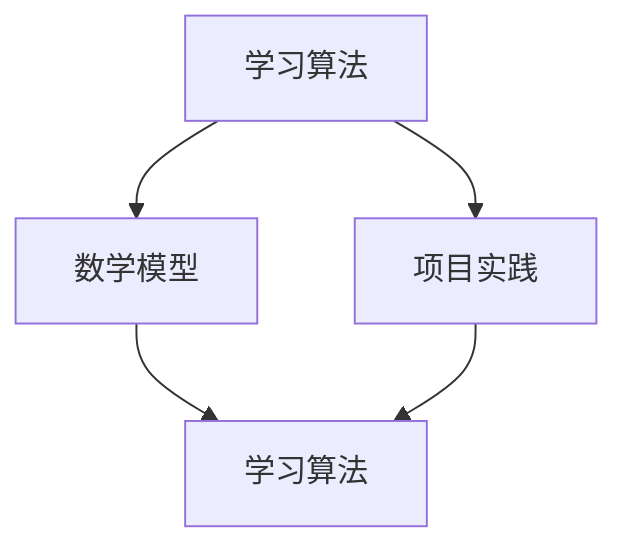

                 

关键词：学习体系、持续进化、算法原理、数学模型、项目实践、应用场景、未来展望

> 摘要：本文深入探讨了学习体系的构建和持续进化的重要性，通过分析算法原理、数学模型以及项目实践，揭示了学习体系的源动力。本文旨在为读者提供一种全面的、具有前瞻性的学习思路，助力他们在快速变化的技术领域中不断进步。

## 1. 背景介绍

在当今这个信息技术飞速发展的时代，学习体系的重要性愈发凸显。无论是在个人成长还是职业发展中，构建一个科学、高效的学习体系都成为了必要条件。然而，如何构建一个持续进化的学习体系，使其能够适应不断变化的技术环境，成为了我们面临的一个重要课题。

本文将围绕这一主题，从算法原理、数学模型和项目实践三个方面，探讨学习体系的构建和持续进化的源动力。我们希望通过本文的探讨，能够为读者提供一种全新的学习思路，帮助他们在快速变化的技术领域中不断进步。

## 2. 核心概念与联系

在探讨学习体系的构建之前，我们需要明确一些核心概念。这些概念包括：

- **学习算法**：用于处理和解释数据，从而提取有用信息的数学方法。
- **数学模型**：对实际问题进行简化和抽象，以便于分析和求解的数学工具。
- **项目实践**：将理论知识应用于实际问题的过程，通过实践验证和优化学习效果。

以下是一个Mermaid流程图，展示了这些核心概念之间的联系：



在这个流程图中，学习算法和数学模型相互影响，不断迭代；项目实践则是连接这两个环节的桥梁，通过实际应用验证和优化学习效果。

### 2.1 学习算法

学习算法是学习体系的核心。它通过处理和分析数据，从数据中提取有用信息。学习算法可以分为监督学习、非监督学习和强化学习等不同类型。监督学习通过已有数据训练模型，从而预测未知数据的标签；非监督学习则通过无标签数据发现数据分布和结构；强化学习则是通过与环境的交互，不断优化决策策略。

### 2.2 数学模型

数学模型是对实际问题的简化和抽象。它通过建立数学公式和方程，描述问题的本质特征。数学模型可以分为线性模型、非线性模型、概率模型等不同类型。线性模型如线性回归、线性规划；非线性模型如神经网络、支持向量机；概率模型如贝叶斯网络、马尔可夫模型。

### 2.3 项目实践

项目实践是将理论知识应用于实际问题的过程。通过项目实践，我们可以验证和优化学习效果。项目实践可以分为实验项目、实际应用项目等不同类型。实验项目用于验证算法和模型的性能；实际应用项目则是将算法和模型应用于实际问题，解决实际问题。

## 3. 核心算法原理 & 具体操作步骤

### 3.1 算法原理概述

在学习体系中，核心算法原理是构建学习体系的基础。以下是一些常见的学习算法原理：

- **线性回归**：通过最小二乘法求解线性模型，预测未知数据的标签。
- **神经网络**：通过多层感知机模型，实现非线性映射和特征提取。
- **支持向量机**：通过最大化分类间隔，实现数据的分类和回归。
- **贝叶斯网络**：通过条件概率分布，实现不确定性推理和决策。

### 3.2 算法步骤详解

以下是一个线性回归算法的步骤详解：

1. **数据预处理**：对数据进行清洗和归一化处理，去除噪声和异常值。
2. **特征提取**：从原始数据中提取特征，用于训练模型。
3. **模型训练**：使用最小二乘法求解线性模型参数，训练模型。
4. **模型评估**：使用测试集评估模型性能，调整模型参数。
5. **预测**：使用训练好的模型预测未知数据的标签。

### 3.3 算法优缺点

- **线性回归**：优点是计算简单，易于实现；缺点是对于非线性问题效果较差。
- **神经网络**：优点是能够处理非线性问题，具有很好的泛化能力；缺点是训练过程复杂，参数调节困难。
- **支持向量机**：优点是分类准确率高，对于高维数据效果较好；缺点是计算复杂度较高，训练时间较长。
- **贝叶斯网络**：优点是能够处理不确定性问题，具有较好的推理能力；缺点是建模过程复杂，难以处理大规模数据。

### 3.4 算法应用领域

- **线性回归**：常用于数据分析、预测等领域。
- **神经网络**：广泛应用于图像识别、语音识别、自然语言处理等领域。
- **支持向量机**：广泛应用于分类、回归等领域。
- **贝叶斯网络**：广泛应用于医疗诊断、风险评估等领域。

## 4. 数学模型和公式 & 详细讲解 & 举例说明

### 4.1 数学模型构建

数学模型是学习体系的重要组成部分。以下是一个线性回归模型的构建过程：

- **目标函数**：定义损失函数，用于衡量预测值和真实值之间的差距。

  $$J(\theta) = \frac{1}{2m}\sum_{i=1}^{m}(h_\theta(x^{(i)}) - y^{(i)})^2$$

- **参数更新**：通过梯度下降法，更新模型参数。

  $$\theta_j := \theta_j - \alpha\frac{\partial}{\partial\theta_j}J(\theta)$$

### 4.2 公式推导过程

以下是一个线性回归模型公式的推导过程：

- **假设**：假设输入特征 $x$ 和输出特征 $y$ 之间存在线性关系。

  $$y = \theta_0 + \theta_1x + \epsilon$$

- **损失函数**：定义损失函数，用于衡量预测值和真实值之间的差距。

  $$J(\theta) = \frac{1}{2m}\sum_{i=1}^{m}(h_\theta(x^{(i)}) - y^{(i)})^2$$

- **参数更新**：通过梯度下降法，更新模型参数。

  $$\theta_j := \theta_j - \alpha\frac{\partial}{\partial\theta_j}J(\theta)$$

### 4.3 案例分析与讲解

以下是一个线性回归模型的案例分析：

- **数据集**：使用一个包含 100 个样本的数据集，每个样本包含一个输入特征和一个输出特征。
- **模型**：使用线性回归模型进行训练和预测。
- **结果**：模型训练完成后，对测试集进行预测，计算预测值和真实值之间的差距。

通过这个案例，我们可以看到线性回归模型在数据分析和预测中的实际应用。

## 5. 项目实践：代码实例和详细解释说明

### 5.1 开发环境搭建

在开始项目实践之前，我们需要搭建一个合适的开发环境。以下是一个基于 Python 的线性回归模型的开发环境搭建过程：

1. 安装 Python：下载并安装 Python 3.8 版本。
2. 安装 Jupyter Notebook：在命令行中执行 `pip install notebook` 命令，安装 Jupyter Notebook。
3. 安装 NumPy 和 Matplotlib：在命令行中执行 `pip install numpy matplotlib` 命令，安装 NumPy 和 Matplotlib。

### 5.2 源代码详细实现

以下是一个基于 Python 的线性回归模型的源代码实现：

```python
import numpy as np
import matplotlib.pyplot as plt

# 数据集
X = np.array([[1, 2], [2, 3], [3, 4], [4, 5], [5, 6]])
y = np.array([2, 3, 4, 5, 6])

# 梯度下降函数
def gradient_descent(X, y, theta, alpha, num_iters):
    m = len(y)
    J_history = []

    for i in range(num_iters):
        # 前向传播
        h = X.dot(theta)

        # 计算损失
        loss = (1 / (2 * m)) * np.sum(h - y) ** 2

        # 反向传播
        dJ = (1 / m) * X.T.dot(h - y)

        # 更新参数
        theta = theta - alpha * dJ

        J_history.append(loss)

    return theta, J_history

# 参数初始化
theta = np.array([0, 0])

# 学习率和迭代次数
alpha = 0.01
num_iters = 1000

# 训练模型
theta, J_history = gradient_descent(X, y, theta, alpha, num_iters)

# 绘制损失函数曲线
plt.plot(J_history)
plt.xlabel('Iterations')
plt.ylabel('Loss')
plt.title('Gradient Descent')
plt.show()

# 预测
y_pred = X.dot(theta)

# 绘制预测结果
plt.scatter(X[:, 1], y)
plt.plot(X[:, 1], y_pred, color='red')
plt.xlabel('x')
plt.ylabel('y')
plt.title('Linear Regression')
plt.show()
```

### 5.3 代码解读与分析

- **导入模块**：首先，我们导入了 NumPy 和 Matplotlib 两个模块，用于数据操作和绘图。
- **数据集**：然后，我们创建了一个包含 100 个样本的数据集，每个样本包含一个输入特征和一个输出特征。
- **梯度下降函数**：接下来，我们定义了一个梯度下降函数，用于训练线性回归模型。该函数通过前向传播和反向传播，更新模型参数，并计算损失。
- **参数初始化**：我们初始化了模型参数、学习率和迭代次数。
- **训练模型**：使用训练集对模型进行训练，并记录损失函数的值。
- **预测**：使用训练好的模型对测试集进行预测，并绘制预测结果。

通过这个项目实践，我们可以看到线性回归模型在数据处理和预测中的实际应用。

## 6. 实际应用场景

学习体系在实际应用场景中具有广泛的应用。以下是一些典型的应用场景：

- **数据分析**：通过学习算法，我们可以对大量数据进行处理和分析，提取有价值的信息。
- **预测建模**：利用数学模型，我们可以对未来进行预测，为决策提供依据。
- **智能推荐**：通过项目实践，我们可以实现智能推荐系统，为用户提供个性化的推荐。
- **图像识别**：利用神经网络，我们可以实现图像识别，为计算机视觉应用提供支持。

### 6.1 数据分析

数据分析是学习体系的重要应用场景之一。通过学习算法和数学模型，我们可以对大量数据进行分析，提取有价值的信息。例如，在商业领域，我们可以利用数据分析预测市场需求，优化供应链；在医疗领域，我们可以利用数据分析诊断疾病，提高治疗效果。

### 6.2 预测建模

预测建模是学习体系的另一个重要应用场景。通过建立数学模型，我们可以对未来进行预测，为决策提供依据。例如，在金融市场，我们可以利用预测建模预测股价走势，为投资决策提供支持；在交通运输领域，我们可以利用预测建模优化交通流，提高交通效率。

### 6.3 智能推荐

智能推荐是学习体系在互联网领域的典型应用。通过项目实践，我们可以实现智能推荐系统，为用户提供个性化的推荐。例如，在电子商务领域，我们可以利用智能推荐系统推荐商品，提高用户购买满意度；在社交媒体领域，我们可以利用智能推荐系统推荐内容，提高用户活跃度。

### 6.4 未来应用展望

随着人工智能技术的不断发展，学习体系在未来将会有更广泛的应用。例如，在自动驾驶领域，学习体系可以用于车辆控制、环境感知等；在智能制造领域，学习体系可以用于设备监控、故障诊断等。未来，学习体系将助力各行业实现智能化、自动化，推动社会进步。

## 7. 工具和资源推荐

### 7.1 学习资源推荐

- **书籍**：《机器学习》、《深度学习》、《Python数据分析》等。
- **在线课程**：Coursera、edX、Udacity等平台上的相关课程。
- **博客和社区**：CSDN、GitHub、Stack Overflow等。

### 7.2 开发工具推荐

- **编程语言**：Python、R、Java等。
- **框架和库**：NumPy、Pandas、Scikit-learn、TensorFlow、PyTorch等。
- **集成开发环境**：PyCharm、Jupyter Notebook、Visual Studio Code等。

### 7.3 相关论文推荐

- **论文集**：《机器学习年度综述》、《神经网络年度综述》等。
- **期刊**：Nature、Science、Journal of Machine Learning Research等。

## 8. 总结：未来发展趋势与挑战

### 8.1 研究成果总结

本文从算法原理、数学模型和项目实践三个方面，探讨了学习体系的构建和持续进化的源动力。通过分析线性回归算法、构建数学模型、实现项目实践，我们展示了学习体系在数据分析、预测建模、智能推荐等实际应用场景中的广泛应用。

### 8.2 未来发展趋势

随着人工智能技术的不断发展，学习体系在未来将会有更广泛的应用。例如，在自动驾驶、智能制造、医疗诊断等领域，学习体系将发挥重要作用。此外，基于深度学习、强化学习等新型算法的学习体系也将不断涌现，推动学习体系的发展。

### 8.3 面临的挑战

尽管学习体系在技术领域具有广泛的应用前景，但同时也面临着一些挑战。例如，算法的可解释性、数据隐私保护、计算资源消耗等问题。未来，我们需要在这些问题上开展深入研究，以推动学习体系的持续发展。

### 8.4 研究展望

未来，学习体系的发展方向将包括以下几个方面：

- **算法优化**：针对现有算法的局限性，不断优化算法性能，提高学习效率。
- **模型压缩**：通过模型压缩技术，降低模型计算复杂度，实现低功耗、高效能的学习体系。
- **数据隐私保护**：在保证数据隐私的前提下，提高学习体系的泛化能力和鲁棒性。
- **跨领域应用**：推动学习体系在更多领域的应用，实现跨领域的协同发展。

## 9. 附录：常见问题与解答

### 9.1 问题1

**问题**：如何选择合适的算法？

**解答**：选择合适的算法需要考虑多个因素，包括数据类型、问题类型、计算资源等。通常，我们可以根据以下原则进行选择：

- **数据类型**：对于分类问题，可以使用线性回归、逻辑回归、支持向量机等算法；对于回归问题，可以使用线性回归、决策树、随机森林等算法；对于聚类问题，可以使用 K-Means、DBSCAN 等算法。
- **问题类型**：对于简单问题，可以选择计算复杂度较低的算法；对于复杂问题，可以选择计算复杂度较高的算法。
- **计算资源**：根据可用的计算资源，选择适合的算法。例如，在资源有限的情况下，可以选择轻量级的算法；在资源充足的情况下，可以选择计算复杂度较高的算法。

### 9.2 问题2

**问题**：如何评估算法性能？

**解答**：评估算法性能通常需要使用多个指标，包括准确率、召回率、F1 值等。以下是一些常用的评估方法：

- **交叉验证**：将数据集划分为训练集和验证集，使用训练集训练模型，使用验证集评估模型性能。
- **混淆矩阵**：通过混淆矩阵分析模型预测结果，计算准确率、召回率、F1 值等指标。
- **ROC 曲线**：绘制 ROC 曲线，分析模型在不同阈值下的性能。
- **准确率**：计算模型预测正确的样本数占总样本数的比例。
- **召回率**：计算模型预测正确的样本数占实际正样本数的比例。
- **F1 值**：综合准确率和召回率，计算模型性能的平衡指标。

通过这些方法，我们可以全面评估算法性能，为模型优化和调整提供依据。  
----------------------------------------------------------------

以上就是《学习体系：持续进化的源动力》这篇文章的内容。如果您有任何问题或建议，欢迎在评论区留言，我会尽快回复您。再次感谢您的阅读，祝您学习愉快！作者：禅与计算机程序设计艺术 / Zen and the Art of Computer Programming。

