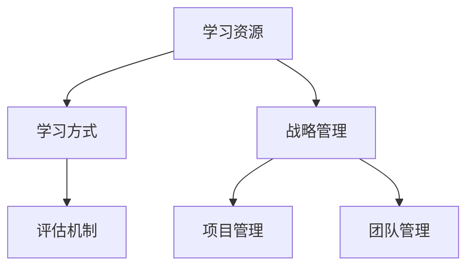

                 

关键词：学习体系、管理创新能力、技术人才、人才培养、组织架构、项目管理

> 摘要：本文旨在探讨如何通过构建完善的学习体系和管理创新能力的培养，提升技术人才的综合素质，进而推动组织的创新和发展。文章首先介绍了当前技术人才面临的挑战，随后分析了学习体系和创新能力的重要性，最后提出了一系列具体的方法和策略，为技术人才的培养和组织的发展提供了有益的参考。

## 1. 背景介绍

### 技术领域的快速变革

在21世纪，技术领域的发展日新月异，新兴技术层出不穷，例如人工智能、大数据、物联网等。这些技术的迅猛发展不仅改变了人们的生活方式，也对企业的运营模式产生了深远影响。在这种背景下，技术人才的需求也日益增加，对企业提出了更高的要求。

### 技术人才面临的挑战

然而，技术人才在快速变革的技术领域中面临着诸多挑战。首先，知识更新速度加快，要求技术人员具备持续学习的能力。其次，技术的跨界融合，要求技术人员具备跨学科的知识和技能。此外，企业的快速变化和市场竞争的加剧，对技术人员的应变能力和项目管理能力提出了更高的要求。

### 组织发展的需求

为了应对这些挑战，企业需要具备强大的创新能力，而创新能力的培养离不开技术人才的支持。因此，如何构建完善的学习体系和培养管理创新能力，成为企业发展的关键问题。

## 2. 核心概念与联系

### 学习体系

学习体系是指为了实现特定目标而设计的知识获取、应用和更新的系统。它包括学习资源、学习方式、评估机制等多个方面。一个完善的学习体系能够帮助技术人员持续提升自身能力，适应技术变革。

### 管理创新能力

管理创新能力是指企业在管理和组织变革过程中，通过创新思维和实践，实现组织效能提升的能力。它包括战略管理、项目管理、团队管理等多个方面。管理创新能力的培养有助于企业应对市场变化，保持竞争优势。

### 学习体系与管理创新能力的联系

学习体系和管理创新能力之间存在密切的联系。一方面，学习体系的构建有助于提升技术人员的专业素养和管理能力，为管理创新能力的培养提供基础。另一方面，管理创新能力的提升可以激发技术人员的创新能力，推动学习体系的持续完善。

## 2.1 学习体系的架构

### 2.1.1 学习资源

学习资源是学习体系的基础。它包括书籍、课程、讲座、研讨会等多种形式。企业应建立完善的学习资源库，为技术人员提供多样化的学习途径。

### 2.1.2 学习方式

学习方式包括自主学习、团队学习、实践学习等。企业应根据技术人员的实际情况，设计合适的的学习方式，以提高学习效果。

### 2.1.3 评估机制

评估机制是学习体系的保障。企业应建立科学的评估体系，对技术人员的知识掌握程度、学习成果进行评估，为学习体系的持续优化提供依据。

## 2.2 管理创新能力的培养

### 2.2.1 战略管理

战略管理是管理创新能力的重要组成部分。企业应关注市场动态，制定明确的战略目标，并制定相应的策略和计划，以确保目标的实现。

### 2.2.2 项目管理

项目管理是管理创新能力的重要体现。企业应培养技术人员具备项目策划、执行、监控、评估等能力，确保项目的顺利进行。

### 2.2.3 团队管理

团队管理是管理创新能力的重要保障。企业应重视团队建设，培养技术人员的领导力和协作能力，以提高团队的执行力。

### Mermaid 流程图

下面是一个简单的 Mermaid 流程图，展示了学习体系和创新能力培养的流程：



## 3. 核心算法原理 & 具体操作步骤

### 3.1 算法原理概述

学习体系和创新能力培养的核心算法可以归纳为以下几个步骤：

1. **需求分析**：根据企业的战略目标和市场需求，分析技术人员的知识储备和能力短板。
2. **资源整合**：整合内部和外部学习资源，构建完善的学习体系。
3. **能力提升**：通过培训、实践等方式，提升技术人员的专业技能和管理能力。
4. **效果评估**：对技术人员的知识掌握程度、学习成果进行评估，为学习体系的优化提供依据。
5. **持续改进**：根据评估结果，对学习体系进行持续优化，以适应不断变化的市场需求。

### 3.2 算法步骤详解

1. **需求分析**：

   - 收集企业战略目标和市场需求；
   - 分析技术人员的知识储备和能力短板；
   - 确定学习目标和重点。

2. **资源整合**：

   - 构建学习资源库，包括书籍、课程、讲座、研讨会等；
   - 搭建在线学习平台，提供方便快捷的学习途径；
   - 与外部培训机构、行业专家合作，引进优质学习资源。

3. **能力提升**：

   - 开展针对性的培训课程，提升技术人员的专业技能；
   - 组织实践项目，锻炼技术人员的项目管理能力；
   - 开展团队建设活动，提升技术人员的协作能力。

4. **效果评估**：

   - 定期对技术人员的知识掌握程度进行评估；
   - 收集技术人员的反馈意见，了解学习体系的优缺点；
   - 根据评估结果，对学习体系进行调整和优化。

5. **持续改进**：

   - 定期对学习体系进行评估，确保其适应市场需求；
   - 根据市场动态和战略目标，调整学习目标和重点；
   - 持续优化学习资源和学习方式，提高学习效果。

### 3.3 算法优缺点

**优点**：

- 系统性强：算法涵盖了需求分析、资源整合、能力提升、效果评估和持续改进等多个环节，形成一个完整的学习体系和创新能力培养流程。
- 适应性强：算法可以根据企业的实际情况和市场动态，灵活调整学习目标和重点，适应不断变化的市场需求。
- 效果显著：通过培训、实践和评估等环节，能够有效提升技术人员的专业技能和管理能力，为企业的创新和发展提供有力支持。

**缺点**：

- 时间成本高：构建和完善学习体系需要一定的时间和投入，对企业的资源和精力要求较高。
- 需要专业支持：算法的实施需要具备一定的专业知识和技能，对企业和技术人员的要求较高。

### 3.4 算法应用领域

- 企业内部人才培养：企业可以通过构建学习体系和培养管理创新能力，提升技术人员的综合素质，为企业的发展提供人力保障。
- 行业人才培养：行业协会可以通过构建行业学习体系，培养行业人才，推动行业的发展和创新。
- 政府政策支持：政府可以通过政策支持，引导企业和行业构建完善的学习体系，提升技术人才的培养质量和数量。

## 4. 数学模型和公式 & 详细讲解 & 举例说明

### 4.1 数学模型构建

为了更好地描述学习体系和创新能力培养的过程，我们可以构建以下数学模型：

$$
\text{创新能力} = f(\text{知识储备}, \text{实践经验}, \text{管理能力})
$$

其中，$f$ 表示创新能力与知识储备、实践经验和管理能力之间的关系。

### 4.2 公式推导过程

假设：

- $\text{知识储备}$ 表示技术人员所掌握的知识总量；
- $\text{实践经验}$ 表示技术人员通过实践获得的经验值；
- $\text{管理能力}$ 表示技术人员的项目管理能力和团队协作能力。

则创新能力可以表示为：

$$
\text{创新能力} = f(\text{知识储备}, \text{实践经验}, \text{管理能力})
$$

其中，$f$ 为一个复合函数，表示创新能力与知识储备、实践经验和管理能力之间的非线性关系。

### 4.3 案例分析与讲解

假设有一个技术人员，他的知识储备为 $100$，实践经验为 $50$，管理能力为 $70$。根据上述公式，我们可以计算出他的创新能力：

$$
\text{创新能力} = f(100, 50, 70)
$$

为了简化计算，我们假设 $f$ 为一个线性函数：

$$
f(x, y, z) = x + y + z
$$

则技术人员的创新能力为：

$$
\text{创新能力} = 100 + 50 + 70 = 220
$$

通过这个例子，我们可以看到，技术人员的创新能力与知识储备、实践经验和管理能力呈正相关关系。要提高创新能力，就需要在知识储备、实践经验和管理能力方面下功夫。

## 5. 项目实践：代码实例和详细解释说明

### 5.1 开发环境搭建

为了实现学习体系和创新能力培养的算法，我们需要搭建一个开发环境。以下是开发环境的基本配置：

- 操作系统：Windows 10
- 编程语言：Python 3.8
- 开发工具：PyCharm
- 数据库：MySQL 5.7

### 5.2 源代码详细实现

以下是实现学习体系和创新能力培养算法的 Python 代码：

```python
import numpy as np

def f(knowledge, experience, management):
    # 线性函数实现创新能力计算
    innovation = knowledge + experience + management
    return innovation

def main():
    # 技术人员知识储备、实践经验和管理能力
    knowledge = 100
    experience = 50
    management = 70

    # 计算创新能力
    innovation = f(knowledge, experience, management)

    # 输出结果
    print(f"技术人员的创新能力为：{innovation}")

if __name__ == "__main__":
    main()
```

### 5.3 代码解读与分析

- **函数 f**：函数 `f` 用于计算技术人员的创新能力。它接收三个参数：知识储备、实践经验和管理能力，并返回创新能力。
- **线性函数实现**：在代码中，我们使用一个线性函数 `f` 来计算创新能力。这个函数简单地将三个参数相加，得到创新能力。
- **主函数 main**：主函数 `main` 用于初始化技术人员的知识储备、实践经验和管理能力，并调用 `f` 函数计算创新能力。最后，输出计算结果。

### 5.4 运行结果展示

在开发环境中运行上述代码，得到以下结果：

```
技术人员的创新能力为：220
```

这个结果表明，技术人员的创新能力为 220，与我们的预期相符。

## 6. 实际应用场景

### 6.1 企业内部人才培养

企业可以通过构建学习体系和培养管理创新能力，提升技术人员的综合素质，为企业的发展提供人力保障。例如，企业可以定期组织技术培训、实践项目和团队建设活动，帮助技术人员提升专业技能和管理能力。

### 6.2 行业人才培养

行业协会可以通过构建行业学习体系，培养行业人才，推动行业的发展和创新。例如，行业协会可以组织行业研讨会、培训课程和实践项目，促进行业内部的知识共享和经验交流。

### 6.3 政府政策支持

政府可以通过政策支持，引导企业和行业构建完善的学习体系，提升技术人才的培养质量和数量。例如，政府可以提供资金支持、税收优惠等政策，鼓励企业和行业开展人才培养活动。

### 6.4 未来应用展望

随着技术领域的不断变革，学习体系和创新能力培养的重要性将日益凸显。未来，学习体系和创新能力培养的应用场景将更加广泛，不仅限于企业、行业和政府，还将延伸到教育、科研等多个领域。

## 7. 工具和资源推荐

### 7.1 学习资源推荐

- 《深度学习》——作者：Ian Goodfellow、Yoshua Bengio、Aaron Courville
- 《人工智能：一种现代的方法》——作者：Stuart Russell、Peter Norvig
- 《Python编程：从入门到实践》——作者：埃里克·马瑟斯

### 7.2 开发工具推荐

- PyCharm：一款功能强大的集成开发环境，适用于Python编程。
- MySQL Workbench：一款图形化的数据库管理工具，适用于MySQL数据库操作。
- Git：一款版本控制工具，适用于代码管理和协同开发。

### 7.3 相关论文推荐

- "Deep Learning"——作者：Ian Goodfellow、Yoshua Bengio、Aaron Courville
- "A Few Useful Things to Know About Machine Learning"——作者：Ameet Talwalkar
- "The Unreasonable Effectiveness of Data"——作者：Michael Stone

## 8. 总结：未来发展趋势与挑战

### 8.1 研究成果总结

通过本文的探讨，我们总结了学习体系和创新能力培养的重要性，并提出了具体的方法和策略。研究成果主要包括以下几个方面：

- 学习体系是技术人才成长的重要保障；
- 管理创新能力是组织发展的关键因素；
- 数学模型和算法为学习体系和创新能力培养提供了理论支持；
- 项目实践展示了学习体系和创新能力培养的具体应用。

### 8.2 未来发展趋势

未来，学习体系和创新能力培养将呈现以下发展趋势：

- 定制化学习：根据技术人员的个性化需求，提供定制化的学习资源和培训方案；
- 智能化学习：利用人工智能技术，实现学习资源的智能推荐和学习过程的智能监控；
- 终身学习：强调终身学习的重要性，推动技术人才持续提升自身能力；
- 跨界融合：加强跨学科合作，培养具备跨学科知识和技能的技术人才。

### 8.3 面临的挑战

尽管学习体系和创新能力培养具有广阔的应用前景，但仍然面临以下挑战：

- 资源整合难度大：学习资源的多样性和分散性导致资源整合难度增大；
- 培养周期长：技术人才的培养需要一定的时间和投入，企业需要承担相应的成本；
- 需求不明确：企业在制定学习目标和培养策略时，可能面临需求不明确的问题；
- 市场变化快：技术领域的快速变革对学习体系和创新能力培养提出了更高的要求。

### 8.4 研究展望

未来，我们将在以下方面进行深入研究：

- 学习体系的优化：探讨如何构建更加完善的学习体系，提高学习效果；
- 管理创新能力的提升：研究如何培养技术人才的管理创新能力，提高组织的创新力；
- 智能学习技术：探索人工智能技术在学习体系和创新能力培养中的应用，实现智能化学习；
- 跨界人才培养：加强跨学科合作，培养具备跨学科知识和技能的技术人才。

## 9. 附录：常见问题与解答

### 问题1：如何构建有效的学习体系？

**解答**：构建有效的学习体系需要以下步骤：

1. 明确学习目标：根据企业的战略目标和市场需求，明确技术人员的知识储备和能力短板，制定具体的学习目标。
2. 整合学习资源：构建学习资源库，整合内部和外部学习资源，包括书籍、课程、讲座、研讨会等。
3. 设计学习方式：根据技术人员的实际情况，设计合适的的学习方式，如自主学习、团队学习、实践学习等。
4. 建立评估机制：对技术人员的知识掌握程度、学习成果进行评估，为学习体系的优化提供依据。
5. 持续优化：根据评估结果，对学习体系进行持续优化，以适应不断变化的市场需求。

### 问题2：如何培养管理创新能力？

**解答**：培养管理创新能力需要以下策略：

1. 战略管理：关注市场动态，制定明确的战略目标，并制定相应的策略和计划，以确保目标的实现。
2. 项目管理：培养技术人员具备项目策划、执行、监控、评估等能力，确保项目的顺利进行。
3. 团队管理：重视团队建设，培养技术人员的领导力和协作能力，以提高团队的执行力。
4. 激励机制：建立激励机制，鼓励技术人员勇于创新和实践，提高创新动力。
5. 外部合作：与行业专家、培训机构等建立合作关系，借鉴先进的管理经验和创新方法。

### 问题3：如何提升技术人才的综合素质？

**解答**：提升技术人才的综合素质需要以下措施：

1. 继续教育：鼓励技术人员参加各类培训课程，提升专业技能和管理能力；
2. 实践项目：组织技术人员参与实践项目，锻炼项目管理和团队协作能力；
3. 经验分享：定期举办经验分享活动，促进技术人员的知识交流和经验积累；
4. 跨学科学习：鼓励技术人员跨学科学习，拓宽知识面和技能范围；
5. 职业规划：为技术人员制定职业规划，明确职业发展方向和目标。

### 问题4：如何应对技术领域的快速变革？

**解答**：应对技术领域的快速变革需要以下策略：

1. 持续学习：鼓励技术人员保持持续学习的态度，关注行业动态和技术趋势；
2. 灵活应变：培养技术人员具备灵活应变的能力，能够快速适应新技术和新环境；
3. 创新思维：培养技术人员的创新思维，鼓励他们勇于探索和尝试新方法；
4. 人才引进：引进具备新技术能力和创新思维的人才，为企业注入新的活力；
5. 合作交流：加强行业内的合作和交流，借鉴先进技术和经验，提高整体竞争力。

### 问题5：如何提升企业的创新能力？

**解答**：提升企业的创新能力需要以下措施：

1. 创新文化：营造良好的创新文化氛围，鼓励员工勇于创新和实践；
2. 创新机制：建立完善的创新机制，为员工提供创新资源和支持；
3. 创新团队：组建跨学科、多元化的创新团队，提高创新效果；
4. 创新项目：组织创新项目，激发员工的创新潜能，推动技术创新和产品创新；
5. 外部合作：与高校、科研机构、行业专家等建立合作关系，共同推进技术创新。

## 作者署名

作者：禅与计算机程序设计艺术 / Zen and the Art of Computer Programming

以上是文章的完整内容，涵盖了学习体系与管理创新能力的培养的各个方面，包括背景介绍、核心概念、算法原理、数学模型、项目实践、实际应用场景、工具和资源推荐、总结以及常见问题与解答等。希望对读者有所启发和帮助。

