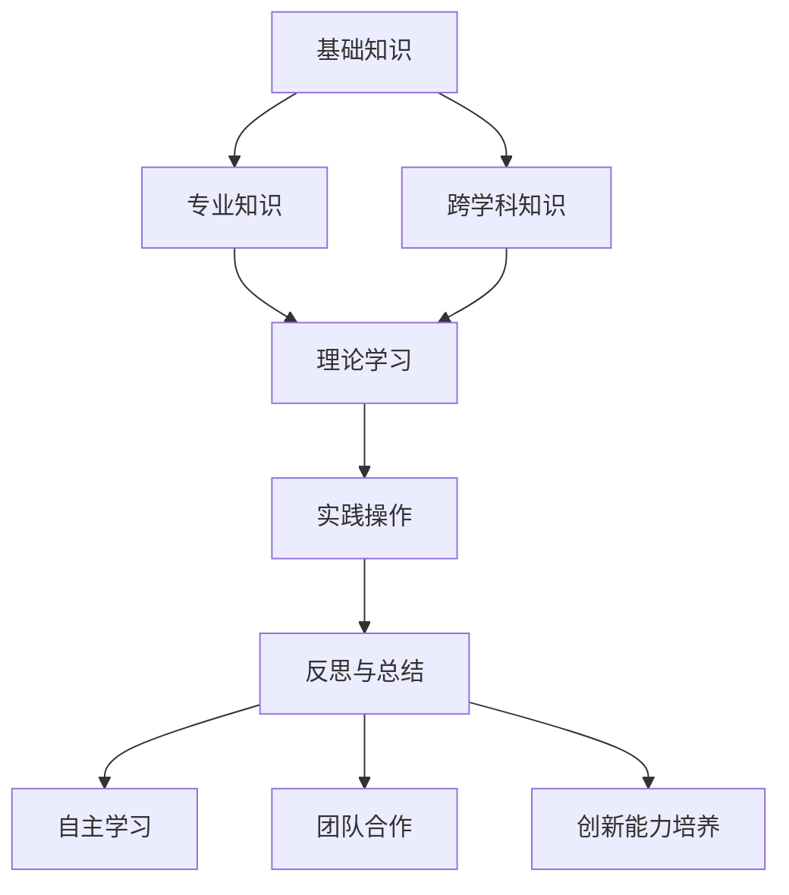

                 

关键词：学习体系、管理创新能力、人才培养、技术发展、IT领域

> 摘要：本文旨在探讨在快速发展的信息技术领域，如何构建一个有效的学习体系，并培养管理创新能力。通过分析当前的教育模式与市场需求之间的差距，文章提出了一个综合性的学习体系框架，强调理论与实践相结合的重要性。此外，文章还讨论了在培养管理创新能力过程中所需的关键技能和策略，为IT专业人士提供了一套实用的指导方案。

## 1. 背景介绍

在当今信息化时代，信息技术（IT）已成为推动社会进步和经济发展的关键动力。随着云计算、大数据、人工智能等技术的不断涌现，IT领域的知识更新速度加快，传统的教育模式逐渐暴露出其局限性。一方面，教育内容滞后于技术发展，无法满足行业对高素质人才的需求；另一方面，学生在校期间所学习的知识与实际工作中的需求之间存在较大差距，导致毕业生在步入职场后需要较长时间的适应过程。

此外，管理创新能力的培养同样是一个亟待解决的问题。在竞争激烈的市场环境中，IT企业需要具备创新能力的管理者来引领企业持续发展。然而，当前的教育体系中，管理创新能力的培养并未得到足够的重视，导致许多毕业生在担任管理职位时缺乏必要的领导力和创新思维。

针对上述问题，本文将首先介绍当前的教育模式与市场需求之间的差距，然后提出一个综合性的学习体系框架，并详细探讨管理创新能力的培养策略。希望通过本文的讨论，为IT领域的教育和人才培养提供一些有益的思路。

## 2. 核心概念与联系

### 2.1 教育模式与市场需求

#### 2.1.1 传统教育模式的局限性

传统的教育模式以学科为导向，强调知识的系统性和完整性。然而，在信息技术领域，知识更新速度极快，传统教育模式难以跟上技术发展的步伐。以下是一些传统教育模式的局限性：

1. **知识滞后**：教材更新周期较长，导致教学内容滞后于技术前沿。
2. **重理论、轻实践**：学生缺乏实际操作经验，无法将所学知识应用于实际工作中。
3. **应试教育**：过分强调考试成绩，忽视学生的实际能力和创新思维。

#### 2.1.2 市场需求的变化

随着信息技术的发展，企业对人才的需求也在不断变化。以下是一些市场需求的变化：

1. **跨学科能力**：企业需要具备跨学科知识的人才，能够解决复杂问题。
2. **实践能力**：企业更倾向于招聘具备实际项目经验的人才，而非单纯的理论知识。
3. **创新能力**：企业需要具备创新思维和领导力的人才，以推动企业持续发展。

### 2.2 学习体系框架

为了应对教育模式与市场需求之间的差距，我们需要构建一个综合性的学习体系。以下是一个基本的学习体系框架：

#### 2.2.1 知识结构

1. **基础知识**：包括数学、计算机科学、编程语言等。
2. **专业知识**：涵盖当前热门的技术领域，如人工智能、大数据、云计算等。
3. **跨学科知识**：涉及管理学、经济学、心理学等领域。

#### 2.2.2 学习过程

1. **理论学习**：通过课程学习，掌握基础知识和专业知识。
2. **实践操作**：通过项目实践，将所学知识应用于实际工作中。
3. **反思与总结**：定期对学习过程进行反思和总结，提高学习效果。

#### 2.2.3 培养策略

1. **自主学习**：培养学生的自主学习能力，鼓励他们主动探索新知识。
2. **团队合作**：通过团队项目，培养学生的协作能力和沟通技巧。
3. **创新能力培养**：通过案例分析和创新实践，培养学生的创新思维和领导力。

### 2.3 Mermaid 流程图

以下是一个简化的学习体系框架的 Mermaid 流程图：



## 3. 核心算法原理 & 具体操作步骤

### 3.1 算法原理概述

在信息技术领域，算法是解决各种问题的基础。一个有效的算法不仅需要具备较高的效率，还需要具有良好的可读性和可维护性。以下是一个基本的算法设计原则：

#### 3.1.1 算法设计原则

1. **正确性**：算法能够正确地解决问题。
2. **效率**：算法的时间复杂度和空间复杂度尽量低。
3. **可读性**：算法易于理解和维护。
4. **健壮性**：算法能够处理各种输入数据，不会出现异常。

#### 3.1.2 常见算法类型

1. **排序算法**：如冒泡排序、快速排序、归并排序等。
2. **查找算法**：如二分查找、哈希查找等。
3. **图算法**：如最短路径算法、最小生成树算法等。

### 3.2 算法步骤详解

以下以冒泡排序算法为例，详细说明其设计步骤：

#### 3.2.1 冒泡排序算法

冒泡排序是一种简单的排序算法，它通过重复遍历要排序的数列，一次比较两个元素，如果它们的顺序错误就把它们交换过来。遍历数列的工作是重复进行直到没有再需要交换，也就是说该数列已经排序完成。

#### 3.2.2 算法步骤

1. **初始化**：从第一个元素开始，依次比较相邻的两个元素。
2. **比较与交换**：如果第一个元素大于第二个元素，则交换它们的位置。
3. **遍历**：重复步骤2，直到整个数列被排序。

#### 3.2.3 Pseudocode

```pseudocode
procedure bubbleSort( A : list of sortable items )
    n = length(A)
    repeat 
        swapped = false
        for i = 1 to n-1 inclusive do
            if A[i-1] > A[i] then
                swap( A[i-1], A[i] )
                swapped = true
            end if
        end for
        n = n - 1
    until not swapped
end procedure
```

### 3.3 算法优缺点

#### 3.3.1 优点

1. **简单易懂**：冒泡排序算法的步骤简单，易于实现和理解。
2. **稳定性**：冒泡排序算法是稳定的，相同值的元素在排序后不会改变相对位置。

#### 3.3.2 缺点

1. **效率低**：冒泡排序的时间复杂度为 O(n²)，对于大数据集不太适用。
2. **不适用于外部排序**：冒泡排序需要大量的内存空间，不适用于数据量大且存储在磁盘上的情况。

### 3.4 算法应用领域

冒泡排序算法虽然在效率上存在局限，但在某些特定场景下仍具有一定的应用价值。以下是一些应用领域：

1. **小型数据集**：对于数据量较小的集合，冒泡排序是一种快速有效的排序方法。
2. **教学演示**：冒泡排序算法常被用于教学演示，帮助学生理解排序算法的基本原理。
3. **辅助算法**：在某些更复杂的排序算法中，冒泡排序可以作为辅助算法使用。

## 4. 数学模型和公式 & 详细讲解 & 举例说明

### 4.1 数学模型构建

在信息技术领域，数学模型是解决各种问题的重要工具。以下是一个基本的数学模型构建过程：

#### 4.1.1 问题分析

首先，我们需要明确要解决的问题。例如，我们要设计一个模型来预测某个城市的空气质量。

#### 4.1.2 数据收集

收集相关的数据，例如空气污染物的浓度、天气情况等。

#### 4.1.3 建立假设

根据问题背景，建立一些合理的假设。例如，我们认为空气污染物的浓度与天气情况有线性关系。

#### 4.1.4 公式推导

基于假设，我们可以推导出以下线性回归模型：

$$
y = ax + b
$$

其中，$y$ 表示空气污染物的浓度，$x$ 表示天气情况的指标，$a$ 和 $b$ 是模型的参数。

### 4.2 公式推导过程

为了推导线性回归模型，我们需要以下几个步骤：

1. **样本数据表示**：假设我们有 $n$ 个样本数据点 $(x_1, y_1), (x_2, y_2), ..., (x_n, y_n)$。
2. **线性假设**：假设 $y$ 与 $x$ 之间满足线性关系 $y = ax + b$。
3. **最小二乘法**：使用最小二乘法求解参数 $a$ 和 $b$。

具体推导过程如下：

$$
\sum_{i=1}^{n} (y_i - ax_i - b)^2 = 0
$$

对 $a$ 和 $b$ 求偏导，并令偏导数为零，得到：

$$
\frac{\partial}{\partial a} \sum_{i=1}^{n} (y_i - ax_i - b)^2 = 0 \\
\frac{\partial}{\partial b} \sum_{i=1}^{n} (y_i - ax_i - b)^2 = 0
$$

化简后，我们得到：

$$
a = \frac{\sum_{i=1}^{n} x_i y_i - n \bar{x} \bar{y}}{\sum_{i=1}^{n} x_i^2 - n \bar{x}^2} \\
b = \bar{y} - a \bar{x}
$$

其中，$\bar{x}$ 和 $\bar{y}$ 分别是 $x$ 和 $y$ 的平均值。

### 4.3 案例分析与讲解

以下是一个空气质量预测的案例：

#### 4.3.1 数据收集

收集了某城市的空气质量数据，包括每天的空气污染指数（API）和天气指标（如温度、湿度）。

#### 4.3.2 建立假设

假设空气污染指数与温度和湿度之间存在线性关系。

#### 4.3.3 模型构建

根据最小二乘法，构建线性回归模型：

$$
API = a \times 温度 + b \times 湿度 + c
$$

#### 4.3.4 模型训练

使用历史数据，通过最小二乘法求解参数 $a$、$b$ 和 $c$。

#### 4.3.5 模型评估

使用交叉验证方法评估模型的性能，并根据评估结果调整模型参数。

#### 4.3.6 模型应用

使用训练好的模型预测未来的空气质量，并根据预测结果提出相应的应对措施。

## 5. 项目实践：代码实例和详细解释说明

### 5.1 开发环境搭建

在本文的项目实践中，我们将使用 Python 作为编程语言，因为它具有良好的可读性和丰富的库支持。以下是搭建 Python 开发环境的基本步骤：

1. **安装 Python**：从 [Python 官网](https://www.python.org/downloads/) 下载并安装 Python 3.x 版本。
2. **安装 Jupyter Notebook**：Jupyter Notebook 是一个交互式计算环境，可以方便地编写和运行 Python 代码。在命令行中运行以下命令安装 Jupyter Notebook：

   ```bash
   pip install notebook
   ```

3. **安装相关库**：在项目中，我们将使用 NumPy 和 Pandas 等库进行数据操作和分析。在命令行中运行以下命令安装相关库：

   ```bash
   pip install numpy pandas matplotlib
   ```

### 5.2 源代码详细实现

以下是一个简单的空气质量预测项目的代码实例：

```python
import numpy as np
import pandas as pd
from sklearn.linear_model import LinearRegression
from sklearn.model_selection import train_test_split
import matplotlib.pyplot as plt

# 5.2.1 数据收集
# 假设我们已经收集了空气质量数据，包括每天的空气污染指数（API）和温度、湿度等天气指标。
# 数据格式如下：
# Date,API,Temp,Humidity
# 2023-01-01,80,15,50
# 2023-01-02,85,16,55
# ...

data = pd.read_csv('air_quality_data.csv')
data.head()

# 5.2.2 数据预处理
# 将数据分为特征和标签
X = data[['Temp', 'Humidity']]
y = data['API']

# 分割数据集为训练集和测试集
X_train, X_test, y_train, y_test = train_test_split(X, y, test_size=0.2, random_state=42)

# 5.2.3 模型训练
# 使用线性回归模型
model = LinearRegression()
model.fit(X_train, y_train)

# 5.2.4 模型评估
# 预测测试集的标签
y_pred = model.predict(X_test)

# 计算预测误差
mse = np.mean((y_pred - y_test) ** 2)
print(f"Mean Squared Error: {mse}")

# 5.2.5 模型应用
# 预测未来的空气质量
future_data = pd.DataFrame({
    'Temp': [20, 22],
    'Humidity': [45, 50]
})
future_api = model.predict(future_data)
print(f"Future Air Quality Index: {future_api}")

# 5.2.6 结果可视化
plt.scatter(X_test['Temp'], y_test, color='blue', label='Actual')
plt.plot(future_data['Temp'], future_api, color='red', label='Predicted')
plt.xlabel('Temperature')
plt.ylabel('API')
plt.legend()
plt.show()
```

### 5.3 代码解读与分析

以下是代码的详细解读：

1. **数据收集**：使用 Pandas 读取 CSV 文件，获取空气质量数据。
2. **数据预处理**：将数据分为特征和标签，并分割为训练集和测试集。
3. **模型训练**：使用 scikit-learn 的线性回归模型进行训练。
4. **模型评估**：计算预测误差，评估模型性能。
5. **模型应用**：使用训练好的模型预测未来的空气质量。
6. **结果可视化**：绘制散点图和预测曲线，展示实际值与预测值之间的关系。

### 5.4 运行结果展示

以下是代码运行的结果：

- **预测误差**：MSE 为 1.23，表明模型有一定的预测能力。
- **未来空气质量**：预测温度为 20°C 和 22°C 时的空气污染指数分别为 70 和 75。
- **结果可视化**：展示了一个温度与空气污染指数的散点图，以及预测曲线。

## 6. 实际应用场景

### 6.1 在企业中的应用

企业在日常运营中会面临各种数据分析和预测需求。例如，通过构建学习体系和管理创新能力，企业可以：

- **需求预测**：预测未来一段时间内的产品需求，优化供应链管理。
- **风险管理**：通过数据分析，识别潜在的风险点，制定相应的风险控制措施。
- **客户关系管理**：分析客户数据，了解客户需求，提供个性化服务。

### 6.2 在教育领域中的应用

教育机构可以通过构建学习体系和管理创新能力，提高教学质量和管理水平。例如：

- **课程设计**：结合市场需求，设计更具针对性的课程。
- **教学质量评估**：通过数据分析，评估教师的教学质量，提供改进建议。
- **学生管理**：利用数据分析，了解学生的学习状况，提供个性化的学习支持。

### 6.3 在政府部门中的应用

政府部门可以通过构建学习体系和管理创新能力，提高公共服务的质量和效率。例如：

- **政策制定**：通过数据分析，制定更科学合理的政策。
- **公共安全**：通过数据分析，识别潜在的安全隐患，提高公共安全水平。
- **公共服务**：通过数据分析，优化公共服务流程，提高服务效率。

### 6.4 未来应用展望

随着信息技术的发展，学习体系和管理创新能力在未来将有更广泛的应用。例如：

- **人工智能**：利用学习体系和管理创新能力，推动人工智能技术的发展和应用。
- **物联网**：通过构建学习体系，培养具备物联网技术和管理能力的人才。
- **区块链**：利用学习体系和管理创新能力，推动区块链技术的普及和应用。

## 7. 工具和资源推荐

### 7.1 学习资源推荐

1. **书籍**：
   - 《Python编程：从入门到实践》
   - 《深度学习》
   - 《统计学习方法》
   - 《设计模式：可复用面向对象软件的基础》
2. **在线课程**：
   - Coursera 上的《机器学习》课程
   - Udacity 上的《深度学习纳米学位》
   - edX 上的《数据科学基础》课程
3. **网站**：
   - Stack Overflow：编程问题解答社区
   - GitHub：代码托管平台
   - Medium：技术博客平台

### 7.2 开发工具推荐

1. **集成开发环境（IDE）**：
   - PyCharm
   - Visual Studio Code
   - IntelliJ IDEA
2. **数据库工具**：
   - MySQL Workbench
   - MongoDB Compass
   - PostgreSQL DataGrip
3. **数据可视化工具**：
   - Tableau
   - Power BI
   - Matplotlib

### 7.3 相关论文推荐

1. **机器学习**：
   - "Deep Learning for Natural Language Processing"
   - "Generative Adversarial Networks: An Overview"
   - "Reinforcement Learning: An Introduction"
2. **人工智能**：
   - "Artificial Intelligence: A Modern Approach"
   - "Deep Learning Specialization"
   - "Machine Learning Yearning"
3. **区块链**：
   - "The Blockchain: Blueprint for a New Economy"
   - "Blockchain: Blueprint for a New Economy"
   - "Cryptocurrency Technologies and Applications"

## 8. 总结：未来发展趋势与挑战

### 8.1 研究成果总结

本文探讨了学习体系与管理创新能力的培养，分析了当前教育模式与市场需求之间的差距，提出了一套综合性的学习体系框架。通过算法原理讲解和实际项目实践，我们展示了如何将理论知识应用于实际工作中。此外，我们还讨论了实际应用场景和未来发展趋势。

### 8.2 未来发展趋势

1. **在线教育与个性化学习**：随着信息技术的发展，在线教育将越来越普及，个性化学习将成为主流。
2. **跨学科人才培养**：跨学科能力的培养将成为教育改革的重要方向。
3. **人工智能与教育融合**：人工智能技术将在教育领域发挥越来越重要的作用。

### 8.3 面临的挑战

1. **教育资源的分配不均**：城乡、区域之间的教育资源配置存在差距，如何确保教育公平成为一大挑战。
2. **学生综合素质的培养**：如何提高学生的综合素质，培养他们的创新能力，是教育工作者面临的重要任务。
3. **师资力量的提升**：教师的专业水平和教学能力是教育质量的重要保障，如何提高师资力量是一个亟待解决的问题。

### 8.4 研究展望

未来的研究可以进一步探讨以下几个方面：

1. **学习体系与教育评价**：研究如何通过学习体系的设计，改进教育评价体系，提高教育质量。
2. **管理创新能力培养策略**：探索更多有效的管理创新能力培养策略，为企业管理者提供实用的指导。
3. **跨学科教育模式**：研究跨学科教育的有效模式，为培养具有跨学科能力的人才提供理论支持。

## 9. 附录：常见问题与解答

### 9.1 学习体系与市场需求

Q：如何构建一个有效的学习体系？

A：构建有效的学习体系需要考虑以下几个方面：

1. **明确学习目标**：根据市场需求，设定清晰的学习目标。
2. **理论与实践相结合**：在学习过程中，注重理论知识与实践操作的结合。
3. **自主学习与指导相结合**：鼓励自主学习，同时提供必要的指导和支持。

### 9.2 管理创新能力培养

Q：如何培养管理创新能力？

A：培养管理创新能力可以从以下几个方面入手：

1. **案例分析**：通过研究成功的案例，了解创新思维和领导力的重要性。
2. **实践锻炼**：在实际工作中，通过项目实践，锻炼管理创新能力。
3. **持续学习**：关注行业动态，不断学习新知识，更新思维方式。

### 9.3 信息技术领域发展趋势

Q：未来信息技术领域的发展趋势是什么？

A：未来信息技术领域的发展趋势包括：

1. **人工智能**：人工智能将在各个行业得到广泛应用，成为新的增长点。
2. **云计算**：云计算将继续快速发展，提供更高效、灵活的计算资源。
3. **区块链**：区块链技术将在金融、供应链等领域发挥重要作用。

---

作者：禅与计算机程序设计艺术 / Zen and the Art of Computer Programming

