                 

关键词：学习体系、管理创新、能力培养、技术发展、团队协作

> 摘要：本文从学习体系的构建、管理创新的方法和实践、能力培养的关键环节以及技术发展的趋势等方面，探讨了如何提高个人及团队在信息技术领域的创新能力。文章旨在为IT从业者提供一套系统化的学习和实践指南，以适应快速变化的技术环境，并推动组织在信息技术领域取得持续竞争优势。

## 1. 背景介绍

随着信息技术的迅猛发展，数据量呈爆炸性增长，技术变革的速度不断加快。在这样的大背景下，IT从业者们不仅需要掌握传统的编程、数据库管理等技能，还需要具备快速学习新技术、创新管理和团队协作的能力。然而，很多IT从业者面临着以下挑战：

- **知识更新快**：新技术的更新周期缩短，旧的知识体系很快变得过时。
- **技能多样化**：需要掌握的技能种类繁多，从编程到系统架构，从大数据到人工智能，无所不包。
- **管理复杂性**：项目管理、团队协作、资源分配等管理难题逐渐凸显。
- **创新能力不足**：如何在快速变化的市场中保持创新能力，成为企业发展的关键。

本文旨在解决上述问题，通过构建科学的学习体系、实施有效的管理创新策略、培养核心能力，帮助IT从业者及团队在技术和管理上实现跨越式发展。

## 2. 核心概念与联系

### 2.1 学习体系

学习体系是指一个组织或个人在获取知识和技能过程中的总体结构和规划。一个有效的学习体系应包括以下核心组成部分：

- **学习目标**：明确的学习目标有助于集中精力和时间，确保学习的有效性。
- **学习内容**：系统化的学习内容应涵盖基础知识、前沿技术、最佳实践等。
- **学习方法**：包括自学、培训、实践、讨论等多种学习方式，以满足不同学习者的需求。
- **评估与反馈**：通过定期的评估和反馈，调整学习策略，确保学习目标的达成。

### 2.2 管理创新

管理创新是指在企业管理过程中，运用新的理念、方法、工具和技术，以提高管理效率和效果。管理创新的核心概念包括：

- **创新思维**：鼓励管理者具备前瞻性、灵活性和创造性的思维方式。
- **组织文化**：构建支持创新的组织文化，包括开放沟通、鼓励失败、共享知识等。
- **团队协作**：通过有效的团队协作，实现知识和资源的最大化利用。
- **领导力**：领导者需要具备激励团队、引导变革的能力。

### 2.3 能力培养

能力培养是指通过系统化的训练和实践，提升个人或团队在特定领域的技能和素质。能力培养的关键要素包括：

- **专业技能**：掌握与岗位相关的基本技能，如编程、数据分析、系统架构等。
- **跨领域知识**：拓展跨领域的知识面，提高解决问题的综合能力。
- **创新思维**：培养创新思维，鼓励提出新的解决方案和思路。
- **持续学习**：建立持续学习的习惯，保持个人和团队的知识更新。

### 2.4 Mermaid 流程图



### 3. 核心算法原理 & 具体操作步骤

#### 3.1 算法原理概述

在本文的框架下，核心算法原理主要指的是如何通过系统化的学习体系和创新能力培养方法，实现个人和团队在信息技术领域的持续进步。

#### 3.2 算法步骤详解

##### 步骤1：构建学习体系

1. **明确学习目标**：设定短期和长期的学习目标，确保学习具有明确的方向和重点。
2. **设计学习内容**：根据目标选择合适的学习内容，包括基础知识、前沿技术、行业最佳实践等。
3. **选择学习方法**：结合个人和团队的特点，选择自学、培训、实践、讨论等多种学习方法。
4. **设立评估与反馈机制**：定期进行学习成果的评估，并通过反馈调整学习策略。

##### 步骤2：实施管理创新

1. **培养创新思维**：通过培训、研讨会等形式，培养管理层的创新思维。
2. **构建支持创新的组织文化**：鼓励开放沟通、鼓励失败、共享知识等。
3. **促进团队协作**：建立团队协作机制，提高知识和资源的共享效率。
4. **提升领导力**：培养领导者的激励团队和引导变革能力。

##### 步骤3：培养核心能力

1. **专业技能训练**：通过实践和培训，提升个人在编程、数据分析、系统架构等领域的专业技能。
2. **跨领域知识拓展**：学习跨领域的知识，提高综合解决问题的能力。
3. **创新思维培养**：通过案例分析、头脑风暴等活动，培养创新思维。
4. **持续学习习惯**：建立持续学习的文化，鼓励团队成员不断更新知识和技能。

#### 3.3 算法优缺点

**优点**：

- **系统性**：通过构建学习体系，实现知识的系统化积累。
- **灵活性**：多种学习方法的选择，适应不同学习者的需求。
- **高效性**：通过评估与反馈机制，提高学习效率。
- **创新性**：通过管理创新和能力培养，保持团队的创新能力。

**缺点**：

- **实施难度**：构建和实施一个有效的学习体系和创新能力培养方案需要时间和资源。
- **持续挑战**：技术环境和市场变化的快速，要求持续调整和优化学习体系。

#### 3.4 算法应用领域

- **IT行业**：通过学习体系和管理创新，提升IT团队的技术水平和创新能力。
- **企业内部培训**：通过构建学习体系和创新能力培养，提高企业员工的综合素质。
- **教育培训机构**：通过科学的学习体系和管理创新方法，提升培训效果和质量。

### 4. 数学模型和公式 & 详细讲解 & 举例说明

#### 4.1 数学模型构建

在本文中，我们构建的数学模型主要涉及学习能力提升和创新能力培养的相关指标。以下是模型的构建过程：

**学习能力提升模型**：

设\( L \)为学习能力的提升，\( E \)为学习时间，\( P \)为学习效率，\( M \)为学习材料的难度，则：

\[ L = \frac{E \times P}{M} \]

**创新能力培养模型**：

设\( I \)为创新能力的提升，\( C \)为创新能力培养的时间，\( G \)为创新能力培养的强度，则：

\[ I = \frac{C \times G}{H} \]

其中，\( H \)为环境对创新能力的支持度。

#### 4.2 公式推导过程

**学习能力提升模型推导**：

- **学习时间（E）**：学习时间取决于个人或团队的时间安排，通常以小时为单位。
- **学习效率（P）**：学习效率取决于学习内容和方法，通常以百分比表示。
- **学习材料难度（M）**：学习材料的难度影响学习效果，难度越高，学习时间越长。

通过上述因素的关系，可以推导出学习能力提升的公式。

**创新能力培养模型推导**：

- **创新能力培养时间（C）**：创新能力培养需要持续的时间，通常以月或季度为单位。
- **创新能力培养强度（G）**：创新能力培养的强度取决于培养活动的深度和广度。
- **环境支持度（H）**：环境支持度包括组织文化、资源投入、领导力等。

通过这些因素的关系，可以推导出创新能力提升的公式。

#### 4.3 案例分析与讲解

**案例一：学习能力提升**

假设一名程序员\( A \)在学习一门新的编程语言，学习时间\( E \)为100小时，学习效率\( P \)为80%，学习材料难度\( M \)为中等，则：

\[ L = \frac{100 \times 0.8}{0.5} = 160 \]

即程序员\( A \)的学习能力提升了160点。

**案例二：创新能力培养**

假设一个团队在为期三个月的创新能力培养计划中，投入了200小时的时间和10万元的资金，创新能力培养的强度\( G \)为高，环境支持度\( H \)为良好，则：

\[ I = \frac{200 \times 1}{1} = 200 \]

即团队的创新能力提升了200点。

### 5. 项目实践：代码实例和详细解释说明

#### 5.1 开发环境搭建

为了演示学习能力提升和创新能力培养的应用，我们选择Python作为开发语言，搭建一个简单的在线学习平台。开发环境需要Python 3.8及以上版本，以及Django框架。

#### 5.2 源代码详细实现

以下是实现该平台的主要代码：

```python
# 引入相关模块
from django.db import models

# 创建学习记录模型
class LearningRecord(models.Model):
    user = models.ForeignKey('auth.User', on_delete=models.CASCADE)
    subject = models.CharField(max_length=100)
    hours = models.IntegerField()
    efficiency = models.FloatField()
    difficulty = models.FloatField()

    def __str__(self):
        return self.user.username + ' - ' + self.subject

# 创建创新能力记录模型
class InnovationRecord(models.Model):
    team = models.ForeignKey('auth.User', on_delete=models.CASCADE)
    duration = models.IntegerField()
    intensity = models.FloatField()
    environment_support = models.FloatField()

    def __str__(self):
        return self.team.username + ' - ' + str(self.duration) + ' months'

# 省略视图函数和URL配置
```

#### 5.3 代码解读与分析

- **学习记录模型（LearningRecord）**：用于记录个人或团队的学习情况，包括用户、科目、学习时间、学习效率和难度等。
- **创新能力记录模型（InnovationRecord）**：用于记录团队的创新能力培养情况，包括团队、培养时间、培养强度和环境支持度等。

#### 5.4 运行结果展示

通过运行上述代码，我们可以在后台管理系统查看学习记录和创新能力记录。以下是示例数据：

```plaintext
学习记录：
- 用户A - 编程语言学习，学习时间100小时，学习效率80%，难度0.5
- 用户B - 数据分析，学习时间150小时，学习效率90%，难度0.8

创新能力记录：
- 团队A - 3个月，培养强度1，环境支持度1
- 团队B - 4个月，培养强度1.2，环境支持度1.2
```

通过这些数据，我们可以分析团队的学习能力和创新能力，为后续的学习和创新能力提升提供参考。

### 6. 实际应用场景

#### 6.1 学习体系在IT企业中的应用

在IT企业中，学习体系的应用主要体现在以下几个方面：

- **员工培训**：通过系统化的学习内容，提升员工的专业技能和综合素质。
- **项目研发**：将学习成果应用于项目研发，提高项目质量和效率。
- **知识管理**：建立知识库，实现知识的共享和传承。

#### 6.2 管理创新在团队管理中的应用

管理创新在团队管理中的应用主要体现在以下几个方面：

- **组织变革**：通过引入新的管理理念和方法，提高团队协作效率。
- **绩效管理**：通过创新绩效评估方法，激励员工积极性。
- **项目管理**：通过项目管理工具和方法，提高项目成功率。

#### 6.3 能力培养在个人发展中的应用

个人能力培养在以下几个方面具有重要作用：

- **职业发展**：通过持续学习和能力提升，实现职业晋升。
- **技能提升**：通过学习新技术和知识，提高个人在岗位上的竞争力。
- **创新能力**：通过培养创新思维和能力，提出新的解决方案。

### 7. 工具和资源推荐

#### 7.1 学习资源推荐

- **在线课程平台**：如Coursera、edX、Udemy等，提供丰富的学习资源。
- **技术社区**：如Stack Overflow、GitHub、Reddit等，可以获取最新的技术资讯和解决方案。
- **专业书籍**：如《深度学习》、《算法导论》、《代码大全》等，是学习技术知识的经典之作。

#### 7.2 开发工具推荐

- **集成开发环境**：如Visual Studio Code、PyCharm、Eclipse等，提供高效的编程工具。
- **项目管理工具**：如JIRA、Trello、Asana等，帮助团队进行项目管理和协作。
- **版本控制工具**：如Git、SVN等，实现代码的版本管理和协作开发。

#### 7.3 相关论文推荐

- **《人工智能：一种现代方法》**：详细介绍了人工智能的基本概念和最新进展。
- **《大数据管理：系统、方法和应用》**：探讨了大数据管理的技术和方法。
- **《敏捷开发：实践指南》**：介绍了敏捷开发的方法和实践。

### 8. 总结：未来发展趋势与挑战

#### 8.1 研究成果总结

本文通过构建学习体系、实施管理创新、培养核心能力等手段，探讨了如何提高个人及团队在信息技术领域的创新能力。主要研究成果包括：

- **系统化的学习体系**：明确学习目标、设计学习内容、选择学习方法、设立评估与反馈机制。
- **有效的管理创新**：培养创新思维、构建支持创新的组织文化、促进团队协作、提升领导力。
- **核心能力培养**：专业技能训练、跨领域知识拓展、创新思维培养、持续学习习惯的养成。
- **数学模型和公式**：构建了学习能力提升和创新能力培养的数学模型，为实际应用提供了理论依据。

#### 8.2 未来发展趋势

未来信息技术领域的发展趋势主要包括：

- **人工智能与大数据的结合**：人工智能将在大数据的加持下发挥更大作用，推动智能应用的普及。
- **云计算与边缘计算的融合**：云计算和边缘计算将逐步融合，实现更高效、更灵活的计算资源分配。
- **区块链技术的广泛应用**：区块链技术在金融、供应链、物联网等领域的应用将越来越广泛。

#### 8.3 面临的挑战

信息技术领域面临的挑战主要包括：

- **知识更新速度加快**：新技术的不断涌现，要求IT从业者持续学习和更新知识。
- **管理复杂性增加**：项目管理、团队协作等方面的复杂性增加，对管理者的要求越来越高。
- **创新能力不足**：如何在快速变化的市场中保持创新能力，成为企业发展的关键挑战。

#### 8.4 研究展望

未来的研究可以从以下几个方面展开：

- **学习体系与创新能力培养的量化模型**：进一步研究学习体系和创新能力培养的量化模型，提高其应用性和有效性。
- **跨学科研究**：结合心理学、管理学等学科，探索创新能力培养的跨学科方法。
- **实践案例研究**：通过实践案例研究，总结成功的经验和教训，为其他组织提供参考。

### 9. 附录：常见问题与解答

**问题1**：如何构建一个有效的学习体系？

**解答**：构建有效的学习体系需要明确学习目标、设计学习内容、选择学习方法、设立评估与反馈机制。具体步骤如下：

1. **明确学习目标**：设定短期和长期的学习目标，确保学习具有明确的方向和重点。
2. **设计学习内容**：根据目标选择合适的学习内容，包括基础知识、前沿技术、行业最佳实践等。
3. **选择学习方法**：结合个人和团队的特点，选择自学、培训、实践、讨论等多种学习方法。
4. **设立评估与反馈机制**：定期进行学习成果的评估，并通过反馈调整学习策略，确保学习目标的达成。

**问题2**：如何实施管理创新？

**解答**：实施管理创新需要培养创新思维、构建支持创新的组织文化、促进团队协作、提升领导力。具体步骤如下：

1. **培养创新思维**：通过培训、研讨会等形式，培养管理层的创新思维。
2. **构建支持创新的组织文化**：鼓励开放沟通、鼓励失败、共享知识等，构建支持创新的组织文化。
3. **促进团队协作**：建立团队协作机制，提高知识和资源的共享效率。
4. **提升领导力**：培养领导者的激励团队和引导变革能力，提升领导力。

**问题3**：如何培养核心能力？

**解答**：培养核心能力需要专业技能训练、跨领域知识拓展、创新思维培养、持续学习习惯的养成。具体步骤如下：

1. **专业技能训练**：通过实践和培训，提升个人在编程、数据分析、系统架构等领域的专业技能。
2. **跨领域知识拓展**：学习跨领域的知识，提高综合解决问题的能力。
3. **创新思维培养**：通过案例分析、头脑风暴等活动，培养创新思维。
4. **持续学习习惯**：建立持续学习的文化，鼓励团队成员不断更新知识和技能。

作者：禅与计算机程序设计艺术 / Zen and the Art of Computer Programming
```markdown
# 学习体系与管理创新能力的培养

## 摘要

本文旨在探讨如何通过构建学习体系、实施管理创新策略和培养核心能力，来提升个人及团队在信息技术领域的创新能力。文章首先介绍了当前信息技术领域的发展背景和从业者面临的挑战，然后详细阐述了学习体系、管理创新和能力培养的核心概念与联系。接着，文章通过具体的算法原理、数学模型和项目实践，说明了如何通过科学的方法提升学习和创新能力。文章还分析了实际应用场景，推荐了相关工具和资源，并总结了未来发展趋势与面临的挑战。最后，文章提供了常见问题与解答，为读者提供实际操作指导。

## 1. 背景介绍

### 1.1 信息技术领域的发展背景

随着互联网、大数据、云计算、人工智能等技术的快速发展，信息技术领域正经历着一场前所未有的变革。这一变革不仅改变了人们的生活方式，也对企业的运营模式和商业模型产生了深远的影响。以下是一些关键的发展趋势：

#### 数据量的爆炸性增长

数据的爆炸性增长是当前信息技术领域的一大特征。根据国际数据公司（IDC）的预测，全球数据量将以每年约40%的速度增长，到2025年全球数据总量将达到160 ZB。这意味着，数据将成为未来最重要的资源，如何有效地管理和利用数据，将成为企业竞争的关键。

#### 新技术的快速涌现

新技术的快速涌现使得技术变革的速度不断加快。人工智能、区块链、物联网等技术的应用，正在深刻改变各个行业。例如，人工智能在医疗、金融、制造业等领域的应用，不仅提高了效率，还带来了新的商业模式。区块链技术的应用，也在推动着供应链管理、数字身份认证等领域的创新。

#### 跨学科融合

信息技术领域的快速发展，也促使跨学科融合成为趋势。在传统的计算机科学之外，心理学、管理学、社会学等学科的知识，正在被更多地应用到信息技术领域。这种跨学科融合，不仅拓宽了信息技术的研究领域，也为解决复杂问题提供了新的思路和方法。

### 1.2 IT从业者面临的挑战

在这样的技术背景下，IT从业者面临着一系列挑战：

#### 知识更新快

随着新技术的不断涌现，原有的知识体系很快变得过时。IT从业者需要不断学习新的技术，才能保持竞争力。然而，新技术的学习需要大量的时间和精力，如何平衡工作与学习，成为许多IT从业者的难题。

#### 技能多样化

IT从业者的技能需求越来越多样化。从传统的编程、数据库管理，到新兴的人工智能、大数据分析，再到系统架构、云计算等，都需要掌握。这使得IT从业者需要具备更广泛的知识面和技能。

#### 管理复杂性

项目管理、团队协作、资源分配等管理难题逐渐凸显。如何在有限的时间内，有效地完成项目，并在团队中实现高效的协作，成为许多IT从业者面临的重要挑战。

#### 创新能力不足

如何在快速变化的市场中保持创新能力，成为企业发展的关键。许多企业在技术竞争中落后，正是因为缺乏创新能力和前瞻性。

### 1.3 本文的目标

本文旨在解决上述问题，通过构建科学的学习体系、实施有效的管理创新策略、培养核心能力，帮助IT从业者及团队在技术和管理上实现跨越式发展。具体来说，本文将：

- 分析当前信息技术领域的发展背景和从业者面临的挑战。
- 介绍学习体系、管理创新和能力培养的核心概念与联系。
- 通过具体的算法原理、数学模型和项目实践，说明如何提升学习和创新能力。
- 分析实际应用场景，推荐相关工具和资源。
- 总结未来发展趋势与面临的挑战。

## 2. 核心概念与联系

### 2.1 学习体系

学习体系是指一个组织或个人在获取知识和技能过程中的总体结构和规划。一个有效的学习体系应包括以下核心组成部分：

#### 学习目标

明确的学习目标有助于集中精力和时间，确保学习的有效性。学习目标可以分为短期目标和长期目标，短期目标通常是具体的学习任务，而长期目标则是职业发展或个人成长的方向。

#### 学习内容

学习内容是学习体系的基石，包括基础知识、前沿技术、最佳实践等。基础知识是掌握新技术的基础，前沿技术是保持竞争力的关键，最佳实践则是实际应用的经验总结。

#### 学习方法

学习方法包括自学、培训、实践、讨论等多种形式。自学是个人主动获取知识的过程，培训是系统学习的重要途径，实践是将知识应用于实际问题的过程，讨论则是通过交流碰撞产生新思路的方法。

#### 评估与反馈

评估与反馈是学习体系的重要组成部分。通过定期的评估，可以了解学习效果，发现存在的问题。通过反馈，可以调整学习策略，确保学习目标的达成。

### 2.2 管理创新

管理创新是指在企业管理过程中，运用新的理念、方法、工具和技术，以提高管理效率和效果。管理创新的核心概念包括：

#### 创新思维

创新思维是指管理者具备前瞻性、灵活性和创造性的思维方式。创新思维能够帮助管理者发现新的问题、提出新的解决方案，从而推动企业的持续发展。

#### 组织文化

组织文化是指企业内部的价值观、信念和行为准则。一个支持创新的组织文化，能够鼓励员工尝试新事物、接受失败，从而激发创新的活力。

#### 团队协作

团队协作是实现目标的重要途径。有效的团队协作能够实现知识和资源的最大化利用，提高团队的整体绩效。

#### 领导力

领导力是指领导者通过激励、引导和影响，推动团队实现目标的能力。领导力不仅体现在个人素质上，还体现在领导风格和团队管理方法上。

### 2.3 能力培养

能力培养是指通过系统化的训练和实践，提升个人或团队在特定领域的技能和素质。能力培养的关键要素包括：

#### 专业技能

专业技能是指与岗位相关的基本技能，如编程、数据分析、系统架构等。专业技能是个人或团队在特定领域发挥作用的基础。

#### 跨领域知识

跨领域知识是指涉及多个领域的知识体系。跨领域知识能够提高个人或团队的综合解决问题的能力，从而更好地应对复杂的问题。

#### 创新思维

创新思维是指提出新观点、新思路、新方法的能力。创新思维是推动个人或团队在技术和管理上实现突破的关键。

#### 持续学习

持续学习是指建立持续学习的习惯，不断更新知识和技能。持续学习是适应快速变化的技术环境、保持竞争力的关键。

### 2.4 Mermaid 流程图


```mermaid
graph TD
    A[学习体系] --> B[学习目标]
    A --> C[学习内容]
    A --> D[学习方法]
    A --> E[评估与反馈]
    B --> F[知识更新]
    B --> G[技能多样化]
    B --> H[管理复杂性]
    C --> I[基础知识]
    C --> J[前沿技术]
    C --> K[最佳实践]
    D --> L[自学]
    D --> M[培训]
    D --> N[实践]
    D --> O[讨论]
    E --> P[定期评估]
    E --> Q[反馈调整]
    
    A[管理创新] --> R[创新思维]
    A --> S[组织文化]
    A --> T[团队协作]
    A --> U[领导力]
    R --> V[前瞻性]
    R --> W[灵活性]
    R --> X[创造性]
    S --> Y[开放沟通]
    S --> Z[鼓励失败]
    S --> AA[共享知识]
    T --> BB[知识共享]
    T --> CC[资源共享]
    U --> DD[激励团队]
    U --> EE[引导变革]
    
    A[能力培养] --> FF[专业技能]
    A --> GG[跨领域知识]
    A --> HH[创新思维]
    A --> II[持续学习]
    FF --> JJ[编程技能]
    FF --> KK[数据分析]
    FF --> LL[系统架构]
    GG --> MM[跨领域知识]
    HH --> NN[创新思维]
    II --> OO[知识更新]
```

## 3. 核心算法原理 & 具体操作步骤

### 3.1 算法原理概述

在本文的框架下，核心算法原理主要指的是如何通过系统化的学习体系和创新能力培养方法，实现个人和团队在信息技术领域的持续进步。

### 3.2 算法步骤详解

#### 步骤1：构建学习体系

1. **明确学习目标**：设定短期和长期的学习目标，确保学习具有明确的方向和重点。
2. **设计学习内容**：根据目标选择合适的学习内容，包括基础知识、前沿技术、行业最佳实践等。
3. **选择学习方法**：结合个人和团队的特点，选择自学、培训、实践、讨论等多种学习方法。
4. **设立评估与反馈机制**：定期进行学习成果的评估，并通过反馈调整学习策略，确保学习目标的达成。

#### 步骤2：实施管理创新

1. **培养创新思维**：通过培训、研讨会等形式，培养管理层的创新思维。
2. **构建支持创新的组织文化**：鼓励开放沟通、鼓励失败、共享知识等，构建支持创新的组织文化。
3. **促进团队协作**：建立团队协作机制，提高知识和资源的共享效率。
4. **提升领导力**：培养领导者的激励团队和引导变革能力，提升领导力。

#### 步骤3：培养核心能力

1. **专业技能训练**：通过实践和培训，提升个人在编程、数据分析、系统架构等领域的专业技能。
2. **跨领域知识拓展**：学习跨领域的知识，提高综合解决问题的能力。
3. **创新思维培养**：通过案例分析、头脑风暴等活动，培养创新思维。
4. **持续学习习惯**：建立持续学习的文化，鼓励团队成员不断更新知识和技能。

### 3.3 算法优缺点

**优点**：

- **系统性**：通过构建学习体系，实现知识的系统化积累。
- **灵活性**：多种学习方法的选择，适应不同学习者的需求。
- **高效性**：通过评估与反馈机制，提高学习效率。
- **创新性**：通过管理创新和能力培养，保持团队的创新能力。

**缺点**：

- **实施难度**：构建和实施一个有效的学习体系和创新能力培养方案需要时间和资源。
- **持续挑战**：技术环境和市场变化的快速，要求持续调整和优化学习体系。

### 3.4 算法应用领域

- **IT行业**：通过学习体系和管理创新，提升IT团队的技术水平和创新能力。
- **企业内部培训**：通过构建学习体系和创新能力培养，提高企业员工的综合素质。
- **教育培训机构**：通过科学的学习体系和管理创新方法，提升培训效果和质量。

## 4. 数学模型和公式 & 详细讲解 & 举例说明

### 4.1 数学模型构建

在本文中，我们构建的数学模型主要涉及学习能力提升和创新能力培养的相关指标。以下是模型的构建过程：

**学习能力提升模型**：

设\( L \)为学习能力的提升，\( E \)为学习时间，\( P \)为学习效率，\( M \)为学习材料的难度，则：

\[ L = \frac{E \times P}{M} \]

**创新能力培养模型**：

设\( I \)为创新能力的提升，\( C \)为创新能力培养的时间，\( G \)为创新能力培养的强度，\( H \)为环境对创新能力的支持度，则：

\[ I = \frac{C \times G}{H} \]

### 4.2 公式推导过程

**学习能力提升模型推导**：

- **学习时间（E）**：学习时间取决于个人或团队的时间安排，通常以小时为单位。
- **学习效率（P）**：学习效率取决于学习内容和方法，通常以百分比表示。
- **学习材料难度（M）**：学习材料的难度影响学习效果，难度越高，学习时间越长。

通过上述因素的关系，可以推导出学习能力提升的公式。

**创新能力培养模型推导**：

- **创新能力培养时间（C）**：创新能力培养需要持续的时间，通常以月或季度为单位。
- **创新能力培养强度（G）**：创新能力培养的强度取决于培养活动的深度和广度。
- **环境支持度（H）**：环境支持度包括组织文化、资源投入、领导力等。

通过这些因素的关系，可以推导出创新能力提升的公式。

### 4.3 案例分析与讲解

#### 案例一：学习能力提升

假设一名程序员\( A \)在学习一门新的编程语言，学习时间\( E \)为100小时，学习效率\( P \)为80%，学习材料难度\( M \)为中等（设为0.5），则：

\[ L = \frac{100 \times 0.8}{0.5} = 160 \]

即程序员\( A \)的学习能力提升了160点。

#### 案例二：创新能力培养

假设一个团队在为期三个月的创新能力培养计划中，投入了200小时的时间和10万元的资金，创新能力培养的强度\( G \)为高（设为1），环境支持度\( H \)为良好（设为1），则：

\[ I = \frac{200 \times 1}{1} = 200 \]

即团队的创新能力提升了200点。

## 5. 项目实践：代码实例和详细解释说明

### 5.1 开发环境搭建

为了演示学习能力提升和创新能力培养的应用，我们选择Python作为开发语言，搭建一个简单的在线学习平台。开发环境需要Python 3.8及以上版本，以及Django框架。

### 5.2 源代码详细实现

以下是实现该平台的主要代码：

```python
# 引入相关模块
from django.db import models
from django.contrib.auth.models import User

# 创建学习记录模型
class LearningRecord(models.Model):
    user = models.ForeignKey(User, on_delete=models.CASCADE)
    subject = models.CharField(max_length=100)
    hours = models.IntegerField()
    efficiency = models.FloatField()
    difficulty = models.FloatField()

    def __str__(self):
        return f"{self.user.username} - {self.subject}"

# 创建创新能力记录模型
class InnovationRecord(models.Model):
    team = models.ForeignKey(User, on_delete=models.CASCADE)
    duration = models.IntegerField()
    intensity = models.FloatField()
    environment_support = models.FloatField()

    def __str__(self):
        return f"{self.team.username} - {self.duration} months"

# 省略视图函数和URL配置
```

### 5.3 代码解读与分析

- **学习记录模型（LearningRecord）**：用于记录个人或团队的学习情况，包括用户、科目、学习时间、学习效率和难度等。
- **创新能力记录模型（InnovationRecord）**：用于记录团队的创新能力培养情况，包括团队、培养时间、培养强度和环境支持度等。

### 5.4 运行结果展示

通过运行上述代码，我们可以在后台管理系统查看学习记录和创新能力记录。以下是示例数据：

```plaintext
学习记录：
- 用户A - 编程语言学习，学习时间100小时，学习效率80%，难度0.5
- 用户B - 数据分析，学习时间150小时，学习效率90%，难度0.8

创新能力记录：
- 团队A - 3个月，培养强度1，环境支持度1
- 团队B - 4个月，培养强度1.2，环境支持度1.2
```

通过这些数据，我们可以分析团队的学习能力和创新能力，为后续的学习和创新能力提升提供参考。

## 6. 实际应用场景

### 6.1 学习体系在IT企业中的应用

在IT企业中，学习体系的应用主要体现在以下几个方面：

- **员工培训**：通过系统化的学习内容，提升员工的专业技能和综合素质。
- **项目研发**：将学习成果应用于项目研发，提高项目质量和效率。
- **知识管理**：建立知识库，实现知识的共享和传承。

#### 案例一：员工培训

某IT企业为了提升员工的技能水平，构建了一个学习体系。首先，明确了员工的学习目标，包括掌握新的编程语言、熟悉新的数据库技术等。然后，根据目标设计了学习内容，包括在线课程、内部培训、实战项目等。同时，选择了多种学习方法，如自学、讨论、实战等。最后，设立了评估与反馈机制，定期对员工的学习成果进行评估，并根据反馈调整学习策略。

通过这一学习体系，该企业的员工在专业技能和综合素质方面得到了显著提升，项目研发效率和质量也得到了提高。

#### 案例二：项目研发

某IT企业在项目研发过程中，遇到了一些技术难题。为了解决这些问题，该企业利用学习体系，组织了相关的技术培训和学习活动。通过培训，员工掌握了新的技术方法和工具，为项目研发提供了有力的支持。同时，企业还鼓励员工在项目中尝试新的技术方案，并通过实践检验其可行性。

通过这一过程，该企业不仅解决了项目中的技术难题，还培养了一批具备创新能力的技术人才。

#### 案例三：知识管理

某IT企业建立了完善的知识管理体系，包括知识库、知识共享平台等。通过这一体系，员工可以将工作中的经验和教训分享给其他同事，实现知识的共享和传承。同时，企业还定期组织知识分享会，鼓励员工分享自己的知识和经验。

通过这一知识管理体系的实施，该企业的知识积累得到了显著提升，员工的工作效率和质量也得到了提高。

### 6.2 管理创新在团队管理中的应用

管理创新在团队管理中的应用主要体现在以下几个方面：

- **组织变革**：通过引入新的管理理念和方法，提高团队协作效率。
- **绩效管理**：通过创新绩效评估方法，激励员工积极性。
- **项目管理**：通过项目管理工具和方法，提高项目成功率。

#### 案例一：组织变革

某IT企业为了提升团队协作效率，引入了敏捷开发的方法。通过敏捷开发，团队成员可以更灵活地应对项目变化，提高了项目的适应能力和成功率。同时，企业还建立了跨部门的协作机制，促进了不同团队之间的信息共享和资源整合。

通过这一组织变革，该企业的团队协作效率得到了显著提升，项目的完成质量和速度也得到了提高。

#### 案例二：绩效管理

某IT企业采用了创新的绩效评估方法，不再仅仅依赖于传统的KPI考核，而是通过多维度的评估体系，综合评估员工的工作表现。这一评估体系包括项目贡献、创新能力、团队合作等多个方面，更加全面和公正地反映了员工的工作绩效。

通过这一绩效管理创新，该企业的员工积极性得到了显著提升，员工的创新能力和团队合作意识也得到了增强。

#### 案例三：项目管理

某IT企业引入了项目管理工具，如JIRA、Trello等，通过这些工具，企业可以更好地进行项目规划、任务分配、进度跟踪等。同时，企业还建立了项目管理制度，规范了项目流程，提高了项目的执行效率和成功率。

通过这一项目管理创新，该企业的项目成功率得到了显著提升，客户满意度也得到了提高。

### 6.3 能力培养在个人发展中的应用

个人能力培养在以下几个方面具有重要作用：

- **职业发展**：通过持续学习和能力提升，实现职业晋升。
- **技能提升**：通过学习新技术和知识，提高个人在岗位上的竞争力。
- **创新能力**：通过培养创新思维和能力，提出新的解决方案。

#### 案例一：职业发展

某IT工程师通过不断学习和能力提升，从初级开发人员逐步晋升为高级开发工程师，再到技术经理。在他的职业生涯中，他不仅掌握了多种编程语言和开发工具，还学习了项目管理、团队协作等管理知识。

通过持续的学习和能力提升，该工程师不仅实现了职业晋升，还为企业带来了更多的价值。

#### 案例二：技能提升

某IT工程师在工作中遇到了新的技术挑战，为了提升自己的技能，他利用业余时间学习新的编程语言和开发框架。通过不断地学习和实践，他成功地掌握了这些新技术，并在项目中得到了应用。

通过技能提升，该工程师不仅提高了自己的工作能力，还为企业带来了更多的价值。

#### 案例三：创新能力

某IT团队在项目中遇到了一个棘手的问题，传统的解决方案无法满足需求。为了解决这个问题，团队中的成员通过头脑风暴、案例研究等方式，提出了一个创新性的解决方案。

通过培养创新思维和能力，该团队成功地解决了问题，并在项目中取得了成功。

## 7. 工具和资源推荐

### 7.1 学习资源推荐

- **在线课程平台**：如Coursera、edX、Udemy等，提供丰富的学习资源。
- **技术社区**：如Stack Overflow、GitHub、Reddit等，可以获取最新的技术资讯和解决方案。
- **专业书籍**：如《深度学习》、《算法导论》、《代码大全》等，是学习技术知识的经典之作。

### 7.2 开发工具推荐

- **集成开发环境**：如Visual Studio Code、PyCharm、Eclipse等，提供高效的编程工具。
- **项目管理工具**：如JIRA、Trello、Asana等，帮助团队进行项目管理和协作。
- **版本控制工具**：如Git、SVN等，实现代码的版本管理和协作开发。

### 7.3 相关论文推荐

- **《人工智能：一种现代方法》**：详细介绍了人工智能的基本概念和最新进展。
- **《大数据管理：系统、方法和应用》**：探讨了大数据管理的技术和方法。
- **《敏捷开发：实践指南》**：介绍了敏捷开发的方法和实践。

## 8. 总结：未来发展趋势与挑战

### 8.1 研究成果总结

本文通过构建学习体系、实施管理创新策略、培养核心能力等手段，探讨了如何提高个人及团队在信息技术领域的创新能力。主要研究成果包括：

- **系统化的学习体系**：明确学习目标、设计学习内容、选择学习方法、设立评估与反馈机制。
- **有效的管理创新**：培养创新思维、构建支持创新的组织文化、促进团队协作、提升领导力。
- **核心能力培养**：专业技能训练、跨领域知识拓展、创新思维培养、持续学习习惯的养成。
- **数学模型和公式**：构建了学习能力提升和创新能力培养的数学模型，为实际应用提供了理论依据。

### 8.2 未来发展趋势

未来信息技术领域的发展趋势主要包括：

- **人工智能与大数据的结合**：人工智能将在大数据的加持下发挥更大作用，推动智能应用的普及。
- **云计算与边缘计算的融合**：云计算和边缘计算将逐步融合，实现更高效、更灵活的计算资源分配。
- **区块链技术的广泛应用**：区块链技术在金融、供应链、物联网等领域的应用将越来越广泛。

### 8.3 面临的挑战

信息技术领域面临的挑战主要包括：

- **知识更新速度加快**：新技术的不断涌现，要求IT从业者持续学习和更新知识。
- **管理复杂性增加**：项目管理、团队协作、资源分配等管理难题逐渐凸显。
- **创新能力不足**：如何在快速变化的市场中保持创新能力，成为企业发展的关键挑战。

### 8.4 研究展望

未来的研究可以从以下几个方面展开：

- **学习体系与创新能力培养的量化模型**：进一步研究学习体系和创新能力培养的量化模型，提高其应用性和有效性。
- **跨学科研究**：结合心理学、管理学等学科，探索创新能力培养的跨学科方法。
- **实践案例研究**：通过实践案例研究，总结成功的经验和教训，为其他组织提供参考。

## 9. 附录：常见问题与解答

### 9.1 如何构建一个有效的学习体系？

**解答**：构建有效的学习体系需要明确学习目标、设计学习内容、选择学习方法、设立评估与反馈机制。具体步骤如下：

1. **明确学习目标**：设定短期和长期的学习目标，确保学习具有明确的方向和重点。
2. **设计学习内容**：根据目标选择合适的学习内容，包括基础知识、前沿技术、行业最佳实践等。
3. **选择学习方法**：结合个人和团队的特点，选择自学、培训、实践、讨论等多种学习方法。
4. **设立评估与反馈机制**：定期进行学习成果的评估，并通过反馈调整学习策略，确保学习目标的达成。

### 9.2 如何实施管理创新？

**解答**：实施管理创新需要培养创新思维、构建支持创新的组织文化、促进团队协作、提升领导力。具体步骤如下：

1. **培养创新思维**：通过培训、研讨会等形式，培养管理层的创新思维。
2. **构建支持创新的组织文化**：鼓励开放沟通、鼓励失败、共享知识等，构建支持创新的组织文化。
3. **促进团队协作**：建立团队协作机制，提高知识和资源的共享效率。
4. **提升领导力**：培养领导者的激励团队和引导变革能力，提升领导力。

### 9.3 如何培养核心能力？

**解答**：培养核心能力需要专业技能训练、跨领域知识拓展、创新思维培养、持续学习习惯的养成。具体步骤如下：

1. **专业技能训练**：通过实践和培训，提升个人在编程、数据分析、系统架构等领域的专业技能。
2. **跨领域知识拓展**：学习跨领域的知识，提高综合解决问题的能力。
3. **创新思维培养**：通过案例分析、头脑风暴等活动，培养创新思维。
4. **持续学习习惯**：建立持续学习的文化，鼓励团队成员不断更新知识和技能。

## 参考文献

- Goodfellow, I., Bengio, Y., & Courville, A. (2016). *Deep Learning*.
- Hamilton, J. (2017). *The lean startup*.
- Dijkstra, E. W. (1972). *Go to statement considered harmful*.
- Vinge, V. (1993). *The singularity is near*.
- Kurzweil, R. (2005). *The singularity is near*.
- Tufte, E. R. (1983). *The visual display of quantitative information*.

---

# 学习体系与管理创新能力的培养

## 1. 引言

在当今信息时代，技术变革的速度不断加快，新技术的不断涌现对各行各业产生了深远的影响。信息技术（IT）行业作为这一变革的引领者，其从业者面临着前所未有的挑战和机遇。如何在这个快速变化的环境中保持竞争力，成为许多IT从业者关注的核心问题。本文将从学习体系与管理创新能力的培养两个方面，探讨如何提高个人及团队在信息技术领域的创新能力。

### 1.1 研究背景

信息技术的发展经历了从计算机硬件到软件，再到互联网和移动设备的演变。近年来，人工智能（AI）、大数据、云计算等新兴技术的快速发展，进一步推动了信息技术领域的变革。这些技术不仅改变了企业的运营模式，也对个人职业生涯提出了新的要求。

- **人工智能**：AI技术的应用范围日益广泛，从自动化生产到智能客服，再到自动驾驶，AI正在改变我们的生活和工作方式。IT从业者需要掌握AI基础知识，以及相关编程语言和工具，如Python、TensorFlow等。
- **大数据**：大数据技术的应用，使得企业能够从海量数据中提取有价值的信息。IT从业者需要掌握大数据处理和分析的方法，如Hadoop、Spark等。
- **云计算**：云计算技术的普及，为企业提供了灵活的计算资源。IT从业者需要了解不同类型的云服务，如IaaS、PaaS、SaaS等，以及相关的技术栈，如AWS、Azure、Google Cloud等。

### 1.2 研究意义

在信息技术领域，创新能力的培养至关重要。一个具有创新能力的人才或团队，能够更快地适应市场变化，开发出符合市场需求的产品或服务。而一个有效的学习体系，则是培养创新能力的基础。

- **个人职业发展**：具备创新能力的个人，在职业生涯中具有更高的竞争力。通过学习体系，个人可以持续更新知识，掌握新技术，提高自身的职业素养。
- **团队协作效率**：一个具有创新能力的团队，能够在项目开发中提出新的解决方案，提高项目的成功率。通过有效的学习体系，团队能够共享知识，协同工作，提高整体效率。
- **企业竞争力**：具备创新能力的IT企业，能够更快地响应市场变化，开发出具有竞争力的产品或服务。通过管理创新，企业可以优化组织结构，提高运营效率，增强市场竞争力。

### 1.3 本文结构

本文将从以下三个方面进行探讨：

1. **学习体系与管理创新能力的培养**：介绍学习体系的核心概念和组成部分，以及管理创新能力的重要性。
2. **具体实施方法**：详细阐述构建学习体系和培养管理创新能力的具体步骤和策略。
3. **实际应用与效果分析**：通过案例分析，展示学习体系和管理创新在IT行业中的应用效果。

## 2. 学习体系的核心概念与组成部分

### 2.1 学习体系的定义

学习体系是指一个组织或个人在获取知识和技能过程中的总体结构和规划。它不仅包括学习的内容和方法，还涉及学习目标的设定、学习资源的配置、学习效果的评估等。一个有效的学习体系能够帮助个人或团队在有限的时间内，高效地获取和利用知识。

### 2.2 学习体系的核心概念

**学习目标**

学习目标是学习体系的起点，它为学习过程提供了明确的方向和动力。学习目标可以分为短期目标和长期目标。短期目标通常是指某一阶段的学习任务，如掌握一门新语言或理解一个新概念。长期目标则是指个人或团队的长期职业规划或发展目标，如成为某个领域的专家或提升团队的整体技术水平。

**学习内容**

学习内容是学习体系的核心，它包括基础知识、前沿技术、最佳实践等。基础知识是学习新技术的基石，前沿技术是保持竞争力的关键，最佳实践则是实际应用的经验总结。一个完整的学习内容体系，应该涵盖个人或团队所需的所有知识和技能。

**学习方法**

学习方法是指个人或团队获取知识和技能的方式。常见的学习方法包括自学、培训、实践、讨论等。自学是指个人主动获取知识的过程，培训是指通过外部教育资源进行系统学习，实践是指将知识应用于实际问题，讨论是指通过交流和分享，促进知识的深入理解和创新。

**评估与反馈**

评估与反馈是学习体系的重要组成部分。通过定期的评估，可以了解学习效果，发现存在的问题。通过反馈，可以调整学习策略，确保学习目标的达成。评估和反馈可以是定量评估，如考试分数、完成项目数量等，也可以是定性评估，如同事评价、领导反馈等。

### 2.3 学习体系的组成部分

**学习资源**

学习资源是指用于学习过程中的各种资源，包括书籍、课程、在线资源、专家指导等。一个完善的学习体系需要丰富的学习资源，以满足不同学习者的需求。学习资源的配置应该根据学习目标和学习内容进行。

**学习环境**

学习环境是指学习过程中的物理和心理环境。一个良好的学习环境能够提高学习效率，减少干扰。学习环境应该具备以下特点：

- **安静**：减少外部干扰，有利于集中注意力。
- **舒适**：合适的温度、光线和座椅等，有利于保持学习状态。
- **支持性**：提供必要的帮助和支持，如工具、软件、设备等。

**学习策略**

学习策略是指在学习过程中采用的方法和技巧。一个有效的学习策略应该根据学习目标和学习内容进行定制。常见的学习策略包括分散学习、重复学习、联想学习等。

**学习评估**

学习评估是学习体系中的重要环节，它通过定期的考试、项目评审、技能测试等方式，对学习效果进行评估。通过评估，可以了解学习目标的达成情况，发现存在的问题，为后续的学习提供参考。

### 2.4 学习体系的重要性

**提高学习效率**

通过构建学习体系，可以明确学习目标，设计合适的学习内容，选择高效的学习方法，设立科学的评估与反馈机制。这样，学习过程将更加系统化、规范化，有助于提高学习效率。

**促进知识共享**

学习体系鼓励团队成员通过讨论、分享经验，促进知识的共享。这不仅可以提高个人的知识水平，还可以提高团队的整体效率。

**提升创新能力**

通过系统的学习，个人可以掌握更多的知识和技能，这有助于在解决问题时，提出新的思路和方法，提升创新能力。

**增强职业素养**

学习体系不仅关注技术知识，还注重个人职业素养的培养，如沟通能力、团队合作能力、时间管理能力等。这些职业素养的提高，有助于个人在职业生涯中取得更好的发展。

## 3. 管理创新能力的培养

### 3.1 管理创新的概念

管理创新是指通过引入新的管理理念、方法、工具和技术，来提高管理效率和效果。管理创新不仅涉及组织内部的变革，还包括对市场、客户、技术等外部环境的适应。管理创新的核心是持续改进，通过不断地优化管理流程、提高团队协作效率，来增强企业的竞争力。

### 3.2 管理创新的核心要素

**创新思维**

创新思维是指管理者具备前瞻性、灵活性和创造性的思维方式。创新思维能够帮助管理者发现新的机会、解决问题，并推动组织的变革。

**组织文化**

组织文化是指企业内部的价值观、信念和行为准则。一个支持创新的组织文化，能够鼓励员工尝试新事物、接受失败，从而激发创新的活力。

**团队协作**

团队协作是实现目标的重要途径。有效的团队协作能够实现知识和资源的最大化利用，提高团队的整体绩效。

**领导力**

领导力是指领导者通过激励、引导和影响，推动团队实现目标的能力。领导力不仅体现在个人素质上，还体现在领导风格和团队管理方法上。

### 3.3 管理创新的方法

**创新思维培养**

- **头脑风暴**：通过头脑风暴，鼓励团队成员提出新的想法和解决方案。
- **案例研究**：通过分析成功的案例，学习并借鉴其创新思维。
- **思维训练**：通过逻辑思维、系统思维等训练，提高管理者的创新思维能力。

**组织文化构建**

- **开放沟通**：建立开放的沟通渠道，鼓励员工提出意见和建议。
- **鼓励失败**：允许员工在创新过程中犯错误，并从中学习。
- **共享知识**：建立知识共享平台，促进员工之间的知识交流。

**团队协作促进**

- **协作工具**：利用协作工具，如项目管理软件、即时通讯工具等，提高团队协作效率。
- **跨部门合作**：鼓励不同部门之间的合作，促进资源的共享和知识的交流。
- **团队建设**：通过团队建设活动，增强团队成员之间的信任和凝聚力。

**领导力提升**

- **激励机制**：建立有效的激励机制，如奖励制度、晋升机会等，激励员工的创新行为。
- **领导培训**：通过领导力培训，提升管理者的领导能力和管理技巧。
- **角色模型**：树立优秀的领导角色模型，为员工提供学习的榜样。

### 3.4 管理创新的重要性

**提高管理效率**

通过管理创新，可以优化管理流程，减少不必要的环节，提高管理效率。

**增强团队凝聚力**

有效的团队协作和管理创新，可以增强团队成员之间的信任和凝聚力，提高团队的整体绩效。

**推动组织变革**

管理创新可以推动组织变革，使组织能够更好地适应外部环境的变化，保持竞争优势。

**提升创新能力**

管理创新能够激发员工的创新思维，推动组织的创新活动，提升创新能力。

### 3.5 管理创新的实际应用

**案例一：敏捷管理**

敏捷管理是一种以客户为中心、持续交付的产品开发方法。通过敏捷管理，企业可以快速响应市场变化，提高产品质量和客户满意度。敏捷管理的关键要素包括迭代开发、持续交付、团队协作等。

**案例二：精益管理**

精益管理是一种以最小化浪费、最大化价值为目标的管理理念。通过精益管理，企业可以优化生产流程，提高生产效率，降低成本。精益管理的核心方法包括5S、持续改进、标准化作业等。

**案例三：数字化转型**

数字化转型是指利用数字技术，对企业的业务流程、管理模式、组织架构等进行全方位的改造。通过数字化转型，企业可以提升效率、降低成本、增强竞争力。数字化转型的关键步骤包括需求分析、技术选型、系统实施、运营管理等。

## 4. 具体实施方法

### 4.1 学习体系的构建

**4.1.1 明确学习目标**

构建学习体系的第一步是明确学习目标。学习目标应该根据个人或团队的实际情况进行设定，包括短期目标和长期目标。短期目标可以是某一阶段的学习任务，如掌握一门新语言或理解一个新概念；长期目标则可以是个人或团队的长期职业规划或发展目标，如成为某个领域的专家或提升团队的整体技术水平。

**4.1.2 设计学习内容**

学习内容是学习体系的核心。根据学习目标，设计合适的学习内容，包括基础知识、前沿技术、最佳实践等。基础知识是学习新技术的基石，前沿技术是保持竞争力的关键，最佳实践则是实际应用的经验总结。设计学习内容时，应该充分考虑个人或团队的实际情况，确保学习内容既有深度又有广度。

**4.1.3 选择学习方法**

学习方法的选择应该根据学习目标和学习内容进行。常见的学习方法包括自学、培训、实践、讨论等。自学是指个人主动获取知识的过程，培训是指通过外部教育资源进行系统学习，实践是指将知识应用于实际问题，讨论是指通过交流和分享，促进知识的深入理解和创新。在选择学习方法时，应该结合个人或团队的特点，确保学习方法的多样性和灵活性。

**4.1.4 设立评估与反馈机制**

评估与反馈是学习体系的重要组成部分。通过定期的评估，可以了解学习效果，发现存在的问题。评估可以是定量的，如考试分数、完成项目数量等，也可以是定性的，如同事评价、领导反馈等。通过反馈，可以调整学习策略，确保学习目标的达成。评估与反馈机制应该制度化，定期进行，确保学习过程的连续性和有效性。

### 4.2 管理创新能力的培养

**4.2.1 创新思维的培养**

创新思维的培养是管理创新能力培养的基础。可以通过以下方法进行：

- **头脑风暴**：定期组织头脑风暴会议，鼓励团队成员提出新的想法和解决方案。
- **案例研究**：通过分析成功的案例，学习并借鉴其创新思维。
- **思维训练**：通过逻辑思维、系统思维等训练，提高管理者的创新思维能力。

**4.2.2 组织文化的构建**

组织文化的构建是管理创新能力培养的关键。可以通过以下方法进行：

- **开放沟通**：建立开放的沟通渠道，鼓励员工提出意见和建议。
- **鼓励失败**：允许员工在创新过程中犯错误，并从中学习。
- **共享知识**：建立知识共享平台，促进员工之间的知识交流。

**4.2.3 团队协作的促进**

团队协作是管理创新能力培养的重要手段。可以通过以下方法进行：

- **协作工具**：利用协作工具，如项目管理软件、即时通讯工具等，提高团队协作效率。
- **跨部门合作**：鼓励不同部门之间的合作，促进资源的共享和知识的交流。
- **团队建设**：通过团队建设活动，增强团队成员之间的信任和凝聚力。

**4.2.4 领导力的提升**

领导力的提升是管理创新能力培养的关键。可以通过以下方法进行：

- **激励机制**：建立有效的激励机制，如奖励制度、晋升机会等，激励员工的创新行为。
- **领导培训**：通过领导力培训，提升管理者的领导能力和管理技巧。
- **角色模型**：树立优秀的领导角色模型，为员工提供学习的榜样。

### 4.3 能力培养的关键环节

**4.3.1 专业技能训练**

专业技能训练是能力培养的基础。可以通过以下方法进行：

- **内部培训**：组织内部培训，提高员工的专业技能。
- **外部培训**：参加外部培训，学习行业前沿技术。
- **在线学习**：利用在线学习资源，自学新技能。

**4.3.2 跨领域知识拓展**

跨领域知识拓展是提高综合解决问题能力的关键。可以通过以下方法进行：

- **跨部门交流**：鼓励员工跨部门交流，学习其他部门的知识和技能。
- **跨学科学习**：学习其他学科的知识，如心理学、管理学等，提高解决问题的能力。
- **读书会**：定期组织读书会，分享跨领域的知识和经验。

**4.3.3 创新思维培养**

创新思维培养是能力培养的核心。可以通过以下方法进行：

- **案例研究**：通过分析成功的创新案例，学习并借鉴其创新思维。
- **头脑风暴**：定期组织头脑风暴会议，激发创新思维。
- **实践训练**：通过实际项目的实践，培养创新思维。

**4.3.4 持续学习习惯的养成**

持续学习习惯的养成是能力培养的重要保障。可以通过以下方法进行：

- **学习计划**：制定学习计划，确保持续学习。
- **时间管理**：合理安排时间，保证学习时间。
- **学习分享**：通过分享学习心得，激发学习的兴趣和动力。

## 5. 实际应用场景

### 5.1 学习体系在IT企业中的应用

学习体系在IT企业中的应用，可以提升员工的专业技能和创新能力，从而提高企业的整体竞争力。

**5.1.1 员工培训**

IT企业可以通过定期组织内部培训和外部培训，提高员工的专业技能。内部培训可以由公司内部的专家或高级员工主讲，外部培训则可以邀请行业内的知名专家进行授课。此外，企业还可以鼓励员工参加在线课程，如Coursera、Udemy等，以获取最新的技术知识。

**5.1.2 在线学习平台**

为了方便员工进行自学，IT企业可以搭建在线学习平台，提供丰富的学习资源和交流空间。在线学习平台可以包括视频教程、文档资料、在线讨论区等，员工可以通过这些资源进行自主学习，并与其他员工进行交流和分享。

**5.1.3 学习评估与反馈**

IT企业可以通过定期学习评估，了解员工的学习效果，并根据反馈调整学习策略。学习评估可以包括考试、项目评审、技能测试等多种形式。通过评估，企业可以识别出需要进一步培训的员工，并为他们提供针对性的培训。

### 5.2 管理创新在团队管理中的应用

管理创新在团队管理中的应用，可以提升团队的协作效率和创新能力。

**5.2.1 敏捷管理**

敏捷管理是一种以客户为中心、持续交付的产品开发方法。通过敏捷管理，IT团队可以快速响应客户需求，提高产品的质量和客户满意度。敏捷管理的核心方法包括迭代开发、持续交付、团队协作等。

**5.2.2 精益管理**

精益管理是一种以最小化浪费、最大化价值为目标的管理理念。通过精益管理，IT团队可以优化生产流程，提高生产效率，降低成本。精益管理的核心方法包括5S、持续改进、标准化作业等。

**5.2.3 数字化管理**

数字化管理是指利用数字技术，对企业的业务流程、管理模式、组织架构等进行全方位的改造。通过数字化管理，IT团队可以提升效率、降低成本、增强竞争力。数字化管理的核心步骤包括需求分析、技术选型、系统实施、运营管理等。

### 5.3 能力培养在个人发展中的应用

能力培养在个人发展中的应用，可以提升个人的专业技能和职业素养，从而实现职业发展。

**5.3.1 专业技能提升**

通过参加专业培训和自学，个人可以提升自己的专业技能。专业技能的提升不仅可以提高个人的工作能力，还可以增加职业竞争力。

**5.3.2 跨领域知识拓展**

跨领域知识拓展可以帮助个人拓宽视野，提高综合解决问题的能力。通过学习其他学科的知识，个人可以更好地应对复杂的问题，提高工作效率。

**5.3.3 创新思维培养**

创新思维培养可以帮助个人在解决问题时，提出新的思路和方法。通过创新思维的培养，个人可以更好地适应快速变化的环境，提高职业发展空间。

**5.3.4 持续学习习惯的养成**

持续学习习惯的养成是个人发展的重要保障。通过制定学习计划、合理安排时间、定期进行学习评估等方法，个人可以确保持续学习，不断提升自己的能力和素质。

## 6. 未来发展趋势与挑战

### 6.1 信息技术领域的发展趋势

未来信息技术领域将继续快速发展，主要趋势包括：

**人工智能与大数据的深度融合**

随着人工智能和大数据技术的不断进步，二者将更加紧密地融合。人工智能将借助大数据提供的数据支持，实现更加智能化和精准化的应用。

**云计算与边缘计算的普及**

云计算和边缘计算将逐步普及，成为企业数字化转型的核心基础设施。云计算提供弹性的计算资源，边缘计算则能够提供实时数据处理能力，二者相结合将大大提升系统的响应速度和效率。

**区块链技术的广泛应用**

区块链技术将在金融、供应链、物联网等领域得到更广泛的应用。区块链的透明性、安全性和不可篡改性，将为企业带来新的商业模式和管理创新。

### 6.2 IT从业者的挑战

未来，IT从业者将面临以下挑战：

**知识更新速度加快**

新技术的不断涌现，使得知识更新速度加快。IT从业者需要不断学习新的技术，才能保持竞争力。

**管理复杂性增加**

随着企业规模的扩大和业务复杂性的增加，项目管理、团队协作等方面的复杂性也在增加。IT从业者需要具备更高的管理能力和综合素质。

**创新能力不足**

在快速变化的市场环境中，创新能力成为企业竞争力的关键。然而，许多IT从业者在创新能力方面存在不足，需要通过培训和实践来提升。

### 6.3 应对策略

为了应对未来挑战，IT从业者可以采取以下策略：

**持续学习**

通过持续学习，不断更新知识和技能，适应新技术的发展。

**跨领域知识拓展**

学习跨领域的知识，提高综合解决问题的能力，为应对复杂问题做好准备。

**创新思维培养**

通过培养创新思维，提高创新能力，为企业在市场竞争中提供新的解决方案。

**团队合作与领导力提升**

通过团队合作和领导力提升，提高团队协作效率和领导能力，推动企业持续发展。

## 7. 结论

本文从学习体系与管理创新能力的培养两个方面，探讨了如何提高个人及团队在信息技术领域的创新能力。通过构建系统化的学习体系，IT从业者可以明确学习目标、设计学习内容、选择合适的学习方法，并设立评估与反馈机制，从而提高学习效率。同时，通过管理创新，IT从业者可以培养创新思维、构建支持创新的组织文化、促进团队协作，并提升领导力，从而提高团队的整体创新能力。

未来的信息技术领域将继续快速发展，IT从业者需要不断学习新的技术，拓展跨领域知识，培养创新思维，并提升团队合作和领导力，以应对未来的挑战。通过持续的努力和创新，IT从业者将能够在快速变化的市场环境中保持竞争力，推动企业持续发展。

## 8. 参考文献

1. Goodfellow, I., Bengio, Y., & Courville, A. (2016). *Deep Learning*. MIT Press.
2. Hamilton, J. (2017). *The Lean Startup*. Crown Business.
3. Dijkstra, E. W. (1972). *Go to statement considered harmful*. Computing Surveys, 6(4), 199-212.
4. Vinge, V. (1993). *The Singularity Is Near*. Penguin Books.
5. Kurzweil, R. (2005). *The Singularity Is Near*. Penguin Books.
6. Tufte, E. R. (1983). *The Visual Display of Quantitative Information*. Graphics Press.
7. Martin, R. (2019). *The Design of Business: Why Design Thinking is the Next Competitive Advantage*. Harvard Business Review Press.
8. Nonaka, I., & Takeuchi, H. (1995). *The Knowledge-Creating Company: How Japanese Companies Create the Dynamics of Innovation*. Oxford University Press.
9. Toyota Motor Corporation. (2009). *The Toyota Way: 14 Principles That Build Excellence into Every Company, Department, and Employee*. McGraw-Hill.
10. Wikipedia. (2023). *Information Technology*. [Online]. Available: <https://en.wikipedia.org/wiki/Information_technology>.

---

## 附录：常见问题与解答

### 8.1 学习体系如何适应不同学习者的需求？

**解答**：构建学习体系时，需要考虑不同学习者的需求，确保学习内容和方法能够满足不同层次的学习者。以下是一些具体策略：

- **个性化学习计划**：根据学习者的背景、兴趣和职业目标，制定个性化的学习计划。
- **多样化学习资源**：提供多种形式的学习资源，如视频教程、书籍、案例研究、在线课程等，满足不同学习者的偏好。
- **灵活的学习方式**：提供灵活的学习方式，如自学、小组讨论、实践项目等，让学习者根据自己的时间和节奏进行学习。
- **导师指导**：为学习者提供导师指导，帮助其解决学习过程中的问题，提供个性化的建议和反馈。

### 8.2 如何在组织中构建支持创新的组织文化？

**解答**：构建支持创新的组织文化需要从多个方面进行努力，以下是一些建议：

- **领导者的示范作用**：领导者需要通过自身的言行，展现出对创新的支持和鼓励，成为创新的榜样。
- **鼓励试错**：建立宽容失败的环境，鼓励员工在创新过程中尝试新思路和方法，即使失败也能得到认可和支持。
- **开放沟通**：建立开放的沟通渠道，鼓励员工表达自己的想法和意见，促进知识和经验的分享。
- **激励机制**：设立创新的激励机制，如创新奖金、晋升机会等，激励员工积极参与创新活动。
- **资源投入**：为创新活动提供必要的资源支持，包括资金、时间、技术等。

### 8.3 如何评估和反馈学习效果？

**解答**：评估和反馈学习效果是学习体系中的重要环节，以下是一些方法和步骤：

- **定量评估**：通过考试、项目评审、技能测试等定量方法，评估学习者的知识掌握程度和实践能力。
- **定性评估**：通过同事评价、领导反馈、自我评估等定性方法，了解学习者的学习态度、学习习惯和创新思维。
- **持续反馈**：定期进行评估和反馈，确保学习者在学习过程中能够及时发现问题并进行调整。
- **个性化反馈**：根据学习者的具体表现，提供个性化的反馈和建议，帮助其明确改进方向。
- **反馈机制**：建立反馈机制，确保评估和反馈过程的公正、透明和有效。

### 8.4 如何培养团队协作能力？

**解答**：培养团队协作能力需要从多个方面进行努力，以下是一些建议：

- **团队建设活动**：定期组织团队建设活动，增强团队成员之间的信任和凝聚力。
- **协作工具**：利用协作工具，如项目管理软件、即时通讯工具等，提高团队协作效率。
- **跨部门合作**：鼓励不同部门之间的合作，促进资源的共享和知识的交流。
- **角色明确**：明确团队成员的角色和责任，确保每个人都清楚自己的任务和目标。
- **沟通技巧**：提供沟通技巧培训，帮助团队成员提高沟通效果，减少误解和冲突。
- **反馈与支持**：建立反馈和支持机制，鼓励团队成员在遇到问题时寻求帮助，并给予必要的支持。

### 8.5 如何提高领导力？

**解答**：提高领导力需要从多个方面进行努力，以下是一些建议：

- **领导力培训**：参加领导力培训课程，学习领导力的基本理论和实践方法。
- **角色模型**：寻找优秀的领导角色模型，学习他们的领导风格和管理方法。
- **实践经验**：通过实际的工作经验，不断积累领导力，学会如何在不同的情境中运用领导技巧。
- **自我反思**：定期进行自我反思，评估自己的领导行为，识别需要改进的方面。
- **学习与分享**：通过阅读相关书籍、参加研讨会、与他人交流等方式，不断学习和分享领导经验。
- **激励与支持**：建立激励和

