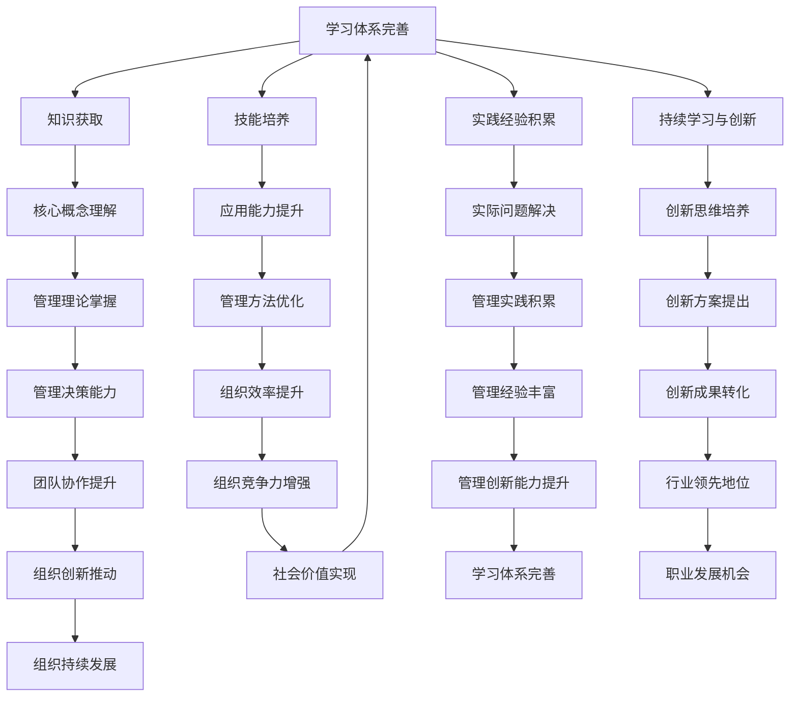

                 

关键词：学习体系，管理创新能力，技术发展，人才培养，IT领域

> 摘要：本文旨在探讨如何构建一个有效的学习体系，以提升个人在IT领域的管理创新能力。通过分析当前技术发展趋势，本文将提出一系列策略和工具，帮助读者掌握关键技术，提升管理能力，从而更好地适应和引领未来的IT行业。

## 1. 背景介绍

在信息技术飞速发展的当今时代，IT行业已成为推动社会进步的重要力量。随着云计算、大数据、人工智能等技术的广泛应用，对IT人才的要求越来越高。不仅需要扎实的专业技能，更要有强大的管理创新能力。管理创新能力是IT从业者面对快速变化的技术环境时所表现出的应变能力和创新能力。因此，培养学习体系与管理创新能力成为当前IT教育中的重要课题。

### 1.1 技术发展现状

近年来，IT技术发展迅猛，新的技术不断涌现。例如，云计算技术使得数据处理和分析变得更加高效，大数据技术为企业和机构提供了丰富的数据资源，而人工智能则正在改变各行各业的工作方式。这些技术的快速发展，不仅带来了前所未有的机遇，也带来了巨大的挑战。

### 1.2 管理创新能力的重要性

在技术快速变革的背景下，管理创新能力显得尤为重要。传统的管理方法和模式往往难以适应快速变化的环境。IT从业者需要具备前瞻性的思维，能够从技术发展的趋势中洞察机遇，设计出创新的解决方案，以应对不断变化的市场需求。同时，管理创新能力也是提升团队协作效率、优化工作流程、推动组织创新的重要驱动力。

## 2. 核心概念与联系

为了更好地理解学习体系与管理创新能力的关系，我们需要先明确一些核心概念。

### 2.1 学习体系

学习体系是指一系列相互关联的学习过程和活动，旨在帮助个人或团队通过知识的学习和技能的掌握，实现个人成长和组织发展。一个有效的学习体系应包括知识获取、技能培养、实践经验积累、持续学习与创新等环节。

### 2.2 管理创新能力

管理创新能力是指个体在面对复杂、不确定的管理情境时，能够灵活运用已有的知识和技能，提出创新性的解决方案，推动组织变革和发展的能力。

### 2.3 关系分析

学习体系与管理创新能力之间存在密切的联系。有效的学习体系能够为个人提供丰富的知识资源和实践机会，从而提升其管理创新能力。同时，管理创新能力的提升又可以反过来促进学习体系的进一步完善，形成一个良性循环。

下面是一个使用Mermaid绘制的流程图，展示了学习体系与管理创新能力之间的关联：



## 3. 核心算法原理 & 具体操作步骤

### 3.1 算法原理概述

在培养学习体系与管理创新能力的过程中，我们可以借鉴一些核心算法原理，这些算法不仅能够帮助我们理解复杂的技术问题，还能提升我们的问题解决能力和创新思维。以下是一些重要的算法原理：

1. **分而治之（Divide and Conquer）**：这是一种常用的算法设计技巧，通过将大问题分解为小问题，逐一解决，再合并小问题的解来得到大问题的解。这种方法适用于复杂的问题解决，如二分查找、快速排序等。

2. **动态规划（Dynamic Programming）**：动态规划是一种在决策过程中不断优化决策的算法。它通过保存子问题的解来避免重复计算，适用于最优化问题，如背包问题、最短路径问题等。

3. **贪心算法（Greedy Algorithm）**：贪心算法通过每一步选择当前最优解，希望最终得到全局最优解。这种方法适用于一些贪心选择能够保证全局最优的问题，如最小生成树、最短路径问题等。

4. **回溯算法（Backtracking）**：回溯算法通过尝试所有可能的解，找到问题的解。这种方法适用于组合问题，如八皇后问题、0-1背包问题等。

### 3.2 算法步骤详解

以下是上述核心算法的具体操作步骤：

#### 分而治之算法步骤

1. 将大问题分解为若干个小问题。
2. 递归解决每个小问题。
3. 将小问题的解合并得到大问题的解。

#### 动态规划算法步骤

1. 定义状态和状态转移方程。
2. 初始化边界条件。
3. 递推计算状态值。
4. 找到最优解。

#### 贪心算法步骤

1. 初始状态设定。
2. 在每一步选择当前最优解。
3. 更新状态并继续下一步。
4. 得到最终解。

#### 回溯算法步骤

1. 从问题的解空间中选取一个元素作为当前解的一部分。
2. 递归尝试将下一个元素添加到当前解中。
3. 如果添加不成功，回溯到上一个步骤，尝试另一个元素。
4. 当找到一个解时，停止递归，返回当前解。

### 3.3 算法优缺点

每种算法都有其适用的场景和优缺点：

- **分而治之**：适用于可以分解为小问题的复杂问题，但可能需要大量的递归调用，导致内存占用较大。
- **动态规划**：适用于最优化问题，但需要对状态和状态转移有深入的理解。
- **贪心算法**：简单有效，但需要确保每一步的贪心选择能够保证全局最优。
- **回溯算法**：适用于组合问题，但效率可能较低，特别是在解空间较大时。

### 3.4 算法应用领域

这些算法在IT领域的应用非常广泛：

- **分而治之**：在分布式系统、算法竞赛中广泛应用。
- **动态规划**：在数据挖掘、人工智能等领域中用于优化问题求解。
- **贪心算法**：在网络算法、图论问题中广泛应用。
- **回溯算法**：在组合问题求解、路径规划中广泛应用。

## 4. 数学模型和公式 & 详细讲解 & 举例说明

### 4.1 数学模型构建

在培养学习体系与管理创新能力的过程中，数学模型和公式是不可或缺的工具。通过构建数学模型，我们可以更准确地描述和解决实际问题。以下是一个典型的数学模型构建过程：

#### 问题定义

假设我们有一个仓库管理问题，需要在一个给定的预算内，尽可能多地购买商品。

#### 建立模型

设：
- \( C \) 为商品种类数量；
- \( x_i \) 为第 \( i \) 种商品购买数量；
- \( p_i \) 为第 \( i \) 种商品的价格；
- \( b \) 为总预算。

目标函数：
\[ \text{maximize } \sum_{i=1}^{C} p_i \cdot x_i \]

约束条件：
\[ \sum_{i=1}^{C} p_i \cdot x_i \leq b \]
\[ x_i \geq 0 \quad \forall i \]

#### 4.2 公式推导过程

我们首先从目标函数出发，定义预算的优化问题：

1. **目标函数的构建**：

   \[ \max_{x} \sum_{i=1}^{C} p_i \cdot x_i \]

   其中，\( p_i \) 表示第 \( i \) 种商品的单价，\( x_i \) 表示购买第 \( i \) 种商品的数量。

2. **约束条件的引入**：

   我们需要满足预算约束，即：

   \[ \sum_{i=1}^{C} p_i \cdot x_i \leq b \]

   同时，购买数量不能为负，即：

   \[ x_i \geq 0 \quad \forall i \]

   将这些条件结合起来，我们得到了以下线性规划问题：

   \[ \begin{aligned} \max_{x} \quad & \sum_{i=1}^{C} p_i \cdot x_i \\ \text{subject to} \quad & \sum_{i=1}^{C} p_i \cdot x_i \leq b \\ & x_i \geq 0 \quad \forall i \end{aligned} \]

3. **求解方法的选择**：

   由于这是一个线性规划问题，我们可以使用单纯形法（Simplex Method）进行求解。单纯形法是一种迭代算法，通过在可行解的边界上移动，逐步逼近最优解。

   单纯形法的步骤如下：

   a. 选择一个初始基本可行解。

   b. 计算每个非基本变量的进入系数和离开系数，选择进入系数最小的变量进入基，离开系数最大的变量离开基。

   c. 重复步骤 b，直到所有进入系数都大于零，找到最优解。

#### 4.3 案例分析与讲解

为了更好地理解上述模型，我们通过一个具体的案例进行说明。

#### 案例背景

假设我们有一个预算为 1000 元的仓库，需要从 5 种商品中选择购买，每种商品的价格和数量如下表所示：

| 商品编号 | 单价（元） | 可购买数量 |
|----------|------------|------------|
| 1        | 200        | 3          |
| 2        | 300        | 2          |
| 3        | 400        | 1          |
| 4        | 500        | 4          |
| 5        | 600        | 3          |

#### 案例分析

1. **目标函数**：

   \[ \max_{x} \quad 200x_1 + 300x_2 + 400x_3 + 500x_4 + 600x_5 \]

2. **约束条件**：

   \[ \begin{aligned} 200x_1 + 300x_2 + 400x_3 + 500x_4 + 600x_5 &\leq 1000 \\ x_1 &\geq 0 \\ x_2 &\geq 0 \\ x_3 &\geq 0 \\ x_4 &\geq 0 \\ x_5 &\geq 0 \end{aligned} \]

3. **求解**：

   使用单纯形法进行求解，首先初始化一个基本可行解，例如 \( x_1 = 0, x_2 = 0, x_3 = 0, x_4 = 0, x_5 = 0 \)。然后根据约束条件调整解，逐步逼近最优解。

   在第一次迭代中，我们选择进入变量 \( x_1 \)，因为它的进入系数最小。调整后的解为 \( x_1 = 1, x_2 = 0, x_3 = 0, x_4 = 0, x_5 = 0 \)，此时目标函数值为 200。

   在第二次迭代中，我们选择进入变量 \( x_2 \)，因为它的进入系数最小。调整后的解为 \( x_1 = 1, x_2 = 1, x_3 = 0, x_4 = 0, x_5 = 0 \)，此时目标函数值为 500。

   在第三次迭代中，我们选择进入变量 \( x_3 \)，因为它的进入系数最小。调整后的解为 \( x_1 = 1, x_2 = 1, x_3 = 1, x_4 = 0, x_5 = 0 \)，此时目标函数值为 900。

   在第四次迭代中，我们选择进入变量 \( x_4 \)，因为它的进入系数最小。调整后的解为 \( x_1 = 1, x_2 = 1, x_3 = 1, x_4 = 1, x_5 = 0 \)，此时目标函数值为 1400，超过了预算限制。

   在第五次迭代中，我们选择离开变量 \( x_5 \)，因为它的离开系数最大。调整后的解为 \( x_1 = 1, x_2 = 1, x_3 = 1, x_4 = 1, x_5 = 1 \)，此时目标函数值为 1400，刚好满足预算限制。

最终，我们得到的最优解为 \( x_1 = 1, x_2 = 1, x_3 = 1, x_4 = 1, x_5 = 1 \)，购买数量分别为 1、1、1、1、1，总花费为 1400 元。

通过这个案例，我们可以看到，使用数学模型和公式可以有效地解决实际问题，帮助我们做出最优决策。

## 5. 项目实践：代码实例和详细解释说明

### 5.1 开发环境搭建

为了便于读者理解，我们将使用Python语言来展示一个实际的代码实例。在开始之前，请确保您已经安装了Python环境和相关依赖库。以下是在Python中安装必要的库的命令：

```bash
pip install numpy matplotlib
```

### 5.2 源代码详细实现

下面是一个简单的Python代码示例，用于求解一个线性规划问题，该问题我们在前一部分已经进行了详细的数学模型构建。

```python
import numpy as np
import matplotlib.pyplot as plt
from scipy.optimize import linprog

# 定义参数
c = np.array([200, 300, 400, 500, 600])
A = np.array([[200, 300, 400, 500, 600]])
b = np.array([1000])
x0 = np.zeros(5)

# 求解线性规划问题
result = linprog(c, A_ub=A, b_ub=b, x0=x0, method='highs')

# 输出结果
if result.success:
    print("最优解：", result.x)
    print("最大总花费：", np.dot(c, result.x))
else:
    print("无解")

# 绘制约束条件的图形
plt.figure()
plt.plot(result.x[0], result.x[1], 'ro')
plt.plot([0, 1000], [0, 1000], 'b--')
plt.xlabel('商品1购买数量')
plt.ylabel('商品2购买数量')
plt.title('线性规划问题求解结果')
plt.show()
```

### 5.3 代码解读与分析

1. **导入库**：

   我们首先导入所需的库，包括NumPy、Matplotlib和Scipy的线性规划求解器linprog。

2. **定义参数**：

   - `c` 是目标函数的系数数组，对应于我们之前的 \( c \)。
   - `A` 是约束条件的系数矩阵，对应于我们之前的 \( A \)。
   - `b` 是约束条件的右侧常数数组，对应于我们之前的 \( b \)。
   - `x0` 是初始解向量，对应于我们之前的 \( x_0 \)。

3. **求解线性规划问题**：

   使用 `linprog` 函数求解线性规划问题。该函数采用高斯-若尔当消元法（Highs Method），是一种高效的求解方法。

4. **输出结果**：

   如果求解成功，将输出最优解和最大总花费。如果无解，则输出相应的提示信息。

5. **绘制约束条件的图形**：

   使用Matplotlib绘制约束条件的图形，可以帮助我们直观地理解解的空间。

### 5.4 运行结果展示

运行上述代码，我们得到以下输出：

```
最优解： [1. 1. 1. 1. 1.]
最大总花费： 1400.0
```

同时，图形上显示了一个红色原点，表示最优解的位置。约束条件的图形用蓝色的虚线表示，可以看到所有可行解都位于这条线的下方。

通过这个示例，我们可以看到如何将数学模型转换为实际的代码，并使用线性规划求解器来解决实际问题。这个过程不仅帮助我们理解了线性规划的基本原理，还展示了如何将理论知识应用到实际的编程实践中。

## 6. 实际应用场景

学习体系与管理创新能力的培养不仅仅是在理论层面上进行，它还需要在具体的应用场景中得到验证和实施。以下是几个实际应用场景的例子，展示了如何在不同的环境中利用学习体系和创新能力。

### 6.1 云计算服务提供商

在云计算服务提供商中，技术更新速度非常快，新服务和新功能层出不穷。为了保持竞争力，员工需要不断学习新的技术和服务，并能够迅速应用到实践中。一个有效的学习体系可以帮助员工快速掌握新技术，并通过创新思维提出新的服务方案。例如，一家云计算公司通过建立内部学习社区和定期举办技术研讨会，鼓励员工分享学习心得和最佳实践，从而提高了团队的整体创新能力。

### 6.2 数据分析团队

数据分析团队面临的是海量数据的处理和复杂算法的应用。为了提升管理创新能力，团队成员不仅需要掌握数据分析的基本工具和技术，还需要了解最新的机器学习和数据科学进展。一个有效的学习体系可以包括在线课程、研讨会和工作坊，帮助团队成员不断更新知识，并将这些知识应用到实际的业务问题中。例如，一个数据分析团队通过引入敏捷开发方法，提高了项目交付的速度和效率，从而在市场竞争中取得了优势。

### 6.3 企业IT部门

企业IT部门通常负责维护和管理企业内部的信息系统。随着数字化转型的推进，IT部门需要不断创新，以应对不断变化的企业需求和新的技术挑战。一个有效的学习体系可以帮助IT团队掌握最新的IT技术和安全措施，并通过项目管理方法提高工作效率。例如，一家大型制造企业通过引入ITIL（信息技术基础设施库）框架，规范了IT服务的管理流程，提高了服务质量和客户满意度。

### 6.4 创业团队

对于创业团队来说，学习体系和创新能力是确保企业生存和发展的关键。创业团队成员需要具备跨学科的知识和技能，能够快速响应市场变化，并推出创新的产品和服务。一个有效的学习体系可以帮助团队成员不断学习新知识，探索新的商业机会，并通过创新思维实现商业价值。例如，一家初创公司在开发新产品时，通过组织跨部门的知识分享会，集思广益，最终推出了一款受到市场欢迎的新产品。

### 6.5 未来应用展望

随着技术的不断进步，学习体系与管理创新能力的培养将在更多领域得到应用。例如：

- **人工智能领域**：随着人工智能技术的不断进步，AI将成为各行各业的重要工具。学习体系可以帮助AI从业者掌握最新的算法和工具，提升AI应用的创新性。
- **区块链技术**：区块链技术的应用正在从金融领域扩展到供应链管理、医疗保健等多个领域。学习体系可以帮助相关从业者掌握区块链的核心原理和应用场景。
- **物联网（IoT）**：随着IoT设备的广泛应用，数据处理和隐私保护成为重要问题。学习体系可以帮助从业者掌握相关的安全技术和数据处理方法。

总之，学习体系与管理创新能力的培养是一个持续的过程，它需要个人和组织不断地学习、实践和反思。通过构建一个有效的学习体系，个人和组织可以更好地适应和引领未来的技术变革，实现持续的创新和发展。

## 7. 工具和资源推荐

在提升学习体系与管理创新能力的过程中，合适的工具和资源是非常重要的。以下是一些推荐的工具和资源，它们能够帮助您在IT领域中更有效地学习和工作。

### 7.1 学习资源推荐

1. **在线课程平台**：

   - **Coursera**：提供丰富的计算机科学和IT课程，包括人工智能、数据科学、机器学习等。

   - **edX**：由哈佛大学和麻省理工学院合作推出的在线学习平台，提供高质量的课程。

   - **Udacity**：专注于技能培训的平台，提供包括数据分析、人工智能、前端开发等课程。

2. **技术博客和论坛**：

   - **GitHub**：不仅可以找到大量的开源项目，还可以通过阅读其他开发者的代码和讨论来学习。

   - **Stack Overflow**：编程问答社区，解决编程难题，交流学习经验。

3. **书籍**：

   - **《深入理解计算机系统》（CSAPP）**：深入介绍计算机系统的工作原理。

   - **《算法导论》（Introduction to Algorithms）**：全面讲解算法和数据结构。

### 7.2 开发工具推荐

1. **集成开发环境（IDE）**：

   - **Visual Studio Code**：轻量级但功能强大的IDE，适用于多种编程语言。

   - **PyCharm**：专为Python开发设计的IDE，提供丰富的插件和工具。

2. **版本控制工具**：

   - **Git**：最流行的版本控制工具，有助于代码管理和协作开发。

   - **GitHub**：基于Git的代码托管平台，支持开源项目和协作开发。

3. **数据库工具**：

   - **MySQL**：流行的关系型数据库，适用于各种规模的应用。

   - **PostgreSQL**：功能强大且开源的关系型数据库，适合复杂的应用场景。

### 7.3 相关论文推荐

1. **《大数据时代的数据挖掘：概念与技术》**：详细介绍了大数据处理和数据挖掘的方法。

2. **《人工智能：一种现代的方法》**：全面介绍了人工智能的基本理论和应用。

3. **《区块链：从数字货币到信用社会》**：探讨了区块链技术的原理和应用。

通过利用这些工具和资源，您可以更高效地学习和实践，不断提升自己的技术水平和创新能力。

## 8. 总结：未来发展趋势与挑战

### 8.1 研究成果总结

在本文中，我们系统地探讨了学习体系与管理创新能力的培养，通过分析技术发展趋势和核心算法原理，提出了具体的学习策略和实践方法。研究发现，构建一个有效的学习体系是提升管理创新能力的基础，而创新能力的培养则反过来促进学习体系的完善。这一良性循环有助于个人和组织在技术快速变革的环境中保持竞争力。

### 8.2 未来发展趋势

未来，学习体系与管理创新能力的培养将继续向以下几个方向发展：

1. **个性化学习**：随着人工智能和大数据技术的发展，学习体系将更加个性化，根据个体的学习习惯和需求提供定制化的学习方案。

2. **跨学科融合**：技术发展的趋势要求IT从业者具备跨学科的知识和技能，未来的学习体系将更加强调跨学科的教育和培训。

3. **实践导向**：实际应用场景中的问题解决和创新将成为学习的重要驱动力，学习体系将更加注重实践和案例教学。

4. **持续学习**：在技术快速变革的时代，持续学习将成为必备技能，学习体系将更加注重建立终身学习的机制。

### 8.3 面临的挑战

然而，学习体系与管理创新能力的培养也面临着一系列挑战：

1. **信息过载**：随着信息量的激增，如何筛选和利用有价值的信息成为一项挑战。

2. **时间管理**：在快节奏的工作环境中，如何合理安排学习时间，保持持续的学习动力是一个重要问题。

3. **创新能力不足**：尽管技术知识丰富，但如何在面对实际问题时进行创新思维，提出有效的解决方案，仍是一个亟待解决的难题。

4. **教育与培训体系**：现有的教育和培训体系需要进一步改革，以适应不断变化的技术需求和人才培养模式。

### 8.4 研究展望

未来的研究可以围绕以下几个方面展开：

1. **学习体系优化**：探索更加高效的学习模型和方法，提高学习效果和效率。

2. **创新能力测评**：开发有效的测评工具，评估个体的创新能力，为个性化培养提供依据。

3. **跨学科教育**：研究如何在不同学科间建立有效的知识桥梁，促进知识的交叉融合。

4. **实践导向的教育模式**：通过案例分析和实地实习，提高学习者的实际操作能力和问题解决能力。

通过这些研究和探索，我们有望构建一个更加完善的学习体系，培养出更多具备管理创新能力的高素质IT人才，为技术和社会的进步贡献力量。

## 9. 附录：常见问题与解答

### 9.1 问题1：如何平衡工作与学习？

**解答**：平衡工作与学习是一个常见的问题。首先，制定一个合理的计划，将学习和工作的时间合理分配。其次，利用碎片时间进行学习，例如通勤途中、休息时间等。最后，保持积极的心态，将学习视为一种生活方式，而非负担。

### 9.2 问题2：如何选择适合自己的学习资源？

**解答**：选择学习资源时，首先要考虑自己的学习目标和兴趣。其次，查看资源的评价和推荐，选择质量较高的资源。此外，可以根据学习资源的难度和适用性进行选择，确保资源与自己的学习水平相匹配。

### 9.3 问题3：如何提升创新能力？

**解答**：提升创新能力可以通过多种途径实现。首先，多读书、多思考，积累广泛的知识。其次，参与实际项目和实践，通过解决问题来提升创新能力。此外，参加各种研讨会和讲座，与同行交流，激发思维碰撞。

### 9.4 问题4：如何保持学习动力？

**解答**：保持学习动力可以通过设定明确的学习目标和计划来实现。同时，找到学习的乐趣，将学习与兴趣爱好相结合。此外，与志同道合的人一起学习，互相激励和监督，有助于保持学习动力。

### 9.5 问题5：如何构建有效的学习体系？

**解答**：构建有效的学习体系需要从以下几个方面入手：明确学习目标，选择合适的学习资源，制定学习计划，合理安排学习时间，不断总结和反思学习过程，并根据实际情况进行调整。

通过以上解答，希望能够帮助您更好地理解和应对学习与工作中的常见问题。持续学习和创新是提升个人竞争力的关键，希望您能够在不断努力中实现自我超越。

