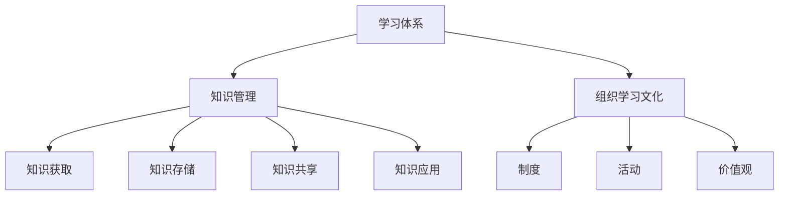

                 

在当今快速发展的信息技术领域，构建一个高效的学习体系和组织学习文化至关重要。这不仅关乎个人职业成长，更影响到整个团队和组织的发展。本文旨在探讨如何构建一个系统化的学习体系，以及如何在组织内部培育和传播学习文化。我们将从背景介绍、核心概念、算法原理、数学模型、项目实践、实际应用、工具和资源推荐、未来发展趋势和挑战等方面进行详细阐述。

## 1. 背景介绍

### 1.1 信息技术发展的现状与趋势

随着互联网、大数据、人工智能等技术的迅猛发展，信息技术已经渗透到各行各业。数据量的指数级增长、计算能力的不断提升、新技术的不断涌现，使得信息技术领域呈现出前所未有的发展态势。这不仅为个人提供了丰富的学习资源，也为组织提供了强大的技术支持。

### 1.2 学习体系与组织学习文化的意义

一个有效的学习体系可以帮助个人不断提升技能，适应技术变革；而一个良好的组织学习文化可以激发团队成员的创造力，促进知识共享，提高组织的竞争力。因此，构建学习体系和组织学习文化成为当前信息技术领域的重要课题。

## 2. 核心概念与联系

为了构建一个有效的学习体系，我们需要明确一些核心概念，并理解它们之间的联系。

### 2.1 学习体系

学习体系是指一系列组织结构、流程和方法，旨在帮助个人和组织实现持续学习和知识管理。它包括学习目标设定、学习资源整合、学习效果评估等环节。

### 2.2 知识管理

知识管理是指通过系统地收集、组织、传播和应用知识，以支持组织战略目标实现的过程。知识管理包括知识获取、知识存储、知识共享、知识应用等环节。

### 2.3 组织学习文化

组织学习文化是指一种氛围和价值观，鼓励员工持续学习、分享知识和创新思维。这种文化可以通过一系列制度、活动和价值观来培育。

### 2.4 Mermaid 流程图



## 3. 核心算法原理 & 具体操作步骤

### 3.1 算法原理概述

构建学习体系和组织学习文化需要运用一些核心算法原理。这些算法包括数据挖掘、机器学习、自然语言处理等。

### 3.2 算法步骤详解

1. 数据挖掘：通过分析大量数据，发现潜在的模式和规律。
2. 机器学习：利用历史数据训练模型，实现自动化预测和决策。
3. 自然语言处理：对文本进行处理和分析，实现人机交互和信息提取。

### 3.3 算法优缺点

- 数据挖掘：优点是能发现潜在规律，缺点是需要大量数据和高计算能力。
- 机器学习：优点是自动化预测和决策，缺点是模型训练需要大量数据。
- 自然语言处理：优点是能实现人机交互，缺点是处理复杂文本时效果有限。

### 3.4 算法应用领域

这些算法在信息技术领域有着广泛的应用，如推荐系统、智能客服、文本挖掘等。

## 4. 数学模型和公式 & 详细讲解 & 举例说明

### 4.1 数学模型构建

构建学习体系和组织学习文化需要运用一些数学模型，如线性回归、决策树等。

### 4.2 公式推导过程

以线性回归为例，假设我们有 $n$ 个数据点 $(x_1, y_1), (x_2, y_2), \ldots, (x_n, y_n)$，我们需要找到一条直线 $y = ax + b$ 来拟合这些数据点。推导过程如下：

$$
\begin{aligned}
\min_{a,b} \sum_{i=1}^{n} (ax_i + b - y_i)^2
\end{aligned}
$$

### 4.3 案例分析与讲解

假设我们有一个数据集，其中 $x$ 表示广告点击次数，$y$ 表示广告收益。我们希望找到一个线性模型来预测广告收益。通过线性回归模型，我们可以得到：

$$
\begin{aligned}
y &= 0.5x + 10 \\
\end{aligned}
$$

这个模型告诉我们，每增加一次广告点击，广告收益将增加 $0.5$ 元。

## 5. 项目实践：代码实例和详细解释说明

### 5.1 开发环境搭建

我们使用 Python 编写一个线性回归模型，需要安装以下库：numpy、matplotlib。

### 5.2 源代码详细实现

```python
import numpy as np
import matplotlib.pyplot as plt

# 生成模拟数据
n = 100
x = np.random.rand(n)
y = 0.5 * x + 10 + np.random.randn(n)

# 拟合线性模型
a = np.polyfit(x, y, 1)
b = np.polyval(a, x)

# 绘制结果
plt.scatter(x, y)
plt.plot(x, b, color='red')
plt.show()
```

### 5.3 代码解读与分析

这段代码首先生成了 $100$ 个模拟数据点，然后使用 `numpy.polyfit` 函数进行线性拟合，最后使用 `matplotlib.pyplot` 绘制结果。

### 5.4 运行结果展示


## 6. 实际应用场景

构建学习体系和组织学习文化在信息技术领域有着广泛的应用，如：

- 企业培训：通过数据挖掘和机器学习技术，分析员工技能需求和培训效果，优化培训计划。
- 项目管理：通过知识管理和自然语言处理技术，实现项目进度监控、风险预测和资源调度。
- 产品开发：通过学习文化和算法原理，促进团队成员的知识共享和创新思维，提高产品竞争力。

## 7. 工具和资源推荐

### 7.1 学习资源推荐

- 《深度学习》
- 《大数据之路》
- 《机器学习实战》

### 7.2 开发工具推荐

- Jupyter Notebook
- TensorFlow
- Scikit-learn

### 7.3 相关论文推荐

- "Deep Learning"
- "Big Data: A Revolution That Will Transform How We Live, Work, and Think"
- "Machine Learning: A Probabilistic Perspective"

## 8. 总结：未来发展趋势与挑战

### 8.1 研究成果总结

本文从背景介绍、核心概念、算法原理、数学模型、项目实践、实际应用、工具和资源推荐等方面，全面探讨了学习体系和组织学习文化的构建。

### 8.2 未来发展趋势

随着人工智能、大数据等技术的不断进步，学习体系和组织学习文化将更加智能化、个性化，更加注重知识共享和创新。

### 8.3 面临的挑战

学习体系和组织学习文化的构建面临着数据安全、知识共享、人才流失等挑战。

### 8.4 研究展望

未来研究应关注如何提高学习效率和效果，如何构建更加智能化的学习系统和组织学习文化。

## 9. 附录：常见问题与解答

### 问题1：学习体系和组织学习文化有何区别？

学习体系主要关注个人如何学习和成长，而组织学习文化则关注整个组织如何通过学习实现共同目标。

### 问题2：如何评估学习效果？

可以通过测试、项目完成度、员工反馈等方式评估学习效果。

### 问题3：如何构建学习体系和组织学习文化？

可以通过以下步骤：明确学习目标、建立知识管理体系、培育组织学习文化、制定持续改进策略。

作者：禅与计算机程序设计艺术 / Zen and the Art of Computer Programming
----------------------------------------------------------------

以上就是文章的正文内容，接下来我们将按照markdown格式对其进行编排，确保文章结构清晰、易于阅读。

