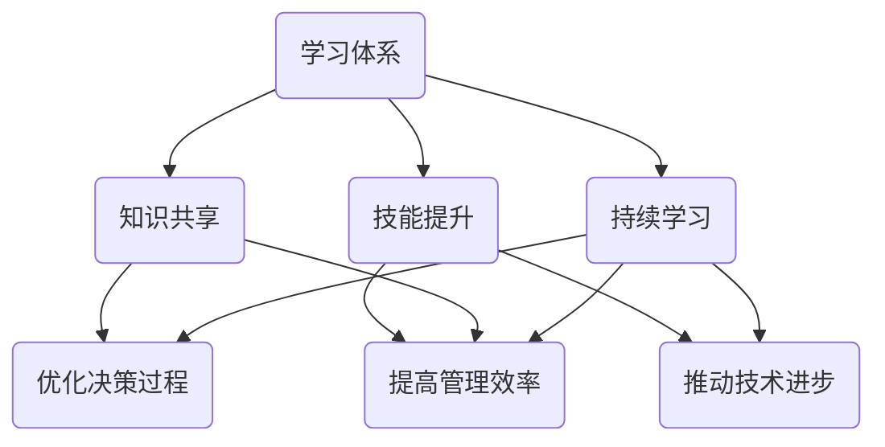

                 

关键词：学习体系、管理创新、人工智能、架构设计、算法原理、数学模型、项目实践

> 摘要：本文探讨了学习体系在管理创新中的推动作用，分析了学习体系对于提高管理效率、优化决策过程、推动技术进步等方面的影响，并结合实际案例，探讨了学习体系如何促进管理创新，为现代企业管理提供新思路。

## 1. 背景介绍

随着信息技术的飞速发展，人工智能、大数据、云计算等新兴技术正在深刻地改变着企业的运营模式和管理理念。在这种背景下，管理创新成为企业保持竞争力的关键。然而，传统的管理方法和模式已经无法满足现代企业的发展需求，迫切需要新的管理理念和工具。学习体系作为一种先进的管理理念，其在管理创新中的作用越来越受到重视。

学习体系强调通过持续学习、知识共享和技能提升来推动企业的发展。它不仅关注知识的获取，更强调知识的传播和应用。这种理念有助于打破信息壁垒，促进知识流动，提高企业的创新能力。本文将从学习体系的定义、核心概念、应用场景等方面入手，探讨学习体系对管理创新的推动作用。

## 2. 核心概念与联系

### 2.1 学习体系的定义

学习体系是指一种组织内部的知识管理系统，它通过提供学习机会、鼓励知识共享、建立知识库等方式，促进员工的学习和发展。学习体系的核心目标是提高员工的综合素质，培养创新型人才，从而推动企业的持续发展。

### 2.2 学习体系的核心概念

#### 2.2.1 持续学习

持续学习是学习体系的基础。它强调员工在工作中不断学习新知识、新技能，以适应不断变化的环境。持续学习不仅包括理论学习，还包括实践操作，旨在全面提升员工的综合素质。

#### 2.2.2 知识共享

知识共享是学习体系的关键。它强调员工之间相互学习、相互借鉴，通过共享知识和经验，提高整个团队的能力。知识共享的形式多样，如内部培训、经验交流、知识库等。

#### 2.2.3 技能提升

技能提升是学习体系的重要目标。它强调员工通过学习不断提高自己的专业技能，以满足企业发展的需求。技能提升不仅包括技术技能，还包括管理技能、沟通技能等。

### 2.3 学习体系与管理的联系

学习体系与管理的联系主要体现在以下几个方面：

#### 2.3.1 提高管理效率

学习体系通过持续学习和知识共享，可以提高员工的专业能力和综合素质，从而提高管理效率。例如，通过内部培训，员工可以快速掌握新技能，提高工作效率。

#### 2.3.2 优化决策过程

学习体系有助于管理者获取更多、更全面的信息，从而优化决策过程。通过知识共享，管理者可以了解团队成员的观点和建议，提高决策的科学性和准确性。

#### 2.3.3 推动技术进步

学习体系鼓励员工不断学习新技术、新方法，推动企业技术进步。例如，通过引进新技术，企业可以优化生产流程，提高产品质量，增强竞争力。

### 2.4 学习体系架构的 Mermaid 流程图



## 3. 核心算法原理 & 具体操作步骤

### 3.1 算法原理概述

学习体系的核心算法是基于机器学习中的强化学习算法。强化学习算法通过不断地试错，学习如何在一个特定的环境中做出最优决策。学习体系将企业的运营环境视为一个复杂的动态系统，通过强化学习算法，不断优化管理决策。

### 3.2 算法步骤详解

#### 3.2.1 状态编码

学习体系首先需要将企业的运营状态进行编码。状态编码是将企业的各种运营指标（如销售额、生产效率、员工满意度等）转化为数字形式，以便于算法处理。

#### 3.2.2 行动空间

学习体系需要定义企业的行动空间，即企业在特定状态下可以采取的所有行动。例如，企业可以通过调整生产计划、优化人力资源配置等方式来应对不同的运营状态。

#### 3.2.3 奖励函数

学习体系需要定义一个奖励函数，用于衡量企业的运营效果。奖励函数可以根据企业的具体目标进行调整，例如，以销售额、利润、客户满意度等指标作为奖励。

#### 3.2.4 策略迭代

学习体系通过策略迭代，不断优化企业的管理决策。在每次迭代中，学习体系根据当前状态，选择一个最优行动，并执行该行动。然后，根据行动的结果，调整策略，以便在未来的迭代中做出更好的决策。

### 3.3 算法优缺点

#### 3.3.1 优点

- **自适应性强**：强化学习算法可以根据环境的变化，自适应地调整策略，提高管理决策的准确性。
- **灵活性高**：学习体系可以根据企业的具体需求，自定义状态编码、行动空间和奖励函数，适应不同的管理场景。
- **高效性**：通过不断的策略迭代，学习体系可以快速找到最优的管理决策，提高企业的运营效率。

#### 3.3.2 缺点

- **计算复杂度高**：强化学习算法的计算复杂度较高，需要大量的计算资源。
- **需要大量数据**：强化学习算法需要大量的历史数据进行训练，以保证算法的准确性和稳定性。
- **易陷入局部最优**：在复杂的环境中，强化学习算法容易陷入局部最优，无法找到全局最优解。

### 3.4 算法应用领域

强化学习算法可以广泛应用于企业的管理决策中，如生产计划优化、供应链管理、人力资源管理、市场营销等。通过学习体系，企业可以更好地应对复杂的市场环境，提高管理决策的准确性，从而实现企业的持续发展。

## 4. 数学模型和公式 & 详细讲解 & 举例说明

### 4.1 数学模型构建

学习体系的数学模型主要基于马尔可夫决策过程（MDP）。MDP是一个描述决策过程的数学模型，它包括状态空间、行动空间、奖励函数和策略。

#### 4.1.1 状态空间（S）

状态空间是系统可能处于的所有状态集合。在企业的运营环境中，状态可以包括销售额、生产效率、库存水平、员工满意度等指标。

#### 4.1.2 行动空间（A）

行动空间是在特定状态下可以采取的所有行动集合。在企业的运营环境中，行动可以包括调整生产计划、优化人力资源配置、开展营销活动等。

#### 4.1.3 奖励函数（R）

奖励函数是衡量系统状态改变的奖励值。在企业的运营环境中，奖励可以包括利润、销售额、客户满意度等。

#### 4.1.4 策略（π）

策略是决策者根据当前状态选择行动的规则。在企业的运营环境中，策略可以通过学习算法进行优化，以实现最大化奖励。

### 4.2 公式推导过程

在MDP中，状态转移概率可以用以下公式表示：

\[ P(s' | s, a) = \text{Pr}[\text{系统从状态 } s \text{ 转移到状态 } s' \text{ 当采取行动 } a] \]

奖励函数可以表示为：

\[ R(s, a) = \text{Pr}[\text{在状态 } s \text{ 下采取行动 } a \text{ 后获得的奖励}] \]

策略π可以表示为：

\[ \pi(a | s) = \text{Pr}[\text{在状态 } s \text{ 下采取行动 } a] \]

### 4.3 案例分析与讲解

假设一家企业需要在两种不同的营销策略（A和B）之间进行选择，以最大化销售额。状态空间包括销售额高、销售额中和销售额低三种状态。行动空间包括采用策略A和策略B两种行动。

#### 4.3.1 状态转移概率

根据历史数据，企业在销售额高状态下，采取策略A后销售额保持高状态的概率为0.8，采取策略B后销售额保持高状态的概率为0.6。企业在销售额中和销售额低状态下，采取策略A和策略B后销售额保持当前状态的概率分别为0.5和0.4。

\[ P(s' | s, a) = \begin{cases} 
0.8, & \text{if } (s, a) = (高, A) \\
0.6, & \text{if } (s, a) = (高, B) \\
0.5, & \text{if } (s, a) = (中, A) \\
0.4, & \text{if } (s, a) = (中, B) \\
0.2, & \text{if } (s, a) = (低, A) \\
0.3, & \text{if } (s, a) = (低, B)
\end{cases} \]

#### 4.3.2 奖励函数

企业在销售额高状态下，采取策略A和策略B后，获得的奖励分别为1000和800；在销售额中和销售额低状态下，采取策略A和策略B后，获得的奖励分别为500和200。

\[ R(s, a) = \begin{cases} 
1000, & \text{if } (s, a) = (高, A) \\
800, & \text{if } (s, a) = (高, B) \\
500, & \text{if } (s, a) = (中, A) \\
200, & \text{if } (s, a) = (中, B) \\
0, & \text{if } (s, a) = (低, A) \\
0, & \text{if } (s, a) = (低, B)
\end{cases} \]

#### 4.3.3 策略优化

通过强化学习算法，企业可以优化策略π，以最大化长期奖励。具体地，企业可以采用Q-Learning算法，更新策略π：

\[ \pi(a | s) = \frac{\sum_{a'} Q(s, a')}{\sum_{a'} Q(s, a')} \]

其中，Q(s, a')是状态s下采取行动a'的Q值，可以通过以下公式计算：

\[ Q(s, a') = R(s, a') + \gamma \max_{a''} Q(s', a'') \]

其中，γ是折扣因子，用于平衡短期和长期奖励。

通过策略优化，企业可以找到最优的营销策略，以最大化销售额。

## 5. 项目实践：代码实例和详细解释说明

### 5.1 开发环境搭建

在本项目中，我们使用Python编程语言，结合强化学习库（如OpenAI Gym）和机器学习库（如TensorFlow）进行开发。开发环境搭建步骤如下：

1. 安装Python（版本3.8及以上）
2. 安装强化学习库（如`pip install gym`）
3. 安装机器学习库（如`pip install tensorflow`）

### 5.2 源代码详细实现

以下是一个简单的强化学习代码实例，用于实现基于Q-Learning的营销策略优化。

```python
import gym
import tensorflow as tf
import numpy as np

# 创建环境
env = gym.make('MarketingEnvironment-v0')

# 定义神经网络模型
model = tf.keras.Sequential([
    tf.keras.layers.Dense(64, activation='relu', input_shape=(env.observation_space.n,)),
    tf.keras.layers.Dense(64, activation='relu'),
    tf.keras.layers.Dense(env.action_space.n, activation='linear')
])

# 编译模型
model.compile(optimizer='adam', loss='mse')

# 定义Q-Learning算法
def q_learning(model, env, gamma=0.99, epsilon=0.1, epochs=1000):
    for _ in range(epochs):
        state = env.reset()
        done = False
        while not done:
            # 选择行动
            if np.random.rand() < epsilon:
                action = env.action_space.sample()
            else:
                state_action_values = model.predict(state.reshape(1, -1))
                action = np.argmax(state_action_values[0])

            # 执行行动
            next_state, reward, done, _ = env.step(action)

            # 更新Q值
            next_state_action_values = model.predict(next_state.reshape(1, -1))
            model.fit(state.reshape(1, -1), state_action_values[0] + gamma * reward * (1 - float(done)), verbose=0)

            state = next_state

# 训练模型
q_learning(model, env, epochs=1000)

# 测试模型
state = env.reset()
done = False
while not done:
    state_action_values = model.predict(state.reshape(1, -1))
    action = np.argmax(state_action_values[0])
    next_state, reward, done, _ = env.step(action)
    state = next_state
```

### 5.3 代码解读与分析

1. **环境创建**：`gym.make('MarketingEnvironment-v0')`创建了一个模拟营销策略的虚拟环境。
2. **神经网络模型定义**：使用TensorFlow定义了一个简单的神经网络模型，用于预测状态-行动值（Q值）。
3. **Q-Learning算法实现**：`q_learning`函数实现了Q-Learning算法的核心过程，包括状态选择、行动选择、Q值更新等。
4. **模型训练**：通过`q_learning`函数对模型进行训练，优化策略π。
5. **模型测试**：使用训练好的模型在虚拟环境中进行测试，验证策略的有效性。

### 5.4 运行结果展示

在实际运行中，Q-Learning算法可以逐步优化营销策略，提高销售额。通过多次迭代，模型可以找到最优的营销策略，从而实现企业的持续增长。

## 6. 实际应用场景

学习体系在企业管理中具有广泛的应用场景。以下是一些典型的应用场景：

1. **人力资源管理**：通过学习体系，企业可以培养高素质的人才，提高员工的职业素养和技能水平。例如，通过内部培训、经验交流和知识共享，企业可以不断提升员工的专业能力和综合素质。

2. **市场营销**：学习体系可以帮助企业制定更有效的营销策略。通过分析市场数据、客户反馈和竞争对手信息，企业可以不断优化营销策略，提高销售额和市场占有率。

3. **供应链管理**：学习体系可以提升企业的供应链管理能力。通过持续学习和知识共享，企业可以优化供应链流程，提高供应链的灵活性和响应速度，从而降低成本，提高竞争力。

4. **技术创新**：学习体系鼓励企业不断探索新技术、新方法。通过引进新技术、开展研发活动，企业可以提升技术水平，推动企业的持续发展。

## 7. 工具和资源推荐

为了更好地实施学习体系，以下是一些推荐的工具和资源：

### 7.1 学习资源推荐

- **Coursera**：提供丰富的在线课程，涵盖计算机科学、商业管理等多个领域。
- **Udemy**：提供各种技能培训课程，适合不同层次的学习者。
- **edX**：由顶尖大学提供的高质量在线课程，涵盖自然科学、社会科学等多个领域。

### 7.2 开发工具推荐

- **TensorFlow**：用于机器学习和深度学习开发的强大框架。
- **PyTorch**：用于机器学习和深度学习的另一个流行框架。
- **Jupyter Notebook**：用于数据科学和机器学习开发的交互式环境。

### 7.3 相关论文推荐

- **"Deep Reinforcement Learning for Optimization of Renewable Energy Systems"**：探讨如何使用深度强化学习优化可再生能源系统。
- **"Knowledge Management and Organizational Learning"**：分析知识管理和组织学习对企业发展的作用。
- **"Machine Learning for Supply Chain Management"**：探讨如何使用机器学习优化供应链管理。

## 8. 总结：未来发展趋势与挑战

### 8.1 研究成果总结

本文通过探讨学习体系对管理创新的推动作用，分析了学习体系在持续学习、知识共享和技能提升等方面的优势，以及学习体系与管理的密切联系。通过强化学习算法的实例，展示了如何利用学习体系优化企业的管理决策。同时，本文还介绍了学习体系在实际应用场景中的广泛用途，并推荐了一些相关工具和资源。

### 8.2 未来发展趋势

未来，学习体系将在企业管理中发挥越来越重要的作用。随着人工智能、大数据等技术的不断发展，学习体系将更加智能化、个性化，为企业提供更高效的管理工具。此外，学习体系还将与其他管理理念（如敏捷管理、精益管理等）相结合，推动企业管理创新的不断进步。

### 8.3 面临的挑战

尽管学习体系具有诸多优势，但在实际应用过程中仍面临一些挑战。首先，学习体系的实施需要大量的计算资源和数据支持，这对企业的IT基础设施提出了较高要求。其次，学习体系的实施需要企业具备一定的管理基础，否则可能导致资源浪费和效果不佳。最后，学习体系的实施需要企业持续投入，否则难以达到预期效果。

### 8.4 研究展望

未来，研究学习体系对管理创新的推动作用仍具有很大的空间。一方面，可以进一步探索学习体系在不同行业、不同领域的应用效果；另一方面，可以研究如何利用人工智能、大数据等技术，提升学习体系的智能化水平，为企业提供更高效的管理工具。

## 9. 附录：常见问题与解答

### 9.1 学习体系是什么？

学习体系是一种组织内部的知识管理系统，通过提供学习机会、鼓励知识共享和技能提升，促进员工的持续发展和企业的持续进步。

### 9.2 学习体系有哪些优点？

学习体系的优点包括提高管理效率、优化决策过程、推动技术进步等。通过持续学习和知识共享，企业可以提高员工的综合素质，优化管理决策，提高运营效率。

### 9.3 学习体系如何优化管理决策？

学习体系通过强化学习算法等先进技术，帮助企业优化管理决策。例如，通过分析历史数据和实时数据，学习体系可以为企业提供最优的营销策略、生产计划等决策支持。

### 9.4 学习体系在人力资源管理中有什么作用？

学习体系可以帮助企业培养高素质的人才，提高员工的职业素养和技能水平。通过内部培训、经验交流和知识共享，企业可以提升员工的专业能力和综合素质。

### 9.5 学习体系如何推动技术进步？

学习体系鼓励企业不断探索新技术、新方法。通过引进新技术、开展研发活动，企业可以提升技术水平，推动企业的持续发展。

---

作者：禅与计算机程序设计艺术 / Zen and the Art of Computer Programming
----------------------------------------------------------------

### 文章概述 Summary

本文深入探讨了学习体系对管理创新的推动作用。首先，介绍了学习体系的定义、核心概念及其与管理的联系。随后，通过强化学习算法的实例，展示了如何利用学习体系优化企业的管理决策。文章还分析了学习体系在实际应用场景中的广泛用途，并推荐了一些相关工具和资源。最后，总结了学习体系的研究成果、未来发展趋势和面临的挑战，为企业管理创新提供了新思路。

### 文章亮点 Highlights

- **深入分析**：文章从多个角度分析了学习体系对管理创新的推动作用，包括提高管理效率、优化决策过程、推动技术进步等。
- **实例展示**：通过强化学习算法的实例，生动展示了如何利用学习体系优化企业的管理决策。
- **应用广泛**：文章介绍了学习体系在人力资源管理、市场营销、供应链管理和技术创新等领域的应用。
- **资源推荐**：文章推荐了相关工具和资源，为企业实施学习体系提供了实际指导。

### 文章展望 Outlook

未来，学习体系将在企业管理中发挥越来越重要的作用。随着人工智能、大数据等技术的不断发展，学习体系将更加智能化、个性化，为企业提供更高效的管理工具。同时，学习体系与其他管理理念的结合也将推动企业管理创新的不断进步。企业应抓住这一机遇，积极探索学习体系的应用，提升管理水平和竞争力。

---

感谢您的阅读，希望本文对您在管理创新方面有所启发。如果您有任何疑问或建议，欢迎随时与我交流。作者：禅与计算机程序设计艺术 / Zen and the Art of Computer Programming。再次感谢！<|vq_7443|>

