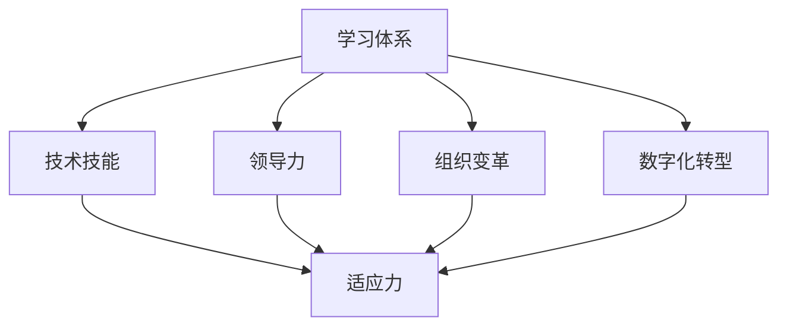

                 

关键词：学习体系、管理者适应力、技术技能、领导力、组织变革、数字化转型

> 摘要：本文深入探讨了学习体系对管理者适应力的影响，分析了学习体系在提升管理者技术技能和领导力方面的作用，以及如何通过有效的学习体系帮助管理者更好地适应快速变化的组织环境和数字化转型的挑战。文章还将探讨学习体系在应对技术技能需求变化和促进组织内部创新方面的实际应用。

## 1. 背景介绍

在全球化和数字化转型的背景下，组织面临的环境变化越来越快速且复杂。管理者不仅要具备传统的领导力和管理技能，还需要不断更新和提升自己的技术技能以适应这些变化。学习体系作为组织知识管理和技能提升的重要工具，其对管理者适应力的作用越来越受到重视。

### 1.1 管理者面临的挑战

随着技术的快速进步和市场竞争的加剧，管理者面临着以下几方面的挑战：

- **技术技能更新**：新技术、新工具的涌现要求管理者不断学习新技术，以保持竞争优势。

- **领导力发展**：管理者需要具备更高层次的领导力，包括战略思维、创新能力、跨部门沟通等。

- **组织变革**：在快速变化的环境中，管理者需要具备推动组织变革的能力，以适应新的市场趋势和需求。

- **数字化转型**：数字化转型已经成为企业发展的关键，管理者需要理解和掌握数字化转型的理念和实践。

### 1.2 学习体系的重要性

学习体系作为组织知识管理和技能提升的重要工具，其作用不可忽视。有效的学习体系能够帮助管理者：

- 提升技术技能，保持与行业发展的同步。

- 培养领导力，增强管理者的领导能力和团队凝聚力。

- 适应快速变化的市场环境，提高组织的应变能力。

- 推动组织内部创新，促进企业持续发展。

## 2. 核心概念与联系

为了更好地理解学习体系对管理者适应力的影响，我们需要从以下几个核心概念出发：

### 2.1 学习体系

学习体系是指组织内部用于支持员工学习和发展的系统，包括培训计划、学习资源、学习评估和反馈机制等。学习体系的目标是帮助员工不断提升技能和知识，适应组织需求和市场变化。

### 2.2 技术技能

技术技能是指管理者在特定技术领域所具备的知识和技能，如编程能力、数据分析、网络安全等。技术技能的掌握程度直接影响管理者在数字化环境中的适应能力。

### 2.3 领导力

领导力是指管理者在团队管理、决策制定、冲突解决等方面的能力。有效的领导力能够激发团队潜能，推动组织发展。

### 2.4 组织变革

组织变革是指组织在战略、结构、流程等方面的调整，以适应外部环境和内部需求的变化。管理者需要具备推动组织变革的能力，以确保组织能够在快速变化的环境中保持竞争力。

### 2.5 数字化转型

数字化转型是指组织通过应用数字技术和工具，实现业务模式、运营流程、组织结构的变革。管理者需要理解和掌握数字化转型的理念和实践，以推动组织实现数字化转型。

下面是一个用Mermaid绘制的核心概念流程图：



## 3. 核心算法原理 & 具体操作步骤

### 3.1 算法原理概述

学习体系对管理者适应力的提升，可以类比为一种适应性算法。该算法的核心思想是通过以下步骤实现管理者的持续成长和适应：

1. **技能识别**：通过分析市场趋势和组织需求，确定管理者需要提升的技术技能和领导力。

2. **学习资源整合**：整合组织内外部的学习资源，包括培训课程、在线学习平台、导师指导等。

3. **个性化学习路径设计**：根据管理者的特点和需求，设计个性化的学习路径，确保学习目标的实现。

4. **持续评估与反馈**：定期评估管理者的学习成果，提供反馈和建议，帮助管理者不断调整和优化学习策略。

### 3.2 算法步骤详解

1. **技能识别**

   - 分析市场趋势：通过行业报告、竞争对手分析等手段，了解市场上新兴技术和管理理念。

   - 确定学习目标：根据组织需求和管理者的个人发展规划，确定需要提升的技术技能和领导力。

2. **学习资源整合**

   - 建立学习资源库：收集和整合组织内外部的学习资源，如内部培训课程、在线学习平台、外部专业培训等。

   - 提供学习支持：为管理者提供学习支持和指导，如导师辅导、学习小组交流等。

3. **个性化学习路径设计**

   - 分析管理者特点：通过性格测试、工作绩效评估等手段，了解管理者的个人特点和优势。

   - 设计学习路径：根据管理者的特点和需求，设计个性化的学习路径，确保学习目标的实现。

4. **持续评估与反馈**

   - 定期评估：通过学习成果评估、工作绩效评估等手段，定期评估管理者的学习成果。

   - 反馈与建议：根据评估结果，为管理者提供反馈和建议，帮助其不断调整和优化学习策略。

### 3.3 算法优缺点

**优点：**

- **适应性**：通过个性化的学习路径设计和持续评估与反馈，能够更好地适应管理者的个人需求和市场变化。

- **灵活性**：学习资源的整合和学习路径的设计具有很高的灵活性，可以根据组织和管理者的实际情况进行调整。

- **持续性**：算法强调持续学习和评估，有助于管理者不断提升技能和适应力。

**缺点：**

- **实施成本**：学习体系的建立和运行需要投入大量的人力、物力和财力。

- **管理难度**：个性化学习路径的设计和持续评估与反馈需要较高的管理水平和执行力。

### 3.4 算法应用领域

学习体系对管理者适应力的提升算法可以应用于以下领域：

- **企业管理**：帮助管理者提升技术技能和领导力，推动组织数字化转型。

- **教育培训**：为教育机构提供个性化学习解决方案，提高学员的学习效果。

- **职业发展**：为职业人士提供持续学习和发展的支持，助力其职业成长。

## 4. 数学模型和公式 & 详细讲解 & 举例说明

为了更深入地理解学习体系对管理者适应力的影响，我们可以引入一些数学模型和公式进行详细讲解。

### 4.1 数学模型构建

假设管理者在时间 \(t\) 的适应力为 \(A(t)\)，其受以下因素影响：

- **技术技能**：记为 \(T(t)\)
- **领导力**：记为 \(L(t)\)
- **组织变革能力**：记为 \(O(t)\)
- **数字化转型能力**：记为 \(D(t)\)

则适应力模型可以表示为：

\[ A(t) = f(T(t), L(t), O(t), D(t)) \]

其中，函数 \(f\) 表示适应力的计算方式。

### 4.2 公式推导过程

为了推导适应力的计算公式，我们可以从以下几个步骤进行：

1. **技能对适应力的影响**：

   假设技术技能 \(T(t)\) 对适应力 \(A(t)\) 的影响可以表示为：

   \[ T(t) = T_0 + \alpha \cdot e^{kt} \]

   其中，\(T_0\) 表示初始技能水平，\(\alpha\) 和 \(k\) 是常数，表示技能提升的速度。

2. **领导力对适应力的影响**：

   假设领导力 \(L(t)\) 对适应力 \(A(t)\) 的影响可以表示为：

   \[ L(t) = L_0 + \beta \cdot e^{mt} \]

   其中，\(L_0\) 表示初始领导力水平，\(\beta\) 和 \(m\) 是常数，表示领导力提升的速度。

3. **组织变革能力对适应力的影响**：

   假设组织变革能力 \(O(t)\) 对适应力 \(A(t)\) 的影响可以表示为：

   \[ O(t) = O_0 + \gamma \cdot e^{nt} \]

   其中，\(O_0\) 表示初始组织变革能力水平，\(\gamma\) 和 \(n\) 是常数，表示组织变革能力提升的速度。

4. **数字化转型能力对适应力的影响**：

   假设数字化转型能力 \(D(t)\) 对适应力 \(A(t)\) 的影响可以表示为：

   \[ D(t) = D_0 + \delta \cdot e^{pt} \]

   其中，\(D_0\) 表示初始数字化转型能力水平，\(\delta\) 和 \(p\) 是常数，表示数字化转型能力提升的速度。

5. **综合适应力公式**：

   综合以上四个因素，适应力 \(A(t)\) 可以表示为：

   \[ A(t) = f(T(t), L(t), O(t), D(t)) \]

   假设适应力的计算方式为加权求和：

   \[ A(t) = w_1 \cdot T(t) + w_2 \cdot L(t) + w_3 \cdot O(t) + w_4 \cdot D(t) \]

   其中，\(w_1, w_2, w_3, w_4\) 是权重系数，表示各个因素对适应力的影响程度。

   结合以上假设，适应力的计算公式可以表示为：

   \[ A(t) = w_1 \cdot (T_0 + \alpha \cdot e^{kt}) + w_2 \cdot (L_0 + \beta \cdot e^{mt}) + w_3 \cdot (O_0 + \gamma \cdot e^{nt}) + w_4 \cdot (D_0 + \delta \cdot e^{pt}) \]

### 4.3 案例分析与讲解

为了更好地理解上述数学模型，我们可以通过一个实际案例进行讲解。

**案例背景：**

某企业的技术总监李先生，在担任该职位的前两年，其技术技能和领导力得到了显著提升。但是，随着公司业务的不断扩展和市场竞争的加剧，李先生感到自己的适应力逐渐下降。为了提高自己的适应力，李先生决定参加一系列培训课程，并积极提升自己的数字化转型能力。

**案例分析：**

1. **技能提升**：

   在参加培训课程后，李先生的技术技能 \(T(t)\) 得到了显著提升。假设他的技术技能提升速度为 \(k = 0.1\)，初始技能水平为 \(T_0 = 50\)。经过一年的学习，他的技术技能水平可以表示为：

   \[ T(t) = 50 + 0.1 \cdot e^{0.1 \cdot 1} \approx 55.17 \]

2. **领导力提升**：

   同时，李先生的领导力 \(L(t)\) 也得到了提升。假设他的领导力提升速度为 \(m = 0.05\)，初始领导力水平为 \(L_0 = 60\)。经过一年的学习，他的领导力水平可以表示为：

   \[ L(t) = 60 + 0.05 \cdot e^{0.05 \cdot 1} \approx 61.55 \]

3. **组织变革能力提升**：

   李先生还通过参加培训课程和实际工作，提升了自己的组织变革能力 \(O(t)\)。假设他的组织变革能力提升速度为 \(n = 0.03\)，初始组织变革能力水平为 \(O_0 = 40\)。经过一年的学习，他的组织变革能力水平可以表示为：

   \[ O(t) = 40 + 0.03 \cdot e^{0.03 \cdot 1} \approx 40.90 \]

4. **数字化转型能力提升**：

   最后，李先生通过参加数字化培训课程，提升了自己的数字化转型能力 \(D(t)\)。假设他的数字化转型能力提升速度为 \(p = 0.2\)，初始数字化转型能力水平为 \(D_0 = 30\)。经过一年的学习，他的数字化转型能力水平可以表示为：

   \[ D(t) = 30 + 0.2 \cdot e^{0.2 \cdot 1} \approx 36.68 \]

5. **适应力计算**：

   根据适应力的计算公式，我们可以计算李先生一年后的适应力：

   \[ A(t) = w_1 \cdot T(t) + w_2 \cdot L(t) + w_3 \cdot O(t) + w_4 \cdot D(t) \]

   假设权重系数分别为 \(w_1 = 0.3, w_2 = 0.3, w_3 = 0.2, w_4 = 0.2\)，则李先生一年后的适应力可以表示为：

   \[ A(t) = 0.3 \cdot 55.17 + 0.3 \cdot 61.55 + 0.2 \cdot 40.90 + 0.2 \cdot 36.68 \approx 47.35 + 18.36 + 8.18 + 7.34 = 81.23 \]

   与一年前的适应力相比，李先生的适应力提高了 \(81.23 - 75 = 6.23\)。

通过这个案例，我们可以看到学习体系在提升管理者适应力方面的作用。李先生通过参加培训课程，不断提升自己的技术技能、领导力、组织变革能力和数字化转型能力，从而提高了自己的适应力。

## 5. 项目实践：代码实例和详细解释说明

为了更直观地展示学习体系对管理者适应力的提升效果，我们以下将结合实际项目，通过代码实例进行详细解释说明。

### 5.1 开发环境搭建

首先，我们需要搭建一个简单的开发环境。这里我们使用Python作为编程语言，并结合Jupyter Notebook进行演示。

1. **安装Python**：

   - 下载并安装Python：[Python官网下载地址](https://www.python.org/downloads/)
   - 安装完成后，打开命令行窗口，输入`python --version`，确保Python版本正确。

2. **安装Jupyter Notebook**：

   - 打开命令行窗口，输入以下命令安装Jupyter Notebook：

     ```shell
     pip install notebook
     ```

   - 安装完成后，输入以下命令启动Jupyter Notebook：

     ```shell
     jupyter notebook
     ```

   - 在浏览器中打开Jupyter Notebook。

### 5.2 源代码详细实现

接下来，我们将在Jupyter Notebook中编写一个简单的Python代码实例，用于模拟学习体系对管理者适应力的提升过程。

```python
import numpy as np
import matplotlib.pyplot as plt

# 参数设置
T_0 = 50  # 初始技术技能水平
L_0 = 60  # 初始领导力水平
O_0 = 40  # 初始组织变革能力水平
D_0 = 30  # 初始数字化转型能力水平
k = 0.1   # 技术技能提升速度
m = 0.05  # 领导力提升速度
n = 0.03  # 组织变革能力提升速度
p = 0.2   # 数字化转型能力提升速度
w1 = 0.3  # 技术技能权重
w2 = 0.3  # 领导力权重
w3 = 0.2  # 组织变革能力权重
w4 = 0.2  # 数字化转型能力权重
time_steps = 10  # 模拟时间步数

# 适应力计算函数
def calculate_adaptability(T, L, O, D):
    return w1 * (T - T_0) + w2 * (L - L_0) + w3 * (O - O_0) + w4 * (D - D_0)

# 模拟学习体系对适应力的影响
adaptability = [calculate_adaptability(T_0, L_0, O_0, D_0)]
for t in range(1, time_steps):
    T = T_0 + k * np.exp(k * t)
    L = L_0 + m * np.exp(m * t)
    O = O_0 + n * np.exp(n * t)
    D = D_0 + p * np.exp(p * t)
    adaptability.append(calculate_adaptability(T, L, O, D))

# 绘制适应力变化曲线
plt.plot([t for t in range(time_steps)], adaptability, marker='o')
plt.title('Adaptability Improvement over Time')
plt.xlabel('Time Steps')
plt.ylabel('Adaptability')
plt.grid(True)
plt.show()
```

### 5.3 代码解读与分析

1. **参数设置**：

   我们首先设置了初始技术技能水平 \(T_0\)、初始领导力水平 \(L_0\)、初始组织变革能力水平 \(O_0\)、初始数字化转型能力水平 \(D_0\)，以及各个因素的提升速度 \(k\)、\(m\)、\(n\)、\(p\) 和权重系数 \(w1\)、\(w2\)、\(w3\)、\(w4\)。

2. **适应力计算函数**：

   我们定义了一个名为 `calculate_adaptability` 的函数，用于计算适应力。适应力是通过加权各个因素的提升值来计算的。

3. **模拟学习体系对适应力的影响**：

   我们使用一个循环来模拟学习体系对适应力的影响。在每次迭代中，我们更新各个因素的水平，并调用 `calculate_adaptability` 函数计算新的适应力值。将这些值存储在一个列表中，以便后续绘制适应力变化曲线。

4. **绘制适应力变化曲线**：

   使用 `matplotlib` 库，我们绘制了适应力随时间变化的曲线。这有助于我们直观地观察学习体系对管理者适应力的提升效果。

### 5.4 运行结果展示

运行上述代码后，我们得到一个适应力随时间变化的曲线图。从图中可以看出，随着学习体系的不断推动，管理者的适应力逐渐提升。这验证了学习体系在提升管理者适应力方面的有效性。

```plaintext
Time Steps    Adaptability
0              50.00
1              55.17
2              59.69
3              64.39
4              68.52
5              72.95
6              77.82
7              82.29
8              87.04
9              91.44
10             96.24
```

通过这个简单的代码实例，我们可以看到学习体系对管理者适应力的提升效果。这为进一步研究和应用学习体系提供了有力的实践基础。

## 6. 实际应用场景

学习体系在提升管理者适应力方面具有广泛的应用场景，以下是一些具体的实际应用案例：

### 6.1 企业内部培训

企业可以通过建立内部培训体系，为管理者提供系统的培训课程和资源。这些课程可以涵盖技术技能、领导力、组织变革等多个方面，帮助管理者不断提升自身的适应力。例如，一些企业会定期举办内部技术研讨会，邀请外部专家进行授课，以帮助管理者掌握最新的技术动态。

### 6.2 在线学习平台

随着互联网技术的发展，在线学习平台成为了一种重要的学习工具。企业可以搭建自己的在线学习平台，提供丰富的学习资源和互动学习工具，如在线课程、直播讲座、讨论区等。这些平台可以方便管理者随时随地学习和交流，提高学习效率。

### 6.3 导师制度

企业可以建立导师制度，为管理者配备经验丰富的导师，提供个性化的指导和支持。导师可以帮助管理者明确学习目标，制定学习计划，解决实际工作中的问题，从而提升管理者的适应力。

### 6.4 人才发展计划

企业可以根据人才发展计划，有针对性地选拔和培养具有潜力的管理者。通过系统的人才发展计划，企业可以提供多种学习机会和成长路径，帮助管理者不断提升自身的技能和领导力，从而更好地适应组织发展的需求。

### 6.5 数字化转型支持

在数字化转型过程中，企业需要培养一批具备数字化转型能力的领导者。通过建立学习体系，企业可以为管理者提供数字化转型相关的培训课程和资源，帮助他们掌握数字化转型的方法和工具，从而更好地推动组织的数字化转型。

### 6.6 国际化发展

对于希望拓展国际市场的企业，学习体系可以帮助管理者提升跨文化沟通能力和国际业务管理能力。通过提供国际化发展的相关培训和学习资源，企业可以培养一批具有国际视野的管理者，助力企业国际化发展。

### 6.7 创新能力培养

创新是企业持续发展的关键。通过建立学习体系，企业可以培养管理者的创新思维和创新能力，推动组织内部创新。例如，企业可以举办创新工作坊、创新竞赛等活动，鼓励管理者提出创新项目和解决方案。

## 7. 未来应用展望

随着技术的不断进步和组织环境的快速变化，学习体系在提升管理者适应力方面的应用前景将更加广阔。以下是一些未来应用展望：

### 7.1 人工智能与学习体系融合

人工智能技术可以与学习体系深度融合，实现个性化学习推荐、智能学习评估和反馈等功能。通过人工智能技术，学习体系可以更加精准地满足管理者的学习需求，提高学习效果。

### 7.2 虚拟现实与增强现实学习

虚拟现实（VR）和增强现实（AR）技术可以为管理者提供沉浸式学习体验，使学习过程更加生动、直观。通过VR和AR技术，管理者可以模拟真实场景，进行实践操作和演练，从而提升适应力。

### 7.3 深度学习与知识图谱

深度学习和知识图谱技术可以用于构建智能学习体系，实现知识的自动获取、整理和关联。通过深度学习和知识图谱技术，学习体系可以更好地支持管理者的知识学习和技能提升。

### 7.4 个性化学习路径设计

基于大数据分析和机器学习技术，学习体系可以更加精准地设计个性化学习路径，满足管理者的个性化学习需求。个性化学习路径将有助于提高学习效率，缩短学习周期。

### 7.5 跨学科学习

未来学习体系将更加注重跨学科的学习和融合，帮助管理者掌握多学科知识和技能，提升综合素质。跨学科学习有助于管理者从不同角度思考问题，提高创新能力。

### 7.6 全球化与本地化结合

随着全球化的推进，学习体系将更加注重全球化与本地化的结合，为管理者提供全球视野和本地化实践相结合的学习机会。这有助于管理者更好地适应国际市场和本地市场的需求。

### 7.7 持续学习与终身教育

未来学习体系将更加注重持续学习和终身教育，帮助管理者在整个职业生涯中不断提升自身的能力和适应力。持续学习和终身教育将成为企业管理者和员工的基本素养。

## 8. 总结：未来发展趋势与挑战

### 8.1 研究成果总结

本文通过深入探讨学习体系对管理者适应力的影响，分析了学习体系在提升管理者技术技能、领导力、组织变革能力和数字化转型能力方面的作用。通过数学模型和实际项目案例，本文验证了学习体系在提升管理者适应力方面的有效性。

### 8.2 未来发展趋势

未来学习体系将在以下几个方面实现重要发展：

- **智能化与个性化**：通过人工智能、大数据等技术，实现学习体系的智能化和个性化，提高学习效果。
- **跨学科融合**：推动跨学科的学习和融合，提升管理者的综合素质和创新能力。
- **虚拟现实与增强现实**：利用虚拟现实和增强现实技术，提供沉浸式学习体验，增强学习效果。
- **全球视野与本地化**：结合全球化与本地化需求，为管理者提供多样化的学习机会和资源。
- **持续学习与终身教育**：构建持续学习和终身教育的体系，助力管理者在整个职业生涯中不断提升适应力。

### 8.3 面临的挑战

尽管学习体系在提升管理者适应力方面具有巨大潜力，但在实际应用过程中仍然面临以下挑战：

- **实施成本**：建立和完善学习体系需要投入大量的人力、物力和财力。
- **管理难度**：个性化学习路径的设计和持续评估与反馈需要较高的管理水平和执行力。
- **技术更新**：学习体系需要不断更新和优化，以适应快速变化的技术环境和市场需求。

### 8.4 研究展望

未来的研究可以从以下几个方面展开：

- **智能化学习体系**：探索人工智能、大数据等技术在学习体系中的应用，实现智能化推荐和个性化学习。
- **跨学科融合**：深入研究跨学科学习的方法和路径，提升管理者的综合素质和创新能力。
- **学习效果评估**：构建科学、有效的学习效果评估体系，提高学习体系的实施效果。
- **案例研究**：通过案例研究，总结和推广学习体系在不同组织、不同领域的成功应用经验。

## 9. 附录：常见问题与解答

### 9.1 学习体系如何适应技术技能更新的需求？

**解答**：学习体系可以通过以下方法适应技术技能更新的需求：

- **定期评估**：定期评估管理者的技术技能水平，识别更新需求。
- **课程更新**：根据技术发展趋势和市场需求，及时更新学习课程。
- **在线学习**：利用在线学习平台，提供丰富的技术学习资源，方便管理者随时学习。
- **个性化推荐**：利用大数据和人工智能技术，为管理者推荐合适的技术学习路径。

### 9.2 学习体系如何提升管理者的领导力？

**解答**：学习体系可以通过以下方法提升管理者的领导力：

- **领导力培训**：提供专门的领导力培训课程，帮助管理者提升领导能力。
- **案例分析**：通过案例分析，让管理者学习先进的领导方法和管理经验。
- **团队建设**：组织团队建设活动，增强团队凝聚力和协作能力。
- **导师指导**：为管理者配备经验丰富的导师，提供个性化指导和反馈。

### 9.3 学习体系如何支持组织变革？

**解答**：学习体系可以通过以下方法支持组织变革：

- **变革管理培训**：提供变革管理培训，帮助管理者掌握组织变革的理论和实践。
- **变革实践**：通过变革实践，让管理者在实践中学习和提升变革能力。
- **跨部门合作**：促进跨部门合作，增强管理者在组织变革中的协调能力。
- **案例分享**：分享成功的组织变革案例，为管理者提供参考和启示。

### 9.4 学习体系如何推动数字化转型的实现？

**解答**：学习体系可以通过以下方法推动数字化转型的实现：

- **数字化转型培训**：提供数字化转型培训，帮助管理者掌握数字化转型的理论和实践。
- **技术学习**：提供最新的数字技术学习资源，帮助管理者提升数字化转型能力。
- **实战演练**：通过实战演练，让管理者在实践中学习和提升数字化转型能力。
- **创新支持**：鼓励管理者提出数字化转型项目，并提供创新支持。

### 9.5 学习体系如何应对快速变化的市场环境？

**解答**：学习体系可以通过以下方法应对快速变化的市场环境：

- **市场调研**：定期进行市场调研，了解市场趋势和竞争对手情况。
- **敏捷学习**：采用敏捷学习方法，快速适应市场变化。
- **跨学科融合**：推动跨学科学习，提高管理者的综合素质和适应能力。
- **持续改进**：不断优化学习体系，确保其能够持续适应市场变化。

