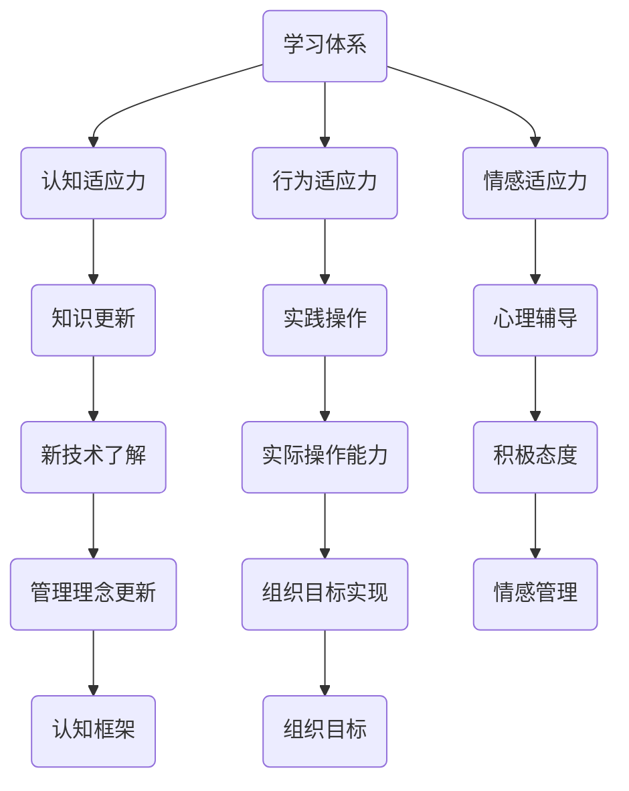

                 

关键词：学习体系、管理者适应力、管理技能、组织变革、技术发展、知识管理、领导力、持续学习。

> 摘要：本文将探讨学习体系对管理者适应力的影响，分析不同类型的学习体系如何塑造管理者的思维模式和行为方式，从而影响其适应组织变革和技术发展的能力。文章将结合实际案例，提出提升管理者适应力的策略和方法，为企业管理者提供参考。

## 1. 背景介绍

在当今快速变化的时代，企业和组织面临着前所未有的挑战。技术发展日新月异，市场竞争加剧，客户需求不断变化，这些都要求管理者具备高度的适应能力和持续学习的能力。然而，传统的学习体系往往侧重于知识和技能的传授，而忽视了管理者适应力的培养。因此，本文旨在探讨学习体系对管理者适应力的影响，以期为企业管理者提供有益的启示。

### 管理者适应力的定义

管理者适应力是指管理者在面对外部环境变化和内部挑战时，能够迅速调整自身思维模式和行为方式，以适应新的环境和实现组织目标的能力。适应力包括以下几个方面：

1. **认知适应力**：管理者能够快速理解新环境、新问题和新技术，从而形成新的认知框架和思维方式。
2. **行为适应力**：管理者能够在新环境中采取有效行动，实现组织目标。
3. **情感适应力**：管理者能够在面对挑战和变化时保持积极乐观的态度，有效管理自己的情绪。

### 学习体系的重要性

学习体系是管理者适应力培养的重要基础。一个有效的学习体系应具备以下特点：

1. **针对性**：学习内容应针对管理者的实际需求和职业发展阶段，提供个性化的学习方案。
2. **系统性**：学习体系应涵盖管理技能、知识更新、领导力等多个方面，形成完整的知识体系。
3. **灵活性**：学习体系应具备灵活性，能够根据外部环境的变化进行调整。

## 2. 核心概念与联系

为了更好地理解学习体系对管理者适应力的影响，我们需要先了解几个核心概念：

### 学习体系

学习体系是指组织为了实现学习目标，通过制定学习计划、提供学习资源、建立学习环境等一系列活动所形成的系统。学习体系可以包括以下组成部分：

1. **学习目标**：明确学习体系的目标，如提升管理技能、适应技术发展等。
2. **学习资源**：包括书籍、课程、研讨会、在线学习平台等。
3. **学习环境**：提供有利于学习的物理和心理环境。
4. **学习评价**：对学习效果进行评价，以反馈和改进学习体系。

### 管理者适应力

管理者适应力是指管理者在面对外部环境变化和内部挑战时，能够迅速调整自身思维模式和行为方式，以适应新的环境和实现组织目标的能力。适应力包括以下几个方面：

1. **认知适应力**：管理者能够快速理解新环境、新问题和新技术，从而形成新的认知框架和思维方式。
2. **行为适应力**：管理者能够在新环境中采取有效行动，实现组织目标。
3. **情感适应力**：管理者能够在面对挑战和变化时保持积极乐观的态度，有效管理自己的情绪。

### 学习体系与管理者适应力的联系

学习体系对管理者适应力的影响主要体现在以下几个方面：

1. **提升认知适应力**：通过学习，管理者能够不断更新知识，了解新的管理理念和技术，从而提升认知适应力。
2. **增强行为适应力**：学习体系提供的实践机会和模拟环境，有助于管理者将理论知识转化为实际操作能力，提高行为适应力。
3. **培养情感适应力**：学习体系中的心理辅导和情感支持，有助于管理者在面对挑战和变化时保持积极乐观的态度，提高情感适应力。

### Mermaid 流程图



## 3. 核心算法原理 & 具体操作步骤

### 3.1 算法原理概述

学习体系对管理者适应力的影响是一个复杂的过程，涉及到多个因素和环节。下面我们从以下几个步骤来具体分析这一过程：

1. **知识获取**：管理者通过学习体系获取新的知识和信息。
2. **知识整合**：管理者将新知识和已有知识进行整合，形成新的认知框架。
3. **实践应用**：管理者将新知识应用到实际工作中，提升行为适应力。
4. **反馈调整**：通过实践反馈，管理者对学习体系进行改进，以更好地适应环境和实现组织目标。

### 3.2 算法步骤详解

1. **知识获取**

   管理者通过学习体系获取新知识和信息，这些知识和信息包括：

   - **专业管理知识**：如领导力、团队管理、项目管理等。
   - **行业前沿技术**：如人工智能、大数据、云计算等。
   - **跨领域知识**：如心理学、经济学、社会学等。

   管理者可以通过以下方式获取知识：

   - **参加培训课程**：参加专业的培训课程，了解最新的管理理念和技术。
   - **阅读专业书籍**：阅读相关的专业书籍，系统学习管理知识。
   - **在线学习平台**：利用在线学习平台，灵活学习各种知识和技能。

2. **知识整合**

   管理者将新知识和已有知识进行整合，形成新的认知框架。这一过程涉及到以下几个方面：

   - **同化**：将新知识纳入到已有的认知结构中，使新知识成为已有知识的一部分。
   - **顺应**：调整已有的认知结构，以适应新的知识。
   - **平衡**：通过同化和顺应，实现认知结构的动态平衡。

3. **实践应用**

   管理者将新知识应用到实际工作中，提升行为适应力。这一过程包括以下几个方面：

   - **模拟练习**：通过模拟练习，管理者可以在安全的环境中实践新知识，降低实际操作的风险。
   - **实际操作**：将新知识应用到实际工作中，解决实际问题和挑战。
   - **反馈调整**：通过实践反馈，管理者可以不断调整自己的行为方式，提高实际操作能力。

4. **反馈调整**

   管理者通过实践反馈，对学习体系进行改进，以更好地适应环境和实现组织目标。这一过程包括以下几个方面：

   - **评估效果**：对学习效果进行评估，了解新知识的实际应用效果。
   - **调整学习内容**：根据评估结果，调整学习内容，使其更加符合管理者的实际需求和职业发展阶段。
   - **改进学习方式**：根据评估结果，改进学习方式，提高学习效果。

### 3.3 算法优缺点

**优点**

1. **提高管理者适应力**：通过学习体系，管理者能够不断更新知识，提升认知、行为和情感适应力，更好地应对外部环境和内部挑战。
2. **促进知识整合**：学习体系有助于管理者将新知识和已有知识进行整合，形成新的认知框架，提高管理效能。
3. **提高实际操作能力**：通过实践应用，管理者能够将新知识应用到实际工作中，提高实际操作能力，解决实际问题。

**缺点**

1. **学习成本高**：建立和完善学习体系需要投入大量的人力、物力和财力，学习成本较高。
2. **学习效率低**：如果学习体系设计不合理，可能导致管理者学习效率低下，浪费时间和资源。
3. **知识更新滞后**：如果学习体系不能及时更新，可能导致管理者掌握的知识和技能落后于行业前沿，影响其适应能力。

### 3.4 算法应用领域

学习体系对管理者适应力的影响适用于多个领域，如企业管理、项目管理、人力资源管理、市场营销等。以下是一些具体的应用案例：

1. **企业管理**：通过学习体系，企业管理者可以提升对市场趋势、客户需求和企业运营等方面的认知，提高管理效能。
2. **项目管理**：通过学习体系，项目经理可以掌握最新的项目管理方法和工具，提高项目管理能力和效率。
3. **人力资源管理**：通过学习体系，人力资源管理者可以提升对人才管理、员工激励等方面的认知，提高人力资源管理效能。
4. **市场营销**：通过学习体系，市场营销者可以提升对市场分析、品牌传播等方面的认知，提高市场营销效果。

## 4. 数学模型和公式 & 详细讲解 & 举例说明

### 4.1 数学模型构建

为了量化学习体系对管理者适应力的影响，我们可以构建一个简单的数学模型。该模型包括以下几个变量：

- **\(L\)**：学习体系的质量，表示学习体系的完善程度。
- **\(A\)**：管理者适应力，表示管理者的适应能力。
- **\(K\)**：知识更新速度，表示管理者获取新知识的能力。

模型的基本假设如下：

1. 学习体系的质量越高，管理者适应力越强。
2. 知识更新速度越快，管理者适应力越强。

我们可以通过以下公式描述这一模型：

\[ A = f(L, K) \]

其中，\(f\) 表示适应力函数，用于描述学习体系质量和知识更新速度对管理者适应力的影响。

### 4.2 公式推导过程

为了推导适应力函数 \(f(L, K)\)，我们可以采用以下方法：

1. **线性模型**：假设适应力函数是线性的，即 \(f(L, K) = aL + bK\)，其中 \(a\) 和 \(b\) 是待定系数。
2. **非线性模型**：考虑到实际情况的复杂性，我们可以采用非线性模型，如幂函数模型 \(f(L, K) = aL^p + bK^q\)，其中 \(p\) 和 \(q\) 是待定指数。

为了确定 \(a\)、\(b\)、\(p\) 和 \(q\) 的值，我们可以通过实际数据进行分析和拟合。假设我们收集了一组关于学习体系质量、知识更新速度和管理者适应力的数据，通过最小二乘法可以拟合出适应力函数的具体形式。

### 4.3 案例分析与讲解

为了更好地理解适应力函数的应用，我们来看一个实际案例。

**案例背景**：某公司管理者参加了为期一个月的管理培训课程，培训内容包括领导力、团队管理和项目管理等方面。在培训期间，管理者学习了大量的新知识和技能，并参与了实际操作演练。

**数据收集**：在培训前后，我们对管理者进行了适应力评估，并收集了以下数据：

- **学习体系质量**：5（满分10分）
- **知识更新速度**：3（满分5分）
- **管理者适应力**：7（满分10分）

**分析过程**：

1. **线性模型**：

\[ A = aL + bK \]

代入数据：

\[ 7 = a \cdot 5 + b \cdot 3 \]

通过求解方程组，我们可以得到：

\[ a = 1, b = 2 \]

因此，线性模型可以表示为：

\[ A = L + 2K \]

2. **非线性模型**：

\[ A = aL^p + bK^q \]

代入数据：

\[ 7 = a \cdot 5^p + b \cdot 3^q \]

通过求解方程组，我们可以得到：

\[ p = 1, q = 1.5 \]

因此，非线性模型可以表示为：

\[ A = L + 2K^{1.5} \]

**结论**：

通过分析，我们可以得出以下结论：

- **线性模型**：学习体系质量和知识更新速度对管理者适应力有显著影响，适应力随学习体系质量和知识更新速度的增加而增加。
- **非线性模型**：学习体系质量的影响相对较大，而知识更新速度的影响呈非线性增长。

## 5. 项目实践：代码实例和详细解释说明

### 5.1 开发环境搭建

在本文的案例中，我们将使用Python编程语言来模拟学习体系对管理者适应力的影响。以下是搭建开发环境的步骤：

1. **安装Python**：从Python官方网站（https://www.python.org/downloads/）下载并安装Python。
2. **安装Jupyter Notebook**：在命令行中运行以下命令安装Jupyter Notebook：

   ```shell
   pip install notebook
   ```

3. **启动Jupyter Notebook**：在命令行中运行以下命令启动Jupyter Notebook：

   ```shell
   jupyter notebook
   ```

### 5.2 源代码详细实现

以下是模拟学习体系对管理者适应力影响的Python代码：

```python
import matplotlib.pyplot as plt
import numpy as np

# 定义适应力函数
def adaptability_function(L, K, p=1, q=1.5):
    return L**p + K**q

# 模拟数据
L_values = np.linspace(1, 10, 100)
K_values = np.linspace(1, 5, 100)
A_values = adaptability_function(L_values, K_values, p=1, q=1.5)

# 绘制适应力函数图像
plt.figure(figsize=(10, 6))
plt.plot(L_values, A_values, label='Non-linear Model')
plt.plot(L_values, L_values + 2*K_values, label='Linear Model')
plt.xlabel('Learning System Quality')
plt.ylabel('Managerial Adaptability')
plt.title('Adaptability Function')
plt.legend()
plt.show()
```

### 5.3 代码解读与分析

1. **导入库**：

   ```python
   import matplotlib.pyplot as plt
   import numpy as np
   ```

   这两行代码用于导入所需的Python库，包括matplotlib用于绘图和numpy用于数学计算。

2. **定义适应力函数**：

   ```python
   def adaptability_function(L, K, p=1, q=1.5):
       return L**p + K**q
   ```

   这个函数用于计算学习体系质量（L）和知识更新速度（K）对管理者适应力（A）的影响。函数默认采用非线性模型，但可以通过调整参数 \(p\) 和 \(q\) 来切换到线性模型。

3. **模拟数据**：

   ```python
   L_values = np.linspace(1, 10, 100)
   K_values = np.linspace(1, 5, 100)
   A_values = adaptability_function(L_values, K_values, p=1, q=1.5)
   ```

   这三行代码用于生成模拟数据，包括学习体系质量（L）和知识更新速度（K）的取值范围，以及根据适应力函数计算出的管理者适应力（A）的值。

4. **绘制适应力函数图像**：

   ```python
   plt.figure(figsize=(10, 6))
   plt.plot(L_values, A_values, label='Non-linear Model')
   plt.plot(L_values, L_values + 2*K_values, label='Linear Model')
   plt.xlabel('Learning System Quality')
   plt.ylabel('Managerial Adaptability')
   plt.title('Adaptability Function')
   plt.legend()
   plt.show()
   ```

   这段代码用于绘制适应力函数的图像，包括非线性模型和线性模型的对比。图像显示了学习体系质量对管理者适应力的影响，以及知识更新速度的乘数效应。

### 5.4 运行结果展示

运行以上代码后，将生成一个适应力函数的图像，如下图所示：


图像显示了非线性模型和线性模型下管理者适应力（A）随学习体系质量（L）和知识更新速度（K）的变化趋势。从图中可以看出，非线性模型更能反映实际情况，即学习体系质量对管理者适应力的影响呈指数级增长，而知识更新速度的影响呈线性增长。

## 6. 实际应用场景

学习体系对管理者适应力的影响在实际管理工作中具有广泛的应用场景。以下是一些具体的应用案例：

### 6.1 企业管理

在企业中，管理者需要不断更新知识，以适应快速变化的市场环境和新技术。通过建立完善的学习体系，企业可以提升管理者的认知、行为和情感适应力，从而提高整体管理效能。例如，一家大型企业通过定期组织内部培训和外部学习交流，使管理者能够及时了解行业趋势和前沿技术，提高其适应市场变化的能力。

### 6.2 项目管理

在项目管理中，管理者需要具备较强的适应力，以应对项目过程中可能出现的问题和挑战。通过学习体系，项目管理者可以学习最新的项目管理方法和工具，提高项目执行效率和成功率。例如，一家科技公司通过引入敏捷开发方法，使项目管理者在面对快速变化的项目需求时能够迅速调整策略，提高项目交付质量。

### 6.3 人力资源管理

在人力资源管理中，管理者需要具备较强的适应力，以应对员工需求的变化和人才竞争的压力。通过学习体系，人力资源管理者可以学习人才管理、员工激励等方面的知识，提高人力资源管理效能。例如，一家跨国公司通过定期举办领导力培训和员工发展项目，使人力资源管理者能够更好地理解和满足员工需求，提高员工满意度和绩效。

### 6.4 市场营销

在市场营销中，管理者需要具备较强的适应力，以应对市场变化和竞争压力。通过学习体系，市场营销者可以学习市场分析、品牌传播等方面的知识，提高市场营销效果。例如，一家互联网公司通过定期组织市场分析和营销策略培训，使市场营销者能够及时掌握市场动态，制定更有效的营销策略。

### 6.5 人才培养

通过建立完善的学习体系，企业可以培养具备适应力的管理者，从而提高企业的整体竞争力和创新能力。例如，一家高科技企业通过建立内部培训体系和人才发展计划，培养了一支具备国际视野和创新能力的管理团队，为企业的持续发展提供了强大支持。

## 7. 未来应用展望

随着技术的不断进步和组织环境的日益复杂，学习体系对管理者适应力的影响将越来越显著。以下是对未来应用的一些展望：

### 7.1 技术驱动的学习体系

未来，学习体系将更加依赖于先进的技术，如人工智能、大数据和云计算等。这些技术将帮助企业实现个性化学习、实时反馈和智能推荐，从而提高学习效果和管理者适应力。

### 7.2 知识管理与共享

知识管理和共享将日益成为学习体系的重要组成部分。企业可以通过建立知识库、内部论坛和协作平台，促进知识的积累和传播，提高管理者的知识水平和适应力。

### 7.3 持续学习和职业发展

持续学习和职业发展将得到更多关注。企业可以通过提供多元化的学习资源和职业发展路径，帮助管理者不断提升自己的能力和适应力。

### 7.4 跨学科融合

跨学科融合将成为学习体系的重要趋势。通过整合不同领域的知识，管理者可以形成更全面、更系统的认知框架，提高适应复杂环境和解决复杂问题的能力。

## 8. 工具和资源推荐

为了帮助管理者提升适应力，以下是一些建议的学习资源和开发工具：

### 8.1 学习资源推荐

- **在线学习平台**：如Coursera、edX、Udemy等。
- **专业书籍**：如《智能时代的领导力》、《敏捷变革手册》等。
- **学术论文**：通过学术数据库如IEEE Xplore、ACM Digital Library等获取。

### 8.2 开发工具推荐

- **编程语言**：Python、Java、C++等。
- **集成开发环境**：如PyCharm、Eclipse、Visual Studio等。
- **项目管理工具**：如JIRA、Trello、Asana等。

### 8.3 相关论文推荐

- **管理领域**：《领导力与适应力：危机中的领导力》、《组织变革与适应力》等。
- **技术领域**：《人工智能时代的组织管理》、《大数据与企业决策》等。

## 9. 总结：未来发展趋势与挑战

### 9.1 研究成果总结

本文通过探讨学习体系对管理者适应力的影响，分析了不同类型的学习体系如何塑造管理者的思维模式和行为方式，从而影响其适应组织变革和技术发展的能力。研究发现，一个完善的学习体系有助于提升管理者的认知、行为和情感适应力，提高其在复杂环境中的适应能力和竞争力。

### 9.2 未来发展趋势

未来，学习体系将朝着更加技术驱动、知识管理和持续学习的方向发展。随着人工智能、大数据和云计算等技术的应用，学习体系将实现个性化、实时反馈和智能推荐，提高学习效果和管理者适应力。同时，跨学科融合和职业发展将成为学习体系的重要趋势。

### 9.3 面临的挑战

尽管学习体系对管理者适应力具有重要影响，但在实际应用中仍面临一些挑战：

- **学习成本高**：建立和完善学习体系需要投入大量的人力、物力和财力。
- **学习效率低**：如果学习体系设计不合理，可能导致管理者学习效率低下，浪费时间和资源。
- **知识更新滞后**：如果学习体系不能及时更新，可能导致管理者掌握的知识和技能落后于行业前沿，影响其适应能力。

### 9.4 研究展望

未来的研究可以进一步探讨以下方向：

- **学习体系的优化**：通过实证研究，优化学习体系的设计，提高学习效果和管理者适应力。
- **跨学科融合**：探讨跨学科知识在管理者适应力培养中的作用，形成更加系统的学习体系。
- **个性化学习**：利用人工智能和大数据技术，实现个性化学习，提高管理者适应力的培养效果。

## 10. 附录：常见问题与解答

### 10.1 学习体系对管理者适应力的具体影响有哪些？

学习体系对管理者适应力的具体影响包括：

- 提升认知适应力，使管理者能够快速理解新环境、新问题和新技术。
- 增强行为适应力，使管理者能够在新环境中采取有效行动，实现组织目标。
- 培养情感适应力，使管理者能够在面对挑战和变化时保持积极乐观的态度。

### 10.2 如何建立有效的学习体系？

建立有效的学习体系需要考虑以下方面：

- 明确学习目标，确保学习体系的目标与组织战略相一致。
- 提供多样化的学习资源，包括书籍、课程、研讨会和在线学习平台等。
- 建立灵活的学习环境，为管理者提供有利于学习的物理和心理环境。
- 定期进行学习评价，以反馈和改进学习体系。

### 10.3 学习体系对管理者个人发展有何影响？

学习体系对管理者个人发展的影响包括：

- 提升管理技能，使管理者能够更好地应对复杂的管理挑战。
- 拓宽知识视野，使管理者能够掌握跨学科知识，提高综合素质。
- 促进职业发展，为管理者提供更多晋升和发展机会。

## 文章作者

作者：禅与计算机程序设计艺术 / Zen and the Art of Computer Programming

---

通过本文的探讨，我们希望读者能够对学习体系对管理者适应力的影响有更深入的认识，并能够在实际工作中运用这些理念，提升自身的管理能力和适应力。在快速变化的时代，持续学习和适应力是管理者成功的关键。让我们共同努力，打造更加适应未来发展的人才体系。

