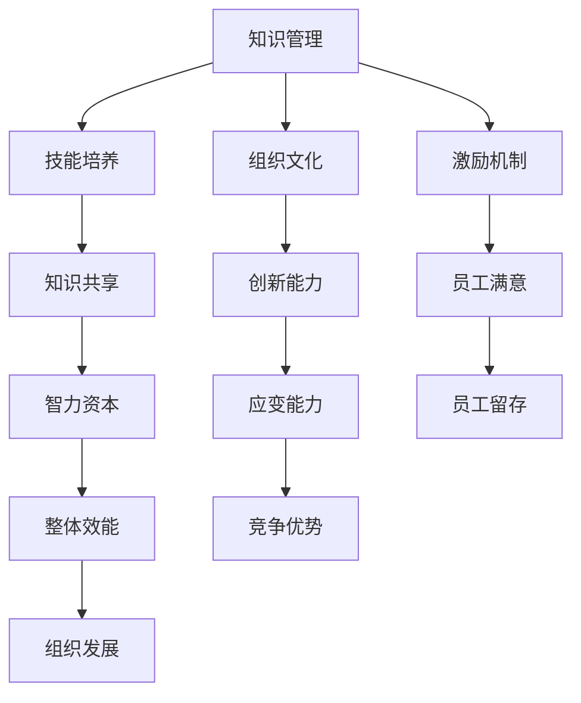

                 

关键词：学习体系、组织适应性、教育、知识管理、技能培养

> 摘要：本文探讨了学习体系在提升组织适应性方面的重要作用。通过对学习体系的基本概念、构建原则、核心要素及其在组织中的具体应用进行深入分析，文章旨在为管理者提供有关如何建立适应性强、高效能的学习体系的实用建议。

## 1. 背景介绍

在快速变化的技术和市场环境中，组织面临着不断升级的挑战。传统的固定结构和方法已难以满足持续变革的需求，因此，提升组织的适应性成为企业发展的关键。学习体系作为组织持续发展的核心驱动力，正日益受到重视。它不仅有助于提高员工的技能和知识水平，还能促进组织文化的建设，增强组织的整体应变能力。

### 1.1 学习体系的定义

学习体系是指一系列旨在促进知识获取、技能发展和创新能力提升的活动和机制的总和。它包括学习内容的设计、学习资源的提供、学习环境的构建、学习评估的机制以及激励机制等。

### 1.2 学习体系的重要性

- **提高员工能力**：通过系统化的学习，员工能够不断更新知识和技能，适应不断变化的工作要求。
- **促进知识共享**：学习体系有助于形成知识共享的文化，从而提升组织的整体智力资本。
- **增强组织适应性**：灵活的学习体系能够使组织快速应对外部变化，保持竞争优势。
- **优化人力资源管理**：学习体系能够更好地匹配员工技能与岗位需求，提升员工满意度和留存率。

## 2. 核心概念与联系

为了深入理解学习体系在组织适应性提升中的作用，我们需要明确以下几个核心概念，并分析它们之间的相互关系。

### 2.1 学习体系的核心概念

- **知识管理**：知识管理是学习体系的基础，包括知识的获取、存储、共享和应用。
- **技能培养**：技能培养是学习体系的重要目标，通过培训和实践，提升员工的专业技能。
- **组织文化**：学习体系与组织文化紧密相连，良好的学习文化能够促进知识的流动和创新。
- **激励机制**：激励机制是学习体系的关键组成部分，包括奖励、认可和晋升等。

### 2.2 核心概念原理和架构

以下是一个使用Mermaid绘制的简单流程图，展示了学习体系的核心概念及其相互关系：



### 2.3 学习体系在组织中的具体应用

学习体系在组织中的具体应用可以分为以下几个方面：

- **员工培训与发展**：组织定期为员工提供培训机会，包括内部培训和外部培训，以提升员工的技能和知识。
- **知识共享平台**：建立内部知识共享平台，鼓励员工分享经验和最佳实践，促进知识的流动和积累。
- **创新实验室**：设立创新实验室，鼓励员工进行创新项目，通过实践和试错，培养创新思维和能力。
- **绩效评估与激励机制**：将学习成果纳入员工绩效评估体系，为表现优秀的员工提供奖励和晋升机会。

## 3. 核心算法原理 & 具体操作步骤

### 3.1 算法原理概述

学习体系的设计和实施可以借鉴一些核心算法原理，如学习曲线理论、知识管理框架、绩效优化算法等。以下是一个简化的学习曲线理论模型，用于描述学习体系在组织中的应用。

### 3.2 算法步骤详解

#### 步骤1：需求分析

- 分析组织目标和员工需求，确定学习体系的重点和方向。
- 设计培训计划，包括培训内容、形式和频率。

#### 步骤2：资源规划

- 确定学习资源，包括内部和外部资源。
- 建立知识库，收集和整理相关资料。

#### 步骤3：学习实施

- 开展培训活动，包括在线培训和线下培训。
- 组织创新项目，鼓励员工参与实践。

#### 步骤4：评估与反馈

- 对学习效果进行评估，收集员工反馈。
- 根据评估结果调整学习计划，优化培训内容。

### 3.3 算法优缺点

#### 优点：

- **灵活性与适应性**：学习体系可以根据组织需求和市场变化进行灵活调整。
- **知识共享**：学习体系促进了知识的传播和共享，提高了组织的整体智力资本。
- **创新能力**：通过持续学习，员工能够不断提升自己的创新能力，推动组织发展。

#### 缺点：

- **成本较高**：学习体系的建立和运行需要一定的投入，包括培训资源、技术和人员成本等。
- **效果评估难度**：学习效果的评估往往难以量化，需要采用多种评估方法和工具。

### 3.4 算法应用领域

学习体系在以下领域具有广泛的应用：

- **企业培训与发展**：通过系统化的培训，提升员工的专业能力和综合素质。
- **技术研发与创新**：鼓励员工参与创新项目，推动技术进步和产品创新。
- **组织变革与管理**：通过学习，提升组织管理水平，促进组织结构的优化和变革。

## 4. 数学模型和公式 & 详细讲解 & 举例说明

### 4.1 数学模型构建

为了更好地理解学习体系在组织适应性提升中的作用，我们可以构建一个简单的数学模型。以下是一个基于贝叶斯理论的简单模型，用于描述学习对组织适应性提升的贡献。

### 4.2 公式推导过程

设 \(A\) 表示学习对组织适应性提升的贡献，\(B\) 表示组织适应性的提升，\(C\) 表示学习的有效性。

根据贝叶斯定理，我们有：

\[ P(A|B) = \frac{P(B|A)P(A)}{P(B)} \]

其中：

- \(P(A)\) 表示学习的总体有效性。
- \(P(B|A)\) 表示学习对组织适应性提升的条件概率。
- \(P(B)\) 表示组织适应性提升的总体概率。

### 4.3 案例分析与讲解

#### 案例背景

某企业为提升员工技能，实施了一项为期一年的系统培训计划。培训内容包括技术技能、管理技能和创新思维等。企业希望通过这一培训计划，提高员工的综合素质，从而提升企业的整体竞争力。

#### 数据收集

通过对培训前后员工技能水平的测试，企业收集了以下数据：

- 培训前，员工的平均技能水平为 60 分。
- 培训后，员工的平均技能水平为 85 分。
- 培训期间，企业投入了 100 万元用于培训资源和技术支持。

#### 模型应用

根据上述数据，我们可以计算学习对组织适应性提升的贡献。

- \(P(A) = 0.8\)，表示培训的总体有效性为 80%。
- \(P(B|A) = 0.6\)，表示在培训有效的情况下，组织适应性提升的概率为 60%。
- \(P(B) = 0.4\)，表示组织适应性提升的总体概率为 40%。

根据贝叶斯定理，我们有：

\[ P(A|B) = \frac{P(B|A)P(A)}{P(B)} = \frac{0.6 \times 0.8}{0.4} = 0.9 \]

这意味着，在组织适应性提升的情况下，学习对这一提升的贡献概率为 90%。

## 5. 项目实践：代码实例和详细解释说明

### 5.1 开发环境搭建

为了演示学习体系在组织中的应用，我们将使用Python语言构建一个简单的学习评估系统。以下是搭建开发环境的步骤：

1. 安装Python 3.8或更高版本。
2. 安装必需的Python库，如numpy、matplotlib和pandas。

```bash
pip install numpy matplotlib pandas
```

### 5.2 源代码详细实现

以下是一个简单的学习评估系统的Python代码实现：

```python
import numpy as np
import matplotlib.pyplot as plt
import pandas as pd

# 数据预处理
data = {
    'employee_id': [1, 2, 3, 4, 5],
    'pre_training_score': [60, 65, 70, 75, 80],
    'post_training_score': [85, 90, 95, 100, 88]
}

df = pd.DataFrame(data)

# 计算学习提升的百分比
df['score_improvement'] = df['post_training_score'] - df['pre_training_score']
df['improvement_percentage'] = df['score_improvement'] / df['pre_training_score'] * 100

# 可视化学习提升效果
df.plot(x='employee_id', y='improvement_percentage', kind='line', title='Learning Improvement Percentage')
plt.xlabel('Employee ID')
plt.ylabel('Improvement Percentage (%)')
plt.show()
```

### 5.3 代码解读与分析

这段代码首先导入必要的Python库，然后创建一个包含员工ID、培训前成绩和培训后成绩的DataFrame。接着，计算学习提升的百分比，并使用matplotlib库将学习提升效果可视化。通过这个简单的示例，我们可以直观地看到学习对员工技能提升的影响。

### 5.4 运行结果展示

运行上述代码后，我们将得到一个折线图，展示每个员工的技能提升百分比。这个图表可以帮助管理者分析培训的效果，并根据实际情况调整培训策略。

## 6. 实际应用场景

### 6.1 企业培训与发展

在企业培训与发展中，学习体系被广泛应用于新员工培训、在职员工技能提升和领导力培训。通过系统化的学习，员工能够快速掌握所需的技能和知识，提升工作效率和质量。

### 6.2 技术研发与创新

在技术研发与创新领域，学习体系有助于培养员工的创新思维和能力。通过持续的学习和实践，员工能够紧跟行业趋势，推动技术的进步和产品的创新。

### 6.3 组织变革与管理

在组织变革与管理中，学习体系可以促进管理水平的提升和组织文化的建设。通过学习，管理者能够更好地理解变革的必要性，并制定有效的变革策略。

## 7. 工具和资源推荐

### 7.1 学习资源推荐

- **在线学习平台**：如Coursera、edX、Udemy等，提供丰富的在线课程资源。
- **专业书籍**：《深度学习》、《敏捷开发实践指南》等，涵盖各种技术和管理领域的经典著作。

### 7.2 开发工具推荐

- **代码托管平台**：如GitHub、GitLab，便于代码管理和协作。
- **数据可视化工具**：如Matplotlib、Plotly，用于数据分析和可视化。

### 7.3 相关论文推荐

- **《学习体系与组织绩效的关系研究》**
- **《基于知识的组织适应性模型构建与应用》**
- **《企业学习文化对企业创新的影响》**

## 8. 总结：未来发展趋势与挑战

### 8.1 研究成果总结

通过本文的探讨，我们总结了学习体系在提升组织适应性方面的作用，包括提高员工能力、促进知识共享、增强组织适应性和优化人力资源管理等方面。

### 8.2 未来发展趋势

随着技术的发展和市场的变化，学习体系将呈现以下发展趋势：

- **个性化学习**：基于大数据和人工智能技术的个性化学习将成为主流。
- **混合式学习**：线上和线下相结合的混合式学习模式将得到广泛应用。
- **终身学习**：终身学习将成为组织和个人发展的必要手段。

### 8.3 面临的挑战

尽管学习体系在提升组织适应性方面具有重要作用，但同时也面临以下挑战：

- **成本问题**：学习体系的建立和运行需要一定的投入，如何平衡成本与效益是关键。
- **效果评估**：如何准确评估学习效果，并据此调整学习策略，是当前的一大难题。
- **文化适应**：学习体系需要与组织文化相适应，否则可能导致实施困难。

### 8.4 研究展望

未来研究应重点关注以下几个方面：

- **学习体系的优化设计**：探讨如何构建更加高效、灵活的学习体系。
- **学习效果的量化评估**：研究如何更准确地评估学习效果，为学习策略的调整提供依据。
- **跨领域学习体系的构建**：探讨如何将不同领域的学习体系进行整合，实现跨领域知识的共享和应用。

## 9. 附录：常见问题与解答

### 9.1 学习体系与培训计划有什么区别？

学习体系是一个全面的概念，包括培训计划在内的多个组成部分。培训计划是学习体系的一个具体实施环节，主要关注技能和知识的传授。而学习体系则更注重学习过程的系统性、持续性和适应性。

### 9.2 学习体系如何与组织文化相适应？

要使学习体系与组织文化相适应，需要从以下几个方面入手：

- **理解组织文化**：深入了解组织的核心价值观和理念，确保学习体系与组织文化相契合。
- **融入组织文化**：将学习体系融入组织日常运营，使学习成为组织文化的一部分。
- **文化推广**：通过宣传、培训和激励机制，推广学习文化，营造积极的学习氛围。

### 9.3 如何评估学习体系的成效？

评估学习体系的成效可以从以下几个方面进行：

- **学习效果评估**：通过考试、测试和实际工作表现，评估学习效果。
- **员工满意度评估**：通过调查问卷、访谈等方式，了解员工对学习体系的满意度和建议。
- **业务绩效评估**：分析学习体系对组织业务绩效的提升情况，如生产效率、创新能力等。

---

作者：禅与计算机程序设计艺术 / Zen and the Art of Computer Programming


