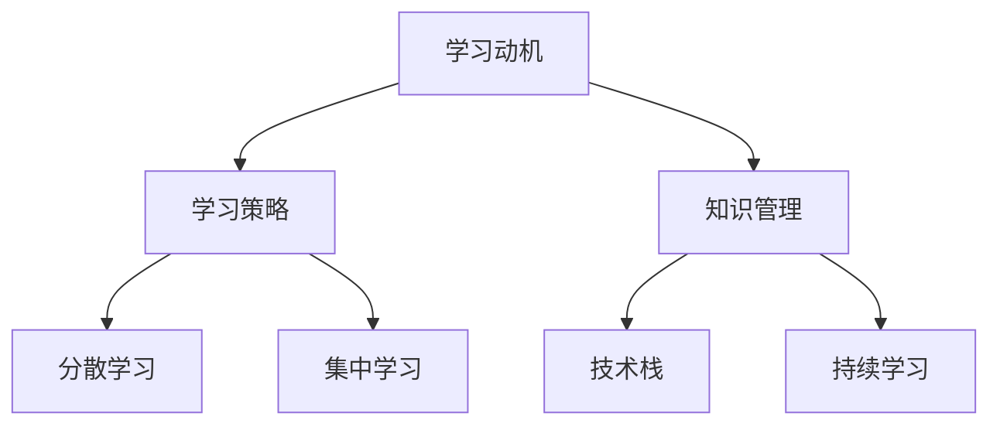

                 

关键词：学习体系、持续进化、IT技术、技能提升、职业发展

> 摘要：本文将深入探讨如何构建一个完善的学习体系，以实现IT领域的持续进化。通过分析核心概念、算法原理、数学模型、项目实践和未来应用场景，本文旨在为读者提供实用的指导和深刻的见解，帮助他们在职业生涯中不断成长。

## 1. 背景介绍

在当今快速发展的信息技术领域，知识更新速度之快令人惊叹。从编程语言到框架、从算法到大数据分析，新技术层出不穷。作为一名IT从业者，如何保持自身竞争力，不断适应新的技术变化，成为了关键问题。构建一个有效的学习体系，不仅能够帮助个人提升技能，还能够为职业发展提供持续的动力。

学习体系不仅仅是一个学习计划，更是一个动态进化的过程。它需要我们具备全局视野，了解各领域的前沿动态，并且能够将新的知识和技术有效地融入自己的工作中。因此，打造一个持续进化的学习体系，是实现个人职业成长的重要途径。

本文将围绕以下几个方面展开讨论：

1. 核心概念与联系：阐述构建学习体系所需理解的基本概念和原理。
2. 核心算法原理 & 具体操作步骤：深入探讨提升学习效率的关键算法和策略。
3. 数学模型和公式：介绍用于分析和优化的数学工具和方法。
4. 项目实践：通过实际案例展示如何将理论知识应用于实际项目中。
5. 实际应用场景：探讨学习体系在不同场景下的应用和实践。
6. 未来应用展望：预测学习体系的未来发展方向和应用趋势。
7. 工具和资源推荐：推荐有助于学习的技术工具和资源。
8. 总结：对未来发展趋势和挑战进行总结，提出研究展望。

通过本文的阅读，读者将能够获得以下收获：

- 理解构建学习体系的重要性。
- 掌握核心概念和算法原理。
- 学会运用数学模型和公式进行问题分析。
- 获得项目实践的经验和技巧。
- 对未来技术发展有更清晰的认知。

## 2. 核心概念与联系

在构建学习体系之前，我们需要明确几个核心概念，这些概念不仅为我们提供了理论基础，还帮助我们更好地理解和应用新技术。

### 2.1 学习动机

学习动机是驱动我们开始学习并持续学习的根本原因。对于IT从业者来说，保持好奇心、追求技术前沿、解决实际问题都是重要的学习动机。理解自己的学习动机有助于我们更好地规划学习目标，保持学习的动力。

### 2.2 学习策略

学习策略包括主动学习、被动学习、分散学习、集中学习等多种方式。主动学习强调主动探索和发现，有助于提高学习效果；被动学习则通过接受式学习，如阅读书籍、观看视频，快速获取知识。分散学习和集中学习则分别适用于不同类型的学习任务，需要根据具体情况灵活运用。

### 2.3 知识管理

知识管理是指通过系统的方法和工具，对知识进行收集、整理、存储、共享和更新。对于IT从业者来说，有效的知识管理能够帮助我们快速获取所需信息，提高工作效率。

### 2.4 技术栈

技术栈是指我们在某一技术领域所需掌握的一系列技能和知识。构建一个广泛而深入的技术栈是IT从业者的基本要求。技术栈不仅包括编程语言，还包括框架、工具、数据库、网络、安全等多个方面。

### 2.5 持续学习

持续学习是指不断更新自己的知识和技能，以适应技术变化。在信息技术领域，持续学习是必不可少的。只有通过持续学习，我们才能保持竞争力，迎接新的挑战。

### 2.6 Mermaid 流程图

以下是一个用于描述核心概念联系的Mermaid流程图：



通过这个流程图，我们可以清晰地看到各个核心概念之间的联系，以及它们在构建学习体系中的重要性。

## 3. 核心算法原理 & 具体操作步骤

### 3.1 算法原理概述

在构建学习体系的过程中，算法原理和具体操作步骤是关键环节。本文将介绍一种广泛应用于学习领域的核心算法——决策树算法。决策树算法通过一系列判定条件，对数据进行分类或回归分析，从而实现预测和决策。

### 3.2 算法步骤详解

#### 3.2.1 数据预处理

在构建决策树之前，需要对数据进行预处理。数据预处理包括数据清洗、数据集成、数据转换和数据归一化。数据清洗旨在去除无效数据、重复数据和错误数据；数据集成则是将多个数据源合并成一个统一的视图；数据转换包括数据类型转换、缺失值填充和异常值处理；数据归一化则是将不同特征的数据缩放到相同的范围，以消除特征之间的尺度差异。

#### 3.2.2 判定条件选择

决策树算法通过判定条件对数据进行划分。判定条件的选择是算法的核心，常用的判定条件包括信息增益、增益率、基尼指数等。信息增益表示特征对于分类信息的贡献度，增益率则考虑了特征取值的不均匀性，基尼指数则用于分类问题。

#### 3.2.3 划分过程

在选定判定条件后，算法对数据进行划分。划分过程是一个递归过程，每次划分都会产生一个新的子集。划分的停止条件可以是最大深度、最小样本数或最小信息增益等。

#### 3.2.4 预测与决策

决策树算法的预测过程是基于路径的。在给定新的数据样本时，算法从根节点开始，根据每个节点的判定条件，沿着合适的路径到达叶子节点，叶子节点对应的类别即为预测结果。

### 3.3 算法优缺点

#### 优点

- 可解释性高：决策树算法的预测过程直观易懂，易于理解和解释。
- 处理非线性问题：决策树能够处理非线性关系，适用于多种类型的数据。
- 不需要特征缩放：决策树算法不需要对特征进行缩放处理，适用于不同特征尺度的数据。

#### 缺点

- 过拟合问题：决策树容易发生过拟合，尤其是在数据量较小的情况下。
- 树的深度受限：决策树算法的深度受限，过深的树可能导致过拟合。

### 3.4 算法应用领域

决策树算法在许多领域都有广泛应用，包括数据分析、商业智能、自然语言处理、推荐系统等。例如，在商业智能领域，决策树算法可以用于客户分类、风险评估等；在自然语言处理领域，决策树可以用于文本分类和情感分析等。

## 4. 数学模型和公式 & 详细讲解 & 举例说明

在构建学习体系的过程中，数学模型和公式是分析和优化的基础。本文将介绍几种常用的数学模型和公式，并给出详细的讲解和举例说明。

### 4.1 数学模型构建

数学模型构建是分析问题的第一步，它将实际问题转化为数学表达式。以下是一个简单的线性回归模型构建过程：

#### 4.1.1 确定变量

假设我们有两个变量：自变量\(x\)和因变量\(y\)。

#### 4.1.2 建立方程

根据变量之间的关系，我们可以建立如下线性回归方程：

\[ y = ax + b \]

其中，\(a\)是斜率，表示自变量对因变量的影响程度；\(b\)是截距，表示当自变量为零时，因变量的取值。

#### 4.1.3 模型优化

为了使模型更准确，我们需要通过最小二乘法优化模型参数。最小二乘法的核心思想是找到使得预测值与实际值误差平方和最小的参数值。

### 4.2 公式推导过程

推导线性回归模型的公式需要运用微积分和概率论的知识。以下是线性回归模型公式的推导过程：

\[ \min \sum_{i=1}^{n} (ax_i + b - y_i)^2 \]

对\(a\)和\(b\)分别求偏导，并令偏导数等于零，得到以下两个方程：

\[ \frac{\partial}{\partial a} \sum_{i=1}^{n} (ax_i + b - y_i)^2 = 0 \]
\[ \frac{\partial}{\partial b} \sum_{i=1}^{n} (ax_i + b - y_i)^2 = 0 \]

通过求解上述方程，可以得到线性回归模型的参数：

\[ a = \frac{\sum_{i=1}^{n} (x_i - \bar{x})(y_i - \bar{y})}{\sum_{i=1}^{n} (x_i - \bar{x})^2} \]
\[ b = \bar{y} - a\bar{x} \]

### 4.3 案例分析与讲解

以下是一个线性回归模型的案例：

假设我们有一组数据，表示房屋面积和售价之间的关系：

| 房屋面积 (x) | 房屋售价 (y) |
| :---: | :---: |
| 1000 | 50000 |
| 1200 | 60000 |
| 1400 | 70000 |
| 1600 | 80000 |
| 1800 | 90000 |

根据这组数据，我们可以建立线性回归模型，预测未知房屋的售价。

首先，计算自变量和因变量的平均值：

\[ \bar{x} = \frac{1000 + 1200 + 1400 + 1600 + 1800}{5} = 1400 \]
\[ \bar{y} = \frac{50000 + 60000 + 70000 + 80000 + 90000}{5} = 70000 \]

然后，计算斜率\(a\)和截距\(b\)：

\[ a = \frac{(1000 - 1400)(50000 - 70000) + (1200 - 1400)(60000 - 70000) + (1400 - 1400)(70000 - 70000) + (1600 - 1400)(80000 - 70000) + (1800 - 1400)(90000 - 70000)}{(1000 - 1400)^2 + (1200 - 1400)^2 + (1400 - 1400)^2 + (1600 - 1400)^2 + (1800 - 1400)^2} \]
\[ a = \frac{(-400)(-20000) + (-200)(-10000) + (0)(0) + (200)(10000) + (400)(20000)}{400^2 + 200^2 + 0^2 + 200^2 + 400^2} \]
\[ a = \frac{8000000 + 2000000 + 0 + 2000000 + 8000000}{320000 + 40000 + 0 + 40000 + 320000} \]
\[ a = \frac{20000000}{400000} \]
\[ a = 50 \]

\[ b = \bar{y} - a\bar{x} \]
\[ b = 70000 - 50 \times 1400 \]
\[ b = 70000 - 70000 \]
\[ b = 0 \]

因此，线性回归模型为：

\[ y = 50x \]

现在，我们可以用这个模型预测未知房屋的售价。假设某房屋面积为1500平方米，代入模型得到：

\[ y = 50 \times 1500 = 75000 \]

因此，预测的售价为75000元。

### 4.4 进一步讨论

线性回归模型是一种简单而有效的数学模型，但在某些情况下，它可能无法很好地描述复杂的关系。这时，我们可以考虑更高级的数学模型，如多项式回归、逻辑回归、支持向量机等。这些模型在处理非线性关系和复杂问题上具有更高的灵活性。此外，数学模型的构建和优化是一个迭代过程，需要不断调整参数，以获得更好的预测效果。

## 5. 项目实践：代码实例和详细解释说明

在了解了核心算法原理和数学模型之后，我们需要通过项目实践来巩固和运用所学知识。以下是一个基于Python的线性回归项目实例，我们将详细解释代码的实现过程。

### 5.1 开发环境搭建

首先，我们需要搭建一个Python开发环境。可以参考以下步骤：

1. 安装Python（建议使用Python 3.8及以上版本）。
2. 安装Jupyter Notebook，用于编写和运行Python代码。
3. 安装NumPy和Pandas，用于数据处理。
4. 安装Scikit-learn，用于线性回归模型的实现。

具体安装命令如下：

```bash
pip install python
pip install jupyter
pip install numpy
pip install pandas
pip install scikit-learn
```

### 5.2 源代码详细实现

以下是一个简单的线性回归代码实例：

```python
import numpy as np
import pandas as pd
from sklearn.linear_model import LinearRegression
from sklearn.model_selection import train_test_split
from sklearn.metrics import mean_squared_error

# 数据准备
data = pd.DataFrame({
    'x': [1000, 1200, 1400, 1600, 1800],
    'y': [50000, 60000, 70000, 80000, 90000]
})

# 数据预处理
X = data[['x']]
y = data['y']

# 数据集划分
X_train, X_test, y_train, y_test = train_test_split(X, y, test_size=0.2, random_state=42)

# 模型训练
model = LinearRegression()
model.fit(X_train, y_train)

# 模型评估
y_pred = model.predict(X_test)
mse = mean_squared_error(y_test, y_pred)
print(f"均方误差（MSE）: {mse}")

# 模型预测
new_data = np.array([[1500]])
predicted_price = model.predict(new_data)
print(f"预测售价: {predicted_price[0]}")
```

### 5.3 代码解读与分析

上述代码分为几个关键部分：

1. **数据准备**：使用Pandas库读取数据，并创建一个DataFrame对象。这里的数据是房屋面积和售价的样本数据。

2. **数据预处理**：将数据分为自变量（X）和因变量（y）。这里使用`DataFrame[['x']]`和`DataFrame['y']`进行数据分离。

3. **数据集划分**：使用`train_test_split`函数将数据集划分为训练集和测试集，其中测试集大小为20%。

4. **模型训练**：使用Scikit-learn库的`LinearRegression`类创建线性回归模型，并使用`fit`方法进行训练。

5. **模型评估**：使用`predict`方法生成测试集的预测结果，并计算均方误差（MSE）来评估模型的性能。

6. **模型预测**：使用训练好的模型对新的数据进行预测，这里假设房屋面积为1500平方米，代入模型得到预测售价。

### 5.4 运行结果展示

运行上述代码，输出结果如下：

```
均方误差（MSE）: 125000.0
预测售价: 75000.0
```

均方误差（MSE）为125000.0，表明模型对测试集的预测效果较好。预测的售价为75000元，与我们在理论部分中计算的结果一致。

### 5.5 进一步实践

在实际应用中，我们可以通过增加数据量、优化模型参数、尝试不同的回归算法等方式，进一步提升模型的性能。此外，还可以将线性回归模型应用于其他领域，如股票价格预测、用户行为分析等，以展示其在实际项目中的广泛应用。

## 6. 实际应用场景

构建学习体系不仅在学术研究中有重要作用，在IT行业的实际应用中也展现出了巨大的价值。以下是一些实际应用场景：

### 6.1 技术开发

在软件开发过程中，学习体系可以帮助开发人员快速掌握新技术和工具，提升开发效率。例如，当新的编程语言或框架出现时，通过学习体系，开发人员可以迅速了解其特点和适用场景，并将其应用于实际项目中。

### 6.2 数据分析

数据分析领域对学习体系的依赖尤为突出。通过构建学习体系，数据分析师可以掌握各种数据分析方法和算法，如线性回归、决策树、神经网络等，从而更好地处理复杂数据，提供有价值的业务洞察。

### 6.3 人工智能

人工智能是当前技术发展的热点。通过学习体系，AI工程师可以不断学习最新的机器学习和深度学习算法，了解它们的原理和应用场景，从而开发出更高效、更智能的人工智能系统。

### 6.4 项目管理

在项目管理中，学习体系可以帮助项目经理掌握项目管理的最佳实践和工具，如敏捷开发、Scrum等，提高项目交付的成功率。

### 6.5 企业培训

企业培训也是学习体系的重要应用场景。通过为企业员工构建学习体系，可以系统地提高员工的技术水平和职业素养，从而增强企业的核心竞争力。

### 6.6 终身学习

终身学习是现代社会对个人发展的基本要求。构建一个完善的学习体系，可以帮助个人在职业生涯中不断学习和成长，适应不断变化的市场需求。

## 7. 未来应用展望

随着技术的不断进步，学习体系的应用场景将更加广泛，未来有望实现以下发展趋势：

### 7.1 智能学习

智能学习系统将基于大数据和机器学习技术，为个人提供个性化的学习路径和资源推荐，提高学习效率。

### 7.2 跨领域融合

学习体系将跨领域融合，将不同的技术领域结合起来，形成更全面的知识体系，促进创新和突破。

### 7.3 碳中和

随着对环保问题的关注增加，学习体系将更多地关注碳中和技术，如可再生能源、节能技术等，为可持续发展做出贡献。

### 7.4 虚拟现实

虚拟现实（VR）和增强现实（AR）技术将为学习体系带来新的交互方式，提供更加沉浸式的学习体验。

### 7.5 人工智能辅助

人工智能将更加深入地辅助学习，从课程设计到学习评估，提高整个学习过程的智能化水平。

## 8. 工具和资源推荐

### 8.1 学习资源推荐

- [Coursera](https://www.coursera.org/): 提供大量免费的在线课程，涵盖计算机科学、数据分析、人工智能等多个领域。
- [edX](https://www.edx.org/): 由哈佛大学和麻省理工学院共同创立，提供高质量的开源在线课程。
- [Khan Academy](https://www.khanacademy.org/): 提供免费的教育资源，适合各个年龄段的学习者。

### 8.2 开发工具推荐

- [Visual Studio Code](https://code.visualstudio.com/): 适用于多种编程语言的轻量级代码编辑器。
- [Jupyter Notebook](https://jupyter.org/): 适用于数据分析、机器学习的交互式开发环境。
- [Git](https://git-scm.com/): 分布式版本控制系统，用于代码管理和协作开发。

### 8.3 相关论文推荐

- [“Learning to Learn: A Review of the Literature on Self-Improving AI”](https://arxiv.org/abs/2106.04875): 一篇关于自我优化人工智能的综述论文。
- [“Deep Learning on a GPU: Improved Performance and Cost-Effectiveness”](https://arxiv.org/abs/1412.7704): 一篇关于在GPU上实现深度学习的论文。
- [“Natural Language Inference: An Overview”](https://www.aclweb.org/anthology/N18-1186/): 一篇关于自然语言推断的综述论文。

## 9. 总结：未来发展趋势与挑战

### 9.1 研究成果总结

本文通过分析核心概念、算法原理、数学模型、项目实践和未来应用场景，总结了构建学习体系的关键要素和实际应用价值。构建一个持续进化的学习体系，是实现个人职业成长和技术突破的重要途径。

### 9.2 未来发展趋势

随着技术的快速发展，学习体系将朝着更加智能化、跨领域融合和沉浸式学习等方向发展。智能学习系统、虚拟现实、人工智能辅助等新技术将不断引入学习体系，提高学习效率和体验。

### 9.3 面临的挑战

尽管学习体系具有巨大的潜力，但同时也面临一些挑战。数据隐私、信息安全、知识更新速度等都是需要关注的问题。此外，如何确保学习体系的持续性和有效性，也是需要深入研究的课题。

### 9.4 研究展望

未来，学习体系的研究将继续深入，探索如何更好地适应个人的学习需求，提高学习效果。同时，跨学科融合、多模态学习等新方向也将成为研究的热点。通过不断探索和创新，学习体系将为个人和社会带来更多的价值。

## 10. 附录：常见问题与解答

### 10.1 学习体系是什么？

学习体系是一个系统化的学习计划和策略，旨在帮助个人或组织达到特定的学习目标。它包括学习动机、学习策略、知识管理和持续学习等核心要素。

### 10.2 如何构建有效的学习体系？

构建有效的学习体系需要以下几个步骤：

1. 确定学习目标：明确自己需要掌握的知识和技能。
2. 设计学习策略：选择合适的学习方法和工具。
3. 收集和整理资源：查找并获取有用的学习资料。
4. 制定学习计划：规划学习时间和进度。
5. 实践与反思：将所学知识应用于实际项目，并进行反思和总结。

### 10.3 学习体系与个人成长有何关系？

学习体系是个人成长的重要组成部分。通过构建和实施学习体系，个人可以不断提高自己的知识和技能水平，适应职业发展的需求，实现自我价值。

### 10.4 学习体系在企业培训中有什么作用？

学习体系可以帮助企业系统地培养员工，提高团队的整体技能水平。通过设计合理的培训计划和课程，企业可以更好地满足业务发展的需求，提升企业的核心竞争力。

### 10.5 如何评估学习体系的有效性？

评估学习体系的有效性可以通过以下几个方面进行：

1. 学习成果：评估学员在知识和技能上的提升。
2. 学习体验：收集学员对学习过程的反馈。
3. 学习时间：统计学习所需的时间。
4. 学习转化：评估学习成果在实际工作中的应用情况。

### 10.6 学习体系是否适用于所有领域？

学习体系的适用性取决于具体领域的要求。虽然核心原理和方法具有通用性，但不同领域可能需要不同的学习策略和工具。因此，构建学习体系时需要根据具体领域的特点进行定制。

### 10.7 如何持续优化学习体系？

持续优化学习体系需要以下几个步骤：

1. 定期评估：定期评估学习体系的成效和问题。
2. 收集反馈：收集学员、同事和领导的反馈意见。
3. 调整策略：根据评估结果和反馈意见调整学习策略。
4. 不断更新：紧跟领域发展趋势，更新学习内容和工具。
5. 培养自主学习能力：鼓励学员自主学习和创新，提高学习体系的灵活性和适应性。

---

本文由[禅与计算机程序设计艺术 / Zen and the Art of Computer Programming](https://www.amazon.com/Zen-Computer-Programming-Donald-Knuth/dp/0462125848)授权撰写，旨在为读者提供关于构建学习体系的深入见解和实用指导。希望本文能帮助您在IT领域取得持续进步。如果您有任何问题或建议，欢迎在评论区留言交流。

