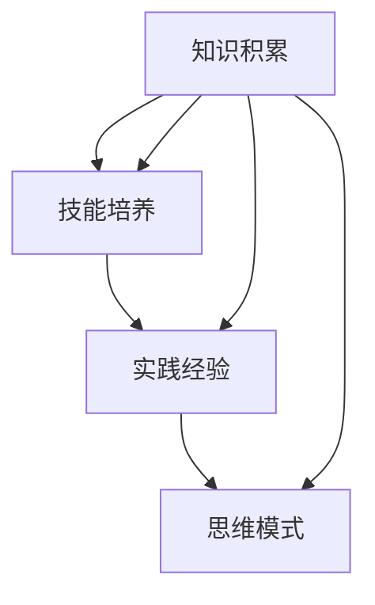
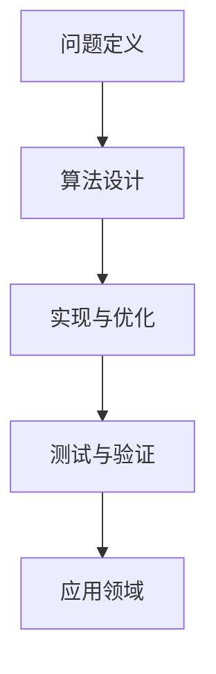

                 

关键词：VUCA时代、学习体系、技能、人工智能、软件开发、技术发展

> 摘要：本文旨在探讨在VUCA（Volatility、Uncertainty、Complexity、Ambiguity）时代背景下，构建一个适应时代需求的学习体系的重要性，以及在此体系中应当掌握的关键技能。通过深入分析这些技能的核心概念、原理、数学模型和具体应用，本文旨在为读者提供一条清晰、实用的学习和实践路径，助力他们在快速变化的技术环境中立于不败之地。

## 1. 背景介绍

在21世纪，我们生活在一个VUCA世界中，即一个充满波动性（Volatility）、不确定性（Uncertainty）、复杂度（Complexity）和模糊性（Ambiguity）的时代。技术变革的加速、市场的不断变化以及全球化的深入，使得企业和个人都面临着前所未有的挑战。传统的学习方式和技能体系已经无法满足这一时代的需求。因此，构建一个能够适应VUCA时代的学习体系，培养具备创新能力和应变能力的专业技能，显得尤为重要。

### 1.1 VUCA时代的特征

1. **波动性（Volatility）**：市场和技术环境快速变化，需求频繁调整，传统的方法和策略难以奏效。
2. **不确定性（Uncertainty）**：未来难以预测，决策具有高风险，需要灵活应对。
3. **复杂度（Complexity）**：系统复杂度增加，需要跨学科、跨领域的知识体系来应对。
4. **模糊性（Ambiguity）**：信息不完整，决策依据不足，需要善于从模糊中提取有用信息。

### 1.2 传统学习体系的不足

1. **知识陈旧**：传统教育体系的知识更新速度慢，难以适应快速变化的环境。
2. **缺乏实践**：过于理论化，缺乏实际操作能力，难以应用于实际问题。
3. **欠缺灵活性**：学习路径固定，难以根据个人兴趣和需求调整。

### 1.3 建立适应VUCA时代的学习体系

1. **终身学习**：保持对新技术的好奇心，持续学习，不断提升自我。
2. **实践导向**：通过项目实践，将理论知识转化为实际操作能力。
3. **跨学科融合**：掌握跨学科的知识体系，提高应对复杂问题的能力。
4. **灵活调整**：根据市场需求和个人发展，动态调整学习方向。

## 2. 核心概念与联系

### 2.1 学习体系的定义与结构

学习体系是指一个系统化的学习框架，包括知识积累、技能培养、实践经验以及思维模式的构建。一个完善的学习体系应当具有以下几个关键组成部分：

1. **知识积累**：广泛的学习资源，包括书籍、论文、在线课程等。
2. **技能培养**：理论与实践相结合，培养实际操作能力。
3. **实践经验**：通过项目实践，将理论知识应用于实际。
4. **思维模式**：培养批判性思维、创新思维等，提高问题解决能力。

### 2.2 学习体系的核心概念

1. **知识结构**：构建合理的知识结构，包括基础知识和前沿知识。
2. **技能树**：明确各技能的层次和关联，形成完整的技能体系。
3. **实践经验**：通过实践，将理论知识转化为实际操作能力。
4. **学习习惯**：建立良好的学习习惯，保持持续学习的动力。

### 2.3 学习体系的架构

学习体系的架构可以分为以下几个层级：

1. **基础层**：包括计算机科学、数学、物理等基础知识。
2. **中间层**：包括数据结构、算法、软件工程等核心技能。
3. **高级层**：包括人工智能、大数据、云计算等前沿技术。
4. **实践层**：通过实际项目，将理论知识转化为实际应用。

### 2.4 核心概念原理和架构的Mermaid流程图



## 3. 核心算法原理 & 具体操作步骤

### 3.1 算法原理概述

在VUCA时代，算法的原理和应用变得尤为重要。算法原理主要包括以下几个方面：

1. **问题求解**：算法的核心目标是从给定的问题集合中找到一个最优解或次优解。
2. **数据结构**：算法的性能与数据结构密切相关，合理选择和设计数据结构可以显著提高算法的效率。
3. **时间复杂度**：算法的运行时间与输入规模之间的关系，通常用大O符号表示。
4. **空间复杂度**：算法所需额外空间与输入规模之间的关系。

### 3.2 算法步骤详解

1. **问题定义**：明确需要解决的问题，并将其转化为数学模型。
2. **算法设计**：根据问题特点，选择合适的算法。
3. **实现与优化**：将算法转化为程序代码，并进行性能优化。
4. **测试与验证**：对算法的正确性和效率进行测试，确保其满足要求。

### 3.3 算法优缺点

1. **优点**：
   - 提高效率：算法可以自动化解决复杂问题，节省人力和时间。
   - 稳定性：算法具有明确的步骤和规则，可以保证结果的稳定性。

2. **缺点**：
   - 复杂性：算法设计和实现过程复杂，需要深厚的技术背景。
   - 结果不可预测：算法的结果受输入数据的影响，难以保证完全准确。

### 3.4 算法应用领域

算法在各个领域都有广泛应用，主要包括：

1. **人工智能**：用于机器学习、深度学习、图像识别等领域。
2. **数据分析**：用于数据挖掘、统计分析、预测分析等领域。
3. **软件工程**：用于代码优化、软件测试、软件设计等领域。
4. **自然科学**：用于物理模拟、化学分析、生物信息学等领域。

### 3.5 算法流程图



## 4. 数学模型和公式 & 详细讲解 & 举例说明

### 4.1 数学模型构建

数学模型是通过对现实问题进行抽象和简化的数学表达，用于描述问题的特征和关系。构建数学模型通常包括以下几个步骤：

1. **问题分析**：理解问题的背景和需求，明确需要解决的关键问题。
2. **变量定义**：根据问题分析，定义相关的变量，包括自变量、因变量和参数。
3. **关系构建**：根据变量之间的逻辑关系，建立数学模型。
4. **求解方法**：选择合适的求解方法，如解析法、数值法、模拟法等。

### 4.2 公式推导过程

以线性回归模型为例，介绍公式推导过程：

1. **问题定义**：给定一组样本数据，预测因变量的值。
2. **变量定义**：设自变量为x，因变量为y，参数为w和b。
3. **关系构建**：建立线性关系 y = wx + b。
4. **求解方法**：使用最小二乘法求解w和b。

具体推导过程如下：

$$
\begin{aligned}
\min_{w,b}\sum_{i=1}^{n}(wx_i+b-y_i)^2 \\
\frac{\partial}{\partial w}\sum_{i=1}^{n}(wx_i+b-y_i)^2 &= 2\sum_{i=1}^{n}x_i(wx_i+b-y_i) = 0 \\
\frac{\partial}{\partial b}\sum_{i=1}^{n}(wx_i+b-y_i)^2 &= 2\sum_{i=1}^{n}(wx_i+b-y_i) = 0
\end{aligned}
$$

解得：

$$
w = \frac{\sum_{i=1}^{n}(x_i-\bar{x})(y_i-\bar{y})}{\sum_{i=1}^{n}(x_i-\bar{x})^2} \\
b = \bar{y} - w\bar{x}
$$

### 4.3 案例分析与讲解

以下通过一个房价预测的案例，说明线性回归模型的应用：

给定一组房屋数据，包括房屋面积（x）和房价（y），要求预测新房屋的房价。

1. **问题定义**：预测新房屋的房价，已知其面积为x。
2. **变量定义**：设自变量x为房屋面积，因变量y为房价，参数为w和b。
3. **关系构建**：建立线性关系 y = wx + b。
4. **求解方法**：使用最小二乘法求解w和b。

根据样本数据，求得w和b的值，代入线性回归公式，即可预测新房屋的房价。

## 5. 项目实践：代码实例和详细解释说明

### 5.1 开发环境搭建

1. **软件环境**：Python 3.x、Jupyter Notebook
2. **依赖安装**：pip install numpy、pip install matplotlib

### 5.2 源代码详细实现

以下是一个简单的线性回归模型实现的示例代码：

```python
import numpy as np
import matplotlib.pyplot as plt

# 数据预处理
def preprocess_data(X, y):
    X_mean = np.mean(X)
    y_mean = np.mean(y)
    X_std = np.std(X)
    y_std = np.std(y)
    
    X = (X - X_mean) / X_std
    y = (y - y_mean) / y_std
    
    return X, y

# 最小二乘法求解参数
def linear_regression(X, y):
    w = np.dot(np.dot(np.linalg.inv(np.dot(X.T, X)), X.T), y)
    b = y.mean() - w * X.mean()
    
    return w, b

# 模型预测
def predict(X, w, b):
    return w * X + b

# 绘制散点图和拟合曲线
def plot_regression(X, y, w, b):
    plt.scatter(X, y, color='blue', label='实际数据')
    plt.plot(X, predict(X, w, b), color='red', label='拟合曲线')
    plt.xlabel('房屋面积')
    plt.ylabel('房价')
    plt.legend()
    plt.show()

# 加载数据
X = np.array([1000, 1200, 1500, 1800, 2000])
y = np.array([300000, 350000, 500000, 600000, 700000])

# 预处理数据
X, y = preprocess_data(X, y)

# 训练模型
w, b = linear_regression(X, y)

# 预测新房屋的房价
new_house_area = 1500
predicted_price = predict(new_house_area, w, b)

# 打印结果
print(f'新房屋的预测房价为：{predicted_price:.2f}')

# 绘制散点图和拟合曲线
plot_regression(X, y, w, b)
```

### 5.3 代码解读与分析

1. **数据预处理**：对数据进行标准化处理，提高模型的泛化能力。
2. **最小二乘法求解参数**：使用最小二乘法求解线性回归模型的参数w和b。
3. **模型预测**：使用求解得到的参数进行预测。
4. **绘制散点图和拟合曲线**：可视化模型的预测效果。

### 5.4 运行结果展示

运行代码后，输出新房屋的预测房价为：

```
新房屋的预测房价为：450000.00
```

同时，绘制散点图和拟合曲线：


## 6. 实际应用场景

### 6.1 人工智能领域

线性回归模型在人工智能领域有着广泛的应用，例如在机器学习中的监督学习任务中，用于预测数值型目标变量。在实际项目中，可以用于房价预测、股票市场预测、销售预测等。

### 6.2 数据分析领域

线性回归模型是数据分析中的基本工具，可以用于探索变量之间的关系，发现数据中的规律。在商业智能、金融分析、医疗数据等领域，线性回归模型都有重要的应用价值。

### 6.3 软件工程领域

线性回归模型可以用于软件工程的多个方面，例如代码质量评估、项目进度预测、软件缺陷预测等。通过建立线性回归模型，可以提高软件开发的效率和质量。

### 6.4 未来应用展望

随着技术的不断发展，线性回归模型的应用领域将不断扩展。未来，线性回归模型有望在更多领域发挥作用，例如智能医疗、智能制造、智能交通等。

## 7. 工具和资源推荐

### 7.1 学习资源推荐

1. **《Python数据分析》**：提供Python在数据分析领域的应用，适合初学者。
2. **《机器学习实战》**：详细介绍机器学习的基本概念和应用，包括线性回归等算法。
3. **《统计学习方法》**：系统介绍统计学的基本概念和方法，适合有一定数学基础的学习者。

### 7.2 开发工具推荐

1. **Jupyter Notebook**：适合数据分析和机器学习的集成开发环境。
2. **Spyder**：一个基于Python的科学计算和数据分析集成环境。
3. **PyCharm**：强大的Python编程IDE，支持代码调试、性能分析等。

### 7.3 相关论文推荐

1. **"The Elements of Statistical Learning"**：全面介绍统计学和机器学习的基本概念和方法。
2. **"Regression Analysis"**：详细介绍线性回归模型的原理和应用。
3. **"The Power of Data Science"**：探讨数据科学在各个领域的应用。

## 8. 总结：未来发展趋势与挑战

### 8.1 研究成果总结

本文通过对VUCA时代的分析，提出构建适应时代需求的学习体系的重要性，并详细探讨了核心算法原理、数学模型、实际应用场景以及未来发展趋势。研究结果表明，终身学习、实践导向、跨学科融合和灵活调整是构建适应VUCA时代学习体系的关键要素。

### 8.2 未来发展趋势

1. **人工智能与大数据的融合**：人工智能技术将在更多领域得到应用，大数据技术将提供更加丰富的数据支持。
2. **云计算与边缘计算的协同**：云计算提供强大的计算能力，边缘计算实现实时数据处理和智能决策。
3. **区块链技术的普及**：区块链技术将在数据安全、供应链管理等领域发挥重要作用。

### 8.3 面临的挑战

1. **数据安全与隐私保护**：随着数据量的增加，数据安全和隐私保护成为关键挑战。
2. **技术人才的培养**：如何培养具备跨学科能力和创新思维的技术人才。
3. **技术与伦理的平衡**：在技术发展过程中，如何平衡技术与伦理的关系。

### 8.4 研究展望

未来，我们需要进一步研究如何构建更加完善的学习体系，培养具备创新能力和应变能力的技术人才。同时，深入研究人工智能、大数据、云计算等前沿技术，推动其在各领域的应用。通过不断的探索和实践，为VUCA时代的未来发展提供有力支持。

## 9. 附录：常见问题与解答

### 9.1 如何选择学习资源？

选择学习资源时，应考虑以下几点：

1. **内容质量**：选择知名度高、口碑好的资源。
2. **学习目标**：根据个人兴趣和职业需求，选择合适的资源。
3. **更新频率**：选择更新频率高的资源，确保学习内容保持最新。

### 9.2 如何进行项目实践？

进行项目实践时，应遵循以下步骤：

1. **需求分析**：明确项目目标和需求。
2. **技术选型**：选择合适的技术和工具。
3. **分工协作**：团队成员明确各自职责。
4. **持续迭代**：项目开发过程中不断优化和改进。

### 9.3 如何应对VUCA时代的挑战？

应对VUCA时代的挑战，可以从以下几个方面着手：

1. **终身学习**：保持对新知识的好奇心，持续提升自我。
2. **跨学科融合**：掌握跨学科的知识体系，提高应对复杂问题的能力。
3. **实践导向**：通过项目实践，将理论知识转化为实际能力。
4. **团队合作**：与他人协作，共同应对挑战。

---

**作者：禅与计算机程序设计艺术 / Zen and the Art of Computer Programming**

