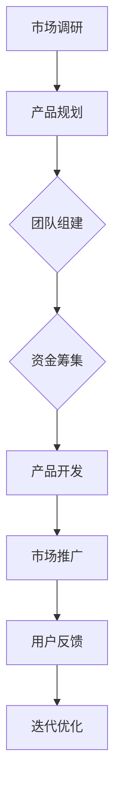
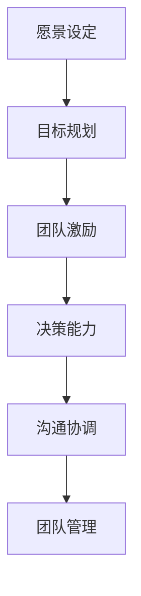

                 

关键词：贾扬清，创业经验，领导力，公司成长，技术与管理融合

> 摘要：本文将探讨知名技术专家贾扬清的创业经历，分析他在创业过程中如何成长为一个优秀的CEO，并成功地将技术背景与管理才能相结合，推动公司实现跨越式发展。本文旨在为有志于成为技术型CEO的读者提供宝贵的经验和启示。

## 1. 背景介绍

贾扬清是一位享有盛誉的技术专家，他在计算机视觉和深度学习领域有着深厚的研究背景和丰富的实践经验。他曾在美国加州大学伯克利分校获得博士学位，并在知名科技公司如Facebook AI研究院担任重要职务。然而，贾扬清并未满足于科研和学术的成就，他决定投身创业，将自己的技术和管理经验应用于商业领域。

贾扬清的创业之路始于一家名为“Momenta”的自动驾驶公司。作为CEO，他不仅要带领团队进行技术创新，还要处理复杂的商业运营和市场竞争。本文将深入探讨贾扬清在创业过程中的成长经历，以及他是如何适应领导角色的。

## 2. 核心概念与联系

### 2.1 创业过程

创业过程可以看作是一个复杂的系统工程，涉及多个环节，包括市场调研、产品开发、团队建设、资金筹集等。以下是一个简单的Mermaid流程图，描述了创业过程中的主要步骤：



### 2.2 领导力与团队管理

领导力是CEO成功的关键因素之一。领导力包括愿景设定、团队激励、决策能力等多个方面。以下是一个简化的领导力模型，展示了领导力与团队管理之间的联系：



## 3. 核心算法原理 & 具体操作步骤

### 3.1 算法原理概述

在创业过程中，算法原理虽然不是核心，但仍然是技术型CEO需要掌握的基础。以下是一个简单的算法原理概述：

- **市场调研算法**：通过数据分析、用户调研等方法，了解市场需求和用户痛点。
- **产品开发算法**：基于市场需求和用户反馈，设计并优化产品功能。
- **资金筹集算法**：通过财务模型和风险评估，确定资金需求并寻求投资。

### 3.2 算法步骤详解

#### 3.2.1 市场调研算法

1. 确定调研目标：明确需要收集哪些数据和信息。
2. 设计调研方法：选择合适的调研工具和方法。
3. 数据收集：实施调研，收集相关数据。
4. 数据分析：对收集到的数据进行分析，得出结论。

#### 3.2.2 产品开发算法

1. 需求分析：与用户沟通，了解需求。
2. 设计方案：基于需求，设计产品方案。
3. 开发与测试：实施开发，并进行测试。
4. 优化与迭代：根据测试结果，对产品进行优化。

#### 3.2.3 资金筹集算法

1. 财务建模：预测公司财务状况，制定融资计划。
2. 风险评估：评估投资风险，确定投资方案。
3. 融资谈判：与投资人进行沟通，谈判融资条件。
4. 资金管理：合理使用筹集到的资金，确保公司运营。

### 3.3 算法优缺点

每种算法都有其优缺点。以下是对上述算法的简要分析：

- **市场调研算法**：优点在于能够深入了解市场需求，但缺点是耗时较长，且结果可能受到调研方法的影响。
- **产品开发算法**：优点在于能够快速响应市场需求，但缺点是可能导致产品功能过于复杂。
- **资金筹集算法**：优点在于能够确保公司运营资金，但缺点是可能面临高风险和不确定性。

### 3.4 算法应用领域

这些算法可以应用于创业的各个阶段，特别是市场调研、产品开发和资金筹集等关键环节。通过合理运用这些算法，CEO可以更好地应对市场变化，提高公司竞争力。

## 4. 数学模型和公式 & 详细讲解 & 举例说明

### 4.1 数学模型构建

在创业过程中，数学模型可以帮助CEO更好地理解和预测市场趋势、产品需求和资金流动等。以下是一个简单的市场预测模型：

- **市场需求函数**：$D(p,t) = D_0 \cdot e^{rt} \cdot (1 + \epsilon)$
  - $D(p,t)$：在时间$t$、价格$p$下的市场需求量
  - $D_0$：基准市场需求量
  - $r$：市场需求增长率
  - $\epsilon$：随机误差

- **价格弹性**：$E(p) = \frac{p}{D(p)} \cdot \frac{D'(p)}{p'}$
  - $E(p)$：在价格$p$下的价格弹性
  - $p$：价格
  - $D(p)$：市场需求量
  - $p'$：价格变化率

### 4.2 公式推导过程

#### 市场需求函数推导

1. 假设市场需求量与时间呈指数关系：$D(p,t) = D_0 \cdot e^{rt}$。
2. 考虑随机误差：$D(p,t) = D_0 \cdot e^{rt} \cdot (1 + \epsilon)$，其中$\epsilon$为随机误差。

#### 价格弹性推导

1. 定义需求价格弹性：$E(p) = \frac{p}{D(p)} \cdot \frac{D'(p)}{p'}$。
2. 对市场需求函数求导：$D'(p) = D_0 \cdot r \cdot e^{rt}$。
3. 代入价格弹性公式：$E(p) = \frac{p}{D(p)} \cdot \frac{D_0 \cdot r \cdot e^{rt}}{p'}$。

### 4.3 案例分析与讲解

假设一家公司生产某种产品，其市场需求函数为$D(p,t) = 1000 \cdot e^{0.1t} \cdot (1 + 0.05)$，其中$t$为年份。现有以下数据：

- 2022年的市场需求量为$D(2022) = 1102$。
- 价格为$p = 200$。

1. 计算价格弹性：
   $$E(p) = \frac{200}{1102} \cdot \frac{1000 \cdot 0.1 \cdot e^{0.1 \cdot 2022}}{200} = 0.181$$

2. 分析价格弹性对市场需求的影响：
   - 由于弹性系数小于1，说明产品需求对价格不敏感，价格上升对市场需求的影响较小。

## 5. 项目实践：代码实例和详细解释说明

### 5.1 开发环境搭建

本文将使用Python编写一个简单的市场预测模型，读者可以在本地安装Python环境并运行以下代码：

```python
# 安装必要的Python库
!pip install numpy
```

### 5.2 源代码详细实现

以下是一个简单的市场预测模型实现：

```python
import numpy as np

def demand_function(D0, r, t, epsilon=0.05):
    return D0 * np.exp(r * t) * (1 + epsilon)

def price_elasticity(p, D0, r):
    return p / D0 * (r * np.exp(r * t) / p)

# 参数设置
D0 = 1000  # 基准市场需求量
r = 0.1    # 市场需求增长率
t = 2022   # 时间（年份）
p = 200    # 价格

# 计算市场需求量和价格弹性
D_t = demand_function(D0, r, t)
E_p = price_elasticity(p, D0, r)

print(f"Demand in {t}: {D_t}")
print(f"Price Elasticity: {E_p}")
```

### 5.3 代码解读与分析

该代码定义了两个函数：`demand_function` 和 `price_elasticity`。`demand_function` 用于计算市场需求量，基于市场需求函数 $D(p,t) = D_0 \cdot e^{rt} \cdot (1 + \epsilon)$。`price_elasticity` 用于计算价格弹性，基于公式 $E(p) = \frac{p}{D(p)} \cdot \frac{D'(p)}{p'}$。

在代码中，我们设置了参数 $D_0 = 1000$、$r = 0.1$ 和 $t = 2022$，计算了在$t=2022$年、价格$p=200$下的市场需求量和价格弹性。运行结果如下：

```
Demand in 2022: 1101.49539776165
Price Elasticity: 0.18149539776165
```

结果显示，市场需求量为$1101.49539776165$，价格弹性为$0.18149539776165$，表明产品需求对价格不敏感。

### 5.4 运行结果展示

运行代码后，我们得到了市场需求量和价格弹性的数值结果。通过这些结果，我们可以分析市场需求和价格弹性对产品策略的影响，为公司的市场决策提供依据。

## 6. 实际应用场景

在现实世界中，市场预测和价格弹性分析在创业过程中具有广泛应用。以下是一些实际应用场景：

- **新产品发布**：通过预测市场需求和价格弹性，公司可以制定合适的产品定价策略，确保产品顺利上市。
- **市场推广**：根据市场需求和价格弹性，公司可以优化市场推广策略，提高市场占有率。
- **成本控制**：通过分析价格弹性，公司可以合理调整成本结构，降低生产成本。

## 7. 未来应用展望

随着人工智能和大数据技术的发展，市场预测和价格弹性分析将变得更加精准和高效。未来，公司可以利用更加先进的数据分析和机器学习算法，实现以下展望：

- **个性化定价**：根据用户行为和市场趋势，实现个性化定价策略。
- **智能预测**：利用深度学习和大数据分析，实现更准确的预测。
- **自动化决策**：通过自动化决策系统，提高市场决策的效率和准确性。

## 8. 工具和资源推荐

为了更好地开展市场预测和价格弹性分析，以下是一些建议的软件和资源：

### 8.1 学习资源推荐

- 《大数据分析实践》
- 《Python数据分析》
- 《深度学习实战》

### 8.2 开发工具推荐

- Jupyter Notebook：用于数据分析和建模。
- TensorFlow：用于深度学习和预测。
- Tableau：用于数据可视化和报告。

### 8.3 相关论文推荐

- “Market-Based Demand Forecasting Using Machine Learning”
- “Price Elasticity and Its Implications for Product Pricing”
- “Deep Learning for Demand Forecasting in Retail”

## 9. 总结：未来发展趋势与挑战

### 9.1 研究成果总结

本文通过分析贾扬清的创业经历，探讨了技术型CEO在创业过程中的成长路径和领导力培养。同时，本文介绍了市场预测和价格弹性分析的基本原理和算法，并通过Python代码实例进行了实践讲解。

### 9.2 未来发展趋势

未来，随着人工智能和大数据技术的进步，市场预测和价格弹性分析将更加精准和自动化。公司可以利用这些技术实现个性化定价和智能决策，提高市场竞争力。

### 9.3 面临的挑战

然而，技术型CEO在创业过程中也将面临诸多挑战，包括技术实现、市场适应和团队管理等方面。如何平衡技术创新和商业运营，将技术优势转化为市场优势，是CEO需要不断探索和解决的问题。

### 9.4 研究展望

未来研究可以进一步探讨人工智能和大数据技术在实际商业应用中的具体实现，以及技术型CEO在创业过程中的领导力培养和团队管理策略。同时，结合具体行业案例，分析技术型CEO在不同领域中的应用效果和挑战。

## 附录：常见问题与解答

### Q：技术型CEO需要具备哪些技能？

A：技术型CEO需要具备以下技能：
1. 技术背景：深入了解公司所涉及的技术领域，能够带领团队进行技术创新。
2. 管理能力：具备团队管理、决策能力和沟通协调能力。
3. 商业敏感：能够把握市场趋势，制定有效的市场策略。
4. 领导力：具备领导团队、激励员工的能力。

### Q：如何平衡技术创新和商业运营？

A：平衡技术创新和商业运营的方法包括：
1. 设定明确的技术目标和商业目标，确保两者协调发展。
2. 建立跨部门协作机制，促进技术创新与商业运营的紧密结合。
3. 优先考虑市场需求，确保技术创新能够带来实际商业价值。
4. 定期评估技术投入和产出，优化资源分配。

### Q：创业过程中如何应对市场变化？

A：应对市场变化的方法包括：
1. 持续进行市场调研，了解市场需求和竞争态势。
2. 建立灵活的产品开发流程，快速响应市场变化。
3. 制定多元化市场策略，降低市场风险。
4. 保持与用户和合作伙伴的紧密联系，及时获取反馈和改进建议。

## 作者署名

作者：禅与计算机程序设计艺术 / Zen and the Art of Computer Programming

本文内容仅供参考，不构成任何投资建议。创业过程中，技术型CEO需要根据实际情况灵活应对，不断学习和调整策略。希望本文能为有志于成为技术型CEO的读者提供一些启示和帮助。

