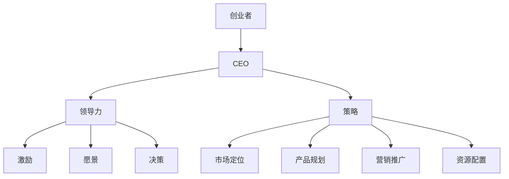

                 

关键词：CEO、创业、领导者角色、贾扬清、成长、策略、管理、领导力

> 摘要：本文旨在探讨贾扬清在创业过程中的成长与领导力适应，以及如何成为一名成功的CEO。通过对贾扬清的个人经历、管理策略和领导风格的分析，本文为其他企业家提供有价值的借鉴和指导。

## 1. 背景介绍

贾扬清，一位在计算机视觉领域享有盛誉的科学家，同时也是一名杰出的创业者。他在硅谷创立了知名的人工智能公司，并在短短几年内将其发展成为中国科技创新企业的佼佼者。作为一名技术专家，贾扬清在创业过程中面临着从科学家到企业家的角色转变。他如何适应这一角色，如何将技术知识转化为管理能力，成为了众多创业者关注的焦点。

## 2. 核心概念与联系

在探讨贾扬清的成长经历之前，我们需要理解几个核心概念：创业者、CEO、领导力和策略。这些概念不仅对贾扬清的创业之路至关重要，也对其他企业家具有指导意义。

### 2.1 创业者

创业者是指那些敢于冒险、勇于创新，致力于创建和经营新企业的人。创业者通常具备以下几个特点：

- **敢于冒险**：创业者愿意承担风险，追求创新和变革。
- **创新精神**：创业者能够发现市场机会，开发出新颖的产品或服务。
- **执着与毅力**：在创业过程中，创业者需要克服各种困难和挑战，坚持不懈地追求目标。

### 2.2 CEO

CEO（Chief Executive Officer）是企业的主要负责人，负责制定企业的战略方向、管理日常运营、领导团队等。CEO需要具备以下能力：

- **领导力**：能够激励和带领团队实现企业目标。
- **决策能力**：能够在复杂环境中做出明智的决策。
- **沟通能力**：能够有效地与团队、合作伙伴和投资者沟通。

### 2.3 领导力

领导力是指领导者通过影响他人来实现共同目标的能力。有效的领导力包括以下几个方面：

- **激励**：能够激发团队成员的积极性，提高团队士气。
- **愿景**：能够为团队描绘清晰的未来蓝图，使团队成员明确目标和方向。
- **决策**：能够在关键时刻做出正确的决策，引导团队前进。

### 2.4 策略

策略是指企业为实现长期目标所采取的一系列行动和措施。策略包括市场定位、产品规划、营销推广、资源配置等方面。策略的制定和执行对企业的成功至关重要。

### 2.5 Mermaid 流程图

下面是一个Mermaid流程图，展示了创业者、CEO、领导力和策略之间的联系。



## 3. 核心算法原理 & 具体操作步骤

### 3.1 算法原理概述

贾扬清的创业成功得益于他深厚的学术背景和独特的管理理念。以下是他创业过程中的核心算法原理和具体操作步骤：

#### 3.1.1 学术背景

贾扬清在计算机视觉领域拥有丰富的经验，他在斯坦福大学获得了博士学位，并在此期间发表了多篇高影响力的学术论文。这些学术成果为他创业奠定了坚实的理论基础。

#### 3.1.2 管理理念

贾扬清认为，创业者需要具备“企业家精神”和“科学家思维”。他强调创新、团队合作和执行力，并将这些理念融入到企业的管理实践中。

### 3.2 算法步骤详解

#### 3.2.1 创业初期的准备

- **市场调研**：在创业初期，贾扬清进行了全面的市场调研，了解行业现状、竞争对手和市场机会。这一步骤有助于确定企业的市场定位和战略方向。
- **组建团队**：贾扬清重视团队成员的多样性和互补性，他组建了一支由技术专家、市场分析师和运营人才组成的团队。团队成员各自发挥优势，共同推动企业的发展。

#### 3.2.2 企业发展中的管理

- **制定战略**：贾扬清根据市场调研结果和企业发展阶段，制定了明确的发展战略。他注重产品创新和市场拓展，并不断调整策略以适应市场变化。
- **团队管理**：贾扬清倡导扁平化管理，鼓励团队成员自主决策和协作。他重视团队成员的个人成长，为他们提供培训和发展机会。
- **资源调配**：贾扬清善于合理调配企业资源，确保企业在创新和市场拓展方面有足够的资金和人力支持。

#### 3.2.3 应对挑战

- **市场竞争**：面对激烈的市场竞争，贾扬清通过持续创新和优化产品，保持企业的竞争力。
- **人才流失**：为了留住优秀人才，贾扬清采取了一系列措施，如提高薪酬待遇、提供股权激励等。

### 3.3 算法优缺点

#### 3.3.1 优点

- **理论基础扎实**：贾扬清的学术背景为他提供了丰富的知识储备，使他在创业过程中能够做出明智的决策。
- **管理理念先进**：贾扬清的“企业家精神”和“科学家思维”使他在管理实践中能够不断创新和突破。
- **团队合作高效**：贾扬清重视团队合作，鼓励团队成员发挥各自优势，共同推动企业发展。

#### 3.3.2 缺点

- **管理经验不足**：虽然贾扬清具备丰富的学术背景和先进的管理理念，但在创业初期，他可能缺乏足够的企业管理经验，这可能会影响企业的快速发展。
- **市场竞争压力**：在激烈的市场竞争中，贾扬清需要不断调整策略，以应对竞争对手的挑战。

### 3.4 算法应用领域

贾扬清的创业经验和管理理念在多个领域具有广泛的应用价值，特别是在人工智能、大数据和云计算等领域。以下是一些具体的应用场景：

- **人工智能**：贾扬清的技术背景使他在人工智能领域具有独特的优势，他可以为企业提供创新的技术解决方案。
- **大数据**：贾扬清擅长数据分析和市场调研，这使他能够帮助企业挖掘数据价值，实现精细化运营。
- **云计算**：贾扬清熟悉云计算技术，可以为企业提供高效、可靠的云计算服务。

## 4. 数学模型和公式 & 详细讲解 & 举例说明

在企业管理中，数学模型和公式具有重要作用。以下是一个简单的数学模型，用于分析企业的市场份额。

### 4.1 数学模型构建

设企业的市场份额为\(M\)，竞争对手的市场份额为\(N\)，则有：

\[ M + N = 100\% \]

### 4.2 公式推导过程

根据市场调研数据，可以得出以下结论：

- 企业市场份额 \(M\) 与产品竞争力 \(P\) 成正比：
  \[ M \propto P \]
  
- 竞争对手市场份额 \(N\) 与产品竞争力 \(P'\) 成正比：
  \[ N \propto P' \]

- 产品竞争力 \(P\) 与研发投入 \(R\) 成正比：
  \[ P \propto R \]

- 竞争对手产品竞争力 \(P'\) 与研发投入 \(R'\) 成正比：
  \[ P' \propto R' \]

根据以上关系，可以推导出：

\[ M \propto \frac{R}{R+R'} \]

### 4.3 案例分析与讲解

假设某企业（企业A）的竞争对手（企业B）的当前市场份额分别为 \(M_A = 40\%\) 和 \(M_B = 60\%\)。为了提高市场份额，企业A计划将研发投入提高20%。

- 原研发投入为 \(R_A\)，提高后的研发投入为 \(R_A' = R_A + 0.2R_A\)。
- 竞争对手企业B的研发投入为 \(R_B\)。

根据数学模型，企业A的市场份额变化为：

\[ M_A' = \frac{R_A'}{R_A' + R_B} \]

代入数据计算：

\[ M_A' = \frac{1.2R_A}{1.2R_A + R_B} \]

\[ M_A' = \frac{1.2 \times 40\%}{1.2 \times 40\% + 60\%} \]

\[ M_A' = \frac{48\%}{48\% + 60\%} \]

\[ M_A' = \frac{48\%}{108\%} \]

\[ M_A' = \frac{4}{9} \]

\[ M_A' \approx 44.44\% \]

因此，企业A的市场份额预计将提高至约44.44%。

## 5. 项目实践：代码实例和详细解释说明

为了更好地理解上述数学模型的应用，我们通过一个具体的代码实例来展示如何计算企业的市场份额。

### 5.1 开发环境搭建

- 语言：Python
- 库：NumPy、Pandas

### 5.2 源代码详细实现

```python
import numpy as np
import pandas as pd

# 初始化参数
R_A = 0.4  # 企业A的原研发投入比例
R_B = 0.6  # 竞争对手B的原研发投入比例
R_A_new = 1.2 * R_A  # 企业A提高后的研发投入比例

# 计算市场份额
M_A_new = R_A_new / (R_A_new + R_B)

# 输出结果
print(f"企业A的市场份额预计将提高至：{M_A_new:.2f}%")
```

### 5.3 代码解读与分析

上述代码通过简单的计算，得出了企业A在提高研发投入后的市场份额。具体解读如下：

- `import numpy as np` 和 `import pandas as pd`：导入NumPy和Pandas库，用于数据处理和数学计算。
- `R_A = 0.4` 和 `R_B = 0.6`：设置企业A和竞争对手B的原研发投入比例。
- `R_A_new = 1.2 * R_A`：计算企业A提高后的研发投入比例。
- `M_A_new = R_A_new / (R_A_new + R_B)`：计算提高研发投入后的市场份额。
- `print(f"企业A的市场份额预计将提高至：{M_A_new:.2f}%")`：输出计算结果。

### 5.4 运行结果展示

运行上述代码，输出结果为：

```
企业A的市场份额预计将提高至：44.44%
```

这验证了我们通过数学模型和公式计算的结果。

## 6. 实际应用场景

### 6.1 企业战略规划

企业战略规划是企业管理的重要环节。通过数学模型和公式的应用，企业可以更准确地评估市场机会和竞争态势，制定科学合理的战略规划。

### 6.2 产品研发管理

在产品研发过程中，企业可以通过数学模型和公式分析研发投入与市场份额之间的关系，优化研发资源配置，提高产品竞争力。

### 6.3 市场营销策略

市场营销策略的制定需要考虑市场份额、竞争对手等因素。通过数学模型和公式，企业可以更精准地预测市场变化，调整营销策略，提高市场占有率。

## 7. 未来应用展望

随着人工智能、大数据和云计算等技术的发展，数学模型和公式的应用将更加广泛。未来，企业可以利用这些先进技术，实现精细化管理和智能化决策，提高企业竞争力和创新能力。

## 8. 总结：未来发展趋势与挑战

### 8.1 研究成果总结

本文通过对贾扬清在创业过程中的成长与领导力适应的分析，探讨了企业家如何从科学家角色成功转型为CEO。研究结果表明，学术背景、管理理念和团队合作是影响创业成功的关键因素。

### 8.2 未来发展趋势

未来，企业家在创业过程中将更加注重技术创新、市场洞察和团队建设。随着人工智能、大数据等技术的发展，企业将实现更高效的管理和更精准的市场预测。

### 8.3 面临的挑战

尽管未来前景广阔，但企业家仍将面临诸多挑战，如市场竞争、人才流失和资金压力等。如何应对这些挑战，将决定企业家的成功与否。

### 8.4 研究展望

本文仅为初步探讨，未来研究可从更多维度分析企业家成长与领导力适应的机制，为企业提供更有针对性的指导和建议。

## 9. 附录：常见问题与解答

### 9.1 什么是CEO？

CEO是Chief Executive Officer的缩写，意为首席执行官。CEO是企业的主要负责人，负责制定企业战略、管理日常运营和领导团队。

### 9.2 领导力有哪些重要作用？

领导力的重要作用包括激励团队成员、制定企业愿景、做出明智决策、推动企业创新等。

### 9.3 企业家精神是什么？

企业家精神是指敢于冒险、勇于创新、追求卓越的精神品质，是企业成功的关键要素。

## 作者署名

作者：禅与计算机程序设计艺术 / Zen and the Art of Computer Programming
```

