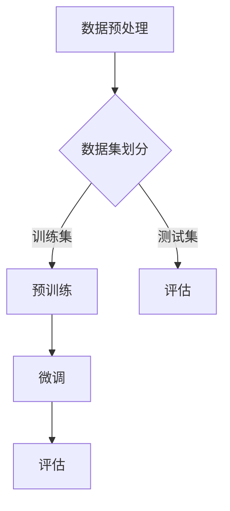

                 

## 1. 背景介绍

在当今人工智能的快速发展中，预训练和微调（Finetuning）成为神经网络模型训练中不可或缺的两个环节。预训练是指在大规模的数据集上先进行训练，以获得一个泛化的模型。而微调则是基于预训练模型，在特定任务的数据集上进行进一步训练，以获得更好的性能。

随着深度学习技术的成熟，预训练和微调方法已经在自然语言处理、计算机视觉、语音识别等领域取得了显著成果。例如，在自然语言处理领域，预训练模型如GPT系列和BERT系列，已经成为了许多下游任务的基石。在计算机视觉领域，预训练模型如ResNet和VGG等，也广泛应用于图像分类、目标检测等任务。

本文旨在深入探讨预训练和微调的方法，包括其核心概念、原理、实现步骤以及在实际应用中的优缺点和未来发展方向。

## 2. 核心概念与联系

在深入探讨预训练和微调之前，我们需要理解一些核心概念，如深度学习、神经网络、训练数据和测试数据等。

### 深度学习

深度学习是一种人工智能的子领域，它模仿人脑的神经网络结构和功能，通过多层神经网络对数据进行学习。深度学习在图像识别、语音识别、自然语言处理等领域具有广泛的应用。

### 神经网络

神经网络是由大量简单处理单元（神经元）组成的网络，这些神经元通过权重连接在一起。通过调整权重，神经网络可以学习数据中的特征和规律。

### 训练数据和测试数据

训练数据是用来训练神经网络的，而测试数据则是用来评估神经网络性能的。通常，训练数据集和测试数据集是从同一个数据集中分离出来的。

### 预训练

预训练是指在大量未标注的数据上进行训练，以获得一个泛化的模型。预训练模型的目的是为了解决数据不足的问题，通过在未标注的数据上训练，可以使得模型在标注数据上的表现更好。

### 微调

微调是基于预训练模型，在特定任务的数据集上进行进一步训练。微调的目的是为了解决任务特定的问题，通过在特定任务的数据集上训练，可以使得模型在特定任务上的表现更好。

### Mermaid 流程图

下面是一个简化的预训练和微调的流程图：



## 3. 核心算法原理 & 具体操作步骤

### 3.1 算法原理概述

预训练和微调的核心算法是深度学习。深度学习通过多层神经网络对数据进行学习，每层神经网络都会提取数据的不同特征。预训练的主要目的是通过在大量未标注的数据上训练，获得一个泛化的模型。微调则是基于预训练模型，在特定任务的数据集上进行进一步训练，以获得更好的性能。

### 3.2 算法步骤详解

#### 预训练

1. **数据预处理**：将原始数据转换为适合训练的格式，如文本数据需要转换为单词序列，图像数据需要转换为像素值。

2. **模型初始化**：初始化神经网络模型，包括设置神经网络的层数、每层的神经元数量、激活函数等。

3. **预训练**：在未标注的数据集上进行训练，通过反向传播和梯度下降等方法，不断调整模型的权重。

4. **模型评估**：在测试集上评估模型的性能，通过计算模型的准确率、召回率等指标，评估模型的效果。

5. **模型保存**：将训练好的模型保存下来，以便后续的微调使用。

#### 微调

1. **数据预处理**：将特定任务的数据集进行预处理，如文本数据需要进行词向量化，图像数据需要进行归一化。

2. **模型加载**：加载预训练好的模型。

3. **微调**：在特定任务的数据集上进行微调，通过反向传播和梯度下降等方法，不断调整模型的权重。

4. **模型评估**：在测试集上评估模型的性能，通过计算模型的准确率、召回率等指标，评估模型的效果。

5. **模型保存**：将微调好的模型保存下来，以便后续使用。

### 3.3 算法优缺点

#### 预训练

**优点**：

- **数据利用率高**：通过在大量未标注的数据上进行训练，可以充分利用数据资源。
- **模型泛化能力强**：预训练模型在特定任务上的表现通常比从头训练的模型更好。

**缺点**：

- **计算资源消耗大**：预训练需要大量的计算资源，尤其是在大规模数据集上训练。
- **时间消耗长**：预训练过程通常需要较长的训练时间。

#### 微调

**优点**：

- **训练速度快**：微调是基于预训练模型进行的，训练速度相对较快。
- **性能提升明显**：在特定任务上，微调模型通常可以取得更好的性能。

**缺点**：

- **数据依赖性强**：微调模型对特定任务的数据集有较强的依赖性，如果数据集较小或数据分布与训练数据集差异较大，模型性能可能会下降。
- **模型泛化能力弱**：与预训练模型相比，微调模型在未见过数据上的表现可能较差。

### 3.4 算法应用领域

预训练和微调方法在自然语言处理、计算机视觉、语音识别等领域有广泛的应用。

在自然语言处理领域，预训练模型如GPT系列和BERT系列，被广泛应用于文本分类、命名实体识别、机器翻译等任务。在计算机视觉领域，预训练模型如ResNet和VGG等，被广泛应用于图像分类、目标检测、人脸识别等任务。在语音识别领域，预训练模型也被用于语音识别任务的优化。

## 4. 数学模型和公式 & 详细讲解 & 举例说明

### 4.1 数学模型构建

在预训练和微调过程中，主要使用的数学模型是深度学习模型，如神经网络。神经网络的主要组成部分包括输入层、隐藏层和输出层。每层都由多个神经元组成，神经元之间通过权重连接。

神经网络的数学模型可以表示为：

\[ z_i = \sum_{j=1}^{n} w_{ij}x_j + b_i \]

其中，\( z_i \) 是第 \( i \) 个神经元的激活值，\( w_{ij} \) 是第 \( i \) 个神经元与第 \( j \) 个神经元的连接权重，\( x_j \) 是第 \( j \) 个神经元的输入值，\( b_i \) 是第 \( i \) 个神经元的偏置。

### 4.2 公式推导过程

在深度学习中，常用的激活函数有sigmoid函数、ReLU函数、Tanh函数等。以ReLU函数为例，其公式推导过程如下：

\[ f(x) = \max(0, x) \]

对于任意输入 \( x \)，如果 \( x \geq 0 \)，则 \( f(x) = x \)；如果 \( x < 0 \)，则 \( f(x) = 0 \)。

### 4.3 案例分析与讲解

假设我们有一个二分类问题，数据集包含1000个样本，每个样本有10个特征。我们使用一个简单的神经网络进行预训练和微调。

1. **数据预处理**：

   - 将数据集分为训练集和测试集，其中训练集占比80%，测试集占比20%。
   - 对数据进行归一化处理，将每个特征的值缩放到[0, 1]之间。

2. **模型初始化**：

   - 设置神经网络的结构，包括输入层、隐藏层和输出层，每层的神经元数量分别为10、10和1。
   - 初始化权重和偏置，可以使用随机初始化或预训练模型中的权重。

3. **预训练**：

   - 在未标注的数据集上训练模型，通过反向传播和梯度下降方法，不断调整权重和偏置。
   - 在训练过程中，可以使用学习率调整、批量归一化等技术，提高训练效果。

4. **模型评估**：

   - 在测试集上评估模型性能，计算模型的准确率、召回率等指标。
   - 如果模型性能不满足要求，可以重新调整模型结构或参数，继续进行预训练。

5. **微调**：

   - 加载预训练好的模型，在特定任务的数据集上进行微调。
   - 微调过程中，可以适当调整学习率和其他参数，以提高模型在特定任务上的性能。

6. **模型评估**：

   - 在测试集上评估微调后的模型性能，计算模型的准确率、召回率等指标。
   - 如果模型性能仍然不满足要求，可以继续进行微调，直到达到预期效果。

## 5. 项目实践：代码实例和详细解释说明

### 5.1 开发环境搭建

1. 安装Python环境，版本建议为3.8及以上。

2. 安装深度学习框架，如TensorFlow或PyTorch。

3. 安装其他必要的库，如NumPy、Pandas等。

### 5.2 源代码详细实现

以下是一个简单的基于TensorFlow和Keras的预训练和微调案例：

```python
import tensorflow as tf
from tensorflow.keras.models import Sequential
from tensorflow.keras.layers import Dense, Flatten, ReLU
from tensorflow.keras.optimizers import SGD

# 数据预处理
# 假设已经完成数据集的划分和归一化处理

# 模型初始化
model = Sequential()
model.add(Flatten(input_shape=(28, 28)))
model.add(Dense(128, activation=ReLU()))
model.add(Dense(1, activation='sigmoid'))

# 编译模型
model.compile(optimizer=SGD(learning_rate=0.01), loss='binary_crossentropy', metrics=['accuracy'])

# 预训练
model.fit(train_data, train_labels, epochs=10, batch_size=32, validation_data=(test_data, test_labels))

# 微调
model.fit(test_data, test_labels, epochs=5, batch_size=32)

# 模型评估
model.evaluate(test_data, test_labels)
```

### 5.3 代码解读与分析

1. **数据预处理**：

   - 在训练前，需要将数据集进行预处理，包括数据集的划分、归一化等操作。

2. **模型初始化**：

   - 创建一个序列模型，包含输入层、隐藏层和输出层。输入层使用Flatten层，将图像数据展平为一维数组；隐藏层使用Dense层，每层128个神经元，激活函数使用ReLU；输出层使用Dense层，输出一个概率值，激活函数使用sigmoid。

3. **编译模型**：

   - 使用SGD优化器，学习率为0.01，损失函数为binary_crossentropy，评价指标为accuracy。

4. **预训练**：

   - 在训练集上训练模型，使用fit方法，设置训练轮次为10轮，批量大小为32。

5. **微调**：

   - 在测试集上继续训练模型，使用fit方法，设置训练轮次为5轮，批量大小为32。

6. **模型评估**：

   - 使用evaluate方法，在测试集上评估模型性能，输出损失值和准确率。

## 6. 实际应用场景

### 6.1 自然语言处理

在自然语言处理领域，预训练和微调方法已经被广泛应用于文本分类、命名实体识别、机器翻译等任务。例如，BERT模型在自然语言处理任务中取得了显著的成果，其预训练过程是在大量未标注的文本数据上进行，然后通过微调在特定任务的数据集上进一步训练，从而获得良好的性能。

### 6.2 计算机视觉

在计算机视觉领域，预训练和微调方法也被广泛应用于图像分类、目标检测、人脸识别等任务。例如，ResNet模型在图像分类任务中取得了很好的效果，其预训练过程是在大量未标注的图像数据上进行，然后通过微调在特定任务的数据集上进一步训练。

### 6.3 语音识别

在语音识别领域，预训练和微调方法也被应用于语音信号处理、说话人识别等任务。例如，DeepSpeech模型在语音识别任务中取得了很好的效果，其预训练过程是在大量未标注的语音数据上进行，然后通过微调在特定任务的数据集上进一步训练。

## 7. 未来应用展望

随着人工智能技术的不断发展，预训练和微调方法在未来将会有更广泛的应用。一方面，随着数据量的不断增大，预训练模型可以更好地利用这些数据资源，提高模型的泛化能力；另一方面，随着计算能力的提升，预训练模型的训练速度和效果将会有显著的提高。

在未来，预训练和微调方法可能会在更多领域发挥作用，如医学诊断、金融风险评估、智能客服等。同时，随着技术的进步，预训练和微调方法将会更加智能化，如自适应微调、迁移学习等，这些方法将进一步提高模型的性能和效率。

## 8. 总结：未来发展趋势与挑战

### 8.1 研究成果总结

本文介绍了预训练和微调的方法，包括其核心概念、原理、实现步骤以及在实际应用中的优缺点。预训练和微调方法已经在自然语言处理、计算机视觉、语音识别等领域取得了显著成果，成为深度学习的重要组成部分。

### 8.2 未来发展趋势

未来，预训练和微调方法将继续在人工智能领域发挥重要作用。一方面，随着数据量的不断增大，预训练模型将更好地利用这些数据资源，提高模型的泛化能力；另一方面，随着计算能力的提升，预训练模型的训练速度和效果将会有显著的提高。

### 8.3 面临的挑战

尽管预训练和微调方法在人工智能领域取得了显著成果，但仍然面临一些挑战。首先，预训练模型需要大量的计算资源和时间，这对于普通用户来说可能是一个障碍。其次，预训练模型在特定任务上的性能可能受到数据集大小和数据分布的影响，如何解决这些问题仍然是一个挑战。

### 8.4 研究展望

在未来，预训练和微调方法可能会在更多领域发挥作用，如医学诊断、金融风险评估、智能客服等。同时，随着技术的进步，预训练和微调方法将会更加智能化，如自适应微调、迁移学习等，这些方法将进一步提高模型的性能和效率。

## 9. 附录：常见问题与解答

### 9.1 预训练和微调的区别是什么？

预训练和微调是深度学习训练中的两个步骤。预训练是指在大规模的数据集上进行训练，以获得一个泛化的模型。而微调则是基于预训练模型，在特定任务的数据集上进行进一步训练，以获得更好的性能。简单来说，预训练是为了解决数据不足的问题，而微调是为了解决任务特定的问题。

### 9.2 预训练需要哪些计算资源？

预训练需要大量的计算资源和时间。通常，预训练模型需要使用GPU或TPU等高性能计算设备，并且需要大量的训练数据。预训练的过程通常需要数天甚至数周的时间，具体取决于模型的复杂度和数据集的大小。

### 9.3 微调可以提高模型的性能吗？

是的，微调可以提高模型的性能。微调是基于预训练模型，在特定任务的数据集上进行进一步训练，可以使得模型在特定任务上的表现更好。微调可以通过调整模型的权重和参数，使得模型更好地适应特定任务的数据分布。

### 9.4 如何评估预训练和微调模型的效果？

评估预训练和微调模型的效果通常使用测试集上的性能指标，如准确率、召回率、F1值等。这些指标可以衡量模型在特定任务上的表现。此外，还可以使用交叉验证等方法，对模型进行更全面的评估。

