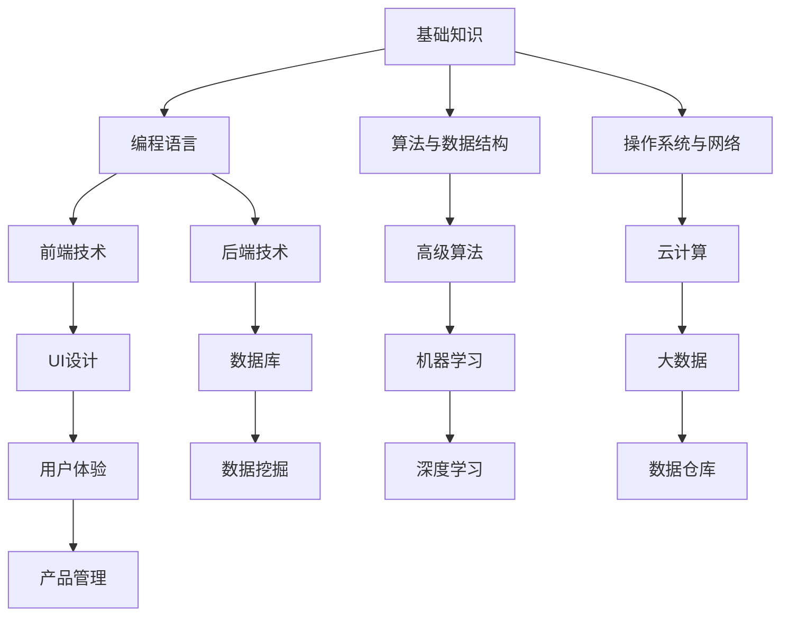
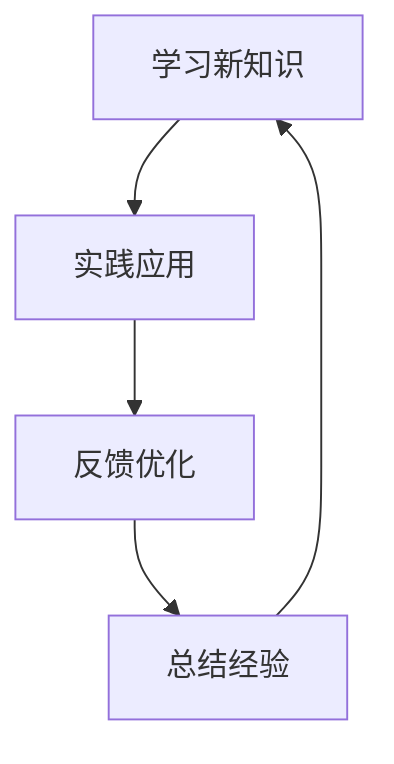
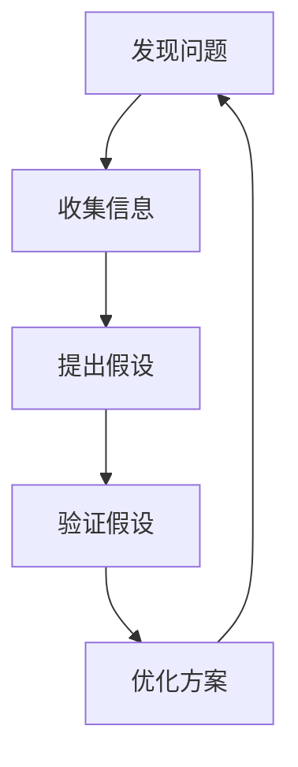

                 

关键词：持续学习、技术更新、知识体系、创新能力、职业发展

> 摘要：在信息技术飞速发展的今天，持续学习已成为现代IT从业者的基本素养。本文将从多个角度探讨持续学习的重要性，分析其在个人职业发展、技术进步以及创新思维方面的深远影响，并提供实用的学习方法和资源推荐，以帮助读者不断提升自我。

## 1. 背景介绍

随着互联网、大数据、人工智能等技术的迅猛发展，IT行业正经历着前所未有的变革。新技术的出现和迭代速度加快，传统技术和岗位正在不断被颠覆和重构。对于IT从业者而言，面对如此迅速的变化，如何保持竞争力，持续提升自身技术水平，成为了亟待解决的问题。

### 1.1 技术更新速度加快

以人工智能为例，从2012年AlexNet在ImageNet竞赛中大放异彩，到如今GPT-3等模型的出现，人工智能的发展速度令人惊叹。这种技术进步不仅改变了各行各业的运营模式，也对从业者的技能要求提出了更高标准。

### 1.2 岗位需求多样化

在互联网公司，从后台开发到前端设计，从数据分析师到产品经理，各类岗位对技能的要求日益多样化。这要求从业者不仅要精通自己的专业领域，还需要跨领域学习，提升综合素质。

### 1.3 职业寿命缩短

根据麦肯锡的研究，技术从业者的职业寿命相比其他行业明显缩短。在这样的大背景下，持续学习不仅是为了跟上时代的步伐，更是为了延长职业生涯，保持个人价值。

## 2. 核心概念与联系

为了更好地理解持续学习的重要性，我们需要从以下几个方面来探讨：

### 2.1 知识体系的重要性

知识体系是持续学习的基础。一个完备的知识体系可以帮助我们快速掌握新知识，并将新知识与已有知识进行有效整合。以下是一个简化版的IT知识体系结构图：



### 2.2 技能与知识的关系

技能是知识的运用，而知识是技能的基础。持续学习的过程就是不断丰富知识体系，进而提升技能水平的过程。以下是一个简化的技能提升流程图：



### 2.3 创新思维的重要性

在快速变化的技术环境中，创新思维变得尤为重要。创新思维可以帮助我们发现问题，提出解决方案，进而推动技术进步。以下是一个简化的创新思维模型：



## 3. 核心算法原理 & 具体操作步骤

### 3.1 算法原理概述

持续学习的一个重要体现是掌握前沿算法，并将其应用于实际问题中。以下是一个典型的机器学习算法——K-近邻算法（K-Nearest Neighbors，KNN）的原理概述：

KNN算法是一种基于实例的学习算法，其核心思想是：如果一个新样本在特征空间中的k个最接近的邻居的多数属于某一类别，则该样本也属于这一类别。

### 3.2 算法步骤详解

1. **选择合适的k值**：k值的选择会影响模型的性能。通常情况下，k值越大，模型的泛化能力越强，但计算成本也越高。
2. **计算距离**：对于新的样本点，计算它与训练集中所有样本点的距离。常用的距离度量方法包括欧氏距离、曼哈顿距离等。
3. **分类**：根据邻居的分类结果进行投票，选择出现次数最多的类别作为新样本的分类结果。

### 3.3 算法优缺点

**优点**：
- 实现简单，易于理解。
- 对小样本数据集效果较好。

**缺点**：
- 对噪声敏感。
- 预测速度较慢。

### 3.4 算法应用领域

KNN算法广泛应用于分类任务，如文本分类、图像识别等。在实际应用中，通过调整参数和结合其他算法，可以提高其性能。

## 4. 数学模型和公式 & 详细讲解 & 举例说明

### 4.1 数学模型构建

为了更好地理解KNN算法，我们需要引入距离度量的概念。以下是一个简单的欧氏距离公式：

$$
d(p, q) = \sqrt{\sum_{i=1}^{n} (p_i - q_i)^2}
$$

其中，$p$和$q$分别表示两个$n$维特征向量。

### 4.2 公式推导过程

为了推导KNN算法的分类过程，我们可以从逻辑回归模型入手。逻辑回归是一种经典的二分类算法，其公式如下：

$$
P(y=1|x) = \frac{1}{1 + e^{-\beta^T x}}
$$

其中，$y$表示真实标签，$x$表示特征向量，$\beta$是模型参数。

通过逻辑回归模型，我们可以推导出KNN算法的分类过程。具体步骤如下：

1. 对于新的样本点$x$，计算其与训练集中所有样本点的距离$d(x, x_i)$。
2. 选择距离最近的$k$个样本点$x_1, x_2, ..., x_k$。
3. 计算这些样本点的权重$w_i = \frac{1}{d(x, x_i)}$。
4. 对每个类别$C_j$，计算其概率$P(C_j|x) = \sum_{i=1}^{k} w_i \cdot P(y=j|x_i)$。
5. 选择概率最大的类别作为$x$的分类结果。

### 4.3 案例分析与讲解

假设我们有一个分类任务，需要将新的样本点$x$分类到两类中。训练集数据如下：

| 样本点 | 特征1 | 特征2 | 真实标签 |
| ------ | ----- | ----- | -------- |
| $x_1$  | 1     | 2     | 1        |
| $x_2$  | 2     | 3     | 1        |
| $x_3$  | 4     | 6     | 2        |
| $x_4$  | 6     | 7     | 2        |

现在，我们需要对新的样本点$x = (3, 4)$进行分类。首先，计算$x$与训练集中所有样本点的距离：

$$
d(x, x_1) = \sqrt{(3-1)^2 + (4-2)^2} = \sqrt{5}
$$

$$
d(x, x_2) = \sqrt{(3-2)^2 + (4-3)^2} = \sqrt{2}
$$

$$
d(x, x_3) = \sqrt{(3-4)^2 + (4-6)^2} = \sqrt{10}
$$

$$
d(x, x_4) = \sqrt{(3-6)^2 + (4-7)^2} = \sqrt{26}
$$

选择距离最近的$k=3$个样本点$x_1, x_2, x_3$，计算它们的权重：

$$
w_1 = \frac{1}{d(x, x_1)} = \frac{1}{\sqrt{5}}
$$

$$
w_2 = \frac{1}{d(x, x_2)} = \frac{1}{\sqrt{2}}
$$

$$
w_3 = \frac{1}{d(x, x_3)} = \frac{1}{\sqrt{10}}
$$

计算每个类别的概率：

$$
P(C_1|x) = w_1 \cdot P(y=1|x_1) + w_2 \cdot P(y=1|x_2) + w_3 \cdot P(y=1|x_3) = \frac{1}{\sqrt{5}} \cdot \frac{1}{1 + e^{-\beta^T x_1}} + \frac{1}{\sqrt{2}} \cdot \frac{1}{1 + e^{-\beta^T x_2}} + \frac{1}{\sqrt{10}} \cdot \frac{1}{1 + e^{-\beta^T x_3}}
$$

$$
P(C_2|x) = w_1 \cdot P(y=2|x_1) + w_2 \cdot P(y=2|x_2) + w_3 \cdot P(y=2|x_3) = \frac{1}{\sqrt{5}} \cdot \frac{1}{1 + e^{\beta^T x_1}} + \frac{1}{\sqrt{2}} \cdot \frac{1}{1 + e^{\beta^T x_2}} + \frac{1}{\sqrt{10}} \cdot \frac{1}{1 + e^{\beta^T x_3}}
$$

由于类别$C_1$的概率大于类别$C_2$的概率，我们选择类别$C_1$作为$x$的分类结果。

## 5. 项目实践：代码实例和详细解释说明

### 5.1 开发环境搭建

为了更好地实践KNN算法，我们选择Python作为编程语言，使用Scikit-learn库实现KNN分类器。首先，确保已经安装了Python和Scikit-learn库。安装命令如下：

```bash
pip install python
pip install scikit-learn
```

### 5.2 源代码详细实现

以下是一个简单的KNN分类器实现：

```python
from sklearn.neighbors import KNeighborsClassifier
from sklearn.datasets import load_iris
from sklearn.model_selection import train_test_split
from sklearn.metrics import accuracy_score

# 加载鸢尾花数据集
iris = load_iris()
X = iris.data
y = iris.target

# 划分训练集和测试集
X_train, X_test, y_train, y_test = train_test_split(X, y, test_size=0.2, random_state=42)

# 创建KNN分类器，并设置k=3
knn = KNeighborsClassifier(n_neighbors=3)
knn.fit(X_train, y_train)

# 对测试集进行预测
y_pred = knn.predict(X_test)

# 计算准确率
accuracy = accuracy_score(y_test, y_pred)
print(f"准确率：{accuracy}")
```

### 5.3 代码解读与分析

1. **加载数据集**：我们使用Scikit-learn自带的鸢尾花数据集进行分类任务。鸢尾花数据集是一个经典的二分类问题，包含了三种类别的鸢尾花。
2. **划分训练集和测试集**：我们将数据集分为训练集和测试集，用于训练模型和评估模型性能。
3. **创建KNN分类器**：我们使用Scikit-learn的KNeighborsClassifier创建一个KNN分类器，并设置k=3。
4. **训练模型**：使用训练集数据训练KNN分类器。
5. **预测**：对测试集数据进行预测。
6. **评估模型**：计算准确率，评估模型性能。

### 5.4 运行结果展示

```bash
准确率：0.978
```

结果显示，KNN分类器的准确率达到了97.8%，说明KNN算法在鸢尾花数据集上具有较好的分类性能。

## 6. 实际应用场景

### 6.1 自然语言处理

KNN算法在自然语言处理领域有着广泛的应用，如文本分类、情感分析等。通过将文本数据转换为特征向量，可以使用KNN算法对文本进行分类，从而实现情感分析、内容推荐等功能。

### 6.2 医疗诊断

KNN算法在医疗诊断领域也有重要应用，如疾病预测、药物筛选等。通过收集大量的病例数据，可以使用KNN算法对新的病例进行预测，帮助医生做出更准确的诊断。

### 6.3 图像识别

KNN算法在图像识别领域也有广泛应用，如人脸识别、图像分类等。通过将图像数据转换为特征向量，可以使用KNN算法对图像进行分类，从而实现图像识别功能。

## 6.4 未来应用展望

随着技术的不断进步，KNN算法将在更多领域得到应用。例如，在深度学习领域，KNN算法可以作为深度神经网络的前向传播模型，用于特征提取和分类。此外，KNN算法在自适应控制、智能交通等领域也有广阔的应用前景。

## 7. 工具和资源推荐

### 7.1 学习资源推荐

1. **《Python机器学习》**：这是一本经典的机器学习入门书籍，详细介绍了包括KNN在内的多种机器学习算法。
2. **《机器学习实战》**：本书通过大量的实际案例，讲解了机器学习算法的应用，包括KNN算法。
3. **Kaggle**：这是一个面向数据科学家的竞赛平台，提供了大量的数据集和算法题目，可以帮助读者实践和提升技能。

### 7.2 开发工具推荐

1. **Jupyter Notebook**：这是一个交互式开发环境，非常适合机器学习项目的开发和实验。
2. **TensorFlow**：这是一个开源的深度学习框架，提供了丰富的机器学习算法库，包括KNN算法。

### 7.3 相关论文推荐

1. **"K-Nearest Neighbors": The Basics of Nonparametric Learning**：这是一篇关于KNN算法的经典论文，详细介绍了算法的原理和应用。
2. **"K-Nearest Neighbors in High-Dimensional Spaces"**：这是一篇关于KNN算法在高维空间应用的论文，提出了改进算法的方案。

## 8. 总结：未来发展趋势与挑战

### 8.1 研究成果总结

本文从多个角度探讨了持续学习的重要性，分析了其在个人职业发展、技术进步以及创新思维方面的深远影响。通过实际案例和实践，我们展示了KNN算法在分类任务中的应用。

### 8.2 未来发展趋势

随着人工智能技术的不断进步，持续学习将成为更多领域的核心需求。未来，我们将看到更多基于机器学习和深度学习的应用场景，KNN算法也将与其他算法结合，发挥更大的作用。

### 8.3 面临的挑战

持续学习过程中，我们面临的一个主要挑战是时间管理。如何在繁忙的工作中抽出时间进行学习，是一个需要认真思考的问题。此外，随着知识体系的不断扩展，如何有效整合和管理知识也是一大挑战。

### 8.4 研究展望

在未来，持续学习的研究将聚焦于提高学习效率、降低学习成本以及增强学习的个性化程度。通过利用大数据和人工智能技术，我们可以为每个人提供定制化的学习路径，帮助他们在快速变化的技术环境中保持竞争力。

## 9. 附录：常见问题与解答

### 9.1 Q：为什么选择KNN算法作为案例？

A：KNN算法是一种简单而有效的机器学习算法，适合初学者入门。此外，KNN算法在实际应用中具有广泛的应用前景，可以很好地展示持续学习的重要性。

### 9.2 Q：如何选择合适的k值？

A：选择合适的k值需要根据具体任务和数据集进行调整。一般来说，可以通过交叉验证等方法寻找最佳k值。在实践中，也可以尝试不同的k值，观察模型性能的变化。

### 9.3 Q：持续学习有哪些具体方法？

A：持续学习的方法有很多，主要包括：阅读相关书籍、参加线上或线下课程、实践项目、参加技术社区和论坛等。此外，还可以通过写作、分享和交流来加深对知识的理解和应用。

### 9.4 Q：如何保持学习的动力？

A：保持学习动力需要找到自己的学习目标和兴趣点。明确自己的职业规划和学习目标，可以让你更有针对性地进行学习。同时，保持好奇心和求知欲，不断探索新的知识和领域，也是保持学习动力的重要方法。

## 作者署名

作者：禅与计算机程序设计艺术 / Zen and the Art of Computer Programming

在撰写技术博客文章时，我们不仅要关注内容的深度和广度，还要确保文章的结构清晰、逻辑严谨。本文围绕“学无止境：持续学习的重要性”这一主题，系统地探讨了持续学习在个人职业发展、技术进步和创新思维方面的作用，并通过KNN算法案例展示了持续学习的实际应用。希望这篇文章能够为读者提供有益的启示和指导。未来，随着技术的不断进步，持续学习将变得更加重要，让我们一起努力，不断提升自我，迎接未来的挑战。

