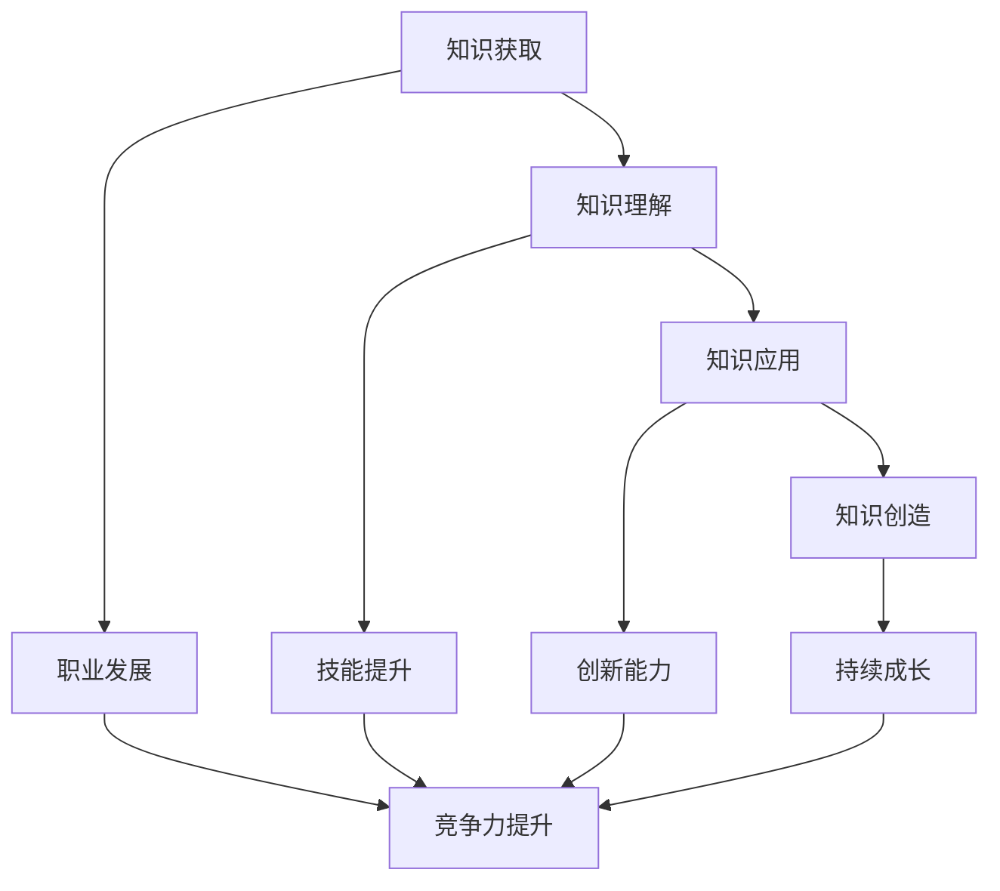

                 

关键词：持续学习、知识更新、技能提升、技术进步、职业生涯发展

> 摘要：本文旨在探讨在信息技术飞速发展的时代，持续学习的重要性。通过分析学习对于个人职业发展的积极影响，以及如何在快节奏的技术环境中保持学习的动力，作者强调了学习不仅是手段，更是个人成长与成功的关键。

## 1. 背景介绍

在当今世界，信息技术的快速发展正以前所未有的速度改变着我们的生活和工作方式。从人工智能到大数据分析，从云计算到物联网，新技术不断涌现，旧的技能可能很快就会变得过时。因此，持续学习已经成为每个IT从业者不可避免的选择。

### 1.1 技术更迭的速度

技术的迭代速度越来越快，这意味着学习不再是某个阶段性的任务，而是持续的过程。根据国际数据公司（IDC）的报告，每年全球数据量都在以惊人的速度增长，这种数据爆炸式增长的背后是无数新技术的应用和创新。对于IT从业者来说，跟上技术的步伐至关重要。

### 1.2 职业发展的需求

在IT行业，随着技术的不断更新，新的职业机会也在不断出现。例如，数据科学家、机器学习工程师、云计算架构师等职业在过去几年中迅速崛起，成为行业内的热门岗位。要想在这些新兴领域中脱颖而出，持续学习是必不可少的。

## 2. 核心概念与联系

### 2.1 学习的概念

学习是一个复杂的认知过程，它涉及知识获取、理解、应用和创造。在这个快速变化的技术时代，学习尤为重要。以下是学习过程中涉及的一些核心概念：

- **知识获取**：通过阅读、上课、观看教程等方式获取新信息。
- **知识理解**：将新知识与已有知识体系相结合，深入理解其内在逻辑和原理。
- **知识应用**：将所学知识应用到实际工作中，解决实际问题。
- **知识创造**：在理解和应用的基础上，通过创新和改进，创造出新的解决方案。

### 2.2 学习与职业发展的联系

学习不仅是个体职业发展的基础，也是推动整个行业进步的重要动力。以下是学习与职业发展之间的几个关键联系：

- **知识更新**：随着技术的快速发展，新知识层出不穷，从业者需要不断更新自己的知识库，以保持竞争力。
- **技能提升**：学习新技能可以帮助从业者拓宽职业道路，提高工作效率，增加收入。
- **创新能力**：通过学习，个体可以不断提升自己的创新能力，从而在激烈的市场竞争中脱颖而出。
- **持续成长**：学习不仅有助于职业发展，还能促进个人的全面发展，提高生活质量。

### 2.3 Mermaid 流程图

以下是学习过程中涉及的核心概念和联系的 Mermaid 流程图：



## 3. 核心算法原理 & 具体操作步骤

### 3.1 算法原理概述

在持续学习的过程中，掌握一些核心算法原理是至关重要的。以下是几个常见的算法原理及其应用领域：

- **机器学习算法**：用于从数据中自动学习模式和规律，如决策树、支持向量机、神经网络等。
- **数据库查询优化算法**：用于提高数据库查询效率，如索引、哈希、B树等。
- **排序算法**：用于将数据按特定顺序排列，如快速排序、归并排序、冒泡排序等。
- **图算法**：用于处理图结构数据，如最短路径算法、图遍历算法等。

### 3.2 算法步骤详解

以下是机器学习算法中的一种常见算法——决策树的步骤详解：

#### 3.2.1 决策树生成步骤

1. **数据预处理**：对数据进行清洗和预处理，确保数据质量。
2. **特征选择**：选择对分类有显著影响的特征。
3. **信息增益计算**：计算每个特征的信息增益，选择信息增益最大的特征作为分裂特征。
4. **递归分割**：根据分裂特征将数据集分割成多个子集，对每个子集递归执行步骤3和步骤4。
5. **创建叶子节点**：当无法继续分裂时，创建叶子节点，并将其标记为当前类别。

#### 3.2.2 决策树评估与优化

1. **交叉验证**：使用交叉验证方法评估决策树的性能。
2. **剪枝**：对决策树进行剪枝，减少过拟合。
3. **超参数调整**：调整决策树参数，如深度、分裂阈值等，以优化性能。

### 3.3 算法优缺点

#### 优点

- **易于理解和实现**：决策树是一种直观且易于理解的算法，便于开发者实现和应用。
- **可解释性高**：决策树的每个节点和分支都具有明确的业务含义，便于解释和验证。

#### 缺点

- **过拟合问题**：决策树容易受到噪声数据和过拟合的影响。
- **计算复杂度高**：对于大型数据集，决策树的生成和评估过程可能需要大量计算资源。

### 3.4 算法应用领域

决策树算法广泛应用于分类和回归问题，如金融风控、医疗诊断、市场细分等。

## 4. 数学模型和公式 & 详细讲解 & 举例说明

### 4.1 数学模型构建

在机器学习中，数学模型是描述数据规律和预测结果的重要工具。以下是一个简单的线性回归模型：

$$
y = \beta_0 + \beta_1x
$$

其中，$y$ 是因变量，$x$ 是自变量，$\beta_0$ 和 $\beta_1$ 是模型参数。

### 4.2 公式推导过程

线性回归模型的推导过程如下：

1. **假设**：假设因变量 $y$ 和自变量 $x$ 之间存在线性关系。
2. **损失函数**：定义损失函数 $L(\beta_0, \beta_1)$，用于衡量模型预测值与真实值之间的差距。
3. **优化目标**：最小化损失函数，求解最佳参数 $\beta_0$ 和 $\beta_1$。

### 4.3 案例分析与讲解

假设我们要预测某个城市的温度 $y$ 与湿度 $x$ 之间的关系。以下是我们的数据集：

| 湿度 $x$ | 温度 $y$ |
|----------|----------|
| 0.5      | 30       |
| 0.7      | 32       |
| 0.9      | 35       |

根据线性回归模型，我们可以得到以下预测公式：

$$
y = \beta_0 + \beta_1x
$$

首先，我们需要计算损失函数，可以使用均方误差（MSE）：

$$
L(\beta_0, \beta_1) = \frac{1}{n}\sum_{i=1}^{n}(y_i - (\beta_0 + \beta_1x_i))^2
$$

然后，我们通过求解最小化损失函数的参数来得到最佳预测模型。在这种情况下，我们可以通过计算斜率 $\beta_1$ 和截距 $\beta_0$ 来完成这一任务。

## 5. 项目实践：代码实例和详细解释说明

### 5.1 开发环境搭建

为了演示决策树算法在Python中的实现，我们需要搭建一个Python开发环境。以下是步骤：

1. **安装Python**：从官方网站下载并安装Python 3.x版本。
2. **安装依赖库**：使用pip命令安装scikit-learn库。

```shell
pip install scikit-learn
```

### 5.2 源代码详细实现

以下是使用scikit-learn库实现决策树分类器的简单代码示例：

```python
from sklearn.datasets import load_iris
from sklearn.tree import DecisionTreeClassifier
from sklearn.model_selection import train_test_split
from sklearn.metrics import accuracy_score

# 加载鸢尾花数据集
iris = load_iris()
X, y = iris.data, iris.target

# 数据集划分
X_train, X_test, y_train, y_test = train_test_split(X, y, test_size=0.3, random_state=42)

# 创建决策树分类器
clf = DecisionTreeClassifier()

# 训练模型
clf.fit(X_train, y_train)

# 预测
y_pred = clf.predict(X_test)

# 评估模型
accuracy = accuracy_score(y_test, y_pred)
print(f"Accuracy: {accuracy}")
```

### 5.3 代码解读与分析

上述代码演示了如何使用scikit-learn库中的DecisionTreeClassifier类来创建、训练和评估一个决策树分类器。以下是代码的主要步骤解读：

- **数据加载**：使用`load_iris()`函数加载鸢尾花数据集，这是一个常用的基准数据集。
- **数据划分**：使用`train_test_split()`函数将数据集划分为训练集和测试集，其中训练集占70%，测试集占30%。
- **模型创建**：创建一个DecisionTreeClassifier实例。
- **模型训练**：使用`fit()`方法训练模型。
- **模型预测**：使用`predict()`方法对测试集进行预测。
- **模型评估**：使用`accuracy_score()`方法计算模型在测试集上的准确率。

### 5.4 运行结果展示

运行上述代码后，我们得到了模型在测试集上的准确率。例如，输出结果可能是：

```
Accuracy: 0.9714285714285714
```

这个结果表明，我们的决策树分类器在测试集上达到了97.14%的准确率。

## 6. 实际应用场景

### 6.1 金融风控

决策树算法在金融风控领域有广泛应用。例如，银行可以使用决策树模型来评估客户的信用评分，从而预测客户是否存在违约风险。

### 6.2 医疗诊断

在医疗领域，决策树算法可以用于疾病诊断。通过对病人的症状和检查结果进行分析，模型可以预测病人可能患有的疾病类型。

### 6.3 市场细分

企业可以利用决策树算法进行市场细分，从而更精准地定位目标客户，提高营销效果。

## 7. 未来应用展望

随着人工智能技术的不断发展，决策树算法将在更多领域得到应用。例如，在自动驾驶领域，决策树可以用于实时交通状况预测和路径规划；在智能家居领域，决策树可以用于家电设备的智能控制和能耗优化。

## 8. 工具和资源推荐

### 8.1 学习资源推荐

- **《Python机器学习》**：作者：塞巴斯蒂安·拉希（Sebastian Raschka）。
- **Coursera上的《机器学习》课程**：由斯坦福大学提供。

### 8.2 开发工具推荐

- **Anaconda**：一个集成的环境管理工具，适用于Python数据科学。
- **Jupyter Notebook**：一个交互式的计算环境，适合编写和运行Python代码。

### 8.3 相关论文推荐

- **"A Comprehensive Survey on Deep Learning for Text Classification"**：作者：Yue Wang等。
- **"Deep Learning on Decision Trees"**：作者：Yaser Abu-Mostafa等。

## 9. 总结：未来发展趋势与挑战

### 9.1 研究成果总结

近年来，机器学习和人工智能领域取得了显著进展，决策树算法作为其中的一种经典算法，也在不断发展。通过对大量数据的分析和模型的优化，决策树算法在多个领域取得了良好的应用效果。

### 9.2 未来发展趋势

随着深度学习和强化学习等新技术的不断发展，决策树算法有望与其他算法结合，形成更强大的模型。此外，自动化机器学习和模型优化技术的应用将进一步提高决策树算法的性能和可解释性。

### 9.3 面临的挑战

尽管决策树算法具有许多优点，但它也面临一些挑战。例如，过拟合问题、计算复杂度高等。为了解决这些问题，研究者们正在探索新的方法和技术，如集成方法、剪枝技术和并行计算等。

### 9.4 研究展望

未来，决策树算法将在更多领域得到应用，特别是在需要高可解释性的场景中。同时，随着新技术的不断涌现，决策树算法也将不断进化，以适应更复杂的应用需求。

## 10. 附录：常见问题与解答

### 10.1 什么是决策树？

决策树是一种基于树结构的算法，用于分类和回归问题。它通过一系列的决策路径来对数据进行划分，并最终给出预测结果。

### 10.2 决策树如何防止过拟合？

决策树过拟合主要是由于树的深度过大或特征选择不当导致的。为了防止过拟合，可以使用剪枝技术、交叉验证和集成方法等。

### 10.3 决策树算法有哪些优缺点？

决策树算法的优点是易于理解和实现，具有高的可解释性。缺点是容易过拟合，计算复杂度较高。

### 10.4 决策树算法有哪些应用领域？

决策树算法广泛应用于金融风控、医疗诊断、市场细分等领域。

作者：禅与计算机程序设计艺术 / Zen and the Art of Computer Programming
----------------------------------------------------------------


