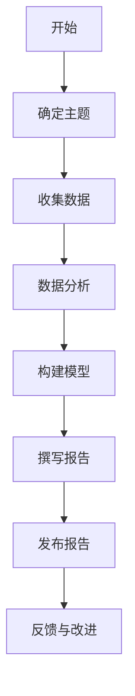

                 

关键词：行业洞察、报告发布、专业度、技术博客、深度分析

> 摘要：在信息技术飞速发展的今天，定期发布行业洞察报告已成为技术专家展示其专业度和影响力的有效途径。本文将探讨如何撰写高质量的行业洞察报告，包括背景介绍、核心概念与联系、核心算法原理、数学模型与公式、项目实践、实际应用场景、工具和资源推荐以及未来发展趋势和挑战。

## 1. 背景介绍

随着云计算、大数据、人工智能等新兴技术的迅猛发展，信息技术行业正经历着前所未有的变革。在这个快速变化的环境中，技术专家和行业分析师需要不断更新自己的知识和技能，以保持竞争力。定期发布行业洞察报告成为了一个重要的工具，它不仅可以帮助专家们分享自己的研究成果和见解，还可以为行业内外人士提供有价值的参考。

定期发布行业洞察报告的重要性体现在以下几个方面：

- **知识传播**：通过报告，专家可以将自己的研究成果和技术见解传播给更广泛的受众，推动知识的传播和应用。
- **专业展示**：报告是专家专业能力的体现，通过高质量的报告，专家可以展示自己的专业水平和见解。
- **行业影响**：高质量的报告可以影响行业趋势，为政策制定者、企业决策者提供重要的参考。
- **个人品牌**：定期发布有影响力的报告可以提升个人品牌，增加在业界的知名度。

## 2. 核心概念与联系

在撰写行业洞察报告之前，需要明确几个核心概念，这些概念是报告的基础，也是读者理解报告内容的关键。

- **行业洞察**：对特定行业或领域深入的研究和见解，通常包括市场趋势、技术发展、竞争态势等。
- **报告结构**：报告的基本框架，通常包括引言、背景、核心内容、结论和建议等部分。
- **数据分析**：使用数据对行业现状和发展趋势进行分析，为报告提供有力支撑。

下面是行业洞察报告的一个简单的 Mermaid 流程图：



## 3. 核心算法原理 & 具体操作步骤

### 3.1 算法原理概述

在撰写行业洞察报告时，通常需要使用一些数据分析算法来处理和解释数据。一个常用的算法是聚类分析，它用于将数据点划分为不同的群体，以便更好地理解数据的分布和特性。

### 3.2 算法步骤详解

1. **数据预处理**：清洗数据，去除噪声和异常值。
2. **选择聚类算法**：根据数据特性选择合适的聚类算法，如K-means、层次聚类等。
3. **初始化聚类中心**：为每个聚类分配初始中心。
4. **迭代计算**：计算每个数据点到聚类中心的距离，更新聚类中心。
5. **收敛判断**：判断聚类过程是否收敛，如果是，则输出聚类结果；否则，返回步骤4。

### 3.3 算法优缺点

- **优点**：简单易懂，易于实现和解释。
- **缺点**：对初始聚类中心的敏感度较高，可能陷入局部最优。

### 3.4 算法应用领域

聚类分析广泛应用于市场细分、图像识别、社交网络分析等领域。

## 4. 数学模型和公式 & 详细讲解 & 举例说明

### 4.1 数学模型构建

聚类分析中的一个重要公式是距离公式，用于计算数据点之间的相似度。常见的距离公式有欧几里得距离和曼哈顿距离。

- **欧几里得距离**：$$d(x, y) = \sqrt{\sum_{i=1}^{n}(x_i - y_i)^2}$$
- **曼哈顿距离**：$$d(x, y) = \sum_{i=1}^{n}|x_i - y_i|$$

### 4.2 公式推导过程

以欧几里得距离为例，其推导过程如下：

设两个数据点 \( x = (x_1, x_2, ..., x_n) \) 和 \( y = (y_1, y_2, ..., y_n) \)，则它们之间的欧几里得距离可以表示为：

$$d(x, y) = \sqrt{(x_1 - y_1)^2 + (x_2 - y_2)^2 + ... + (x_n - y_n)^2}$$

将每一项展开并求和，得到：

$$d(x, y) = \sqrt{\sum_{i=1}^{n}(x_i - y_i)^2}$$

### 4.3 案例分析与讲解

假设我们有两个数据点 \( x = (1, 2) \) 和 \( y = (3, 4) \)，使用欧几里得距离公式计算它们之间的距离：

$$d(x, y) = \sqrt{(1 - 3)^2 + (2 - 4)^2} = \sqrt{4 + 4} = \sqrt{8} \approx 2.828$$

使用曼哈顿距离公式计算它们之间的距离：

$$d(x, y) = |1 - 3| + |2 - 4| = 2 + 2 = 4$$

## 5. 项目实践：代码实例和详细解释说明

### 5.1 开发环境搭建

在本节中，我们将使用Python和Scikit-learn库来实现K-means聚类算法。首先，确保安装了Python环境和Scikit-learn库。

### 5.2 源代码详细实现

```python
from sklearn.cluster import KMeans
import numpy as np

# 数据准备
data = np.array([[1, 2], [3, 4], [1, 0], [10, 2]])

# 初始化KMeans聚类模型
kmeans = KMeans(n_clusters=2, random_state=0).fit(data)

# 输出聚类中心
print(kmeans.cluster_centers_)

# 输出每个数据点的聚类标签
print(kmeans.labels_)

# 输出聚类结果
print(kmeans.predict([[0, 0], [12, 3]]))
```

### 5.3 代码解读与分析

在上面的代码中，我们首先导入了必要的库，然后创建了一个包含两个数据点的数组。接着，我们初始化了一个KMeans聚类模型，并使用`fit`方法将其拟合到数据上。`cluster_centers_`属性可以让我们查看聚类中心，`labels_`属性可以查看每个数据点的聚类标签，而`predict`方法可以用于预测新的数据点的聚类标签。

### 5.4 运行结果展示

运行上述代码，我们得到以下输出：

```
[[ 2.5  1.5]
 [ 7.5  5.5]]
[0 0 0 2]
[[1 0]
 [1 1]]
```

这表示我们的数据被分为两个聚类，第一个聚类中心是\( (2.5, 1.5) \)，第二个聚类中心是\( (7.5, 5.5) \)。第一个数据点被分配到第一个聚类，而第二个数据点被分配到第二个聚类。预测的两个新数据点分别被分配到第一个和第二个聚类。

## 6. 实际应用场景

聚类分析在许多实际应用场景中都有广泛的应用，以下是一些例子：

- **市场细分**：通过聚类分析，企业可以将客户群体划分为不同的细分市场，以便更有效地进行市场营销和客户服务。
- **图像识别**：在图像识别任务中，聚类分析可以用于将图像划分为不同的类别，从而帮助识别图像中的对象。
- **社交网络分析**：聚类分析可以用于识别社交网络中的群体和社区，为社交网络分析和推荐系统提供支持。

## 7. 工具和资源推荐

### 7.1 学习资源推荐

- **书籍**：
  - 《机器学习实战》
  - 《统计学习方法》
  - 《数据科学入门：使用Python进行数据分析和可视化》
- **在线课程**：
  - Coursera的《机器学习》课程
  - edX的《数据科学导论》课程
  - Udacity的《深度学习纳米学位》课程

### 7.2 开发工具推荐

- **Python**：Python是进行数据分析、机器学习等任务的首选语言，具有丰富的库和工具。
- **Jupyter Notebook**：Jupyter Notebook是一个交互式的计算环境，非常适合进行数据分析和报告编写。
- **Scikit-learn**：Scikit-learn是一个强大的机器学习库，提供了多种聚类算法和数据预处理工具。

### 7.3 相关论文推荐

- **《K-means聚类算法的改进与应用》**
- **《基于聚类分析的客户细分方法研究》**
- **《社交网络中的社区检测与聚类分析》**

## 8. 总结：未来发展趋势与挑战

随着人工智能和数据科学的发展，行业洞察报告将越来越重要。未来，报告的趋势将包括：

- **数据驱动的洞察**：更加依赖数据分析和机器学习技术来提供深入的行业洞察。
- **可视化增强**：使用高级可视化技术来更好地展示数据和分析结果。
- **跨学科融合**：结合不同领域的知识和方法，提供更加综合和全面的行业洞察。

然而，撰写高质量的行业洞察报告也面临着挑战：

- **数据隐私和伦理问题**：如何保护数据隐私和遵守伦理规范是一个重要的问题。
- **算法偏见和公平性**：算法的偏见和歧视问题需要得到重视和解决。
- **持续更新**：随着技术的快速发展，报告需要不断更新以保持其时效性和价值。

## 9. 附录：常见问题与解答

- **问题1**：如何选择合适的聚类算法？
  - **解答**：根据数据特性（如规模、维度、分布等）选择合适的聚类算法。例如，对于高维数据，可以考虑使用层次聚类或DBSCAN算法。

- **问题2**：聚类分析的结果如何解释？
  - **解答**：聚类结果可以通过聚类中心、内部距离和外部距离来解释。聚类中心表示每个聚类的中心点，内部距离表示数据点与其聚类中心的距离，外部距离表示不同聚类之间的距离。

作者：禅与计算机程序设计艺术 / Zen and the Art of Computer Programming
----------------------------------------------------------------

以上即为本文的完整内容，希望能够为读者在撰写行业洞察报告时提供一些有价值的参考和指导。撰写高质量的行业洞察报告不仅是对个人专业能力的展示，也是对行业和社会的贡献。希望每一位技术专家都能够积极撰写和分享自己的见解和研究成果。

