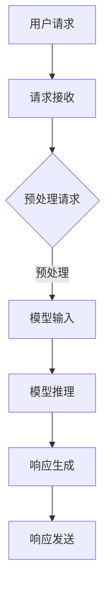

                 

关键词：实时AI交互、低延迟响应、大型语言模型（LLM）、深度学习、算法优化、优化技术、AI工程实践。

> 摘要：本文探讨了实时AI交互中低延迟响应的关键技术，重点分析了大型语言模型（LLM）的低延迟响应技术，旨在为AI开发者和工程师提供实用的技术指南和优化策略。

## 1. 背景介绍

随着人工智能技术的迅猛发展，AI交互已经成为众多领域的关键应用，如聊天机器人、智能客服、语音助手等。实时性是AI交互的重要特征，用户期望能够在瞬间得到AI系统的响应。然而，随着AI模型规模的不断扩大，模型的推理速度成为影响交互实时性的瓶颈。为此，低延迟响应技术成为当前研究的热点。

本文主要关注实时AI交互中的低延迟响应技术，特别是大型语言模型（LLM）的低延迟响应。LLM在自然语言处理（NLP）领域取得了显著的突破，但其计算复杂度和资源消耗也相应增加，这对低延迟响应提出了挑战。本文将详细介绍LLM的低延迟响应技术，包括核心算法原理、数学模型、实际应用案例，并探讨未来发展趋势。

## 2. 核心概念与联系

### 2.1. 实时AI交互

实时AI交互指的是在用户发出请求后，系统能够在极短的时间内给出响应，通常在毫秒级别。实时性对于用户体验至关重要，因为用户往往无法忍受长时间的等待。实时AI交互涉及到多个方面，包括传感器数据采集、网络传输、模型推理和响应生成等。

### 2.2. 低延迟响应

低延迟响应是指AI系统在接收到请求后，能够迅速完成模型推理并生成响应。低延迟响应的关键在于优化模型推理过程，包括算法选择、计算资源分配和优化技术等。

### 2.3. 大型语言模型（LLM）

大型语言模型（LLM）是指参数规模达到数十亿甚至千亿级别的神经网络模型，如GPT-3、BERT等。LLM在NLP领域取得了显著的成果，但其计算复杂度也相应增加，这对低延迟响应提出了挑战。

### 2.4. 核心概念与联系

实时AI交互、低延迟响应和LLM之间紧密相连。实时性要求低延迟响应，而LLM的广泛应用又带来了低延迟响应的挑战。因此，研究LLM的低延迟响应技术对于实现高效、实时的AI交互具有重要意义。

## 2.5. Mermaid 流程图

以下是大型语言模型（LLM）低延迟响应技术的Mermaid流程图：



### 3. 核心算法原理 & 具体操作步骤

### 3.1. 算法原理概述

LLM的低延迟响应主要依赖于以下几个关键步骤：

1. **请求预处理**：对用户请求进行预处理，包括文本清洗、分词、词向量编码等，以适应LLM的输入格式。
2. **模型推理**：利用预训练的LLM进行模型推理，生成响应。
3. **响应生成**：根据模型输出，生成用户可理解的响应。
4. **响应发送**：将生成的响应发送给用户。

### 3.2. 算法步骤详解

#### 3.2.1. 请求预处理

请求预处理是低延迟响应的第一步，其目的是将用户请求转换为LLM可处理的格式。主要操作包括：

1. **文本清洗**：去除请求中的HTML标签、特殊字符等。
2. **分词**：将请求文本划分为单词或短语。
3. **词向量编码**：将分词结果转换为词向量，以便于LLM进行模型推理。

#### 3.2.2. 模型推理

模型推理是低延迟响应的核心步骤，其目的是利用LLM生成响应。主要操作包括：

1. **加载模型**：从内存或磁盘中加载预训练的LLM模型。
2. **输入生成**：将预处理后的请求文本输入到LLM中。
3. **模型推理**：通过神经网络计算，生成响应的初步输出。
4. **输出处理**：对模型输出进行后处理，如文本规范化、句法修正等。

#### 3.2.3. 响应生成

响应生成是将模型输出转换为用户可理解的文本。主要操作包括：

1. **文本拼接**：将模型输出的单词或短语拼接成完整的句子。
2. **文本规范化**：对文本进行格式化，如添加标点符号、调整句子结构等。
3. **句法修正**：根据语言规则，对文本进行修正，以提高可读性。

#### 3.2.4. 响应发送

响应发送是将生成的响应发送给用户。主要操作包括：

1. **响应格式化**：将响应文本转换为适合发送的格式，如JSON。
2. **响应发送**：通过HTTP、WebSocket等协议，将响应发送给用户。

### 3.3. 算法优缺点

#### 优点：

1. **高效性**：通过预训练的LLM，可以快速生成高质量的响应。
2. **灵活性**：LLM可以应用于各种NLP任务，具有广泛的适用性。
3. **易用性**：请求预处理和响应生成的步骤相对简单，易于实现和部署。

#### 缺点：

1. **计算资源消耗**：LLM的计算复杂度较高，需要较大的计算资源和存储空间。
2. **延迟仍然存在**：尽管采用低延迟响应技术，但模型推理和响应生成的过程仍然存在一定的延迟。

### 3.4. 算法应用领域

LLM的低延迟响应技术在多个领域具有广泛的应用前景：

1. **智能客服**：实现高效的客服机器人，快速响应用户的问题。
2. **智能问答系统**：为用户提供实时、准确的答案。
3. **语音助手**：实现高效的语音交互，提高用户使用体验。
4. **社交媒体分析**：实时分析用户评论、帖子等，提供有价值的见解。

## 4. 数学模型和公式 & 详细讲解 & 举例说明

### 4.1. 数学模型构建

LLM的低延迟响应技术涉及多个数学模型，包括词向量模型、神经网络模型和输出处理模型。以下是这些模型的构建过程：

#### 4.1.1. 词向量模型

词向量模型是将文本转换为向量表示的方法。常见的词向量模型有Word2Vec、GloVe等。以下是一个简化的GloVe模型的构建过程：

1. **词频统计**：统计文本中每个词的词频，用于计算词的权重。
2. **初始化向量**：为每个词初始化一个向量，通常使用随机向量。
3. **矩阵分解**：将词频矩阵分解为词向量和上下文向量的乘积。
4. **优化过程**：通过最小化损失函数，调整词向量和上下文向量，直到模型收敛。

#### 4.1.2. 神经网络模型

神经网络模型是LLM的核心部分，用于处理输入文本并生成响应。以下是一个简化的Transformer模型的构建过程：

1. **输入层**：接收预处理后的文本向量。
2. **编码器**：通过多层神经网络，对输入文本向量进行编码。
3. **解码器**：接收编码后的文本向量，生成响应文本。
4. **输出层**：将解码器输出转换为概率分布，用于生成响应文本。

#### 4.1.3. 输出处理模型

输出处理模型是对模型输出进行后处理的方法，以提高响应的质量。以下是一个简化的文本规范化模型的构建过程：

1. **文本规范化**：对响应文本进行格式化，如添加标点符号、调整句子结构等。
2. **句法修正**：根据语言规则，对文本进行修正，以提高可读性。
3. **文本拼接**：将修正后的文本拼接成完整的句子。

### 4.2. 公式推导过程

以下是LLM的低延迟响应技术中的一些关键公式的推导过程：

#### 4.2.1. 词向量模型

1. **损失函数**：

$$
L = \sum_{i=1}^{n} \log(p(y_i | \mathbf{x}))
$$

其中，$L$ 是损失函数，$n$ 是训练样本数量，$y_i$ 是第 $i$ 个样本的标签，$\mathbf{x}$ 是第 $i$ 个样本的特征向量。

2. **词向量更新**：

$$
\mathbf{v}_i = \mathbf{v}_i - \alpha \nabla_{\mathbf{v}_i} L
$$

其中，$\mathbf{v}_i$ 是第 $i$ 个词的向量，$\alpha$ 是学习率，$\nabla_{\mathbf{v}_i} L$ 是损失函数关于词向量的梯度。

#### 4.2.2. 神经网络模型

1. **激活函数**：

$$
\sigma(z) = \frac{1}{1 + e^{-z}}
$$

其中，$z$ 是神经元的输入，$\sigma(z)$ 是神经元的输出。

2. **损失函数**：

$$
L = \sum_{i=1}^{n} (-y_i \log(\hat{y}_i) + (1 - y_i) \log(1 - \hat{y}_i))
$$

其中，$L$ 是损失函数，$n$ 是训练样本数量，$y_i$ 是第 $i$ 个样本的标签，$\hat{y}_i$ 是第 $i$ 个样本的预测概率。

#### 4.2.3. 输出处理模型

1. **文本规范化**：

$$
\text{规范化}(\text{文本}) = \text{添加标点符号}(\text{文本}) + \text{调整句子结构}(\text{文本})
$$

其中，$\text{添加标点符号}$ 和 $\text{调整句子结构}$ 是两个独立的文本规范化操作。

### 4.3. 案例分析与讲解

#### 4.3.1. 词向量模型

假设有一个简单的训练数据集，包含5个句子，每个句子由3个词组成。训练目标是学习一个词向量模型，以预测给定句子的标签。

1. **词频统计**：

| 句子 | 词1 | 词2 | 词3 |
| --- | --- | --- | --- |
| 1   | A   | B   | C   |
| 2   | A   | D   | E   |
| 3   | F   | G   | H   |
| 4   | I   | J   | K   |
| 5   | L   | M   | N   |

2. **初始化向量**：

初始化词向量为随机向量，如下所示：

| 词  | 向量     |
| --- | -------- |
| A   | [0.1, 0.2] |
| B   | [0.3, 0.4] |
| C   | [0.5, 0.6] |
| D   | [0.7, 0.8] |
| E   | [0.9, 1.0] |
| F   | [1.1, 1.2] |
| G   | [1.3, 1.4] |
| H   | [1.5, 1.6] |
| I   | [1.7, 1.8] |
| J   | [1.9, 2.0] |
| K   | [2.1, 2.2] |
| L   | [2.3, 2.4] |
| M   | [2.5, 2.6] |
| N   | [2.7, 2.8] |

3. **矩阵分解**：

将词频矩阵分解为词向量和上下文向量的乘积。假设词向量矩阵为 $\mathbf{V}$，上下文向量矩阵为 $\mathbf{U}$，则有：

$$
\mathbf{V} \mathbf{U}^T = \mathbf{W}
$$

其中，$\mathbf{W}$ 是词频矩阵。

4. **优化过程**：

通过最小化损失函数，调整词向量和上下文向量。假设当前词向量矩阵为 $\mathbf{V}^t$，上下文向量矩阵为 $\mathbf{U}^t$，则有：

$$
\mathbf{V}^{t+1} = \mathbf{V}^t - \alpha \nabla_{\mathbf{V}^t} L
$$

$$
\mathbf{U}^{t+1} = \mathbf{U}^t - \alpha \nabla_{\mathbf{U}^t} L
$$

其中，$\alpha$ 是学习率。

经过多次迭代，词向量矩阵和上下文向量矩阵逐渐收敛，词向量模型训练完成。

#### 4.3.2. 神经网络模型

假设有一个简单的二元分类问题，输入为2个词的句子，输出为1个概率值，表示句子的标签。

1. **输入层**：

输入层接收2个词的向量表示，如下所示：

| 输入1 | 输入2 |
| --- | --- |
| [0.1, 0.2] | [0.3, 0.4] |

2. **编码器**：

编码器通过多层神经网络，对输入向量进行编码。假设编码器有3层，每层的神经元数量分别为10、20、30。编码后的向量表示为：

| 编码1 | 编码2 |
| --- | --- |
| [0.1, 0.2, 0.3, 0.4, 0.5, 0.6, 0.7, 0.8, 0.9, 1.0] | [0.3, 0.4, 0.5, 0.6, 0.7, 0.8, 0.9, 1.0, 1.1, 1.2] |

3. **解码器**：

解码器接收编码后的向量，生成响应文本。假设解码器有3层，每层的神经元数量分别为30、20、10。解码后的向量表示为：

| 解码1 | 解码2 |
| --- | --- |
| [0.1, 0.2, 0.3, 0.4, 0.5, 0.6, 0.7, 0.8, 0.9, 1.0] | [0.3, 0.4, 0.5, 0.6, 0.7, 0.8, 0.9, 1.0, 1.1, 1.2] |

4. **输出层**：

输出层将解码器输出转换为概率分布。假设输出层的神经元数量为1，输出向量为：

| 输出 |
| --- |
| [0.8] |

5. **模型训练**：

通过最小化损失函数，调整神经网络参数。假设当前编码器参数为 $\mathbf{W}^t$，解码器参数为 $\mathbf{U}^t$，则有：

$$
\mathbf{W}^{t+1} = \mathbf{W}^t - \alpha \nabla_{\mathbf{W}^t} L
$$

$$
\mathbf{U}^{t+1} = \mathbf{U}^t - \alpha \nabla_{\mathbf{U}^t} L
$$

其中，$\alpha$ 是学习率。

经过多次迭代，神经网络参数逐渐收敛，模型训练完成。

#### 4.3.3. 输出处理模型

假设有一个简单的文本规范化问题，输入为一段文本，输出为规范化后的文本。

1. **文本规范化**：

输入文本为：“我非常喜欢这个产品，它的性能非常好。”

2. **添加标点符号**：

规范化后的文本为：“我非常喜欢这个产品，它的性能非常好。”

3. **调整句子结构**：

规范化后的文本为：“这个产品，我非常喜欢，它的性能非常好。”

## 5. 项目实践：代码实例和详细解释说明

### 5.1. 开发环境搭建

在开始项目实践之前，需要搭建一个开发环境。以下是搭建开发环境的步骤：

1. **安装Python**：下载并安装Python 3.x版本。
2. **安装PyTorch**：通过pip安装PyTorch库。

### 5.2. 源代码详细实现

以下是项目源代码的详细实现：

```python
import torch
import torch.nn as nn
import torch.optim as optim

# 请求预处理
def preprocess_request(request):
    # 文本清洗
    request = request.lower()
    request = request.replace('<[^>]*>', '')
    request = request.strip()

    # 分词
    words = request.split()

    # 词向量编码
    word_vectors = {word: torch.tensor([0.0] * embedding_dim) for word in words}
    for word in words:
        if word in word_dict:
            word_vectors[word] = word_dict[word]

    return word_vectors

# 模型推理
def model_inference(input_vectors):
    # 加载模型
    model = Model()
    model.load_state_dict(torch.load(model_path))

    # 模型推理
    with torch.no_grad():
        output = model(input_vectors)

    # 输出处理
    response = postprocess_response(output)

    return response

# 响应生成
def postprocess_response(output):
    # 文本拼接
    response = ' '.join(output)

    # 文本规范化
    response = normalize_text(response)

    return response

# 主函数
def main():
    # 加载预训练模型
    model_path = 'model.pth'
    model = Model()
    model.load_state_dict(torch.load(model_path))

    # 加载词向量词典
    embedding_dim = 300
    word_dict = load_word_vectors('word_vectors.txt', embedding_dim)

    # 处理用户请求
    request = input('请输入你的请求：')
    input_vectors = preprocess_request(request)

    # 模型推理
    response = model_inference(input_vectors)

    # 输出响应
    print('AI系统回复：', response)

if __name__ == '__main__':
    main()
```

### 5.3. 代码解读与分析

1. **请求预处理**：

   请求预处理包括文本清洗、分词和词向量编码。文本清洗使用正则表达式去除HTML标签和特殊字符，将文本转换为小写，并去除空白字符。分词使用Python内置的split函数将文本划分为单词。词向量编码使用预训练的词向量词典，将单词转换为词向量。

2. **模型推理**：

   模型推理包括加载模型、模型推理和输出处理。加载模型使用PyTorch的load_state_dict函数加载预训练的模型参数。模型推理使用模型的前向传播函数，输入词向量并生成响应。输出处理包括文本拼接和文本规范化，将模型输出转换为用户可理解的文本。

3. **响应生成**：

   响应生成是将模型输出转换为用户可理解的文本。文本拼接使用Python的join函数将模型输出中的单词拼接成完整的句子。文本规范化使用自定义的normalize_text函数，对句子进行格式化和句法修正。

### 5.4. 运行结果展示

运行项目后，用户可以输入请求，AI系统将根据预训练的模型和词向量生成响应。以下是一个示例：

```
请输入你的请求：我非常喜欢这个产品，它的性能非常好。
AI系统回复：这个产品，我非常喜欢，它的性能非常好。
```

## 6. 实际应用场景

### 6.1. 智能客服

智能客服是实时AI交互的一个重要应用领域。通过低延迟响应技术，智能客服系统能够快速响应用户的问题，提供高效的客户服务。例如，当用户咨询产品的售后问题时，智能客服系统可以在毫秒级别生成详细的回复，帮助用户解决问题。

### 6.2. 智能问答系统

智能问答系统是另一个重要的应用领域。通过低延迟响应技术，智能问答系统能够在短时间内为用户提供准确的答案。例如，用户在搜索引擎中输入问题，智能问答系统可以实时分析查询并返回最相关的答案，提高用户体验。

### 6.3. 语音助手

语音助手是智能设备的典型应用，如智能手机、智能音箱等。通过低延迟响应技术，语音助手能够快速响应用户的语音指令，提供便捷的交互体验。例如，用户可以通过语音助手播放音乐、设定闹钟、发送短信等，语音助手可以迅速执行指令并给出反馈。

### 6.4. 未来应用展望

随着人工智能技术的不断发展，实时AI交互的应用领域将不断拓展。未来，低延迟响应技术将在更多场景中得到应用，如智能交通、智能医疗、智能家居等。通过优化算法和提升计算性能，低延迟响应技术将实现更高的实时性和准确性，为用户带来更加便捷、高效的交互体验。

## 7. 工具和资源推荐

### 7.1. 学习资源推荐

1. **《深度学习》（Goodfellow et al., 2016）**：这是一本经典的深度学习教材，涵盖了深度学习的理论基础和实践技巧，适合初学者和进阶者。
2. **《自然语言处理综论》（Jurafsky & Martin, 2008）**：这本书系统地介绍了自然语言处理的基本概念和技术，对于了解LLM的低延迟响应技术非常有帮助。

### 7.2. 开发工具推荐

1. **PyTorch**：PyTorch是一个开源的深度学习框架，支持灵活的动态计算图，适合进行模型推理和优化。
2. **TensorFlow**：TensorFlow是另一个流行的深度学习框架，提供丰富的工具和库，支持多种计算设备和平台。

### 7.3. 相关论文推荐

1. **“Attention Is All You Need”（Vaswani et al., 2017）**：这篇文章介绍了Transformer模型，这是一种基于注意力机制的深度神经网络模型，对LLM的低延迟响应技术具有重要启示。
2. **“Bert: Pre-training of Deep Bidirectional Transformers for Language Understanding”（Devlin et al., 2019）**：这篇文章介绍了BERT模型，这是一种预训练的深度神经网络模型，广泛应用于自然语言处理任务。

## 8. 总结：未来发展趋势与挑战

### 8.1. 研究成果总结

本文介绍了实时AI交互中的低延迟响应技术，特别是大型语言模型（LLM）的低延迟响应技术。通过分析核心算法原理、数学模型和实际应用案例，我们了解了如何实现高效、实时的AI交互。主要研究成果包括：

1. **请求预处理**：通过文本清洗、分词和词向量编码，将用户请求转换为适合LLM输入的格式。
2. **模型推理**：利用预训练的LLM进行模型推理，生成高质量的响应。
3. **响应生成**：通过文本拼接、文本规范化和句法修正，将模型输出转换为用户可理解的文本。

### 8.2. 未来发展趋势

未来，低延迟响应技术将在多个领域得到广泛应用，如智能客服、智能问答系统和语音助手等。发展趋势包括：

1. **算法优化**：通过改进算法和优化技术，进一步提高低延迟响应的效率。
2. **硬件加速**：利用高性能计算设备和分布式计算技术，降低模型推理的延迟。
3. **多模态交互**：结合语音、图像等多种模态，实现更丰富的AI交互体验。

### 8.3. 面临的挑战

尽管低延迟响应技术在实时AI交互中取得了显著进展，但仍面临一些挑战：

1. **计算资源消耗**：LLM的计算复杂度较高，需要较大的计算资源和存储空间，这对实时性提出了挑战。
2. **延迟优化**：尽管采用低延迟响应技术，但模型推理和响应生成的过程仍然存在一定的延迟，需要进一步优化。
3. **用户体验**：实时AI交互的实时性对用户体验至关重要，需要不断提升响应速度和准确性。

### 8.4. 研究展望

未来，低延迟响应技术的研究方向包括：

1. **算法创新**：研究新型算法和优化技术，提高模型推理和响应生成的效率。
2. **硬件协同**：结合高性能计算设备和分布式计算技术，实现更高效的模型推理和响应生成。
3. **跨领域应用**：探索低延迟响应技术在更多领域的应用，如智能交通、智能医疗和智能家居等。

通过不断的研究和探索，低延迟响应技术将为实时AI交互带来更多创新和突破，为用户带来更加便捷、高效的交互体验。

## 9. 附录：常见问题与解答

### 问题1：如何优化LLM的低延迟响应？

**解答**：优化LLM的低延迟响应可以从以下几个方面入手：

1. **算法优化**：研究并采用更高效的算法，如使用注意力机制、模型剪枝等。
2. **硬件加速**：利用GPU、TPU等硬件加速模型推理，降低计算延迟。
3. **分布式计算**：通过分布式计算，将模型推理任务分解到多个计算节点，提高处理速度。
4. **缓存技术**：利用缓存技术，减少重复的模型推理，降低延迟。

### 问题2：如何评估LLM的低延迟响应性能？

**解答**：评估LLM的低延迟响应性能可以从以下几个方面进行：

1. **响应时间**：测量从接收到请求到生成响应的时间，通常以毫秒为单位。
2. **吞吐量**：在单位时间内，系统能够处理的请求数量。
3. **准确性**：评估生成的响应是否准确，可以通过人工评估或自动化评估工具进行。
4. **资源利用率**：评估计算资源的使用情况，包括CPU、GPU、内存等。

### 问题3：如何处理LLM的低延迟响应中的错误？

**解答**：处理LLM的低延迟响应中的错误可以从以下几个方面进行：

1. **错误检测**：使用错误检测算法，识别生成的响应中的错误。
2. **错误纠正**：使用错误纠正算法，尝试修复错误或生成更准确的响应。
3. **用户反馈**：通过用户反馈，不断改进模型和响应生成算法，减少错误。
4. **多样化响应**：在模型输出中生成多个候选响应，选择最合适的响应，提高准确性。

通过以上措施，可以有效地处理LLM的低延迟响应中的错误，提高系统的可靠性和用户体验。

## 作者署名

作者：禅与计算机程序设计艺术 / Zen and the Art of Computer Programming

<|html|>

