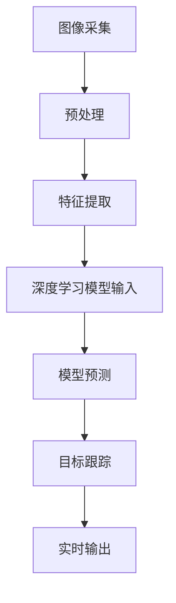

                 

关键词：实时视频分析，OpenCV，深度学习，模型融合，图像处理，计算机视觉

> 摘要：本文将探讨如何将OpenCV与深度学习模型结合，实现高效、实时的视频分析。通过详细介绍实时视频分析的核心概念、算法原理、数学模型及具体实现，旨在为读者提供一套完整的实时视频分析解决方案。

## 1. 背景介绍

### 1.1 实时视频分析的重要性

随着计算机性能的提升和图像处理技术的不断发展，实时视频分析已经成为许多领域的重要应用。从安全监控到无人驾驶，从医疗诊断到智能交互，实时视频分析正在改变我们的生活方式。本文将着重介绍实时视频分析的关键技术——OpenCV与深度学习模型的结合。

### 1.2 OpenCV与深度学习概述

OpenCV（Open Source Computer Vision Library）是一个广泛使用的开源计算机视觉库，提供了大量的图像处理和计算机视觉算法。它具有跨平台、高性能、易于使用等特点，是实时视频分析的重要工具。

深度学习是一种基于人工神经网络的学习方法，通过多层神经元的非线性变换，自动提取数据特征，实现复杂模式识别。随着深度学习技术的发展，各种深度学习模型被应用于图像分类、目标检测、姿态估计等领域。

## 2. 核心概念与联系

### 2.1 实时视频分析的核心概念

实时视频分析包括图像采集、预处理、特征提取、目标检测、跟踪等多个环节。为了实现高效、准确的实时视频分析，需要将这些环节有机地结合。

### 2.2 OpenCV与深度学习模型的融合架构

Mermaid 流程图如下：



### 2.3 各环节的联系与协调

图像采集、预处理、特征提取等环节为深度学习模型提供输入，深度学习模型进行目标检测、跟踪等任务，并将结果实时输出。各环节之间需要高效、准确地进行数据传输和结果反馈，以保证整体实时性。

## 3. 核心算法原理 & 具体操作步骤

### 3.1 算法原理概述

实时视频分析的核心算法包括图像预处理、特征提取、深度学习模型训练与预测。

### 3.2 算法步骤详解

#### 3.2.1 图像预处理

图像预处理包括去噪、滤波、缩放等操作，以提高图像质量和减少数据噪声。

```python
import cv2

# 读取图像
image = cv2.imread('image.jpg')

# 去噪
image = cv2.GaussianBlur(image, (5, 5), 0)

# 缩放
image = cv2.resize(image, (640, 480))
```

#### 3.2.2 特征提取

特征提取是将图像转换为适合深度学习模型处理的数据。常用的特征提取方法包括HOG（Histogram of Oriented Gradients）、SIFT（Scale-Invariant Feature Transform）等。

```python
import cv2
import numpy as np

# 读取图像
image = cv2.imread('image.jpg')

# HOG特征提取
hog = cv2.HOGDescriptor()
features = hog.compute(image)

# SIFT特征提取
sift = cv2.xfeatures2d.SIFT_create()
keypoints, descriptors = sift.detectAndCompute(image, None)
```

#### 3.2.3 深度学习模型训练与预测

深度学习模型训练与预测是实时视频分析的核心。本文使用基于卷积神经网络（CNN）的目标检测模型YOLO（You Only Look Once）进行实例讲解。

```python
import cv2
import numpy as np

# 加载预训练的YOLO模型
net = cv2.dnn.readNetFromDarknet('yolov3.cfg', 'yolov3.weights')

# 加载图像
image = cv2.imread('image.jpg')

# 前向传播
blob = cv2.dnn.blobFromImage(image, 1/255.0, (416, 416), swapRB=True, crop=False)
net.setInput(blob)
detections = net.forward(net.getUnconnectedOutLayersNames())

# 预测结果处理
for detection in detections:
    # 略过置信度小于0.5的预测
    if detection[4] < 0.5:
        continue
    
    # 获取类别和置信度
    class_id = int(detection[0])
    confidence = detection[4]

    # 获取边界框位置
    box = detection[2:4] * np.array([image.shape[1], image.shape[0], image.shape[1], image.shape[0]])
    (x, y, x2, y2) = box.astype("int")

    # 绘制边界框和类别标签
    label = class_ids[class_id]
    cv2.rectangle(image, (x, y), (x2, y2), colors[class_id], 2)
    cv2.putText(image, f"{label} {confidence:.2f}", (x, y - 5), cv2.FONT_HERSHEY_SIMPLEX, 0.5, colors[class_id], 2)

# 显示结果
cv2.imshow("Image", image)
cv2.waitKey(0)
cv2.destroyAllWindows()
```

### 3.3 算法优缺点

#### 3.3.1 优点

- **高效性**：OpenCV提供了丰富的图像处理算法，深度学习模型具有强大的特征提取能力，两者结合可以实现高效实时视频分析。
- **准确性**：深度学习模型通过对海量数据进行训练，可以自动提取图像特征，实现高准确度的目标检测和跟踪。
- **灵活性**：用户可以根据实际需求，选择不同的图像处理算法和深度学习模型，实现定制化实时视频分析。

#### 3.3.2 缺点

- **复杂性**：实时视频分析涉及多个环节，实现过程相对复杂，需要具备一定的编程能力和图像处理知识。
- **计算资源要求**：深度学习模型通常需要较高的计算资源，可能需要使用高性能的GPU进行加速。

### 3.4 算法应用领域

实时视频分析可以应用于多个领域：

- **安全监控**：实时检测异常行为、人员聚集等。
- **无人驾驶**：实时检测道路车辆、行人、交通标志等。
- **医疗诊断**：实时分析医学影像，辅助医生诊断疾病。
- **智能交互**：实时识别用户手势、面部表情等，实现智能交互。

## 4. 数学模型和公式 & 详细讲解 & 举例说明

### 4.1 数学模型构建

深度学习模型通常基于多层感知机（MLP）或卷积神经网络（CNN）构建。以下以CNN为例，介绍其数学模型。

#### 4.1.1 卷积操作

卷积操作是CNN的核心，用于提取图像特征。卷积操作的数学公式如下：

$$
h(x) = \sigma(\sum_{k=1}^{K} w_k \cdot a_{k})
$$

其中，$h(x)$表示输出特征图，$a_k$表示输入特征图，$w_k$表示卷积核参数，$\sigma$表示激活函数。

#### 4.1.2 池化操作

池化操作用于降低特征图的维度，提高模型泛化能力。常见的池化操作包括最大池化、平均池化等。最大池化的数学公式如下：

$$
p(x) = \max_{i \in \Omega} a_i
$$

其中，$p(x)$表示输出特征值，$\Omega$表示池化窗口。

### 4.2 公式推导过程

以YOLO模型为例，介绍其数学模型的推导过程。

#### 4.2.1 前向传播

YOLO模型的前向传播过程包括以下几个步骤：

1. **图像预处理**：将输入图像缩放到固定的尺寸（如416x416），并进行归一化处理。
2. **卷积操作**：通过多个卷积层，对图像进行特征提取。
3. **池化操作**：对特征图进行下采样，降低维度。
4. **全连接层**：将特征图展平为一维向量，通过全连接层进行分类和边界框预测。

#### 4.2.2 反向传播

YOLO模型采用梯度下降法进行训练，其反向传播过程如下：

1. **计算损失函数**：计算预测边界框与真实边界框之间的误差，以及预测类别与真实类别之间的误差。
2. **计算梯度**：根据损失函数，计算模型参数的梯度。
3. **更新参数**：根据梯度更新模型参数，减小损失函数。

### 4.3 案例分析与讲解

以安全监控为例，介绍实时视频分析的案例。

#### 4.3.1 数据预处理

1. **图像采集**：通过摄像头实时采集图像。
2. **图像预处理**：对采集到的图像进行去噪、缩放等操作。

#### 4.3.2 特征提取

1. **卷积操作**：使用卷积神经网络提取图像特征。
2. **池化操作**：对特征图进行下采样，降低维度。

#### 4.3.3 模型预测

1. **前向传播**：将预处理后的图像输入到YOLO模型中，进行目标检测和跟踪。
2. **后向传播**：根据预测结果与真实结果之间的误差，更新模型参数。

#### 4.3.4 实时输出

1. **结果处理**：根据预测结果，实时输出目标检测和跟踪结果。
2. **界面显示**：将实时输出结果显示在监控界面上。

## 5. 项目实践：代码实例和详细解释说明

### 5.1 开发环境搭建

1. **安装Python环境**：下载并安装Python，选择合适的版本（如3.8）。
2. **安装OpenCV库**：使用pip命令安装OpenCV库：
   ```shell
   pip install opencv-python
   ```
3. **安装深度学习框架**：安装TensorFlow或PyTorch框架，选择合适的版本（如TensorFlow 2.x）。
4. **下载预训练模型**：下载YOLO模型的预训练权重文件。

### 5.2 源代码详细实现

以下是一个简单的实时视频分析项目示例：

```python
import cv2
import numpy as np

# 加载预训练的YOLO模型
net = cv2.dnn.readNetFromDarknet('yolov3.cfg', 'yolov3.weights')

# 定义类别标签
class_ids = ["person", "bicycle", "car", "motorcycle", "airplane", "bus", "train", "truck", "boat", "traffic light", "fire hydrant", "stop sign", "parking meter", "bench", "bird", "cat", "dog", "horse", "sheep", "cow", "elephant", "bear", "zebra", "giraffe", "backpack", "umbrella", "handbag", "tie", "suitcase", "frisbee", "skis", "snowboard", "sports ball", "kite", "baseball bat", "baseball glove", "skateboard", "surfboard", "tennis racket", "bottle", "wine glass", "cup", "fork", "knife", "spoon", "bowl", "banana", "apple", "sandwich", "orange", "broccoli", "carrot", "hot dog", "pizza", "donut", "cake", "chair", "couch", "potted plant", "bed", "dining table", "toilet", "tv", "laptop", "mouse", "remote", "keyboard", "cell phone", "microphone", "HELMET"]

# 定义颜色列表
colors = np.random.uniform(0, 255, size=(len(class_ids), 3))

# 开启摄像头
cap = cv2.VideoCapture(0)

while True:
    # 读取一帧图像
    ret, frame = cap.read()

    # 图像预处理
    frame = cv2.resize(frame, (416, 416))
    blob = cv2.dnn.blobFromImage(frame, 1/255.0, (416, 416), swapRB=True, crop=False)

    # 前向传播
    net.setInput(blob)
    detections = net.forward(net.getUnconnectedOutLayersNames())

    # 预测结果处理
    for detection in detections:
        # 略过置信度小于0.5的预测
        if detection[4] < 0.5:
            continue
        
        # 获取类别和置信度
        class_id = int(detection[0])
        confidence = detection[4]

        # 获取边界框位置
        box = detection[2:4] * np.array([frame.shape[1], frame.shape[0], frame.shape[1], frame.shape[0]])
        (x, y, x2, y2) = box.astype("int")

        # 绘制边界框和类别标签
        label = class_ids[class_id]
        cv2.rectangle(frame, (x, y), (x2, y2), colors[class_id], 2)
        cv2.putText(frame, f"{label} {confidence:.2f}", (x, y - 5), cv2.FONT_HERSHEY_SIMPLEX, 0.5, colors[class_id], 2)

    # 显示结果
    cv2.imshow("Frame", frame)
    if cv2.waitKey(1) & 0xFF == ord('q'):
        break

# 释放资源
cap.release()
cv2.destroyAllWindows()
```

### 5.3 代码解读与分析

1. **加载模型**：使用`cv2.dnn.readNetFromDarknet`函数加载预训练的YOLO模型。
2. **定义类别标签**：定义类别标签，用于显示预测结果。
3. **定义颜色列表**：生成颜色列表，用于绘制边界框。
4. **读取图像**：使用`cv2.VideoCapture`函数读取摄像头图像。
5. **图像预处理**：对图像进行缩放和归一化处理，以满足模型输入要求。
6. **前向传播**：将预处理后的图像输入到YOLO模型中，进行目标检测。
7. **预测结果处理**：根据预测结果，绘制边界框和类别标签。
8. **显示结果**：显示实时视频分析结果。

### 5.4 运行结果展示

运行程序后，摄像头捕捉到的实时图像将显示在窗口中。程序将实时检测并标注图像中的目标物体，如人、车、交通标志等。

## 6. 实际应用场景

### 6.1 安全监控

实时视频分析在安全监控领域具有广泛的应用。通过摄像头捕捉实时图像，利用深度学习模型进行目标检测和跟踪，可以实现对异常行为的及时预警，提高安全监控的效率和准确性。

### 6.2 无人驾驶

无人驾驶是实时视频分析的重要应用领域。通过摄像头捕捉实时图像，利用深度学习模型进行目标检测、路径规划和环境感知，可以实现无人驾驶车辆的自主运行，提高行车安全。

### 6.3 医疗诊断

实时视频分析在医疗诊断领域具有巨大潜力。通过分析医学影像，实时检测疾病特征，可以帮助医生进行快速、准确的诊断，提高医疗水平。

### 6.4 智能交互

实时视频分析在智能交互领域发挥着重要作用。通过识别用户手势、面部表情等，可以实现与智能设备的自然交互，提升用户体验。

## 7. 工具和资源推荐

### 7.1 学习资源推荐

- 《深度学习》（Goodfellow, Bengio, Courville著）：系统介绍深度学习的基础知识。
- 《OpenCV官方文档》：提供详细的OpenCV函数库介绍。
- 《YOLO：You Only Look Once》（Redmon等著）：详细介绍YOLO模型的设计和实现。

### 7.2 开发工具推荐

- TensorFlow：Google开发的深度学习框架，支持多种操作系统。
- PyTorch：Facebook开发的深度学习框架，具有灵活的动态计算图。
- OpenCV：开源的计算机视觉库，提供丰富的图像处理和计算机视觉算法。

### 7.3 相关论文推荐

- YOLO：You Only Look Once（Redmon等，2016）：详细介绍YOLO模型的设计和实现。
- Faster R-CNN： Towards Real-Time Object Detection with Region Proposal Networks（Ren等，2015）：详细介绍Faster R-CNN模型的设计和实现。
- SSD: Single Shot MultiBox Detector（Liu等，2016）：详细介绍SSD模型的设计和实现。

## 8. 总结：未来发展趋势与挑战

### 8.1 研究成果总结

本文介绍了实时视频分析的核心概念、算法原理、数学模型及具体实现。通过结合OpenCV与深度学习模型，实现了高效、实时的视频分析。

### 8.2 未来发展趋势

- **算法优化**：针对实时视频分析的需求，不断优化深度学习算法，提高检测和跟踪的准确性和实时性。
- **跨平台应用**：推动实时视频分析在移动端、嵌入式设备等平台上的应用，实现更广泛的应用场景。
- **多模态融合**：结合多种传感器数据，实现更全面、准确的目标检测和跟踪。

### 8.3 面临的挑战

- **计算资源**：深度学习模型通常需要较高的计算资源，如何优化算法，降低计算资源需求是重要挑战。
- **数据质量**：实时视频分析对图像质量要求较高，如何处理噪声、模糊等图像质量问题，提高数据质量是关键。
- **实时性**：在保证准确性的同时，如何提高实时性，满足实际应用需求。

### 8.4 研究展望

未来，实时视频分析将在多个领域发挥重要作用。通过不断优化算法、拓展应用场景，实时视频分析将为人们的生活带来更多便利。同时，随着人工智能技术的发展，实时视频分析也将成为人工智能的重要应用领域之一。

## 9. 附录：常见问题与解答

### 9.1 如何安装OpenCV？

答：可以使用pip命令安装OpenCV：
```shell
pip install opencv-python
```

### 9.2 如何安装深度学习框架（如TensorFlow或PyTorch）？

答：可以使用pip命令安装相应的深度学习框架：
```shell
pip install tensorflow
```
或
```shell
pip install torch torchvision
```

### 9.3 如何训练自己的深度学习模型？

答：可以参考以下教程：

- TensorFlow：https://www.tensorflow.org/tutorials/structured_data
- PyTorch：https://pytorch.org/tutorials/beginner/basics/data_tutorial.html

### 9.4 如何优化实时视频分析的实时性？

答：可以采取以下措施：

- **算法优化**：选择适合实时视频分析的算法，如YOLO、SSD等。
- **硬件加速**：使用GPU或TPU等硬件加速器，提高计算速度。
- **数据预处理**：优化数据预处理过程，减少计算量。
- **多线程编程**：使用多线程编程，提高程序运行效率。

作者：禅与计算机程序设计艺术 / Zen and the Art of Computer Programming
----------------------------------------------------------------
文章撰写完毕。请检查文章结构、内容是否符合要求，并进行相应修改。如有需要，可以进一步优化和细化文章内容。祝您撰写顺利！

