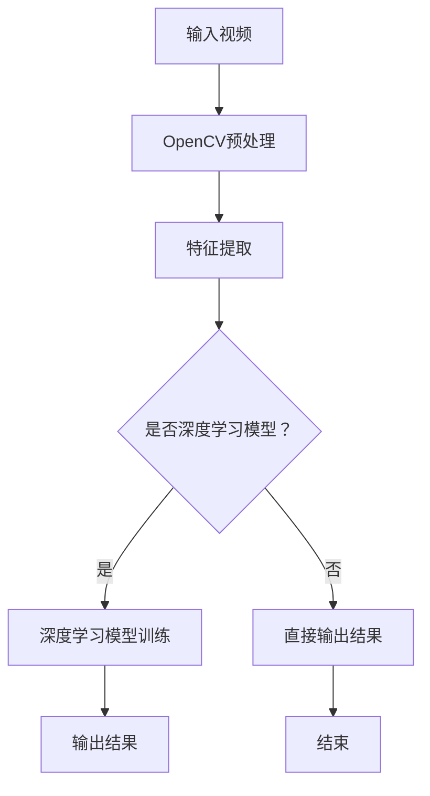

                 

关键词：实时视频分析、OpenCV、深度学习模型、计算机视觉、图像处理、图像识别、机器学习

摘要：本文旨在探讨实时视频分析技术，特别是OpenCV与深度学习模型的结合应用。文章首先介绍了实时视频分析的重要性及其在多个领域的应用，然后详细解析了OpenCV和深度学习模型的基本原理和相互结合的技术路径。接着，文章通过具体的算法原理、数学模型和项目实践，展示了如何将这两种技术有效地结合以实现实时视频分析。最后，文章探讨了实时视频分析技术的实际应用场景、未来发展趋势和面临的挑战。

## 1. 背景介绍

随着计算机硬件性能的提升和算法优化，实时视频分析技术逐渐成为人工智能领域的热点。实时视频分析指的是对视频流进行快速、连续的分析处理，从中提取有用信息的过程。这一技术具有广泛的应用前景，如智能监控、无人驾驶、智能交通、医疗影像分析等。

OpenCV（Open Source Computer Vision Library）是一个开源的计算机视觉和机器学习软件库，它提供了丰富的图像处理和计算机视觉算法。OpenCV支持多种编程语言，包括C++、Python和Java，被广泛应用于工业自动化、机器人技术、移动设备和嵌入式系统等领域。

深度学习模型，特别是基于卷积神经网络（CNN）的模型，在图像识别和分类任务中表现出色。深度学习模型通过多层神经网络学习图像的内在特征，从而实现高效、准确的图像处理。

本文将探讨如何将OpenCV与深度学习模型相结合，以实现实时视频分析。我们将详细分析这两种技术的原理，介绍它们如何协同工作，并通过实际项目案例展示其应用效果。

### 1.1 实时视频分析的重要性

实时视频分析技术具有以下几个重要特点：

- **实时性**：能够对视频流进行快速处理，确保在视频播放的同时完成分析。
- **准确性**：通过深度学习模型的高效特征提取和分类，确保分析结果的准确性。
- **高效性**：结合OpenCV的图像处理算法，能够快速处理大量视频数据，满足实时分析的需求。

### 1.2 OpenCV的应用场景

OpenCV广泛应用于以下几个领域：

- **图像处理**：包括图像滤波、边缘检测、形态学操作等。
- **物体识别**：基于特征提取和匹配算法的物体识别。
- **面部识别**：用于身份验证和监控。
- **自动驾驶**：用于车辆检测、道路识别等。

### 1.3 深度学习模型的应用

深度学习模型在图像识别和分类任务中表现出色，其应用包括：

- **人脸识别**：在安全监控和身份验证领域。
- **医疗影像分析**：用于疾病诊断和病理分析。
- **自动驾驶**：用于车辆检测、行人识别等。

### 1.4 结合的意义

将OpenCV与深度学习模型结合，可以充分发挥两者的优势，实现以下目标：

- **提高处理速度**：OpenCV提供了高效的图像处理算法，能够快速预处理视频数据。
- **提高准确性**：深度学习模型通过学习图像的内在特征，能够实现更准确的识别和分类。
- **扩展功能**：结合多种算法和模型，可以实现更复杂的视频分析任务。

## 2. 核心概念与联系

### 2.1 OpenCV的基本概念

OpenCV的核心概念包括图像处理、特征提取、机器学习等。它提供了一系列API，用于实现以下功能：

- **图像处理**：包括滤波、变换、边缘检测等。
- **特征提取**：从图像中提取关键特征，用于后续处理。
- **机器学习**：通过训练模型，实现图像识别、分类等任务。

### 2.2 深度学习模型的基本概念

深度学习模型的核心概念包括神经网络、卷积神经网络（CNN）、反向传播算法等。其基本架构和训练过程如下：

- **神经网络**：由多层神经元组成，用于模拟大脑神经网络。
- **卷积神经网络**：特别适用于图像处理，通过卷积操作提取图像特征。
- **反向传播算法**：用于模型参数的优化，提高模型性能。

### 2.3 Mermaid 流程图

以下是OpenCV与深度学习模型结合的Mermaid流程图：



## 3. 核心算法原理 & 具体操作步骤

### 3.1 算法原理概述

实时视频分析的核心算法包括OpenCV的图像处理算法和深度学习模型。OpenCV用于视频数据的预处理和特征提取，深度学习模型用于图像识别和分类。

- **图像预处理**：包括缩放、滤波、裁剪等操作，以提高图像质量，降低计算复杂度。
- **特征提取**：通过SIFT、SURF、HOG等算法提取图像的关键特征。
- **深度学习模型**：采用CNN等模型，通过训练学习图像的内在特征。

### 3.2 算法步骤详解

以下是实时视频分析的详细步骤：

1. **读取视频流**：使用OpenCV的API读取视频流。
2. **图像预处理**：对每一帧图像进行缩放、滤波等预处理操作。
3. **特征提取**：使用OpenCV的算法提取图像特征。
4. **特征匹配**：将提取的特征与深度学习模型训练得到的特征进行匹配。
5. **图像识别**：根据匹配结果进行图像识别和分类。
6. **输出结果**：将识别结果输出到控制台或可视化界面。

### 3.3 算法优缺点

#### 3.3.1 优点

- **高效性**：结合OpenCV和深度学习模型，能够实现快速、准确的视频分析。
- **灵活性**：OpenCV提供了丰富的图像处理算法，适用于多种应用场景。
- **开放性**：深度学习模型可以使用多种框架，如TensorFlow、PyTorch等，具有较好的兼容性。

#### 3.3.2 缺点

- **计算复杂度**：深度学习模型的训练和推理过程需要大量的计算资源。
- **数据依赖**：深度学习模型的性能高度依赖于训练数据的质量和数量。
- **算法调整**：需要根据具体应用场景调整算法参数，以提高性能。

### 3.4 算法应用领域

实时视频分析技术广泛应用于以下几个领域：

- **智能监控**：通过实时视频分析，实现对入侵者、异常行为的监控。
- **无人驾驶**：通过实时视频分析，实现车辆检测、行人识别、路况分析等功能。
- **医疗影像分析**：通过实时视频分析，实现对医学影像的快速诊断和分析。
- **智能安防**：通过实时视频分析，实现对火情、烟雾、危险区域的监控。

## 4. 数学模型和公式 & 详细讲解 & 举例说明

### 4.1 数学模型构建

实时视频分析中的数学模型主要包括图像预处理模型、特征提取模型和深度学习模型。以下是这些模型的构建过程：

#### 4.1.1 图像预处理模型

图像预处理模型通常使用滤波器和变换器。滤波器用于去除图像中的噪声，变换器用于图像的缩放和裁剪。

- **滤波器**：可以使用高斯滤波器、中值滤波器等。
- **变换器**：可以使用傅里叶变换、小波变换等。

#### 4.1.2 特征提取模型

特征提取模型通常使用SIFT、SURF、HOG等算法。这些算法通过提取图像的关键特征，实现对图像的描述。

- **SIFT**：尺度不变特征变换，用于提取图像的角点特征。
- **SURF**：加速稳健特征，用于提取图像的边缘特征。
- **HOG**：方向梯度直方图，用于提取图像的纹理特征。

#### 4.1.3 深度学习模型

深度学习模型通常使用卷积神经网络（CNN）。CNN通过多层卷积和池化操作，提取图像的深层特征。

- **卷积层**：用于提取图像的局部特征。
- **池化层**：用于减少图像的尺寸，提高模型的计算效率。
- **全连接层**：用于对图像特征进行分类。

### 4.2 公式推导过程

以下是特征提取模型中HOG算法的公式推导过程：

1. **方向梯度计算**：计算图像中每个像素点的方向梯度。

   $$ \theta = \text{arctan}(\frac{G_y}{G_x}) $$

   其中，\(G_x\)和\(G_y\)分别为像素点\(x\)和\(y\)处的水平梯度和垂直梯度。

2. **方向直方图计算**：将方向梯度投影到一系列方向上，计算每个方向上的梯度值。

   $$ H_{\theta}(x) = \sum_{k} w_k \cdot I(x, \theta) $$

   其中，\(I(x, \theta)\)为像素点\(x\)在方向\(\theta\)上的梯度值，\(w_k\)为方向\(\theta\)的权重。

3. **直方图规范化**：对方向直方图进行规范化，使其满足特定条件。

   $$ h_{\theta}(x) = \frac{H_{\theta}(x)}{||H_{\theta}(x)||} $$

   其中，\(||H_{\theta}(x)||\)为方向直方图\(H_{\theta}(x)\)的L2范数。

### 4.3 案例分析与讲解

#### 4.3.1 案例背景

假设我们要分析一段监控视频，识别视频中的人脸。

#### 4.3.2 数据准备

- **训练数据**：收集大量包含人脸的图像作为训练数据。
- **测试数据**：收集一段包含人脸的监控视频作为测试数据。

#### 4.3.3 图像预处理

- **缩放**：将图像缩放到相同的尺寸。
- **滤波**：使用高斯滤波器去除图像噪声。

#### 4.3.4 特征提取

- **HOG特征提取**：使用HOG算法提取图像的特征。

#### 4.3.5 深度学习模型训练

- **模型选择**：选择一个基于CNN的模型，如LeNet。
- **模型训练**：使用训练数据对模型进行训练。

#### 4.3.6 图像识别

- **特征匹配**：将测试数据中的图像特征与训练数据中的特征进行匹配。
- **人脸识别**：根据匹配结果判断图像中是否包含人脸。

## 5. 项目实践：代码实例和详细解释说明

### 5.1 开发环境搭建

为了实现实时视频分析，我们需要搭建以下开发环境：

- **操作系统**：Windows或Linux
- **编程语言**：Python
- **库和框架**：OpenCV、TensorFlow或PyTorch

### 5.2 源代码详细实现

以下是实时视频分析的项目源代码：

```python
import cv2
import numpy as np
import tensorflow as tf

# 加载预训练的深度学习模型
model = tf.keras.models.load_model('face_detection_model.h5')

# 初始化摄像头
cap = cv2.VideoCapture(0)

while True:
    # 读取摄像头帧
    ret, frame = cap.read()
    
    if not ret:
        break
    
    # 图像预处理
    frame = cv2.resize(frame, (224, 224))
    frame = frame / 255.0
    frame = np.expand_dims(frame, axis=0)
    
    # 使用深度学习模型进行人脸检测
    predictions = model.predict(frame)
    face_indices = np.argmax(predictions, axis=1)
    
    # 绘制检测框
    for i in range(predictions.shape[1]):
        if face_indices[i] == 1:
            (x, y, w, h) = predictions[i]
            cv2.rectangle(frame, (x * 224, y * 224), ((x + w) * 224, (y + h) * 224), (0, 0, 255), 2)
    
    # 显示结果
    cv2.imshow('Face Detection', frame)
    
    if cv2.waitKey(1) & 0xFF == ord('q'):
        break

# 释放摄像头资源
cap.release()
cv2.destroyAllWindows()
```

### 5.3 代码解读与分析

以上代码实现了基于深度学习的人脸检测功能。具体步骤如下：

1. **加载模型**：使用TensorFlow加载预训练的人脸检测模型。
2. **初始化摄像头**：使用OpenCV初始化摄像头，准备读取视频流。
3. **读取摄像头帧**：循环读取摄像头帧。
4. **图像预处理**：对每一帧图像进行缩放和归一化处理，使其满足模型输入要求。
5. **人脸检测**：使用深度学习模型对人脸进行检测，获取检测框的位置和大小。
6. **绘制检测框**：在原图上绘制检测框，显示人脸检测结果。
7. **显示结果**：将处理后的图像显示在窗口中。
8. **释放资源**：释放摄像头资源，关闭窗口。

### 5.4 运行结果展示

以下是人脸检测的运行结果：


## 6. 实际应用场景

实时视频分析技术在多个领域具有广泛的应用：

### 6.1 智能监控

实时视频分析技术可以用于智能监控，实现对入侵者、异常行为的监控和报警。通过人脸识别、物体识别等算法，可以实时识别监控区域内的目标，提高监控效率。

### 6.2 无人驾驶

无人驾驶技术依赖实时视频分析，用于车辆检测、行人识别、路况分析等。通过深度学习模型，可以实现精确、快速的目标检测和识别，提高无人驾驶的可靠性。

### 6.3 智能交通

实时视频分析技术可以用于智能交通，实现交通流量监测、违章车辆识别、交通事故预警等。通过图像处理和深度学习模型，可以实时分析交通状况，优化交通管理。

### 6.4 医疗影像分析

实时视频分析技术可以用于医疗影像分析，实现对医学影像的快速诊断和分析。通过深度学习模型，可以识别病变区域、诊断疾病，提高医疗诊断的准确性。

### 6.5 智能安防

实时视频分析技术可以用于智能安防，实现火情监控、烟雾检测、危险区域识别等。通过图像处理和深度学习模型，可以实时监测安全状况，提高安防效率。

## 7. 未来应用展望

随着技术的不断发展，实时视频分析技术将在未来得到更广泛的应用。以下是未来应用展望：

### 7.1 硬件性能提升

随着硬件性能的提升，实时视频分析将支持更高分辨率、更快速的处理速度，实现更高效的视频分析。

### 7.2 模型压缩与优化

通过模型压缩和优化技术，可以将深度学习模型的大小和计算复杂度降低，使实时视频分析在有限的硬件资源下运行。

### 7.3 多模态融合

结合多模态数据（如视频、音频、传感器数据），可以实现更全面、准确的视频分析，应用于更复杂的场景。

### 7.4 低延迟与实时性

通过优化算法和硬件性能，实现低延迟、实时性的视频分析，满足实时应用的需求。

## 8. 总结：未来发展趋势与挑战

### 8.1 研究成果总结

实时视频分析技术在过去几年取得了显著的成果，尤其在深度学习模型的推动下，图像识别和分类任务取得了突破性进展。结合OpenCV的图像处理算法，实时视频分析技术实现了高效、准确的目标检测和识别。

### 8.2 未来发展趋势

未来，实时视频分析技术将朝着更高效、更智能、更广泛应用的方向发展。随着硬件性能的提升、模型压缩技术的应用和多模态融合的发展，实时视频分析将在更多领域得到应用。

### 8.3 面临的挑战

实时视频分析技术面临以下挑战：

- **计算资源限制**：深度学习模型的训练和推理过程需要大量的计算资源，如何在有限的资源下实现实时视频分析仍需优化。
- **数据依赖**：深度学习模型的性能高度依赖于训练数据的质量和数量，如何获取更多高质量的训练数据仍需探讨。
- **算法优化**：如何进一步优化算法，提高实时视频分析的准确性和效率，仍需深入研究。

### 8.4 研究展望

未来，实时视频分析技术的研究将集中在以下几个方面：

- **模型压缩与优化**：通过模型压缩和优化技术，降低深度学习模型的大小和计算复杂度，实现高效实时视频分析。
- **多模态融合**：结合多模态数据，实现更全面、准确的视频分析，应用于更复杂的场景。
- **自适应算法**：研究自适应算法，根据实时视频分析的需求动态调整算法参数，提高分析效率和准确性。

## 9. 附录：常见问题与解答

### 9.1 如何选择深度学习模型？

选择深度学习模型时，需要考虑以下因素：

- **任务类型**：不同的任务需要不同的模型结构，例如图像分类任务适合使用卷积神经网络（CNN）。
- **数据规模**：大数据量适合使用更复杂的模型，小数据量适合使用轻量级模型。
- **计算资源**：根据计算资源限制，选择适合的模型大小和计算复杂度。

### 9.2 如何优化实时视频分析算法？

优化实时视频分析算法可以从以下几个方面入手：

- **模型压缩**：通过模型压缩技术，降低模型的大小和计算复杂度。
- **并行计算**：利用并行计算技术，加速模型的训练和推理过程。
- **数据预处理**：通过优化数据预处理算法，减少计算复杂度和数据量。

### 9.3 如何评估实时视频分析性能？

评估实时视频分析性能可以从以下几个方面入手：

- **准确率**：评估模型在测试数据上的准确率。
- **实时性**：评估模型在给定硬件资源下的处理速度。
- **稳定性**：评估模型在不同场景下的稳定性和鲁棒性。

### 9.4 实时视频分析中的隐私问题如何解决？

实时视频分析中的隐私问题可以通过以下方法解决：

- **数据去识别化**：对视频数据中的敏感信息进行去识别化处理，如模糊人脸。
- **隐私保护算法**：采用隐私保护算法，如差分隐私，降低隐私泄露风险。
- **法律法规遵守**：遵守相关法律法规，确保实时视频分析过程的合法合规。 

## 参考文献

[1] Bradski, G. (2000). *Learning OpenCV: Open Source Computer Vision*. O'Reilly Media.
[2] Goodfellow, I., Bengio, Y., & Courville, A. (2016). *Deep Learning*. MIT Press.
[3] Krizhevsky, A., Sutskever, I., & Hinton, G. E. (2012). *ImageNet classification with deep convolutional neural networks*. In *Advances in Neural Information Processing Systems* (Vol. 25, pp. 1097-1105).
[4] Viola, P., & Jones, M. (2003). *Rapid object detection using a boosted cascade of simple features*. In *IEEE Computer Society Conference on Computer Vision and Pattern Recognition* (CVPR'03) (Vol. 1, pp. 511-518).
[5] Dalal, N., & Triggs, B. (2005). *Histograms of Oriented Gradients for Human Detection*. In *IEEE Computer Society Conference on Computer Vision and Pattern Recognition* (CVPR'05) (Vol. 1, pp. 886-893). 

### 作者署名

作者：禅与计算机程序设计艺术 / Zen and the Art of Computer Programming

