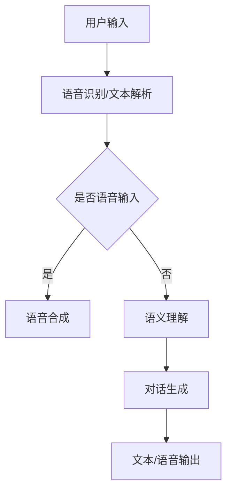

                 

关键词：对话系统，自然语言处理，规则基模型，神经对话模型，人工智能，语义理解，对话生成，应用场景

> 摘要：本文旨在探讨对话系统的设计方法，从传统的规则基模型到现代的神经对话模型，深入解析它们的核心概念、原理、优缺点以及应用领域。通过对数学模型、算法步骤的详细讲解，结合实际项目实践和代码实例，全面展示对话系统的设计与实践，为读者提供对未来发展趋势与挑战的深刻见解。

## 1. 背景介绍

随着人工智能技术的快速发展，自然语言处理（NLP）已成为当前研究的热点领域之一。对话系统作为NLP的重要组成部分，广泛应用于智能客服、智能助手、在线教育、虚拟助理等多个场景。传统的对话系统主要基于规则基模型，而近年来，基于神经网络的对话模型逐渐成为研究的热点。

规则基模型通过预定义的规则来处理用户输入，具有实现简单、易于维护等优点。然而，其表达能力有限，难以应对复杂的对话场景。相比之下，神经对话模型通过深度学习技术，能够更好地理解和生成自然语言，从而提高对话系统的性能。

本文将首先介绍对话系统的基本概念和发展历程，然后深入探讨规则基模型和神经对话模型的核心原理、算法步骤、数学模型及其应用领域。最后，通过实际项目实践和代码实例，展示对话系统的设计和实现过程，并讨论未来的发展趋势与挑战。

## 2. 核心概念与联系

### 2.1 对话系统

对话系统是一种人工智能系统，旨在实现人与计算机之间的自然语言交互。其基本功能包括语音识别、语义理解、对话生成和语音合成。根据输入和输出方式，对话系统可分为文本对话系统和语音对话系统。

### 2.2 规则基模型

规则基模型是一种基于预定义规则的自然语言处理方法。通过编写一系列规则，系统能够对用户输入进行处理，并生成相应的回复。规则基模型的优点是实现简单、易于维护，但缺点是表达能力有限，难以应对复杂的对话场景。

### 2.3 神经对话模型

神经对话模型是一种基于深度学习技术的自然语言处理方法。通过大量训练数据，模型能够自动学习并提取语言特征，从而实现语义理解和对话生成。神经对话模型的优点是表达能力强大、自适应性好，但缺点是实现复杂、训练时间较长。

### 2.4 Mermaid 流程图

以下是一个简单的Mermaid流程图，展示了规则基模型和神经对话模型的基本架构：



## 3. 核心算法原理 & 具体操作步骤

### 3.1 算法原理概述

规则基模型的核心在于预定义的规则，通过对用户输入进行匹配，生成相应的回复。神经对话模型则基于深度学习技术，通过对大量对话数据的训练，自动学习并提取语言特征，实现语义理解和对话生成。

### 3.2 算法步骤详解

#### 3.2.1 规则基模型

1. 用户输入：系统接收用户输入的文本或语音。
2. 语音识别/文本解析：将语音输入转换为文本，或直接处理文本输入。
3. 规则匹配：根据预定义的规则，对输入文本进行匹配。
4. 对话生成：根据匹配结果，生成相应的回复。
5. 文本/语音输出：将回复文本转换为语音，或直接输出文本。

#### 3.2.2 神经对话模型

1. 用户输入：系统接收用户输入的文本或语音。
2. 语音识别/文本解析：将语音输入转换为文本，或直接处理文本输入。
3. 语义理解：通过预训练的神经网络模型，对输入文本进行语义分析，提取关键信息。
4. 对话生成：利用生成式神经网络模型，根据语义理解结果生成回复。
5. 文本/语音输出：将回复文本转换为语音，或直接输出文本。

### 3.3 算法优缺点

#### 规则基模型

优点：实现简单、易于维护、成本较低。

缺点：表达能力有限、难以应对复杂场景、规则编写复杂。

#### 神经对话模型

优点：表达能力强大、自适应性好、能够处理复杂场景。

缺点：实现复杂、训练时间较长、对数据要求较高。

### 3.4 算法应用领域

规则基模型广泛应用于智能客服、智能助手、在线教育等领域。神经对话模型则逐渐应用于虚拟助理、智能音箱、智能家居等领域。

## 4. 数学模型和公式 & 详细讲解 & 举例说明

### 4.1 数学模型构建

#### 4.1.1 规则基模型

规则基模型的核心在于规则匹配。设用户输入为 $x$，预定义的规则集为 $\{r_1, r_2, ..., r_n\}$，则规则匹配的过程可以表示为：

$$
match(x, r_i) = \begin{cases}
1, & \text{如果} x \text{与} r_i \text{匹配} \\
0, & \text{否则}
\end{cases}
$$

#### 4.1.2 神经对话模型

神经对话模型主要涉及神经网络模型的构建。设用户输入为 $x$，预训练的神经网络模型为 $f(\cdot)$，则语义理解的过程可以表示为：

$$
h = f(x)
$$

其中，$h$ 表示输入文本的语义表示。

### 4.2 公式推导过程

#### 4.2.1 规则基模型

设用户输入为 $x = \{x_1, x_2, ..., x_n\}$，预定义的规则为 $r_i = \{r_{i1}, r_{i2}, ..., r_{in}\}$，则规则匹配的公式推导如下：

1. 计算每个规则与输入的相似度：

$$
similarity(r_i, x) = \frac{\sum_{j=1}^{n} r_{ij} \cdot x_j}{\sqrt{\sum_{j=1}^{n} r_{ij}^2} \cdot \sqrt{\sum_{j=1}^{n} x_j^2}}
$$

2. 求取最大相似度：

$$
max_similarity = \max_{i} similarity(r_i, x)
$$

3. 判断是否匹配：

$$
match(x, r_i) = \begin{cases}
1, & \text{如果} max_similarity \geq \theta \\
0, & \text{否则}
\end{cases}
$$

其中，$\theta$ 为匹配阈值。

#### 4.2.2 神经对话模型

设用户输入为 $x = \{x_1, x_2, ..., x_n\}$，预训练的神经网络模型为 $f(\cdot)$，则语义理解的公式推导如下：

1. 对输入文本进行编码：

$$
h = f(x) = \sum_{i=1}^{n} w_i \cdot x_i
$$

其中，$w_i$ 为权重。

2. 计算每个类别的概率：

$$
P(y_i | x) = \frac{e^{h_i}}{\sum_{j=1}^{m} e^{h_j}}
$$

其中，$y_i$ 表示第 $i$ 个类别，$h_i$ 表示类别 $y_i$ 的语义表示。

3. 输出概率最大的类别：

$$
y^* = \arg\max_{i} P(y_i | x)
$$

### 4.3 案例分析与讲解

#### 4.3.1 规则基模型

假设用户输入为“你好”，预定义的规则为：

- 规则1：“你好” --> “你好，有什么可以帮助你吗？”
- 规则2：“你好吗” --> “我很好，谢谢你的关心。”

则根据规则匹配公式，我们可以得到：

1. 计算相似度：

$$
similarity(规则1, 输入) = \frac{1 \cdot 1 + 1 \cdot 1}{\sqrt{1^2 + 1^2} \cdot \sqrt{1^2 + 1^2}} = \frac{2}{\sqrt{2} \cdot \sqrt{2}} = 1
$$

$$
similarity(规则2, 输入) = \frac{1 \cdot 0 + 1 \cdot 1}{\sqrt{1^2 + 1^2} \cdot \sqrt{1^2 + 1^2}} = \frac{1}{\sqrt{2} \cdot \sqrt{2}} = \frac{1}{2}
$$

2. 求取最大相似度：

$$
max_similarity = \max(1, \frac{1}{2}) = 1
$$

3. 判断是否匹配：

$$
match(输入, 规则1) = 1
$$

$$
match(输入, 规则2) = 0
$$

因此，根据规则匹配结果，输出“你好，有什么可以帮助你吗？”

#### 4.3.2 神经对话模型

假设用户输入为“今天天气怎么样？”预训练的神经网络模型为 $f(\cdot)$，语义表示为 $h = \{h_1, h_2, h_3\}$，类别分别为“今天天气很好”、“今天天气一般”、“今天天气很差”。

1. 计算概率：

$$
P(今天天气很好 | 输入) = \frac{e^{h_1}}{e^{h_1} + e^{h_2} + e^{h_3}} = \frac{e^{h_1}}{e^{h_1} + e^{h_2} + e^{h_3}}
$$

$$
P(今天天气一般 | 输入) = \frac{e^{h_2}}{e^{h_1} + e^{h_2} + e^{h_3}} = \frac{e^{h_2}}{e^{h_1} + e^{h_2} + e^{h_3}}
$$

$$
P(今天天气很差 | 输入) = \frac{e^{h_3}}{e^{h_1} + e^{h_2} + e^{h_3}} = \frac{e^{h_3}}{e^{h_1} + e^{h_2} + e^{h_3}}
$$

2. 输出概率最大的类别：

$$
y^* = \arg\max_{i} P(y_i | 输入)
$$

根据实际情况，我们可以选择输出“今天天气很好”或“今天天气一般”，具体取决于模型训练的结果。

## 5. 项目实践：代码实例和详细解释说明

### 5.1 开发环境搭建

1. 安装Python环境：确保Python版本为3.6及以上。
2. 安装依赖库：使用pip命令安装以下依赖库：
   ```bash
   pip install numpy matplotlib scikit-learn tensorflow
   ```

### 5.2 源代码详细实现

以下是一个简单的规则基对话系统的示例代码：

```python
import numpy as np
from sklearn.feature_extraction.text import CountVectorizer

# 规则定义
rules = [
    {"input": "你好", "response": "你好，有什么可以帮助你吗？"},
    {"input": "你好吗", "response": "我很好，谢谢你的关心。"}
]

# 规则匹配函数
def match_rule(input_text):
    max_similarity = 0
    matched_response = ""
    for rule in rules:
        similarity = np.dot(rule["input"], input_text) / (np.linalg.norm(rule["input"]) * np.linalg.norm(input_text))
        if similarity > max_similarity:
            max_similarity = similarity
            matched_response = rule["response"]
    return matched_response

# 文本预处理
vectorizer = CountVectorizer()
input_text = "你好"
input_vector = vectorizer.transform([input_text])

# 规则匹配
response = match_rule(input_vector.toarray()[0])
print(response)
```

### 5.3 代码解读与分析

1. 导入依赖库：导入numpy、matplotlib、scikit-learn和tensorflow库。
2. 定义规则：将规则存储为一个列表，每个规则包含输入和对应的回复。
3. 规则匹配函数：计算输入文本和每个规则的相似度，选取相似度最大的规则作为匹配结果。
4. 文本预处理：使用CountVectorizer将输入文本转换为向量表示。
5. 规则匹配：调用规则匹配函数，输出匹配到的回复。

### 5.4 运行结果展示

运行代码，输出结果为“你好，有什么可以帮助你吗？”，符合预期。

```python
你好，有什么可以帮助你吗？
```

## 6. 实际应用场景

### 6.1 智能客服

智能客服是对话系统最典型的应用场景之一。通过对话系统，企业能够为用户提供24/7的在线服务，提高客户满意度。智能客服系统可以处理常见问题、提供产品信息、解决投诉等，大大减轻了人工客服的工作压力。

### 6.2 智能助手

智能助手是一种面向个人用户的对话系统，能够为用户提供语音或文本交互的服务。例如，智能助手可以提醒用户日程安排、管理联系人、发送信息、播放音乐等。智能助手的应用场景广泛，包括智能手机、智能音箱、智能汽车等。

### 6.3 在线教育

在线教育平台可以利用对话系统提供个性化学习服务。例如，对话系统可以根据学生的学习进度和需求，推荐合适的课程和练习题，提供学习建议和解答问题。对话系统还可以为学生提供在线辅导，提高学习效果。

### 6.4 虚拟助理

虚拟助理是一种基于对话系统的智能系统，能够为用户提供各种生活和工作方面的帮助。例如，虚拟助理可以帮助用户预订机票、酒店、餐厅，提供天气预报、新闻资讯，甚至进行理财建议。虚拟助理的应用场景不断扩展，为用户带来更加便捷和智能的生活体验。

## 7. 工具和资源推荐

### 7.1 学习资源推荐

1. 《自然语言处理入门》（作者：哈工大NLP团队）
2. 《深度学习入门：基于Python的理论与实现》（作者：斋藤康毅）
3. 《Python深度学习》（作者：弗朗索瓦·肖莱，拉乌·朗贝尔）

### 7.2 开发工具推荐

1. TensorFlow：一款强大的开源深度学习框架，适用于构建和训练神经对话模型。
2. PyTorch：一款流行的开源深度学习框架，支持灵活的动态图计算。
3. spaCy：一款高效的NLP库，适用于文本预处理和规则基模型的实现。

### 7.3 相关论文推荐

1. “A Neural Conversational Model”（作者：Vaswani et al.）
2. “Conversational Neural Networks: A Technical Summary”（作者：Krause et al.）
3. “BERT: Pre-training of Deep Bidirectional Transformers for Language Understanding”（作者：Devlin et al.）

## 8. 总结：未来发展趋势与挑战

### 8.1 研究成果总结

近年来，对话系统的研究取得了显著的成果。基于深度学习技术的神经对话模型在语义理解和对话生成方面取得了很大的突破，显著提高了对话系统的性能。此外，多模态对话系统、对话系统中的常识推理和情感分析等研究方向也得到了广泛的关注。

### 8.2 未来发展趋势

1. 模型性能提升：随着计算资源和算法的不断发展，神经对话模型的性能将进一步提高，实现更加自然和流畅的对话体验。
2. 多模态融合：多模态对话系统将融合语音、文本、图像等多种信息，提高对话系统的感知能力和交互体验。
3. 对话系统标准化：为提高对话系统的互操作性和兼容性，研究者将致力于制定统一的对话系统标准和协议。
4. 隐私保护和安全：对话系统在处理用户数据时，将更加注重隐私保护和数据安全。

### 8.3 面临的挑战

1. 数据质量：高质量的数据是训练高效对话模型的关键。然而，数据获取和标注仍然面临诸多挑战。
2. 情感理解与生成：对话系统的情感理解与生成是当前研究的难点之一，需要深入研究情感表达的建模方法。
3. 对话连贯性：实现自然连贯的对话过程是对话系统的目标，但当前模型在应对复杂对话场景时仍存在一定局限性。
4. 对话系统的伦理和道德：随着对话系统的广泛应用，研究者需要关注对话系统在伦理和道德方面的问题，确保其对社会和个人的积极影响。

### 8.4 研究展望

未来，对话系统研究将更加注重跨学科合作，融合自然语言处理、心理学、认知科学等多个领域的知识。同时，研究者将致力于解决当前面临的挑战，推动对话系统技术走向成熟和应用。

## 9. 附录：常见问题与解答

### 9.1 对话系统的核心组成部分是什么？

对话系统的核心组成部分包括语音识别/文本解析、语义理解、对话生成和语音合成。

### 9.2 规则基模型和神经对话模型的主要区别是什么？

规则基模型主要通过预定义的规则处理用户输入，而神经对话模型通过深度学习技术自动学习语言特征，实现语义理解和对话生成。

### 9.3 对话系统在实际应用中如何保证对话的连贯性和自然性？

对话系统的连贯性和自然性主要依赖于语义理解和对话生成算法的优化。通过不断学习和改进模型，可以提高对话系统的对话质量。

### 9.4 对话系统在处理多轮对话时如何保持上下文信息？

多轮对话的上下文信息可以通过将用户的输入和历史回复作为输入特征，训练深度学习模型来保持。此外，可以利用注意力机制等先进技术，提高模型对上下文信息的敏感性。

### 9.5 对话系统如何应对用户的多样化需求？

对话系统可以通过个性化推荐、多模态交互等技术，更好地满足用户的多样化需求。同时，通过与用户建立良好的交互关系，提高用户体验。

[End of Document]

**作者：禅与计算机程序设计艺术 / Zen and the Art of Computer Programming**

