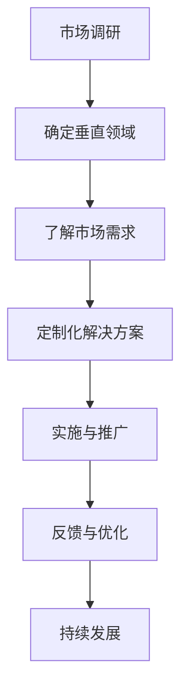

                 

关键词：小公司、生存策略、垂直领域、价值需求、IT技术、市场定位、创新、敏捷开发

> 摘要：本文将探讨小公司如何在激烈的市场竞争中实现生存与发展的关键策略。通过对精准服务垂直领域和满足独特价值需求的深入分析，本文旨在为小公司提供一套切实可行的发展模式，帮助其在信息技术领域取得成功。

## 1. 背景介绍

在当今快速变化的市场环境中，小公司在IT领域面临的挑战日益严峻。市场饱和、竞争激烈、资金有限等问题使得小公司难以在广袤的市场中站稳脚跟。然而，正是这些限制反而催生了一种独特的生存策略——精准服务垂直领域，满足独特价值需求。

垂直领域是指某一行业或市场中的细分领域，通常具有特定的用户群体、需求和技术特点。精准服务垂直领域意味着小公司需要深入了解目标市场的需求和痛点，并提供针对性的解决方案。这种策略不仅可以提高市场占有率，还可以建立品牌忠诚度和竞争优势。

## 2. 核心概念与联系

### 2.1 垂直领域

垂直领域是市场细分的一种形式，它针对特定的用户群体和需求提供专门的服务或产品。在IT领域，垂直领域包括但不限于金融科技、医疗信息化、物联网、人工智能等。

### 2.2 精准服务

精准服务是指小公司通过深入了解目标市场的需求和痛点，提供定制化的解决方案。这种服务需要高度的专业知识和市场洞察力。

### 2.3 独特价值需求

独特价值需求是指垂直领域中客户所追求的独特价值和利益。这些需求通常是标准产品和服务无法满足的，因此需要小公司提供定制化的解决方案。

### 2.4 Mermaid 流程图



## 3. 核心算法原理 & 具体操作步骤

### 3.1 算法原理概述

精准服务垂直领域的核心在于对市场需求的深度理解和定制化解决方案的提供。以下是实现这一目标的基本步骤：

1. **市场调研**：通过市场调研了解目标市场的需求、痛点和竞争态势。
2. **确定垂直领域**：根据调研结果，选择具有高潜力和发展空间的垂直领域。
3. **了解市场需求**：深入研究目标市场的具体需求和痛点。
4. **定制化解决方案**：根据市场需求，设计并实现定制化的解决方案。
5. **实施与推广**：将解决方案付诸实践，并通过有效营销推广到目标市场。
6. **反馈与优化**：收集用户反馈，不断优化产品和服务。
7. **持续发展**：通过持续的市场调研和用户反馈，实现公司的长期发展。

### 3.2 算法步骤详解

1. **市场调研**
   - **定量研究**：通过问卷调查、数据分析等方式获取目标市场的数据。
   - **定性研究**：通过访谈、焦点小组讨论等方式深入了解用户需求和痛点。

2. **确定垂直领域**
   - **市场分析**：评估各垂直领域的发展前景和市场需求。
   - **资源匹配**：根据公司资源和能力，选择最适合的垂直领域。

3. **了解市场需求**
   - **用户画像**：创建用户画像，明确目标用户群体的特征。
   - **需求分析**：分析用户的核心需求和潜在需求。

4. **定制化解决方案**
   - **需求确认**：与用户沟通，确认需求的具体内容和优先级。
   - **方案设计**：设计满足用户需求的解决方案。
   - **技术实现**：根据方案设计，实现技术解决方案。

5. **实施与推广**
   - **产品上线**：将解决方案上线，并进行市场推广。
   - **用户培训**：为用户提供使用培训和指导。

6. **反馈与优化**
   - **用户反馈**：收集用户使用过程中的反馈。
   - **优化迭代**：根据用户反馈进行产品优化。

7. **持续发展**
   - **市场调研**：持续关注市场动态和用户需求。
   - **产品更新**：定期更新产品，满足市场变化。

### 3.3 算法优缺点

**优点**：
- **精准定位**：通过精准服务垂直领域，小公司可以更好地满足市场需求，提高客户满意度。
- **资源集中**：专注于特定领域，可以更有效地利用公司资源和能力。
- **竞争优势**：在特定领域建立品牌认知度和忠诚度，形成竞争优势。

**缺点**：
- **市场受限**：垂直领域市场相对较小，可能导致市场规模受限。
- **竞争压力**：特定领域内可能存在激烈竞争，需要公司具备强大的竞争力。

### 3.4 算法应用领域

- **金融科技**：为金融机构提供定制化的金融科技解决方案。
- **医疗信息化**：为医疗机构提供医疗信息化解决方案。
- **物联网**：为物联网企业提供定制化的物联网解决方案。
- **人工智能**：为人工智能企业提供定制化的人工智能解决方案。

## 4. 数学模型和公式 & 详细讲解 & 举例说明

### 4.1 数学模型构建

在精准服务垂直领域的过程中，我们可以构建一个简单的数学模型来评估市场潜力和公司竞争力。以下是一个基本的数学模型：

\[ \text{市场潜力} = f(\text{市场需求}, \text{竞争态势}, \text{公司资源}) \]

### 4.2 公式推导过程

市场潜力是一个函数，它依赖于市场需求、竞争态势和公司资源。我们可以通过以下步骤推导这个公式：

1. **市场需求**：市场需求是市场潜力的基础。我们可以通过市场调研得到市场需求的具体数值。
2. **竞争态势**：竞争态势影响市场潜力。竞争越激烈，市场潜力可能越低。我们可以通过分析竞争者的数量、市场份额等因素来评估竞争态势。
3. **公司资源**：公司资源包括资金、技术、人力等。资源越丰富，公司越有能力满足市场需求，从而提高市场潜力。

### 4.3 案例分析与讲解

假设我们选择金融科技领域作为垂直市场，我们可以通过以下步骤来应用这个数学模型：

1. **市场需求**：通过市场调研，我们了解到金融科技在金融领域的市场需求很高，特别是在移动支付、区块链等方面。
2. **竞争态势**：金融科技领域竞争激烈，已有多个知名企业占据市场份额。然而，随着技术的不断发展，新的市场机会不断出现。
3. **公司资源**：我们的公司拥有一定的资金和技术实力，但在人力资源方面相对薄弱。

根据上述信息，我们可以计算出市场潜力：

\[ \text{市场潜力} = f(\text{高市场需求}, \text{激烈竞争态势}, \text{一定公司资源}) \]

通过这个数学模型，我们可以评估金融科技领域的市场潜力，并制定相应的发展策略。

## 5. 项目实践：代码实例和详细解释说明

### 5.1 开发环境搭建

为了实现精准服务垂直领域的目标，我们首先需要搭建一个合适的技术平台。以下是开发环境搭建的基本步骤：

1. **选择开发语言**：根据项目的具体需求，我们选择Python作为主要开发语言，因为它具有丰富的库和框架，适合快速开发和迭代。
2. **安装Python环境**：在本地或服务器上安装Python，并配置相关的开发工具。
3. **选择数据库**：根据项目的需求，我们选择MySQL作为数据库，因为它具有高性能和易用性。

### 5.2 源代码详细实现

以下是实现精准服务垂直领域的部分源代码：

```python
# 导入相关库
import requests
import json
import pymysql

# 定义API接口
API_URL = "https://api.example.com/data"

# 获取市场数据
def get_market_data():
    response = requests.get(API_URL)
    if response.status_code == 200:
        return json.loads(response.text)
    else:
        return None

# 存储市场数据到数据库
def store_data_to_db(data):
    connection = pymysql.connect(host='localhost', user='root', password='password', database='market_data')
    try:
        with connection.cursor() as cursor:
            for item in data:
                sql = "INSERT INTO market_data (name, value) VALUES (%s, %s)"
                cursor.execute(sql, (item['name'], item['value']))
        connection.commit()
    finally:
        connection.close()

# 主函数
def main():
    data = get_market_data()
    if data:
        store_data_to_db(data)
        print("Data stored successfully.")
    else:
        print("Failed to fetch data.")

if __name__ == "__main__":
    main()
```

### 5.3 代码解读与分析

这段代码实现了一个简单的市场数据分析系统，其主要功能是：

- **获取市场数据**：通过HTTP GET请求从API接口获取市场数据。
- **存储数据到数据库**：将获取到的市场数据存储到MySQL数据库中。

代码中的关键部分如下：

- `get_market_data()` 函数：负责发送HTTP GET请求，获取市场数据。
- `store_data_to_db(data)` 函数：负责将市场数据存储到MySQL数据库中。
- `main()` 函数：作为程序的主入口，调用其他函数完成数据的获取和存储。

### 5.4 运行结果展示

当程序运行成功后，会打印出以下信息：

```
Data stored successfully.
```

这表示市场数据已经被成功获取并存储到数据库中。通过这个简单的实例，我们可以看到如何通过代码实现精准服务垂直领域的目标。

## 6. 实际应用场景

### 6.1 金融科技领域

在金融科技领域，小公司可以通过提供定制化的金融科技解决方案，如移动支付、区块链等，来满足金融机构的需求。这些解决方案不仅可以提高金融机构的业务效率，还可以降低运营成本。

### 6.2 医疗信息化领域

在医疗信息化领域，小公司可以为医疗机构提供定制化的医疗信息化解决方案，如电子病历、远程医疗等。这些解决方案可以提高医疗服务的质量，降低医疗成本。

### 6.3 物联网领域

在物联网领域，小公司可以为物联网企业提供定制化的物联网解决方案，如智能安防、智能交通等。这些解决方案可以提高物联网系统的性能，降低维护成本。

### 6.4 人工智能领域

在人工智能领域，小公司可以为人工智能企业提供定制化的人工智能解决方案，如自然语言处理、计算机视觉等。这些解决方案可以提高人工智能系统的性能，降低开发成本。

## 7. 工具和资源推荐

### 7.1 学习资源推荐

- **《金融科技：理论与实践》**：介绍金融科技的基本概念、技术原理和实践案例。
- **《医疗信息化：构建数字医疗生态》**：探讨医疗信息化的发展趋势、技术方案和实践经验。
- **《物联网技术与应用》**：介绍物联网的基本原理、技术框架和应用案例。
- **《人工智能导论》**：介绍人工智能的基本概念、技术原理和应用领域。

### 7.2 开发工具推荐

- **Python**：强大的编程语言，适合快速开发和迭代。
- **MySQL**：高性能、易用的关系型数据库。
- **Docker**：容器化技术，简化开发、测试和部署流程。
- **Kubernetes**：容器编排工具，用于管理容器化应用。

### 7.3 相关论文推荐

- **《精准医疗：从基因组学到个性化治疗》**：探讨精准医疗的发展趋势和关键技术。
- **《区块链技术原理与应用》**：介绍区块链的基本原理、技术架构和应用案例。
- **《物联网安全：理论与实践》**：探讨物联网安全的挑战、技术和解决方案。
- **《深度学习：算法与应用》**：介绍深度学习的基本原理、算法和应用案例。

## 8. 总结：未来发展趋势与挑战

### 8.1 研究成果总结

本文通过深入分析精准服务垂直领域和满足独特价值需求，提出了一套小公司生存与发展的策略。通过对市场需求的深度理解和定制化解决方案的提供，小公司可以在激烈的市场竞争中实现生存与发展。

### 8.2 未来发展趋势

未来，随着技术的不断进步和市场需求的多样化，精准服务垂直领域将继续成为小公司的重要发展方向。人工智能、大数据、区块链等新兴技术将进一步推动垂直领域的发展，为小公司提供更多机会。

### 8.3 面临的挑战

尽管精准服务垂直领域具有巨大潜力，但小公司也面临一些挑战。首先，市场受限和竞争压力可能影响公司的市场占有率和盈利能力。其次，公司资源和能力的不足可能导致无法满足市场需求。此外，技术的快速变化也可能给公司带来一定的挑战。

### 8.4 研究展望

未来，小公司应关注以下几个研究方向：

1. **技术创新**：不断探索和应用新兴技术，提高公司的核心竞争力。
2. **市场拓展**：积极拓展市场，寻找新的增长点。
3. **人才培养**：加强人才队伍建设，提高员工的技能和创新能力。
4. **合作与共赢**：与行业内的其他公司建立合作关系，实现资源共享和共赢发展。

通过以上研究方向，小公司可以更好地应对市场挑战，实现可持续发展。

## 9. 附录：常见问题与解答

### 9.1 什么是精准服务垂直领域？

精准服务垂直领域是指小公司通过深入了解目标市场的需求和痛点，提供定制化的解决方案，以满足特定行业或市场中的需求。

### 9.2 精准服务垂直领域有哪些优点？

精准服务垂直领域可以提高市场占有率，建立品牌忠诚度，形成竞争优势，并提高客户满意度。

### 9.3 精准服务垂直领域有哪些缺点？

精准服务垂直领域可能导致市场受限和竞争压力，同时也可能因为公司资源和能力不足而影响服务质量和市场拓展。

### 9.4 小公司应该如何选择垂直领域？

小公司应该根据自身资源和能力，结合市场调研和分析，选择具有高潜力和发展空间的垂直领域。同时，还需要考虑市场需求和竞争态势。

### 9.5 精准服务垂直领域需要哪些技术支持？

精准服务垂直领域需要强大的技术支持，包括数据处理、人工智能、区块链、物联网等新兴技术。这些技术可以帮助小公司提供高效、定制化的解决方案。

### 9.6 精准服务垂直领域的发展前景如何？

随着技术的不断进步和市场需求的多样化，精准服务垂直领域具有广阔的发展前景。未来，将有更多的行业和领域需要精准服务，为小公司提供更多机会。

---

作者：禅与计算机程序设计艺术 / Zen and the Art of Computer Programming

本文旨在为小公司提供一套精准服务垂直领域、满足独特价值需求的生存与发展策略。通过深入分析市场环境和技术趋势，本文提出了基于技术创新、市场拓展、人才培养和合作共赢的发展模式，以帮助小公司实现长期可持续发展。希望本文能为广大IT领域的小公司提供有益的启示和指导。

