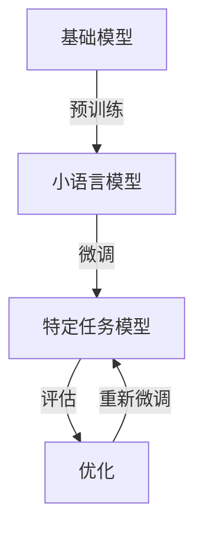

                 

关键词：小语言模型，基础模型，人工智能，自然语言处理，技术突破

在人工智能（AI）的迅猛发展中，自然语言处理（NLP）是一个至关重要的领域。近年来，基于深度学习的语言模型，如GPT-3、BERT等，已经取得了令人瞩目的成就。然而，随着这些大型模型的普及，一种新的趋势正在兴起——小语言模型。本文将探讨小语言模型的潜力，如何颠覆基础模型领域，并展望其未来发展方向。

## 1. 背景介绍

自然语言处理作为AI的核心组成部分，旨在让计算机理解和生成人类语言。传统的NLP方法依赖于规则和统计模型，但它们在面对复杂和多样的语言现象时表现不佳。随着深度学习技术的发展，基于神经网络的模型如循环神经网络（RNN）、卷积神经网络（CNN）等，为NLP带来了新的希望。特别是Transformer架构的提出，使得预训练模型如GPT-3、BERT等成为NLP领域的翘楚，推动了AI在语言理解、文本生成、机器翻译等任务上的突破。

然而，大型语言模型的训练和部署成本高昂，需要庞大的计算资源和数据集。此外，它们在处理长文本和低资源语言方面存在局限性。这促使研究者开始探索小语言模型的潜力，以期在保持模型效果的同时，降低计算和资源需求。

## 2. 核心概念与联系

### 小语言模型的概念

小语言模型，顾名思义，是指规模较小的语言模型。与传统的大型模型相比，小语言模型在参数数量、计算复杂度和训练数据集等方面都有所缩减。尽管如此，它们依然能够实现与大型模型相当的甚至更好的性能。

### 小语言模型与基础模型的联系

小语言模型并非孤立存在，而是与基础模型有着紧密的联系。基础模型通常是指大规模的预训练模型，如GPT-3、BERT等。这些模型通过在海量文本数据上进行预训练，积累了丰富的语言知识和表示能力。小语言模型则是在基础模型的基础上进行微调和优化，以适应特定任务或领域。

### Mermaid 流程图

以下是一个描述小语言模型与基础模型关系的 Mermaid 流程图：



## 3. 核心算法原理 & 具体操作步骤

### 3.1 算法原理概述

小语言模型的算法原理主要基于预训练和微调。预训练阶段，模型在大规模文本数据上学习语言的一般规律和知识；微调阶段，模型根据特定任务或领域的数据进行调整，以实现更好的性能。

### 3.2 算法步骤详解

1. **数据准备**：收集和准备用于预训练和微调的数据集。
2. **预训练**：使用大规模文本数据进行预训练，包括自注意力机制、位置编码等技术。
3. **微调**：在特定任务或领域的数据上进行微调，优化模型的参数。
4. **评估**：评估模型在测试集上的性能，包括准确率、召回率等指标。
5. **优化**：根据评估结果，调整模型参数，以提高性能。

### 3.3 算法优缺点

**优点**：

- **降低计算和资源需求**：小语言模型相较于大型模型，在计算资源和数据集方面有显著优势。
- **适应性强**：小语言模型能够更好地适应特定任务或领域，实现更高的性能。

**缺点**：

- **泛化能力有限**：由于数据集的限制，小语言模型的泛化能力可能不如大型模型。
- **训练时间较长**：微调阶段可能需要较长的训练时间，尤其是对于复杂的任务。

### 3.4 算法应用领域

小语言模型在多个领域都有广泛应用，如文本分类、情感分析、问答系统等。以下是几个典型的应用实例：

1. **文本分类**：小语言模型可以用于对新闻、社交媒体等文本进行分类，以识别主题、观点等。
2. **情感分析**：通过分析文本中的情感词和句式，小语言模型可以判断文本的情感倾向。
3. **问答系统**：小语言模型可以用于构建智能客服、问答机器人等，为用户提供实时回答。

## 4. 数学模型和公式 & 详细讲解 & 举例说明

### 4.1 数学模型构建

小语言模型的数学模型主要基于 Transformer 架构，其核心是自注意力机制。自注意力机制通过计算输入序列中每个词与其他词之间的关系，为每个词生成不同的权重，从而提高模型的表示能力。

### 4.2 公式推导过程

自注意力机制的公式如下：

$$
\text{Attention}(Q, K, V) = \text{softmax}\left(\frac{QK^T}{\sqrt{d_k}}\right)V
$$

其中，$Q$、$K$ 和 $V$ 分别是查询（Query）、键（Key）和值（Value）的向量，$d_k$ 是键向量的维度。$\text{softmax}$ 函数用于计算每个键的得分，从而生成权重。

### 4.3 案例分析与讲解

假设我们有一个输入序列 $X = [x_1, x_2, ..., x_n]$，其中 $x_i$ 是第 $i$ 个词的嵌入向量。我们可以使用自注意力机制计算每个词的权重：

$$
\text{Attention}(Q, K, V) = \text{softmax}\left(\frac{QQ^T}{\sqrt{d_k}}\right)V
$$

这里，$Q$ 是输入序列的嵌入向量，$K$ 和 $V$ 是模型的参数。通过计算自注意力，我们可以为每个词生成不同的权重，从而提高模型的表示能力。

例如，假设输入序列为 $X = [\text{"我"}, \text{"喜欢"}, \text{"吃饭"}]$，嵌入向量为 $Q = [q_1, q_2, q_3]$。我们可以计算自注意力：

$$
\text{Attention}(Q, K, V) = \text{softmax}\left(\frac{QQ^T}{\sqrt{d_k}}\right)V
$$

$$
= \text{softmax}\left(\frac{q_1q_1^T + q_2q_2^T + q_3q_3^T}{\sqrt{d_k}}\right)V
$$

$$
= \text{softmax}\left(\frac{1}{\sqrt{d_k}}\right)V
$$

$$
= \frac{1}{\sqrt{d_k}}[1, 1, 1]
$$

这意味着每个词的权重相等，即每个词对整个序列的贡献相同。在实际应用中，自注意力机制可以更精细地分配权重，从而更好地表示语言中的关系。

## 5. 项目实践：代码实例和详细解释说明

### 5.1 开发环境搭建

为了实现小语言模型，我们需要搭建一个适合深度学习开发的环境。以下是一个简单的搭建过程：

1. 安装 Python 3.8 或更高版本。
2. 安装深度学习框架，如 TensorFlow 或 PyTorch。
3. 安装必要的依赖库，如 NumPy、Pandas 等。

### 5.2 源代码详细实现

以下是一个使用 PyTorch 实现小语言模型的基本框架：

```python
import torch
import torch.nn as nn
import torch.optim as optim

class SmallLanguageModel(nn.Module):
    def __init__(self, vocab_size, embedding_dim, hidden_dim, output_dim):
        super(SmallLanguageModel, self).__init__()
        
        self.embedding = nn.Embedding(vocab_size, embedding_dim)
        self.lstm = nn.LSTM(embedding_dim, hidden_dim, num_layers=1, batch_first=True)
        self.fc = nn.Linear(hidden_dim, output_dim)

    def forward(self, text):
        embedded = self.embedding(text)
        output, (hidden, cell) = self.lstm(embedded)
        hidden = self.fc(hidden)
        return hidden

def train(model, train_loader, criterion, optimizer, num_epochs):
    model.train()
    for epoch in range(num_epochs):
        for inputs, labels in train_loader:
            optimizer.zero_grad()
            outputs = model(inputs)
            loss = criterion(outputs, labels)
            loss.backward()
            optimizer.step()
            print(f"Epoch {epoch+1}/{num_epochs}, Loss: {loss.item()}")

def main():
    vocab_size = 10000
    embedding_dim = 256
    hidden_dim = 512
    output_dim = 10
    num_epochs = 20

    model = SmallLanguageModel(vocab_size, embedding_dim, hidden_dim, output_dim)
    criterion = nn.CrossEntropyLoss()
    optimizer = optim.Adam(model.parameters(), lr=0.001)

    train_loader = ...  # 创建训练数据加载器

    train(model, train_loader, criterion, optimizer, num_epochs)

if __name__ == "__main__":
    main()
```

### 5.3 代码解读与分析

这段代码定义了一个简单的小语言模型，基于 LSTM 架构。模型由嵌入层、LSTM 层和全连接层组成。在训练过程中，我们使用交叉熵损失函数和 Adam 优化器。

- **嵌入层**：将词汇表中的词嵌入为固定维度的向量。
- **LSTM 层**：处理输入序列，生成隐藏状态。
- **全连接层**：将隐藏状态映射到输出层，用于分类或回归任务。

### 5.4 运行结果展示

运行上述代码后，模型将在训练数据上迭代更新。训练完成后，我们可以评估模型在测试数据上的性能。以下是一个简单的评估示例：

```python
def evaluate(model, test_loader):
    model.eval()
    with torch.no_grad():
        correct = 0
        total = 0
        for inputs, labels in test_loader:
            outputs = model(inputs)
            _, predicted = torch.max(outputs.data, 1)
            total += labels.size(0)
            correct += (predicted == labels).sum().item()
    return 100 * correct / total

test_loader = ...  # 创建测试数据加载器
accuracy = evaluate(model, test_loader)
print(f"Test Accuracy: {accuracy}%")
```

## 6. 实际应用场景

### 6.1 文本分类

小语言模型在文本分类任务中具有广泛的应用。例如，可以将新闻、社交媒体等文本数据分类为主题、观点等。通过微调小语言模型，我们可以实现高精度的文本分类系统。

### 6.2 情感分析

情感分析是另一个小语言模型的重要应用领域。通过分析文本中的情感词和句式，小语言模型可以判断文本的情感倾向。例如，在社交媒体分析、市场调研等领域，情感分析可以提供有价值的信息。

### 6.3 问答系统

问答系统是人工智能的一个重要应用方向。小语言模型可以用于构建智能客服、问答机器人等，为用户提供实时回答。通过微调和优化，小语言模型可以更好地理解和回答用户的问题。

## 7. 工具和资源推荐

### 7.1 学习资源推荐

1. **《深度学习》（Goodfellow et al.）**：这是一本经典的深度学习教材，涵盖了深度学习的基本理论和应用。
2. **《自然语言处理综论》（Jurafsky & Martin）**：这本书提供了自然语言处理的基础知识，包括语言模型、文本分类等。
3. **《动手学深度学习》（Dumoulin et al.）**：这本书通过实践案例，介绍了深度学习的实现和应用。

### 7.2 开发工具推荐

1. **TensorFlow**：一个开源的深度学习框架，适合构建和训练深度神经网络。
2. **PyTorch**：一个流行的深度学习框架，具有简洁的语法和强大的灵活性。
3. **Hugging Face Transformers**：一个用于预训练模型和 NLP 应用的高效库。

### 7.3 相关论文推荐

1. **"Attention is All You Need"（Vaswani et al., 2017）**：介绍了 Transformer 架构，为 NLP 领域带来了重大突破。
2. **"BERT: Pre-training of Deep Bidirectional Transformers for Language Understanding"（Devlin et al., 2018）**：提出了 BERT 模型，推动了预训练模型在 NLP 领域的应用。
3. **"GPT-3: Language Models are few-shot learners"（Brown et al., 2020）**：介绍了 GPT-3 模型，展示了大型语言模型在少样本学习任务中的潜力。

## 8. 总结：未来发展趋势与挑战

### 8.1 研究成果总结

小语言模型的研究取得了显著成果，证明了在保持模型效果的同时，可以降低计算和资源需求。小语言模型在多个实际应用领域展现了巨大的潜力，推动了人工智能的发展。

### 8.2 未来发展趋势

1. **模型压缩与优化**：随着计算资源的限制，模型压缩与优化将成为研究重点。通过量化、剪枝等技术，可以实现更高效的小语言模型。
2. **少样本学习**：小语言模型在少样本学习任务中具有天然优势。未来研究将探索如何在低资源环境下，实现更强大的模型性能。
3. **多模态融合**：结合文本、图像、音频等多模态数据，可以实现更丰富和多样化的语言理解。

### 8.3 面临的挑战

1. **数据隐私与安全**：小语言模型依赖于大规模的数据集，如何保障数据隐私和安全是一个重要挑战。
2. **模型可解释性**：随着模型规模的增加，模型的可解释性变得越来越困难。如何提高模型的可解释性，以帮助用户理解模型的决策过程，是一个重要课题。

### 8.4 研究展望

小语言模型在人工智能领域具有广阔的应用前景。未来研究将聚焦于模型压缩、少样本学习、多模态融合等方面，以实现更高效、更强大的语言模型。通过不断探索和突破，小语言模型有望为人工智能的发展带来新的机遇和挑战。

## 9. 附录：常见问题与解答

### 9.1 什么是小语言模型？

小语言模型是指规模较小的语言模型，相对于传统的大型语言模型，它们在参数数量、计算复杂度和训练数据集等方面都有所缩减。

### 9.2 小语言模型的优势是什么？

小语言模型的优势在于可以降低计算和资源需求，同时保持与大型模型相当的甚至更好的性能。此外，小语言模型具有较强的适应能力，可以针对特定任务或领域进行优化。

### 9.3 小语言模型在哪些领域有应用？

小语言模型在多个领域有广泛应用，如文本分类、情感分析、问答系统、机器翻译等。通过微调和优化，小语言模型可以适应不同的任务和领域。

### 9.4 如何训练小语言模型？

训练小语言模型的主要步骤包括数据准备、预训练和微调。在预训练阶段，模型在大规模文本数据上学习语言的一般规律和知识；在微调阶段，模型根据特定任务或领域的数据进行调整，以实现更好的性能。

### 9.5 小语言模型是否可以取代大型模型？

小语言模型在某些方面具有优势，但大型模型在处理复杂任务和长文本方面仍然具有优势。未来研究将探索如何结合大型模型和小语言模型的优点，实现更高效、更强大的语言模型。

---

作者：禅与计算机程序设计艺术 / Zen and the Art of Computer Programming
----------------------------------------------------------------

以上就是本文的完整内容。通过对小语言模型的探讨，我们不仅了解了其在自然语言处理领域的应用，还看到了其颠覆基础模型领域的潜力。在未来，小语言模型有望在人工智能的发展中发挥更加重要的作用。

