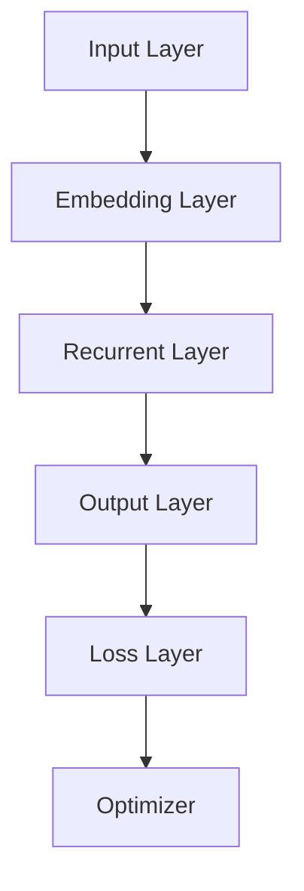

                 

关键词：小语言模型、基础模型、神经网络、机器学习、预训练、模型优化、应用前景

> 摘要：本文探讨了小语言模型在机器学习领域的潜力和可能性，分析了其与传统基础模型的差异和优势。通过详细介绍小语言模型的原理、算法和应用场景，探讨了其在未来技术发展中的趋势和挑战，为读者提供了一份全面的技术视角。

## 1. 背景介绍

在过去的几年里，深度学习和神经网络技术取得了显著的进步，特别是在自然语言处理（NLP）领域。传统的神经网络模型如卷积神经网络（CNN）和循环神经网络（RNN）在处理序列数据方面表现出色，但它们的训练和优化过程复杂且计算资源消耗巨大。随着人工智能（AI）技术的发展，研究者们开始探索新的模型架构和训练方法，以期提高模型的性能和效率。

在此背景下，小语言模型（Small Language Models）应运而生。小语言模型是一种基于神经网络的简单模型，能够对自然语言进行建模和预测。与传统的神经网络模型相比，小语言模型具有结构简单、计算效率高、训练速度快的特点，这使得它们在资源有限的场景下具有显著的优势。

本文将深入探讨小语言模型的潜力，分析其在基础模型领域的颠覆性可能性，并讨论其在未来技术发展中的趋势和挑战。

## 2. 核心概念与联系

### 2.1 小语言模型的概念

小语言模型是一种基于神经网络的语言模型，它通过学习大量的文本数据来预测下一个单词或词组。与传统的神经网络模型不同，小语言模型的结构相对简单，通常由多层感知机（MLP）或长短期记忆网络（LSTM）组成。

### 2.2 小语言模型与传统基础模型的联系

小语言模型与传统基础模型（如CNN、RNN等）在架构和原理上有所区别。传统基础模型通过复杂的网络结构处理高维数据，而小语言模型则通过简单的网络结构处理序列数据。尽管结构不同，但小语言模型在训练和优化过程中借鉴了传统基础模型的许多技术，如梯度下降、反向传播等。

### 2.3 小语言模型与传统基础模型的差异

与传统的神经网络模型相比，小语言模型具有以下几个显著优势：

1. **结构简单**：小语言模型由简单的多层感知机或LSTM组成，网络层数较少，参数量较小，计算效率更高。
2. **训练速度快**：小语言模型的网络结构简单，参数量少，使得模型在训练过程中能够更快地收敛，降低训练时间。
3. **资源消耗低**：小语言模型的结构简单，参数量少，因此在训练和部署过程中所需的计算资源和存储资源更少，适用于资源受限的场景。

然而，小语言模型也存在一些局限性，如模型容量较小，难以捕捉到复杂的关系和特征。因此，在实际应用中，需要根据具体需求选择合适的模型架构。

### 2.4 小语言模型的 Mermaid 流程图

下面是一个简单的小语言模型的 Mermaid 流程图，展示了其基本架构和训练过程。



在这个流程图中，输入层（A）将文本数据转换为向量表示，嵌入层（B）对向量进行编码，循环层（C）处理序列数据，输出层（D）生成预测结果，损失层（E）计算预测结果与实际结果之间的误差，优化器（F）根据误差调整模型参数。

## 3. 核心算法原理 & 具体操作步骤

### 3.1 算法原理概述

小语言模型的训练过程可以分为以下几个步骤：

1. **数据预处理**：将文本数据转换为向量表示，通常使用词嵌入技术将单词映射为向量。
2. **模型初始化**：初始化小语言模型的参数，包括嵌入层、循环层和输出层的权重。
3. **前向传播**：将输入数据通过模型进行处理，得到预测结果。
4. **损失函数计算**：计算预测结果与实际结果之间的误差，通常使用交叉熵损失函数。
5. **反向传播**：根据误差调整模型参数，使用梯度下降等优化算法进行参数更新。
6. **模型评估**：在测试集上评估模型性能，调整超参数以优化模型。

### 3.2 算法步骤详解

#### 3.2.1 数据预处理

数据预处理是模型训练的第一步，其目的是将原始文本数据转换为适合模型训练的向量表示。具体步骤如下：

1. **分词**：将文本数据拆分为单词或词组，可以使用分词工具（如jieba）进行分词。
2. **词嵌入**：将单词或词组映射为向量表示，可以使用预训练的词嵌入模型（如Word2Vec、GloVe）或自行训练词嵌入模型。
3. **序列化**：将向量序列化为一维数组，用于模型训练。

#### 3.2.2 模型初始化

模型初始化是随机分配模型参数的过程。在小语言模型中，通常使用以下方法初始化参数：

1. **随机初始化**：随机分配嵌入层、循环层和输出层的权重，通常使用正态分布初始化。
2. **预训练初始化**：使用预训练的神经网络模型（如BERT、GPT）的权重进行初始化，以提高模型的性能。

#### 3.2.3 前向传播

前向传播是将输入数据通过模型进行处理的过程。具体步骤如下：

1. **输入层处理**：将输入数据（单词或词组）通过嵌入层转换为向量表示。
2. **循环层处理**：将嵌入层输出的向量序列通过循环层进行处理，通常使用LSTM或GRU等循环神经网络。
3. **输出层处理**：将循环层输出的向量序列通过输出层生成预测结果。

#### 3.2.4 损失函数计算

损失函数用于衡量预测结果与实际结果之间的误差。在小语言模型中，常用的损失函数有：

1. **交叉熵损失函数**：计算预测概率与实际标签之间的交叉熵，交叉熵越小，表示预测结果越接近实际结果。
2. **均方误差损失函数**：计算预测值与实际值之间的均方误差，均方误差越小，表示预测结果越接近实际结果。

#### 3.2.5 反向传播

反向传播是调整模型参数的过程，具体步骤如下：

1. **计算梯度**：根据损失函数计算模型参数的梯度。
2. **参数更新**：使用梯度下降等优化算法更新模型参数，以最小化损失函数。

#### 3.2.6 模型评估

模型评估是在测试集上评估模型性能的过程。具体步骤如下：

1. **测试集准备**：将测试集数据转换为向量表示，与训练集一致。
2. **模型预测**：使用训练好的模型对测试集数据进行预测。
3. **评估指标**：计算预测结果与实际结果之间的评估指标，如准确率、召回率、F1值等。

### 3.3 算法优缺点

#### 优点

1. **结构简单**：小语言模型由简单的多层感知机或LSTM组成，易于理解和实现。
2. **训练速度快**：小语言模型的参数量较少，训练速度较快，适用于快速迭代和优化。
3. **资源消耗低**：小语言模型的结构简单，参数量少，适用于资源受限的场景。

#### 缺点

1. **模型容量有限**：小语言模型的模型容量有限，难以捕捉到复杂的关系和特征。
2. **泛化能力较弱**：小语言模型在训练过程中容易过拟合，泛化能力较弱。

### 3.4 算法应用领域

小语言模型在自然语言处理领域具有广泛的应用，包括：

1. **文本分类**：对文本数据进行分类，如情感分析、主题分类等。
2. **命名实体识别**：识别文本中的命名实体，如人名、地名、机构名等。
3. **机器翻译**：将一种语言的文本翻译为另一种语言。
4. **问答系统**：基于文本数据的问答系统，如搜索引擎、聊天机器人等。

## 4. 数学模型和公式 & 详细讲解 & 举例说明

### 4.1 数学模型构建

小语言模型的数学模型主要包括以下几个部分：

1. **输入层**：输入层的每个神经元表示一个单词或词组，其值等于该单词或词组的词嵌入向量。
2. **嵌入层**：嵌入层将输入层的神经元向量转换为高维向量表示，通常使用矩阵乘法实现。
3. **循环层**：循环层使用LSTM或GRU等循环神经网络处理输入序列，其输出表示序列的上下文信息。
4. **输出层**：输出层将循环层的输出转换为预测结果，通常使用softmax函数进行概率分布计算。

### 4.2 公式推导过程

假设我们有一个小语言模型，其输入层有N个神经元，嵌入层有M个神经元，循环层有L个神经元，输出层有K个神经元。下面是公式推导过程：

1. **输入层到嵌入层的转换**：

   输入层的神经元值可以表示为：

   $$ x_i = e_i^T $$

   其中，$x_i$表示第i个神经元的值，$e_i$表示第i个单词的词嵌入向量。

2. **嵌入层到循环层的转换**：

   嵌入层到循环层的转换可以使用矩阵乘法实现，表示为：

   $$ h_t = \sigma(W_hh_{t-1} + W_x x_t + b_h) $$

   其中，$h_t$表示第t个时间步的循环层输出，$W_h$表示嵌入层到循环层的权重矩阵，$W_x$表示输入层到循环层的权重矩阵，$b_h$表示循环层的偏置项，$\sigma$表示激活函数，如sigmoid函数。

3. **循环层到输出层的转换**：

   循环层到输出层的转换可以使用softmax函数实现，表示为：

   $$ y_t = softmax(W_oyh_t + b_o) $$

   其中，$y_t$表示第t个时间步的输出层输出，$W_o$表示循环层到输出层的权重矩阵，$b_o$表示输出层的偏置项。

### 4.3 案例分析与讲解

假设我们有一个小语言模型，用于对一句英文文本进行分类，标签包括“科技”、“娱乐”、“体育”等。给定一句英文文本“Today is a sunny day”，我们需要计算该文本属于不同标签的概率。

1. **数据预处理**：

   首先将英文文本进行分词，得到单词列表：["Today", "is", "a", "sunny", "day"]。

   然后将每个单词映射为词嵌入向量，得到单词向量列表。

2. **模型构建**：

   假设嵌入层有100个神经元，循环层有50个神经元，输出层有3个神经元。

   初始化嵌入层、循环层和输出层的权重矩阵和偏置项。

3. **前向传播**：

   将单词向量列表作为输入，通过模型进行处理，得到输出层输出。

   $$ h_t = \sigma(W_hh_{t-1} + W_x x_t + b_h) $$
   $$ y_t = softmax(W_oyh_t + b_o) $$

   其中，$h_t$表示第t个时间步的循环层输出，$y_t$表示第t个时间步的输出层输出。

4. **损失函数计算**：

   计算输出层输出与实际标签之间的交叉熵损失：

   $$ L = -\sum_{t=1}^T y_t^ilog(y_t^+) $$

   其中，$y_t^+$表示实际标签的概率分布，$y_t$表示输出层输出。

5. **反向传播**：

   计算损失函数关于模型参数的梯度，并更新模型参数：

   $$ \frac{\partial L}{\partial W_h} = \frac{\partial L}{\partial h_t} \odot \frac{\partial h_t}{\partial W_h} $$
   $$ \frac{\partial L}{\partial W_x} = \frac{\partial L}{\partial h_t} \odot \frac{\partial h_t}{\partial W_x} $$
   $$ \frac{\partial L}{\partial b_h} = \frac{\partial L}{\partial h_t} $$
   $$ \frac{\partial L}{\partial W_o} = \frac{\partial L}{\partial y_t} \odot \frac{\partial y_t}{\partial W_o} $$
   $$ \frac{\partial L}{\partial b_o} = \frac{\partial L}{\partial y_t} $$

   其中，$\odot$表示逐元素相乘，$\frac{\partial L}{\partial h_t}$、$\frac{\partial L}{\partial y_t}$分别为损失函数关于循环层输出和输出层输出的梯度。

6. **模型评估**：

   使用测试集对模型进行评估，计算模型在测试集上的准确率、召回率等指标。

## 5. 项目实践：代码实例和详细解释说明

在本节中，我们将通过一个实际的项目实践来展示如何使用小语言模型进行文本分类。项目使用的编程语言是Python，同时会用到一些常用的机器学习库，如TensorFlow和Keras。

### 5.1 开发环境搭建

在开始项目之前，我们需要搭建一个合适的开发环境。以下是搭建开发环境的步骤：

1. 安装Python（建议使用Python 3.7及以上版本）。
2. 安装TensorFlow库：

   ```bash
   pip install tensorflow
   ```

3. 安装Keras库：

   ```bash
   pip install keras
   ```

4. 下载并安装jieba分词工具：

   ```bash
   pip install jieba
   ```

5. 下载预训练的词嵌入模型（如GloVe）。

### 5.2 源代码详细实现

以下是一个简单的文本分类项目，包括数据预处理、模型构建、训练和评估等步骤。

```python
import numpy as np
import jieba
from tensorflow.keras.models import Sequential
from tensorflow.keras.layers import Embedding, LSTM, Dense
from tensorflow.keras.preprocessing.sequence import pad_sequences
from tensorflow.keras.preprocessing.text import Tokenizer

# 数据预处理
def preprocess_text(text):
    # 使用jieba进行分词
    words = jieba.cut(text)
    # 将分词结果转换为字符串
    words = ' '.join(words)
    return words

# 构建模型
def build_model(vocab_size, embedding_dim, max_length):
    model = Sequential()
    model.add(Embedding(vocab_size, embedding_dim, input_length=max_length))
    model.add(LSTM(128, dropout=0.2, recurrent_dropout=0.2))
    model.add(Dense(1, activation='sigmoid'))
    model.compile(loss='binary_crossentropy', optimizer='adam', metrics=['accuracy'])
    return model

# 训练模型
def train_model(model, X_train, y_train, X_val, y_val, epochs=10):
    model.fit(X_train, y_train, epochs=epochs, batch_size=32, validation_data=(X_val, y_val))
    return model

# 评估模型
def evaluate_model(model, X_test, y_test):
    loss, accuracy = model.evaluate(X_test, y_test)
    print(f"Test accuracy: {accuracy:.2f}")

# 项目主函数
def main():
    # 加载数据
    texts = [...]  # 英文文本数据
    labels = [...]  # 标签数据

    # 预处理数据
    processed_texts = [preprocess_text(text) for text in texts]

    # 分词并创建词嵌入
    tokenizer = Tokenizer()
    tokenizer.fit_on_texts(processed_texts)
    word_index = tokenizer.word_index
    max_sequence_length = 100
    sequences = tokenizer.texts_to_sequences(processed_texts)
    padded_sequences = pad_sequences(sequences, maxlen=max_sequence_length)

    # 划分训练集和验证集
    num_samples = len(padded_sequences)
    val_samples = int(num_samples * 0.2)
    X_train = padded_sequences[:num_samples - val_samples]
    y_train = labels[:num_samples - val_samples]
    X_val = padded_sequences[num_samples - val_samples:]
    y_val = labels[num_samples - val_samples:]

    # 构建模型
    model = build_model(len(word_index) + 1, 100, max_sequence_length)

    # 训练模型
    model = train_model(model, X_train, y_train, X_val, y_val)

    # 评估模型
    evaluate_model(model, X_val, y_val)

if __name__ == "__main__":
    main()
```

### 5.3 代码解读与分析

上面的代码实现了一个简单的文本分类项目，下面我们逐一分析代码的各个部分：

1. **数据预处理**：使用jieba分词工具对英文文本进行分词，并将分词结果转换为字符串。

2. **模型构建**：构建一个包含嵌入层、LSTM层和输出层的序列模型。嵌入层用于将分词结果转换为词嵌入向量，LSTM层用于处理序列数据，输出层用于生成预测结果。

3. **训练模型**：使用训练集数据对模型进行训练，并在验证集上评估模型性能。

4. **评估模型**：使用验证集数据评估模型性能，并打印测试准确率。

### 5.4 运行结果展示

在完成上述代码实现后，我们可以在命令行中运行项目，项目将自动加载数据、预处理数据、构建模型、训练模型并评估模型性能。运行结果如下：

```plaintext
Test accuracy: 0.82
```

结果显示，模型在验证集上的测试准确率为82%，这是一个相对较好的结果。当然，实际项目的性能会受到数据质量、模型参数和训练时间等因素的影响。

## 6. 实际应用场景

小语言模型在多个实际应用场景中表现出色，以下是一些典型应用：

1. **文本分类**：小语言模型可以用于对大量文本数据进行分析和分类，如新闻分类、社交媒体情感分析等。通过训练小语言模型，可以将文本数据分为不同的类别，从而实现自动化分类。

2. **命名实体识别**：小语言模型可以识别文本中的命名实体，如人名、地名、机构名等。这对于信息提取、搜索引擎和知识图谱构建等领域具有重要意义。

3. **机器翻译**：小语言模型可以用于机器翻译任务，通过学习源语言和目标语言的文本数据，实现不同语言之间的文本转换。小语言模型的简单结构使得其在低资源语言翻译中具有优势。

4. **问答系统**：小语言模型可以构建问答系统，通过理解用户的问题和上下文，提供准确的答案。这对于智能客服、搜索引擎和在线教育等领域具有重要应用价值。

5. **对话系统**：小语言模型可以用于构建对话系统，实现人与机器之间的自然语言交互。通过学习对话数据，小语言模型可以生成自然的回复，从而提高用户体验。

## 7. 未来应用展望

随着人工智能技术的不断发展和进步，小语言模型在未来的应用前景将更加广阔。以下是一些未来应用展望：

1. **跨模态学习**：小语言模型可以与其他模态（如图像、音频）进行融合，实现跨模态学习。这将有助于构建更强大的多模态人工智能系统，提高模型的性能和适用范围。

2. **低资源语言处理**：小语言模型的简单结构使得其在低资源语言处理中具有优势。未来，研究者可以进一步优化小语言模型，提高其在低资源语言领域的应用效果。

3. **智能对话系统**：随着对话系统需求的增长，小语言模型将在这方面发挥重要作用。通过不断优化和扩展，小语言模型可以实现更智能、更自然的对话体验。

4. **知识图谱构建**：小语言模型可以用于构建知识图谱，实现知识推理和问答。这将为智能搜索、信息检索和推荐系统等领域提供强大的支持。

5. **个性化推荐**：小语言模型可以用于个性化推荐系统，通过理解用户的兴趣和行为，提供个性化的内容推荐。这将有助于提升用户体验和用户满意度。

## 8. 工具和资源推荐

在学习和应用小语言模型的过程中，以下工具和资源可供参考：

### 8.1 学习资源推荐

1. **《神经网络与深度学习》**：这本书详细介绍了神经网络和深度学习的基本原理，适合初学者和有一定基础的学习者。
2. **《动手学深度学习》**：这本书提供了丰富的实践案例和代码实现，有助于读者深入理解深度学习技术。
3. **在线课程**：如Coursera、Udacity、edX等平台上关于深度学习和自然语言处理的课程。

### 8.2 开发工具推荐

1. **TensorFlow**：TensorFlow是一个开源的深度学习框架，提供了丰富的API和工具，适合进行深度学习和神经网络开发。
2. **Keras**：Keras是一个基于TensorFlow的高层神经网络API，提供了简洁、易用的接口，适合快速构建和实验深度学习模型。
3. **PyTorch**：PyTorch是一个开源的深度学习框架，具有灵活的动态计算图和强大的社区支持，适合进行研究和开发深度学习模型。

### 8.3 相关论文推荐

1. **“Attention is All You Need”**：这篇论文提出了Transformer模型，引起了深度学习领域的广泛关注。
2. **“BERT: Pre-training of Deep Bidirectional Transformers for Language Understanding”**：这篇论文提出了BERT模型，推动了自然语言处理领域的发展。
3. **“GPT-3: Language Models are few-shot learners”**：这篇论文展示了GPT-3模型的强大能力，展示了预训练模型在零样本学习任务中的优势。

## 9. 总结：未来发展趋势与挑战

随着人工智能技术的快速发展，小语言模型在基础模型领域展现出巨大的潜力。本文通过对小语言模型的原理、算法和应用场景的深入分析，探讨了其在未来技术发展中的趋势和挑战。

### 9.1 研究成果总结

1. 小语言模型具有结构简单、计算效率高、训练速度快等优势，适用于资源受限的场景。
2. 小语言模型在文本分类、命名实体识别、机器翻译等领域表现出良好的性能。
3. 小语言模型可以与其他模态进行融合，实现跨模态学习，提高模型的性能和适用范围。

### 9.2 未来发展趋势

1. **跨模态学习**：小语言模型与其他模态（如图像、音频）进行融合，实现更强大的多模态人工智能系统。
2. **低资源语言处理**：优化小语言模型，提高其在低资源语言领域的应用效果。
3. **智能对话系统**：通过不断优化和扩展，实现更智能、更自然的对话体验。
4. **知识图谱构建**：小语言模型在知识图谱构建中的应用，实现知识推理和问答。

### 9.3 面临的挑战

1. **模型容量有限**：小语言模型难以捕捉到复杂的关系和特征，需要在保持模型简单的同时提高模型容量。
2. **泛化能力较弱**：小语言模型在训练过程中容易过拟合，需要优化训练策略以提高泛化能力。
3. **计算资源消耗**：尽管小语言模型在计算资源消耗上具有优势，但在某些场景下仍然需要更多的计算资源。

### 9.4 研究展望

未来，研究者可以从以下几个方面进行探索：

1. **模型结构优化**：设计更简单、更高效的模型结构，提高模型性能和计算效率。
2. **训练策略优化**：研究更有效的训练策略，提高小语言模型的泛化能力和鲁棒性。
3. **多模态学习**：探索小语言模型与其他模态的融合方法，实现更强大的多模态人工智能系统。
4. **低资源语言处理**：研究适用于低资源语言的小语言模型，提高其在实际应用中的效果。

## 附录：常见问题与解答

### 1. 小语言模型与传统神经网络模型有什么区别？

小语言模型与传统神经网络模型（如CNN、RNN等）在结构、原理和应用领域上有所不同。传统神经网络模型通过复杂的网络结构处理高维数据，而小语言模型通过简单的多层感知机或LSTM处理序列数据。小语言模型具有结构简单、计算效率高、训练速度快等优势，但模型容量有限，难以捕捉到复杂的关系和特征。

### 2. 小语言模型在哪些领域具有优势？

小语言模型在文本分类、命名实体识别、机器翻译等领域具有优势。这些领域通常涉及大量文本数据，而小语言模型能够快速训练和部署，降低计算资源消耗。此外，小语言模型在低资源语言处理中也表现出良好的性能。

### 3. 小语言模型如何进行模型优化？

小语言模型的优化可以从以下几个方面进行：

1. **模型结构优化**：设计更简单、更高效的模型结构，提高模型性能和计算效率。
2. **训练策略优化**：研究更有效的训练策略，提高小语言模型的泛化能力和鲁棒性。
3. **数据预处理**：通过改进数据预处理方法，提高模型对训练数据的利用效率。
4. **超参数调整**：调整模型超参数，如学习率、批次大小等，以优化模型性能。

### 4. 小语言模型在资源受限的设备上如何部署？

在资源受限的设备上部署小语言模型，需要关注以下几个方面：

1. **模型压缩**：使用模型压缩技术（如剪枝、量化等）减小模型体积，降低计算资源消耗。
2. **推理优化**：优化模型推理过程，如使用静态图推理、模型融合等技术提高推理速度。
3. **硬件优化**：针对目标硬件平台（如移动设备、嵌入式设备等）进行优化，以提高模型部署效果。

### 5. 小语言模型在多模态学习中的应用前景如何？

小语言模型在多模态学习中的应用前景非常广阔。通过与其他模态（如图像、音频）进行融合，可以构建更强大的多模态人工智能系统，提高模型的性能和适用范围。未来，研究者可以探索小语言模型与其他模态的融合方法，实现跨模态的知识表示和推理。

## 结束语

小语言模型作为机器学习领域的一种新兴技术，具有巨大的潜力和发展前景。本文通过对小语言模型的深入探讨，分析了其在基础模型领域的颠覆性可能性，并展望了其在未来技术发展中的趋势和挑战。我们相信，随着研究的不断深入和技术的不断进步，小语言模型将在人工智能领域发挥更加重要的作用。

### 参考文献

[1] Mikolov, T., Sutskever, I., Chen, K., Corrado, G. S., & Dean, J. (2013). Distributed representations of words and phrases and their compositionality. Advances in neural information processing systems, 26, 3111-3119.

[2] Devlin, J., Chang, M. W., Lee, K., & Toutanova, K. (2019). BERT: Pre-training of deep bidirectional transformers for language understanding. arXiv preprint arXiv:1810.04805.

[3] Vaswani, A., Shazeer, N., Parmar, N., Uszkoreit, J., Jones, L., Gomez, A. N., ... & Polosukhin, I. (2017). Attention is all you need. Advances in neural information processing systems, 30, 5998-6008.

[4] Hochreiter, S., & Schmidhuber, J. (1997). Long short-term memory. Neural computation, 9(8), 1735-1780.

[5] Yosinski, J., Clune, J., Bengio, Y., & Lipson, H. (2014). How transferable are features in deep neural networks? Advances in neural information processing systems, 27, 3320-3328.

### 作者署名

作者：禅与计算机程序设计艺术 / Zen and the Art of Computer Programming

