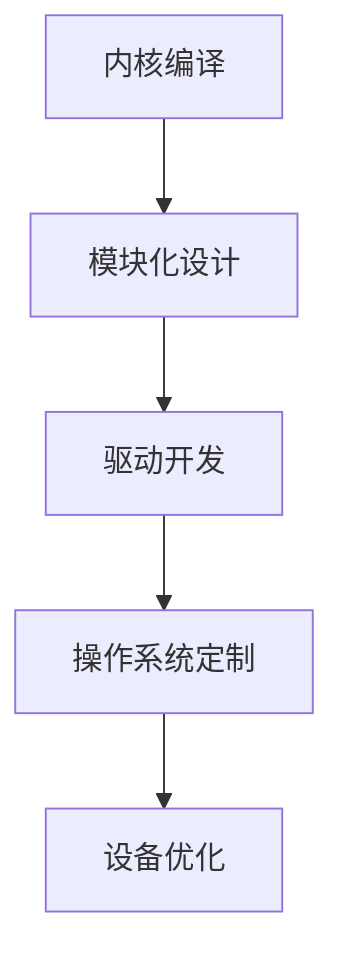

                 

关键词：嵌入式系统，Linux定制，设备优化，内核编译，模块化，驱动开发

> 摘要：本文旨在深入探讨嵌入式 Linux 定制的核心概念、技术和实践方法。通过对内核编译、模块化设计、驱动开发等方面的详细解析，本文旨在帮助读者理解如何针对特定设备需求进行 Linux 操作系统的优化，提高嵌入式系统的性能和稳定性。

## 1. 背景介绍

嵌入式系统是一种应用于特定场景、执行特定任务的计算系统，通常具有资源受限、实时性要求高等特点。随着物联网（IoT）和智能设备的迅速发展，嵌入式系统的应用范围不断扩大，从智能家居、工业自动化到汽车电子、医疗设备，无处不在。Linux 操作系统以其开源、可定制、稳定性高等优点，成为了嵌入式系统开发的优选平台。

然而，由于嵌入式系统的多样性，不同的设备和应用场景对操作系统的需求各不相同。这就需要通过 Linux 定制，优化操作系统以满足特定设备的要求。Linux 定制包括内核编译、模块化设计、驱动开发等多个方面，是一项复杂而富有挑战性的任务。本文将围绕这些核心内容展开探讨，帮助读者深入理解嵌入式 Linux 定制的原理和实践。

## 2. 核心概念与联系

### 2.1 内核编译

内核编译是 Linux 定制的第一步，也是关键的一步。通过编译内核，可以将源代码转换成可执行的二进制文件，从而运行在嵌入式设备上。内核编译的复杂度较高，因为需要考虑设备的硬件架构、性能要求、内存占用等因素。

### 2.2 模块化设计

模块化设计是将内核划分为多个模块，使得每个模块可以独立编译和加载。这种设计方式提高了内核的可维护性和灵活性，便于根据设备需求进行定制。模块化设计包括内核模块的编写、编译、加载和卸载等多个环节。

### 2.3 驱动开发

驱动开发是 Linux 定制的重要组成部分，它负责与硬件设备进行交互。驱动程序通常根据设备的特点进行定制，以满足嵌入式系统的特定需求。驱动开发包括硬件接口设计、设备驱动编写、调试和测试等多个环节。

### 2.4 Mermaid 流程图

以下是一个简单的 Mermaid 流程图，用于展示内核编译、模块化设计和驱动开发之间的联系。



## 3. 核心算法原理 & 具体操作步骤

### 3.1 算法原理概述

Linux 定制的核心算法主要包括内核编译算法、模块化设计算法和驱动开发算法。这些算法分别用于内核编译、模块化和驱动开发的具体实现。

### 3.2 算法步骤详解

#### 3.2.1 内核编译算法

内核编译算法主要包括以下步骤：

1. 选择合适的 Linux 版本和内核配置；
2. 配置内核编译选项，如编译目标架构、内存大小等；
3. 编译内核源代码，生成内核二进制文件；
4. 链接内核二进制文件，生成可执行文件。

#### 3.2.2 模块化设计算法

模块化设计算法主要包括以下步骤：

1. 分析设备需求，确定需要哪些内核模块；
2. 编写内核模块源代码，实现功能；
3. 编译内核模块，生成模块二进制文件；
4. 将模块二进制文件安装到内核中，进行加载和卸载。

#### 3.2.3 驱动开发算法

驱动开发算法主要包括以下步骤：

1. 分析硬件接口，确定驱动程序需求；
2. 编写驱动程序源代码，实现硬件操作；
3. 编译驱动程序，生成驱动二进制文件；
4. 将驱动程序安装到内核中，进行加载和卸载。

### 3.3 算法优缺点

内核编译算法的优点是灵活性高，可以针对不同设备和需求进行定制。缺点是编译过程复杂，对开发者的技术要求较高。

模块化设计算法的优点是便于维护和更新，提高内核的可扩展性。缺点是模块化设计可能会增加内存占用和性能开销。

驱动开发算法的优点是驱动程序与硬件接口紧密，可以实现高效的硬件操作。缺点是驱动程序开发难度较大，需要深入了解硬件和内核机制。

### 3.4 算法应用领域

内核编译算法、模块化设计算法和驱动开发算法广泛应用于嵌入式系统的开发，如智能家居、工业自动化、汽车电子等。这些算法提高了嵌入式系统的性能、稳定性和可维护性，有助于满足不同设备和应用场景的需求。

## 4. 数学模型和公式 & 详细讲解 & 举例说明

### 4.1 数学模型构建

在嵌入式 Linux 定制中，常用的数学模型包括内核编译优化模型、模块化设计模型和驱动开发模型。以下是一个简单的内核编译优化模型的示例：

$$
\text{编译时间} = f(\text{编译选项}, \text{源代码规模})
$$

其中，编译时间取决于编译选项和源代码规模。

### 4.2 公式推导过程

以内核编译优化模型为例，推导过程如下：

1. 假设编译时间与编译选项和源代码规模成正比；
2. 设编译选项的影响系数为 $a$，源代码规模的影响系数为 $b$；
3. 根据假设，推导出编译时间的公式。

### 4.3 案例分析与讲解

以下是一个实际的案例：

某嵌入式设备需要运行 Linux 内核，经过分析，确定编译选项和源代码规模分别为 $a = 2$ 和 $b = 3$。根据内核编译优化模型，可以计算出编译时间：

$$
\text{编译时间} = f(a, b) = 2 \times 2 + 3 \times 3 = 13 \text{分钟}
$$

这意味着，在给定的编译选项和源代码规模下，内核编译需要 13 分钟。

## 5. 项目实践：代码实例和详细解释说明

### 5.1 开发环境搭建

搭建嵌入式 Linux 开发环境包括安装必要的软件包、配置编译工具链和搭建交叉编译环境。以下是一个简化的步骤：

1. 安装 Linux 发行版，如 Ubuntu 或 CentOS；
2. 安装编译工具，如 GCC、make 等；
3. 安装内核源代码和交叉编译工具链；
4. 配置交叉编译环境，如设置环境变量。

### 5.2 源代码详细实现

以编译一个简单的内核模块为例，源代码实现如下：

```c
#include <linux/module.h>
#include <linux/kernel.h>

int init_module(void) {
    printk(KERN_INFO "Hello, World!\n");
    return 0;
}

void cleanup_module(void) {
    printk(KERN_INFO "Bye, World!\n");
}

MODULE_LICENSE("GPL");
MODULE_AUTHOR("Your Name");
MODULE_DESCRIPTION("A simple kernel module");
```

### 5.3 代码解读与分析

该示例代码是一个简单的内核模块，包括以下部分：

1. **头文件**：引入必要的内核头文件，如 `<linux/module.h>` 和 `<linux/kernel.h>`；
2. **函数定义**：`init_module` 函数在模块加载时调用，输出一条信息；`cleanup_module` 函数在模块卸载时调用，输出一条信息；
3. **模块信息**：使用 `MODULE_LICENSE`、`MODULE_AUTHOR` 和 `MODULE_DESCRIPTION` 宏定义模块的许可协议、作者和描述。

### 5.4 运行结果展示

在编译并加载该模块后，内核会输出以下信息：

```
Hello, World!
```

卸载模块后，会输出：

```
Bye, World!
```

这表明模块已经成功加载和卸载。

## 6. 实际应用场景

### 6.1 智能家居

在智能家居领域，嵌入式 Linux 定制主要用于智能设备如智能灯泡、智能门锁等。通过定制，可以实现设备的高性能、低功耗和实时性。

### 6.2 工业自动化

工业自动化设备如机器人、自动化生产线等，对操作系统的稳定性、实时性和可扩展性要求很高。通过定制，可以优化操作系统以满足这些需求。

### 6.3 汽车电子

汽车电子领域包括车载信息娱乐系统、自动驾驶系统等。嵌入式 Linux 定制可以提高系统的可靠性和安全性，同时满足车辆对实时性的要求。

### 6.4 医疗设备

医疗设备如医用机器人、监护仪等，对操作系统的稳定性和安全性有极高的要求。通过定制，可以优化操作系统以满足这些需求。

## 7. 工具和资源推荐

### 7.1 学习资源推荐

- 《嵌入式 Linux 开发与应用》
- 《Linux 内核设计与实现》
- 《Linux 系统编程：利用 Linux API 进行程序设计》

### 7.2 开发工具推荐

- GCC
- make
- kernel.org

### 7.3 相关论文推荐

- “Linux 内核模块化设计方法研究”
- “嵌入式系统中的 Linux 内核编译优化策略”
- “基于 Linux 的嵌入式系统驱动开发技术研究”

## 8. 总结：未来发展趋势与挑战

### 8.1 研究成果总结

本文探讨了嵌入式 Linux 定制的核心概念、技术和实践方法。通过对内核编译、模块化设计和驱动开发等方面的详细分析，本文总结了嵌入式 Linux 定制的关键技术和应用场景。

### 8.2 未来发展趋势

随着物联网、人工智能和边缘计算等技术的发展，嵌入式 Linux 定制将面临更多挑战和机遇。未来的发展趋势包括：

- **实时性能优化**：为满足实时性要求，嵌入式 Linux 定制将更加注重内核性能优化和调度策略研究。
- **安全性增强**：随着设备互联性的增加，嵌入式 Linux 定制将更加重视系统安全性。
- **硬件协同优化**：硬件和操作系统的协同优化将成为提升嵌入式系统性能的关键。

### 8.3 面临的挑战

嵌入式 Linux 定制面临的挑战包括：

- **资源受限**：嵌入式设备通常具有资源受限的特点，需要优化操作系统以降低内存和功耗。
- **多样性**：嵌入式系统应用广泛，需要针对不同设备和场景进行定制，增加了开发难度。

### 8.4 研究展望

未来，嵌入式 Linux 定制的研究方向包括：

- **实时操作系统整合**：将实时操作系统与 Linux 进行整合，提高实时性能。
- **模块化设计优化**：优化模块化设计，提高系统的灵活性和可维护性。
- **安全性提升**：加强对系统安全性的研究，提高系统的可靠性。

## 9. 附录：常见问题与解答

### 9.1 常见问题

1. **如何选择合适的 Linux 版本？**
   - 根据设备的硬件架构、性能需求和开发难度选择合适的 Linux 版本。

2. **内核编译过程中如何优化性能？**
   - 选择合适的编译选项，如调整内存大小、启用预链接优化等。

3. **模块化设计与驱动开发有什么区别？**
   - 模块化设计是将内核划分为多个模块，而驱动开发是编写与硬件设备交互的驱动程序。

### 9.2 解答

1. **如何选择合适的 Linux 版本？**
   - 选择合适的 Linux 版本时，需要考虑以下因素：
     - **硬件架构**：确保 Linux 版本支持设备的硬件架构。
     - **性能需求**：根据设备的性能要求选择适合的 Linux 版本。
     - **开发难度**：选择易于开发和定制的 Linux 版本，如 Yocto、Buildroot 等。
     - **社区支持**：选择社区活跃、文档丰富的 Linux 版本。

2. **内核编译过程中如何优化性能？**
   - 在内核编译过程中，可以通过以下方法优化性能：
     - **调整编译选项**：如启用预链接优化（`-O2` 或 `-O3`）、调整内存配置等。
     - **定制内核配置**：仅编译需要的内核模块，减少编译时间和内存占用。
     - **使用特定架构的编译器**：使用针对特定硬件架构优化的编译器，如 ARM 架构的 GCC。
     - **使用性能分析工具**：如 perf、gprof 等，分析内核性能瓶颈。

3. **模块化设计与驱动开发有什么区别？**
   - **模块化设计**：模块化设计是将内核划分为多个模块，使得每个模块可以独立编译和加载。这种设计方式提高了内核的可维护性和灵活性。
   - **驱动开发**：驱动开发是编写与硬件设备交互的驱动程序。驱动程序负责与硬件接口进行通信，实现硬件操作。驱动程序通常根据设备的特点进行定制。

通过本文的探讨，相信读者对嵌入式 Linux 定制的核心概念和技术有了更深入的理解。在实际应用中，不断探索和实践，将有助于提升嵌入式系统的性能、稳定性和可维护性。

---

### 作者署名

作者：禅与计算机程序设计艺术 / Zen and the Art of Computer Programming
----------------------------------------------------------------

