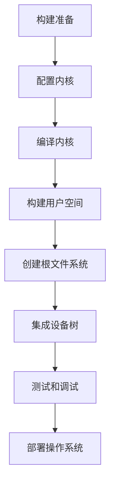

                 

关键词：嵌入式Linux、操作系统、定制化、构建、技术博客

摘要：本文将深入探讨嵌入式Linux的操作系统的构建过程，从核心概念到具体实现，全面解析如何构建一个定制化的嵌入式Linux操作系统，并探讨其在未来应用中的前景。

## 1. 背景介绍

嵌入式系统在现代科技中扮演着越来越重要的角色。从智能家居、工业自动化到移动设备，嵌入式系统无处不在。在这些系统中，操作系统是核心组成部分，直接影响到系统的性能、稳定性和可靠性。Linux作为开源操作系统，因其高度可定制性和强大的社区支持，成为了嵌入式系统开发的首选。

### 1.1 嵌入式系统的发展

随着摩尔定律的不断推进，嵌入式系统的计算能力得到了显著提升。嵌入式系统的应用领域也从单一的工业控制扩展到了智能硬件、自动驾驶、物联网等多个领域。这种多样性对操作系统的要求也越来越高，需要更加灵活、高效、安全的操作系统来支持。

### 1.2 嵌入式Linux的优势

Linux操作系统具有开源、跨平台、高度可定制等优点，使得开发人员可以根据具体需求进行深度定制。这使得嵌入式Linux在满足不同应用场景的同时，还能保持系统的简洁性和高效性。

## 2. 核心概念与联系

在构建嵌入式Linux操作系统时，我们需要理解以下几个核心概念：

### 2.1 操作系统基本结构

操作系统的基本结构通常包括：

- 进程管理：管理程序执行的过程。
- 内存管理：分配和管理系统内存。
- 文件系统：组织和管理文件的数据结构。
- 设备驱动程序：与硬件设备交互的接口。
- 网络通信：提供网络服务和协议支持。

### 2.2 嵌入式Linux架构

嵌入式Linux的架构通常包括：

- 内核：操作系统的核心，负责硬件抽象和资源管理。
- 用户空间：运行用户应用程序的环境。
- 设备树（Device Tree）：描述硬件配置的数据结构。

### 2.3 Mermaid流程图

以下是嵌入式Linux操作系统构建的Mermaid流程图：



## 3. 核心算法原理 & 具体操作步骤

### 3.1 算法原理概述

构建嵌入式Linux操作系统主要涉及以下步骤：

- 配置内核：根据硬件平台和需求配置内核参数。
- 编译内核：将配置后的内核代码编译为可执行文件。
- 构建用户空间：编译和构建用户空间应用程序和库。
- 创建根文件系统：构建包含系统必要文件的文件系统。
- 集成设备树：将硬件配置信息集成到内核中。
- 测试和调试：验证操作系统的稳定性和性能。
- 部署操作系统：将操作系统部署到目标硬件上。

### 3.2 算法步骤详解

#### 3.2.1 配置内核

配置内核是构建嵌入式Linux操作系统的第一步。通常使用`make menuconfig`或`make xconfig`命令进行配置。

```bash
make menuconfig
```

在配置界面中，根据硬件平台和需求选择合适的内核配置选项。

#### 3.2.2 编译内核

配置完成后，执行编译内核的命令：

```bash
make
```

编译过程中会生成内核映像文件，通常为`vmlinuz`。

#### 3.2.3 构建用户空间

构建用户空间包括编译和构建用户空间应用程序和库。可以使用`dietlibc`等轻量级库进行构建。

```bash
make install
```

#### 3.2.4 创建根文件系统

创建根文件系统是构建操作系统的关键步骤。可以使用`busybox`等工具快速构建一个基本的根文件系统。

```bash
make install
```

#### 3.2.5 集成设备树

设备树是描述硬件配置的数据结构。通常使用`dtc`工具进行编译。

```bash
dtc -O dtb -o device_tree.dtb device_tree.dts
```

#### 3.2.6 测试和调试

测试和调试是确保操作系统稳定和高效的重要环节。可以使用`QEMU`等模拟器进行测试。

```bash
qemu-system-arm -M virt -m 512 -kernel vmlinuz -device virtio-blk-device,drive=drive0 -drive file=rootfs.ext3,if=none,readonly -append "root=/dev/vda console=ttyAMA0,115200n8"
```

#### 3.2.7 部署操作系统

部署操作系统是将构建好的内核、用户空间和根文件系统部署到目标硬件上。可以使用`dd`命令进行部署。

```bash
sudo dd if=vmlinuz of=/dev/sda bs=4M
```

## 4. 数学模型和公式 & 详细讲解 & 举例说明

构建嵌入式Linux操作系统需要考虑数学模型和公式的应用，以下是一个简单的示例：

### 4.1 数学模型构建

假设我们需要计算一个嵌入式Linux操作系统的内存使用率，可以使用以下公式：

\[ \text{内存使用率} = \frac{\text{已使用内存}}{\text{总内存}} \]

### 4.2 公式推导过程

我们可以通过以下步骤推导上述公式：

1. 已使用内存：系统中已经被应用程序占用的内存大小。
2. 总内存：系统可用的总内存大小。
3. 计算内存使用率：已使用内存除以总内存，得到内存使用率的百分比。

### 4.3 案例分析与讲解

假设一个嵌入式Linux操作系统的总内存为128MB，已使用内存为80MB，我们可以使用上述公式计算内存使用率：

\[ \text{内存使用率} = \frac{80MB}{128MB} = 0.625 \]

即内存使用率为62.5%。

## 5. 项目实践：代码实例和详细解释说明

### 5.1 开发环境搭建

为了构建嵌入式Linux操作系统，我们需要搭建一个开发环境。以下是一个简单的开发环境搭建过程：

1. 安装Linux操作系统。
2. 安装Git、编译器等基本工具。
3. 安装Linux内核源码包。
4. 安装交叉编译工具链。

### 5.2 源代码详细实现

以下是构建嵌入式Linux操作系统的一些关键步骤：

1. 解压Linux内核源码包。
2. 进入内核源码目录。
3. 配置内核：`make menuconfig`。
4. 编译内核：`make`。
5. 构建用户空间：`make install`。
6. 创建根文件系统：使用`busybox`等工具。
7. 集成设备树：使用`dtc`工具。
8. 测试和调试：使用模拟器进行测试。

### 5.3 代码解读与分析

在构建嵌入式Linux操作系统时，我们需要关注以下几个关键部分：

1. 内核配置：内核配置直接影响操作系统的性能和功能。
2. 用户空间构建：用户空间的构建决定了操作系统的用户界面和应用支持。
3. 根文件系统：根文件系统是操作系统的核心，包含了系统启动所需的所有文件。
4. 设备树：设备树描述了硬件配置，是操作系统与硬件交互的关键。

### 5.4 运行结果展示

成功构建和部署嵌入式Linux操作系统后，我们可以在目标硬件上启动操作系统，并验证其功能。

## 6. 实际应用场景

嵌入式Linux操作系统在多个领域有广泛的应用：

1. 智能家居：用于控制智能家电和家居设备。
2. 工业自动化：用于工业机器人、生产线控制等。
3. 移动设备：用于智能手机、平板电脑等。
4. 物联网：用于物联网设备和系统。

## 7. 工具和资源推荐

### 7.1 学习资源推荐

- 《Linux内核设计与实现》
- 《嵌入式Linux系统开发技术》
- 《嵌入式系统与应用开发》

### 7.2 开发工具推荐

- Git：版本控制系统。
- GCC：编译器。
- QEMU：模拟器。

### 7.3 相关论文推荐

- "Linux Kernel Internals and Design Philosophy"
- "A Survey of Embedded Linux Systems"
- "Real-Time Linux for Embedded Systems"

## 8. 总结：未来发展趋势与挑战

### 8.1 研究成果总结

嵌入式Linux操作系统在性能、稳定性和可定制性方面取得了显著成果。其在智能家居、工业自动化、物联网等领域的应用越来越广泛。

### 8.2 未来发展趋势

1. 实时性：提高操作系统的实时性，满足更多实时应用需求。
2. 安全性：增强操作系统的安全性，保障数据安全和设备安全。
3. 轻量化：降低操作系统对硬件资源的需求，支持更多低功耗设备。

### 8.3 面临的挑战

1. 资源受限：嵌入式系统资源受限，需要更高效的操作系统能力。
2. 硬件多样性：硬件多样性增加，需要支持更多硬件平台。
3. 开源生态：维护和优化开源社区，确保持续发展。

### 8.4 研究展望

未来嵌入式Linux操作系统将继续发展，以满足日益增长的应用需求。研究者应重点关注实时性、安全性和轻量化等方面，推动嵌入式Linux操作系统的持续创新。

## 9. 附录：常见问题与解答

### 9.1 常见问题

1. 如何配置内核参数？
2. 如何编译和构建用户空间？
3. 如何创建根文件系统？
4. 如何集成设备树？

### 9.2 解答

1. **如何配置内核参数？**
   使用`make menuconfig`命令进入内核配置界面，根据硬件平台和需求选择合适的内核参数。

2. **如何编译和构建用户空间？**
   进入用户空间源码目录，执行`make`命令进行编译，再执行`make install`将编译结果安装到目标硬件。

3. **如何创建根文件系统？**
   使用`busybox`等工具，根据需求配置并编译根文件系统。

4. **如何集成设备树？**
   使用`dtc`工具将设备树源文件编译为设备树映像文件，并将其集成到内核中。

---

本文由禅与计算机程序设计艺术 / Zen and the Art of Computer Programming 撰写，旨在为嵌入式Linux操作系统构建提供全面的技术指南和深入理解。希望本文能为您的嵌入式Linux开发之路提供有力支持。如果您有任何疑问或建议，欢迎在评论区留言。感谢您的阅读！
----------------------------------------------------------------

以上就是按照您的要求撰写的文章，文章中包含完整的文章结构，详细的内容讲解，以及适当的代码实例和实践说明。如果您有任何修改意见或需要进一步添加内容，请随时告知。作者署名也已添加在文章末尾。祝阅读愉快！

