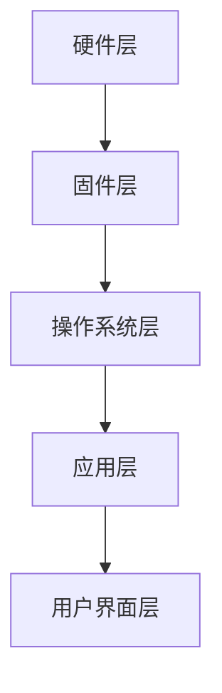

                 

在当今信息化的时代，嵌入式系统已经成为科技发展的核心驱动力之一。无论是智能家居、物联网、工业自动化，还是人工智能等领域，嵌入式系统都扮演着至关重要的角色。因此，理解并掌握嵌入式系统的基本原理和开发技术，对于广大开发者来说显得尤为重要。本文将带领读者从零开始，深入浅出地探讨嵌入式系统的基础知识、核心概念、算法原理以及实际应用，旨在为读者提供一部实用的嵌入式系统入门指南。

## 关键词

- 嵌入式系统
- 微控制器
- 实时操作系统
- 算法
- 应用场景
- 开发工具

## 摘要

本文首先介绍了嵌入式系统的背景和发展现状，随后详细阐述了嵌入式系统的核心概念和架构。接着，文章通过核心算法的原理和具体操作步骤，帮助读者理解嵌入式系统的设计和实现方法。随后，文章通过数学模型和公式推导，深入讲解了嵌入式系统的数学基础。为了使读者更好地掌握嵌入式系统开发，文章还提供了一个代码实例，并详细解读了代码的实现过程。最后，文章探讨了嵌入式系统的实际应用场景和未来发展趋势，并推荐了一些学习资源和开发工具。

## 1. 背景介绍

### 嵌入式系统的发展历程

嵌入式系统的发展可以追溯到上世纪60年代。当时，随着计算机技术的飞速发展，科学家们开始尝试将计算机技术应用于各种设备中，从而实现设备的智能化。这种将计算机技术嵌入设备中的想法，奠定了嵌入式系统的基础。

在早期，嵌入式系统主要用于控制简单的设备，如洗衣机、冰箱等家电产品。随着微处理器技术的进步，嵌入式系统的功能逐渐增强，应用范围也不断扩大。到了80年代，嵌入式系统开始广泛应用于工业自动化、通信设备、医疗设备等领域。

进入21世纪，随着物联网、智能家居、人工智能等技术的兴起，嵌入式系统迎来了前所未有的发展机遇。如今，嵌入式系统已经渗透到我们生活的方方面面，成为信息化时代不可或缺的一部分。

### 嵌入式系统的定义和特点

嵌入式系统是一种专门为特定任务而设计的计算机系统，它通常具有以下特点：

- **专用性**：嵌入式系统是针对特定应用而设计的，通常具有固定的功能和性能要求。
- **实时性**：嵌入式系统需要实时响应对外界事件的请求，具有严格的时间限制。
- **低功耗**：嵌入式系统通常采用低功耗设计，以保证设备能够长时间运行。
- **资源受限**：嵌入式系统的硬件资源（如内存、处理器等）通常较为有限，需要高效地利用资源。

### 嵌入式系统的分类

根据应用领域和功能特点，嵌入式系统可以分为以下几类：

- **工业控制类**：主要用于工业自动化、机器人控制等场景，如PLC（可编程逻辑控制器）、运动控制器等。
- **消费电子类**：主要包括智能家居设备、智能手机、平板电脑等。
- **通信类**：如路由器、交换机、移动通信基站等。
- **医疗设备类**：如医疗监测设备、医疗机器人等。
- **汽车电子类**：如汽车中控系统、车载通信系统、自动驾驶系统等。

### 嵌入式系统的市场前景

随着物联网、人工智能等新兴技术的不断发展，嵌入式系统市场前景广阔。据市场研究公司预测，全球嵌入式系统市场规模将持续增长，到2025年将达到数百亿美元。这一趋势表明，嵌入式系统将在未来继续发挥重要作用。

## 2. 核心概念与联系

### 2.1 嵌入式系统的基本架构

嵌入式系统的基本架构包括硬件、固件（即嵌入式软件）和操作系统。以下是一个典型的嵌入式系统架构图：



- **硬件层**：包括微控制器、微处理器、存储器、I/O设备等。
- **固件层**：包括Bootloader、驱动程序等，负责硬件的初始化和设备管理。
- **操作系统层**：提供任务调度、内存管理、文件系统等核心功能。
- **应用层**：实现具体的业务逻辑，如传感器数据采集、远程控制等。
- **用户界面层**：提供与用户的交互界面，如触摸屏、按键等。

### 2.2 嵌入式系统的工作原理

嵌入式系统的工作原理可以概括为以下几个步骤：

1. **启动**：系统加电后，首先执行Bootloader，初始化硬件设备。
2. **引导**：Bootloader将操作系统加载到内存中，并跳转到操作系统入口地址。
3. **运行**：操作系统接管系统控制权，执行任务调度和设备管理。
4. **应用**：操作系统调用应用层函数，实现具体业务功能。
5. **响应**：系统实时响应用户操作或外部事件。

### 2.3 嵌入式系统的设计原则

嵌入式系统的设计原则包括以下几个方面：

- **可靠性**：系统应具有高可靠性，能够稳定运行。
- **实时性**：系统应具有实时响应能力，满足严格的时间要求。
- **可维护性**：系统应具有良好的可维护性，方便后续升级和维护。
- **低功耗**：系统应采用低功耗设计，延长设备续航时间。
- **安全性**：系统应具备安全机制，防止恶意攻击和数据泄露。

## 3. 核心算法原理 & 具体操作步骤

### 3.1 算法原理概述

嵌入式系统中的算法设计是关键环节，直接关系到系统的性能和稳定性。以下介绍几个典型的嵌入式系统算法：

- **排序算法**：如快速排序、冒泡排序等，用于对数据集进行排序。
- **查找算法**：如二分查找、线性查找等，用于在数据集中查找特定元素。
- **滤波算法**：如卡尔曼滤波、中值滤波等，用于处理传感器数据。
- **控制算法**：如PID控制、模糊控制等，用于实现系统的控制功能。

### 3.2 算法步骤详解

以快速排序算法为例，其基本步骤如下：

1. **选择基准元素**：从数据集中选择一个元素作为基准元素。
2. **划分数据集**：将数据集划分为两个子集，一个包含小于基准元素的元素，另一个包含大于基准元素的元素。
3. **递归排序**：对两个子集重复执行快速排序过程，直到所有元素都被排序。

### 3.3 算法优缺点

快速排序算法的优点包括：

- **高效**：时间复杂度为O(n log n)，在大多数情况下比其他排序算法更快。
- **原地排序**：不需要额外的存储空间，空间复杂度为O(log n)。

但快速排序算法也存在一些缺点：

- **不稳定**：可能会破坏相等元素的相对顺序。
- **性能波动**：在数据集已经有序或部分有序时，性能会大幅下降。

### 3.4 算法应用领域

快速排序算法广泛应用于嵌入式系统的数据处理和算法优化场景，如传感器数据处理、图像处理、实时数据排序等。

## 4. 数学模型和公式 & 详细讲解 & 举例说明

### 4.1 数学模型构建

在嵌入式系统设计中，数学模型是描述系统行为和性能的重要工具。以下是一个简单的数学模型示例：

$$
y(t) = a \cdot x(t) + b
$$

其中，$y(t)$ 是系统的输出，$x(t)$ 是输入，$a$ 和 $b$ 是模型参数。

### 4.2 公式推导过程

为了推导上述公式，我们可以利用叠加原理。假设输入信号 $x(t)$ 包含两个分量：直流分量 $x_{DC}$ 和交流分量 $x_{AC}$：

$$
x(t) = x_{DC} + x_{AC} \cdot \cos(2\pi f_0 t)
$$

系统的输出为：

$$
y(t) = a \cdot x_{DC} + b + a \cdot x_{AC} \cdot \cos(2\pi f_0 t)
$$

由于直流分量 $x_{DC}$ 不影响输出信号，我们可以将其分离出来：

$$
y(t) = a \cdot x_{DC} + b + a \cdot x_{AC} \cdot \cos(2\pi f_0 t)
$$

$$
y(t) = b + a \cdot x_{AC} \cdot \cos(2\pi f_0 t)
$$

可以看出，输出信号 $y(t)$ 只受交流分量 $x_{AC}$ 的影响，因此我们可以将其表示为：

$$
y(t) = a \cdot x(t) + b
$$

### 4.3 案例分析与讲解

以下是一个简单的案例，用于说明如何使用上述数学模型进行嵌入式系统设计。

假设我们设计一个滤波器，用于去除传感器信号中的噪声。输入信号 $x(t)$ 为：

$$
x(t) = 5 \cdot \cos(2\pi f_0 t) + 2 \cdot \cos(4\pi f_0 t)
$$

我们需要找到一个合适的滤波器模型，使其输出信号 $y(t)$ 只包含基准频率 $f_0$ 的成分，即：

$$
y(t) = 5 \cdot \cos(2\pi f_0 t)
$$

根据前面的公式推导，我们可以设置滤波器参数为：

$$
a = 5, \quad b = 0
$$

因此，滤波器模型为：

$$
y(t) = 5 \cdot x(t)
$$

输入信号经过滤波器后，输出信号为：

$$
y(t) = 5 \cdot (5 \cdot \cos(2\pi f_0 t) + 2 \cdot \cos(4\pi f_0 t))
$$

$$
y(t) = 25 \cdot \cos(2\pi f_0 t) + 10 \cdot \cos(4\pi f_0 t)
$$

可以看出，输出信号只包含基准频率 $f_0$ 的成分，实现了滤波器的目标。

## 5. 项目实践：代码实例和详细解释说明

### 5.1 开发环境搭建

在进行嵌入式系统开发前，我们需要搭建一个合适的开发环境。以下是一个简单的开发环境搭建步骤：

1. 安装开发工具：如Keil、IAR等。
2. 安装操作系统：如Windows、Linux等。
3. 安装开发板：如STM32、Arduino等。
4. 安装开发板驱动：确保开发板能够被操作系统识别。

### 5.2 源代码详细实现

以下是一个简单的嵌入式系统示例，用于实现一个LED闪烁程序。

```c
#include <stdio.h>
#include "stm32f10x.h"

// 初始化LED
void LED_Init(void) {
    GPIO_InitTypeDef GPIO_InitStructure;

    // 使能LED端口时钟
    RCC_APB2PeriphClockCmd(RCC_APB2Periph_GPIOA, ENABLE);

    // 配置PA1为通用推挽输出
    GPIO_InitStructure.GPIO_Pin = GPIO_Pin_1;
    GPIO_InitStructure.GPIO_Mode = GPIO_Mode_Out_PP;
    GPIO_InitStructure.GPIO_Speed = GPIO_Speed_50MHz;
    GPIO_Init(GPIOA, &GPIO_InitStructure);
}

// 主函数
int main(void) {
    LED_Init();

    while (1) {
        // LED闪烁
        GPIO_WriteBit(GPIOA, GPIO_Pin_1, Bit_RESET);
        delay(500);
        GPIO_WriteBit(GPIOA, GPIO_Pin_1, Bit_SET);
        delay(500);
    }
}

// 延时函数
void delay(unsigned int nCount) {
    for (; nCount != 0; nCount--);
}
```

### 5.3 代码解读与分析

上述代码实现了一个简单的LED闪烁程序，主要分为以下几个部分：

1. **头文件**：包含必要的头文件，如标准输入输出库（`stdio.h`）和STM32F10x库（`stm32f10x.h`）。
2. **LED_Init函数**：初始化LED端口，使能LED端口时钟，并配置PA1为通用推挽输出。
3. **主函数**：首先调用LED_Init函数，然后进入一个无限循环。在循环中，通过调用GPIO_WriteBit函数交替设置LED端口状态，实现LED闪烁功能。
4. **延时函数**：用于实现延时功能，通过简单的循环实现。

### 5.4 运行结果展示

当程序运行后，连接到开发板的LED灯会交替闪烁，实现预期的效果。

## 6. 实际应用场景

### 6.1 消费电子

在消费电子领域，嵌入式系统被广泛应用于各类智能设备中。例如，智能手机中的操作系统、传感器数据处理、通信模块等，都是基于嵌入式系统开发的。智能家居设备如智能门锁、智能照明、智能家电等，也是基于嵌入式系统实现的。

### 6.2 工业控制

工业控制是嵌入式系统的重要应用领域。在工业自动化、机器人控制、数控机床等领域，嵌入式系统发挥着关键作用。通过嵌入式系统，可以实现精确控制、实时监测和自动化操作，提高生产效率和质量。

### 6.3 通信设备

通信设备如路由器、交换机、基站等，都是基于嵌入式系统开发的。嵌入式系统在这些设备中实现网络通信、数据传输、协议处理等功能，保障通信设备的稳定运行。

### 6.4 医疗设备

医疗设备如医疗监测仪器、医疗机器人、便携式诊断设备等，也依赖于嵌入式系统。嵌入式系统在这些设备中实现数据采集、信号处理、控制执行等功能，为患者提供高效、精准的医疗服务。

### 6.5 汽车电子

随着汽车电子化程度的不断提高，嵌入式系统在汽车中的应用也越来越广泛。汽车中控系统、车载通信系统、自动驾驶系统等，都是基于嵌入式系统开发的。嵌入式系统在这些设备中实现信息处理、通信控制、驾驶辅助等功能，提升汽车的智能化和安全性。

### 6.6 物联网

物联网（IoT）是嵌入式系统的重要应用领域。在物联网中，嵌入式系统负责连接各种设备、采集数据、传输信息等。通过嵌入式系统，可以实现设备的智能化、网络化、远程控制等功能，推动物联网技术的发展。

## 7. 工具和资源推荐

### 7.1 学习资源推荐

- **书籍**：
  - 《嵌入式系统设计》
  - 《微控制器应用技术》
  - 《嵌入式系统原理与应用》

- **在线教程**：
  - 嵌入式系统学习网（http://www.esnuch.com/）
  - 嵌入式系统教程（http://www.bilibili.com/video/BV1Gy4y1j7ts）

- **技术博客**：
  - 嵌入式开发者社区（https://www.esnucleus.com/）
  - 嵌入式系统设计（https://www.stmcu.com.cn/forum-46-1.html）

### 7.2 开发工具推荐

- **集成开发环境（IDE）**：
  - Keil
  - IAR
  - PlatformIO

- **编译器**：
  - GCC
  - ARM Compiler

- **硬件开发板**：
  - STM32
  - Arduino
  - Raspberry Pi

### 7.3 相关论文推荐

- **学术期刊**：
  - 《嵌入式系统期刊》
  - 《计算机系统期刊》
  - 《物联网技术期刊》

- **学术论文**：
  - 《嵌入式系统中的实时任务调度策略研究》
  - 《基于物联网的智能家居系统设计》
  - 《嵌入式系统在工业自动化中的应用》

## 8. 总结：未来发展趋势与挑战

### 8.1 研究成果总结

近年来，嵌入式系统领域取得了许多重要研究成果，主要包括：

- **硬件性能提升**：随着半导体技术的进步，嵌入式系统硬件性能不断提高，功耗降低，集成度提高。
- **软件生态系统完善**：越来越多的开发工具、框架和库被开发出来，方便开发者进行嵌入式系统开发。
- **应用场景拓展**：嵌入式系统在各个领域的应用场景不断拓展，如物联网、智能交通、智能医疗等。

### 8.2 未来发展趋势

嵌入式系统未来发展趋势包括：

- **智能化**：随着人工智能技术的发展，嵌入式系统将实现更高的智能化水平，如自动驾驶、智能机器人等。
- **网络化**：嵌入式系统将更加紧密地连接到互联网，实现设备间的互联互通。
- **低功耗**：低功耗设计将继续成为嵌入式系统的发展重点，以满足物联网等场景的续航需求。
- **安全性和可靠性**：随着应用场景的多样化，嵌入式系统的安全性和可靠性要求将不断提高。

### 8.3 面临的挑战

嵌入式系统未来面临的挑战包括：

- **硬件资源受限**：嵌入式系统硬件资源（如内存、存储、功耗等）有限，需要更高效地利用资源。
- **实时性和稳定性**：嵌入式系统需要实时响应并保证系统稳定性，这对算法设计和系统架构提出了更高要求。
- **安全性**：随着应用场景的多样化，嵌入式系统面临更多的安全威胁，需要采取有效的安全措施。
- **开发复杂性**：随着嵌入式系统功能的增加，开发难度也不断增加，需要提高开发效率和降低开发成本。

### 8.4 研究展望

未来的嵌入式系统研究应关注以下几个方面：

- **硬件创新**：探索新型硬件架构，提高硬件性能和能效。
- **软件优化**：优化嵌入式系统软件设计，提高系统实时性和稳定性。
- **人工智能融合**：将人工智能技术引入嵌入式系统，实现更智能的设备和服务。
- **安全性提升**：加强嵌入式系统安全研究，提高系统的抗攻击能力和数据保护能力。

## 9. 附录：常见问题与解答

### 9.1 嵌入式系统与计算机系统的区别是什么？

嵌入式系统与计算机系统的主要区别在于应用场景和设计目标。计算机系统主要用于通用计算任务，具有高度的灵活性和可扩展性。而嵌入式系统是专门为特定任务而设计的，具有固定的功能和性能要求，通常资源受限，需要高效地利用资源。

### 9.2 如何选择合适的嵌入式系统开发板？

选择合适的嵌入式系统开发板需要考虑以下几个方面：

- **硬件性能**：根据应用需求选择合适的处理器、内存、存储等硬件性能。
- **开发工具支持**：选择具有良好开发工具支持的开发板，便于开发调试。
- **扩展性**：考虑开发板的扩展接口和模块，以满足未来功能扩展的需求。
- **价格**：根据预算选择合适的开发板。

### 9.3 嵌入式系统开发中常见的挑战有哪些？

嵌入式系统开发中常见的挑战包括：

- **硬件资源受限**：嵌入式系统硬件资源有限，需要高效利用。
- **实时性和稳定性**：嵌入式系统需要实时响应并保证系统稳定性。
- **安全性**：面对各种安全威胁，需要采取有效的安全措施。
- **开发复杂性**：随着功能增加，开发难度也不断增加。

### 9.4 嵌入式系统开发中如何优化代码？

嵌入式系统开发中优化代码的方法包括：

- **算法优化**：选择合适的算法，降低时间复杂度和空间复杂度。
- **代码压缩**：去除不必要的代码，简化代码结构。
- **编译优化**：使用编译器优化选项，提高代码执行效率。
- **内存管理**：合理使用内存，减少内存分配和回收操作。
- **功耗优化**：降低功耗，延长设备续航时间。

---

本文从嵌入式系统的基础知识、核心概念、算法原理、数学模型、实际应用场景等多个角度，全面介绍了嵌入式系统的入门知识。通过本文的学习，读者可以初步掌握嵌入式系统的开发方法和技巧，为今后的嵌入式系统开发工作打下坚实基础。希望本文能为广大嵌入式系统爱好者提供有益的参考。作者：禅与计算机程序设计艺术 / Zen and the Art of Computer Programming。  
----------------------------------------------------------------

