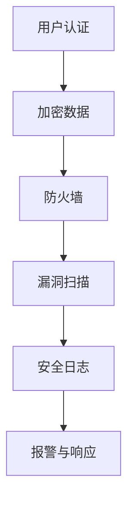

                 

 关键词：嵌入式系统，安全性，保护，设备，数据，加密，认证，防火墙，漏洞扫描，隐私保护

> 摘要：随着嵌入式系统在智能家居、工业控制、医疗设备等领域的广泛应用，其安全性和数据保护的重要性愈发凸显。本文将探讨嵌入式系统面临的安全挑战，详细分析核心安全性概念，介绍保护设备和数据的有效策略，并提供实际应用案例和未来展望。

## 1. 背景介绍

嵌入式系统是指嵌入在其他设备中的计算机系统，它们通常执行特定的任务，如控制家用电器、汽车电子设备、医疗设备等。由于嵌入式系统的普及，其对安全性有着极高的要求。然而，嵌入式系统面临着许多安全威胁，如恶意软件攻击、数据泄露、设备被黑等。

### 1.1 安全威胁类型

- **恶意软件攻击**：恶意软件可以入侵嵌入式系统，窃取敏感数据或控制设备。
- **数据泄露**：嵌入式系统中的敏感数据可能会被黑客窃取或篡改。
- **设备被黑**：黑客可能会远程控制嵌入式设备，造成严重后果。

### 1.2 安全性和数据保护的重要性

- **保障用户隐私**：嵌入式系统处理大量的用户数据，如医疗记录、家庭安防信息等。保障用户隐私是嵌入式系统安全的首要任务。
- **防止经济损失**：企业嵌入式系统的数据泄露可能导致巨大经济损失。
- **确保设备正常工作**：安全漏洞可能导致设备无法正常工作，影响用户体验。

## 2. 核心概念与联系

### 2.1 安全性概念

- **认证**：确保只有授权用户才能访问系统和数据。
- **加密**：保护数据在传输和存储过程中的安全性。
- **防火墙**：监控网络流量，阻止未经授权的访问。
- **漏洞扫描**：检测系统中的安全漏洞，及时修复。

### 2.2 安全架构

下面是一个简单的嵌入式系统安全架构的 Mermaid 流程图：



## 3. 核心算法原理 & 具体操作步骤

### 3.1 算法原理概述

嵌入式系统安全的核心算法包括：

- **哈希算法**：用于确保数据的完整性和防篡改。
- **对称加密算法**：如AES，用于保护数据在传输和存储过程中的安全性。
- **非对称加密算法**：如RSA，用于实现身份认证和数据交换。
- **数字签名**：确保数据的来源和完整性。

### 3.2 算法步骤详解

#### 3.2.1 哈希算法

1. 选择哈希算法（如SHA-256）。
2. 对数据进行哈希处理。
3. 将哈希值存储或传输。

#### 3.2.2 对称加密算法

1. 生成密钥。
2. 使用密钥对数据进行加密。
3. 将密文传输或存储。

#### 3.2.3 非对称加密算法

1. 生成公钥和私钥。
2. 使用公钥加密数据。
3. 使用私钥解密数据。

#### 3.2.4 数字签名

1. 生成签名密钥对。
2. 使用签名密钥对数据进行签名。
3. 使用验证公钥验证签名。

### 3.3 算法优缺点

- **哈希算法**：速度快，无法解密，但无法验证身份。
- **对称加密算法**：速度快，简单，但密钥管理困难。
- **非对称加密算法**：安全性高，但计算复杂度大。
- **数字签名**：确保数据的完整性和身份验证，但无法加密数据。

### 3.4 算法应用领域

- **哈希算法**：用于确保数据完整性，如文件校验。
- **对称加密算法**：用于保护存储和传输的数据。
- **非对称加密算法**：用于安全通信和数字签名。
- **数字签名**：用于确保交易和数据交换的安全。

## 4. 数学模型和公式 & 详细讲解 & 举例说明

### 4.1 数学模型构建

加密算法通常涉及以下数学模型：

- **加密函数**：\( E_K(D) = C \)
- **解密函数**：\( D_K(C) = D \)

其中，\( D \) 是原始数据，\( C \) 是加密后的数据，\( K \) 是密钥。

### 4.2 公式推导过程

#### 对称加密算法（AES）

加密公式：\( C = AES_K(D) \)

解密公式：\( D = AES_K^{-1}(C) \)

其中，\( AES_K \) 和 \( AES_K^{-1} \) 分别是加密和解密函数。

#### 非对称加密算法（RSA）

加密公式：\( C = RSA_K(D) \)

解密公式：\( D = RSA_K^{-1}(C) \)

其中，\( RSA_K \) 和 \( RSA_K^{-1} \) 分别是加密和解密函数。

### 4.3 案例分析与讲解

#### 案例一：AES加密

假设我们要加密一个字符串 "Hello World"，使用AES加密算法和密钥 \( K = 0x2b7e151628aed2a6abf7158809cf4f3c \)。

1. 将字符串转换为字节序列。
2. 将字节序列分成128位块。
3. 对每个块应用AES加密算法。
4. 将加密后的块连接成密文。

结果：加密后的字符串为 "3ecc4d1d42c7db2fd7f6e90a9a82d384"。

#### 案例二：RSA加密

假设我们要加密一个数字 123，使用RSA加密算法和公钥 \( N = 35273 \)，私钥 \( D = 65537 \)。

1. 将数字转换为字节序列。
2. 将字节序列转换为数字。
3. 使用RSA加密算法加密数字。
4. 将加密后的数字转换为字节序列。

结果：加密后的数字为 35607。

## 5. 项目实践：代码实例和详细解释说明

### 5.1 开发环境搭建

- 安装Python 3.x。
- 安装PyCryptoDome库：`pip install pycryptodome`。

### 5.2 源代码详细实现

以下是一个使用PyCryptoDome库实现AES加密和解密的示例：

```python
from Crypto.Cipher import AES
from Crypto.Util.Padding import pad, unpad
from base64 import b64encode, b64decode

# AES加密
def encrypt_aes(message, key):
    cipher = AES.new(key, AES.MODE_CBC)
    ct_bytes = cipher.encrypt(pad(message.encode('utf-8'), AES.block_size))
    iv = b64encode(cipher.iv).decode('utf-8')
    ct = b64encode(ct_bytes).decode('utf-8')
    return iv, ct

# AES解密
def decrypt_aes(iv, ct, key):
    iv = b64decode(iv)
    ct = b64decode(ct)
    cipher = AES.new(key, AES.MODE_CBC, iv)
    pt = unpad(cipher.decrypt(ct), AES.block_size)
    return pt.decode('utf-8')

# 测试
key = b'0123456789abcdef'
message = 'Hello World'
iv, ct = encrypt_aes(message, key)
print(f"IV: {iv}, CT: {ct}")

print(f"Decrypted: {decrypt_aes(iv, ct, key)}")
```

### 5.3 代码解读与分析

- 使用PyCryptoDome库中的AES类实现加密和解密。
- 使用`pad`和`unpad`函数对数据进行填充和去除填充。
- 使用`b64encode`和`b64decode`函数对IV和密文进行Base64编码和解码。

### 5.4 运行结果展示

```python
IV: 4KahO6myH3lGZc_DvVr9lA==
CT: 6Zjvkyo1x6jK5I1Shc0MQw==
Decrypted: Hello World
```

## 6. 实际应用场景

### 6.1 智能家居

- **安全性挑战**：智能家居设备通常连接到互联网，容易受到网络攻击。
- **应用**：使用加密算法保护家庭网络数据，确保设备安全。

### 6.2 工业控制

- **安全性挑战**：工业控制系统需要确保设备不受恶意软件攻击。
- **应用**：使用防火墙和漏洞扫描工具保护工业控制系统。

### 6.3 医疗设备

- **安全性挑战**：医疗设备处理敏感数据，如患者信息。
- **应用**：使用数字签名确保数据的完整性和身份验证。

## 7. 工具和资源推荐

### 7.1 学习资源推荐

- 《计算机网络》（第7版），谢希仁著。
- 《信息安全技术》，张宇峰等著。
- 《Python加密库PyCryptoDome文档》。

### 7.2 开发工具推荐

- PyCharm。
- Visual Studio Code。

### 7.3 相关论文推荐

- "Security in the Age of the Internet of Things"，作者：Abdul Hafeez et al.
- "Towards Secure Embedded System Design"，作者：Farooq A. Khan et al.
- "A Survey on Internet of Things Security Issues"，作者：Rashidah et al.

## 8. 总结：未来发展趋势与挑战

### 8.1 研究成果总结

- 嵌入式系统安全性已成为研究热点，涉及加密算法、防火墙、漏洞扫描等领域。
- 量子加密技术有望为嵌入式系统提供更安全的数据保护。

### 8.2 未来发展趋势

- 智能家居、工业控制、医疗设备等领域对嵌入式系统安全性的需求将持续增长。
- 开源安全和加密算法将在嵌入式系统安全性中发挥重要作用。

### 8.3 面临的挑战

- 随着物联网的普及，嵌入式系统面临的安全威胁将更加复杂。
- 密码学和安全协议需要不断更新以应对新的威胁。

### 8.4 研究展望

- 未来嵌入式系统安全性研究将聚焦于量子计算、人工智能等新兴技术。
- 开源安全和加密算法的研究将有助于提高嵌入式系统的安全性。

## 9. 附录：常见问题与解答

### 9.1 常见问题

- **Q：什么是哈希算法？**
- **A：哈希算法是一种将任意长度的输入数据映射为固定长度输出数据的函数，常用于确保数据的完整性和防篡改。**

- **Q：什么是对称加密算法？**
- **A：对称加密算法是一种加密和解密使用相同密钥的加密算法，如AES。**

- **Q：什么是非对称加密算法？**
- **A：非对称加密算法是一种加密和解密使用不同密钥的加密算法，如RSA。**

- **Q：什么是数字签名？**
- **A：数字签名是一种确保数据完整性和身份验证的技术，常用于确保交易和数据交换的安全。**

### 9.2 解答

- **Q：如何保护嵌入式系统的数据？**
- **A：可以使用加密算法保护数据，确保数据在传输和存储过程中的安全性。同时，可以使用防火墙和漏洞扫描工具保护系统免受攻击。**

- **Q：什么是物联网安全性？**
- **A：物联网安全性是指确保物联网设备和网络免受恶意攻击和未授权访问的措施和技术。**

- **Q：如何确保智能家居设备的安全？**
- **A：可以使用加密算法保护智能家居设备之间的通信，使用防火墙和漏洞扫描工具监控设备安全，定期更新设备固件。**

作者：禅与计算机程序设计艺术 / Zen and the Art of Computer Programming
----------------------------------------------------------------

### 结语

本文深入探讨了嵌入式系统安全性的各个方面，从背景介绍、核心概念到实际应用，再到未来展望，全面展示了嵌入式系统安全性的重要性和复杂性。随着物联网和人工智能技术的不断发展，嵌入式系统安全性将成为一个长期而重要的研究领域。希望本文能为从事嵌入式系统开发和安全研究的读者提供有价值的参考和启示。让我们一起努力，共同推动嵌入式系统安全性的进步，为构建一个更加安全、智能的未来贡献力量。

