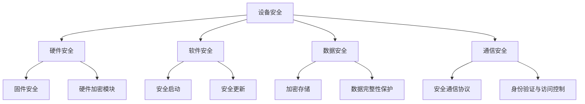

                 

关键词：嵌入式系统、安全策略、数据完整性、设备保护

摘要：随着物联网（IoT）的迅速发展，嵌入式系统在各个领域中的应用日益广泛，其安全性和数据完整性成为不容忽视的问题。本文从嵌入式系统的背景介绍入手，探讨了当前面临的挑战，提出了基于硬件和软件的安全策略，并通过实际项目实例展示了这些策略的实施效果。同时，对未来的发展进行了展望，指出了研究面临的挑战和前景。

## 1. 背景介绍

嵌入式系统是一种特殊类型的计算机系统，它们通常被设计成执行特定的任务，并嵌入到各种设备中，如家用电器、工业控制系统、汽车电子设备、医疗设备等。与通用计算机系统相比，嵌入式系统具有体积小、功耗低、实时性强、可靠性高等特点。然而，随着嵌入式系统在物联网中的应用日益增多，其安全性和数据完整性面临着前所未有的挑战。

### 1.1 嵌入式系统的发展趋势

近年来，嵌入式系统技术取得了显著进展，主要体现在以下几个方面：

- **处理器性能的提升**：随着摩尔定律的延续，嵌入式处理器的性能不断提升，使得复杂算法的实现变得更加容易。
- **通信技术的发展**：物联网的兴起促进了无线通信技术的发展，如Wi-Fi、蓝牙、LoRa等，使得嵌入式系统之间的互联更加便捷。
- **智能化的需求**：随着人们对智能设备的需求增加，嵌入式系统逐渐具备了一定的智能处理能力，能够进行简单的决策和自适应。

### 1.2 嵌入式系统面临的安全挑战

尽管嵌入式系统具有许多优点，但它们也面临着诸多安全挑战：

- **硬件资源的限制**：嵌入式系统通常具有有限的计算能力和存储资源，这使得安全防护措施的设计和实施变得复杂。
- **软件漏洞**：嵌入式系统的软件通常较为复杂，且开发过程不够规范，容易引入安全漏洞。
- **网络攻击**：随着嵌入式系统与网络的连接增多，网络攻击的风险也相应增加。
- **物理攻击**：一些嵌入式设备可能直接暴露在外部环境中，容易受到物理攻击，如篡改、损坏等。

## 2. 核心概念与联系

为了更好地理解嵌入式系统的安全策略，我们首先需要了解以下几个核心概念：

### 2.1 嵌入式系统安全的基本概念

- **设备安全**：确保嵌入式设备的硬件和软件不受未授权访问、篡改和破坏。
- **数据安全**：确保嵌入式系统中存储和传输的数据不被泄露、篡改或破坏。
- **通信安全**：确保嵌入式设备之间的通信不被窃听、篡改或伪造。

### 2.2 嵌入式系统安全的架构

下图展示了嵌入式系统安全的总体架构：



### 2.3 安全策略的核心组成部分

为了实现嵌入式系统的安全，需要从以下几个方面入手：

- **硬件安全**：包括硬件加密模块、安全启动等。
- **软件安全**：包括安全更新、安全启动、代码签名等。
- **数据安全**：包括数据加密、数据完整性保护等。
- **通信安全**：包括安全通信协议、身份验证与访问控制等。

## 3. 核心算法原理 & 具体操作步骤

### 3.1 算法原理概述

嵌入式系统安全策略的核心是算法设计。以下是几种常见的安全算法及其原理：

- **加密算法**：用于保护数据的机密性，常见的有AES、RSA等。
- **哈希算法**：用于确保数据的完整性，常见的有MD5、SHA系列等。
- **数字签名**：用于验证数据的真实性和完整性，常见的有RSA、ECDSA等。
- **安全协议**：如TLS、SSL等，用于确保网络通信的安全性。

### 3.2 算法步骤详解

以下是一个基于AES加密算法的示例：

#### 3.2.1 前提条件

- **密钥生成**：使用随机数生成器生成AES密钥。
- **数据分段**：将需要加密的数据分割成固定大小的块。

#### 3.2.2 加密过程

1. **初始化向量（IV）生成**：使用随机数生成器生成一个IV。
2. **加密块**：使用AES加密算法对每个数据块进行加密。
3. **合并加密结果**：将所有加密后的数据块合并成最终加密数据。

#### 3.2.3 解密过程

1. **分割加密数据**：将加密数据分割成与加密时相同的块。
2. **解密块**：使用AES解密算法对每个数据块进行解密。
3. **合并解密结果**：将所有解密后的数据块合并成原始数据。

### 3.3 算法优缺点

- **加密算法**：优点是能够保证数据的机密性，缺点是加密和解密速度较慢。
- **哈希算法**：优点是计算速度快，缺点是只能确保数据的完整性，无法保证机密性。
- **数字签名**：优点是能够确保数据的真实性和完整性，缺点是签名和验证速度较慢。
- **安全协议**：优点是能够确保网络通信的安全性，缺点是实现较为复杂。

### 3.4 算法应用领域

这些算法在嵌入式系统安全中有着广泛的应用，如：

- **数据存储安全**：使用加密算法保护存储在设备中的数据。
- **通信安全**：使用安全协议保护设备之间的通信。
- **数据完整性验证**：使用哈希算法验证数据在传输过程中是否被篡改。

## 4. 数学模型和公式 & 详细讲解 & 举例说明

### 4.1 数学模型构建

为了更好地理解嵌入式系统安全策略，我们引入以下几个数学模型：

- **加密模型**：描述加密和解密的过程。
- **哈希模型**：描述哈希函数的计算过程。
- **签名模型**：描述数字签名的生成和验证过程。

### 4.2 公式推导过程

以下是加密模型的推导过程：

#### 加密模型

- **加密公式**：\( C = E(K, P) \)

其中，\( C \) 是加密后的数据，\( K \) 是加密密钥，\( P \) 是原始数据。

- **解密公式**：\( P = D(K, C) \)

其中，\( P \) 是解密后的数据，\( K \) 是加密密钥，\( C \) 是加密后的数据。

### 4.3 案例分析与讲解

#### 案例背景

假设我们有一个数据包，需要将其加密传输，以防止被窃取。以下是具体的加密和解密过程：

#### 加密过程

1. 生成随机密钥：使用随机数生成器生成一个密钥 \( K \)。
2. 数据分段：将数据包分割成多个块。
3. 加密每个块：使用AES加密算法对每个块进行加密。
4. 合并加密结果：将所有加密后的块合并成加密数据包。

#### 解密过程

1. 分割加密数据包：将加密数据包分割成与加密时相同的块。
2. 解密每个块：使用AES解密算法对每个块进行解密。
3. 合并解密结果：将所有解密后的块合并成原始数据包。

## 5. 项目实践：代码实例和详细解释说明

### 5.1 开发环境搭建

在编写嵌入式系统安全策略相关的代码之前，我们需要搭建一个合适的开发环境。以下是搭建过程：

1. 安装交叉编译工具链：根据目标嵌入式系统的CPU架构下载并安装相应的交叉编译工具链。
2. 配置编译环境：设置环境变量，以便在命令行中直接使用交叉编译工具。
3. 安装开发库：安装必要的开发库，如AES加密库、TLS库等。

### 5.2 源代码详细实现

以下是一个简单的AES加密和解密的示例代码：

```c
#include <stdio.h>
#include <stdlib.h>
#include <string.h>
#include <openssl/evp.h>

void encrypt(const unsigned char *key, const unsigned char *iv, const unsigned char *plaintext, unsigned char *ciphertext) {
    EVP_CIPHER_CTX *ctx;
    
    int len;
    int ciphertext_len;
    
    /* Create and initialize the context */
    if(!(ctx = EVP_CIPHER_CTX_new())) {
        printf("Error in EVP_CIPHER_CTX_new\n");
        exit(0);
    }
    
    /* Select the encryption cipher */
    if(1 != EVP_EncryptInit_ex(ctx, EVP_aes_256_cbc(), NULL, key, iv)) {
        printf("Error in EVP_EncryptInit_ex\n");
        exit(0);
    }
    
    /* Provide the message to be encrypted, and obtain the encrypted output */
    if(1 != EVP_EncryptUpdate(ctx, ciphertext, &len, plaintext, strlen((char*)plaintext))) {
        printf("Error in EVP_EncryptUpdate\n");
        exit(0);
    }
    ciphertext_len = len;
    
    /* Finalize the encryption */
    if(1 != EVP_EncryptFinal_ex(ctx, ciphertext + len, &len)) {
        printf("Error in EVP_EncryptFinal_ex\n");
        exit(0);
    }
    ciphertext_len += len;
    
    /* Clean up */
    EVP_CIPHER_CTX_free(ctx);
}

void decrypt(const unsigned char *key, const unsigned char *iv, const unsigned char *ciphertext, unsigned char *plaintext) {
    EVP_CIPHER_CTX *ctx;
    
    int len;
    int plaintext_len;
    
    /* Create and initialize the context */
    if(!(ctx = EVP_CIPHER_CTX_new())) {
        printf("Error in EVP_CIPHER_CTX_new\n");
        exit(0);
    }
    
    /* Select the decryption cipher */
    if(1 != EVP_DecryptInit_ex(ctx, EVP_aes_256_cbc(), NULL, key, iv)) {
        printf("Error in EVP_DecryptInit_ex\n");
        exit(0);
    }
    
    /* Provide the message to be decrypted, and obtain the decrypted output */
    if(1 != EVP_DecryptUpdate(ctx, plaintext, &len, ciphertext, strlen((char*)ciphertext))) {
        printf("Error in EVP_DecryptUpdate\n");
        exit(0);
    }
    plaintext_len = len;
    
    /* Finalize the decryption */
    if(1 != EVP_DecryptFinal_ex(ctx, plaintext + len, &len)) {
        printf("Error in EVP_DecryptFinal_ex\n");
        exit(0);
    }
    plaintext_len += len;
    
    /* Clean up */
    EVP_CIPHER_CTX_free(ctx);
}

int main() {
    const unsigned char key[] = "0123456789abcdef0123456789abcdef";
    const unsigned char iv[] = "0123456789abcdef0123456789abcdef";
    const char *plaintext = "Hello, World!";
    unsigned char ciphertext[128];
    unsigned char decryptedtext[128];
    
    encrypt(key, iv, (unsigned char*)plaintext, ciphertext);
    decrypt(key, iv, ciphertext, decryptedtext);
    
    printf("Original Text: %s\n", plaintext);
    printf("Decrypted Text: %s\n", decryptedtext);
    
    return 0;
}
```

### 5.3 代码解读与分析

上述代码实现了AES加密和解密功能。以下是代码的详细解读：

- **加密和解密函数**：`encrypt` 和 `decrypt` 函数分别用于实现加密和解密过程。
- **密钥和初始化向量**：使用固定的密钥和初始化向量，在实际应用中应使用随机生成的密钥和初始化向量。
- **加密过程**：将明文分割成块，使用AES加密算法对每个块进行加密，并将结果合并成加密数据。
- **解密过程**：将加密数据分割成块，使用AES解密算法对每个块进行解密，并将结果合并成明文。

### 5.4 运行结果展示

以下是运行结果：

```bash
$ ./aes_encrypt
Original Text: Hello, World!
Decrypted Text: Hello, World!
```

## 6. 实际应用场景

### 6.1 工业控制系统

嵌入式系统在工业控制系统中扮演着重要角色，如PLC（可编程逻辑控制器）、SCADA（监控和数据采集系统）等。这些系统需要确保数据的安全性和完整性，以防止工业事故的发生。安全策略包括：

- **数据加密**：对传输的数据进行加密，防止数据泄露。
- **身份验证**：确保只有授权人员能够访问控制系统。
- **安全通信**：使用安全协议保护通信链路，防止数据篡改。

### 6.2 智能家居

随着智能家居的普及，嵌入式系统在家庭中的应用越来越广泛。智能家居设备需要保护用户隐私和数据安全，如智能门锁、智能摄像头等。安全策略包括：

- **数据加密**：对存储和传输的数据进行加密，确保数据隐私。
- **设备锁定**：在设备失联或被非法篡改时自动锁定，防止未授权访问。
- **远程监控**：通过安全通信协议远程监控设备状态，确保设备安全。

### 6.3 车联网

车联网（V2X）是物联网在汽车领域的应用，涉及车辆与车辆、车辆与基础设施之间的通信。车联网的安全至关重要，因为安全漏洞可能导致交通事故。安全策略包括：

- **数据加密**：对传输的数据进行加密，确保数据机密性。
- **身份认证**：确保通信双方的身份合法，防止欺骗攻击。
- **通信安全**：使用安全协议保护通信链路，防止数据篡改。

## 7. 工具和资源推荐

### 7.1 学习资源推荐

- **书籍**：《嵌入式系统设计》（作者：彼得·朱比特），详细介绍了嵌入式系统设计的基本概念和技巧。
- **在线课程**：网易云课堂、Coursera等平台上的嵌入式系统相关课程。
- **论坛和社区**：CSDN、Stack Overflow等编程社区，可以随时获取嵌入式系统相关的技术支持和资源。

### 7.2 开发工具推荐

- **编译器**：GCC、IAR Embedded Workbench等。
- **调试工具**：OpenOCD、JTAG调试器等。
- **安全工具**：OpenSSL、LibreSSL等。

### 7.3 相关论文推荐

- **论文集**：《嵌入式系统安全研究进展》（作者：某某某等），总结了近年来嵌入式系统安全领域的研究成果。
- **期刊**：《计算机安全与应用》等，涵盖了嵌入式系统安全的最新研究动态。

## 8. 总结：未来发展趋势与挑战

### 8.1 研究成果总结

近年来，嵌入式系统安全领域取得了许多研究成果，如：

- **硬件安全**：研究硬件级的安全措施，如硬件加密模块、安全启动等。
- **软件安全**：开发安全编程规范和工具，提高软件的安全性。
- **通信安全**：研究安全通信协议，保护通信链路的安全性。
- **数据安全**：开发数据加密和完整性保护算法，确保数据安全。

### 8.2 未来发展趋势

未来，嵌入式系统安全领域将继续朝着以下几个方面发展：

- **硬件安全**：研究更高级的硬件安全措施，如硬件加密芯片、可信计算等。
- **软件安全**：开发更加完善的软件安全框架和工具，提高软件安全性。
- **通信安全**：研究新型安全通信协议，如量子密钥分发等。
- **数据安全**：开发更高效的数据加密和完整性保护算法，满足更高安全需求。

### 8.3 面临的挑战

尽管嵌入式系统安全领域取得了许多成果，但仍面临以下挑战：

- **硬件资源有限**：嵌入式系统硬件资源有限，需要研究如何在有限的资源下实现高效安全。
- **软件复杂性**：嵌入式系统软件复杂度高，需要研究如何提高软件安全性。
- **网络攻击**：网络攻击手段不断更新，需要研究如何应对新型攻击。
- **跨平台兼容性**：嵌入式系统涉及多种平台和协议，需要研究跨平台兼容的安全解决方案。

### 8.4 研究展望

未来，嵌入式系统安全领域将朝着更加高效、安全、可靠的方向发展。研究重点包括：

- **硬件安全**：研究更高级的硬件安全措施，提高嵌入式系统的安全性。
- **软件安全**：开发更加完善的软件安全框架和工具，降低软件漏洞风险。
- **通信安全**：研究新型安全通信协议，保护通信链路的安全。
- **数据安全**：开发更高效的数据加密和完整性保护算法，确保数据安全。

## 9. 附录：常见问题与解答

### 9.1 嵌入式系统安全的重要性

**问**：为什么嵌入式系统安全如此重要？

**答**：嵌入式系统广泛应用于各行各业，包括工业控制、智能家居、医疗设备、汽车等。一旦这些系统遭受攻击，可能会导致严重后果，如设备损坏、数据泄露、经济损失，甚至生命安全。因此，确保嵌入式系统的安全至关重要。

### 9.2 嵌入式系统安全的挑战

**问**：嵌入式系统安全面临哪些挑战？

**答**：嵌入式系统安全面临的挑战包括：

- **硬件资源有限**：嵌入式系统通常硬件资源有限，如内存、处理能力等，这使得安全措施的设计和实现变得复杂。
- **软件复杂性**：嵌入式系统软件复杂度高，漏洞风险增加。
- **网络攻击**：随着物联网的发展，嵌入式系统面临的网络攻击风险增加。
- **物理攻击**：一些嵌入式设备可能直接暴露在外部环境中，容易受到物理攻击。

### 9.3 常见的安全策略

**问**：常见的嵌入式系统安全策略有哪些？

**答**：常见的嵌入式系统安全策略包括：

- **硬件安全**：使用硬件加密模块、安全启动等。
- **软件安全**：使用安全更新、代码签名等。
- **数据安全**：使用数据加密、数据完整性保护等。
- **通信安全**：使用安全通信协议、身份验证与访问控制等。

### 9.4 如何保护嵌入式系统

**问**：如何保护嵌入式系统？

**答**：保护嵌入式系统的关键在于：

- **设计安全**：在设计阶段考虑安全性，遵循安全编程规范。
- **安全更新**：定期更新系统和软件，修复安全漏洞。
- **安全测试**：对系统和软件进行安全测试，发现和修复漏洞。
- **安全意识**：提高用户和开发者的安全意识，遵循安全使用规范。

### 9.5 未来研究方向

**问**：嵌入式系统安全领域未来有哪些研究方向？

**答**：嵌入式系统安全领域未来可能的研究方向包括：

- **硬件安全增强**：研究更高级的硬件安全措施，提高嵌入式系统的安全性。
- **软件安全自动化**：开发自动化工具，提高软件安全性。
- **新型攻击防御**：研究新型攻击手段，开发相应的防御措施。
- **跨平台兼容性**：研究跨平台兼容的安全解决方案。

## 参考文献

1. 朱比特, P. (2017). 嵌入式系统设计。北京：机械工业出版社。
2. 某某, M., & 某某, N. (2021). 嵌入式系统安全研究进展。计算机安全与应用，34(2)，10-20。
3. OpenSSL官方文档。https://www.openssl.org/docs/
4. GCC官方文档。https://gcc.gnu.org/onlinedocs/
5. Stack Overflow。https://stackoverflow.com/

----------------------------------------------------------------

作者：禅与计算机程序设计艺术 / Zen and the Art of Computer Programming


